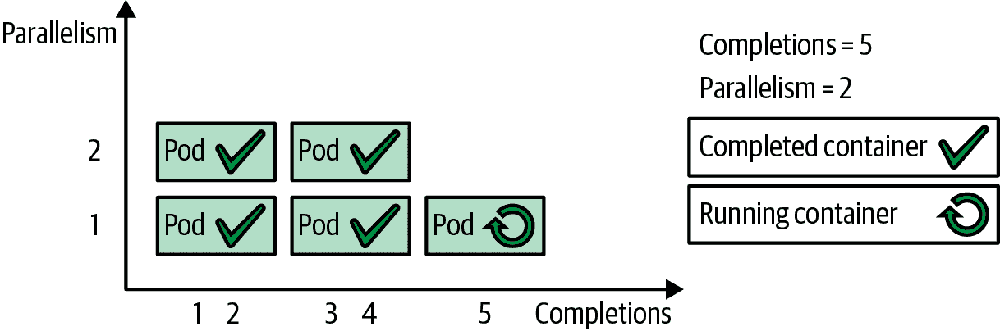

# 第七章：批处理作业

批处理作业模式适用于管理隔离的原子工作单元。它基于 Job 资源，在分布式环境中可靠地运行短暂的 Pods 直到完成。

# 问题

Kubernetes 中用于管理和运行容器的主要原语是 Pod。有多种创建 Pods 的方式，具有不同的特性：

裸露 Pod

可以手动创建一个 Pod 来运行容器。但是，当运行此类 Pod 的节点发生故障时，不会重新启动该 Pod。除了开发或测试目的外，不鼓励以这种方式运行 Pods。此机制也被称为*非托管*或*裸露 Pods*。

ReplicaSet

此控制器用于创建和管理预期持续运行的 Pods（例如，运行 Web 服务器容器）。它在任何给定时间保持一组稳定的副本 Pods 并保证一定数量的相同 Pods 的可用性。详细介绍 ReplicaSets 见第十一章，“无状态服务”。

DaemonSet

此控制器在每个节点上运行一个单独的 Pod，并用于管理平台功能，如监控、日志聚合、存储容器等。详细讨论见第九章，“守护进程服务”。

这些 Pods 的一个共同特点是它们代表长时间运行的进程，不打算在一定时间后停止。然而，在某些情况下，需要可靠地执行预定义的有限工作单元，然后关闭容器。为此任务，Kubernetes 提供了 Job 资源。

# 解决方案

Kubernetes Job 类似于 ReplicaSet，因为它创建一个或多个 Pods 并确保它们成功运行。然而，不同之处在于，一旦期望数量的 Pods 成功终止，Job 被视为完成，不会启动额外的 Pods。一个 Job 的定义看起来像示例 7-1。

##### 示例 7-1\. Job 规范

```
apiVersion: batch/v1
kind: Job
metadata:
  name: random-generator
spec:
  completions: 5                 
  parallelism: 2                 
  ttlSecondsAfterFinished: 300   
  template:
    metadata:
      name: random-generator
    spec:
      restartPolicy: OnFailure   
      containers:
      - image: k8spatterns/random-generator:1.0
        name: random-generator
        command: [ "java", "RandomRunner", "/numbers.txt", "10000" ]
```


Job 应该运行五个 Pods 完成，所有 Pods 必须成功。


两个 Pod 可以并行运行。


在回收之前，保留 Pods 五分钟（300 秒）。


对于 Job，指定 `restartPolicy` 是强制的。可能的值为 `OnFailure` 或 `Never`。

Job 和 ReplicaSet 定义之间的一个关键区别是 `.spec.template.spec.restartPolicy`。ReplicaSet 的默认值是 `Always`，适合必须一直运行的长时间进程。对于 Job，`Always` 不允许使用，唯一可能的选项是 `OnFailure` 或 `Never`。

那么，为什么要费心创建一个仅运行一次的 Job 而不使用裸露 Pods？使用 Jobs 提供了许多可靠性和可扩展性的优势，使它们成为首选选项：

+   A Job is not an ephemeral in-memory task but a persisted one that survives cluster restarts.

+   When a Job is completed, it is not deleted but is kept for tracking purposes. The Pods that are created as part of the Job are also not deleted but are available for examination (e.g., to check the container logs). This is also true for bare Pods but only for `restartPolicy: OnFailure`. You can still remove the Pods of a Job after a certain time by specifying `.spec.ttlSecondsAfterFinished`.

+   A Job may need to be performed multiple times. Using the `.spec.completions` field, it is possible to specify how many times a Pod should complete successfully before the Job itself is done.

+   When a Job has to be completed multiple times, it can also be scaled and executed by starting multiple Pods at the same time. That can be done by specifying the `.spec.parallelism` field.

+   A Job can be suspended by setting the field `.spec.suspend` to `true`. In this case, all active Pods are deleted and restarted if the Job is resumed (i.e., `.spec.suspend` set to `false` by the user).

+   If the node fails or when the Pod is evicted for some reason while still running, the scheduler places the Pod on a new healthy node and reruns it. Bare Pods would remain in a failed state as existing Pods are never moved to other nodes.

All of this makes the Job primitive attractive for scenarios requiring some guarantees for the completion of a unit of work.

The following two fields play major roles in the behavior of a Job:

`.spec.completions`

Specifies how many Pods should run to complete a Job.

`.spec.parallelism`

Specifies how many Pod replicas could run in parallel. Setting a high number does not guarantee a high level of parallelism, and the actual number of Pods may still be fewer (and in some corner cases, more) than the desired number (e.g., because of throttling, resource quotas, not enough completions left, and other reasons). Setting this field to 0 effectively pauses the Job.

图 7-1 显示了在 示例 7-1 中定义的具有完成计数为 5 和并行性为 2 的作业的处理过程。



###### 图 7-1\. 具有固定完成计数的并行批处理作业

Based on these two parameters, there are the following types of Jobs:

Single Pod Jobs

This type is selected when you leave out both `.spec.completions` and `.spec.parallelism` or set them to their default values of 1\. Such a Job starts only one Pod and is completed as soon as the single Pod terminates successfully (with exit code 0).

Fixed completion count Jobs

对于固定完成计数的作业，应将`.spec.completions`设置为所需的完成数。您可以设置`.spec.parallelism`，或者将其未设置，它将默认为 1。这种作业在`.spec.completions`数量的 Pod 成功完成后被视为已完成。示例 7-1 展示了这种模式的实际操作，当我们预先知道工作项的数量并且单个工作项的处理成本足以使用专用 Pod 时，这是最佳选择。

工作队列作业

对于工作队列作业，需要将`.spec.completions`设置为未设置，并将`.spec.parallelism`设置为大于 1 的数字。当至少一个 Pod 成功终止且所有其他 Pod 也终止时，工作队列作业被视为已完成。这种设置要求 Pod 之间进行协调，并确定每个 Pod 正在处理的内容，以便它们可以协调完成。例如，当队列中存储了一个固定但未知数量的工作项时，并行的 Pod 可以逐个获取这些工作项来处理。首个检测到队列为空并成功退出的 Pod 表明作业已完成。作业控制器等待所有其他 Pod 也终止。由于一个 Pod 处理多个工作项，这种作业类型非常适合细粒度的工作项，即当一个 Pod 处理一个工作项的开销不合理时。

索引作业

类似于*工作队列作业*，您可以将工作项分配给单独的作业，而无需外部工作队列。当使用固定完成计数并将完成模式`.spec.completionMode`设置为`Indexed`时，作业的每个 Pod 都会获得一个从 0 到`.spec.completions - 1`的关联索引。分配的索引可通过 Pod 注释`batch.kubernetes.io/job-completion-index`（请参阅第十四章，“自我意识”，了解如何从代码中访问此注释）或直接通过环境变量`JOB_COMPLETION_INDEX`获取，该变量设置为与此 Pod 关联的索引。有了这个索引，应用程序可以选择关联的工作项而无需任何外部同步。示例 7-2 展示了一个根据作业索引逐个处理单个文件行的作业。更实际的例子是，使用索引作业进行视频处理，其中并行的 Pod 正在处理从索引计算出的某个帧范围。

##### 示例 7-2\. 一个根据作业索引选择其工作项的索引作业

```
apiVersion: batch/v1
kind: Job
metadata:
  name: file-split
spec:
  completionMode: Indexed     
  completions: 5              
  parallelism: 5
  template:
    metadata:
      name: file-split
    spec:
      containers:
      - image: alpine
        name: split
        command:              
        - "sh"
        - "-c"
        - |
          start=$(expr $JOB_COMPLETION_INDEX \* 10000) 
          end=$(expr $JOB_COMPLETION_INDEX \* 10000 + 10000)
          awk "NR>=$start && NR<$end" /logs/random.log \ 
              > /logs/random-$JOB_COMPLETION_INDEX.txt
        volumeMounts:
        - mountPath: /logs    
          name: log-volume
      restartPolicy: OnFailure
```


启用索引完成模式。


并行运行五个 Pod 以完成。


执行一个打印给定文件*/logs/random.log*中一系列行的 Shell 脚本。预计该文件包含 50,000 行数据。


计算起始和结束行号。


使用 `awk` 打印一系列行号（`NR` 是在文件迭代过程中 `awk` 的内部行号）。


挂载来自外部卷的输入数据。这里没有显示卷；您可以在[示例存储库](https://oreil.ly/PkVF0)中找到完整的工作定义。

如果您有一个无限流的工作项需要处理，其他控制器如 ReplicaSet 更适合管理处理这些工作项的 Pods。

# 讨论

Job 抽象是一个相当基础但也是基本的原语，其他原语如 CronJobs 就是基于它的。Jobs 帮助将孤立的工作单元转变为可靠且可扩展的执行单元。但是，Job 并不规定您应该如何将可单独处理的工作项映射到 Jobs 或 Pods 中。这是您在考虑每个选项的利弊后需要确定的事项：

每个工作项一个 Job

这个选项需要创建 Kubernetes Jobs 的开销，同时意味着平台必须管理大量消耗资源的 Jobs。当每个工作项都是必须记录、跟踪或独立扩展的复杂任务时，这个选项非常有用。

一个工作项适合所有工作

对于不需要由平台独立跟踪和管理的大量工作项，这个选项是正确的。在这种情况下，必须通过批处理框架从应用程序内部管理工作项。

Job 原语仅提供调度工作项的最基本功能。任何复杂的实现都必须将 Job 原语与批处理应用程序框架（例如，在 Java 生态系统中，我们有 Spring Batch 和 JBeret 作为标准实现）结合起来，以实现期望的结果。

并非所有服务都必须全天候运行。一些服务必须按需运行，一些在特定时间运行，一些定期运行。使用 Jobs 可以在需要时运行 Pods，并且只在任务执行期间运行。Jobs 被调度到具有所需容量的节点上，满足 Pod 放置策略，并考虑其他容器依赖性考虑因素。对于短暂任务使用 Jobs 而不是使用长时间运行的抽象（例如 ReplicaSet），可以为平台上的其他工作负载节省资源。所有这些使得 Jobs 成为一个独特的基元，而 Kubernetes 则支持多样化的工作负载。

# 更多信息

+   [批处理作业示例](https://oreil.ly/PkVF0)

+   [Jobs](https://oreil.ly/I2Xum)

+   [使用扩展进行并行处理](https://oreil.ly/mNmhN)

+   [使用工作队列进行粗粒度并行处理](https://oreil.ly/W5aqH)

+   [使用工作队列进行精细并行处理](https://oreil.ly/-8FBt)

+   [使用静态工作分配的索引作业进行并行处理](https://oreil.ly/2B2Nn)

+   [在 Kubernetes 上使用 Spring Batch：高效的批处理处理](https://oreil.ly/8dLDo)

+   [JBeret 介绍](https://oreil.ly/YyYxy)
