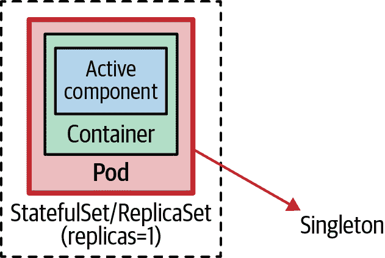
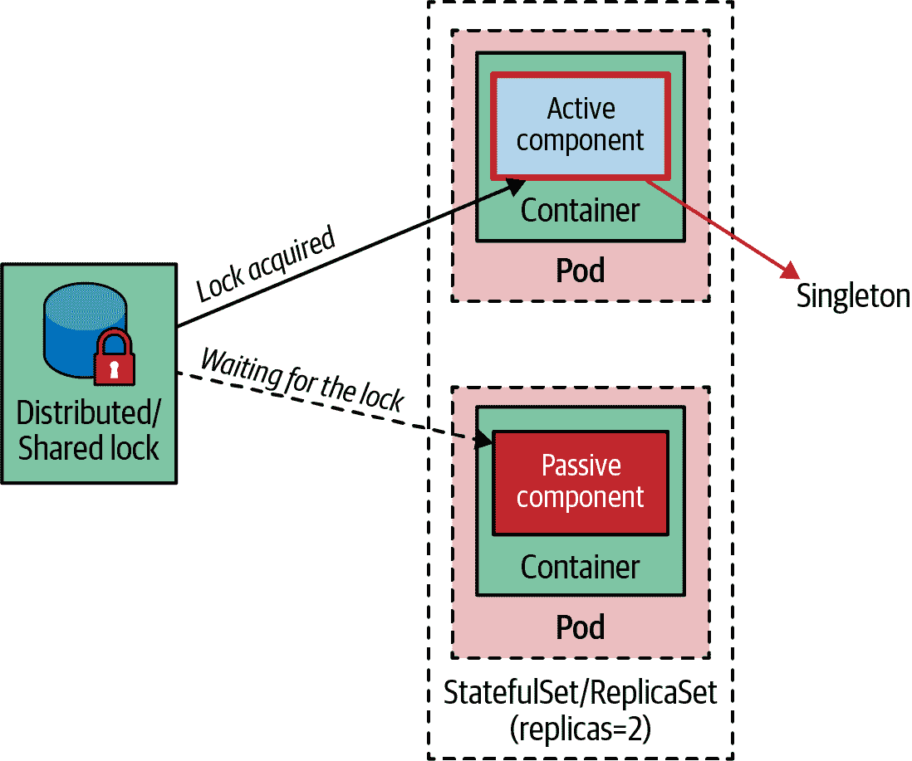

# 第十章：单例服务

*单例服务*模式确保在任何时候只有一个应用实例处于活动状态，并且具有高可用性。该模式可以从应用程序内部实现，也可以完全委托给 Kubernetes。

# 问题

Kubernetes 提供的主要功能之一是轻松和透明地扩展应用程序。Pod 可以通过诸如 `kubectl scale` 这样的单个命令或者通过像 ReplicaSet 这样的控制器定义声明式地扩展，甚至可以根据应用程序负载动态扩展，正如我们在第二十九章 “弹性扩展”中描述的那样。通过运行多个相同服务的实例（不是 Kubernetes Service，而是由 Pod 表示的分布式应用程序的组件），系统通常会提高吞吐量和可用性。可用性提高是因为如果某个服务实例变得不健康，请求调度器将将未来的请求转发到其他健康的实例。在 Kubernetes 中，多个实例是 Pod 的副本，而 Service 资源负责请求分发和负载均衡。

然而，在某些情况下，只允许同时运行一个服务实例。例如，如果服务中有一个周期性执行的任务，并且有多个相同服务的实例，每个实例都会在预定间隔触发任务，导致重复执行，而不是按预期只触发一个任务。另一个例子是一个服务在特定资源（文件系统或数据库）上执行轮询，我们希望确保只有一个实例甚至一个线程执行轮询和处理。第三种情况发生在我们必须以保持顺序的方式从消息代理中消费消息，并且使用单线程消费者同时也是单例服务。

在所有这些类似情况中，我们需要控制同时处于活动状态的服务实例数量（通常只需要一个），同时确保高可用性，无论启动并保持运行的实例数量有多少。

# 解决方案

运行多个相同 Pod 的副本创建了一个 *活跃-活跃* 的拓扑结构，其中所有服务实例都是活跃的。我们需要的是一个 *活跃-被动* 的拓扑结构，其中只有一个实例是活跃的，其他所有实例都是被动的。从根本上说，可以通过应用外和应用内的锁定在两个可能的层次上实现这一目标。

## 应用外锁定

正如其名称所示，这种机制依赖于一个管理进程，该进程位于应用程序外部，以确保应用程序只运行单个实例。应用程序本身对此约束并不知情，并且作为单例实例运行。从这个角度来看，它类似于由管理运行时（如 Spring 框架）仅实例化一次的 Java 类。类的实现不知道它是作为单例运行的，也不包含任何代码结构来防止多次实例化。

图 10-1 展示了如何通过 StatefulSet 或 ReplicaSet 控制器实现应用程序外的锁定，其中只有一个副本。



###### 图 10-1\. 应用程序外的锁定机制

在 Kubernetes 中实现这一点的方法是启动单个 Pod。仅此活动并不确保单例 Pod 具有高可用性。我们还必须通过诸如 ReplicaSet 的控制器将该单例 Pod 背后的实现转换为高可用单例。这种拓扑结构并非完全是 *主备模式*（没有备用实例），但效果相同，因为 Kubernetes 确保始终运行一个 Pod 实例。此外，由于控制器执行健康检查（如 第 4 章，“健康探测” 中描述的方式）并在发生故障时修复 Pod，因此单个 Pod 实例具有高可用性。

使用这种方法需要特别关注副本数，不要因意外操作而改变它。在本节中，您将了解到我们如何通过 PodDisruptionBudget 自愿减少副本数，但没有平台级机制可以防止副本数的增加。

并不完全准确地说一直只有一个实例在运行，特别是在出现问题时。Kubernetes 的原语如 ReplicaSet 更倾向于可用性而非一致性——这是实现高可用和可扩展分布式系统的有意决策。这意味着 ReplicaSet 应用的是“至少”而不是“至多”的语义来管理其副本。如果我们将 ReplicaSet 配置为单例模式，即 `replicas: 1`，控制器会确保始终至少运行一个实例，但偶尔可能会有更多实例存在。

这里最常见的边界情况是，一个具有控制器管理的 Pod 的节点变得不健康并与 Kubernetes 集群的其余部分断开连接。在这种情况下，ReplicaSet 控制器会在健康节点上启动另一个 Pod 实例（假设有足够的容量），而不确保断开连接节点上的 Pod 被关闭。同样地，当更改副本数或将 Pod 重新定位到不同节点时，Pod 数量可能会暂时超过所需数量。这种临时增加是为了确保高可用性并避免中断，这在无状态和可扩展的应用程序中是必要的。

单例（Singleton）虽然可以具备弹性和恢复能力，但从定义上来说，它们并不具备高可用性。单例通常更注重一致性而非可用性。在 Kubernetes 中，同样偏向一致性而提供严格单例保证的资源是 StatefulSet。如果 ReplicaSets 对你的应用程序未提供所需的保证，并且你有严格的单例要求，那么 StatefulSets 可能是答案。StatefulSets 专为有状态应用程序设计，提供许多功能，包括更强的单例保证，但也带来了更高的复杂性。我们在 第十二章，“有状态服务” 中详细讨论了单例的相关问题并深入介绍了 StatefulSets。

通常，在 Kubernetes 上运行的单例应用程序会在 Pod 中向消息代理、关系型数据库、文件服务器或其他运行在其他 Pod 或外部系统上的系统打开出站连接。然而，偶尔你的单例 Pod 可能需要接受传入连接，在 Kubernetes 上启用这一功能的方法是通过 Service 资源。

我们在 第十三章，“服务发现” 中深入探讨了 Kubernetes 服务，但在这里让我们简要讨论适用于单例的部分。一个常规的服务（使用 `type: ClusterIP`）会创建一个虚拟 IP，并在其选择器匹配的所有 Pod 实例之间进行负载均衡。然而，通过 StatefulSet 管理的单例 Pod 只有一个 Pod 和一个稳定的网络标识。在这种情况下，最好创建一个*无头服务*（通过设置 `type: ClusterIP` 和 `clusterIP: None`）。它被称为*无头*，因为这样的服务没有虚拟 IP 地址，kube-proxy 不处理这些服务，并且平台不进行代理。

然而，这样的 Service 仍然很有用，因为具有选择器的无头 Service 在 API 服务器中创建端点记录，并为匹配的 Pod(s) 生成 DNS A 记录。因此，对 Service 的 DNS 查找不返回其虚拟 IP，而是返回与后端 Pod(s) 的 IP 地址。这使得可以通过 Service 的 DNS 记录直接访问单例 Pod，而无需通过 Service 的虚拟 IP。例如，如果我们创建一个名为 `my-singleton` 的无头 Service，则可以使用 `my-singleton.default.svc.cluster.local` 直接访问 Pod 的 IP 地址。

总之，对于至少需要一个实例的非严格单例，定义一个带有一个副本的 ReplicaSet 就足够了。这种配置有利于可用性，并确保至少有一个可用实例，有时在某些极端情况下可能会有更多。对于具有 At-Most-One 要求和更好性能的严格单例，推荐使用 StatefulSet 和无头 Service。使用 StatefulSet 将有利于一致性，并确保存在一个最多一个实例，有时在某些极端情况下可能一个实例都没有。您可以在第十二章，“Stateful Service”中找到一个完整的示例，需要将副本数更改为一个以使其成为单例。

## 应用内锁定

在分布式环境中，控制服务实例数量的一种方法是通过分布式锁，如图 10-2 所示。每当服务实例或实例内的组件被激活时，它可以尝试获取锁，如果成功，则服务变为活动状态。任何后续的服务实例如果无法获取锁，则等待并持续尝试获取锁，以防当前活动服务释放锁。

许多现有的分布式框架使用此机制来实现高可用性和韧性。例如，消息代理 Apache ActiveMQ 可以在高可用的*主备*拓扑结构中运行，其中数据源提供了共享锁。第一个启动的代理实例会获取锁并成为活动实例，任何后续启动的实例则变为被动实例并等待锁释放。这种策略确保只有一个活动的代理实例，并且对故障具有韧性。



###### 图 10-2\. 应用内锁定机制

我们可以将这种策略与面向对象世界中的经典 Singleton 进行比较：*Singleton*是存储在静态类变量中的对象实例。在此示例中，类知道自己是单例，并且编写方式不允许同一进程中实例化多个实例。在分布式系统中，这意味着容器化应用本身必须以一种方式编写，不允许同时存在多个活动实例，无论启动了多少个 Pod 实例。要在分布式环境中实现此目标，首先需要一个分布式锁实现，例如 Apache ZooKeeper、HashiCorp 的 Consul、Redis 或 etcd。

在使用 ZooKeeper 的典型实现中，使用临时节点，只要客户端会话存在，节点就存在，并且在会话结束时删除。第一个启动的服务实例在 ZooKeeper 服务器上启动会话，并创建临时节点以成为活动节点。同一集群中的所有其他服务实例变为被动状态，并等待临时节点被释放。这是基于 ZooKeeper 的实现确保整个集群中只有一个活动服务实例，从而实现主备故障转移行为。

在 Kubernetes 世界中，与其仅管理用于锁定功能的 ZooKeeper 集群，更好的选择是利用通过 Kubernetes API 暴露的 etcd 功能，并在主节点上运行。etcd 是一个分布式键值存储，使用 Raft 协议维护其复制状态，并提供实施领导者选举的必要构建块。例如，Kubernetes 提供了 Lease 对象，用于节点心跳和组件级领导者选举。对于每个节点，都有一个匹配名称的 Lease 对象，并且每个节点上的 Kubelet 通过更新 Lease 对象的`renewTime`字段来保持心跳运行。Kubernetes 控制平面使用此信息来确定节点的可用性。在高度可用的集群部署场景中，Kubernetes Lease 还用于确保仅有单个控制平面组件（如 kube-controller-manager 和 kube-scheduler）处于活动状态，而其他实例保持待命。

另一个例子是 Apache Camel，在其中具有 Kubernetes 连接器，还提供了领导者选举和单例能力。此连接器更进一步，而不是直接访问 etcd API，而是使用 Kubernetes API 利用 ConfigMaps 作为分布式锁。它依赖于 Kubernetes 对编辑诸如 ConfigMaps 等资源的乐观锁定保证，其中只有一个 Pod 可以一次更新一个 ConfigMap。Camel 实现利用此保证确保只有一个 Camel 路由实例处于活动状态，任何其他实例必须等待并获取锁定才能激活。这是一个锁的自定义实现，但实现了相同的目标：当有多个具有相同 Camel 应用程序的 Pod 时，只有一个成为活动单例，其他的处于被动模式等待。

Dapr 项目提供了更通用的*单例服务*模式实现。Dapr 的分布式锁构建模块提供了 API（HTTP 和 gRPC），可替换实现以实现对共享资源的互斥访问。其思想是每个应用程序确定锁授予访问权限的资源。然后，同一应用程序的多个实例使用命名锁来独占访问共享资源。在任何时刻，只有一个应用程序实例可以持有命名锁。所有其他应用程序实例无法获取该锁，因此不允许访问共享资源，直到通过解锁或锁超时释放该锁。由于其基于租约的锁定机制，如果应用程序获取锁定，遇到异常并且无法释放锁定，则在一定时间后使用租约自动释放锁定。这在应用程序故障时防止资源死锁。在这个通用的分布式锁 API 背后，Dapr 将配置为使用某种存储和锁实现。应用程序可以使用此 API 实现对共享资源或应用内单例的访问。

使用 Dapr、ZooKeeper、etcd 或任何其他分布式锁实现的实现类似于上述描述的实现：应用程序的一个实例成为领导者并激活自身，而其他实例则处于被动状态并等待锁定。这确保即使启动了多个 Pod 副本并且所有副本都健康、启动并运行，也只有一个服务是活动的并作为单例执行业务功能，其他实例则等待获取锁定，以防领导者失败或关闭。

## Pod Disruption Budget

虽然单例服务和领导者选举试图限制同时运行的服务实例的最大数量，但 Kubernetes 的 PodDisruptionBudget 功能提供了一种互补且有些相反的功能——限制同时处于维护状态的实例数量。

在其核心，PodDisruptionBudget 确保在任何时间点不会自愿从节点上驱逐一定数量或百分比的 Pod。这里的“自愿”意味着可以延迟一段时间的驱逐，例如通过为维护或升级（`kubectl drain`）而触发的驱逐，或者通过集群缩减，而不是节点变得不健康，这是无法预测或控制的。

Example 10-1 中的 PodDisruptionBudget 适用于与其选择器匹配的 Pod，并确保始终有两个 Pod 可用。

##### 示例 10-1\. PodDisruptionBudget

```
apiVersion: policy/v1
kind: PodDisruptionBudget
metadata:
  name: random-generator-pdb
spec:
  selector:
    matchLabels:             
      app: random-generator
  minAvailable: 2            
```


选择器以计算可用 Pod 的数量。


必须至少有两个 Pod 可用。您还可以指定一个百分比，如 80%，以配置只有匹配 Pod 的 20%可能被驱逐。

除了`.spec.minAvailable`之外，还有使用`.spec.maxUnavailable`的选项，该选项指定驱逐后可以不可用的 Pod 数量。与`.spec.minAvailable`类似，它可以是绝对数量或百分比，但有一些额外的限制。在单个 PodDisruptionBudget 中只能指定`.spec.minAvailable`或`.spec.maxUnavailable`之一，然后它只能用于控制具有相关控制器（如 ReplicaSet 或 StatefulSet）的 Pod 的驱逐。对于不由控制器管理的 Pod（也称为*裸露*或*naked* Pods），应考虑 PodDisruptionBudget 的其他限制。

PodDisruptionBudget 对于需要始终运行最少副本以确保法定人数的基于法定人数的应用程序非常有用。或者当应用程序提供关键流量时，它永远不应低于总实例数的一定百分比。

在单例的上下文中，PodDisruptionBudget 也很有用。例如，将`maxUnavailable`设置为`0`或将`minAvailable`设置为`100%`将防止任何自愿驱逐。将工作负载的自愿驱逐设置为零将其转变为不可驱逐的 Pod，并将永远阻止节点的排空。这可以用作在集群操作员必须在意外驱逐非高可用性 Pod 之前与单例工作负载所有者联系停机的过程中的一步。StatefulSet 与 PodDisruptionBudget 以及无头 Service 是在运行时控制和帮助实例计数的 Kubernetes 原语，并且在本章中值得一提。

# 讨论

如果您的使用场景需要强的单例保证，那么您无法依赖于副本集之外的锁定机制。Kubernetes 副本集旨在保持其 Pod 的可用性，而不是确保 Pod 的最多一次语义。因此，有许多故障场景下会出现短时间内两个 Pod 并发运行（例如，当运行单例 Pod 的节点与集群的其余部分断开连接时——例如，当替换已删除的 Pod 实例时）。如果这不可接受，请使用有状态集，或调查提供您更大控制权的应用内锁定选项，这些选项可以增强领导选举过程的保证。后者还减轻了由于更改副本数导致 Pod 不小心扩展的风险。您可以将其与 Pod 中断预算结合使用，防止自愿驱逐和中断您的单例工作负载。

在其他情况下，仅容器化应用程序的一部分应是单例。例如，有可能是一个提供 HTTP 端点的容器化应用程序，它是安全的，可以扩展为多个实例，但还有一个必须是单例的轮询组件。使用外部锁定方法将阻止整个服务的扩展。在这种情况下，我们要么必须拆分单例组件的部署单元，以保持其为单例（理论上很好，但不总是实际可行或值得付出额外的开销），要么使用应用内锁定机制，只锁定必须是单例的组件。这将允许我们透明地扩展整个应用程序，使 HTTP 端点被扩展，其他部分作为*活动-被动*的单例。

# 更多信息

+   [单例服务示例](https://oreil.ly/aGoPv)

+   [租约](https://oreil.ly/tb9aX)

+   [为您的应用程序指定中断预算](https://oreil.ly/W1ABD)

+   [Go 客户端中的领导选举](https://oreil.ly/NU1aN)

+   [Dapr: 分布式锁概述](https://oreil.ly/ES8Ve)

+   [在 Kubernetes 上创建集群单例服务](https://oreil.ly/K8zI1)

+   [Akka: Kubernetes 租约](https://oreil.ly/tho5T)
