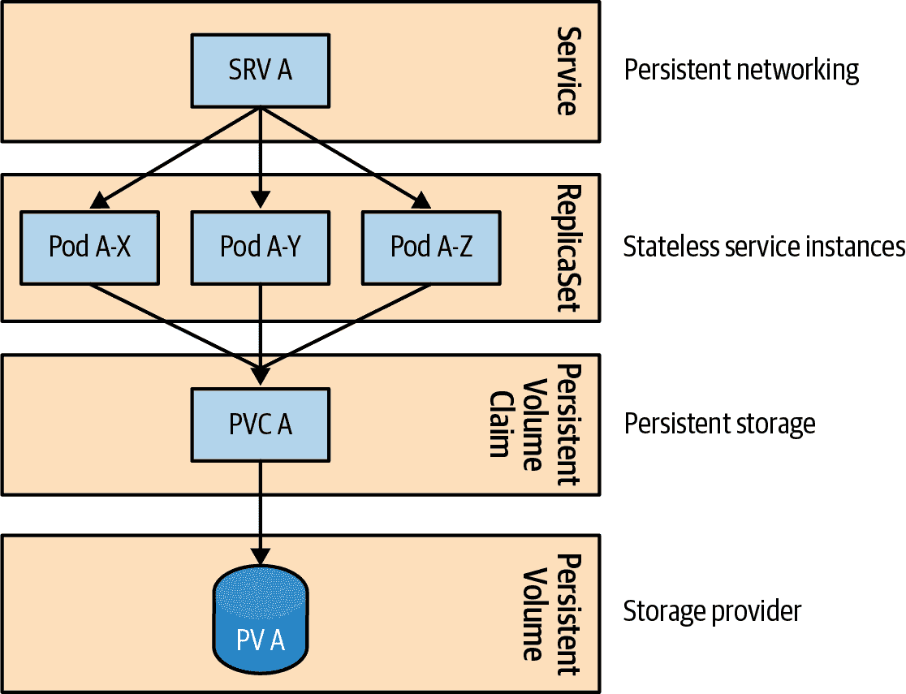

# 第十一章：无状态服务

*无状态服务*模式描述了如何创建和操作由相同的短暂副本组成的应用程序。这些应用程序最适合于动态云环境，可以快速扩展并保持高可用性。

# 问题

微服务架构风格是实现新的云原生应用的主要选择。这种架构的驱动原则之一是如何处理单一关注点，如何管理自己的数据，以及如何有一个良好封装的部署边界等。通常，这类应用还遵循[十二因素应用原则](https://12factor.net)，这使它们可以在动态云环境中与 Kubernetes 轻松操作。

应用一些这些原则需要理解业务域、确定服务边界，或在服务实现过程中应用领域驱动设计或类似的方法。实施其他一些原则可能涉及使服务短暂化，这意味着服务可以在没有副作用的情况下创建、扩展和销毁。当服务是无状态而不是有状态时，更容易解决这些后者关注点。

无状态服务在服务间交互时不会在实例内部保留任何状态。在我们的背景下，这意味着如果容器在其内部存储（内存或临时文件系统）中不保存任何来自请求的信息（这些信息对于处理未来请求是关键的），则容器是无状态的。无状态进程不会存储或引用过去请求的任何信息，因此每个请求都像从头开始一样。相反，如果进程需要存储这样的信息，则应将其存储在外部存储中，例如数据库、消息队列、挂载文件系统或其他可以被其他实例访问的数据存储中。一个好的思维实验是想象你的服务实例部署在不同节点上，有一个负载均衡器将请求随机分发给这些实例，而没有任何粘性会话（即客户端和特定服务实例之间没有关联）。如果服务能够在这种设置中完成其目的，它很可能是无状态的服务（或者它有一种状态在实例之间分发的机制，比如数据网格）。

无状态服务由相同、可替换的实例组成，通常将状态转移到外部永久存储系统，并使用负载均衡器在它们之间分配传入请求。在本章中，我们将具体看到哪些 Kubernetes 抽象可以帮助操作这样的无状态应用程序。

# 解决方案

在第三章，“声明式部署”中，您学习了如何使用部署（Deployment）的概念来控制应用程序如何升级到下一个版本，使用`RollingUpdate`和`Recreate`策略。但这只涉及部署的升级方面。从更广泛的角度来看，部署代表了集群中部署的应用程序。Kubernetes 没有`Application`或`Container`作为顶级实体的概念。相反，一个应用程序通常由由 ReplicaSet、Deployment 或 StatefulSet 管理的一组 Pod 组成，结合 ConfigMap、Secret、Service、PersistentVolumeClaim 等。用于管理无状态 Pod 的控制器是 ReplicaSet，但它是部署使用的低级内部控制结构。部署是推荐的用户面向抽象化，用于创建和更新无状态应用程序，它在后台创建和管理 ReplicaSets。当部署提供的更新策略不合适，或需要自定义机制，或根本不需要控制更新过程时，应使用 ReplicaSet。

## 实例

ReplicaSet 的主要目的是确保任何给定时间运行指定数量的相同 Pod 副本。ReplicaSet 定义的主要部分包括副本数指示应该维护多少 Pod、选择器指定如何识别其管理的 Pod，以及用于创建新 Pod 副本的 Pod 模板。然后，ReplicaSet 根据需要创建和删除 Pod 以维护所需的副本数量，使用给定的 Pod 模板，正如示例 11-1 所示。

##### 示例 11-1\. 用于无状态 Pod 的 ReplicaSet 定义

```
apiVersion: apps/v1
kind: ReplicaSet
metadata:
  name: rg
  labels:
    app: random-generator
spec:
  replicas: 3               
  selector:                 
    matchLabels:
      app: random-generator
  template:                 
    metadata:
      labels:
        app: random-generator
    spec:
      containers:
      - name: random-generator
        image: k8spatterns/random-generator:1.0
```


维护运行的 Pod 副本的期望数量。


用于识别要管理的 Pod 的标签选择器。


模板指定用于创建新 Pod 的数据。

当 ReplicaSet 需要创建新的 Pod 以满足所需的副本数时，将使用该模板。但 ReplicaSet 并不局限于管理模板中指定的 Pod。如果一个裸 Pod 没有所有者引用（意味着它不由控制器管理），并且它与标签选择器匹配，那么它将通过设置所有者引用被获取，并由 ReplicaSet 管理。这种设置可能导致 ReplicaSet 拥有由不同方式创建的非相同的一组 Pod，并终止超过声明的副本计数的现有裸 Pod。为了避免这种不良副作用，建议确保裸 Pod 不具有与 ReplicaSet 选择器匹配的标签。

无论您是直接创建 ReplicaSet 还是通过部署，最终结果都是创建并维护所需数量的相同 Pod 副本。使用部署的附加好处是，我们可以控制副本如何升级和回滚，我们在第三章，“声明式部署”中详细描述了这一点。接下来，根据我们在第六章，“自动化部署”中介绍的策略，将副本调度到可用节点。ReplicaSet 的工作是在需要时重新启动容器，并在副本数量增加或减少时扩展或缩减。通过这种行为，部署和 ReplicaSet 可以自动化无状态应用程序的生命周期管理。

## 网络

由 ReplicaSet 创建的 Pod 是暂时的，可能随时消失，例如当 Pod 因资源匮乏而被驱逐或因运行 Pod 的节点失败时。在这种情况下，ReplicaSet 将创建一个新的 Pod，该 Pod 将具有新的名称、主机名和 IP 地址。如果应用程序是无状态的，正如我们在本章前面所定义的，新请求应该像处理任何其他 Pod 一样处理从新创建的 Pod 进来。

根据容器内的应用程序如何连接到其他系统以接受请求或轮询消息的方式，例如，您可能需要一个 Kubernetes 服务。如果应用程序正在启动到消息代理或数据库的出站连接，并且这是它交换数据的唯一方式，那么就不需要 Kubernetes 服务。但更常见的是，无状态服务通过同步请求/响应驱动的协议（如 HTTP 和 gRPC）被其他服务联系。由于 Pod IP 地址在每次 Pod 重启时都会更改，因此最好使用基于 Kubernetes 服务的固定 IP 地址，以便服务使用者可以使用。Kubernetes 服务具有在服务生命周期内不变的固定 IP 地址，并确保客户端请求始终在实例之间进行负载均衡，并路由到健康且准备好接受请求的 Pod。我们在第十三章，“服务发现”中涵盖了不同类型的 Kubernetes 服务。在示例 11-2 中，我们使用一个简单的服务在集群内部向其他 Pod 公开 Pod。

##### 示例 11-2\. 暴露一个无状态服务

```
apiVersion: v1
kind: Service
metadata:
  name: random-generator    
spec:
  selector:                 
    app: random-generator
  ports:
  - port: 80
    targetPort: 8080
    protocol: TCP
```


可用于访问匹配 Pod 的服务名称。


从 ReplicaSet 匹配 Pod 标签的选择器。

此示例中的定义将创建名为 `random-generator` 的服务，该服务在端口 80 上接受 TCP 连接，并将其路由到所有匹配的带有选择器 `app: random-generator` 的 Pod 的端口 8080。一旦创建了服务，它将被分配一个 `clusterIP`，该 IP 只能从 Kubernetes 集群内部访问，并且只要服务定义存在，该 IP 将保持不变。这充当了所有匹配的 Pod 的永久入口点，这些 Pod 是短暂的并且具有变化的 IP 地址。

请注意，部署和生成的副本集仅负责维护与标签选择器匹配的无状态 Pod 的所需数量。它们不知道任何可能将流量引导到相同一组 Pod 或不同组合的 Kubernetes 服务。

## 存储

少数无状态服务不需要任何状态，只能基于每个请求提供的数据处理请求。大多数无状态服务需要状态，但它们是无状态的，因为它们将状态转移到某些其他有状态系统或数据存储，例如文件系统。无论是由 ReplicaSet 创建的 Pod 还是其他方式创建的，都可以通过卷声明并使用文件存储。可以使用不同类型的卷存储状态。其中一些是特定于云提供商的存储，而其他允许挂载网络存储甚至共享节点上的文件系统。在本节中，我们将介绍 `persistentVolumeClaim` 卷类型，它允许您使用手动或动态配置的持久存储。

持久卷（PV）代表 Kubernetes 集群中的存储资源抽象，其生命周期独立于任何正在使用它的 Pod 生命周期。Pod 不能直接引用 PV；然而，Pod 使用持久卷声明（PVC）来请求并绑定到 PV，后者指向实际的持久存储。这种间接连接允许关注点分离，并使 Pod 生命周期与 PV 解耦。集群管理员可以配置存储供应并定义 PV。创建 Pod 定义的开发人员可以使用 PVC 使用存储。通过这种间接方式，即使删除了 Pod，PV 的所有权仍然附加到 PVC 并继续存在。示例 11-3 展示了可以在 Pod 模板中使用的存储声明。

##### 示例 11-3\. 用于 PersistentVolume 的声明。

```
apiVersion: v1
kind: PersistentVolumeClaim
metadata:
  name: random-generator-log  
spec:
  storageClassName: "manual"
  accessModes:
   - ReadWriteOnce            
  resources:
   requests:
    storage: 1Gi              
```


可以从 Pod 模板中引用的声明名称。


表示只有一个节点可以挂载该卷进行读写操作。


请求 1 GiB 的存储空间。

一旦定义了 PVC，就可以通过`persistentVolumeClaim`字段从 Pod 模板引用它。PersistentVolumeClaim 的一个有趣字段是`accessModes`。它控制存储如何挂载到节点并被 Pod 消耗。例如，网络文件系统可以挂载到多个节点，并且可以同时允许多个应用程序读取和写入。其他存储实现一次只能挂载到单个节点，并且只能被调度在该节点上的 Pod 访问。让我们看看 Kubernetes 提供的不同`accessModes`：

ReadWriteOnce

这代表一种一次只能挂载到单个节点的卷。在此模式下，运行在节点上的一个或多个 Pod 可以执行读取和写入操作。

ReadOnlyMany

卷可以挂载到多个节点，但只允许所有 Pod 进行只读操作。

ReadWriteMany

在此模式下，卷可以被多个节点挂载，并允许读取和写入操作。

ReadWriteOncePod

注意到到目前为止描述的所有访问模式都提供了每个节点的粒度。即使`ReadWriteOnce`允许同一节点上的多个 Pod 同时从同一卷读取和写入。只有`ReadWriteOncePod`访问模式保证只有一个 Pod 可以访问卷。在最多允许一个写入应用程序访问数据以确保数据一致性的情况下，这是无价的。请谨慎使用此模式，因为它会将您的服务转变为单例，并阻止扩展。如果另一个 Pod 副本使用相同的 PVC，该 Pod 将无法启动，因为 PVC 已被另一个 Pod 使用。截至目前，`ReadWriteOncePod`也不支持抢占，这意味着优先级较低的 Pod 将保留存储空间，并且不会被抢占以让出节点给等待相同`ReadWriteOncePod`声明的优先级较高的 Pod。

在一个 ReplicaSet 中，所有 Pod 都是相同的；它们共享相同的 PVC 并引用相同的 PV。这与下一章中介绍的 StatefulSets 形成对比，在 StatefulSets 中，为每个有状态的 Pod 副本动态创建 PVC。这是 Kubernetes 中处理无状态和有状态工作负载的主要区别之一。

# 讨论

复杂的分布式系统通常由多个服务组成，其中一些将是有状态的并执行某种形式的分布式协调，一些可能是短暂的作业，一些可能是高度可扩展的无状态服务。无状态服务由相同、可互换、短暂和可替换的实例组成。它们非常适合处理短暂的请求，并且可以在实例之间没有任何依赖关系的情况下快速扩展和缩减。正如在图 11-1 中所示，Kubernetes 提供了许多有用的原语来管理这些应用程序。



###### 图 11-1\. Kubernetes 上的分布式无状态应用程序

在最低层次上，Pod 抽象确保一个或多个容器通过活力检查始终处于运行状态。基于此，ReplicaSet 还确保在健康节点上始终运行所需数量的无状态 Pod。部署自动化处理了 Pod 副本的升级和回滚机制。当有流量进入时，Service 抽象会发现并将流量分发到通过健康性检查的 Pod 实例。当需要持久文件存储时，PVC 可以请求并挂载存储。

尽管 Kubernetes 提供了这些构建模块，但不会强制执行它们之间的直接关系。你需要负责将它们组合以适应应用的特性。你必须理解活力检查和 ReplicaSet 如何控制 Pod 的生命周期，以及它们与就绪探针和服务定义的关系，后者控制流量如何指向 Pod。你还需要理解 PVC 和 `accessMode` 如何控制存储挂载和访问方式。当 Kubernetes 的原语不够用时，你应该了解如何与其他框架（如 Knative 和 KEDA）结合，以及如何实现自动伸缩，甚至将无状态应用程序转换为无服务器。后面的框架在 第二十九章，“弹性伸缩” 中有详细介绍。

# 更多信息

+   [无状态服务示例](https://oreil.ly/h0Ytj)

+   [ReplicaSet](https://oreil.ly/XugMo)

+   [持久卷](https://oreil.ly/HvApe)

+   [存储类](https://oreil.ly/qxFrz)

+   [访问模式](https://oreil.ly/iovaa)
