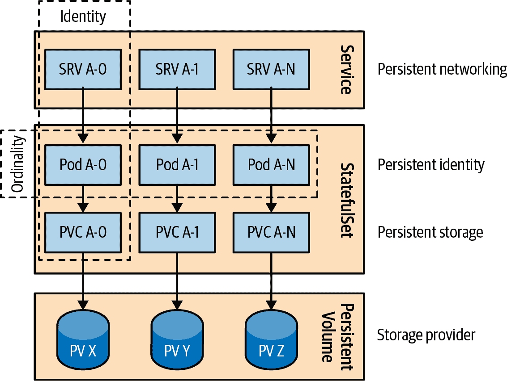

# 第十二章：有状态服务

分布式有状态应用程序需要持久标识、网络、存储和序列。*有状态服务*模式描述了提供这些构建块及强保证的 StatefulSet 原语，非常适合管理有状态应用程序。

# 问题

我们已经看到许多 Kubernetes 原语用于创建分布式应用程序：带有健康检查和资源限制的容器，具有多个容器的 Pod，动态的整个集群放置，批处理作业，定时作业，单例等等。这些原语的共同特征是它们将托管应用程序视为由相同、可交换和可替换容器组成的无状态应用，并符合[十二因素应用原则](https://12factor.net)。

有一个平台负责处理无状态应用的放置、弹性和扩展，这对提升显著，但仍需考虑大部分工作负载：有状态应用，其中每个实例都是独特的，具有长期特性。

在现实世界中，每个高度可扩展的无状态服务背后通常是一个有状态服务，通常以数据存储的形式存在。在 Kubernetes 初期，缺乏对有状态工作负载的支持时，解决方案是将无状态应用放置在 Kubernetes 上，以获得云原生模型的好处，并将有状态组件保留在集群外，无论是在公共云还是本地硬件上，通过传统的非云原生机制进行管理。考虑到每个企业都有大量的有状态工作负载（传统和现代），Kubernetes 对有状态工作负载的不支持是一个显著的限制，尽管它被认为是一个通用的云原生平台。

那么，有状态应用程序的典型要求是什么呢？我们可以通过使用 Deployment 部署诸如 Apache ZooKeeper、MongoDB、Redis 或 MySQL 等有状态应用程序，这样可以创建一个 ReplicaSet，并设置 `replicas=1` 以确保其可靠性，使用 Service 发现其终端点，并使用 PersistentVolumeClaim（PVC）和 PersistentVolume（PV）作为其状态的永久存储。

虽然这在单实例有状态应用程序中大体上是真的，但并非完全正确，因为 ReplicaSet 不保证 At-Most-One 语义，并且副本的数量可能会暂时变化。对于分布式有状态应用程序，这种情况可能非常危险，导致数据丢失。而且，当涉及由多个实例组成的分布式有状态服务时，主要的挑战在于来自基础架构的多方面保证。让我们看看分布式有状态应用程序最常见的长期持久性先决条件。

## 存储

我们可以轻松增加 ReplicaSet 中的`副本`数量，并最终得到一个分布式有状态应用程序。然而，在这种情况下，我们如何定义存储需求呢？通常情况下，像之前提到的那样的分布式有状态应用程序需要为每个实例提供专用的持久化存储。具有 `replicas=3` 的 ReplicaSet 和 PVC 定义将导致所有三个 Pod 连接到同一个 PV。虽然 ReplicaSet 和 PVC 确保实例处于运行状态并且存储已附加到实例所调度的任何节点，但存储并非专用，而是在所有 Pod 实例之间共享。

另一种解决方案是让应用程序实例共享存储，并使用应用程序内的机制将存储拆分为子文件夹并无冲突地使用。虽然可行，但这种方法会导致单点故障存在于单一存储中。此外，由于 Pod 数量在扩展期间变化，这种方法容易出现错误，并可能在扩展期间导致严重的数据损坏或丢失挑战。

另一个解决方法是为分布式有状态应用程序的每个实例单独创建一个 `replicas=1` 的 ReplicaSet。在这种情况下，每个 ReplicaSet 将获得其 PVC 和专用存储。这种方法的缺点是其工作量大：扩展需要创建新的 ReplicaSet、PVC 或 Service 定义集合。这种方法缺乏一个单一的抽象来管理所有状态应用程序实例。

## 网络

与存储要求类似，分布式有状态应用程序需要稳定的网络标识。除了将特定于应用程序的数据存储到存储空间中外，有状态应用程序还存储诸如主机名和其对等体的连接详细信息等配置详细信息。这意味着每个实例应该以可预测的地址可达，这种地址在 ReplicaSet 中的 Pod IP 地址中不会动态更改。在这里，我们可以再次通过一个解决方案来满足这个需求：为每个 ReplicaSet 创建一个 Service 并设置 `replicas=1`。然而，管理这样的设置是手工操作，而且应用程序本身无法依赖于稳定的主机名，因为每次重新启动后都会更改，并且也不知道其从何处访问到的 Service 名称。

## 身份

正如您从上述需求中可以看到的，集群化的有状态应用程序严重依赖于每个实例拥有其长期存储和网络标识。这是因为在有状态应用程序中，每个实例都是唯一的并且知道自己的身份，其主要组成部分是长期存储和网络坐标。除此之外，我们还可以添加实例的身份/名称（一些有状态应用程序需要唯一的持久名称），在 Kubernetes 中就是 Pod 名称。使用 ReplicaSet 创建的 Pod 将具有随机名称，并且在重新启动后不会保留该身份。

## 序数性

除了独特且长期的身份外，集群化有状态应用的实例在实例集合中有一个固定位置。这种顺序通常影响实例的缩放顺序，但也可以用于数据分发或访问，以及集群内行为定位，如锁定、单例或领导者。

## 其他要求

集群化有状态应用的共同需求包括稳定和长期的存储、网络、身份和序号。管理有状态应用还涉及许多其他具体需求，这些需求因案例而异。例如，一些应用程序具有仲裁的概念，需要始终可用的最小实例数量；有些对序号敏感，有些可以进行并行部署；有些容忍重复实例，而有些则不行。计划处理所有这些特例并提供通用机制是不可能的任务，这就是为什么 Kubernetes 还允许您创建 CustomResourceDefinitions（CRD）和*运算符*来管理具有定制需求的应用程序。第 28 章 解释了*运算符*模式。

我们已经看到管理分布式有状态应用的一些常见挑战以及一些不太理想的解决方案。接下来，让我们看看 Kubernetes 原生机制如何通过 StatefulSet 原语来满足这些需求。

# 解决方案

为了解释 StatefulSet 提供的管理有状态应用的功能，我们有时将其行为与 Kubernetes 用于运行无状态工作负载的已熟悉 ReplicaSet 原语进行比较。在许多方面，StatefulSet 用于管理宠物，而 ReplicaSet 用于管理牲畜。宠物与牲畜是 DevOps 世界中著名（但也颇有争议）的类比：相同和可替换的服务器被称为牲畜，需要个别关怀的非交换性独特服务器被称为宠物。类似地，StatefulSet（最初受该类比启发并命名为 PetSet）设计用于管理非交换性 Pod，而 ReplicaSet 用于管理相同可替换的 Pod。

让我们探讨 StatefulSets 的工作原理以及它们如何满足有状态应用的需求。示例 12-1 是我们的随机生成器服务作为一个 StatefulSet。^(1)

##### 示例 12-1\. 用于有状态应用的 StatefulSet 定义

```
apiVersion: apps/v1
kind: StatefulSet
metadata:
  name: rg                         
spec:
  serviceName: random-generator    
  replicas: 2                      
  selector:
    matchLabels:
      app: random-generator
  template:
    metadata:
      labels:
        app: random-generator
    spec:
      containers:
      - image: k8spatterns/random-generator:1.0
        name: random-generator
        ports:
        - containerPort: 8080
          name: http
        volumeMounts:
        - name: logs
          mountPath: /logs
  volumeClaimTemplates:            
  - metadata:
      name: logs
    spec:
      accessModes: [ "ReadWriteOnce" ]
      resources:
        requests:
          storage: 10Mi
```


StatefulSet 的名称用作生成节点名称的前缀。


引用 示例 12-2 中定义的强制服务。


StatefulSet 中有两个 Pod 成员，命名为 *rg-0* 和 *rg-1*。


为每个 Pod 创建 PVC 的模板（类似于 Pod 的模板）。

不必逐行解释 Example 12-1 中的定义，我们探讨该 StatefulSet 定义所提供的整体行为和保证。

## 存储

虽然并非总是必需，但大多数状态应用程序保存状态，因此需要基于每个实例的专用持久存储。在 Kubernetes 中，通过 PVs 和 PVCs 请求和关联持久存储与 Pod 的方式。为了像创建 Pods 一样创建 PVCs，StatefulSet 使用了 `volumeClaimTemplates` 元素。这个额外的属性是 StatefulSet 和 ReplicaSet 之间的主要区别之一，后者使用了 `persistentVolumeClaim` 元素。

StatefulSet 不是通过引用预定义的 PVC，而是在 Pod 创建过程中通过 `volumeClaimTemplates` 动态创建 PVCs。这种机制允许每个 Pod 在初始创建期间以及通过改变 StatefulSet 的 `replicas` 数量进行扩展时获得自己的专用 PVC。

正如你可能意识到的，我们说过 PVCs 是与 Pods 一起创建并关联的，但我们并没有提及 PVs。这是因为 StatefulSet 不以任何方式管理 PVs。Pods 的存储必须由管理员预先提供或根据请求的存储类由 PV 提供程序按需提供，并准备好供状态型 Pods 使用。

注意这里的不对称行为：扩展 StatefulSet（增加 `replicas` 数量）会创建新的 Pods 和相关的 PVCs。缩减则会删除 Pods，但不会删除任何 PVCs（或 PVs），这意味着 PVs 无法被回收或删除，Kubernetes 也无法释放存储空间。这种行为是设计上的选择，基于对状态应用程序存储的重要性的假设，意外的缩减不应造成数据丢失。如果你确定状态应用程序已经有意地进行了缩减，并且已经将数据复制/转移至其他实例，你可以手动删除 PVC，这样可以允许后续的 PV 回收。

## 网络

每个由 StatefulSet 创建的 Pod 都有一个稳定的标识，由 StatefulSet 的名称和序数索引（从 0 开始）生成。根据前面的示例，两个 Pods 的名称分别是 `rg-0` 和 `rg-1`。Pod 的名称是以可预测的格式生成的，这与 ReplicaSet 的 Pod 名称生成机制不同，后者包含一个随机后缀。

专用可扩展的持久存储是状态应用程序的重要组成部分，网络也是如此。

在 Example 12-2 中，我们定义了一个 *headless* Service。在 headless Service 中，`clusterIP` 被设置为 `None`，这意味着我们不希望 kube-proxy 处理该 Service，也不需要集群 IP 分配或负载均衡。那么为什么我们需要一个 Service？

##### 示例 12-2\. 访问 StatefulSet 的 Service

```
apiVersion: v1
kind: Service
metadata:
  name: random-generator
spec:
  clusterIP: None         
  selector:
    app: random-generator
  ports:
  - name: http
    port: 8080
```


声明该 Service 为 headless。

通过 ReplicaSet 创建的无状态 Pod 被假定为相同的，请求可以落在任意一个上（因此使用常规 Service 进行负载均衡）。但是有状态 Pod 互不相同，我们可能需要通过其坐标访问特定的 Pod。

具有选择器的无头服务（请注意 `.selector.app == random-generator`）正是这样做的。这种服务会在 API 服务器中创建端点记录，并创建 DNS 条目以返回 A 记录（地址），直接指向支持服务的 Pod。简而言之，每个 Pod 都会获得一个 DNS 条目，客户端可以以可预测的方式直接访问它。例如，如果我们的 `random-generator` 服务属于 `default` 命名空间，则可以通过其完全限定域名 `rg-0.random-generator.default.svc.cluster.local` 访问我们的 `rg-0` Pod，其中 Pod 的名称会添加到服务名称前面。这种映射允许集群应用程序的其他成员或其他客户端根据需要访问特定的 Pod。

我们还可以执行服务的 DNS 查找（例如，通过 `dig SRV random-generator.default.svc.cluster.local`）并发现所有注册到 StatefulSet 管理的服务的正在运行的 Pod。如果任何客户端应用程序需要这样做，此机制允许动态集群成员发现。无头服务与 StatefulSet 的关联不仅基于选择器，而且 StatefulSet 还应通过其名称链接回服务，如 `serviceName: "random-generator"`。

通过 `volumeClaimTemplates` 定义专用存储不是强制性的，但通过 `serviceName` 字段链接到服务是必需的。在创建 StatefulSet 之前，管理服务必须存在，并负责集合的网络身份。如果需要，您始终可以创建其他类型的服务，以便在您希望的情况下负载均衡您的有状态 Pod。

如图 12-1 所示，StatefulSets 提供了在分布式环境中管理有状态应用所需的一组构建块和保证行为。您的任务是选择并以有意义的方式为您的有状态用例使用它们。



###### 图 12-1\. Kubernetes 上的分布式有状态应用

## 身份

*身份* 是所有其他 StatefulSet 保证构建的元构建块。基于 StatefulSet 名称生成可预测的 Pod 名称和身份。然后，我们使用该身份命名 PVC，并通过无头服务到达特定的 Pod 等。在创建 Pod 之前，您可以预测每个 Pod 的身份，并在需要时在应用程序本身中使用该知识。

## Ordinality

按定义，分布式有状态应用由多个实例组成，这些实例是独特且不可交换的。除了它们的独特性，实例还可以根据它们的实例化顺序/位置彼此相关，这就是*顺序性*要求的地方。

从 StatefulSet 的角度来看，顺序性只在扩展期间起作用。Pods 的名称带有序数后缀（从 0 开始），并且 Pod 的创建顺序也定义了 Pods 的缩放顺序（逆序，从 *n* – 1 到 0）。

如果我们创建一个具有多个副本的 ReplicaSet，Pods 将一起被调度和启动，而不必等待第一个成功启动（处于运行和就绪状态，如 第四章，“健康探测” 中所述）。 Pods 启动和准备就绪的顺序不被保证。当我们缩减 ReplicaSet（通过更改 `replicas` 计数或删除它）时，属于 ReplicaSet 的所有 Pods 将同时开始关闭，没有任何排序和依赖关系。这种行为可能更快完成，但对于涉及实例间数据分区和分发的有状态应用并不理想。

为了在缩放时允许正确的数据同步，StatefulSet 默认执行顺序启动和关闭。这意味着 Pods 从第一个（索引 0）开始启动，只有当该 Pod 成功启动后，才会调度下一个（索引 1），并且顺序继续。在缩减时，顺序相反—首先关闭具有最高索引的 Pod，只有当它成功关闭后，才停止具有较低索引的 Pod。这个顺序持续，直到索引 0 的 Pod 被终止。

## 其他特性

StatefulSets 具有其他可定制的方面，以适应有状态应用的需求。每个有状态应用都是独特的，在尝试将其适应 StatefulSet 模型时需要仔细考虑。让我们看看一些可能在驯服有状态应用时有用的 Kubernetes 特性：

分区更新

我们之前描述了在扩展 StatefulSet 时的顺序保证。至于更新已运行的有状态应用（例如通过修改 `.spec.template` 元素），StatefulSets 允许分阶段的发布（如金丝雀发布），这可以保证某些实例保持完整，同时对其余实例应用更新。

通过使用默认的滚动更新策略，您可以通过指定 `.spec.updateStrategy.rollingUpdate.partition` 数字来分区实例。该参数（默认值为 0）指示 StatefulSet 在更新时应分区的序数。如果指定了该参数，则所有序数大于或等于 `partition` 的 Pod 将被更新，而所有序数小于该值的 Pod 则不会被更新。即使 Pod 被删除，Kubernetes 也会以先前版本重新创建它们。该功能可以支持对集群化状态应用进行部分更新（例如确保保持法定人数），然后通过将 `partition` 设置回 0 将更改推广到集群的其余部分。

并行部署

当我们将 `.spec.podManagementPolicy` 设置为 `Parallel` 时，StatefulSet 将并行启动或终止所有 Pod，并且在移动到下一个 Pod 之前不会等待 Pod 运行并准备好或完全终止。如果您的状态应用程序不需要顺序处理，这个选项可以加快操作过程的速度。

At-Most-One 保证

独特性是状态应用实例的基本属性之一，Kubernetes 通过确保 StatefulSet 的两个 Pod 没有相同的标识或绑定到相同的 PV 来保证这种独特性。相比之下，ReplicaSet 为其实例提供 *At-Least-X-Guarantee*。例如，具有两个复本的 ReplicaSet 试图始终保持至少两个实例运行。即使偶尔可能会使该数字增加，控制器的优先级也不是让 Pod 数量低于指定数量。当一个 Pod 正被新的 Pod 替换且旧 Pod 仍未完全终止时，或者 Kubernetes 节点处于 `NotReady` 状态但仍有运行中的 Pod 时，可能会运行多于指定数量的复本。在这种情况下，ReplicaSet 的控制器会在健康节点上启动新的 Pod，这可能导致运行中的 Pod 多于预期数量。这在 At-Least-X 的语义范围内是可以接受的。

另一方面，StatefulSet 控制器会进行一切可能的检查，以确保没有重复的 Pod — 因此有 *At-Most-One 保证*。除非确认旧实例完全关闭，否则它不会重新启动 Pod。当节点故障时，除非 Kubernetes 能够确认 Pod（甚至可能是整个节点）已关闭，否则不会在不同节点上调度新的 Pod。StatefulSet 的 At-Most-One 语义规定了这些规则。

仍然有可能破坏这些保证，并在 StatefulSet 中出现重复的 Pod，但这需要积极的人工干预。例如，在物理节点仍在运行时从 API 服务器中删除不可达节点资源对象将会破坏此保证。这样的操作应仅在确认节点已死亡或已关机且没有 Pod 进程在其上运行时执行。或者，例如，当您强制删除带有 `kubectl delete pods <pod> --grace-period=0 --force` 的 Pod 时，它不会等待 Kubelet 确认 Pod 已终止。此操作会立即从 API 服务器中清除 Pod，并导致 StatefulSet 控制器启动替换 Pod，可能导致重复。

我们在第 Chapter 10, “Singleton Service” 中深入讨论了实现单例模式的其他方法。

# 讨论

在本章中，我们看到了在云原生平台上管理分布式有状态应用程序的标准需求和挑战。我们发现处理单实例有状态应用程序相对较容易，但处理分布式状态是一个多维挑战。虽然我们通常将“状态”与“存储”联系在一起，但在这里，我们看到了状态的多个方面及其如何需要不同的保证来自不同的有状态应用程序。在这个领域，StatefulSets 是一个优秀的原语，用于通用实现分布式有状态应用程序。它解决了持久存储、网络（通过服务）、身份、顺序性和其他几个方面的需求。它为以自动化方式管理有状态应用程序提供了一组良好的构建块，使它们成为云原生世界中的一流公民。

StatefulSets 是一个良好的起点和进步，但是有状态应用程序的世界是独特且复杂的。除了为云原生世界设计的可以适应 StatefulSet 的有状态应用程序外，还存在大量未为云原生平台设计并具有更多需求的传统有状态应用程序。幸运的是，Kubernetes 对此也有解决方案。Kubernetes 社区意识到，与其通过 Kubernetes 资源建模不同的工作负载并通过通用控制器实现其行为，不如允许用户实现其自定义控制器，甚至进一步允许通过自定义资源定义和操作员来建模应用程序资源的行为。

在第二十七章和第二十八章中，您将学习有关相关的*控制器*和*操作员*模式，这些模式更适合于在云原生环境中管理复杂的有状态应用程序。

# 更多信息

+   [有状态服务示例](https://oreil.ly/FXeca)

+   [StatefulSet 基础](https://oreil.ly/NdHnS)

+   [StatefulSets](https://oreil.ly/WyxHN)

+   [示例：使用有状态集群部署 Cassandra](https://oreil.ly/YECff)

+   [运行 ZooKeeper，一个分布式系统协调器](https://oreil.ly/WzQXP)

+   [无头服务](https://oreil.ly/7GPda)

+   [强制删除有状态集群 Pods](https://oreil.ly/ZRTlO)

+   [优雅地缩减 Kubernetes 中有状态应用](https://oreil.ly/7Zw-5)

^(1) 假设我们已经发明了一种在分布式随机数生成器 (RNG) 集群中生成随机数的高度复杂的方法，该集群中的多个服务实例充当节点。当然，这并不是真的，但为了这个例子，这个故事已经足够了。
