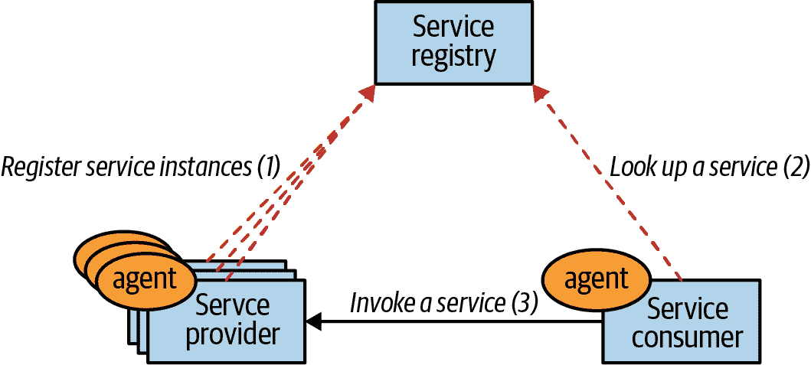
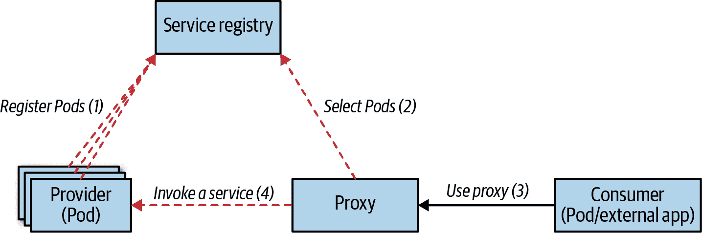
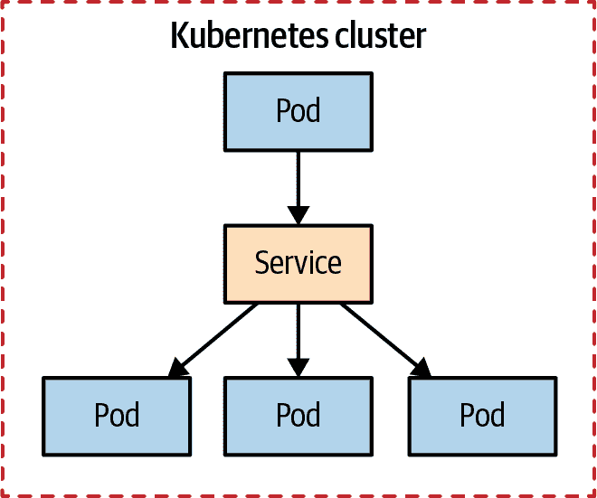
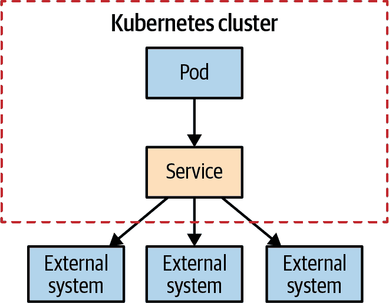
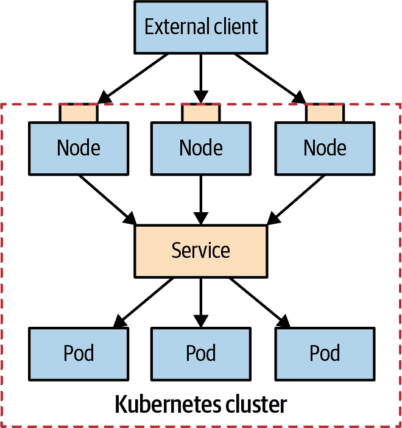
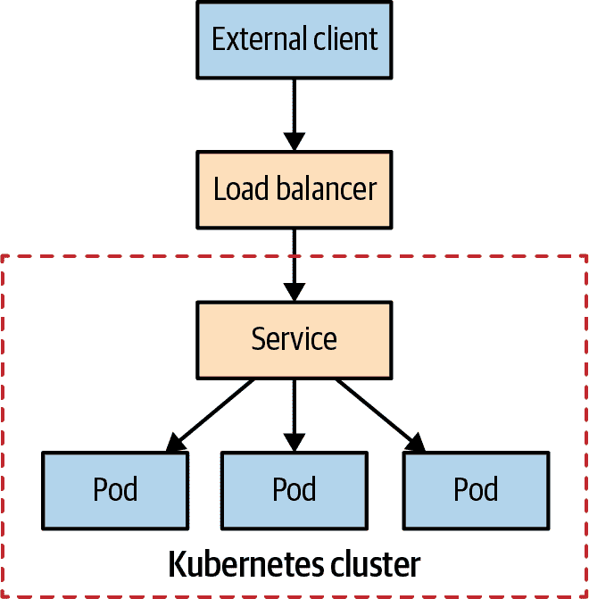
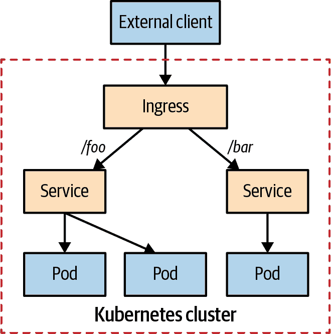

# 第十三章：服务发现

*服务发现*模式提供了一个稳定的端点，通过这个端点，服务的消费者可以访问提供服务的实例。为此，Kubernetes 提供了多种机制，取决于服务的消费者和生产者是位于集群内还是集群外。

# 问题

部署在 Kubernetes 上的应用程序很少独立存在，通常它们需要与集群内的其他服务或集群外的系统进行交互。交互可以在服务内部发起，也可以通过外部刺激。内部发起的交互通常通过轮询消费者进行：在启动后或稍后，应用程序连接到另一个系统并开始发送和接收数据。典型示例包括在 Pod 中运行的应用程序连接到文件服务器并开始消费文件，或者消息连接到消息代理并开始接收或发送消息，或者使用关系数据库或键值存储的应用程序开始读取或写入数据。

这里的关键区别在于 Pod 中运行的应用程序在某些时候决定打开对另一个 Pod 或外部系统的传出连接，并开始在任一方向上交换数据。在这种情况下，我们的应用程序没有外部刺激，并且在 Kubernetes 中我们不需要任何额外的设置。

要实现 第七章，“批处理作业” 或 第八章，“周期性作业” 中描述的模式，我们经常使用这种技术。此外，在 DaemonSet 或 ReplicaSet 中运行的长期 Pod 有时会主动通过网络连接到其他系统。Kubernetes 工作负载的更常见用例是当我们有长期运行的服务期待外部刺激时，最常见的形式是来自集群内其他 Pod 或外部系统的传入 HTTP 连接。在这些情况下，服务消费者需要一种机制来发现由调度器动态放置并有时弹性缩放的 Pod。

如果我们不得不自己跟踪、注册和发现动态 Kubernetes Pod 的端点，那将是一个巨大的挑战。这就是为什么 Kubernetes 通过不同的机制实现了*服务发现*模式，我们将在本章中探讨这些机制。

# 解决方案

如果我们看看“Kubernetes 之前的时代”，服务发现的最常见机制是通过客户端发现。在这种架构中，当服务消费者需要调用可能扩展到多个实例的另一个服务时，服务消费者会有一个能够查看注册表以查找服务实例并选择其中一个进行调用的发现代理。经典地，这可能通过消费者服务内嵌的代理（如 ZooKeeper 客户端、Consul 客户端或 Ribbon）或者通过另一个共同进程查找注册表中的服务来完成，如 图 13-1 所示。



###### 图 13-1\. 客户端服务发现

在“Kubernetes 之后的时代”，分布式系统的许多非功能性责任，如放置、健康检查、治理和资源隔离，都移入了平台，服务发现和负载均衡也如此。如果我们使用面向服务的架构（SOA）中的定义，服务提供者实例仍然必须在提供服务能力的同时向服务注册表注册自己，而服务消费者必须访问注册表中的信息以达到服务。

在 Kubernetes 的世界中，所有这些都是在幕后进行的，以便服务消费者调用一个固定的虚拟服务端点，该端点可以动态发现作为 Pod 实现的服务实例。图 13-2 展示了 Kubernetes 如何实现注册和查找。



###### 图 13-2\. 服务器端服务发现

乍一看，*服务发现* 可能看起来是一个简单的模式。然而，可以使用多种机制来实现这种模式，这取决于服务消费者是在集群内还是外部，以及服务提供者是在集群内还是外部。

## 内部服务发现

假设我们有一个 web 应用程序，想要在 Kubernetes 上运行。一旦我们创建了一个带有几个副本的 Deployment，调度器将 Pod 放置在适合的节点上，并在启动之前为每个 Pod 分配一个集群内部 IP 地址。如果另一个 Pod 中的客户端服务希望消费 web 应用程序的端点，则没有一种简单的方法可以提前知道服务提供者 Pod 的 IP 地址。

这个挑战正是 Kubernetes 服务资源所要解决的。它为提供相同功能的一组 Pod 提供了一个恒定和稳定的入口点。创建服务的最简单方法是通过 `kubectl expose`，它为部署或副本集的一个或多个 Pod 创建服务。该命令创建一个虚拟 IP 地址，称为 `clusterIP`，并从资源中提取 Pod 选择器和端口号来创建服务定义。然而，为了对定义拥有完全控制，我们可以像示例 13-1 中展示的那样手动创建服务。

##### 示例 13-1\. 一个简单的服务

```
apiVersion: v1
kind: Service
metadata:
  name: random-generator
spec:
  selector:                
    app: random-generator
  ports:
  - port: 80               
    targetPort: 8080       
    protocol: TCP
```


选择匹配 Pod 标签。


可以联系到该服务的端口。


Pod 正在监听的端口。

在本示例中的定义将创建一个名为`random-generator`的服务（名称对于后续的发现很重要），并且`type: ClusterIP`（这是默认设置），接受端口 80 上的 TCP 连接并将其路由到所有具有选择器`app: random-generator`的匹配 Pod 上的端口 8080。无论 Pod 何时或如何创建，任何匹配的 Pod 都成为路由目标，如图 13-3 所示。



###### 图 13-3\. 内部服务发现

在这里需要记住的关键点是，一旦创建服务，它会被分配一个 `clusterIP`，只能从 Kubernetes 集群内部访问（因此得名），并且只要服务定义存在，该 IP 就保持不变。但是，集群内的其他应用程序如何找出这个动态分配的 `clusterIP` 呢？有两种方法：

通过环境变量进行发现

当 Kubernetes 启动一个 Pod 时，它的环境变量将被填充为所有到目前为止存在的服务的细节。例如，我们的`random-generator`服务在端口 80 上监听，并注入到任何新启动的 Pod 中，正如示例 13-2 中展示的环境变量一样。运行该 Pod 的应用程序将知道它需要消费的服务名称，并可以编码以读取这些环境变量。这种查找是一种简单的机制，可用于任何语言编写的应用程序，并且在 Kubernetes 集群外进行开发和测试时也很容易模拟。这种机制的主要问题是对服务创建的时间依赖性。由于无法将环境变量注入到已运行的 Pod 中，因此仅在在 Kubernetes 中创建服务后启动的 Pod 才能使用服务坐标。这要求在启动依赖于服务的 Pod 之前定义服务，或者如果情况不是这样，则需要重新启动 Pod。

##### 示例 13-2. 在 Pod 中自动设置的与服务相关的环境变量

```
RANDOM_GENERATOR_SERVICE_HOST=10.109.72.32
RANDOM_GENERATOR_SERVICE_PORT=80
```

通过 DNS 查找进行发现

Kubernetes 运行一个 DNS 服务器，所有 Pod 都会自动配置为使用它。此外，当创建新服务时，它会自动获得一个新的 DNS 记录条目，所有 Pod 都可以开始使用。假设客户端知道要访问的服务的名称，它可以通过完全限定域名（FQDN）来访问服务，例如`random-generator.default.svc.cluster.local`。这里，`random-generator`是服务的名称，`default`是命名空间的名称，`svc`表示它是一个服务资源，`cluster.local`是集群特定的后缀。如果需要，我们可以省略集群后缀，以及在同一命名空间内访问服务时省略命名空间。

DNS 发现机制不会受到基于环境变量的机制的缺点的影响，因为 DNS 服务器允许所有 Pod 立即查找所有服务，只要服务定义了。但是，如果服务消费者需要使用非标准或未知的端口号，仍然可能需要使用环境变量来查找要使用的端口号。

这里是`type: ClusterIP`的服务的一些其他高级特性，其他类型也建立在此基础之上：

多个端口

单个服务定义可以支持多个源端口和目标端口。例如，如果您的 Pod 同时支持端口 8080 上的 HTTP 和端口 8443 上的 HTTPS，则无需定义两个服务。一个单独的服务可以在端口 80 和 443 上同时公开这两个端口，例如。

会话亲和性

当有新的请求时，默认情况下，服务会随机选择一个 Pod 进行连接。这可以通过`sessionAffinity: ClientIP`来改变，这样来自同一客户端 IP 的所有请求将粘附到同一个 Pod 上。请记住，Kubernetes 服务执行 L4 传输层负载平衡，无法查看网络数据包并执行如基于 HTTP Cookie 的会话亲和性等应用级别负载平衡。

readiness 探测

在第四章，“健康探测”中，您学习了如何为容器定义`readinessProbe`。如果一个 Pod 定义了 readiness 检查，并且它们失败了，即使标签选择器匹配该 Pod，该 Pod 也会从服务终端点列表中移除。

虚拟 IP

当我们创建一个`type: ClusterIP`的服务时，它会获得一个稳定的虚拟 IP 地址。但是，这个 IP 地址不对应任何网络接口，也不存在于现实中。每个节点上运行的 kube-proxy 会选择这个新服务，并更新节点的 iptables，添加规则以捕获发送到此虚拟 IP 地址的网络数据包，并替换为选定的 Pod IP 地址。iptables 中的规则不会添加 ICMP 规则，而只会添加在服务定义中指定的协议，如 TCP 或 UDP。因此，不可能`ping`服务的 IP 地址，因为该操作使用 ICMP。

选择 ClusterIP

在创建服务时，我们可以通过字段`.spec.clusterIP`指定要使用的 IP。它必须是有效的 IP 地址，并且在预定义范围内。虽然不建议这样做，但在处理配置为使用特定 IP 地址的遗留应用程序或希望重用现有 DNS 条目时，此选项可能会很方便。

带有`type: ClusterIP`的 Kubernetes 服务仅限于集群内访问；它们用于通过匹配选择器发现 Pod，并且是最常用的类型。接下来，我们将介绍其他类型的服务，这些服务允许发现手动指定的端点。

## 手动服务发现

当我们创建一个带有`selector`的服务时，Kubernetes 会在端点资源列表中跟踪匹配和准备就绪的 Pod 列表。对于示例 13-1，您可以使用`kubectl get endpoints random-generator`检查代表服务创建的所有端点。除了将连接重定向到集群内的 Pod 之外，我们还可以将连接重定向到外部 IP 地址和端口。我们可以通过省略服务的`selector`定义，并手动创建端点资源来实现这一点，就像示例 13-3 中所示。

##### 示例 13-3\. 没有选择器的服务

```
apiVersion: v1
kind: Service
metadata:
  name: external-service
spec:
  type: ClusterIP
  ports:
  - protocol: TCP
    port: 80
```

接下来，在示例 13-4 中，我们定义了一个包含目标 IP 和端口的端点资源，其名称与服务相同。

##### 示例 13-4\. 外部服务的端点

```
apiVersion: v1
kind: Endpoints
metadata:
  name: external-service   
subsets:
  - addresses:
    - ip: 1.1.1.1
    - ip: 2.2.2.2
    ports:
    - port: 8080
```


名称必须与访问这些端点的服务匹配。

此服务也仅限于集群内访问，并且可以通过环境变量或 DNS 查找方式消耗。不同之处在于端点列表是手动维护的，并且这些值通常指向集群外的 IP 地址，如图 13-4 所示。

尽管连接到外部资源是此机制最常见的用途，但这并不是唯一的用途。端点可以保存 Pod 的 IP 地址，但不能保存其他服务的虚拟 IP 地址。服务的一个好处是，它允许您添加和删除选择器，并指向外部或内部提供者，而无需删除导致服务 IP 地址更改的资源定义。因此，服务消费者可以继续使用首次指向的相同服务 IP 地址，而实际的服务提供者实现则可以从本地迁移到 Kubernetes，而不影响客户端。



###### 图 13-4\. 手动服务发现

在这种手动目标配置类别中，还有一种服务类型，如示例 13-5 所示。

##### 示例 13-5\. 带有外部目标的服务

```
apiVersion: v1
kind: Service
metadata:
  name: database-service
spec:
  type: ExternalName
  externalName: my.database.example.com
  ports:
  - port: 80
```

此服务定义也没有`selector`，但其类型为`ExternalName`。这与实现角度来看是一个重要的区别。此服务定义使用 DNS 将`externalName`指向的内容映射为`database-service.<namespace>.svc.cluster.local`，现在指向`my.database.example.com`。这是使用 DNS CNAME 创建外部端点的别名的一种方式，而不是通过 IP 地址通过代理。但从根本上说，这是提供给位于集群外部的端点的 Kubernetes 抽象的另一种方式。

## 从集群外部进行服务发现

本章讨论的服务发现机制都使用指向 Pod 或外部端点的虚拟 IP 地址，虚拟 IP 地址本身只能从 Kubernetes 集群内部访问。然而，Kubernetes 集群并不与世界脱节，除了从 Pod 连接到外部资源之外，非常常见的情况是相反的——外部应用程序希望到达由 Pod 提供的端点。让我们看看如何使 Pod 对位于集群外部的客户端可访问。

创建服务并将其暴露在集群外的第一种方法是通过`type: NodePort`。在示例 13-6 中的定义与之前创建的服务相同，为匹配选择器`app: random-generator`的 Pod 提供服务，接受端口 80 上的连接，并将每个连接路由到所选 Pod 的端口 8080。然而，除此之外，该定义还在所有节点上预留了端口 30036，并将传入的连接转发到该服务。这一预留使得服务可以通过虚拟 IP 地址在内部访问，同时也可以通过每个节点上的专用端口在外部访问。

##### 示例 13-6\. 类型为 NodePort 的服务

```
apiVersion: v1
kind: Service
metadata:
  name: random-generator
spec:
  type: NodePort           
  selector:
    app: random-generator
  ports:
  - port: 80
    targetPort: 8080
    nodePort: 30036        
    protocol: TCP
```


在所有节点上打开端口。


指定一个固定端口（需要可用）或者省略以分配一个随机选择的端口。

虽然这种暴露服务的方法（如图 13-5 所示）看起来是一种不错的方法，但它也有缺点。



###### 图 13-5\. 节点端口服务发现

让我们看一些它的显著特点：

端口号

不使用`nodePort: 30036`选择特定端口，可以让 Kubernetes 在其范围内选择一个空闲端口。

防火墙规则

由于此方法在所有节点上开放端口，您可能需要配置额外的防火墙规则以允许外部客户端访问节点端口。

节点选择

外部客户端可以连接到集群中的任何节点。但是，如果节点不可用，客户端应用程序有责任连接到另一个健康的节点。为此，最好在节点前放置一个负载均衡器，选择健康节点并执行故障转移。

Pod 选择

当客户端通过节点端口打开连接时，它会被路由到一个随机选择的 Pod，该 Pod 可能位于打开连接的同一节点上，也可能位于另一个节点上。通过向服务定义中添加`externalTrafficPolicy: Local`，可以避免这种额外的跳转，并始终强制 Kubernetes 选择在打开连接的节点上的 Pod。设置此选项后，Kubernetes 不允许您连接到其他节点上的 Pod，这可能会成为一个问题。为了解决这个问题，您必须确保每个节点上都有 Pod（例如，通过使用守护服务），或者确保客户端知道哪些节点上有健康的 Pod。

源地址

发送到不同类型服务的数据包的源地址存在一些特殊性。具体来说，当我们使用类型`NodePort`时，客户端地址会被源 NAT 化，这意味着包含客户端 IP 地址的网络数据包的源 IP 地址会被替换为节点的内部地址。例如，当客户端应用程序向节点 1 发送数据包时，它会将源地址替换为自己的节点地址，将目标地址替换为 Pod 的地址，并将数据包转发到 Pod 所在的节点 2。当 Pod 接收到网络数据包时，源地址不等于原始客户端的地址，而是与节点 1 的地址相同。为了防止这种情况发生，我们可以像前面描述的那样设置`externalTrafficPolicy: Local`，只将流量转发到位于节点 1 上的 Pod。

为外部客户端执行服务发现的另一种方法是通过负载均衡器。您已经看到`type: NodePort`服务是如何在常规`type: ClusterIP`服务的基础上构建的，同时在每个节点上开放一个端口。这种方法的局限性在于我们仍然需要一个负载均衡器，以便客户端应用程序选择一个健康的节点。`LoadBalancer`服务类型解决了这个限制。

除了创建常规服务并在每个节点上开放一个端口，就像`type: NodePort`一样，它还使用云提供商的负载均衡器将服务外部暴露。图 13-6 展示了这种设置：专有负载均衡器作为 Kubernetes 集群的网关。



###### 图 13-6\. 负载均衡器服务发现

因此，这种类型的服务仅在云提供商支持 Kubernetes 并提供负载均衡器时才起作用。我们可以通过指定`LoadBalancer`类型创建一个带有负载均衡器的服务。然后 Kubernetes 将在`.spec`和`.status`字段中添加 IP 地址，如示例 13-7 所示。

##### 示例 13-7\. 类型为 LoadBalancer 的服务

```
apiVersion: v1
kind: Service
metadata:
  name: random-generator
spec:
  type: LoadBalancer
  clusterIP: 10.0.171.239      
  loadBalancerIP: 78.11.24.19
  selector:
    app: random-generator
  ports:
  - port: 80
    targetPort: 8080
status:                        
  loadBalancer:
    ingress:
    - ip: 146.148.47.155
```


Kubernetes 在可用时分配`clusterIP`和`loadBalancerIP`。


`status`字段由 Kubernetes 管理，并添加 Ingress IP。

有了这个定义，外部客户端应用程序可以打开到负载均衡器的连接，负载均衡器选择一个节点并定位 Pod。负载均衡器的配置和服务发现的确切方式在各个云提供商之间有所不同。一些云提供商允许您定义负载均衡器地址，而另一些则不允许。一些提供机制以保留源地址，而一些则用负载均衡器地址替换它。您应该检查您选择的云提供商提供的具体实现。

###### 注意

还有另一种类型的服务可用：*headless*服务，您不需要请求专用 IP 地址。您可以通过在服务的`spec`部分中指定`clusterIP None`来创建一个 headless 服务。对于 headless 服务，支持的 Pods 将添加到内部 DNS 服务器中，最适合用于实现 StatefulSets 服务，详细信息请参见第十二章，“有状态服务”。

## 应用层服务发现

与迄今为止讨论的机制不同，Ingress 不是一种服务类型，而是一个独立的 Kubernetes 资源，位于服务前面，作为智能路由器和集群入口。Ingress 通常通过外部可访问的 URL 提供基于 HTTP 的服务访问，包括负载平衡、TLS 终止和基于名称的虚拟主机，但也有其他专门的 Ingress 实现。要使 Ingress 正常工作，集群必须运行一个或多个 Ingress 控制器。一个展示单一服务的简单 Ingress 示例如示例 13-8 所示。

##### 示例 13-8\. Ingress 定义

```
apiVersion: networking.k8s.io/v1beta1
kind: Ingress
metadata:
  name: random-generator
spec:
  backend:
    serviceName: random-generator
    servicePort: 8080
```

根据运行 Kubernetes 的基础设施和 Ingress 控制器的实现方式，此定义分配一个外部可访问的 IP 地址，并在端口 80 上公开`random-generator`服务。但这与具有`type: LoadBalancer`的服务并没有太大的不同，后者需要每个服务定义一个外部 IP 地址。Ingress 的真正优势在于重用单个外部负载均衡器和 IP 来服务多个服务，并降低基础设施成本。一个简单的扇出配置，根据 HTTP URI 路径将单个 IP 地址路由到多个服务，看起来像示例 13-9。

##### 示例 13-9\. Nginx Ingress 控制器的定义

```
apiVersion: networking.k8s.io/v1beta1
kind: Ingress
metadata:
  name: random-generator
  annotations:
    nginx.ingress.kubernetes.io/rewrite-target: /
spec:
  rules:                       
  - http:
      paths:
      - path: /                
        backend:
          serviceName: random-generator
          servicePort: 8080
      - path: /cluster-status  
        backend:
          serviceName: cluster-status
          servicePort: 80
```


Ingress 控制器专用规则，根据请求路径分发请求。


将每个请求重定向到 Service `random-generator`…​


…​ 除了 `/cluster-status`，它将转到另一个 Service。

假设 Ingress 配置正确，除了常规的 Ingress 定义外，控制器可能需要通过注释传递额外的配置。前述定义将配置一个负载均衡器，并获得一个外部 IP 地址，该 IP 地址服务于两个路径下的两个服务，如 图 13-7 所示。

Ingress 是 Kubernetes 上最强大同时也是最复杂的服务发现机制。它最适用于在同一 IP 地址下暴露多个服务，并且所有服务使用相同的 L7（通常是 HTTP）协议。



###### 图 13-7\. 应用层服务发现

# 讨论

在本章中，我们介绍了 Kubernetes 上最受欢迎的服务发现机制。从集群内部动态 Pod 的发现始终通过 Service 资源实现，尽管不同的选项可能导致不同的实现方式。Service 抽象是一种高级的云本地化配置方式，用于配置如虚拟 IP 地址、iptables、DNS 记录或环境变量等低级细节。从集群外部进行服务发现建立在 Service 抽象之上，重点是将服务暴露给外部世界。虽然 `NodePort` 提供了暴露服务的基础功能，但高可用设置需要与平台基础设施提供商集成。

表格 13-1 总结了 Kubernetes 中实现服务发现的各种方式。本表旨在将本章中的各种服务发现机制从简单到复杂进行整理。希望它能帮助您建立心理模型并更好地理解它们。

表格 13-1\. 服务发现机制

| 名称 | 配置 | 客户端类型 | 摘要 |
| --- | --- | --- | --- |
| ClusterIP |

`type: ClusterIP`

`.spec.selector`

| 内部 | 最常见的内部发现机制 |
| --- | --- |
| 手动 IP |

`type: ClusterIP`

`kind: Endpoints`

| 内部 | 外部 IP 发现 |
| --- | --- |
| 手动 FQDN |

`type: ExternalName`

`.spec.externalName`

| 内部 | 外部 FQDN 发现 |
| --- | --- |
| 无头服务 |

`type: ClusterIP`

`.spec.clusterIP: None`

| 内部 | 基于 DNS 的发现，没有虚拟 IP |
| --- | --- |
| NodePort | `type: NodePort` | 外部 | 适用于非 HTTP 流量的首选方式 |
| LoadBalancer | `type: LoadBalancer` | 外部 | 需要支持的云基础设施 |
| Ingress | `kind: Ingress` | 外部 | 基于 L7/HTTP 的智能路由机制 |

本章全面概述了 Kubernetes 中用于访问和发现服务的所有核心概念。然而，旅程并不止步于此。通过 *Knative* 项目，引入了在 Kubernetes 之上帮助应用程序开发人员进行高级服务和事件处理的新原语。

在*服务发现*模式下，*Knative Serving*子项目特别引人注目，因为它引入了一个新的与此处介绍的服务相同类型的服务资源（但具有不同的 API 组）。Knative Serving 不仅支持应用程序修订，还支持在负载均衡器后面对服务进行非常灵活的扩展。我们在“Knative”中简要介绍了一下 Knative Serving，但详细讨论超出了本书的范围。在“更多信息”中，您将找到指向有关 Knative 的详细信息的链接。

# 更多信息

+   [服务发现示例](https://oreil.ly/nagmD)

+   [Kubernetes 服务](https://oreil.ly/AEDi5)

+   [服务和 Pod 的 DNS](https://oreil.ly/WRT5H)

+   [调试服务](https://oreil.ly/voVbw)

+   [使用源 IP](https://oreil.ly/mGjzg)

+   [创建外部负载均衡器](https://oreil.ly/pzOiM)

+   [Ingress](https://oreil.ly/Idv2c)

+   [Kubernetes NodePort 与 LoadBalancer 与 Ingress？何时应该使用什么？](https://oreil.ly/W4i8U)

+   [Kubernetes Ingress 与 OpenShift Route](https://oreil.ly/fXicP)
