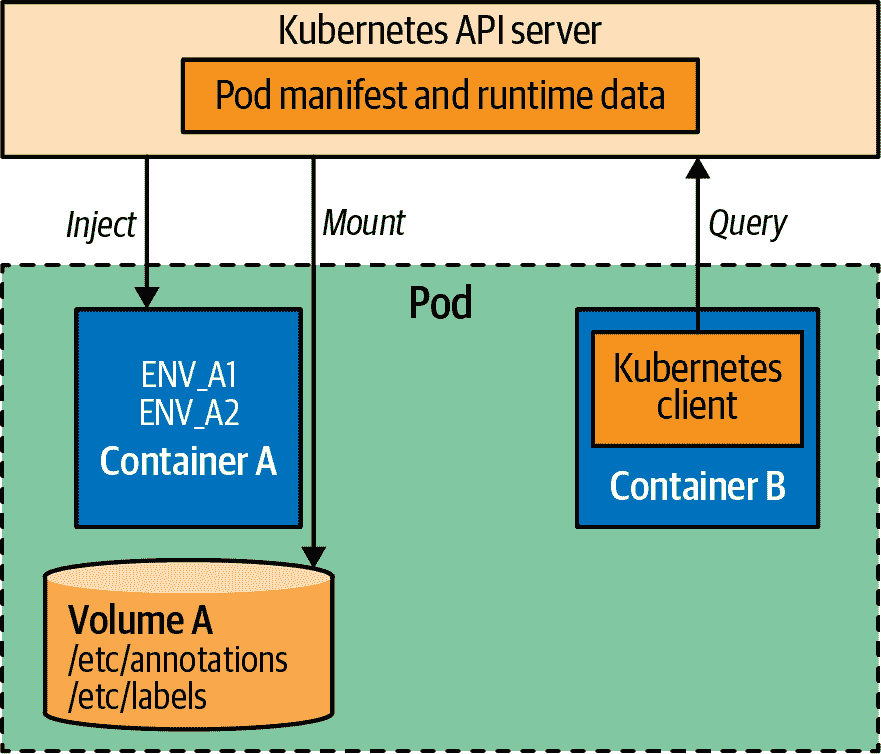

# 第十四章：自我意识

一些应用程序需要自我意识，并需要关于自身的信息。*自我意识*模式描述了 Kubernetes *向下 API*，为应用程序提供了一种简单的内省和元数据注入机制。

# 问题

对于大多数用例，云原生应用程序是无状态且可丢弃的，没有与其他应用程序相关的身份。然而，有时甚至这些类型的应用程序也需要有关自身及其运行环境的信息。这可能包括仅在运行时已知的信息，如 Pod 名称、Pod IP 地址和应用程序所在的主机名。或者，在 Pod 级别定义的其他静态信息，例如特定资源请求和限制，或者用户在运行时可能更改的注解和标签等动态信息。

例如，根据容器提供的资源，您可能希望调整应用程序线程池大小，或更改垃圾收集算法或内存分配。您可能希望在记录信息或将指标发送到中央服务器时使用 Pod 名称和主机名。您可能希望发现同一命名空间中具有特定标签的其他 Pod，并将它们加入到集群应用程序中。对于这些和其他用例，Kubernetes 提供了向下 API。

# 解决方案

我们描述的要求及其后续解决方案不仅适用于容器，而且存在于任何资源元数据动态变化的环境中。例如，AWS 提供实例元数据和用户数据服务，可以从任何 EC2 实例查询 EC2 实例本身的元数据。同样，AWS ECS 提供 API，容器可以查询并检索有关容器集群的信息。

Kubernetes 的方法更加优雅且易于使用。*向下 API*允许您通过环境变量和文件将有关 Pod 的元数据传递给容器和集群。这些是我们用于从 ConfigMaps 和 Secrets 传递应用程序相关数据的相同机制。但在这种情况下，数据不是我们创建的。相反，我们指定我们感兴趣的键，Kubernetes 动态填充值。图 14-1 概述了向下 API 如何将资源和运行时信息注入到感兴趣的 Pod 中。



###### 图 14-1 应用程序内省机制

这里的主要观点是，通过向下 API，元数据被注入到您的 Pod 中，并在本地提供。应用程序无需使用客户端与 Kubernetes API 交互，可以保持对 Kubernetes 的不可知状态。让我们看看如何通过环境变量在示例 14-1 中请求元数据是多么简单。

##### 示例 14-1 环境变量来自向下 API

```
apiVersion: v1
kind: Pod
metadata:
  name: random-generator
spec:
  containers:
  - image: k8spatterns/random-generator:1.0
    name: random-generator
    env:
    - name: POD_IP
      valueFrom:
        fieldRef:                         
          fieldPath: status.podIP
    - name: MEMORY_LIMIT
      valueFrom:
        resourceFieldRef:
          containerName: random-generator 
          resource: limits.memory
```


环境变量 `POD_IP` 是从此 Pod 的属性设置的，并在 Pod 启动时出现。


将环境变量 `MEMORY_LIMIT` 设置为此容器的内存资源限制的值；实际限制声明未在此处显示。

在此示例中，我们使用 `fieldRef` 访问 Pod 级别的元数据。`fieldRef.fieldPath` 中显示的键既可用作环境变量，也可用作 `downwardAPI` 卷。

Table 14-1\. `fieldRef.fieldPath` 中可用的 Downward API 信息

| Name | Description |
| --- | --- |
| `spec.nodeName` | 托管 Pod 的节点名称 |
| `status.hostIP` | 托管 Pod 的节点的 IP 地址 |
| `metadata.name` | Pod 名称 |
| `metadata.namespace` | Pod 所在的命名空间 |
| `status.podIP` | Pod IP 地址 |
| `spec.serviceAccountName` | Pod 使用的 ServiceAccount |
| `metadata.uid` | Pod 的唯一标识符 |
| `metadata.labels['*key*']` | Pod 标签 *key* 的值 |
| `metadata.annotations['*key*']` | Pod 注释 *key* 的值 |

与 `fieldRef` 类似，我们使用 `resourceFieldRef` 来访问属于 Pod 的容器资源规范的元数据。这些元数据特定于容器，并且使用 `resourceFieldRef.container` 指定。当作为环境变量使用时，默认使用当前容器。`resourceFieldRef.resource` 的可能键显示在 Table 14-2 中。资源声明在 Chapter 2, “Predictable Demands” 中解释。

Table 14-2\. `resourceFieldRef.resource` 中可用的 Downward API 信息

| Name | Description |
| --- | --- |
| `requests.cpu` | 容器的 CPU 请求 |
| `limits.cpu` | 容器的 CPU 限制 |
| `requests.memory` | 容器的内存请求 |
| `limits.memory` | 容器的内存限制 |
| `requests.hugepages-<size>` | 容器的巨页请求（例如，`requests.hugepages-1Gi`） |
| `limits.hugepages-<size>` | 容器的巨页限制（例如，`limits.hugepages-1Gi`） |
| `requests.ephemeral-storage` | 容器的临时存储请求 |
| `limits.ephemeral-storage` | 容器的临时存储限制 |

用户可以在 Pod 运行时更改某些元数据，如标签和注释。除非重启 Pod，否则环境变量不会反映这样的更改。但是 `downwardAPI` 卷可以反映标签和注释的更新。除了前面描述的各个字段之外，`downwardAPI` 卷还可以将所有 Pod 标签和注释捕获到具有 `metadata.labels` 和 `metadata.annotations` 引用的文件中。 Example 14-2 展示了如何使用这样的卷。

##### Example 14-2\. 通过卷使用 Downward API

```
apiVersion: v1
kind: Pod
metadata:
  name: random-generator
spec:
  containers:
  - image: k8spatterns/random-generator:1.0
    name: random-generator
    volumeMounts:
    - name: pod-info                 
      mountPath: /pod-info
  volumes:
  - name: pod-info
    downwardAPI:
      items:
      - path: labels                 
        fieldRef:
          fieldPath: metadata.labels
      - path: annotations            
        fieldRef:
          fieldPath: metadata.annotations
```


从向下 API 获取的值可以作为文件挂载到 Pod 中。


`labels` 文件按行保存所有标签，格式为`name=value`。当标签发生变化时，此文件会更新。


`annotations` 文件以与标签相同的格式保存所有注释。

使用卷时，如果 Pod 在运行时元数据发生变化，这些变化会反映在卷文件中。但仍然需要消费应用程序检测文件更改并相应地读取更新的数据。如果应用程序没有实现这样的功能，可能仍然需要重新启动 Pod。

# 讨论

通常，应用程序需要具有自我感知能力，并了解自身及其运行环境的信息。Kubernetes 提供了非侵入式的内省和元数据注入机制。向下 API 的一个缺点是它提供了一组固定的可引用键。如果您的应用程序需要更多数据，特别是关于其他资源或集群相关元数据的信息，必须在 API 服务器上查询。许多应用程序使用此技术查询 API 服务器，以发现同一命名空间中具有特定标签或注释的其他 Pod。然后应用程序可以与发现的 Pod 形成集群并同步状态。监控应用程序也使用此技术发现感兴趣的 Pod，然后开始对其进行仪表化。

有许多客户端库可用于不同语言与 Kubernetes API 服务器交互，以获取更多超出向下 API 提供的自我引用信息。

# 更多信息

+   [自我感知示例](https://oreil.ly/fHu1O)

+   [AWS EC2：实例元数据和用户数据](https://oreil.ly/iCwPr)

+   [通过文件向容器公开 Pod 信息](https://oreil.ly/qe2Gc)

+   [通过环境变量向容器公开 Pod 信息](https://oreil.ly/bZrtR)

+   [向下 API：可用字段](https://oreil.ly/Jh4zf)
