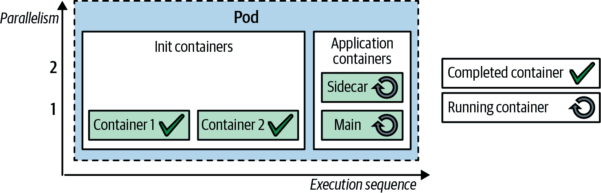
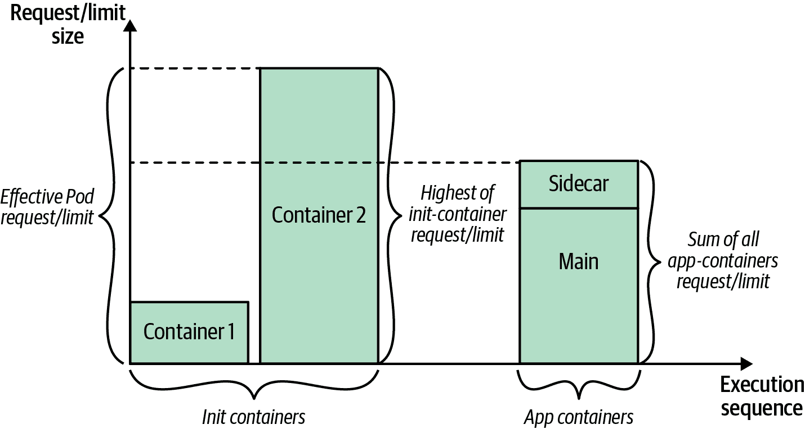

# 第十五章：初始化容器

*初始化容器*模式通过为初始化相关任务提供独立的生命周期，使关注点分离，与主应用容器的生命周期不同步。在本章中，我们将深入研究这一基础的 Kubernetes 概念，在许多其他模式中需要初始化逻辑时使用。

# 问题

初始化在许多编程语言中是一个普遍关注的问题。某些语言将其作为语言的一部分来处理，而某些使用命名约定和模式来指示构造为初始化器。例如，在 Java 编程语言中，要实例化一个需要一些设置的对象，我们使用构造函数（或者对于更复杂的用例，使用静态块）。构造函数保证作为对象内部的第一件事运行，并且由运行时管理者保证仅运行一次（这只是一个示例；我们这里不详细介绍不同语言和特殊情况）。此外，我们可以使用构造函数来验证必填参数等前提条件。我们还使用构造函数用传入的参数或默认值初始化实例字段。

初始化容器类似于但位于 Pod 级别，而不是 Java 类级别。因此，如果在 Pod 中有一个或多个表示主应用程序的容器，则这些容器可能在启动之前有先决条件。这些可能包括在文件系统上设置特殊权限、数据库架构设置或应用程序种子数据安装。此外，这种初始化逻辑可能需要工具和库，这些工具和库不能包含在应用程序镜像中。出于安全原因，应用程序镜像可能没有权限执行初始化活动。或者，您可能希望推迟应用程序的启动，直到满足外部依赖关系。对于所有这些用例，Kubernetes 使用初始化容器作为该模式的实现，允许将初始化活动与主应用程序职责分离。

# 解决方案

Kubernetes 中的初始化容器是 Pod 定义的一部分，它们将 Pod 中的所有容器分为两组：初始化容器和应用容器。所有初始化容器按顺序逐个执行，它们全部必须成功终止，然后才能启动应用容器。在这个意义上，初始化容器就像 Java 类中的构造器指令，帮助对象初始化。另一方面，应用容器并行运行，启动顺序是任意的。执行流程在 图 15-1 中演示。



###### 图 15-1\. Pod 中的初始化和应用容器

通常情况下，期望 init 容器小巧、快速运行并成功完成，除非使用 init 容器延迟 Pod 启动以等待依赖项，此时它可能不会在依赖项满足之前终止。如果 init 容器失败，整个 Pod 将重新启动（除非标记为 `RestartNever`），导致所有 init 容器再次运行。因此，为了防止任何副作用，使 init 容器具有幂等性是一个良好的实践。

一方面，init 容器与应用容器具有相同的能力：它们都是同一 Pod 的一部分，因此共享资源限制、卷和安全设置，并最终被放置在同一节点上。另一方面，它们具有稍微不同的生命周期、健康检查和资源处理语义。对于 init 容器，没有 `livenessProbe`、`readinessProbe` 或 `startupProbe`，因为所有 init 容器必须在 Pod 启动过程中的应用容器继续之前成功终止。

Init 容器还会影响 Pod 资源需求的计算方式，用于调度、自动扩展和配额管理。考虑到 Pod 中所有容器执行的顺序（首先，init 容器按顺序运行，然后所有应用容器并行运行），有效的 Pod 级请求和限制值将成为以下两组最高值之一：

+   最高的 init 容器请求/限制值

+   所有应用容器请求/限制值的总和

这种行为的一个后果是，如果您的 init 容器需求高而应用容器需求低，则影响调度的 Pod 级请求和限制值将基于 init 容器的较高值，如 图 15-2 所示。



###### 图 15-2\. 有效的 Pod 请求/限制计算

尽管 init 容器运行时间短且大部分时间节点上有可用容量，但此设置并不高效。其他 Pod 不能使用该容量。

此外，init 容器使关注点分离，允许您保持容器的单一目的性。应用工程师可以创建应用容器，专注于应用逻辑。部署工程师可以编写 init 容器，专注于配置和初始化任务。我们在 示例 15-1 中演示了这一点，其中有一个基于 HTTP 服务器提供文件的应用容器。

容器提供了通用的 HTTP 服务能力，并且不假设用于不同用例中的服务文件的来源。在同一个 Pod 中，一个初始化容器提供了 Git 客户端的能力，其唯一目的是克隆一个 Git 仓库。由于这两个容器都属于同一个 Pod，它们可以访问同一个卷来共享数据。我们使用相同的机制来从初始化容器向应用容器共享克隆的文件。

示例 15-1 展示了将数据复制到空卷的初始化容器。

##### 示例 15-1\. 初始化容器

```
apiVersion: v1
kind: Pod
metadata:
  name: www
  labels:
    app: www
spec:
  initContainers:
  - name: download
    image: axeclbr/git
    command:                       
    - git
    - clone
    - https://github.com/mdn/beginner-html-site-scripted
    - /var/lib/data
    volumeMounts:                  
    - mountPath: /var/lib/data
      name: source
  containers:
  - name: run
    image: docker.io/centos/httpd
    ports:
    - containerPort: 80
    volumeMounts:                  
    - mountPath: /var/www/html
      name: source
  volumes:                         
  - emptyDir: {}
    name: source
```


克隆外部 Git 仓库到挂载目录中。


由初始化容器和应用容器共享的卷。


在节点上用于数据共享的空目录。

我们也可以通过使用 ConfigMap 或 PersistentVolumes 实现相同的效果，但是这里我们想演示初始化容器的工作原理。这个例子展示了初始化容器与主容器共享卷的典型用法模式。

###### 提示

为了调试初始化容器的结果，可以临时用一个虚拟的 `sleep` 命令替换应用容器的命令，这样您有时间检查情况。如果初始化容器启动失败，导致配置丢失或损坏，这个技巧尤其有用。在 Pod 声明中使用以下命令，可以进入 Pod 来调试由 `kubectl exec -it *<pod>* sh` 挂载的卷：

```
   command:
   - /bin/sh
   - "-c"
   - "sleep 3600"
```

使用 Sidecar 可以达到类似的效果，如下文所述的 第十六章，“Sidecar”，其中 HTTP 服务器容器和 Git 容器作为应用容器并行运行。但是使用 Sidecar 方法时，无法确保哪个容器会首先运行，并且 Sidecar 适用于容器持续并行运行的情况。如果需要保证初始化和数据持续更新，则还可以同时使用 Sidecar 和初始化容器。

# 讨论

那么为什么将 Pod 中的容器分成两组？为什么不仅仅使用一个应用容器，并在需要时在 Pod 中使用一点脚本进行初始化？答案是这两组容器具有不同的生命周期、目的甚至在某些情况下还有不同的作者。

在应用容器之前运行初始化容器，更重要的是，使初始化容器按阶段运行，只有当前初始化容器成功完成时才能继续进行，这意味着在初始化的每一步，您可以确保前一步已成功完成，并且可以继续下一个阶段。 相比之下，应用容器并行运行，并且不像初始化容器提供类似的保证。 有了这个区别，我们可以创建专注于初始化或应用任务的容器，并通过将它们组织在具有可预测保证的 Pod 中，在不同的上下文中重复使用它们。

# 更多信息

+   [初始化容器示例](https://oreil.ly/dtC_W)

+   [初始化容器](https://oreil.ly/AcBVc)

+   [配置 Pod 初始化](https://oreil.ly/XJV9K)

+   [准入控制器参考](https://oreil.ly/H1-va)

+   [动态准入控制](https://oreil.ly/uOzBD)

+   [Metacontroller](https://oreil.ly/f-P_d)

+   [Kyverno](https://oreil.ly/VnbkZ)

+   [揭秘 Istio 的 Sidecar 注入模型](https://oreil.ly/a3kmy)

+   [Swift 中的对象初始化](https://oreil.ly/Wy-ca)
