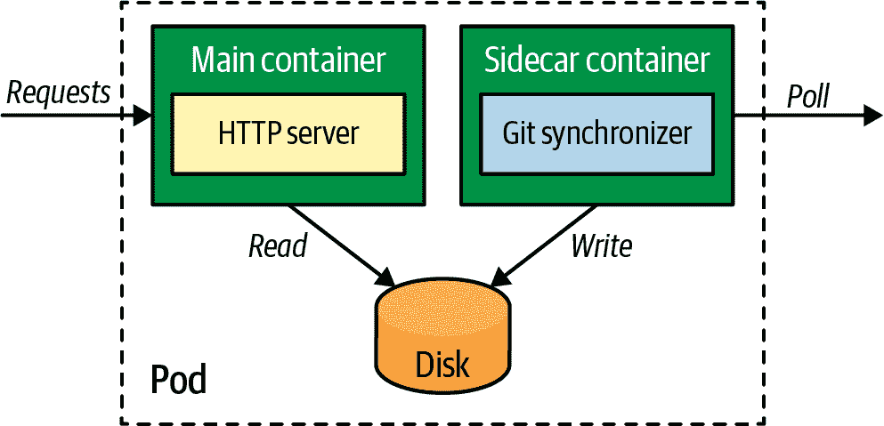

# 第十六章：Sidecar

一个 sidecar 容器可以在不更改现有容器的情况下扩展和增强其功能。*Sidecar* 模式是允许单一用途容器紧密协作的基本容器模式之一。在本章中，您将学习有关基本 sidecar 概念的所有内容。专门的后续模式 *Adapter* 和 *Ambassador* 分别在第十七章和第十八章中讨论。

# 问题

容器是一种流行的打包技术，允许开发人员和系统管理员以统一的方式构建、发布和运行应用程序。容器代表着功能单元的自然边界，具有独特的运行时、发布周期、API 和团队所有权。一个合适的容器就像一个单独的 Linux 进程一样——解决一个问题，并且做得很好——并且是可替换和可重用的概念创建的。这最后一部分至关重要，因为它允许我们通过利用现有的专门容器来更快地构建应用程序。

如今，要进行 HTTP 调用，我们不必编写客户端库，而是可以使用现有的库。同样，要为网站提供服务，我们不必为 web 服务器创建容器，而是可以使用现有的容器。这种方法使开发人员可以避免重复发明轮子，并创建一个维护较少、质量更好的容器生态系统。然而，拥有单一用途的可重用容器需要扩展容器功能的方式以及容器之间协作的手段。sidecar 模式描述了这种协作方式，其中一个容器增强另一个现有容器的功能。

# 解决方案

在第一章中，我们描述了 Pod 原语如何允许我们将多个容器组合成一个单元。在幕后，在运行时，Pod 也是一个容器，但它是以暂停的状态启动的（确切地说是通过 `pause` 命令），在所有其他容器之前启动。它除了在整个 Pod 生命周期内持有应用程序容器使用的所有 Linux 命名空间之外，什么也不做。除了这个实现细节，更有趣的是 Pod 抽象提供的所有特性。

Pod 是一种基本的原语，在许多云原生平台中以不同的名称存在，但都具有类似的功能。作为部署单元的 Pod 对其内的容器施加了特定的运行时约束。例如，所有容器都部署在同一节点上，并且它们共享相同的 Pod 生命周期。此外，Pod 允许其内的容器共享卷，并且可以通过本地网络或主机 IPC 进行通信。这些是用户将一组容器放入 Pod 中的原因。*Sidecar*（有时也称为 *Sidekick*）用于描述将一个容器放入 Pod 中以扩展和增强另一个容器行为的场景。

典型的示例展示了 HTTP 服务器和 Git 同步器的模式。HTTP 服务器容器专注于仅通过 HTTP 提供文件服务，并不知道文件如何或从何处获取。类似地，Git 同步器容器的唯一目标是将数据从 Git 服务器同步到本地文件系统。一旦同步完成，它并不关心接下来发生的事情，它唯一关心的是保持本地文件夹与远程 Git 服务器同步。Example 16-1 展示了一个 Pod 定义，配置了这两个容器以使用卷进行文件交换。

##### 示例 16-1\. 带有 Sidecar 的 Pod

```
apiVersion: v1
kind: Pod
metadata:
  name: web-app
spec:
  containers:
  - name: app
    image: docker.io/centos/httpd  
    ports:
    - containerPort: 80
    volumeMounts:
    - mountPath: /var/www/html     
      name: git
  - name: poll
    image: axeclbr/git             
    volumeMounts:
    - mountPath: /var/lib/data     
      name: git
    env:
    - name: GIT_REPO
      value: https://github.com/mdn/beginner-html-site-scripted
    command:
    - "sh"
    - "-c"
    - "git clone $(GIT_REPO) . && watch -n 600 git pull"
    workingDir: /var/lib/data
  volumes:
  - emptyDir: {}
    name: git
```


主应用容器通过 HTTP 提供文件服务。


Sidecar 容器并行运行，并从 Git 服务器拉取数据。


用于在 `app` 和 `poll` 容器中作为共享位置交换数据的位置。

此示例显示了 Git 同步器如何增强 HTTP 服务器的行为以及保持同步。我们也可以说这两个容器是协作且同等重要的，但在 *Sidecar* 模式中，存在一个主容器和一个辅助容器来增强集体行为。通常，主容器是容器列表中列出的第一个，并且代表默认容器（例如，当我们运行命令 `kubectl exec` 时）。

这种简单的模式，如图 Figure 16-1 所示，允许容器在运行时进行协作，同时为两个容器分离关注点，这些容器可能由不同团队拥有，使用不同的编程语言，具有不同的发布周期等。它还促进了容器的可替代性和重用性，例如 HTTP 服务器和 Git 同步器可以在其他应用程序和不同配置中重复使用，可以作为 Pod 中的单个容器或与其他容器协作。



###### 图 16-1\. Sidecar 模式

# 讨论

之前我们说过，容器镜像就像类，容器就像面向对象编程（OOP）中的对象。如果我们继续这个类比，扩展容器以增强其功能类似于 OOP 中的继承，而在 Pod 中协作多个容器则类似于 OOP 中的组合。虽然两种方法都允许代码重用，但继承涉及容器之间更紧密的耦合，并代表容器之间的“是一个”关系。

另一方面，Pod 中的组合表示一种“拥有关系”，更灵活，因为它不会在构建时将容器耦合在一起，这使您可以稍后在 Pod 定义中交换容器。使用组合方法，您可以运行多个（进程）容器，像主应用程序容器一样进行健康检查、重启和资源消耗。现代边车容器体积小，消耗资源少，但您必须决定是否值得运行单独的进程，还是将其合并到主容器中。

我们看到两种主流的使用边车的方法：透明边车对应用程序是不可见的，显式边车则通过定义良好的 API 与主应用程序交互。使节代理是透明边车的一个例子，它与主容器一起运行，并通过提供诸如传输层安全性（TLS）、负载均衡、自动重试、断路器、全局速率限制、L7 流量的可观察性、分布式跟踪等共同功能来抽象网络。通过透明地附加边车容器并拦截主容器的所有传入和传出流量，所有这些功能对应用程序都是可用的。这与面向方面的编程类似，在此编程模型中，通过额外的容器，我们向 Pod 引入了正交的能力，而不必触及主容器。

使用边车架构的显式代理示例是 Dapr。Dapr 边车容器被注入到 Pod 中，并提供可靠的服务调用、发布-订阅、对外系统的绑定、状态抽象、可观察性、分布式跟踪等功能。Dapr 与 Envoy 代理的主要区别在于，Dapr 不拦截应用程序的所有网络流量。相反，Dapr 的特性通过 HTTP 和 gRPC API 暴露给应用程序调用或订阅。

# 更多信息

+   [边车示例](https://oreil.ly/bMAvz)

+   [Pods](https://oreil.ly/7cII-)

+   [基于容器的分布式系统设计模式](https://oreil.ly/1XqCg)

+   [Prana：用于 Netflix PaaS 应用程序和服务的边车](https://oreil.ly/1KMw1)

+   [锡罐电话：向遗留应用程序添加授权和加密的模式](https://oreil.ly/8Cq95)

+   [使节](https://oreil.ly/0FF-r)

+   [Dapr](https://dapr.io)

+   [全能暂停容器](https://oreil.ly/kkhYD)

+   [边车模式](https://oreil.ly/KYe39)
