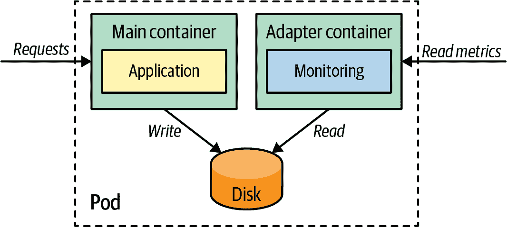

# 第十七章：适配器

*适配器*模式将异构的容器化系统转换为符合统一接口的一致格式，可被外部世界消费的标准化和规范化格式。*适配器*模式继承了*边车*模式的所有特征，但其单一目的是提供对应用程序的适配访问。

# 问题

容器允许我们以统一的方式打包和运行使用不同库和语言编写的应用程序。如今，多个团队使用不同技术创建由异构组件组成的分布式系统已经很普遍。这种异构性在其他系统需要以统一方式处理所有组件时可能会导致困难。*适配器*模式通过隐藏系统复杂性并提供统一访问来解决这一问题。

# 解决方案

最好的方式来说明*适配器*模式是通过一个例子。成功运行和支持分布式系统的一个重要前提是提供详细的监控和警报。此外，如果我们有一个由多个服务组成的分布式系统需要监控，我们可以使用外部监控工具从每个服务中轮询指标并记录它们。

然而，使用不同语言编写的服务可能没有相同的能力，并且可能不以监控工具期望的相同格式暴露指标。这种多样性为监控来自一个期望整个系统统一视图的单一监控解决方案的异构应用程序创建了挑战。通过*适配器*模式，可以通过将各种应用程序容器的指标导出为一个标准格式和协议，提供统一的监控接口。在图 17-1 中，适配器容器将本地存储的指标信息转换为监控服务器理解的外部格式。



###### 图 17-1\. 适配器模式

采用这种方法，每个由 Pod 代表的服务，除了主应用程序容器外，还会有另一个容器，负责读取定制的应用程序特定指标，并以监控工具可理解的通用格式公开这些指标。我们可以有一个适配器容器，它知道如何通过 HTTP 导出基于 Java 的指标，以及另一个位于不同 Pod 中的适配器容器，它通过 HTTP 公开基于 Python 的指标。对于监控工具，所有指标都将通过 HTTP 以及统一的、规范化的格式可用。

对于这种模式的具体实现，让我们将示例随机生成器应用程序中显示的适配器添加到图 17-1。在正确配置的情况下，它会写出一个包含随机数生成器及其创建时间的日志文件。我们希望用 Prometheus 监视这个时间。不幸的是，日志格式与 Prometheus 期望的格式不匹配。此外，我们需要通过 HTTP 端点提供此信息，以便 Prometheus 服务器可以抓取该值。

对于这种用例，适配器非常合适：一个旁路容器启动一个小型 HTTP 服务器，并在每个请求时读取自定义日志文件，并将其转换为 Prometheus 可理解的格式。示例 17-1 展示了带有这种适配器的部署。这种配置允许解耦的 Prometheus 监视设置，而无需主应用程序了解 Prometheus 的任何信息。书中 GitHub 仓库中的完整示例演示了这一设置以及 Prometheus 安装。

##### 示例 17-1\. 提供符合 Prometheus 的输出的适配器

```
apiVersion: apps/v1
kind: Deployment
metadata:
  name: random-generator
spec:
  replicas: 1
  selector:
    matchLabels:
      app: random-generator
  template:
    metadata:
      labels:
        app: random-generator
    spec:
      containers:
      - image: k8spatterns/random-generator:1.0      
        name: random-generator
        env:
        - name: LOG_FILE                             
          value: /logs/random.log
        ports:
        - containerPort: 8080
          protocol: TCP
        volumeMounts:                                
        - mountPath: /logs
          name: log-volume
      # --------------------------------------------
      - image: k8spatterns/random-generator-exporter 
        name: prometheus-adapter
        env:
        - name: LOG_FILE                             
          value: /logs/random.log
        ports:
        - containerPort: 9889
          protocol: TCP
        volumeMounts:                                
        - mountPath: /logs
          name: log-volume
      volumes:
      - name: log-volume                             
        emptyDir: {}
```


主应用程序容器，随机生成服务暴露在 8080 端口。


包含有关随机数生成的时间信息的日志文件路径。


与 Prometheus 适配器容器共享的目录。


Prometheus 导出程序镜像，导出端口 9889。


与主应用程序记录日志的同一日志文件路径。


适配器容器中也装载了共享卷。


文件通过节点文件系统的`emptyDir`卷共享。

另一个这种模式的用途是日志记录。不同的容器可能以不同的格式和详细级别记录信息。使用描述在第十四章中的*自我感知*模式，适配器可以规范化这些信息，清理它们，通过上下文信息丰富它们，然后使其可供集中日志聚合器获取。

# 讨论

*适配器*是在第十六章中解释的*旁路*模式的一个特例。它充当反向代理，隐藏了复杂性，通过统一接口向异构系统提供服务。使用不同于通用*旁路*模式的独特名称，使我们能更精确地传达这种模式的目的。

在下一章中，您将了解另一个旁路变体：*大使*模式，作为与外部世界的代理。

# 更多信息

+   [适配器示例](https://oreil.ly/ABSfi)
