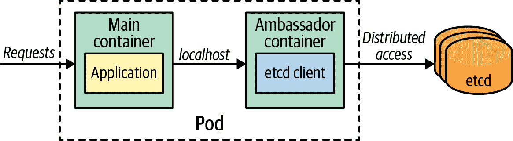
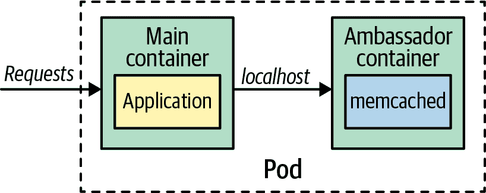

# 第十八章：大使

*大使*模式是一个专门的旁路器，负责隐藏外部复杂性并提供统一接口，用于访问 Pod 外部的服务。在本章中，您将看到*大使*模式如何作为代理，将主容器与直接访问外部依赖项解耦。

# 问题

容器化服务并不孤立存在，很多时候需要访问其他可能难以可靠访问的服务。访问其他服务的困难可能是由于动态和变化的地址、需要对集群服务实例进行负载平衡、不可靠的协议或困难的数据格式等原因。理想情况下，容器应该是单一用途的，并且可以在不同的上下文中重复使用。但是，如果我们有一个容器提供一些业务功能，并以特殊方式消耗外部服务，那么这个容器将具有不止一个职责。

消耗外部服务可能需要一个特殊的服务发现库，我们不希望将其放入我们的容器中。或者我们可能希望通过使用不同类型的服务发现库和方法来交换不同类型的服务。这种抽象和隔离访问外部服务逻辑的技术是这种*大使*模式的目标。

# 解决方案

为了演示这种模式，我们将为应用程序使用缓存。在开发环境中访问本地缓存可能只是一个简单的配置，但在生产环境中，我们可能需要一个客户端配置，可以连接到不同的缓存分片。另一个例子是通过在注册表中查找并执行客户端服务发现来消耗服务。第三个例子是通过不可靠的协议（如 HTTP）消耗服务，因此为了保护我们的应用程序，我们必须使用断路器逻辑、配置超时、执行重试等。

在所有这些情况下，我们可以使用一个大使容器来隐藏访问外部服务的复杂性，并通过 localhost 为主应用程序容器提供简化的视图和访问。图 18-1 和 18-2 显示了一个大使 Pod 如何通过连接到监听本地端口的大使容器来解耦对键值存储的访问。在 图 18-1 中，我们可以看到数据访问如何被委派给完全分布式的远程存储，如 etcd。



###### 图 18-1\. 访问远程分布式缓存的大使

为了开发目的，此大使容器可以轻松与本地运行的内存键值存储（例如 memcached，如图 18-2 所示）进行交换。



###### 图 18-2\. 访问本地缓存的大使

示例 18-1 展示了一个与 REST 服务并行运行的 ambassador。在返回其响应之前，REST 服务通过将生成的数据发送到固定的 URL：*[`localhost:9009`](http://localhost:9009)*来记录数据。Ambassador 进程监听此端口并处理数据。在此示例中，它仅将数据打印到控制台，但也可以执行更复杂的操作，比如将数据转发到完整的日志基础设施。对于 REST 服务来说，日志数据的处理方式并不重要，您可以通过重新配置 Pod 而不接触主容器，轻松地更换 ambassador。

##### 示例 18-1\. Ambassador 处理日志输出

```
apiVersion: v1
kind: Pod
metadata:
  name: random-generator
  labels:
    app: random-generator
spec:
  containers:
  - image: k8spatterns/random-generator:1.0            
    name: main
    env:
    - name: LOG_URL                                    
      value: http://localhost:9009
    ports:
    - containerPort: 8080
      protocol: TCP
  - image: k8spatterns/random-generator-log-ambassador 
    name: ambassador
```


主应用程序容器提供 REST 服务以生成随机数。


通过本地主机与 ambassador 通信的连接 URL。


Ambassador 并行运行并侦听 9009 端口（该端口不对 Pod 外部公开）。

# 讨论

从更高的层次来看，*Ambassador* 模式是 *Sidecar* 模式的一种。Ambassador 和 sidecar 的主要区别在于，ambassador 不会通过附加功能增强主应用程序，而是仅作为对外智能代理（有时这种模式也被称为 *Proxy* 模式）。这种模式对于难以通过现代网络概念（如监视、日志记录、路由和弹性模式）修改和扩展的传统应用程序非常有用。

*Ambassador* 模式的好处类似于 *Sidecar* 模式——两者都允许您保持容器的单一用途和可重复使用性。通过这种模式，我们的应用程序容器可以专注于其业务逻辑，并将消费外部服务的责任和具体细节委托给另一个专门的容器。这还允许您创建专门的、可重复使用的 ambassador 容器，可以与其他应用程序容器组合使用。

# 更多信息

+   [Ambassador 示例](https://oreil.ly/m0KTi)

+   [如何使用 Ambassador 模式动态配置 CoreOS 上的服务](https://oreil.ly/TPQX5)

+   [CoreOS Ambassador 模式的修改](https://oreil.ly/6bszq)
