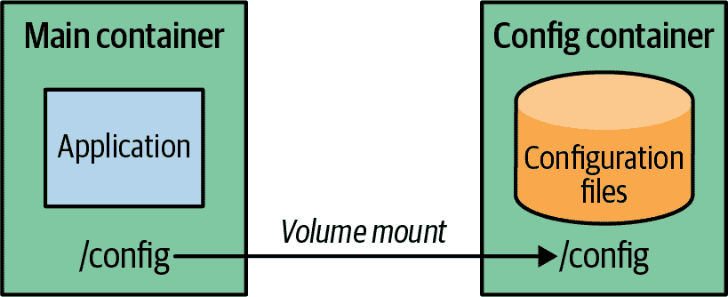
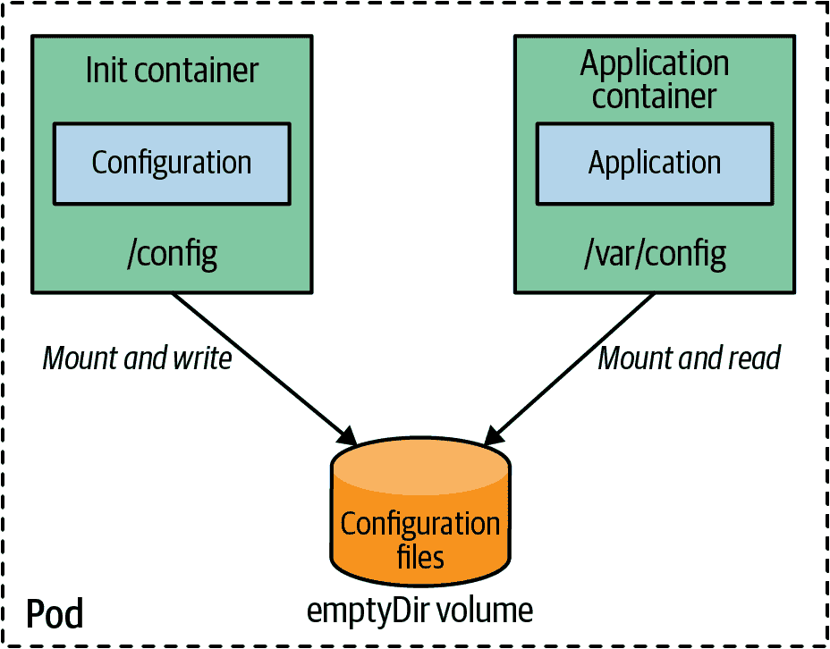

# 第二十一章：不可变配置

*不可变配置* 模式提供了两种使配置数据不可变的方法，以确保应用程序的配置始终处于良好已知和记录的状态。通过此模式，我们不仅可以使用不可变和版本化的配置数据，还可以克服存储在环境变量或 ConfigMaps 中的配置数据的大小限制。

# 问题

正如您在 第十九章，“EnvVar 配置” 中看到的那样，环境变量提供了一种简单的方法来配置基于容器的应用程序。尽管它们易于使用并且得到普遍支持，但一旦环境变量的数量超过某个阈值，管理它们就变得困难。

这种复杂性可以通过使用 *配置资源* 在一定程度上加以处理，如 第二十章，“配置资源” 中所述，自 Kubernetes 1.21 起可以声明为 *不可变*。然而，ConfigMaps 仍然存在大小限制，因此如果您处理大型配置数据（例如机器学习上下文中的预计算数据模型），即使标记为不可变，ConfigMaps 也不适用。

*不可变性* 意味着应用程序启动后我们无法更改配置，以确保配置数据始终保持良好定义的状态。此外，不可变配置可以放入版本控制，并遵循变更控制流程。

# 解决方案

有几种选项可以解决配置不可变性的问题。最简单和首选的选项是使用在声明中标记为不可变的 ConfigMaps 或 Secrets。您在 第二十章 中已了解到不可变的 ConfigMaps。如果您的配置适合 ConfigMap 并且易于维护，则应首选 ConfigMaps。然而，在实际场景中，配置数据量可能会迅速增加。尽管 WildFly 应用服务器配置可能仍适合于 ConfigMap，但它非常庞大。当您需要将 XML 或 YAML 嵌套到 YAML 中时，情况变得非常复杂——也就是说，当您的配置内容也是 YAML 并且将其嵌入到 ConfigMaps 的 YAML 部分中时。编辑器对这种用例的支持有限，因此您必须非常小心地处理缩进，即使如此，您可能会多次出错（相信我们！）。另一个噩梦是需要在单个 ConfigMap 中维护数十个或数百个条目，因为您的应用程序需要许多不同的配置文件。虽然可以通过良好的工具来在一定程度上减少这种痛苦，但像预训练的机器学习数据模型这样的大型配置数据集因为后端大小限制为 1 MB 而无法使用 ConfigMap。

为了解决复杂配置数据的问题，我们可以将所有特定环境配置数据放入一个单独的被动数据镜像中，这个镜像可以像常规容器镜像一样分发。在运行时，应用程序和数据镜像进行链接，以便应用程序可以从数据镜像中提取配置。通过这种方式，可以轻松地为各种环境制作不同的配置数据镜像。这些镜像将所有特定环境的配置信息组合起来，并且可以像其他容器镜像一样进行版本控制。

创建这样一个数据镜像非常简单，因为它只是包含数据的简单容器镜像。挑战在于启动期间的链接步骤。我们可以根据平台使用各种方法。

## Docker 卷

在探讨 Kubernetes 之前，让我们先回顾一下纯 Docker 的情况。在 Docker 中，容器可以通过 *卷（volume）* 共享来自容器的数据。在 Dockerfile 中使用 `VOLUME` 指令，可以指定一个稍后可以共享的目录。在启动过程中，容器内该目录的内容会复制到共享目录中。如 图 21-1 所示，这种卷链接是从专用配置容器向其他应用容器共享配置信息的优秀方式。



###### 图 21-1\. 使用 Docker 卷进行不可变配置

让我们看一个例子。对于开发环境，我们创建一个包含开发人员配置的 Docker 镜像，并创建一个带有挂载点 */config* 的卷。我们可以使用 `Dockerfile-config` 创建这样的镜像，如 示例 21-1 所示。

##### 示例 21-1\. 用于配置镜像的 Dockerfile

```
FROM scratch
ADD app-dev.properties /config/app.properties  
VOLUME /config                                 
```


添加指定属性。


创建卷并将属性复制到其中。

现在我们使用 Docker CLI 创建镜像本身和 Docker 容器，如 示例 21-2 所示。

##### 示例 21-2\. 构建配置 Docker 镜像

```
docker build -t k8spatterns/config-dev-image:1.0.1 -f Dockerfile-config .
docker create --name config-dev k8spatterns/config-dev-image:1.0.1 .
```

最后一步是启动应用程序容器并将其连接到此配置容器（示例 21-3）。

##### 示例 21-3\. 使用配置容器链接启动应用程序容器

```
docker run --volumes-from config-dev k8spatterns/welcome-servlet:1.0
```

应用程序镜像期望其配置文件位于 */config* 目录中，即由配置容器暴露的卷。当您将此应用程序从开发环境移至生产环境时，您只需更改启动命令。无需修改应用程序镜像本身。相反，您只需将应用容器与生产配置容器进行卷链接，如 示例 21-4 所示。

##### 示例 21-4\. 在生产环境中使用不同的配置

```
docker build -t k8spatterns/config-prod-image:1.0.1 -f Dockerfile-config .
docker create --name config-prod k8spatterns/config-prod-image:1.0.1 .
docker run --volumes-from config-prod k8spatterns/welcome-servlet:1.0
```

## Kubernetes 初始容器

在 Kubernetes 中，Pod 内部的卷共享非常适合这种链接配置和应用容器的方式。然而，如果我们想将 Docker 卷链接技术转移到 Kubernetes 世界中，我们会发现目前 Kubernetes 并不支持容器卷。考虑到讨论的年龄和实现此功能的复杂性与其受益有限之间的关系，容器卷可能不会很快到来。

因此容器可以共享（外部）卷，但它们目前无法直接共享位于容器内部的目录。要在 Kubernetes 中使用不可变配置容器，我们可以使用来自第十五章的 *Init Containers* 模式，在启动期间初始化空的共享卷。

在 Docker 示例中，我们将配置 Docker 镜像基于`scratch`，这是一个空的 Docker 镜像，没有操作系统文件。我们不需要其他内容，因为我们只希望通过 Docker 卷共享配置数据。但是对于 Kubernetes 初始容器，我们需要基础镜像的帮助，将配置数据复制到共享的 Pod 卷中。这种情况下一个好的选择是`busybox`，它仍然很小，但允许我们使用简单的 Unix `cp`命令来完成此任务。

那么在底层如何初始化带有配置的共享卷？让我们看一个例子。首先，我们需要再次创建一个配置镜像，使用 Dockerfile，就像示例 21-5 中那样。

##### 示例 21-5\. 开发配置镜像

```
FROM busybox
ADD dev.properties /config-src/demo.properties
ENTRYPOINT [ "sh", "-c", "cp /config-src/* $1", "--" ]  
```


在这里使用一个 shell 以解析通配符。

与 示例 21-1 中的普通 Docker 情况唯一的区别是，我们有一个不同的基础镜像，并且我们添加了一个 `ENTRYPOINT`，在容器镜像启动时将属性文件复制到作为参数给出的目录中。现在可以在部署的`.template.spec`中的初始容器中引用此镜像（见示例 21-6）。

##### 示例 21-6\. 在初始容器中将配置复制到目标的部署

```
initContainers:
- image: k8spatterns/config-dev:1
  name: init
  args:
  - "/config"
  volumeMounts:
  - mountPath: "/config"
    name: config-directory
containers:
- image: k8spatterns/demo:1
  name: demo
  ports:
  - containerPort: 8080
    name: http
    protocol: TCP
  volumeMounts:
  - mountPath: "/var/config"
    name: config-directory
volumes:
  - name: config-directory
    emptyDir: {}
```

部署的 Pod 模板规范包含一个卷和两个容器：

+   卷`config-directory`的类型是`emptyDir`，因此它将作为空目录在托管此 Pod 的节点上创建。

+   Kubernetes 在启动期间调用的初始容器是从我们刚刚创建的镜像构建的，并且我们设置了一个单一参数`/config`，被镜像的 `ENTRYPOINT` 使用。此参数指示初始容器将其内容复制到指定的目录。目录`/config`是从卷`config-directory`挂载的。

+   应用容器挂载卷`config-directory`以访问初始容器复制的配置。

图 21-2 说明了应用程序容器如何通过共享卷访问由 init 容器创建的配置数据。



###### 图 21-2\. 具有 init 容器的不可变配置

现在，要从开发环境更改配置到生产环境，我们只需交换 init 容器的镜像即可。我们可以通过更改 YAML 定义或使用`kubectl`进行更新来实现这一点。但是，必须为每个环境编辑资源描述符并不理想。如果您正在使用 Red Hat OpenShift，一个 Kubernetes 的企业分发版，*OpenShift 模板*可以帮助解决此问题。OpenShift 模板可以从单个模板创建不同环境的不同资源描述符。

## OpenShift 模板

OpenShift 模板是常规的资源描述符，可以进行参数化。正如在示例 21-7 中看到的那样，我们可以轻松地将配置图像用作参数。

##### 示例 21-7\. 用于参数化配置图像的 OpenShift 模板

```
apiVersion: v1
kind: Template
metadata:
  name: demo
parameters:
  - name: CONFIG_IMAGE                       
    description: Name of configuration image
    value: k8spatterns/config-dev:1
objects:
- apiVersion: apps/v1
  kind: Deployment
    // ....
    spec:
      template:
          metadata:
            // ....
            spec:
              initContainers:
              - name: init
                image: ${CONFIG_IMAGE}       
                args: [ "/config" ]
                volumeMounts:
                - mountPath: /config
                  name: config-directory
              containers:
              - image: k8spatterns/demo:1
                // ...
                volumeMounts:
                - mountPath: /var/config
                  name: config-directory
            volumes:
            - name: config-directory
              emptyDir: {}
```


模板参数`CONFIG_IMAGE`声明。


使用模板参数。

我们在此处仅显示完整描述符的片段，但您可以快速识别我们在 init 容器声明中引用的`CONFIG_IMAGE`参数。如果我们在 OpenShift 集群上创建此模板，可以通过调用`oc`来实例化它，如示例 21-8 所示。

##### 示例 21-8\. 应用 OpenShift 模板以创建新应用程序

```
oc new-app demo -p CONFIG_IMAGE=k8spatterns/config-prod:1
```

运行此示例的详细说明以及完整的部署描述符通常可以在我们的示例 Git 存储库中找到。

# 讨论

对于*不可变配置*模式使用数据容器确实有些复杂。只有在不适合您的用例使用不可变 ConfigMaps 和 Secret 时才使用这些。

数据容器具有一些独特的优势：

+   环境特定的配置封装在容器中。因此，它可以像任何其他容器镜像一样进行版本控制。

+   以这种方式创建的配置可以分发到容器注册表。即使不访问集群，也可以检查配置。

+   配置是不可变的，持有配置的容器镜像也是如此：配置的更改需要版本更新和新的容器镜像。

+   当配置数据太复杂而无法放入环境变量或 ConfigMaps 时，配置数据镜像非常有用，因为它可以容纳任意大的配置数据。

如预期的那样，*不可变配置*模式也具有某些缺点：

+   由于需要构建并通过注册表分发额外的容器镜像，因此复杂度较高。

+   它未解决围绕敏感配置数据的任何安全问题。

+   由于 Kubernetes 工作负载实际上不支持镜像卷，因此本文描述的技术仍然局限于那些从初始化容器复制数据到本地卷的开销可以接受的用例。我们希望未来能够直接将容器镜像挂载为卷，但截至 2023 年，只有实验性的 CSI 支持可用。

+   Kubernetes 案例中需要额外的初始化容器处理，因此我们需要为不同环境管理不同的部署对象。

总的来说，你应该仔细评估是否真的需要这样复杂的方法。

处理大型配置文件的另一种方法是使用*配置模板*模式，这是下一章的主题，用于描述只在环境之间略有不同的配置文件。

# 更多信息

+   [不可变配置示例](https://oreil.ly/1bPZ2)

+   [如何在 Kubernetes 中模拟 `--volumes-from`](https://oreil.ly/bTtty)

+   [不可变的 ConfigMaps](https://oreil.ly/RfrwN)

+   [功能请求：镜像卷和容器卷](https://oreil.ly/XQ54e)

+   [docker-flexvol：支持 Docker 卷的 Kubernetes 驱动](https://oreil.ly/vhCdH)

+   [Red Hat OpenShift：使用模板](https://oreil.ly/QyX2y)

+   [挂载镜像的 Kubernetes CSI 驱动](https://oreil.ly/OMqRo)
