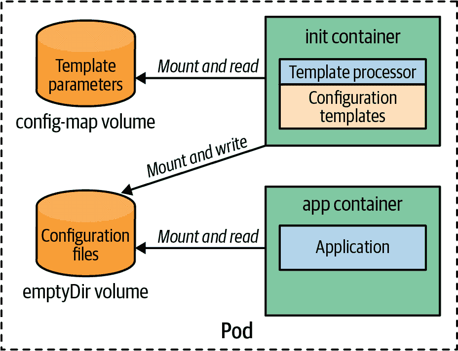

# 第二十二章：配置模板

*配置模板*模式使您能够在应用程序启动期间创建和处理大型复杂配置。生成的配置特定于目标运行时环境，这反映在处理配置模板时使用的参数中。

# 问题

在第二十章，“配置资源”中，您看到如何使用 Kubernetes 的原生资源对象 ConfigMap 和 Secret 配置应用程序。但是有时配置文件可能变得很大且复杂。直接将配置文件放入 ConfigMap 可能会出现问题，因为它们必须正确嵌入在资源定义中。我们需要小心，避免使用特殊字符如引号并破坏 Kubernetes 资源语法。配置大小也是考虑的因素，因为 ConfigMap 或 Secret 的所有值的总和有 1 MB 的限制（这是底层后端存储 etcd 强加的限制）。

大型配置文件通常在不同的执行环境中只有细微的差异。这种相似性导致 ConfigMap 中存在大量的重复和冗余数据，因为每个环境大部分数据都是相同的。本章探讨的*配置模板*模式正是针对这些特定用例的问题。

# 解决方案

为了减少重复，将只有*不同*的配置数值（如数据库连接参数）存储在 ConfigMap 中或直接存储在环境变量中是有意义的。在容器启动期间，使用配置模板处理这些数值，以创建完整的配置文件（例如 WildFly 的*standalone.xml*）。在应用初始化期间，有许多工具如*Tiller*（Ruby）或*Gomplate*（Go）可用于处理模板。图 22-1 展示了一个配置模板示例，其中填充了来自环境变量或挂载卷的数据。

在应用程序启动之前，完全处理的配置文件被放置在一个位置，可以像任何其他配置文件一样直接使用。

有两种技术可以在运行时进行实时处理：

+   我们可以将模板处理器作为`Dockerfile`的一部分添加到`ENTRYPOINT`中，使模板处理直接成为容器镜像的一部分。此处的入口点通常是一个脚本，首先执行模板处理，然后启动应用程序。模板的参数来自环境变量。

+   使用 Kubernetes，更好的初始化方法是在 Pod 的 init 容器中运行模板处理器，并为 Pod 中的应用程序容器创建配置。*Init Container*模式在第十五章中详细描述。

对于 Kubernetes，init 容器方法最具吸引力，因为我们可以直接使用 ConfigMaps 来作为模板参数。这种技术在 *Figure 22-1* 中有所说明。



###### 图 22-1\. 配置模板

应用程序的 Pod 定义至少包含两个容器：一个用于模板处理的 init 容器和一个用于应用程序容器。init 容器不仅包含模板处理器，还包括配置模板本身。除了容器之外，此 Pod 还定义了两个卷：一个卷用于模板参数，由 ConfigMap 支持，以及一个 `emptyDir` 卷用于在 init 容器和应用程序容器之间共享处理后的模板。

使用此设置，在此 Pod 启动期间执行以下步骤：

1.  启动 init 容器，并运行模板处理器。处理器从其镜像获取模板，并从挂载的 ConfigMap 卷获取模板参数，并将结果存储在 `emptyDir` 卷中。

1.  init 容器完成后，应用程序容器启动并从 `emptyDir` 卷加载配置文件。

下面的示例使用一个 init 容器来管理两个环境的完整的 WildFly 配置文件集：开发环境和生产环境。它们非常相似，只有细微的差别。事实上，在我们的示例中，它们仅在日志记录方式上有所不同：每个日志行分别以 `DEVELOPMENT:` 或 `PRODUCTION:` 开头。

您可以在书籍的示例 [GitHub 仓库](https://oreil.ly/gzSdc) 中找到完整示例以及完整的安装说明。（我们仅在此处展示主要概念；有关技术细节，请参阅源代码库。）

*Example 22-1* 中的日志模式存储在 *standalone.xml* 中，我们通过使用 Go 模板语法进行参数化。

##### 示例 22-1\. 日志配置模板

```
....
<formatter name="COLOR-PATTERN">
  <pattern-formatter pattern="{{(datasource "config").logFormat}}"/>
</formatter>
....
```

这里我们使用 [Gomplate](https://gomplate.ca) 作为模板处理器，它使用 *data source* 的概念来引用要填充的模板参数。在我们的情况下，这个数据源来自挂载到 init 容器的 ConfigMap 支持的卷。在这里，ConfigMap 包含一个键为 `logFormat` 的条目，从中提取实际的格式。

有了这个模板，我们现在可以为 init 容器创建 Docker 镜像。这个镜像的 Dockerfile 非常简单（*Example 22-2*）。

##### 示例 22-2\. 用于模板镜像的简单 Dockerfile

```
FROM k8spatterns/gomplate
COPY in /in
```

基础镜像 *k8spatterns/gomplate* 包含模板处理器和一个入口脚本，默认使用以下目录：

+   */in* 包含 WildFly 配置模板，包括参数化的 *standalone.xml*。这些直接添加到镜像中。

+   */params* 用于查找 Gomplate 数据源，这些是 YAML 文件。此目录从支持 ConfigMap 的 Pod 卷挂载。

+   */out* 是存储处理后文件的目录。此目录挂载在 WildFly 应用容器中，用于配置。

我们示例的第二个成分是包含参数的 ConfigMap。在示例 22-3 中，我们只使用一个简单的键-值对文件。

##### 示例 22-3\. 创建 ConfigMap，其中包含要填入配置模板的值

```
kubectl create configmap wildfly-cm \
       --from-literal='config.yml=logFormat: "DEVELOPMENT: %-5p %s%e%n'
```

最后，我们需要 WildFly 服务器的 Deployment 资源（示例 22-4）。

##### 示例 22-4\. 带有模板处理器作为 init 容器的 Deployment

```
apiVersion: apps/v1
kind: Deployment
metadata:
  labels:
    example: cm-template
  name: wildfly-cm-template
spec:
  replicas: 1
  template:
    metadata:
      labels:
        example: cm-template
    spec:
      initContainers:
      - image: k8spatterns/example-config-cm-template-init 
        name: init
        volumeMounts:
        - mountPath: "/params"                             
          name: wildfly-parameters
        - mountPath: "/out"                                
          name: wildfly-config
      containers:
      - image: jboss/wildfly:10.1.0.Final
        name: server
        command:
        - "/opt/jboss/wildfly/bin/standalone.sh"
        - "-Djboss.server.config.dir=/config"
        volumeMounts:
        - mountPath: "/config"                             
          name: wildfly-config
      volumes:                                             
      - name: wildfly-parameters
        configMap:
          name: wildfly-cm
      - name: wildfly-config
        emptyDir: {}
```


包含已从示例 22-2 创建的配置模板的镜像。


参数从声明在  中的 `wildfly-parameters` 卷挂载。


写出处理后模板的目标目录。这是从一个空卷挂载的。


挂载生成的完整配置文件的目录为 `/config`。


参数的 ConfigMap 和用于共享处理后配置的空目录的卷声明。

这个声明有点复杂，因此让我们详细看看：Deployment 规范包含一个 Pod，其中包含我们的 init 容器、应用容器和两个内部 Pod 卷：

+   第一个卷 `wildfly-parameters` 引用了参数值的 ConfigMap `wildfly-cm`，我们在示例 22-3 中创建的。

+   另一个卷最初是空目录，并在 init 容器和 WildFly 容器之间共享。

如果启动此 Deployment，将发生以下情况：

+   创建一个 init 容器，并执行其命令。此容器从 ConfigMap 卷中获取 *config.yml*，从 */in* 目录填充模板，并将处理后的文件存储在 */out* 目录中。*/out* 目录是挂载 `wildfly-config` 的位置。

+   当 init 容器完成后，WildFly 服务器启动，并选择从 */config* 目录查找完整配置。同样，*/config* 是共享卷 `wildfly-config`，包含处理后的模板文件。

需要注意的是，当从开发环境转到生产环境时，我们*不*必更改这些 Deployment 资源描述符。唯一不同的是模板参数的 ConfigMap。

使用这种技术，可以轻松创建无重复的配置，而无需复制和维护重复的大型配置文件。^(1) 例如，当所有环境的 WildFly 配置发生更改时，只需更新初始化容器中的单个模板文件。当然，这种方法在维护上具有显著优势，因为不存在配置漂移的风险。

###### 小贴士

在处理像这样的模式中，例如与 Pods 和卷一起工作时，如果事情不按预期工作，如何调试并不明显。因此，如果您想要检查处理过的模板，请查看节点上的目录 */var/lib/kubelet/pods/{podid}/volumes/kubernetes.io~empty-dir/*，因为它包含了一个 `emptyDir` 卷的内容。或者，当 Pod 运行时，只需 `kubectl exec` 进入 Pod，并检查挂载的目录（在我们的示例中为 */config*）是否创建了任何文件。

# 讨论

*配置模板*模式建立在*配置资源*模式之上，特别适用于需要在不同环境中操作具有类似复杂配置的应用程序。然而，配置模板的设置更为复杂，包含更多可能出错的部分。只有当您的应用程序需要大量配置数据时才使用它。这类应用程序通常需要大量配置数据，其中只有很小一部分依赖于环境。即使最初直接复制整个配置到特定环境的 ConfigMap 中可以工作，但这会增加配置维护的负担，因为随着时间的推移，配置注定会发生分歧。对于这种情况，这种模板方法是完美的。

如果您在 Red Hat OpenShift 上运行，这是一个企业级 Kubernetes 发行版，您可以使用[OpenShift 模板](https://oreil.ly/JuYab)来参数化资源描述符。这种方法虽然不能解决大型配置集的挑战，但对于将相同的部署资源应用于稍有不同的环境仍然非常有帮助。

# 更多信息

+   [配置模板示例](https://oreil.ly/gzSdc)

+   [Tiller 模板引擎](https://oreil.ly/0gPNC)

+   [Gomplate](https://oreil.ly/e-5mR)

+   [Go Template 语法](https://oreil.ly/fHi0o)

^(1) [DRY](https://oreil.ly/Xitl7) 是 “Don’t Repeat Yourself” 的首字母缩略词。
