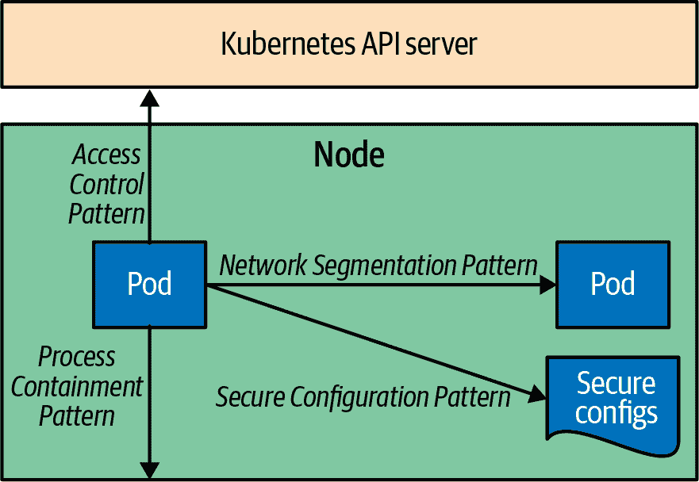

# 第五部分：安全模式

安全是一个广泛的主题，对软件开发生命周期的所有阶段都有影响，从开发实践、构建时的镜像扫描，到部署时通过准入控制器加强集群硬化，再到运行时的威胁检测。安全也涉及软件堆栈的所有层面，从云基础设施安全、集群安全、容器安全，到代码安全，也被称为云原生安全的 4C。在本节中，我们关注应用程序与 Kubernetes 在安全角度的交集，如在图 V-1 中展示的。

###### 图 V-1\. 安全模式

我们首先描述*进程封装*模式，以限制应用程序在其运行的节点上允许执行的操作。然后我们探讨*网络分割*技术，限制一个 Pod 可以与其他 Pods 交流的方式。在*安全配置*模式中，我们讨论 Pod 内应用程序如何安全访问和使用配置。最后，我们描述*访问控制*模式——应用程序如何在更复杂的场景中进行身份验证并与 Kubernetes API 服务器交互。这些内容为您提供了在 Kubernetes 上运行应用程序的主要安全维度的概述，接下来的章节我们将详细讨论相关模式：

+   第二十三章，“进程封装”，描述了将进程限制到其享有的最低权限的方法。

+   第二十四章，“网络分割”，应用网络控制以限制 Pod 可以参与的流量。

+   第二十五章，“安全配置”，帮助安全地保留和使用敏感配置数据。

+   第二十六章，“访问控制”，允许用户和应用负载对 Kubernetes API 服务器进行身份验证和交互。
