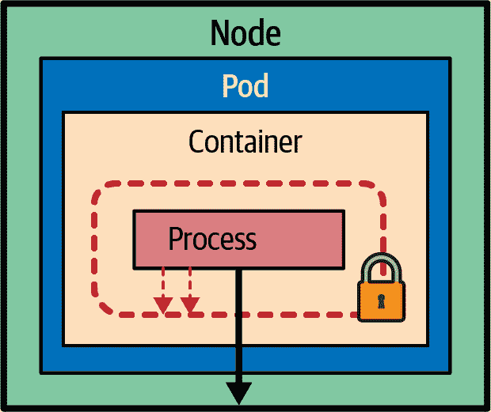

# 第二十三章：进程约束

本章描述了帮助将最小权限原则应用于将进程限制到其运行所需最小权限的技术。*进程约束* 模式通过限制攻击面和创建防线，使应用程序更加安全。它还防止任何流氓进程超出其指定边界运行。

# 问题

Kubernetes 工作负载的主要攻击向量之一是通过应用程序代码。许多技术可以帮助改进代码安全性。例如，静态代码分析工具可以检查源代码中的安全漏洞。动态扫描工具可以模拟恶意攻击者，旨在通过已知服务攻击，如 SQL 注入（SQLi）、跨站请求伪造（CSRF）和跨站脚本（XSS）攻击来入侵系统。然后还有工具定期扫描应用程序的依赖项，查找安全漏洞。作为镜像构建过程的一部分，会扫描已知漏洞的容器。通常通过检查基础镜像及其所有软件包与跟踪有漏洞软件包的数据库来完成这一步骤。这些只是创建安全应用程序和防范恶意行为者、受损用户、不安全容器映像或有漏洞依赖项所涉及的步骤之一。

无论有多少检查措施，新的代码和新的依赖项都可能引入新的漏洞，无法保证完全没有风险存在。如果没有运行时进程级安全控制措施，恶意行为者可以入侵应用程序代码，试图控制主机或整个 Kubernetes 集群。本章中将探讨的机制展示了如何将容器限制在其运行所需的权限范围内，并应用最小权限原则。通过这种方式，Kubernetes 配置作为另一道防线，限制任何流氓进程并防止其超出指定边界运行。

# 解决方案

通常，诸如 Docker 这样的容器运行时会分配容器将具有的默认运行时权限。当容器由 Kubernetes 管理时，将应用于容器的安全配置由 Kubernetes 控制，并通过 Pod 的安全上下文配置和容器规范向用户公开。Pod 级别的配置适用于 Pod 的卷和所有容器，而容器级别的配置则适用于单个容器。当在 Pod 和容器级别同时设置相同配置时，容器规范中的值优先生效。

作为创建云原生应用程序的开发人员，通常不需要处理许多细粒度的安全配置，而是应将它们作为全局策略进行验证和强制执行。在创建专用基础设施容器（如构建系统和其他需要对底层节点具有更广泛访问权限的插件）时通常需要进行细粒度调整。因此，我们将仅审查对在 Kubernetes 上运行典型云原生应用程序有用的常见安全配置。

## 以非 root 用户身份运行容器

容器镜像具有一个用户，并且可以选择性地具有一个组，用于运行容器进程。这些用户和组用于控制对文件、目录和卷挂载的访问权限。在某些其他容器中，不会创建用户，并且容器镜像默认以 root 用户身份运行。在其他情况下，容器镜像中创建了一个用户，但未设置为默认要运行的用户。可以通过在运行时使用`securityContext`覆盖用户来纠正这些情况，如示例 23-1 所示。

##### 示例 23-1。为 Pod 的容器设置用户和组

```
apiVersion: v1
kind: Pod
metadata:
  name: web-app
spec:
  securityContext:
    runAsUser: 1000   
    runAsGroup: 2000  
  containers:
  - name: app
    image: k8spatterns/random-generator:1.0
```


指示要运行容器进程的 UID。


指定要运行容器进程的 GID。

该配置强制 Pod 中的任何容器以用户 ID 1000 和组 ID 2000 运行。当您想要交换容器镜像中指定的用户时，这是有用的。但是在设置这些值并在运行时决定要运行镜像的用户时也存在风险。通常，用户与包含具有与容器镜像中指定的所有权 ID 相同的文件的目录结构一起设置。为了避免由于权限不足而导致运行时失败，您应该检查容器镜像文件，并使用定义的用户 ID 和组 ID 运行容器。这是防止容器以 root 用户身份运行并将其匹配到镜像中预期用户的一种方式。

不需要指定用户 ID 来确保容器不以 root 用户身份运行，一种更不具侵入性的方法是将`.spec.securityContext.runAsNonRoot`标志设置为`true`。设置后，Kubelet 将在运行时验证并阻止任何以 root 用户（即 UID 0 的用户）启动的容器。这种机制不会改变用户，只是确保容器以非 root 用户身份运行。如果需要以 root 用户身份运行以访问容器中的文件或卷，可以通过运行一个可以短暂以 root 用户身份运行的 init 容器来限制对 root 的暴露，并在应用容器启动为非 root 用户之前更改文件访问模式。

容器可能不以 root 用户身份运行，但通过特权升级可以获得类似 root 的能力。这与在 Linux 上使用 `sudo` 命令并以 root 权限执行命令最为类似。在容器中防止这种情况的方法是将 `.spec.containers[].securityContext.allowPrivilege​Es⁠calation` 设置为 `false`。这种配置通常没有副作用，因为如果一个应用程序设计为以非 root 用户身份运行，它在其生命周期中不应该需要特权升级。

在 Linux 系统中，root 用户具有特殊的权限和特权，阻止 root 用户拥有容器进程、提升权限以成为 root 或通过 init 容器限制 root 用户的生命周期，将有助于防止容器逃逸攻击，并确保遵循一般的安全实践。

## 限制容器的能力

本质上，一个容器是在节点上运行的一个进程，它可以拥有进程具备的相同特权。如果进程需要进行内核级别的调用，它需要拥有相应的特权才能成功执行。可以通过两种方式实现这一点：要么以 root 用户身份运行容器，从而授予容器所有特权；要么分配应用程序运行所需的特定能力。

设置了 `.spec.containers[].securityContext.privileged` 标志的容器本质上相当于主机上的 root 用户，并绕过了内核权限检查。从安全角度来看，这个选项将您的容器与主机系统捆绑在一起，而不是隔离它们。因此，此标志通常为具有管理能力的容器设置，例如操纵网络堆栈或访问硬件设备。避免使用特权容器，并为需要的容器赋予特定的内核能力是更好的方法。在 Linux 中，通常与 root 用户相关联的权限被分为不同的能力，可以独立地启用和禁用。查找容器具有哪些能力并不简单。您可以采用白名单方法，在不具备任何能力的情况下启动容器，并根据容器内每个用例逐渐添加所需的能力。您可能需要安全团队的帮助，或者可以使用 SELinux 等工具以宽容模式，并检查应用程序的审计日志，以了解它是否需要某些能力。

为了使容器更加安全，应该尽量减少所需运行权限。容器运行时会为容器分配一组默认权限（能力）。与您的预期相反，如果`.spec.containers[].securityContext.capabilities`部分为空，则容器运行时定义的默认能力集通常比大多数进程需要的要丰富得多，这将使其容易受到攻击。锁定容器攻击面的良好安全实践是丢弃所有权限，并仅添加所需权限，如示例 23-2 所示。

##### 示例 23-2\. 设置 Pod 权限

```
apiVersion: v1
kind: Pod
metadata:
  name: web-app
spec:
  containers:
  - name: app
    image: docker.io/centos/httpd
    securityContext:
      capabilities:
        drop: [ 'ALL' ]            
        add: ['NET_BIND_SERVICE']  
```


移除容器运行时为容器分配的所有默认能力。


仅添加回`NET_BIND_SERVICE`能力。

在此示例中，我们丢弃所有能力，并仅添加回`NET_BIND_SERVICE`能力，该能力允许绑定到低于 1024 的特权端口号。解决此场景的另一种方法是使用绑定到非特权端口号的容器替换该容器。

如果未配置 Pod 的安全上下文或设置过于宽松，则该 Pod 更容易被攻击者利用。将容器的能力限制到最低限度可以作为对已知攻击的额外防线。当容器进程不具有特权或其能力受到严格限制时，恶意用户在攻击应用程序后更难控制主机。

## 避免可变容器文件系统

通常情况下，容器化应用程序不应能够写入容器文件系统，因为容器是临时的，任何状态在重启后都将丢失。正如第十一章，“无状态服务”中所讨论的，状态应写入外部持久性方法，例如数据库或文件系统。日志应写入标准输出或转发到远程日志收集器。此类应用程序可以通过具有只读容器文件系统进一步限制容器的攻击面。只读文件系统将防止任何恶意用户篡改应用程序配置或在磁盘上安装其他可用于进一步利用的可执行文件。实现此目的的方法是将`.spec.containers[].securityContext.readOnlyRootFile`设置为`true`，这将在运行时将容器的根文件系统挂载为只读。这样可以防止对容器根文件系统的任何写入，并执行不可变基础设施的原则。

`securityContext`字段中的完整值列表有许多其他项，并且可以在 Pod 和容器配置之间有所不同。本书的范围超出了覆盖所有安全配置的范围。另外两个必须检查的安全上下文选项是`seccompProfile`和`seLinuxOptions`。前者是 Linux 内核功能，可用于限制容器中运行的进程仅调用可用系统调用的子集。这些系统调用配置为配置文件，并应用于容器或 Pod。

后一选项，`seLinuxOptions`，可以为 Pod 内所有容器以及卷分配自定义 SELinux 标签。SELinux 使用策略来定义哪些进程可以访问系统中的其他标记对象。在 Kubernetes 中，它通常用于以限制的方式标记容器镜像，以便进程仅访问镜像内的文件。当主机环境支持 SELinux 时，可以严格执行以拒绝访问，或者可以配置为宽松模式以记录访问违规。

为每个 Pod 或容器配置这些字段会导致它们容易受到人为错误的影响。不幸的是，设置它们通常是工作负载作者的责任，这些作者通常不是组织中的安全专家。这就是为什么还有集群级别、由集群管理员定义的基于策略驱动的手段，用于确保命名空间中的所有 Pods 符合最低安全标准。接下来让我们简要回顾一下。

## 强制执行安全策略

到目前为止，我们已经探讨了使用`securityContext`定义作为 Pod 和容器规范的一部分来设置容器运行时的安全参数。这些规范是针对每个 Pod 单独创建的，并且通常是通过更高层次的抽象（如 Deployments、Jobs 和 CronJobs）间接创建的。但是，集群管理员或安全专家如何确保一组 Pods 遵循某些安全标准呢？答案在于 Kubernetes Pod 安全标准（PSS）和 Pod 安全 Admission（PSA）控制器。PSS 定义了关于安全策略的共同理解和一致语言，而 PSA 则有助于强制执行这些策略。这种方式，策略独立于底层执行机制，并且可以通过 PSS 或其他第三方工具应用。这些策略分为三个安全配置文件，从高度允许到高度限制，如下所示：

特权

这是一个权限最广的不受限制的配置文件。它被故意保持开放，并为信任用户和基础设施工作负载提供默认允许机制。

基线

这个配置文件适用于普通的非关键应用工作负载。它具有最小限制策略，并在采纳度和预防已知特权升级之间提供了平衡。例如，它不允许特权容器、某些安全功能以及`securityContext`字段外的其他配置。

受限制

这是遵循最新安全强化最佳实践的最严格配置文件，以牺牲采纳度为代价。它适用于安全关键应用程序以及较低信任级别的用户。在基线配置文件的基础上，它对我们之前审查的字段施加了限制，如`allowPrivilegeEscalation`、`runAsNonRoot`、`runAsUser`以及其他容器配置。

PodSecurityPolicy 是 Kubernetes v1.25 中替换为 PSA 的遗留安全策略实施机制。未来，您可以使用第三方接入插件或内置的 PSA 控制器为每个命名空间强制执行安全标准。安全标准通过标签应用于 Kubernetes 命名空间，定义了前述标准级别以及在检测到潜在违规时采取的一个或多个操作。以下是您可以采取的操作：

警告

策略违规将允许用户显示警告。

审计

策略违规将允许带有审计日志条目的 Pod。

强制执行

任何策略违规都将导致 Pod 被拒绝。

有了这些定义的选项，示例 23-3 创建了一个拒绝任何不符合 *基线* 标准的 Pods 的命名空间，并为不满足 *受限制* 标准要求的 Pods 生成警告。

##### 示例 23-3\. 为命名空间设置安全标准

```
apiVersion: v1
kind: Namespace
metadata:
  name: baseline-namespace
  labels:
    pod-security.kubernetes.io/enforce: baseline             
    pod-security.kubernetes.io/enforce-version: v1.25        
    pod-security.kubernetes.io/warn: restricted              
    pod-security.kubernetes.io/warn-version: v1.25
```


标签提示 PSA 控制器拒绝违反 *基线* 标准的 Pods。


安全标准要求的版本（可选）。


标签提示 PSA 控制器警告违反 *受限制* 标准的 Pods。

此示例创建一个新的命名空间，并配置安全标准，以应用于此命名空间中将创建的所有 Pods。还可以更新命名空间的配置或将策略应用于一个或所有现有命名空间。有关如何以最少分布方式执行此操作的详细信息，请查看“更多信息”。

# 讨论

Kubernetes 中的一个常见安全挑战是运行传统应用程序，这些应用程序在设计或容器化时未考虑 Kubernetes 安全控制。在 Kubernetes 发行版或具有严格安全策略的环境中运行特权容器可能会面临挑战。了解 Kubernetes 如何在运行时进行进程限制并配置安全边界，如图 23-1 所示，将帮助您更安全地创建在 Kubernetes 上运行的应用程序。重要的是要意识到容器不仅仅是一种打包格式和资源隔离机制，当正确配置时，它还是一道安全防护墙。



###### 图 23-1\. 进程限制模式

将安全考虑和测试实践向左移的倾向，包括使用生产安全标准在 Kubernetes 中部署，越来越受欢迎。这些做法有助于在开发周期的早期识别和解决安全问题，避免最后一刻的意外。

###### 注意

*左移* 是指尽早而非晚做事情。它是指在描述开发和部署过程的时间轴上向左移动。在我们的背景下，左移意味着开发人员在开发应用程序时已经考虑到操作安全性。在[Devopedia](https://oreil.ly/cdw3f)上查看有关左移模型的更多细节。

在本章中，我们希望为您创建安全的云原生应用程序提供了足够的思路。本章中的指南将帮助您设计和实施不会向本地文件系统写入或需要 root 权限的应用程序（例如，在容器化应用程序时，确保容器具有指定的非 root 用户）并配置安全上下文。我们希望您明确了解您的应用程序确切需要什么，并仅为其授予最低权限。我们还旨在帮助您在工作负载和主机之间建立边界，减少容器权限，并配置运行时环境以在发生违规时限制资源利用。在这方面，“进程限制”模式确保“容器内发生的一切都留在容器内”，包括任何安全漏洞。

# 更多信息

+   [进程限制示例](https://oreil.ly/Seeg_)

+   [为 Pod 或容器配置安全上下文](https://oreil.ly/e7lKN)

+   [Pod 安全审核](https://oreil.ly/S8ac9)

+   [Pod 安全标准](https://oreil.ly/2xzlg)

+   [使用命名空间标签强制实施 Pod 安全标准](https://oreil.ly/FnVMh)

+   [准入控制器参考：Pod 安全性](https://oreil.ly/QnhLj)

+   [Linux 权限](https://oreil.ly/GkHt7)

+   [安全上下文和 SCCs 简介](https://oreil.ly/IkMnH)

+   [你应该理解的 10 个 Kubernetes 安全上下文设置](https://oreil.ly/f04Xj)

+   [用于 Kubernetes 资源的安全风险分析工具](https://oreil.ly/pbAqs)
