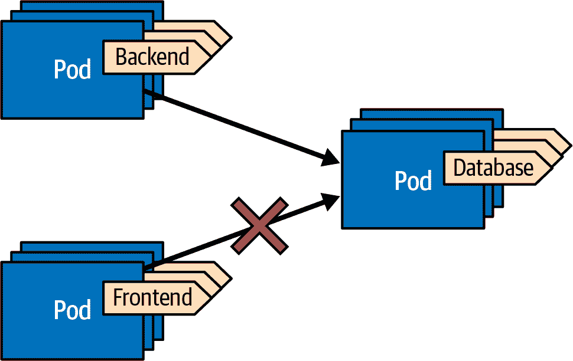
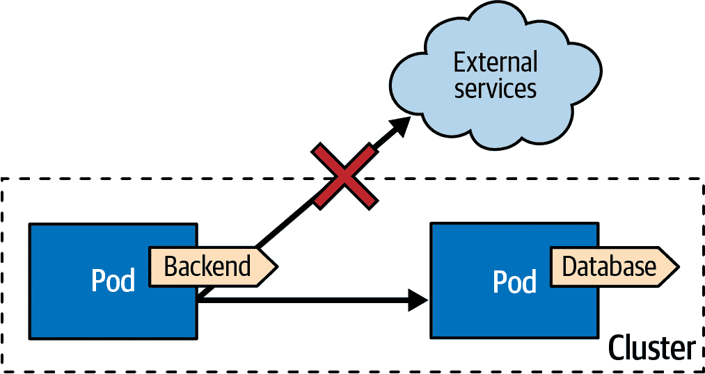

# 第二十四章：网络分割

Kubernetes 是一个很好的平台，用于运行通过网络相互通信的分布式应用程序。默认情况下，Kubernetes 中的网络空间是平面的，这意味着集群中的每个 Pod 都可以连接到其他任何 Pod。在本章中，我们将探讨如何为提升安全性和轻量级多租户模型而结构化这个网络空间。

# 问题

Namespace 是 Kubernetes 的一个关键部分，允许您将工作负载分组在一起。然而，它们只提供了一个分组概念，对与特定 Namespace 关联的容器施加了隔离约束。在 Kubernetes 中，每个 Pod 都可以与集群中的任何其他 Pod 进行通信，无论它们的 Namespace 如何。这种默认行为具有安全性影响，特别是当由不同团队运行的多个独立应用程序在同一个集群中时。

限制从 Pod 到网络的访问对增强应用程序安全至关重要，因为不是每个人都可以通过入口访问您的应用程序。对于 Pod 的出站 egress 网络流量也应该限制在必需的范围内，以减小安全漏洞的影响范围。

网络分割在多租户设置中扮演着重要角色，多个方进行在同一集群中共享。例如，下面的侧边栏讨论了 Kubernetes 上多租户的一些挑战，比如为应用程序创建网络边界。

过去，塑造网络拓扑主要是由管理人员负责，他们管理防火墙和 iptable 规则。这种模型的挑战在于管理人员需要理解应用程序的网络需求。此外，在具有许多依赖关系的微服务世界中，网络图可能变得非常复杂，需要深入了解应用程序的领域知识。在这方面，开发人员必须与管理员沟通并同步依赖关系的信息。DevOps 设置可以帮助，但网络拓扑的定义仍然远离应用程序本身，并且随时间动态变化。

那么，在 Kubernetes 世界中定义和建立网络分割是什么样子的呢？

# 解决方案

好消息是，Kubernetes 左移了这些网络任务，使得使用 Kubernetes 的开发者可以完全定义他们应用程序的网络拓扑。您已经在 第二十三章 简要描述了这个过程模型，当时我们讨论了 *进程容器化* 模式。

*网络分割* 模式的核心是我们作为开发人员如何通过创建 "应用防火墙" 来定义我们应用程序的网络分割。

有两种方法可以实现这一功能，它们是互补的并可以一起应用。第一种方法是通过使用操作 L3/L4 网络层的核心 Kubernetes 特性来实现。通过定义 NetworkPolicy 类型的资源，开发人员可以为工作负载 Pod 创建入站和出站防火墙规则。

另一种方法涉及使用服务网格，目标是 L7 协议层，特别是基于 HTTP 的通信。这允许基于 HTTP 动词和其他 L7 协议参数进行过滤。我们将在本章后面探讨 Istio 的 AuthenticationPolicy。

首先，让我们专注于如何使用 NetworkPolicies 来定义应用程序的网络边界。

## 网络策略

NetworkPolicy 是 Kubernetes 的一种资源类型，允许用户为 Pod 定义入站和出站网络连接的规则。这些规则就像是自定义防火墙，确定哪些 Pod 可以访问以及它们可以连接到哪些目的地。用户定义的规则由 Kubernetes 内部网络使用的容器网络接口（CNI）插件捡起。然而，并非所有 CNI 插件都支持 NetworkPolicies；例如，流行的 Flannel CNI 插件不支持它，但像 Calico 这样的其他插件支持。所有托管的 Kubernetes 云服务提供商都支持 NetworkPolicy（直接或通过配置插件），以及像 Minikube 这样的其他发行版。

NetworkPolicy 的定义包括对 Pod 的选择器以及入站（ingress）或出站（egress）规则列表。

*Pod 选择器* 用于匹配应用 NetworkPolicy 的 Pod。这种选择通过使用标签完成，标签是附加到 Pod 的元数据。标签允许对 Pod 进行灵活和动态的分组，这意味着可以将相同的 NetworkPolicy 应用于共享相同标签且在同一命名空间内运行的多个 Pod。Pod 选择器在 “标签” 中有详细描述。

*入站* 和 *出站* 规则列表定义了允许与匹配 Pod 进行连接的入站和出站连接。这些规则指定了允许从哪些源和目的地连接到 Pod，以及从 Pod 连接到哪里。例如，一条规则可以允许来自特定 IP 地址或地址范围的连接，或者阻止连接到特定目的地。

让我们从 示例 24-1 中的简单示例开始，该示例仅允许从后端 Pod 访问所有数据库 Pod，而不允许其他内容。

##### 示例 24-1\. 简单的 NetworkPolicy 允许入站流量

```
kind: NetworkPolicy
apiVersion: networking.k8s.io/v1
metadata:
  name: allow-database
spec:
  podSelector:        
    matchLabels:
      app: chili-shop
      id: database
  ingress:            
  - from:
    - podSelector:    
        matchLabels:
          app: chili-shop
          id: backend
```


匹配所有具有标签 `id: database` 和 `app: chili-shop` 的 Pod 选择器。所有这些 Pod 都受到此 NetworkPolicy 的影响。


允许入站流量的源列表。


允许所有 `backend` 类型的 Pod 访问所选数据库 Pod 的 Pod 选择器。

图 24-1 展示了后端 Pod 如何访问数据库 Pod，但前端 Pod 不能。



###### 图 24-1\. 入口流量的 NetworkPolicy

NetworkPolicy 对象是命名空间范围的，并且仅匹配来自 NetworkPolicy 所在命名空间的 Pod。不幸的是，目前没有办法为所有命名空间定义集群范围的默认值。然而，像 Calico 这样的一些 CNI 插件支持用于定义集群范围行为的客户扩展。

### 使用标签进行网络段定义

在 示例 24-1 中，我们可以看到如何使用标签选择器动态定义 Pod 的组。这是 Kubernetes 中的一个强大概念，允许用户轻松创建不同的网络段。

开发人员通常是最了解哪些 Pod 属于特定应用程序以及它们如何相互通信的人。通过精心打标签，用户可以直接将分布式应用程序的依赖图转换为 NetworkPolicies。这些策略可以用来定义应用程序的网络边界，具有明确定义的入口和出口点。

使用标签创建网络分割时，通常会为应用程序中的所有 Pod 打上唯一的 `app` 标签。可以在 NetworkPolicy 的选择器中使用 `app` 标签来确保覆盖应用程序的所有 Pod。例如，在 示例 24-1 中，使用 `app` 标签和值 `chili-shop` 定义了网络段。

有两种常见的方法可以一致地标记工作负载：

+   使用工作负载唯一标签，可以直接建模应用程序组件之间的依赖关系图，例如其他微服务或数据库。例如，在 示例 24-1 中，使用标签 `type` 来识别应用程序组件。只有一种类型的工作负载（例如 Deployment 或 StatefulSet）预计会携带标签 `type: database`。

+   在更松散的方法中，您可以定义需要附加到扮演特定角色的每个工作负载的特定`角色`或`权限`标签。 示例 24-2 展示了这种设置的示例。这种方法更灵活，允许添加新的工作负载而无需更新 NetworkPolicy。然而，直接连接工作负载的更直接方法通常更容易理解，只需查看 NetworkPolicy 而无需查找适用于角色的所有工作负载。

##### 示例 24-2\. 基于角色的网络段定义

```
kind: Pod
metadata:
  label:
    app: chili-shop
    id: backend
    role-database-client: 'true'       
    role-cache-client: 'true'
....
---
kind: NetworkPolicy
apiVersion: networking.k8s.io/v1
metadata:
  name: allow-database-client
spec:
  podSelector:
    matchLabels:
      app: chili-shop
      id: database                     
  ingress:
  - from:
    - podSelector:
        matchLabels:
          app: chili-shop
          role-database-client: 'true' 
```


添加所有使得此后端 Pod 能够访问请求服务的角色。


选择器匹配数据库 Pod，即带有标签`id: database`的 Pod。


每个作为数据库客户端（`role-database-client: 'true'`）的 Pod 都被允许向后端 Pod 发送流量。

### 默认的拒绝所有策略

在示例 24-1 和 24-2 中，我们已经看到如何为一组选定的 Pod 单独配置允许的传入连接。只要不要忘记配置一个 Pod，这种设置就可以正常工作，因为当命名空间中未配置 NetworkPolicy 时，默认模式不限制传入和传出流量（允许所有）。此外，对于将来可能创建的 Pod，需要记住添加相应的 NetworkPolicy 可能会有问题。

因此，强烈建议从拒绝所有的策略开始，如示例 24-3 所示。

##### 示例 24-3\. 拒绝所有入口流量的策略

```
kind: NetworkPolicy
apiVersion: networking.k8s.io/v1
metadata:
  name: deny-all
spec:
  podSelector: {}     
  ingress: []         
```


空选择器匹配每个 Pod。


空的入口规则列表意味着所有传入流量被丢弃。

允许入口的列表设置为空列表（`[]`），这意味着没有入口规则允许传入流量。请注意，空列表`[]`与具有单个空元素的列表`[ {} ]`不同，后者实现了完全相反的效果，因为单个空规则匹配所有内容。

### Ingress

示例 24-1 覆盖了覆盖入口流量的策略的主要用例。我们已经解释了`podSelector`字段，并且给出了一个匹配允许发送流量到配置下的 Pod 的`ingress`列表的示例。只要列表中的任何配置的入口规则匹配，选定的 Pod 就可以接收流量。

除了选择 Pod 外，您还有其他选项来配置入口规则。我们已经看到了`from`字段用于可以包含`podSelector`以选择通过此规则的所有 Pod 的入口规则。此外，可以提供`namespaceSelector`来选择应该应用`podSelector`以识别可以发送流量的 Pod 的命名空间。

表 24-1 显示了`podSelector`和`namespaceSelector`各种组合的效果。结合这两个字段允许非常灵活的设置。

表 24-1\. 设置`podSelector`和`namespaceSelector`的组合`({}: 空`, `{...}: 非空`, `---: 未设置`)

| podSelector | namespaceSelector | 行为 |
| --- | --- | --- |
| {} | {} | 每个命名空间中的每个 Pod |
| {} | { …​ } | 匹配命名空间中的每个 Pod |
| { …​ } | { } | 所有命名空间中的每个匹配的 Pod |
| { …​ } | { …​ } | 匹配命名空间中的每个匹配 Pod |
| --- | { …​ } / {} | 匹配命名空间/所有命名空间中的每个 Pod |
| { …​ } / {} | --- | NetworkPolicy 的命名空间中的匹配 Pod/每个 Pod |

作为从集群中选择 Pods 的替代方法，可以使用 `ipBlock` 字段指定一系列 IP 地址。我们在 Example 24-5 中展示 IP 范围。

另一种选择是将流量限制为仅限于选定 Pod 的特定端口。我们可以使用包含所有允许端口的 `ports` 字段来指定此列表。

### 出口

不仅可以管理传入流量，还可以管理 Pod 发送的任何请求的出站流量。出口规则与入口规则具有相同的选项。与入口规则一样，建议从非常严格的策略开始。然而，拒绝所有出站流量并不实际。每个 Pod 需要与系统命名空间中的 Pods 进行交互以进行 DNS 查找。此外，如果我们使用入口规则限制入站流量，我们将不得不为源 Pods 添加镜像出站规则。因此，让我们务实地允许集群内的所有出口，禁止集群外的所有内容，并让入口规则定义网络边界。

Example 24-4 显示了此类规则的定义。

##### 示例 24-4\. 允许所有内部出口流量

```
kind: NetworkPolicy
apiVersion: networking.k8s.io/v1
metadata:
  name: egress-allow-internal-only
spec:
  policyTypes:              
  - Egress
  podSelector: {}           
  egress:
  - to:
    - namespaceSelector: {} 
```


仅将 `Egress` 添加为策略类型；否则，Kubernetes 将假定您要指定入站和出站。


将 NetworkPolicy 应用于 NetworkPolicy 的命名空间中的所有 Pods。


允许每个其他命名空间中的每个 Pod 出口。

Figure 24-2 说明了此 NetworkPolicy 的影响，以及它如何阻止 Pods 连接到外部服务。



###### 图 24-2\. 仅允许内部出口流量的 NetworkPolicy

NetworkPolicy 中的 `policyTypes` 字段确定策略影响的流量类型。它是一个列表，可以包含 `Egress` 和/或 `Ingress` 元素，并指定策略中包含的规则。如果省略该字段，则根据 `ingress` 和 `egress` 规则部分的存在确定默认值：

+   如果存在 `ingress` 部分，则 `policyTypes` 的默认值为 `[Ingress]`。

+   如果提供了 `egress` 部分，则 `policyTypes` 的默认值为 `[Ingress, Egress]`，无论是否提供了 `ingress` 规则。

这种默认行为意味着，要定义仅出口的策略，必须显式将 `policyTypes` 设置为 `[Egress]`，如 Example 24-4。如果未这样做，将意味着空的 `ingress` 规则集，实际上禁止所有入站流量。

在对集群内部出口流量施加此限制后，我们可以选择性地激活某些可能需要集群外部网络访问的 Pod 对外部 IP 地址的访问。在 示例 24-5 中定义了一个允许外部出口访问的 IP 范围块。

##### 示例 24-5\. NetworkPolicy 允许访问所有 IP 地址，但有一些例外。

```
kind: NetworkPolicy
apiVersion: networking.k8s.io/v1
metadata:
  name: allow-external-ips
spec:
  podSelector: {}
  egress:
  - to:
    - ipBlock:
        cidr: 0.0.0.0/0   
        except:
        - 192.168.0.0/16  
        - 172.23.42.0/24
```


允许访问所有 IP 地址…​


…​除了属于这些子网的 IP 地址。

如果决定选择更严格的出口规则，并且还想限制集群的内部出口流量，则需要注意一些问题。首先，始终允许对 kube-system 命名空间中的 DNS 服务器访问至关重要。最佳配置是允许 UDP 和 TCP 的端口 53 对系统命名空间中的所有端口进行访问。

对于运算符和控制器，Kubernetes API 服务器需要是可访问的。不幸的是，在 kube-system 命名空间中没有唯一的标签可以选择 API 服务器，因此应在 API 服务器的 IP 地址上进行过滤。最佳方法是从默认命名空间中的 `kubectl get endpoints -n default kubernetes` 获取 `kubernetes` 端点中获取 IP 地址。

### 工具

设置网络拓扑结构时，由于涉及创建许多 NetworkPolicy 资源，情况会迅速变得复杂。最好从一些简单的用例开始，然后根据特定需求进行调整。[Kubernetes 网络策略配方](https://oreil.ly/NvQFm) 是一个很好的起点。

通常，NetworkPolicy 与应用程序架构一起定义。然而，有时候必须将策略模式适应现有解决方案。在这种情况下，策略顾问工具可能会很有帮助。它们通过记录播放典型用例时的网络活动来工作。具备良好测试覆盖率的全面集成测试套件有助于捕捉涉及网络连接的所有边缘情况。截至 2023 年，有几种工具可以帮助您审核网络流量以创建网络策略。

[Inspektor Gadget](https://oreil.ly/nlVOx) 是一个出色的工具套件，用于调试和检查 Kubernetes 资源。它完全基于 eBPF 程序，支持内核级别的可观测性，并提供了从内核特性到高级 Kubernetes 资源的桥梁。Inspektor Gadget 的一个特性是监视网络活动，并记录生成 Kubernetes 网络策略所需的所有 UDP 和 TCP 流量。这种技术效果很好，但取决于覆盖用例的质量和深度。

另一个基于 eBPF 的优秀平台是 [Cilium](https://cilium.io)，它具有专用的审计模式，可跟踪所有网络流量并与给定的网络策略匹配。通过启用拒绝所有策略并启用审计模式，Cilium 将记录所有策略违规情况，但不会否则阻止流量。审计报告有助于创建适合所执行流量模式的适当 NetworkPolicy。

这些只是关于策略推荐、仿真和审计工具丰富且日益增长的景观的两个例子。

现在你已经看到我们如何在 TCP/UDP 和 IP 层面为应用程序建模网络边界，让我们在 OSI 栈的一些更高层次上移动。

## 认证策略

目前为止，我们看到了如何在 TCP/IP 层面控制 Pod 之间的网络流量。然而，基于更高级别协议参数的网络限制有时是有益的。这种高级网络控制需要了解像 HTTP 这样的更高级别协议，并具备检查进出流量的能力。Kubernetes 并未在开箱即用中支持此功能。幸运的是，一个完整的插件家族扩展了 Kubernetes 以提供这种功能：服务网格。

我们选择 Istio 作为我们示例的服务网格，但你会发现其他服务网格中类似的功能。我们不会深入讨论服务网格或 Istio，而是专注于 Istio 的一个特定自定义资源，帮助我们在 HTTP 协议级别上塑造网络段。

**Istio** 具有丰富的功能集，用于启用身份验证、通过 mTLS 进行传输安全、通过 CERT 旋转进行身份管理以及授权。

与其他 Kubernetes 扩展一样，Istio 通过引入自己的 CustomResourceDefinitions (CRDs) 利用 Kubernetes API 机制，这在 第二十八章，“Operator” 中有详细解释。在 Istio 中，授权是通过 AuthorizationPolicy 资源配置的。虽然 AuthorizationPolicy 只是 Istio 安全模型中的一个组件，但它可以单独使用，并允许基于 HTTP 对网络空间进行分区。

AuthorizationPolicy 的架构与 NetworkPolicy 非常相似，但更灵活，并包括 HTTP 特定的过滤器。NetworkPolicy 和 AuthorizationPolicy 应该一起使用。当必须同时检查和验证两个配置时，这可能会导致一个棘手的调试设置。只有当 NetworkPolicy 和 AuthorizationPolicy 定义所跨越的两个用户定义的防火墙允许时，流量才会通过到一个 Pod。

一个 **AuthorizationPolicy** 是一个命名空间资源，包含一组规则，用于控制是否允许或拒绝在 Kubernetes 集群中特定一组 Pods 的流量。该策略由以下三个部分组成：

选择器

指定策略适用于哪些 Pod。如果未指定选择器，则策略适用于同一命名空间中的所有 Pod。如果策略在 Istio 的根命名空间（`istio-system`）中创建，则适用于所有命名空间中的所有匹配 Pod。

操作

定义与符合规则的流量应执行的操作。可能的操作包括`ALLOW`、`DENY`、`AUDIT`（仅用于日志记录）和`CUSTOM`（用于用户定义的操作）。

规则列表

这些规则用于评估传入的流量。必须满足所有规则才能执行操作。每个规则有三个组成部分：一个`from`字段，指定请求的来源；一个`to`字段，指定请求必须匹配的 HTTP 操作；以及一个可选的`when`字段，用于附加条件（例如，与请求关联的身份必须匹配特定值）。

示例 24-6 展示了一个典型的例子，允许监控运算符访问应用程序端点以收集度量数据。

##### 示例 24-6\. 用于 Prometheus 设置的授权

```
apiVersion: security.istio.io/v1beta1
kind: AuthorizationPolicy
metadata:
  name: prometheus-scraper
  namespace: istio-system   
spec:
  selector:                 
    matchLabels:
      has-metrics: "true"
  action: ALLOW             
  rules:
  - from:                   
    - source:
        namespace: ["prometheus"]
    to:
    - operation:            
        methods: [ "GET" ]
        paths: ["/metrics/*"]
```


当在命名空间`istio-system`中创建时，策略适用于所有命名空间中的所有匹配 Pod。


该策略适用于所有带有`has-metrics`标签设置为`true`的 Pod。


如果规则匹配，则操作应允许请求通过。


来自`prometheus`命名空间的每个请求…​


…​可以对`/metrics`端点执行 GET 请求。

在示例 24-6 中，每个带有标签`has-metrics: "true"`的 Pod 允许从`prometheus`命名空间的每个 Pod 到其`/metrics`端点的流量。

仅当默认情况下拒绝所有请求时，此策略才会生效。对于 NetworkPolicy 来说，最佳的起点是定义一个拒绝所有策略，如示例 24-7 所示，然后有选择性地构建网络拓扑以允许专用路由。

##### 示例 24-7\. 拒绝所有策略作为默认设置

```
apiVersion: security.istio.io/v1beta1
kind: AuthorizationPolicy
metadata:
 name: deny-all
 namespace: istio-system 
spec:
 selector: {}            
 action: DENY            
 rules: [{}]             
```


该策略适用于所有命名空间，因为它是在`istio-system`中创建的。


空选择器始终匹配。


拒绝所有匹配选择器的 Pod 的访问。


一个始终匹配的空规则。

###### 注意

Istio 遵循 NetworkPolicy 的语义，空规则列表[]永远不匹配。相反，只有一个空规则的列表[{}]总是匹配。

借助适当的标记方案的帮助，AuthorizationPolicy 帮助定义了应用程序的网络段，这些网络段彼此独立且隔离。我们在 “带标签的网络段定义” 中所说的一切也同样适用于此处。

然而，当我们向规则添加身份检查时，AuthorizationPolicy 也可以用于应用程序级授权。与我们在 第二十六章 “访问控制” 中描述的授权的一个关键区别在于，AuthorizationPolicy 关注的是*应用程序授权*，而 Kubernetes RBAC 模型则关注保护对 Kubernetes API 服务器的访问。访问控制主要有助于操作员监视其自定义资源。

# 讨论

在计算机早期，网络拓扑是由物理布线和交换机等设备定义的。这种方法安全但不太灵活。随着虚拟化的出现，这些设备被软件支持的构造物所取代，以提供网络安全性。*软件定义网络*（SDN）是一种允许网络管理员通过抽象化低级功能来管理网络服务的计算机网络架构类型。通常通过分离控制平面（负责如何传输数据的决策）和数据平面（实际发送数据）来实现这种抽象化。即使使用了 SDN，管理员仍然需要设置和重新安排网络边界以有效管理网络。

Kubernetes 通过 Kubernetes API 将其扁平的集群内部网络覆盖与用户定义的网络段进行了重叠。这是网络用户界面演变的下一步。它将责任转移给了了解其应用程序安全要求的开发人员。这种左移的方法在微服务世界中尤其有益，该世界中存在许多分布式依赖和复杂的连接网络。用于 L3/L4 网络分段的 NetworkPolicies 和用于更精细控制网络边界的 AuthenticationPolicies 是实施此*网络分段*模式所必需的。

随着基于 eBPF 的平台在 Kubernetes 之上的出现，支持寻找合适的网络模型得到了额外的支持。Cilium 是将 L3/L4 和 L7 防火墙结合到单一 API 中的一个例子，使得在未来版本的 Kubernetes 中更容易实现本章描述的模式。

# 更多信息

+   [网络分段示例](https://oreil.ly/gwU-y)

+   [网络策略](https://oreil.ly/P5r0X)

+   [Kubernetes 网络模型](https://oreil.ly/qR0O9)

+   [Kubernetes 网络策略示例](https://oreil.ly/NhrWK)

+   [使用网络策略](https://oreil.ly/BzlSd)

+   [为什么应该测试您的 Kubernetes 网络策略](https://oreil.ly/r-dn7)

+   [利用 eBPF 超能力生成 Kubernetes 安全策略](https://oreil.ly/_5cWc)

+   [使用 Inspektor Gadget 的 Advise 网络策略](https://oreil.ly/5VbP4)

+   [您和您的安全配置文件；利用 eBPF 生成安全策略的帮助](https://oreil.ly/-jKvO)

+   [kube-iptables-tailer](https://oreil.ly/r-4pI)

+   [从裁决创建策略](https://oreil.ly/9lqlu)

+   [Istio：授权策略](https://oreil.ly/69M7s)

+   [Istio：认证策略](https://oreil.ly/bLq35)

+   [SIG 多租户工作组](https://oreil.ly/X00FG)

^(1) OSI 网络栈的第三级和第四级主要涉及 IP 和 TCP/UDP。

^(2) eBPF 最初是“扩展伯克利数据包过滤器”的缩写，但现在已经成为一个独立的术语。
