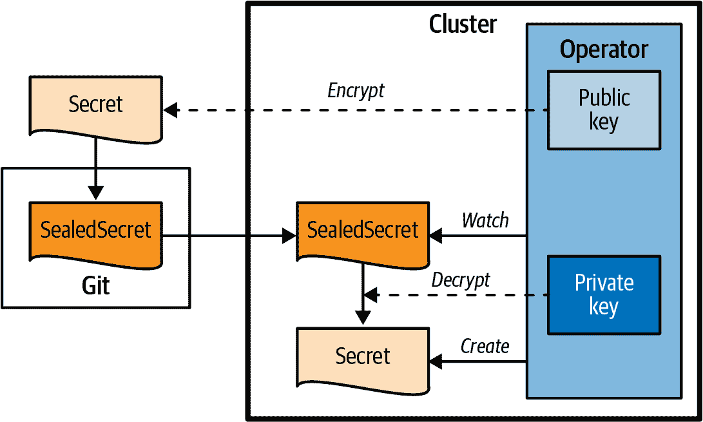
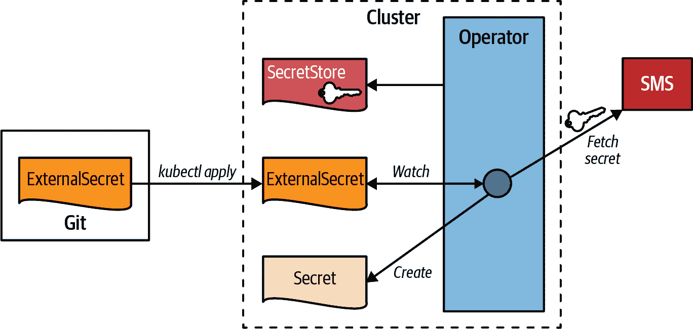
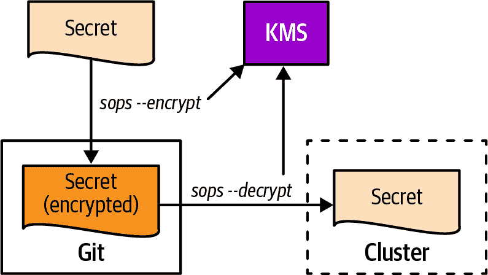
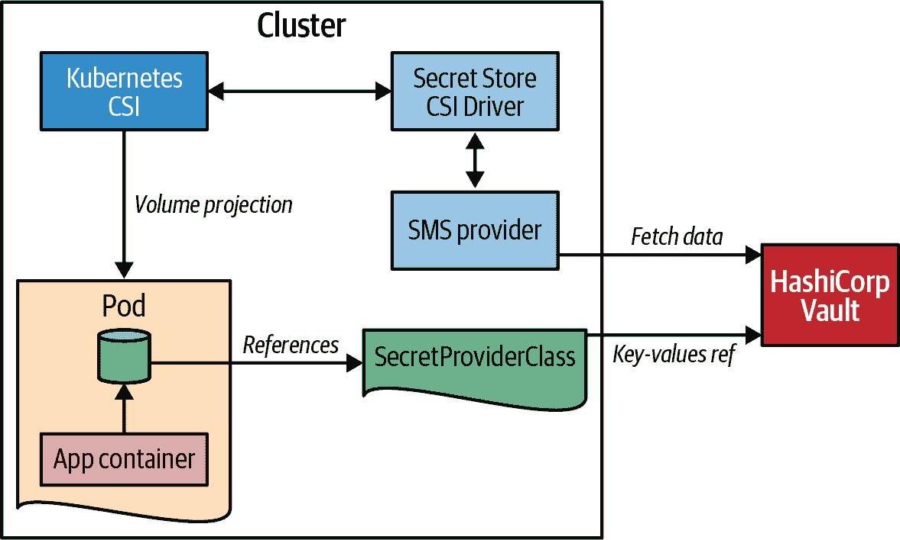
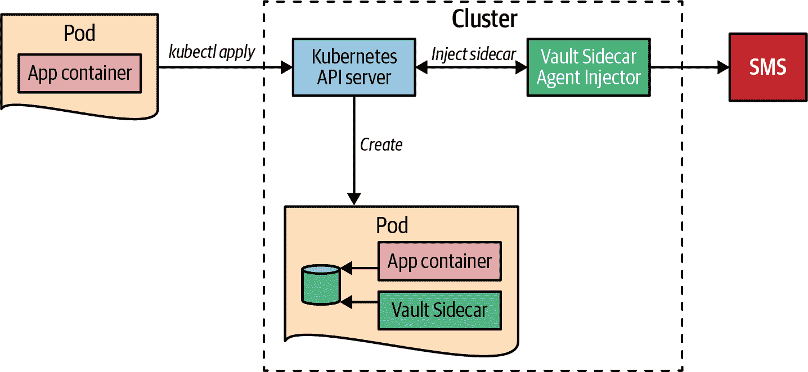

# 第二十五章：安全配置

现实世界中的应用程序都不是孤立存在的。相反，每个应用程序都以某种方式连接到外部系统。这些外部系统可能包括由大型云提供商提供的增值服务、您的服务连接的其他微服务或数据库。无论您的应用程序连接到哪些远程服务，您可能需要进行身份验证，这涉及发送诸如用户名和密码或其他安全令牌等凭据。这些机密信息必须安全地存储在靠近您的应用程序的地方。本章的“安全配置”模式就是要探讨在运行在 Kubernetes 上时保持凭证尽可能安全的最佳方法。

# 问题

正如您在 第二十章，“配置资源” 中所学到的，尽管其名称暗示着 Secret 资源是加密的，但实际上它们只是 Base64 编码的。尽管如此，Kubernetes 通过所描述的技术尽最大努力限制对 Secret 内容的访问，详见 “Secrets 有多安全？”。

然而，一旦 Secret 资源存储在集群外部，它们就会暴露且易受攻击。随着 GitOps 作为部署和维护服务器端应用程序的主流范式的出现，这一安全挑战变得更加紧迫。秘密应该存储在远程 Git 存储库中吗？如果是这样，那么它们就不能以未加密形式存储。然而，当这些秘密以加密形式提交到 Git 等源代码管理系统时，在进入 Kubernetes 集群的过程中，它们何时解密？

即使凭证以加密形式存储在集群内部，也不能保证没有其他人可以访问这些机密信息。尽管您可以通过 RBAC 规则对 Kubernetes 资源进行细粒度访问控制^(1)，但至少有一个人可以访问集群中存储的所有数据：您的集群管理员。您可能能够信任集群管理员，也可能不能。这完全取决于您的应用程序运行的上下文。您是否在由他人操作的云中运行 Kubernetes 集群？或者您的应用程序部署在大型公司范围的 Kubernetes 平台上，您需要知道谁在管理此集群？根据这些信任边界和保密要求，需要不同的解决方案。

在集群内部，Secrets 是 Kubernetes 提供的用于保护配置的答案。我们在 第二十章，“配置资源” 中详细讨论了 Secrets，现在让我们看看如何通过额外技术来改善 Secrets 的各种安全方面。

# 解决方案

对于安全配置来说，最直接的解决方案是在应用程序内部解码加密信息。这种方法始终有效，不仅在 Kubernetes 上运行时有效。但是，在你的代码中实现这一点需要相当大的工作量，并且将你的业务逻辑与配置安全相关的方面耦合在一起。在 Kubernetes 上有更好、更透明的方法来实现这一点。

在 Kubernetes 上支持安全配置大致可分为两类：

集群外加密

这将加密的配置信息存储在 Kubernetes 之外，即使未授权的人也可以读取。在进入集群之前（例如，通过 API 服务器应用资源时）或者集群内部通过一个持续运行的操作器进程，会将其转换为 Kubernetes Secrets。

集中式秘密管理

这使用专门的服务，这些服务已经由云提供商提供（例如 AWS Secrets Manager 或 Azure Key Vault），或者是内部金库服务的一部分（例如 HashiCorp Vault），用于存储机密配置数据。

尽管在集群外加密技术最终会创建一个 Secret 在集群中，供你的应用程序使用，但 Kubernetes 附加的外部秘密管理系统（SMSs）支持使用各种其他技术将机密信息传递到部署的工作负载中。

## 集群外加密

集群外技术的要义很简单：从集群外部获取秘密和机密数据，并将其转换为 Kubernetes Secret。已经有很多项目在实现这种技术。本章将着眼于三个最显著的项目（截至 2023 年）：Sealed Secrets、External Secrets 和 sops。

### 密封的密钥

帮助加密秘密的最古老的 Kubernetes 附加组件之一是 *Sealed Secrets*，由 Bitnami 在 2017 年引入。其思想是将 Secret 的加密数据存储在一个 CustomResourceDefinition（CRD）SealedSecret 中。在后台，一个操作器监视这些资源，并为每个 SealedSecret 创建一个 Kubernetes Secret，其中包含解密后的内容。要详细了解 CRD 和操作器的一般情况，请查看第二十八章，“操作器”。虽然解密是在集群内部进行的，但 *加密* 是在外部通过一个名为 `kubeseal` 的 CLI 工具进行的，该工具将一个 Secret 转换为一个可以安全存储在类似 Git 的源代码管理系统中的 SealedSecret。

图 25-1 展示了 Sealed Secrets 的设置。



###### 图 25-1\. 密封的密钥

Secrets 使用 AES-256-GCM 对称加密作为会话密钥加密，会话密钥使用 RSA-OAEP 非对称加密，与 TLS 相同的设置。

秘密私钥存储在集群内部，并由 SealedSecret Operator 自动创建。管理员需要负责备份并根据需要轮转此密钥。`kubeseal` 使用的公钥可以直接从集群获取，也可以直接从文件访问。您还可以安全地将公钥与您的 SealedSecret 一起存储在 Git 中。

当创建 SealedSecret 时，SealedSecrets 支持三个范围可供选择：

严格模式

这将冻结 SealedSecret 的命名空间和名称。这意味着您只能在任何目标集群中以与原始 Secret 相同的名称和相同的命名空间中创建 SealedSecret。这是默认行为。

命名空间范围

这允许您将 SealedSecret 应用于与初始 Secret 不同的名称，但仍将其固定在相同的命名空间。

集群范围

这允许您将 SealedSecret 应用于不同的命名空间，正如最初创建的那样，名称也可以更改。

在使用 `kubeseal` 创建 SealedSecret 时可以选择这些范围。但是，您也可以在加密前或直接在 SealedSecret 上使用 表 25-1 中列出的注释添加非严格范围。

表 25-1\. 注释

| 注释 | 值 | 描述 |
| --- | --- | --- |
| sealedsecrets.bitnami.com/namespace-wide | `"true"` | 当设置为 `true` 时启用命名空间范围——即不同名称但相同命名空间 |
| sealedsecrets.bitnami.com/cluster-wide | `"true"` | 当设置为 `true` 时启用集群范围——即加密后可以更改 SealedSecret 的名称和命名空间 |

示例 25-1 展示了使用 `kubeseal` 创建的 SealedSecret，可以直接存储在 Git 中。

##### 示例 25-1\. 使用 `kubeseal` 创建的 SealedSecret

```
# Command to create this sealed secret:
# kubeseal --scope cluster-wide -f mysecret.yaml 
apiVersion: bitnami.com/v1alpha1
kind: SealedSecret
metadata:
  annotations:
    sealedsecrets.bitnami.com/cluster-wide: "true"   
  name: DB-credentials
spec:
  encryptedData:
    password: AgCrKIIF2gA7tSR/gqw+FH6cEV..wPWWkHJbo= 
    user: AgAmvgFQBBNPlt9Gmx..0DNHJpDIMUGgwaQroXT+o=
```


使用命令从 *mysecret.yaml* 中存储的秘密创建一个 SealedSecret。


注释表明这个 SealedSecret 可以有任何名称并且可以应用于任何命名空间。


为了演示，这里只是对密钥值进行了单独加密。

Sealed Secret 是一种工具，允许您将加密的秘密存储在公开可用的位置，例如 GitHub 存储库。正确备份秘密密钥非常重要，因为如果卸载操作员，则无法解密秘密。Sealed Secrets 的一个潜在缺点是，它们需要在集群中持续运行服务器端操作员才能执行解密操作。

### 外部 Secrets

[外部秘密操作员](https://oreil.ly/4kC1b)是一个 Kubernetes 操作员，集成了越来越多的外部 SMS。外部秘密与密封密钥的主要区别在于，您不管理加密数据存储，而是依赖外部 SMS 来执行加密、解密和安全持久化等工作。这样，您就可以从云 SMS 的所有功能中受益，例如密钥轮换和专用用户界面。SMS 还提供了一个很好的分离关注点的方式，使不同的角色可以分别管理应用部署和秘密。

图 25-2 展示了外部秘密的架构。



###### 图 25-2\. 外部秘密

一个中央操作员协调两个自定义资源：

+   SecretStore 是保存访问外部 SMS 类型和配置的资源。示例 25-2 提供了一个连接到 AWS Secret Manager 的存储示例。

+   ExternalSecret 引用了一个 SecretStore，并且操作员将创建一个对应的 Kubernetes Secret，其中填充了从外部 SMS 中获取的数据。例如，示例 25-3 引用了 AWS Secret Manager 中的一个秘密，并在指定的目标 Secret 中公开该值。

##### 示例 25-2\. 连接到 AWS Secret Manager 的 SecretStore

```
apiVersion: external-secrets.io/v1beta1
kind: SecretStore
metadata:
  name: secret-store-aws
spec:
  provider:
    aws:                        
      service: SecretsManager
      region: us-east-1
      auth:
        secretRef:
          accessKeyIDSecretRef: 
            name: awssm-secret
            key: access-key
          secretAccessKeySecretRef:
            name: awssm-secret
            key: secret-access-key
```


Provider `aws` 配置了使用 AWS Secret Manager。


引用一个包含与 AWS Secret Manager 通信所需的访问密钥的 Secret。名为 `awssm-secret` 的 Secret 包含用于对 AWS Secret Manager 进行身份验证的 `access-key` 和 `secret-access-key`。

##### 示例 25-3\. 将被转换为 Secret 的 ExternalSecret

```
apiVersion: external-secrets.io/v1beta1
kind: ExternalSecret
metadata:
  name: db-credentials
spec:
  refreshInterval: 1h
  secretStoreRef:                
    name: secret-store-aws
    kind: SecretStore
  target:
    name: db-credentials-secrets 
    creationPolicy: Owner
  data:
    - key: cluster/db-username   
      name: username
    - key: cluster/db-password
      name: password
```


SecretStore 对象的引用，该对象包含与 AWS Secret Manager 的连接参数。


要创建的 Secret 的名称。


在 AWS Secret Manager 下查找的将要被查找的用户名，并在生成的 Secret 中放置在键 `username` 下。

在定义外部秘密数据映射到镜像秘密内容方面，您有很大的灵活性，例如可以使用模板创建具有特定结构的配置。有关更多信息，请参阅[外部秘密文档](https://oreil.ly/Oj4Qq)。与客户端解决方案相比，这种解决方案的一个显著优势是只有服务器端操作员知道用于对外部 SMS 进行身份验证的凭据。

外部 Secrets Operator 项目合并了几个其他同步项目。在 2023 年，它已经成为映射和同步外部定义秘密到 Kubernetes Secret 的主要解决方案。然而，它与一直运行的服务器端组件具有相同的成本。

### Sops

在 GitOps 的世界中，是否需要服务器端组件来处理 Secrets，其中所有资源都存储在 Git 存储库中？幸运的是，存在完全在 Kubernetes 集群之外工作的解决方案。Mozilla 提供了一种名为 [sops](https://oreil.ly/HH9GE)（“Secret OPerationS”）的纯客户端解决方案。Sops 并非专为 Kubernetes 设计，但允许您加密和解密任何 YAML 或 JSON 文件，以安全地存储它们在源代码存储库中。它通过加密文档的所有值但保持键不变来实现这一点。

我们可以使用多种方法来使用 sops 进行加密：

+   通过 [`age`](https://oreil.ly/DH4RE) 进行非对称本地加密，并在本地存储密钥。

+   将密钥存储在集中式密钥管理系统（KMS）中。支持的平台包括 AWS KMS、Google KMS 和 Azure Key Vault 作为外部云提供商，以及 HashiCorp Vault 作为您可以自行托管的 SMS。这些平台的身份管理允许对加密密钥进行精细的访问控制。

Sops 是一个 CLI 工具，您可以在本地计算机上或集群内（例如作为 CI 流水线的一部分）运行。特别是对于后一种用例，如果您在其中一个大型云平台上运行，利用它们的 KMS 提供了平滑的集成。

Figure 25-3 说明了 sops 如何在客户端处理加密和解密。



###### Figure 25-3\. 用于解密和加密资源文件的 sops

Example 25-4 展示了如何使用 sops 创建 ConfigMap 的加密版本的示例。^(2) 本示例使用 `age` 和一个新生成的密钥对进行加密，应安全地存储。

##### Example 25-4\. 使用 sops 创建加密密钥的示例

```
$ age-keygen -o keys.txt       
Public key: age1j49ugcg2rzyye07ksyvj5688m6hmv

$ cat configmap.yaml           
apiVersion: v1
kind: ConfigMap
metadata:
  name_unencrypted: db-auth    
data:
  # User and Password
  USER: "batman"
  PASSWORD: "r0b1n"

$ sops --encrypt \             
    --age age1j49ugcg2rzyye07ksyvj5688m6hmv \
    configmap.yaml > configmap_encrypted.yaml

$ cat configmap_encrypted.yaml
apiVersion: ENC[AES256_GCM,data:...,iv:...,tag:...,type:str] 
kind: ENC[AES256_GCM,data:...,iv:...,tag:...,type:str]
metadata:
    name_unencrypted: db-auth  
data:
    #ENC[AES256_GCM,data:...,iv:...,tag:...,type:comment]
    USER: ENC[AES256_GCM,data:...,iv:...,tag:...=,type:str]
    PASSWORD: ENC[AES256_GCM,data:...,iv:...,tag:...,type:str]
sops:                          
    age:
        - recipient: age1j49ugcg2rzyye07ksyvj5688m6hmv
          enc: |               
            -----BEGIN AGE ENCRYPTED FILE-----
            YWdlLWVuY3J5cHRpb24ub3JnL3YxCi0+IFgyNTUxOSBqems3QkU4aXRyQWxaNER1
            TTdqcUZTeXFXNWhSY0E1T05XMUhVUzFjR1FnCmdMZmhlSlZCRHlqTzlNM0E1Z280
            Y0tqQ2VKYXdxdDZIZHpDbmxTYzhQSTgKLS0tIHlBYmloL2laZlA4Q05DTmRwQ0ls
            bURoU2xITHNzSXp5US9mUUV0Z0RackkKFtH+uNNe3A13pzSvHjT6n3q9av0pN7Nb
            i3AULtKvAGs6oAnH8qYbnwoj3qt/LFfnbqfeFk1zC2uqNONWkKxa2Q==
            -----END AGE ENCRYPTED FILE-----
    last modified: "2022-09-20T09:56:49Z"
    mac: ENC[AES256_GCM,data:...,iv:...,tag:...,type:str]
    unencrypted_suffix: _unencrypted
```


使用 `age` 创建一个秘密密钥并将其存储在 *keys.txt* 中。


要加密的 ConfigMap。


`name` 字段更改为 `name_unencrypted` 以防止其被加密。


使用 `age` 密钥的公共部分调用 sops，并将结果存储在 *configmap_encrypted.yml* 中。


每个值都替换为 `ENC[...]` 的加密版本（为了可读性，输出已缩短）。


ConfigMap 的 `name` 保持不变。


追加一个额外的 `sops` 部分，包含解密所需的元数据。


用于对称解密的加密会话密钥。此密钥本身由`age`进行非对称加密。

正如您所见，ConfigMap 资源的每个值都被加密，即使是那些不是机密的值，如资源类型或资源名称。您可以通过在键后添加`_unencrypted`后缀（解密时会自动去除）来跳过特定值的加密。

生成的*configmap_encrypted.yml*可以安全地存储在 Git 或任何其他源代码管理工具中。正如示例 25-5 中所示，您需要私钥来解密加密的 ConfigMap 以应用到集群。

##### 示例 25-5\. 解密经 sops 编码的资源并应用到 Kubernetes

```
$ export SOPS_AGE_KEY_FILE=keys.txt  
$ sops --decrypt configmap_encrypted.yaml | kubectl apply -f - 
configmap/db-auth created
```


解密会话密钥的关键步骤是使用私钥来解密。


解密并应用到 Kubernetes。请注意，在 sops 解密期间，每个资源键上的`_unencrypted`后缀都会被移除。

Sops 是一个出色的解决方案，可以轻松实现 GitOps 风格的秘密集成，无需担心安装和维护 Kubernetes 插件。但是，请注意，一旦配置被交给集群，任何具有高级访问权限的人员可以直接通过 Kubernetes API 读取这些数据。

如果这是您无法容忍的事情，我们需要深入研究工具箱，并重新审视集中式 SMS。

## 集中式秘密管理

正如在《“秘密有多安全？”》中解释的那样，秘密尽可能安全。尽管如此，任何具有集群范围读取权限的管理员都可以读取所有未加密存储的秘密。根据您与集群操作者的信任关系和安全要求，这可能是个问题或不是问题。

除了将个别秘密处理集成到您的应用代码中之外，另一个选择是将安全信息保持在集群外部的外部 SMS 中，并通过安全通道按需请求机密信息。

这类 SMS 的数量在不断增加，每个云提供商都提供其变体。我们不会详细介绍每个单独提供的内容，而是专注于这些系统如何集成到 Kubernetes 中的机制。您可以在“更多信息”中找到截至 2023 年的相关产品列表。

### 秘密存储 CSI 驱动程序

容器存储接口（CSI）是 Kubernetes API，用于向容器化应用程序公开存储系统。CSI 显示了第三方存储提供程序插入新类型的存储系统以便作为 Kubernetes 卷挂载的路径。在本模式的上下文中特别感兴趣的是[Secrets Store CSI Driver](https://oreil.ly/vm0F3)。这个由 Kubernetes 社区开发和维护的驱动程序允许访问各种集中式 SMS，并将它们作为常规的 Kubernetes 卷挂载。与描述在第二十章，“配置资源”中的挂载的秘密卷的不同之处在于，没有任何内容存储在 Kubernetes etcd 数据库中，而是安全地存储在集群外部。

Secrets Store CSI Driver 支持主要云供应商（AWS、Azure 和 GCP）和 HashiCorp Vault 的 SMS。

通过 CSI 驱动程序连接秘密管理器的 Kubernetes 设置涉及执行这两个管理任务：

+   安装 Secrets Store CSI Driver 并配置访问特定 SMS 的步骤。安装过程需要集群管理员权限。

+   配置访问规则和策略。需要完成几个特定于提供程序的步骤，但结果是将 Kubernetes 服务账户映射到允许访问秘密的秘密管理器特定角色。

图 25-4 显示了启用具有 HashiCorp Vault 后端的 Secrets Store CSI Driver 所需的整体设置。



###### 图 25-4\. Secrets Store CSI Driver

设置完成后，使用秘密卷非常简单。首先，必须定义一个 SecretProviderClass，如例 25-6 所示。在此资源中，选择秘密管理器的后端提供程序。在我们的示例中，我们选择了 HashiCorp 的 Vault。在`parameters`部分中，添加了提供程序特定的配置，其中包含与 Vault 的连接参数、要模拟的角色以及 Kubernetes 将挂载到 Pod 中的秘密信息的指针。

##### 例 25-6\. 访问秘密管理器的配置示例

```
apiVersion: secrets-store.csi.x-k8s.io/v1
kind: SecretProviderClass
metadata:
  name: vault-database
spec:
  provider: vault                                
  parameters:
    vaultAddress: "http://vault.default:8200"    
    roleName: "database"                         
    objects: |
      - objectName: "database-password" 
        secretPath: "secret/data/database-creds" 
        secretKey: "password" 
```


使用的提供者类型（截至 2023 年为`azure`、`gcp`、`aws`或`vault`）。


到 Vault 服务实例的连接 URL。


Vault 特定的认证角色包含允许连接的 Kubernetes 服务账户。


应该映射到挂载卷中的文件名称。


存储在保险库中的秘密路径。


从 Vault 秘密中选择的密钥。

当作为 Pod 卷使用时，此秘密管理器配置可以通过其名称进行引用。示例 25-7 展示了一个挂载在 示例 25-6 配置的秘密的 Pod。一个关键的方面是服务账户 `vault-access-sa`，该 Pod 使用该账户运行。必须在 Vault 侧配置此服务账户以成为 SecretProviderClass 中引用的 `database` 角色的一部分。

您可以在我们完整的工作和自包含的[示例](https://oreil.ly/7w89_)中找到此 Vault 配置，以及设置说明。

##### 示例 25-7\. Pod 从 Vault 挂载 CSI 卷

```
kind: Pod
apiVersion: v1
metadata:
  name: shell-pod
spec:
  serviceAccountName: vault-access-sa  
  containers:
  - image: k8spatterns/random
    volumeMounts:
    - name: secrets-store
      mountPath: "/secrets-store"      
  volumes:
    - name: secrets-store
      csi:                             
        driver: secrets-store.csi.k8s.io
        readOnly: true
        volumeAttributes:
          secretProviderClass: "vault-database" 
```


用于对 Vault 进行身份验证的服务账户。


用于挂载秘密的目录。


CSI 驱动程序的声明，指向秘密存储 CSI 驱动程序。


引用提供到 Vault 服务的 SecretProviderClass。

尽管 CSI Secret Storage 驱动程序的设置非常复杂，但使用起来很简单，您可以避免在 Kubernetes 中存储机密数据。但是，比仅使用 Secrets 更复杂，因此出错的可能性更大，而且故障排除更为困难。

让我们看看通过众所周知的 Kubernetes 抽象向应用程序提供秘密的最终替代方案。

### Pod 注入

如前所述，应用程序始终可以通过专有客户端库访问外部 SMS。这种方法的缺点在于，您仍然需要存储用于访问 SMS 的凭据，并且在您的代码中为特定的 SMS 添加了硬依赖。将秘密信息投影到可作为文件看到的卷中以供部署的应用程序使用的 CSI 抽象更为解耦。

备选方案利用了本书中描述的其他众所周知的模式：

+   *Init Container*（见第十五章）从 SMS 获取机密数据，然后将其复制到由应用程序容器挂载的共享本地卷中。主容器启动之前只获取一次机密数据。

+   *Sidecar*（见第十六章）将秘密数据从 SMS 同步到本地临时卷，应用程序也可以访问该卷。Sidecar 方法的好处在于，它可以在 SMS 开始轮换秘密时在本地更新秘密。

您可以自行利用这些模式为您的应用程序提供支持，但这很繁琐。更好的方法是让外部控制器注入初始化容器或 sidecar 到您的应用程序中。

一个很好的注入器示例是 HashiCorp 的[Vault Sidecar Agent Injector](https://oreil.ly/T1y41)。这个注入器被实现为所谓的*mutating webhook*，这是控制器的一种变体（见第二十七章，“Controller”），允许在创建时修改任何资源。当 Pod 规范包含特定的 vault 注解时，vault 控制器将修改此规范，添加一个用于与 Vault 同步的容器，并挂载用于秘密数据的卷。

图 25-5 展示了这种对用户完全透明的技术。

尽管您仍然需要安装 Vault Injector 控制器，但与为特定 SMS 产品的提供程序部署连接 CSI 秘密存储卷相比，它的移动部件更少。然而，您只需读取文件而无需使用专有客户端库即可访问所有秘密。



###### 图 25-5\. Vault 注入器

# 讨论

现在我们已经看到了许多使访问您的机密信息更安全的方法，问题是，哪种方法是最好的？

像往常一样，这取决于：

+   如果您的主要目标是以简单的方式加密存储在公共可读位置（如远程 Git 存储库）中的 Secrets，那么*Sops*提供的纯*客户端*加密是完美的选择。

+   *External Secrets Operator*实现的秘密同步在分离从远程 SMS 检索凭据并使用它们的关注点时是一个很好的选择。

+   由*Secret Storage CSI Providers*提供的秘密信息的临时卷投影是您在希望确保除了用于访问外部 vault 的访问令牌之外在集群中永久存储任何机密信息都不被存储时的正确选择。

+   像*Vault Sidecar Agent Injector*这样的侧边注入器有利于防止直接访问 SMS。它们易于接近，但由于安全注解泄漏到应用部署中，模糊了开发人员和管理员之间的界限。

请注意，所列出的项目截至 2023 年在写作时最为突出。技术不断发展变化，因此在您阅读本书时，可能会有新的竞争者（或一些现有项目可能已经停止）。然而，使用的技术（客户端加密、秘密同步、卷投影和侧边注入）是通用的，并将成为未来解决方案的一部分。

但最后要明确警告：无论您如何安全地访问和保护您的秘密配置，如果有恶意意图的人拥有对您的集群和容器的完全 root 访问权限，总会存在获取这些数据的手段。通过在 Kubernetes Secret 抽象上添加额外的层，这种模式使这类利用变得尽可能困难。

# 更多信息

+   [安全配置示例](https://oreil.ly/-ROVS)

+   Alex Soto Bueno 和 Andrew Block 的 *Kubernetes Secrets Management*（Manning，2022）

+   [Kubernetes: Sealed Secrets](https://oreil.ly/sLSSI)

+   [Sealed Secrets](https://oreil.ly/XRkqy)

+   [External Secrets Operator](https://oreil.ly/2VdMM)

+   [Kubernetes 外部 Secrets](https://oreil.ly/VLVi8)

+   [Sops](https://oreil.ly/HH9GE)

+   [Kubernetes Secrets Store CSI Driver](https://oreil.ly/2_27G)

+   [使用 Kubernetes CSI 检索 HashiCorp Vault Secrets](https://oreil.ly/NFU1g)

+   [HashiCorp Vault](https://oreil.ly/JUjiP)

+   Secret 管理系统:

    +   [Azure Key Vault](https://oreil.ly/LWLvX)

    +   [AWS Secrets Manager](https://oreil.ly/eJ-dk)

    +   [AWS 系统管理器参数存储](https://oreil.ly/nYaCF)

    +   [GCP Secret Manager](https://oreil.ly/caLls)

^(1) RBAC 规则在 第二十六章，“访问控制” 中有详细解释。

^(2) 在现实世界中，你应该为这种机密信息使用一个 Secret，但这里我们使用 ConfigMap 来演示你可以使用 *任何* 资源文件与 sops 一起使用。
