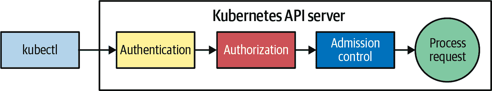
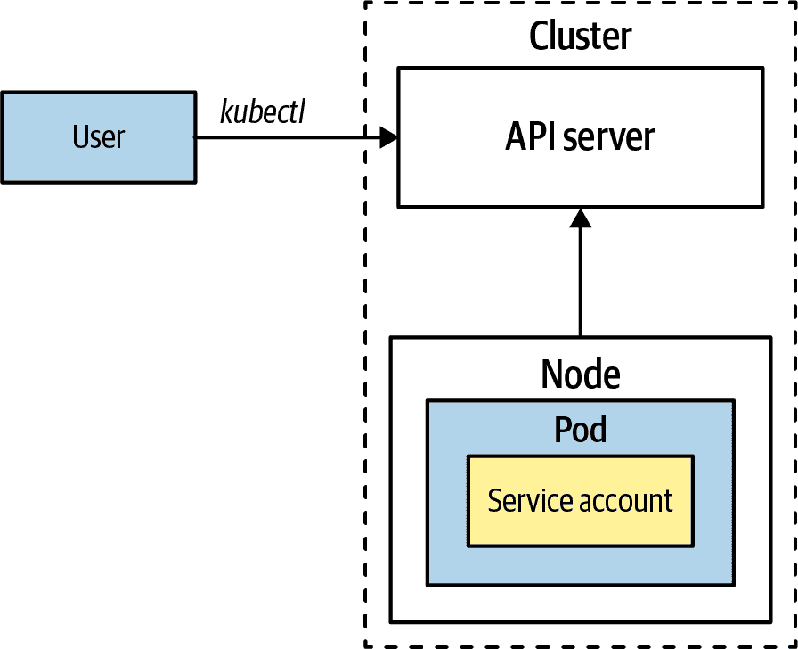
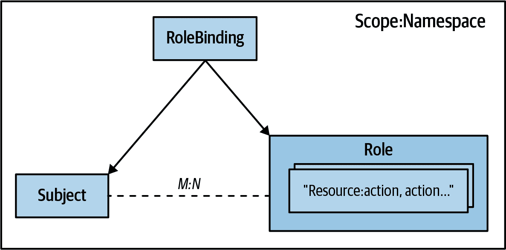
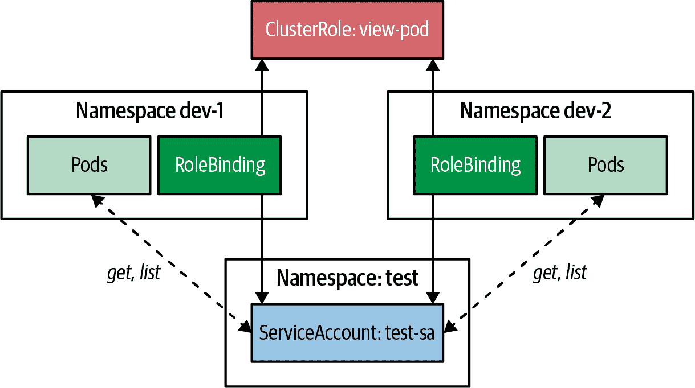
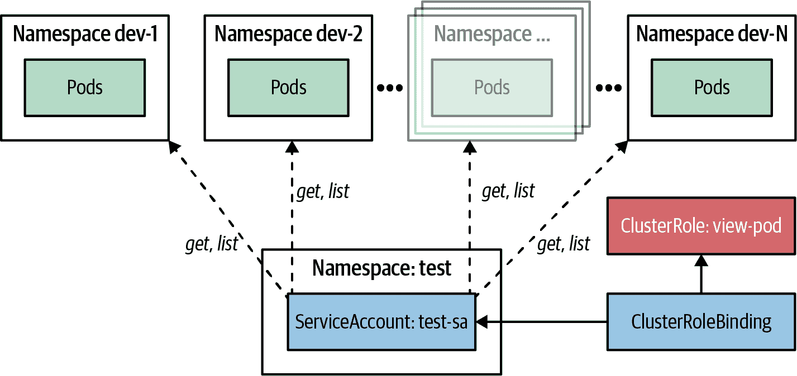

# 第二十六章：访问控制

随着世界越来越依赖云基础架构和容器化，安全性的重要性不可低估。2022 年，安全研究人员做出了令人担忧的发现：由于错误配置，近 100 万个 Kubernetes 实例暴露在互联网上。^(1) 利用专门的安全扫描器，研究人员能够轻松访问这些易受攻击的节点，突显了保护 Kubernetes 控制平面的严格访问控制措施的必要性。但是，虽然开发人员通常关注应用程序级授权，但有时也需要使用第二十八章中的*操作者*模式扩展 Kubernetes 的能力。在这些情况下，Kubernetes 平台上的访问控制变得至关重要。在本章中，我们深入探讨了*访问控制*模式，并探索了 Kubernetes 授权的概念。面对潜在的风险和后果，确保 Kubernetes 部署的安全性从未如此重要。

# 问题

当涉及操作应用程序时，安全性是一个关键问题。在安全性的核心是两个重要的概念：认证和授权。

*认证* 关注操作的主体，即操作的*谁*，并防止未经授权的访问。*授权* 则涉及确定对资源允许执行哪些操作的权限。

在本章中，我们将简要讨论身份验证，因为它主要是一个涉及将各种身份管理技术与 Kubernetes 集成的管理问题。另一方面，开发人员通常更关心授权，例如谁可以在集群中执行哪些操作以及访问应用程序的特定部分。

为了保护运行在 Kubernetes 顶部的应用程序的访问权限，开发人员必须考虑一系列安全策略，从简单的基于 Web 的认证到涉及外部提供商进行身份和访问管理的复杂单点登录场景。同时，对 Kubernetes API 服务器的访问控制对运行在 Kubernetes 上的应用程序同样重要。

错误配置的访问可能导致特权升级和部署失败。高特权的部署可以访问或修改其他部署的配置和资源，增加了集群妥协的风险。^(2) 开发人员理解管理员设置的授权规则，并在进行配置更改和部署新工作负载以符合组织范围政策时考虑安全性非常重要。

此外，随着越来越多的 Kubernetes 本地应用程序通过自定义资源定义（CRD）扩展 Kubernetes API 并向用户提供服务，如“控制器和操作员分类”所述，访问控制变得更加关键。Kubernetes 模式，如第二十七章，“控制器”和第二十八章，“操作员”，需要高权限来观察整个集群资源的状态，因此至关重要的是进行精细化的访问管理和限制，以限制任何潜在安全漏洞可能带来的影响。

# 解决方案

每个请求到 Kubernetes API 服务器必须经过三个阶段：认证、授权和准入控制，如图 26-1 所示。



###### 图 26-1\. 请求到 Kubernetes API 服务器必须经过这些阶段

一旦请求通过下面描述的认证和授权阶段，最终由准入控制器进行最终检查后，请求最终才会被处理。让我们分别看看这些阶段。

## 认证

如前所述，我们不会深入讨论认证，因为它主要是管理问题。但了解 Kubernetes 提供的可插拔认证策略是有好处的，让管理员可以配置：

使用 OIDC Authenticator 的 Bearer Tokens（OpenID Connect）

OpenID Connect（OIDC）的 Bearer Tokens 可以对客户端进行认证并授予对 API 服务器的访问权限。OIDC 是一种标准协议，允许客户端与支持 OIDC 的 OAuth2 提供者进行认证。客户端在其请求的 Authorization 标头中发送 OIDC 令牌，API 服务器验证该令牌以允许访问。有关整个流程，请参阅 Kubernetes 文档中的[OpenID Connect Tokens](https://oreil.ly/ZWXVD)。

客户端证书（X.509）

通过使用客户端证书，客户端向 API 服务器提供一个 TLS 证书，然后对其进行验证并用于授权访问。

认证代理

此配置选项是指使用自定义认证代理来验证客户端的身份，然后才允许访问 API 服务器。代理充当客户端和 API 服务器之间的中介，并在允许访问之前执行认证和授权检查。

静态令牌文件

Token 也可以存储在标准文件中，并用于认证。在此方法中，客户端向 API 服务器提供一个令牌，然后用于查找令牌文件并搜索匹配项。

Webhook Token 认证

Webhook 可以对客户端进行身份验证，并授予对 API 服务器的访问权限。在这种方法中，客户端在其请求的授权头部发送一个令牌，API 服务器将该令牌转发给预先配置的 Webhook 进行验证。如果 Webhook 返回有效响应，则客户端被授予访问 API 服务器的权限。这种技术类似于 Bearer Token 选项，不同之处在于可以使用外部自定义服务进行令牌验证。

Kubernetes 允许同时使用多个身份验证插件，如 Bearer Tokens 和客户端证书。如果 Bearer Token 策略验证了请求，Kubernetes 将不会检查客户端证书，反之亦然。不幸的是，这些策略评估的顺序不是固定的，因此无法知道哪一个会首先被检查。在评估策略时，一旦成功，过程将停止，并且 Kubernetes 将请求转发到下一个阶段。

身份验证后，将开始授权过程。

## 授权

Kubernetes 提供 RBAC 作为管理系统访问权限的标准方式。RBAC 允许开发者以精细化的方式控制和执行操作。Kubernetes 中的授权插件还提供了易于插拔的特性，允许用户在默认 RBAC 和其他模型（如基于属性的访问控制（ABAC）、Webhook 或委托给自定义权威）之间进行切换。

基于属性的访问控制（ABAC）方法需要一个文件，其中包含以 JSON 每行一条的策略。然而，这种方法需要服务器重新加载以应用任何更改，这可能是一个缺点。这种静态特性是 ABAC 授权仅在某些情况下使用的原因之一。

相反，几乎每个 Kubernetes 集群都使用默认的基于 RBAC 的访问控制，我们在“基于角色的访问控制”中详细描述了该控制方式。

在本章的其余部分关注授权之前，让我们快速看一下准入控制器执行的最后阶段。

## 准入控制器

准入控制器是 Kubernetes API 服务器的一个特性，允许您拦截对 API 服务器的请求，并根据这些请求执行附加操作。例如，您可以使用它们来强制执行策略、执行验证和修改传入的资源。

Kubernetes 使用准入控制器插件来实现各种功能。这些功能范围从在特定资源上设置默认值（如持久卷上的默认存储类），到验证（如 Pod 的允许资源限制），通过调用外部 Webhook 实现。

这些外部 Webhook 可以配置为专用资源，并用于验证（ValidatingWebhookConfiguration）和更新（MutatingWebhookConfiguration）API 资源。有关配置此类 Webhook 的详细信息，请参阅 Kubernetes 文档[“动态 Admission 控制”](https://oreil.ly/JEBu6)。

我们在这里不会详细介绍 Admission controllers，因为它们大多是一个管理概念，还有很多其他好的资源专门描述了 Admission controllers（参见“更多信息”）。

相反，本章的剩余部分，我们将专注于授权方面，以及如何为保护对 Kubernetes API 服务器的访问配置精细化的权限模型。

正如提到的，认证有两个基本部分和授权：*谁*，由一个主体表示，可以是一个人或者一个工作负载身份，以及*什么*，代表这些主体可以触发 Kubernetes API 服务器上的操作。在接下来的章节中，我们先讨论*谁*，然后再深入讨论*什么*的细节。

## 主体

*主体* 关注的是*谁*，与请求到 Kubernetes API 服务器相关联的身份。在 Kubernetes 中，有两种类型的主体，如图 26-2 所示：人类*用户*和代表 Pod 工作负载身份的*服务账户*。



###### 图 26-2\. 主体（用户或服务账户）请求到 API Server

人类用户和服务账户可以分别分组为*用户组*和*服务账户组*，这些组可以作为单一主体，其中组的所有成员共享相同的权限模型。我们将在本章后面讨论组，但首先，让我们仔细看看人类用户在 Kubernetes API 中的表示。

### 用户

与 Kubernetes 中许多其他实体不同，人类用户不作为显式资源在 Kubernetes API 中定义。这种设计决策意味着您无法通过 API 调用管理用户。认证和映射到用户主体是在通常的 Kubernetes API 机制之外由外部用户管理完成的。

正如我们所见，Kubernetes 支持多种方法来验证外部用户的身份。每个组件都知道如何在成功验证后提取主体信息。虽然每个认证组件的机制都不同，但它们最终会创建相同的用户表示，并将其添加到实际的 API 请求中，在后续阶段进行验证，如图例子 26-1 所示。

##### 例子 26-1\. 成功验证外部用户的表示

```
alice,4bc01e30-406b-4514,"system:authenticated,developers","scopes:openid"
```

这个逗号分隔的列表表示用户，并包含以下部分：

+   用户名（`alice`）

+   唯一用户标识符（UID）（`4bc01e30-406b-4514`）

+   该用户所属的组列表（`system:authenticated,developers`）

+   附加信息作为逗号分隔的键值对 (`scopes:openid`)

此信息由授权插件根据用户关联的授权规则或其所属用户组进行评估。在 示例 26-1 中，用户名为 `alice` 的用户具有与 `system:authenticated` 组和 `developers` 组关联的默认访问权限。额外的信息 `scope:openid` 表示正在使用 OIDC 验证用户身份。

某些用户名专为 Kubernetes 内部使用保留，并由特殊前缀 `system:` 区分。例如，用户名 `system:anonymous` 代表对 Kubernetes API 服务器的匿名请求。建议避免以 `system:` 前缀创建自己的用户或组，以避免冲突。表 26-1 列出了在 Kubernetes 中用于内部组件间通信时使用的默认用户名。

表 26-1\. Kubernetes 中的默认用户名

| 用户名 | 用途 |
| --- | --- |
| `system:anonymous` | 表示对 Kubernetes API 服务器的匿名请求 |
| `system:apiserver` | 表示 API 服务器本身 |
| `system:kube-proxy` | 表示 kube-proxy 服务的进程身份 |
| `system:kube-controller-manager` | 表示控制器管理器的用户代理 |
| `system:kube-scheduler` | 表示调度程序的用户 |

虽然 Kubernetes 集群的外部用户管理和认证可能因具体设置而异，但对 Pod 的工作负载身份的管理是 Kubernetes API 的标准化部分，并在所有集群中保持一致。

### Service 账户

Kubernetes 中的服务账户代表集群内的非人类实体，并用作工作负载标识。它们与 Pod 关联，允许 Pod 内的运行进程与 Kubernetes API 服务器通信。与 Kubernetes 可以对人类用户进行身份验证的多种方式不同，服务账户始终使用 [OpenID Connect 握手](https://oreil.ly/0fhR8) 和 JSON Web Tokens 来证明其身份。

Kubernetes 中的服务账户通过 API 服务器使用以下格式的用户名进行身份验证：`system:serviceaccount:<namespace>:<name>`。例如，如果在 `default` 命名空间中有一个名为 `random-sa` 的服务账户，则服务账户的用户名将是 `system:serviceaccount:default:random-sa`。

ServiceAccount 是 Kubernetes 的标准资源，如 示例 26-2 所示。

##### 示例 26-2\. ServiceAccount 定义

```
apiVersion: v1
kind: ServiceAccount
metadata:
  name: random-sa                   
  namespace: default
automountServiceAccountToken: false 
...
```


服务账户的名称。


指示是否默认将服务账户令牌挂载到 Pod 中的标志。默认设置为 `true`。

ServiceAccount 具有简单的结构，并为 Pod 在与 Kubernetes API 服务器通信时所需的所有身份相关信息提供服务。每个命名空间都有一个默认的 ServiceAccount，名称为`default`，用于标识未定义关联 ServiceAccount 的任何 Pod。

每个 ServiceAccount 都有一个与之关联的 JWT，完全由 Kubernetes 后端管理。每个 Pod 的关联 ServiceAccount 令牌会自动挂载到每个 Pod 的文件系统中。示例 26-3 显示了 Kubernetes 自动为每个创建的 Pod 添加的相关部分。

##### 示例 26-3\. ServiceAccount 令牌作为 Pod 的文件挂载

```
apiVersion: v1
kind: Pod
metadata:
  name: random
spec:
  serviceAccountName: default      
  containers:
    volumeMounts:
    - mountPath: /var/run/secrets/kubernetes.io/serviceaccount 
      name: kube-api-access-vzfp7  
      readOnly: true
  ...
  volumes:
  - name: kube-api-access-vzfp7
    projected:                     
      defaultMode: 420
      sources:
      - serviceAccountToken:
          expirationSeconds: 3600  
          path: token              
    ...
```


`serviceAccountName`用于设置服务帐户的名称（`serviceAccount`是`serviceAccountName`的已弃用别名）。


*/var/run/secrets/kubernetes.io/serviceaccount*是服务帐户令牌挂载的目录。


Kubernetes 为自动生成的卷分配一个随机的 Pod 唯一名称。


一个投影体积直接将 ServiceAccount 令牌注入文件系统。


令牌的过期时间以秒计。此时间后，令牌过期，并且挂载的令牌文件将使用新令牌更新。


文件名将包含令牌的名称。

要查看挂载的令牌，我们可以在运行中的 Pod 中执行对挂载文件的`cat`，如示例 26-4 所示。

##### 示例 26-4\. 打印出服务帐户 JWT（输出已缩短）

```
$ kubectl exec random -- \
     cat /var/run/secrets/kubernetes.io/serviceaccount/token
eyJhbGciOiJSUzI1NiIsImtpZCI6InVHYV9NZEVYOEZteUNUZFl...
```

在示例 26-3 中，令牌作为投影体积装载到 Pod 中。投影体积允许您合并多个卷源，如 Secret 和 ConfigMap 卷（在第二十章，“配置资源”中描述），进入单个目录。通过这种卷类型，ServiceAccount 令牌也可以直接映射到 Pod 的文件系统，使用`serviceAccountToken`子类型。该方法有几个好处，包括通过消除令牌中间表示的需要来减少攻击面，并提供设置令牌过期时间的能力，Kubernetes 令牌控制器将在过期后进行轮换。此外，注入到 Pod 中的令牌仅在 Pod 存在期间有效，进一步减少未经授权查看服务帐户令牌的风险。

在 Kubernetes 1.24 之前，秘密用于表示这些令牌，并直接通过`secret`卷类型挂载，其缺点是寿命长且缺乏轮换。由于新的投影卷类型，令牌仅对 Pod 可用，并且不作为附加资源公开，这减少了攻击面。您仍然可以手动创建一个包含 ServiceAccount 令牌的秘密，如示例 26-5 所示。

##### 示例 26-5\. 为 ServiceAccount `random-sa`创建一个秘密

```
apiVersion: v1
kind: Secret
type: kubernetes.io/service-account-token           
metadata:
  name: random-sa
  annotations:
    kubernetes.io/service-account.name: "random-sa" 
```


一种特殊类型，表示这个秘密用于保存 ServiceAccount。


引用应添加其令牌的 ServiceAccount。

Kubernetes 将 token 和用于验证的公钥填充到秘密中。此秘密的生命周期现在与 ServiceAccount 本身绑定。如果删除了 ServiceAccount，Kubernetes 也会删除这个秘密。

ServiceAccount 资源有两个额外的字段，用于指定用于拉取容器映像的凭据和定义允许挂载的秘密：

映像拉取秘密

映像拉取秘密允许工作负载在拉取映像时与私有注册表进行身份验证。通常，您需要在 Pod 规范的字段`.spec.imagePullSecrets`中手动指定拉取秘密。但是，Kubernetes 通过允许直接将拉取秘密附加到顶级字段`imagePullSecrets`的 ServiceAccount 中提供了一种快捷方式。与 ServiceAccount 关联的每个 Pod 在创建时都将自动将拉取秘密注入其规范中。这种自动化消除了在每次在命名空间中创建新 Pod 时手动包含映像拉取秘密的需求，从而减少了所需的手动工作。

可挂载的秘密

ServiceAccount 资源中的`secrets`字段允许您指定与 ServiceAccount 关联的 Pod 可以挂载的秘密。您可以通过向 ServiceAccount 添加`kubernetes.io/enforce-mountable-secrets`注释来启用此限制。如果将此注释设置为`true`，则只允许 Pod 挂载列出的秘密。

### 组

Kubernetes 中的用户和服务账户都可以属于一个或多个组。组是由认证系统附加到请求的，用于授予所有组成员权限。如示例 26-1 中所见，组名是表示组名称的纯字符串。

正如前面提到的，组可以由身份提供者自由定义和管理，以创建具有相同权限模型的主体组。Kubernetes 中还隐含定义了一组预定义的组，其名称以`system:`为前缀。这些预定义组列在表 26-2 中。

我们将看到如何在“角色绑定”中使用组名来授予所有组成员的权限。

表 26-2\. Kubernetes 中的系统组

| 组 | 用途 |
| --- | --- |
| `system:unauthenticated` | 分配给每个未经身份验证请求的组 |
| `system:authenticated` | 分配给已认证用户的组 |
| `system:masters` | 其成员对 Kubernetes API 服务器拥有无限制访问权限的组 |
| `system:serviceaccounts` | 集群中所有服务账户的组 |
| `system:serviceaccounts:<namespace>` | 此命名空间中所有服务账户的组 |

现在您已经清楚了解用户、服务账户和组，让我们检查如何将这些主体与定义其允许执行的操作的角色关联到 Kubernetes API 服务器。

## 基于角色的访问控制

在 Kubernetes 中，角色定义了主体可以对特定资源执行的具体操作。然后，您可以将这些角色分配给主体，如用户或服务账户，如“主体”中所述，通过使用角色绑定。角色和角色绑定是可以像任何其他资源一样创建和管理的 Kubernetes 资源。它们与特定命名空间绑定，并适用于其资源。

图 26-3 展示了主体、角色和角色绑定之间的关系。



###### 图 26-3\. 角色、角色绑定和主体之间的关系

在 Kubernetes RBAC 中，了解主体与角色之间存在多对多的关系很重要。这意味着单个主体可以具有多个角色，并且单个角色可以应用于多个主体。使用包含对主体列表和特定角色的引用的角色绑定来建立主体与角色之间的关系。

RBAC 概念通过具体示例最好解释。示例 26-6 展示了 Kubernetes 中角色的定义。

##### 示例 26-6\. 允许访问核心资源的角色

```
apiVersion: rbac.authorization.k8s.io/v1
kind: Role
metadata:
  name: developer-ro 
  namespace: default 
rules:
- apiGroups:
  - ""               
  resources:         
  - pods
  - services
  verbs:             
  - get
  - list
  - watch
```


用于引用此角色的角色名称。


此角色适用的命名空间。角色始终与命名空间关联。


空字符串表示核心 API 组。


规则适用的 Kubernetes 核心资源列表。


API 操作由与该角色关联的主体允许的动词表示。

在示例 26-6 中定义的角色指定了与该角色关联的任何用户或服务账户可以对 Pod 和 Service 执行只读操作。

然后，可以在 示例 26-7 中显示的 RoleBinding 中引用此 Role，以授予用户 `alice` 和 ServiceAccount `contractor` 的访问权限。

##### 示例 26-7\. RoleBinding 规范

```
apiVersion: rbac.authorization.k8s.io/v1
kind: RoleBinding
metadata:
  name: dev-rolebinding
subjects:               
- kind: User            
  name: alice
  apiGroup: "rbac.authorization.k8s.io"
- kind: ServiceAccount  
  name: contractor
  apiGroup: ""
roleRef:
  kind: Role            
  name: developer-ro
  apiGroup: rbac.authorization.k8s.io
```


要连接到 Role 的主题列表。


名为 `alice` 的用户的人类用户引用。


名为 `contractor` 的 Service account。


引用已在 示例 26-6 中定义的名为 `developer-ro` 的 Role。

现在您已经对主题、Roles 和 RoleBindings 之间的关系有了基本的了解，让我们深入探讨 Roles 和 RoleBindings 的具体细节。

### Role

Kubernetes 中的 Roles 允许您为一组 Kubernetes 资源或子资源定义一组允许的操作。在 Kubernetes 资源上的典型活动包括以下内容：

+   获取 Pods

+   删除 Secrets

+   更新 ConfigMaps

+   创建 ServiceAccounts

你已经在 示例 26-6 中看到了一个 Role。除了名称和命名空间等元数据外，Role 定义还包括一系列规则，描述了可以访问哪些资源。

只需匹配一个请求以授予对此 Role 的访问权限。每个 `rule` 描述了三个字段：

apiGroups

此列表用于代替单个值，因为通配符可以指定多个 API 组的所有资源。例如，空字符串 (`""`) 用于核心 API 组，其中包含主要的 Kubernetes 资源，如 Pods 和 Services。通配符字符 (`*`) 可以匹配集群感知的所有可用 API 组。

资源

此列表指定了 Kubernetes 应授予访问权限的资源。每个条目应属于至少一个配置的 `apiGroups`。单个 `*` 通配符条目表示允许来自所有配置的 `apiGroups` 的所有资源。

动词

在系统中允许的操作通过类似于 HTTP 方法的动词来定义。这些动词包括对资源的 CRUD 操作（CRUD 代表*创建-读取-更新-删除*，描述了你可以对持久化实体执行的常规读写操作），以及针对集合的单独操作，例如 `list` 和 `deletecollection`。此外，`watch` 动词允许访问资源变更事件，并与使用 `get` 直接读取资源的操作分开。对于运营人员来说，`watch` 动词对于接收他们正在管理的资源的当前状态通知至关重要。第二十七章，“Controller” 和 第二十八章，“Operator” 中有更多相关内容。表格 26-3 列出了最常见的动词。还可以使用 `*` 通配符字符来允许针对给定规则配置的所有资源的所有操作。

表 26-3\. Kubernetes CRUD 操作的 HTTP 请求方法映射

| 动词 | HTTP 请求方法 |
| --- | --- |
| get, watch, list | GET |
| create | POST |
| patch | PATCH |
| update | PUT |
| delete, delete collection | DELETE |

通配符权限使得能够在不单独列出每个选项的情况下更轻松地定义所有操作。角色的 `rule` 元素的所有属性都允许使用 `*` 通配符，该通配符匹配所有内容。示例 26-8 允许在核心和 `networking.k8s.io` API 组中的所有资源上执行所有操作。如果使用通配符，此列表应仅包含此通配符作为其唯一条目。

##### Example 26-8\. 资源和允许操作的通配符权限

```
rules:
- apiGroups:
  - ""
  - "networking.k8s.io"
  resources:
  - "*"  
  verbs:
  - "*"  
```


所有列出的 API 组中的所有资源，核心和 `networking.k8s.io`。


对这些资源允许执行所有操作。

通配符帮助开发人员快速配置规则。但它们伴随着特权升级的安全风险。这种更广泛的特权可能导致安全漏洞，并允许用户执行可能危及 Kubernetes 集群或引起不必要更改的任何操作。

现在我们已经深入探讨了 Kubernetes RBAC 模型中角色（*what*）和主体（*who*）的内容，让我们更详细地看看如何结合这两个概念与 RoleBindings。

### RoleBinding

在示例 26-7 中，我们看到了 RoleBindings 如何将一个或多个主体链接到给定的角色。

每个 RoleBinding 可以将一组主体连接到一个角色。`subjects` 列表字段以资源引用为元素。这些资源引用具有 `name` 字段以及用于定义引用的资源类型的 `kind` 和 `apiGroup` 字段。

RoleBinding 中的主体可以是以下类型之一：

用户

用户是由 API 服务器认证的人或系统，如“用户”中所述。用户条目具有固定的 `apiGroup` 值为 `rbac.authorization.k8s.io`。

组

组是用户的集合，如“组”所解释的那样。对于用户，组条目带有 `rbac.authorization.k8s.io` 作为 `apiGroup`。

ServiceAccount

我们在“Service accounts”中深入讨论了 ServiceAccount。ServiceAccounts 属于核心 API 组，由空字符串 (`""`) 表示。ServiceAccounts 的一个独特之处在于它是唯一可以携带 `namespace` 字段的主体类型。这使您可以授予对其他命名空间中 Pod 的访问权限。

表 26-4 总结了 RoleBinding `subject` 列表条目的可能字段值。

表 26-4\. RoleBinding `subjects` 列表中元素的可能类型

| 类型 | API 组 | 命名空间 | 描述 |
| --- | --- | --- | --- |
| User | rbac.authorization.k8s.io | N/A | `name` 是对用户的引用。 |
| Group | rbac.authorization.k8s.io | N/A | `name` 是用户组的引用。 |
| ServiceAccount | “” | Optional | `name` 是配置的命名空间中 ServiceAccount 资源的引用。 |

RoleBinding 的另一端指向一个单独的 Role。这个 Role 可以是与 RoleBinding 相同命名空间内的 Role 资源，也可以是集群中多个绑定共享的 ClusterRole 资源。ClusterRoles 的详细描述在 “ClusterRole” 中。

类似于主体列表，Role 引用由 `name`、`kind` 和 `apiGroup` 指定。Table 26-5 展示了 `roleRef` 字段可能的值。

Table 26-5\. RoleBinding 中 `roleRef` 字段的可能类型

| Kind | API Group | Description |
| --- | --- | --- |
| Role | rbac.authorization.k8s.io | `name` 是同一命名空间中 Role 的引用。 |
| ClusterRole | rbac.authorization.k8s.io | `name` 是集群范围内 ClusterRole 的引用。 |

### ClusterRole

Kubernetes 中的 ClusterRoles 类似于常规 Roles，但是应用于整个集群而不是特定的命名空间。它们有两个主要用途：

+   保护集群范围的资源，例如 CustomResourceDefinitions 或 StorageClasses。这些资源通常在集群管理员级别管理，并需要额外的访问控制。例如，开发人员可能对这些资源具有读取访问权限，但需要帮助编写访问权限。ClusterRoleBindings 用于授予主体对集群范围资源的访问权限。

+   定义跨命名空间共享的典型 Role。正如我们在 “RoleBinding” 中看到的，RoleBindings 只能引用同一命名空间中定义的 Roles。ClusterRoles 允许您定义一般访问控制角色（例如，对所有资源的只读访问的 “view” 角色），这些角色可以在多个 RoleBindings 中使用。

Example 26-9 展示了一个可以在多个 RoleBindings 中重复使用的 ClusterRole。它与 Role 具有相同的模式，只是忽略了任何 `.meta.namespace` 字段。

##### Example 26-9\. ClusterRole

```
apiVersion: rbac.authorization.k8s.io/v1
kind: ClusterRole
metadata:
  name: view-pod 
rules:
- apiGroups:     
  - ""
  resources:
  - pods
  verbs:
  - get
  - list
```


ClusterRole 的名称，但没有命名空间声明。


允许对所有 Pods 进行读操作的规则。

Figure 26-4 展示了一个单一 ClusterRole 如何在不同命名空间的多个 RoleBindings 中共享。在这个例子中，ClusterRole 允许 ServiceAccount 在 `test` 命名空间中读取 `dev-1` 和 `dev-2` 命名空间中的 Pods。



###### Figure 26-4\. 在多个命名空间中共享 ClusterRole

使用单个 ClusterRole 在多个 RoleBindings 中允许您创建可以轻松重复使用的典型访问控制方案。例如，Table 26-6 包含 Kubernetes 默认提供的一些有用的面向用户的 ClusterRoles 的选择。您可以使用`kubectl get clusterroles`命令查看 Kubernetes 集群中可用的 ClusterRoles 的完整列表，或参考[Kubernetes 文档](https://oreil.ly/QklvQ)获取默认 ClusterRoles 的列表。

表 26-6. 标准用户界面 ClusterRoles

| ClusterRole | 用途 |
| --- | --- |
| `view` | 允许在命名空间中大多数资源上进行读取，但不包括 Role、RoleBinding 和 Secret |
| `edit` | 允许在命名空间中读取和修改大多数资源，但不包括 Role 和 RoleBinding |
| `admin` | 授予对命名空间中所有资源的完全控制权限，包括 Role 和 RoleBinding |
| `cluster-admin` | 授予对所有命名空间资源的完全控制权限，包括整个集群范围的资源 |

有时，您可能需要结合两个 ClusterRoles 中定义的权限。一种方法是创建引用这两个 ClusterRoles 的多个 RoleBinding。然而，还有一种更优雅的方法可以使用聚合来实现这一点。

要使用聚合功能，您可以定义一个具有空`rules`字段和填充的`aggregationRule`字段的 ClusterRole，其中包含一组标签选择器。然后，每个其他具有匹配这些选择器的标签的 ClusterRole 定义的规则将被合并并用于填充聚合 ClusterRole 的`rules`字段。

###### 注意

当您设置`aggregationRule`字段时，您正在将`rules`字段的所有权交给 Kubernetes，Kubernetes 将完全管理它。因此，对规则字段的任何手动更改都将被聚合 ClusterRole 中选择的 ClusterRoles 的聚合规则不断覆盖。

此聚合技术允许您通过组合更小、更专注的 ClusterRoles 来动态且优雅地构建大型规则集。

示例 26-10（#ex-accesscontrol-clusterrole-aggregation）显示了默认的`view`角色如何使用聚合来获取带有`rbac.authorization.k8s.io/aggregate-to-view`标签的更具体的 ClusterRoles。`view`角色本身还具有`rbac.authorization.k8s.io/aggregate-to-edit`标签，该标签由`edit`角色使用，以包含来自`view`ClusterRole 的聚合规则。

##### 示例 26-10. 聚合 ClusterRole

```
apiVersion: rbac.authorization.k8s.io/v1
kind: ClusterRole
metadata:
  name: view
  labels:
    rbac.authorization.k8s.io/aggregate-to-edit: "true"   
aggregationRule:
  clusterRoleSelectors:
  - matchLabels:
      rbac.authorization.k8s.io/aggregate-to-view: "true" 
rules: []  
```


此标签将 ClusterRole 公开为符合包含在`edit`角色中的资格。


所有匹配此选择器的 ClusterRoles 将被选中用于`view`ClusterRole。请注意，如果您希望向`view`ClusterRole 添加额外权限，则无需更改此 ClusterRole 声明—您可以创建具有适当标签的新 ClusterRole。


`rules` 字段将由 Kubernetes 管理，并填充聚合规则。

此技术允许您通过聚合一组基本的 ClusterRoles 快速组合更专业化的 ClusterRoles。示例 26-10 还演示了如何嵌套聚合以构建权限规则集的继承链。

由于所有用户界面的默认 ClusterRoles 使用了这种聚合技术，您可以通过简单地添加标准 ClusterRoles 的聚合触发标签（例如 `view`、`edit` 和 `admin`）来快速接入自定义资源的权限模型（如 第二十八章，“操作员” 中描述的）。

现在我们已经介绍了如何使用 ClusterRoles 和 RoleBindings 创建灵活和可重用的权限模型，那么谜题的最后一块是使用 ClusterRoleBindings 建立集群范围的访问规则。

### ClusterRoleBinding

ClusterRoleBinding 的模式与 RoleBinding 的模式类似，但它忽略了 `namespace` 字段。在 ClusterRoleBinding 中定义的规则适用于集群中的所有命名空间。

示例 26-11 显示了一个将 ServiceAccount `test-sa` 与在 示例 26-9 中定义的 ClusterRole `view-pod` 连接起来的 ClusterRoleBinding。

##### 示例 26-11\. ClusterRoleBinding

```
apiVersion: rbac.authorization.k8s.io/v1
kind: ClusterRoleBinding
metadata:
  name: test-sa-crb
subjects:             
- kind: ServiceAccount
  name: test-sa
  namespace: test
roleRef:              
  kind: ClusterRole
  name: view-pod
  apiGroup: rbac.authorization.k8s.io
```


连接来自 `test` 命名空间的 ServiceAccount `test-sa`。


允许每个命名空间使用 ClusterRole `view-pod` 的规则。

在 ClusterRole `view-pod` 中定义的规则适用于集群中的所有命名空间，因此与 ServiceAccount `test-sa` 关联的任何 Pod 都可以读取每个命名空间中的所有 Pods，如 图 26-5 所示。然而，使用 ClusterRoleBindings 需要谨慎，因为它们在整个集群范围内授予了广泛的权限。因此，建议您仔细考虑是否需要使用 ClusterRoleBinding。

使用 ClusterRoleBinding 可能很方便，因为它会自动向新创建的命名空间授予权限。然而，通常更好地使用每个命名空间的单独 RoleBindings 可以更精细地控制权限。这额外的工作允许您省略特定命名空间（例如 `kube-system`）的未经授权访问。



###### 图 26-5\. 用于读取所有 Pods 的 ClusterRoleBinding

ClusterRoleBindings 应仅用于管理集群范围的资源，如节点、命名空间、自定义资源定义或甚至 ClusterRoleBindings。

这些最终警告结束了我们对 Kubernetes RBAC 世界的探索之旅。这个机制很强大，但理解它有时也很复杂，甚至更难调试。下面的边栏给出了一些帮助您更好理解给定 RBAC 设置的提示。

最后一节将讨论一些关于正确使用 Kubernetes RBAC 的通用提示。

# 讨论

Kubernetes RBAC 是控制访问 API 资源的强大工具。然而，了解要使用哪些定义对象以及如何组合它们以适应特定的安全设置可能是具有挑战性的。以下是一些指导方针，帮助您在这些决策中导航：

+   如果要保护特定命名空间中的资源，请使用具有与用户或 ServiceAccount 连接的 RoleBinding 的 Role。ServiceAccount 不必在同一命名空间中，这允许您授予来自其他命名空间的 Pods 的访问权限。

+   如果要在多个命名空间中重用相同的访问规则，请使用具有定义这些共享访问规则的 ClusterRole 的 RoleBinding。

+   如果要扩展一个或多个现有的预定义 ClusterRoles，请创建一个新的 ClusterRole，并在其中添加一个 `aggregationRule` 字段，该字段引用您希望扩展的 ClusterRoles，并将权限添加到 `rules` 字段中。

+   如果要授予用户或 ServiceAccount 访问所有命名空间中特定类型的所有资源，请使用 ClusterRole 和 ClusterRoleBinding。

+   如果要管理对集群范围资源（如 CustomResourceDefinition）的访问权限，请使用 ClusterRole 和 ClusterRoleBinding。

我们已经看到了如何使用 RBAC 定义细粒度权限并对其进行管理。它可以通过确保应用的权限不留下升级路径的空白来降低风险。另一方面，定义任何广泛开放的权限可能会导致安全升级。让我们通过总结一些通用的 RBAC 建议来结束这一章节：

避免使用通配符权限。

我们建议在组成 Kubernetes 集群中的细粒度访问控制时遵循最小特权原则。为了避免意外操作，在定义 Role 和 ClusterRoles 时避免使用通配符权限。在极少数情况下，使用通配符可能是有道理的（即，为了保护 API 组的所有资源），但建立一个通常的“无通配符”策略，并为合理的例外情况放宽限制是一个良好的做法。

避免使用 `cluster-admin` ClusterRole。

拥有高权限的 ServiceAccounts 可以让您在任何资源上执行操作，比如修改权限或查看任何命名空间中的 secrets，这可能会导致严重的安全问题。因此，永远不要将 `cluster-admin` ClusterRole 分配给 Pod。绝对不要。

不要自动挂载 ServiceAccount 令牌。

默认情况下，ServiceAccount 的令牌被挂载到容器的文件系统中，路径为 */var/run/secrets/kubernetes.io/serviceaccount/token*。如果这样的 Pod 被 compromise，任何攻击者都可以使用 Pod 关联的 ServiceAccount 的权限与 API 服务器通信。然而，许多应用程序在业务运作中并不需要该令牌。对于这种情况，可以通过将 ServiceAccount 的字段 `automountServiceAccountToken` 设置为 `false` 来避免挂载令牌。

Kubernetes 的 RBAC 是一种灵活且强大的方法，用于控制对 Kubernetes API 的访问。因此，即使您的应用程序不直接与 API Server 交互来安装应用程序并将其连接到其他 Kubernetes 服务器，*访问控制* 也是一种保护应用程序操作的有价值模式。

# 更多信息

+   [访问控制示例](https://oreil.ly/GyIlq)

+   [升级路径](https://oreil.ly/HHT3G)

+   [控制对 Kubernetes API 的访问](https://oreil.ly/BtTB9)

+   [审计](https://oreil.ly/XgzNL)

+   [准入控制器参考](https://oreil.ly/QSqW8)

+   [动态准入控制](https://oreil.ly/7oCSg)

+   [Kubernetes：认证策略](https://oreil.ly/hSISq)

+   [RBAC 良好实践](https://oreil.ly/h7XHg)

+   [工作负载创建](https://oreil.ly/uC307)

+   [绑定的 Service Account 令牌](https://oreil.ly/bJVhD)

+   [K8s 1.24 关于 ServiceAccount 及其密钥的重大变更](https://oreil.ly/T22fJ)

+   [高效的变更检测](https://oreil.ly/RdlPi)

+   [向 Service Account 添加 ImagePullSecrets](https://oreil.ly/jVXQN)

+   [RBAC Dev](https://rbac.dev)

+   [Rakkess](https://oreil.ly/fE1I_)

+   [Kubernetes 认证基础的组织规模化基础](https://oreil.ly/nAFu2)

+   [Kubernetes CVE-2020-8559 漏洞验证 PoC 攻击](https://oreil.ly/BC6aO)

+   [OAuth 不是认证](https://oreil.ly/UVz7Y)

^(1) 详见博文 [“暴露的 Kubernetes 集群”](https://oreil.ly/uGzr_).

^(2) 在节点上具有升级权限的攻击者可以 compromise 整个 Kubernetes 集群。
