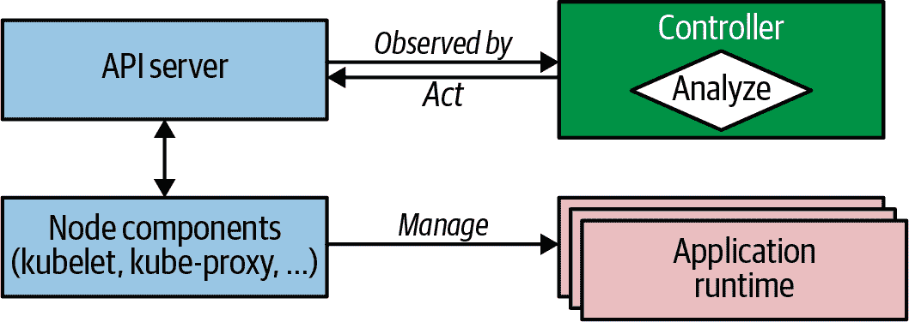

# 第二十七章：控制器

控制器主动监视和维护一组 Kubernetes 资源，使其保持在所需状态。Kubernetes 的核心是一组控制器，它们定期监视和协调应用程序的当前状态与声明的目标状态。在本章中，我们将看到如何利用*控制器*模式来扩展平台以满足我们的需求。

# 问题

你已经看到 Kubernetes 是一个复杂而全面的平台，它提供了许多开箱即用的功能。然而，它是一个通用的编排平台，不能涵盖所有应用用例。幸运的是，它提供了自然的扩展点，可以在经过验证的 Kubernetes 构建块之上优雅地实现特定用例。

这里主要涉及的主要问题是如何在不改变和破坏 Kubernetes 的情况下扩展它，以及如何利用其能力进行自定义用例的使用。

Kubernetes 的设计基于声明性资源中心 API。那么，什么是*声明式*？与*命令式*方法相对，声明式方法不是告诉 Kubernetes 如何行动，而是描述目标状态应该如何展示。例如，当我们扩展一个部署时，我们不会通过告诉 Kubernetes “创建一个新的 Pod” 来主动创建新的 Pod。相反，我们通过 Kubernetes API 修改部署资源的 `replicas` 属性来设定所需数量。

那么，新的 Pods 是如何创建的呢？这是由控制器在内部完成的。对资源状态进行任何更改（比如修改部署的 `replicas` 属性值）时，Kubernetes 会创建一个事件并广播给所有感兴趣的监听器。这些监听器可以通过修改、删除或创建新的资源来作出响应，从而创建其他事件，例如 Pod 创建事件。这些事件可能再次被其他控制器接收，执行它们特定的动作。

整个过程也被称为*状态协调*，其中目标状态（所需副本数）与当前状态（实际运行实例）不同，控制器的任务是协调并再次达到所需的目标状态。从这个角度来看，Kubernetes 本质上是一个分布式状态管理器。你给它一个组件实例的期望状态，它会尽力维持该状态，以应对任何变化。

现在，我们如何在不修改 Kubernetes 代码的情况下，钩入这个协调过程并创建一个适合我们特定需求的控制器？

# 解决方案

Kubernetes 集成了一组内置控制器，用于管理标准 Kubernetes 资源，如 ReplicaSets、DaemonSets、StatefulSets、Deployments 或 Services。这些控制器作为控制器管理器的一部分运行，控制器管理器作为控制平面节点上的独立进程或 Pod 部署。这些控制器彼此之间并不知道对方。它们运行在无尽的对比循环中，监视它们的资源的实际状态和期望状态，并相应地采取行动，使实际状态接近期望状态。

但是，除了这些开箱即用的控制器外，Kubernetes 的事件驱动架构还允许我们本地插入其他自定义控制器。自定义控制器可以通过对状态变更事件做出响应来增加行为的额外功能，方式与内部控制器相同。控制器的一个共同特征是它们是响应式的，并且会对系统中的事件做出反应，以执行它们的特定操作。在高层次上，这个协调过程包括以下主要步骤：

观察

通过观察 Kubernetes 在观察到资源变化时发出的事件，发现实际状态。

分析

确定与期望状态的差异。

行动

执行操作以将实际状态驱动到期望状态。

例如，ReplicaSet 控制器会监视 ReplicaSet 资源的变化，分析需要运行多少个 Pod，并通过向 API 服务器提交 Pod 定义来执行操作。然后 Kubernetes 后端负责在节点上启动请求的 Pod。

图 27-1 显示一个控制器如何注册自己作为事件监听器，以检测受管资源的变化。它观察当前状态，并通过调用 API 服务器来改变它，以接近目标状态（如果需要）。



###### 图 27-1\. 观察-分析-行动循环

控制器是 Kubernetes 控制平面的一部分，很早就清楚它们也允许您通过自定义行为扩展平台。此外，它们已成为扩展平台和启用复杂应用生命周期管理的标准机制。因此，诞生了一代新的更复杂的控制器，称为 *操作员*。从进化和复杂性的角度来看，我们可以将主动协调组件分为两组：

*控制器*

一个简单的协调过程，监视和处理标准 Kubernetes 资源。通常，这些控制器增强平台行为并添加新的平台功能。

*操作员*

一个复杂的协调过程，与 CustomResourceDefinitions (CRDs) 交互，这些 CRDs 是 *操作员* 模式的核心。通常，这些操作员封装复杂的应用程序领域逻辑，并管理完整的应用程序生命周期。

如前所述，这些分类有助于逐步引入新概念。在这里，我们关注更简单的控制器，在 第二十八章 中介绍 CRD 并逐步构建 *操作员* 模式。

为了避免多个控制器同时作用于相同的资源，控制器使用在 第十章 中解释的 *单例服务* 模式。大多数控制器部署方式与 Deployment 类似，但只有一个副本，因为 Kubernetes 在资源级别使用乐观锁定来防止并发问题。最终，控制器只是在后台永久运行的应用程序。

由于 Kubernetes 本身是用 Go 语言编写的，并且用于访问 Kubernetes 的完整客户端库也是用 Go 语言编写的，因此许多控制器也是用 Go 语言编写的。然而，您可以通过向 Kubernetes API Server 发送请求，用任何编程语言编写控制器。稍后我们将看到一个纯 shell 脚本编写的控制器示例，在 示例 27-1 中。

最简单的控制器扩展了 Kubernetes 管理资源的方式。它们操作与 Kubernetes 内部控制器操作标准 Kubernetes 资源相同的标准资源，并执行类似的任务，但对集群的用户是不可见的。控制器评估资源定义并有条件地执行一些操作。尽管它们可以监视并针对资源定义中的任何字段执行操作，但元数据和 ConfigMaps 最适合这个目的。选择存储控制器数据的地方时需要考虑以下几点：

标签

作为资源元数据的一部分，标签可以被任何控制器监视。它们在后端数据库中被索引，并且可以在查询中高效地搜索。当需要类似选择器的功能时（例如，匹配服务或部署的 Pod 时），应使用标签。标签的一个限制是只能使用带有限制的字母数字名称和值。请参阅 Kubernetes 文档，了解标签允许的语法和字符集。

注解

注解是标签的一个很好的替代品。如果值不符合标签值的语法限制，则必须使用注解而不是标签。注解不被索引，因此我们将注解用于控制器查询中不用作键的非标识信息。相比于将任意元数据放入标签，偏好注解的另一个优点是它不会对内部 Kubernetes 性能产生负面影响。

配置映射

有时控制器需要额外信息，这些信息无法很好地放在标签或注释中。在这种情况下，可以使用 ConfigMaps 来保存目标状态定义。这些 ConfigMaps 然后被控制器监视和读取。然而，CRDs 更适合设计定制目标状态规范，并且推荐使用而不是普通的 ConfigMaps。然而，要注册 CRDs，您需要提升的集群级权限。如果您没有这些权限，ConfigMaps 仍然是 CRDs 的最佳替代方案。我们将在 第二十八章，“Operator” 中详细解释 CRDs。

这里有几个相当简单的示例控制器，您可以作为此模式的样本实现进行学习：

jenkins-x/exposecontroller

[这个控制器](https://oreil.ly/URMaE) 监视 Service 定义，如果检测到元数据中名为 `expose` 的注解，控制器会自动为 Service 提供外部访问的 Ingress 对象。当某人移除 Service 时，它还会移除 Ingress 对象。这个项目现在已存档，但仍然是实现简单控制器的良好示例。

stakater/Reloader

这是 [一个控制器](https://oreil.ly/YUGPG)，它监视 ConfigMap 和 Secret 对象的更改，并执行与它们关联的工作负载的滚动升级，这些工作负载可以是 Deployment、DaemonSet、StatefulSet 和其他工作负载资源。我们可以将此控制器用于那些不能够监视 ConfigMap 并动态更新自身配置的应用程序。尤其是当 Pod 将此 ConfigMap 作为环境变量使用，或者当您的应用程序无法快速可靠地在不重新启动的情况下即时更新自身时。作为概念验证，我们使用简单的 shell 脚本在 示例 27-2 中实现了类似的控制器。

Flatcar Linux Update Operator

这是一个 [控制器](https://oreil.ly/f8_FY)，当检测到 Node 资源对象上特定注解时，它会重新启动运行在 Flatcar Container Linux 上的 Kubernetes 节点。

现在让我们看一个具体的例子：一个由单个 shell 脚本组成的控制器，它监视 Kubernetes API 上 ConfigMap 资源的更改。如果我们在这样的 ConfigMap 上注释了 `k8spatterns.io/podDeleteSelector`，则选定的所有 Pod 在 ConfigMap 更改时都会被删除。假设我们使用高阶资源如 Deployment 或 ReplicaSet 支持这些 Pod，则这些 Pod 将重新启动并获取更改后的配置。

例如，下面的 ConfigMap 将由我们的控制器监视更改，并重新启动所有具有标签 `app` 值为 `webapp` 的 Pod。示例 27-1 中的 ConfigMap 在我们的 Web 应用程序中用于提供欢迎消息。

##### 示例 27-1\. Web 应用程序使用的 ConfigMap

```
apiVersion: v1
kind: ConfigMap
metadata:
  name: webapp-config
  annotations:
    k8spatterns.io/podDeleteSelector: "app=webapp"  
data:
  message: "Welcome to Kubernetes Patterns !"
```


用作选择器的注解，用于在示例 27-2 中找到要重新启动的应用程序 Pod。

我们的控制器 shell 脚本现在评估此 ConfigMap。您可以在我们的 Git 存储库中找到其完整源代码。简而言之，控制器启动了一个*挂起 GET* HTTP 请求，以打开一个无限的 HTTP 响应流，以观察 API Server 推送给我们的生命周期事件。这些事件以简单的 JSON 对象形式存在，然后被分析以检测变更的 ConfigMap 是否带有我们的注解。随着事件的到达，控制器通过删除所有与注解值匹配的 Pod 来执行操作。让我们更详细地看看控制器是如何工作的。

此控制器的主要部分是协调循环，它侦听 ConfigMap 生命周期事件，如示例 27-2 所示。

##### 示例 27-2\. 控制器脚本

```
namespace=${WATCH_NAMESPACE:-default}  

base=http://localhost:8001             
ns=namespaces/$namespace

curl -N -s $base/api/v1/${ns}/configmaps?watch=true | \ while read -r event                    
do
   # ... done
```


要监视的命名空间（如果未指定，则为*default*）。


通过在同一 Pod 中运行的代理访问 Kubernetes API。


循环，监听 ConfigMaps 上的事件。

环境变量`WATCH_NAMESPACE`指定控制器应该监视的 ConfigMap 更新所在的命名空间。我们可以在控制器自身的部署描述符中设置此变量。在我们的示例中，我们使用第十四章，“自我感知”中描述的 Downward API，监视我们部署控制器的命名空间，如示例 27-3 中作为控制器部署的一部分的配置。

##### 示例 27-3\. 从当前命名空间中提取的`WATCH_NAMESPACE`。

```
env:
 - name: WATCH_NAMESPACE
   valueFrom:
     fieldRef:
       fieldPath: metadata.namespace
```

使用此命名空间，控制器脚本构建到 Kubernetes API 端点的 URL 来监视 ConfigMaps。

###### 注意

注意，在示例 27-2 中的`watch=true`查询参数中。此参数指示 API Server 不关闭 HTTP 连接，而是立即将事件沿响应通道发送（*挂起 GET* 或 *Comet* 是此类技术的其他名称）。该循环读取每个到达的事件作为单个要处理的项目。

正如你所看到的，我们的控制器通过 localhost 联系 Kubernetes API Server。我们不会直接在 Kubernetes API 控制平面节点上部署此脚本，但是脚本中如何使用 localhost 呢？你可能已经猜到，这里另一个模式发挥作用。我们将此脚本与一个大使容器一起部署在 Pod 中，该容器在 localhost 上公开端口 8001 并将其代理到真正的 Kubernetes 服务。有关*大使*模式的更多详细信息，请参见第十八章。稍后在本章中，我们将详细查看带有此大使的实际 Pod 定义。

当然，这种方式监视事件并不十分健壮。连接随时可能停止，因此应该有一种方法重新启动循环。此外，可能会错过事件，因此生产级控制器不仅应该监视事件，而且不时应该查询 API 服务器以获取整个当前状态，并将其用作新的基础。出于展示模式的考虑，这已经足够好了。

在循环内，执行示例 27-4 中显示的逻辑。

##### 示例 27-4\. 控制器对账循环

```
curl -N -s $base/api/v1/${ns}/configmaps?watch=true | \ while read -r event
do
  type=$(echo "$event"        | jq -r '.type')                 
  config_map=$(echo "$event"  | jq -r '.object.metadata.name')
  annotations=$(echo "$event" | jq -r '.object.metadata.annotations')

  if [ "$annotations" != "null" ]; then
    selector=$(echo $annotations | \                           
     jq -r "\
        to_entries                                           |\
        .[]                                                  |\
        select(.key == \"k8spatterns.io/podDeleteSelector\") |\
        .value                                               |\
         @uri                                                 \
     ")
  fi

  if [ $type = "MODIFIED" ] && [ -n "$selector" ]; then        
    pods=$(curl -s $base/api/v1/${ns}/pods?labelSelector=$selector |\
           jq -r .items[].metadata.name)

    for pod in $pods; do                                       
      curl -s -X DELETE $base/api/v1/${ns}/pods/$pod
    done
  fi
done
```


从事件中提取 ConfigMap 的类型和名称。


提取 ConfigMap 上所有带有`k8spatterns.io/podDeleteSelector`键的注解。有关此`jq`表达式的解释，请参见下面的侧边栏。


如果事件指示 ConfigMap 的更新并且我们的注解已附加，则查找所有匹配此标签选择器的 Pod。


删除所有与选择器匹配的 Pod。

首先，脚本提取指定 ConfigMap 操作的事件类型。然后，我们使用`jq`派生注解。[`jq`](https://oreil.ly/e57Xi)是一个从命令行解析 JSON 文档的优秀工具，并且该脚本假设它在运行脚本的容器中可用。

如果 ConfigMap 有注解，我们会检查`k8spatterns.io/podDeleteSelector`注解，使用更复杂的`jq`查询。此查询的目的是将注解值转换为可以在下一步 API 查询选项中使用的 Pod 选择器。例如，注解`k8spatterns.io/podDeleteSelector: "app=webapp"`被转换为`app%3Dwebapp`，这个转换是通过`jq`执行的，如果您对此提取方式感兴趣，接下来会进行详细解释。

如果脚本可以提取`selector`，我们现在可以直接使用它来选择要删除的 Pod。首先，我们查找所有与该选择器匹配的 Pod，然后逐个使用直接的 API 调用进行删除。

当然，这个基于 Shell 脚本的控制器不适用于生产环境（例如，事件循环可能随时停止），但它很好地展示了基本概念，没有过多的样板代码。

剩下的工作是创建资源对象和容器映像。控制器脚本本身存储在一个名为`config-watcher-controller`的 ConfigMap 中，如果需要的话可以很容易地进行后续编辑。

我们使用 Deployment 来为我们的控制器创建一个包含两个容器的 Pod：

+   一个 Kubernetes API 大使容器，在本地主机的 8001 端口上通过 localhost 公开 Kubernetes API。镜像`k8spatterns/kubeapi-proxy`是一个带有本地`kubectl`安装的 Alpine Linux，并启动了带有正确 CA 和令牌挂载的`kubectl proxy`。最初的版本 kubectl-proxy 由 Marko Lukša 编写，他在《Kubernetes 实战》中介绍了这个代理。

+   执行刚创建的 ConfigMap 中脚本的主容器。在这里，我们使用一个带有 `curl` 和 `jq` 安装的 Alpine 基础镜像。

您可以在示例 [Git 仓库](https://oreil.ly/a0zZR) 中找到 `k8spatterns/kubeapi-proxy` 和 `k8spatterns/curl-jq` 镜像的 Dockerfile。

现在我们已经有了我们 Pod 的镜像，最后一步是通过使用 Deployment 部署控制器。我们可以在 示例 27-5 中看到 Deployment 的主要部分（完整版本可在我们的示例仓库中找到）。

##### 示例 27-5\. 控制器部署

```
apiVersion: apps/v1
kind: Deployment
# ....
spec:
  template:
    # ...
    spec:
      serviceAccountName: config-watcher-controller 
      containers:
      - name: kubeapi-proxy                         
        image: k8spatterns/kubeapi-proxy
      - name: config-watcher                        
        image: k8spatterns/curl-jq
        # ...
        command:                                    
        - "sh"
        - "/watcher/config-watcher-controller.sh"
        volumeMounts:                               
        - mountPath: "/watcher"
          name: config-watcher-controller
      volumes:
      - name: config-watcher-controller             
        configMap:
          name: config-watcher-controller
```


具有适当权限以监视事件和重新启动 Pod 的 ServiceAccount。


用于将本地主机代理到 Kubeserver API 的大使容器。


包含所有工具并挂载控制器脚本的主容器。


启动命令调用控制器脚本。


映射到保存我们脚本的 ConfigMap 的卷。


将 ConfigMap 支持的卷挂载到主 Pod 中。

正如您所看到的，我们从先前创建的 ConfigMap 中挂载 `config-watcher-controller-script` 并直接将其用作主容器的启动命令。为简单起见，我们省略了任何活跃性和就绪性检查以及资源限制声明。此外，我们需要一个 ServiceAccount `config-watcher-controller`，允许其监视 ConfigMaps。有关完整的安全设置，请参阅示例仓库。

让我们看看控制器的工作情况。为此，我们使用了一个简单的 Web 服务器，它将环境变量的值作为唯一的内容进行提供。基础镜像使用纯粹的 `nc`（netcat）来提供内容。您可以在示例仓库中找到此镜像的 Dockerfile。我们使用 ConfigMap 和 Deployment 部署 HTTP 服务器，如 示例 27-6 中所示。

##### 示例 27-6\. 带有 Deployment 和 ConfigMap 的示例 Web 应用程序

```
apiVersion: v1
kind: ConfigMap                                    
metadata:
  name: webapp-config
  annotations:
    k8spatterns.io/podDeleteSelector: "app=webapp" 
data:
  message: "Welcome to Kubernetes Patterns !"      
---
apiVersion: apps/v1
kind: Deployment                                   
# ...
spec:
  # ...
  template:
    spec:
      containers:
      - name: app
        image: k8spatterns/mini-http-server        
        ports:
        - containerPort: 8080
        env:
        - name: MESSAGE                            
          valueFrom:
            configMapKeyRef:
              name: webapp-config
              key: message
```


用于保存提供数据的 ConfigMap。


触发重新启动 Web 应用程序 Pod 的注解。


在 HTTP 响应中用于 Web 应用程序的消息。


Web 应用程序的 Deployment。


使用 netcat 进行 HTTP 服务的简化镜像。


用作 HTTP 响应正文并从所监视的 ConfigMap 中获取的环境变量。

这结束了我们在纯 shell 脚本中实现的 ConfigMap 控制器的示例。尽管这可能是本书中最复杂的示例，但它也显示出编写基本控制器并不需要太多工作。

显然，对于真实场景，你会使用提供更好错误处理能力和其他高级特性的真实编程语言来编写这种类型的控制器。

# 讨论

总结一下，控制器是一个主动的协调过程，监视感兴趣对象的世界期望状态和实际状态。然后，它发送指令尝试改变世界的当前状态，使其更接近期望的状态。Kubernetes 使用这种机制来管理其内部控制器，并且你也可以通过自定义控制器重用相同的机制。我们演示了编写自定义控制器所涉及的内容，以及它如何功能和扩展 Kubernetes 平台。

控制器之所以可能，是因为 Kubernetes 架构具有高度模块化和事件驱动的特性。这种架构自然地导致控制器作为扩展点采用解耦和异步的方法。这里的重大好处在于，我们在 Kubernetes 本身与任何扩展之间建立了精确的技术边界。然而，控制器异步性的一个问题是，由于事件流不总是直接的，它们通常很难进行调试。因此，你无法轻松地在控制器中设置断点来停止一切以检查特定情况。

在第二十八章中，你将了解相关的*操作员*模式，它基于这种*控制器*模式，并提供了一种更加灵活的方式来配置操作。

# 更多信息

+   [控制器示例](https://oreil.ly/qQcZM)

+   [编写控制器](https://oreil.ly/3yuBU)

+   [编写 Kubernetes 控制器](https://oreil.ly/mY5Dc)

+   [深入了解 Kubernetes 控制器](https://oreil.ly/Qa2X4)

+   [暴露控制器](https://oreil.ly/Mq3GN)

+   [重新加载器：ConfigMap 控制器](https://oreil.ly/bcTYK)

+   [编写自定义控制器：扩展集群功能](https://oreil.ly/yZdL3)

+   [编写 Kubernetes 自定义控制器](https://oreil.ly/0zM5X)

+   [Contour Ingress 控制器](https://oreil.ly/19xfy)

+   [语法和字符集](https://oreil.ly/FTxze)

+   [Kubectl-Proxy](https://oreil.ly/_g75A)
