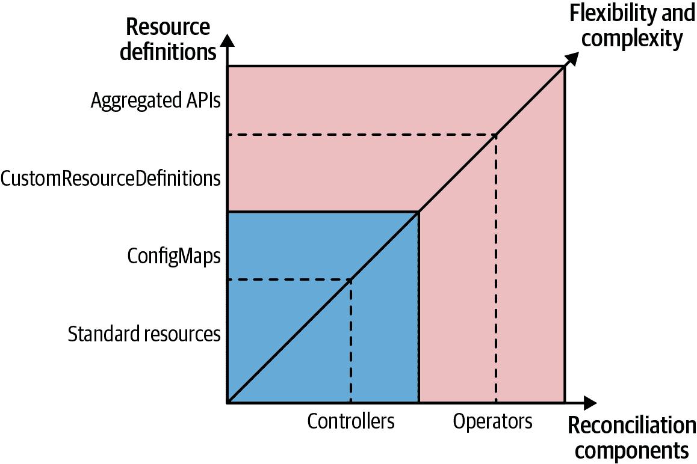

# 第二十八章：操作者

操作者是一个控制器，使用 CRD 将特定应用程序的操作知识封装为算法化和自动化形式。*操作者* 模式允许我们扩展前一章中的 *控制器* 模式，以提供更大的灵活性和表达能力。

# 问题

您在 Chapter 27, “Controller” 中学到了如何以简单和解耦的方式扩展 Kubernetes 平台。然而，对于扩展用例，普通的自定义控制器并不够强大，因为它们仅限于监视和管理 Kubernetes 内部资源。此外，有时我们希望向 Kubernetes 平台添加新概念，这需要额外的领域对象。例如，假设我们选择 Prometheus 作为监控解决方案，并希望以明确定义的方式将其添加为 Kubernetes 的监控设施。如果我们能够有一个 Prometheus 资源来描述我们的监控设置及所有部署细节，类似于我们定义其他 Kubernetes 资源的方式，那不是很棒吗？此外，我们是否可以有与我们需要监控的服务相关的资源（例如，具有标签选择器）？

这些情况恰恰是 CRD 资源非常有帮助的用例。它们通过将自定义资源添加到您的 Kubernetes 集群中，并像使用本地资源一样使用它们，扩展了 Kubernetes API。自定义资源与操作这些资源的控制器一起形成 *操作者* 模式。

这句[Jimmy Zelinskie 的引用](https://oreil.ly/bFEU-)可能最能描述操作者的特征：

> 操作者是一个 Kubernetes 控制器，它理解两个领域：Kubernetes 和其他领域。通过结合这两个领域的知识，它可以自动化通常需要理解这两个领域的人类操作者来执行的任务。

# 解决方案

正如您在 Chapter 27, “Controller” 中看到的那样，我们可以有效地对默认 Kubernetes 资源的状态变化做出反应。现在您了解了 *操作者* 模式的一半，让我们看看另一半——使用 CRD 资源在 Kubernetes 上表示自定义资源。

## 自定义资源定义（CRD）

通过 CRD，我们可以扩展 Kubernetes 来管理我们在 Kubernetes 平台上的领域概念。自定义资源像其他资源一样通过 Kubernetes API 进行管理，并最终存储在后端存储 etcd 中。

前述场景实际上是由 CoreOS Prometheus 操作者利用这些新的自定义资源实现的，以实现将 Prometheus 无缝集成到 Kubernetes 中。Prometheus CRD 在 Example 28-1 中定义，并且解释了 CRD 的大多数可用字段。

##### Example 28-1\. CustomResourceDefinition

```
apiVersion: apiextensions.k8s.io/v1
kind: CustomResourceDefinition
metadata:
  name: prometheuses.monitoring.coreos.com 
spec:
  group: monitoring.coreos.com             
  names:
    kind: Prometheus                       
    plural: prometheuses                   
  scope: Namespaced                        
  versions:                                
  - name: v1                               
    storage: true                          
    served: true                           
    schema:
      openAPIV3Schema: ....                
```


名称。


属于的 API 组。


Kind 用于标识此资源的实例。


创建复数形式的命名规则，用于指定这些对象的列表。


范围 —— 资源是可以在整个集群中创建还是仅限于命名空间。


此 CRD 可用的版本。


支持版本的名称。


必须有一个版本作为后端存储定义中使用的存储版本。


此版本是否通过 REST API 提供。


用于验证的 OpenAPI V3 模式（此处未显示）。

还可以指定一个 OpenAPI V3 模式，以允许 Kubernetes 验证自定义资源。对于简单的用例，可以省略此模式，但对于生产级别的 CRD，应提供此模式，以便早期检测配置错误。

此外，Kubernetes 允许我们通过 spec 字段的 `subresources` 指定 CRD 的两种可能子资源：^(1)

缩放

通过此属性，CRD 可以指定如何管理其副本数量。此字段可用于声明 JSON 路径，指定此自定义资源的期望副本数的路径：保存实际运行副本数量的属性路径，以及一个可选的标签选择器路径，该选择器可用于查找自定义资源实例的副本。通常情况下，此标签选择器是可选的，但如果要将此自定义资源与 第二十九章，“弹性扩展” 中解释的 HorizontalPodAutoscaler 一起使用，则是必需的。

状态

设置此属性后，将可以使用新的 API 调用仅更新资源的 `status` 字段。此 API 调用可以单独进行安全保护，并允许操作员反映资源的*实际*状态，这可能与 `spec` 字段中声明的状态不同。当整体更新自定义资源时，任何发送的 `status` 部分都将被忽略，这与标准 Kubernetes 资源的情况类似。

示例 28-2 展示了一个潜在的子资源路径，也用于常规 Pod。

##### 示例 28-2\. 用于 CustomResourceDefinition 的子资源定义

```
kind: CustomResourceDefinition
# ...
spec:
  subresources:
    status: {}
    scale:
      specReplicasPath: .spec.replicas         
      statusReplicasPath: .status.replicas     
      labelSelectorPath: .status.labelSelector 
```


JSON 路径到声明副本的数量。


JSON 路径到活动副本的数量。


JSON 路径到查询活动副本数量的标签选择器。

一旦定义了 CRD，我们可以轻松创建这样的资源，就像 示例 28-3 中所示。

##### 示例 28-3\. Prometheus 自定义资源

```
apiVersion: monitoring.coreos.com/v1
kind: Prometheus
metadata:
  name: prometheus
spec:
  serviceMonitorSelector:
    matchLabels:
      team: frontend
  resources:
    requests:
      memory: 400Mi
```

`metadata` 部分具有与任何其他 Kubernetes 资源相同的格式和验证规则。 `spec` 包含特定于 CRD 的内容，并且 Kubernetes 根据 CRD 中给定的验证规则进行验证。

单独的自定义资源没有太大的用处，除非有一个主动组件来对其进行操作。为了赋予它们意义，我们再次需要我们众所周知的控制器，它监视这些资源的生命周期，并根据资源中的声明采取行动。

## 控制器和操作员分类

在我们深入编写我们的操作员之前，让我们先看看控制器、操作员，尤其是 CRD 的几种分类。根据操作员的操作，广义上，这些分类如下：

安装 CRD

用于在 Kubernetes 平台上安装和操作应用程序。典型的例子是 Prometheus CRD，我们可以用它来安装和管理 Prometheus 本身。

应用程序 CRD

相比之下，这些用于表示特定于应用程序领域的概念。这种类型的 CRD 允许应用程序与 Kubernetes 进行深度集成，涉及将 Kubernetes 与应用程序特定的领域行为结合起来。例如，ServiceMonitor CRD 被 Prometheus 操作员用来注册特定的 Kubernetes 服务，以便 Prometheus 服务器进行抓取。Prometheus 操作员负责相应地调整 Prometheus 服务器的配置。

###### 注意

注意，在这种情况下，Prometheus 操作员可以作用于不同类型的 CRD。这两类 CRD 之间的边界不太明确。

在我们对控制器和操作员的分类中，操作员是使用 CRD 的一种控制器。^(2) 然而，即使这种区分也有些模糊，因为它们之间存在变化。

一个例子是一个控制器，它将 ConfigMap 用作 CRD 的一种替代。这种方法在默认的 Kubernetes 资源不足以满足需求，但创建 CRD 又不可行的场景中是有意义的。在这种情况下，ConfigMap 是一个很好的中间地带，允许在 ConfigMap 的内容中封装领域逻辑。使用普通 ConfigMap 的一个优点是，你无需像注册 CRD 那样拥有集群管理员权限。在某些集群设置中，你可能根本无法注册这样的 CRD（例如在像 OpenShift Online 这样的公共集群上运行时）。

然而，即使你用一个普通的 ConfigMap 替换 CRD，并将其用作你的特定领域配置时，你仍然可以使用“观察-分析-操作”的概念。缺点是，你不会像对于 CRD 那样得到诸如 `kubectl get` 这样的重要工具支持；你在 API 服务器级别上没有验证，也不支持 API 版本控制。此外，对于 ConfigMap 的 `status` 字段建模，你没有太多的影响力，而对于 CRD，你可以自由定义自己希望的状态模型。

CRD 的另一个优点是，您可以基于 CRD 的类型拥有精细的权限模型，可以单独调整，正如在第二十六章，“访问控制”中所解释的那样。当您的所有域配置封装在 ConfigMaps 中时，这种 RBAC 安全性是不可能的，因为一个命名空间中的所有 ConfigMaps 共享相同的权限设置。

从实现的角度来看，重要的是我们是将控制器实现为限制其使用到普通的 Kubernetes 对象，还是拥有控制器管理的自定义资源。在前一种情况下，我们已经在选择的 Kubernetes 客户端库中拥有了所有类型。对于 CRD 情况，我们不能直接获得类型信息，可以选择使用无模式的方法来管理 CRD 资源，或者根据 CRD 定义中包含的 OpenAPI 模式自定义定义自定义类型。支持有类型 CRD 的程度因客户端库和使用的框架而异。

图 28-1 展示了我们从更简单的资源定义选项开始分类的控制器和操作者，到更高级的边界，其中控制器和操作者之间的边界是使用自定义资源。



###### 图 28-1. 控制器和操作者的光谱

对于运算符来说，甚至有更高级的 Kubernetes 扩展钩子选项。当 Kubernetes 管理的 CRD 无法充分表示问题域时，您可以通过其自己的聚合层扩展 Kubernetes API。我们可以将自定义实现的`APIService`资源添加为 Kubernetes API 的新 URL 路径。

要连接由 Pod 支持的 Service 与`APIService`，您可以使用类似于示例 28-4 中显示的资源。

##### 示例 28-4. 使用自定义 APIService 进行 API 聚合

```
apiVersion: apiregistration.k8s.io/v1beta1
kind: APIService
metadata:
  name: v1alpha1.sample-api.k8spatterns.io
spec:
  group: sample-api.k8spattterns.io
  service:
    name: custom-api-server
  version: v1alpha1
```

除了服务和 Pod 的实现之外，我们还需要一些额外的安全配置来设置 Pod 运行的 ServiceAccount。

设置完成后，每个对 API 服务器`https://<api server ip>/apis/sample-api.k8spatterns.io/v1alpha1/namespaces/<ns>/...`的请求都将定向到我们自定义的服务实现。由此自定义服务实现处理这些请求，包括持久化通过此 API 管理的资源。这种方法与前面的 CRD 情况不同，其中 Kubernetes 本身完全管理自定义资源。

通过自定义 API 服务器，您可以获得更多的自由度，这使您能够超越观察资源生命周期事件。另一方面，您还必须实现更多的逻辑，因此对于典型的用例来说，处理普通 CRD 的操作者通常已经足够好。

API 服务器功能的详细探索超出了本章的范围。[官方文档](https://oreil.ly/eCcU9)以及完整的[sample-apiserver](https://oreil.ly/qPCX7)有更详细的信息。此外，您可以使用[apiserver-builder](https://oreil.ly/G_qud)库，它有助于实现 API 服务器聚合。

现在，让我们看看如何使用 CRDs 开发和部署操作员。

## 操作员开发和部署

有几个工具包和框架可用于开发操作员。在创建操作员方面，三个主要项目如下：

+   Kubebuilder 由 Kubernetes 自身的 SIG API Machinery 开发

+   操作员框架，一个 CNCF 项目

+   来自 Google Cloud Platform 的 Metacontroller

我们简要介绍每个子组件，为您开发和维护自己的操作员提供一个良好的起点。

### Kubebuilder

*Kubebuilder*，由 SIG API Machinery 的一个项目，^(4) 是通过 CustomResourceDefinitions 创建 Kubernetes API 的框架和库。

它配备了出色的[文档](https://oreil.ly/cmYBo)，还涵盖了编程 Kubernetes 的一般方面。Kubebuilder 的重点是通过在 Kubernetes API 顶部添加更高级别的抽象来创建基于 Golang 的操作员，以消除部分开销。它还提供新项目的脚手架支持，并支持单个操作员可以监视的多个 CRD。其他项目可以将 Kubebuilder 作为库消费，它还提供了插件架构以扩展对 Golang 以外的语言和平台的支持。对于针对 Kubernetes API 的编程，Kubebuilder 是一个很好的起点。

### 操作员框架

操作员框架为开发操作员提供了广泛支持。它提供了几个子组件：

+   *操作员 SDK*提供了访问 Kubernetes 集群的高级 API 和启动操作员项目的脚手架。

+   *操作员生命周期管理器*管理操作员及其 CRD 的发布和更新。您可以将其视为一种“操作员操作员”。

+   *操作员中心*是一个公开可用的操作员目录，专门用于分享社区构建的操作员。

###### 注意

在 2019 年的第一版书籍中，我们提到 Kubebuilder 和 Operator-SDK 的高度特性重叠，并推测这两个项目最终可能会合并。事实证明，社区选择了一种不同的策略：所有重叠部分已移至 Kubebuilder，而 Operator-SDK 现在将 Kubebuilder 作为依赖项使用。这一举措是社区驱动的开源项目的力量和自我修复效果的良好例子。关于 Kubebuilder 和 Operator-SDK 之间关系的文章提供了更多信息，可参阅 [文章](https://oreil.ly/0GM5e) “Kubebuilder 和 Operator-SDK 之间的区别是什么？”。Operator-SDK 提供了开发和维护 Kubernetes 运算符所需的一切。它建立在 Kubebuilder 之上，直接使用 Kubebuilder 进行 Golang 编写的运算符的脚手架和管理。此外，它还利用 Kubebuilder 的插件系统，用于基于其他技术创建运算符。截至 2023 年，Operator-SDK 还提供用于基于 Ansible Playbook 或 Helm Charts 以及使用 Quarkus 运行时的 Java 运算符的插件。在脚手架项目时，SDK 还添加了与 Operator Lifecycle Manager 和 Operator Hub 集成的适当钩子。

运算符生命周期管理器（OLM）在使用运算符时提供了宝贵的帮助。CRD 的一个问题是，这些资源只能在整个集群范围内注册，并且需要集群管理员权限。虽然普通的 Kubernetes 用户通常可以管理他们被授予访问权限的所有命名空间的所有方面，但他们不能仅仅通过与集群管理员的交互来使用运算符。

为了简化这种交互，OLM 是在后台以服务账号运行的集群服务，具有安装 CRD 权限。专用的 CRD 名为 ClusterServiceVersion（CSV）与 OLM 注册，并允许我们指定部署运算符及其关联的 CRD 定义。一旦创建了这样的 CSV，OLM 的一部分就会等待该 CRD 及其所有依赖的 CRD 注册完毕。如果情况属实，OLM 将部署 CSV 中指定的运算符。然后，OLM 的另一部分可用于代表非特权用户注册这些 CRD。这种方法是允许普通集群用户安装其运算符的一种优雅方式。

运算符可以轻松发布到 [Operator Hub](https://oreil.ly/K2t68)。Operator Hub 可以方便地发现和安装运算符。从运算符的 CSV 中提取的类似元数据的名称、图标、描述等内容，将在友好的 Web UI 中呈现。Operator Hub 还引入了 *channels* 的概念，允许您提供不同的流（如“稳定版”或“Alpha 版”），用户可以订阅以获取各种成熟度级别的自动更新。

### Metacontroller

Metacontroller 与其他两个操作器构建框架非常不同，因为它通过扩展 Kubernetes 的 API 来封装编写自定义控制器的常见部分。它的工作方式类似于 Kubernetes 控制器管理器，通过运行多个控制器来动态定义，而非硬编码，这些控制器是通过 Metacontroller 特定的 CRD 进行定义的。换句话说，它是一个委托控制器，调用服务提供实际控制器逻辑。

另一种描述 Metacontroller 的方式是作为声明性行为。虽然 CRD 允许我们在 Kubernetes API 中存储新类型，但 Metacontroller 使得定义标准或自定义资源的行为变得容易。

当我们通过 Metacontroller 定义控制器时，我们必须提供一个仅包含特定于我们控制器的业务逻辑的函数。Metacontroller 处理与 Kubernetes API 的所有交互，代表我们运行协调循环，并通过 Webhook 调用我们的函数。Webhook 会以定义良好的负载调用，描述 CRD 事件。当函数返回值时，我们返回应创建（或删除）的 Kubernetes 资源的定义，代表我们的控制器函数。

这种委托允许我们在任何能理解 HTTP 和 JSON 的语言中编写函数，而且不依赖于 Kubernetes API 或其客户端库。这些函数可以托管在 Kubernetes 上，也可以托管在 Functions-as-a-Service 提供程序上，或者其他地方。

在这里我们无法详细展开，但如果您的使用情况涉及通过简单的自动化或编排扩展和定制 Kubernetes，并且不需要任何额外的功能，则应该看看 Metacontroller，特别是当您希望使用 Go 以外的语言实现业务逻辑时。一些控制器示例将演示如何仅使用 Metacontroller 实现 StatefulSet、Blue-Green 部署、Indexed Job 和 Service per Pod。

## 示例

让我们看一个具体的操作器示例。我们在 Chapter 27, “Controller” 中扩展我们的示例，并引入了一种名为 ConfigWatcher 的 CRD 类型。此 CRD 的实例然后指定要监视的 ConfigMap 的引用，并指定如果此 ConfigMap 更改时应重启哪些 Pod。通过这种方法，我们消除了 ConfigMap 对 Pod 的依赖，因为我们不必修改 ConfigMap 本身以添加触发注解。此外，在控制器示例中，我们的简单基于注解的方法也可以将单个 ConfigMap 连接到单个应用程序。使用 CRD，可以实现 ConfigMap 和 Pod 的任意组合。

Example 28-5 中展示了 ConfigWatcher 自定义资源。

##### Example 28-5\. 简单的 ConfigWatcher 资源

```
apiVersion: k8spatterns.io/v1
kind: ConfigWatcher
metadata:
  name: webapp-config-watcher
spec:
  configMap: webapp-config 
  podSelector:             
    app: webapp
```


参考要监视的 ConfigMap。


使用标签选择器确定要重启的 Pod。

在这个定义中，属性`configMap`引用要监视的`ConfigMap`的名称。字段`podSelector`是一组标签及其值，用于识别要重启的 Pod。

我们使用 CRD 定义这个自定义资源的类型（显示在 Example 28-6 中）。

##### Example 28-6\. ConfigWatcher CRD

```
apiVersion: apiextensions.k8s.io/v1
kind: CustomResourceDefinition
metadata:
  name: configwatchers.k8spatterns.io
spec:
  scope: Namespaced          
  group: k8spatterns.io      
  names:
    kind: ConfigWatcher      
    singular: configwatcher  
    plural: configwatchers
  versions:
  - name: v1                 
    storage: true
    served: true
    schema:
      openAPIV3Schema:       
        type: object
        properties:
          configMap:
            type: string
            description: "Name of the ConfigMap"
          podSelector:
            type: object
            description: "Label selector for Pods"
            additionalProperties:
              type: string
```


连接到一个命名空间。


专用 API 组。


此 CRD 的唯一类型。


资源的标签如在`kubectl`等工具中使用。


初始版本。


这个 CRD 的 OpenAPI V3 模式规范。

为了使我们的操作员能够管理此类型的自定义资源，我们需要将一个带有适当权限的 ServiceAccount 附加到操作员的 Deployment 上。为此任务，我们引入了一个专用角色，稍后在 RoleBinding 中使用它将其附加到 ServiceAccount 中的 Example 28-7 中。我们在 Chapter 26, “Access Control”中更详细地解释了 ServiceAccounts、Roles 和 RoleBindings 的概念和用法。现在，只需知道 Example 28-6 中的角色定义授予对任何 ConfigWatcher 资源实例的所有 API 操作权限即可。

##### Example 28-7\. 角色定义允许访问自定义资源

```
apiVersion: rbac.authorization.k8s.io/v1
kind: Role
metadata:
  name: config-watcher-crd
rules:
- apiGroups:
  - k8spatterns.io
  resources:
  - configwatchers
  - configwatchers/finalizers
  verbs: [ get, list, create, update, delete, deletecollection, watch ]
```

有了这些 CRD，我们现在可以像 Example 28-5 中那样定义自定义资源。

要理解这些资源，我们必须实现一个控制器，评估这些资源并在 ConfigMap 更改时触发 Pod 重启。

我们在这里扩展了 Example 27-2 中的控制器脚本，并调整了控制器脚本中的事件循环。

在 ConfigMap 更新的情况下，我们不再检查特定注解，而是查询所有 ConfigWatcher 类型的资源，并检查修改后的 ConfigMap 是否包含作为`configMap`值的资源。Example 28-8 展示了协调循环。有关完整示例，请参阅我们的 Git 仓库，其中还包括安装此操作员的详细说明。

##### Example 28-8\. WatchConfig 控制器协调循环

```
curl -Ns $base/api/v1/${ns}/configmaps?watch=true | \     
while read -r event
do
  type=$(echo "$event" | jq -r '.type')
  if [ $type = "MODIFIED" ]; then                         

    watch_url="$base/apis/k8spatterns.io/v1/${ns}/configwatchers"
    config_map=$(echo "$event" | jq -r '.object.metadata.name')

    watcher_list=$(curl -s $watch_url | jq -r '.items[]') 

    watchers=$(echo $watcher_list | \                     
               jq -r "select(.spec.configMap == \"$config_map\") | .metadata.name")

    for watcher in watchers; do                           
      label_selector=$(extract_label_selector $watcher)
      delete_pods_with_selector "$label_selector"
    done
  fi
done
```


启动一个观察流以监视给定命名空间的 ConfigMap 更改。


仅检查`MODIFIED`事件。


获取所有安装的 ConfigWatcher 自定义资源的列表。


从列表中提取所有引用此 ConfigMap 的 ConfigWatcher 元素。


对于每个找到的 ConfigWatcher，通过选择器删除配置的 Pod。这里为了清晰起见省略了计算标签选择器和删除 Pod 的逻辑。请参考我们的 Git 仓库中的示例代码进行完整实现。

至于控制器示例，这个控制器可以通过我们示例 Git 仓库提供的样例 Web 应用程序进行测试。与此 Deployment 的唯一区别是，我们使用未注释的 ConfigMap 作为应用程序配置。

尽管我们的运算符功能相当完善，但很明显，我们基于 shell 脚本的运算符仍然相当简单，不涵盖边缘或错误情况。你可以在实际应用中找到更多有趣的生产级示例。

在 [Operator Hub](https://oreil.ly/K2t68) 找到真实运算符的标准位置。这个目录中的运算符都基于本章涵盖的概念。我们已经看到 Prometheus 运算符如何管理 Prometheus 的安装。另一个基于 Golang 的运算符是 etcd 运算符，用于管理 etcd 键值存储并自动化操作任务，如数据库的备份和恢复。

如果你正在寻找用 Java 编程语言编写的运算符，[*Strimzi Operator*](https://oreil.ly/S1olv) 是一个管理像 Apache Kafka 这样复杂消息系统的运算符的绝佳示例。另一个用于 Java 的运算符的好起点是 Operator-SDK 的 *Java Operator Plugin*。截至 2023 年，它仍然是一个年轻的倡议；了解如何创建基于 Java 的运算符的最佳入口是解释创建完全可工作运算符的 [教程](https://oreil.ly/pEPen)。

# 讨论

虽然我们已经学习了如何扩展 Kubernetes 平台，但运算符并不是万能的解决方案。在使用运算符之前，你应该仔细查看你的使用情况，确定它是否适合 Kubernetes 的范式。

在许多情况下，一个使用标准资源工作的普通控制器就足够了。这种方法的优势在于注册 CRD 不需要任何集群管理员权限，但在安全性和验证方面存在一些限制。

运算符非常适合建模与声明式 Kubernetes 资源处理方式紧密配合的自定义领域逻辑，具有响应式控制器。

具体来说，考虑在你的应用程序域中使用带有 CRDs 的运算符的任何以下情况：

+   你希望与已经存在的 Kubernetes 工具集成紧密，例如 `kubectl`。

+   你正在进行一个全新项目，可以从头开始设计应用程序。

+   你受益于 Kubernetes 概念，如资源路径、API 组、API 版本控制，特别是命名空间。

+   你希望为访问 API 提供良好的客户端支持，包括监视、身份验证、基于角色的授权以及元数据的选择器。

如果您的自定义用例符合这些标准，但需要更灵活地实现和持久化自定义资源，考虑使用自定义 API 服务器。但是，您也不应将 Kubernetes 扩展点视为解决所有问题的灵丹妙药。

如果您的用例不是声明式的，如果要管理的数据不适合 Kubernetes 资源模型，或者您不需要与平台紧密集成，可能更适合编写独立的 API 并使用经典的 Service 或 Ingress 对象进行公开。

[Kubernetes 文档](https://oreil.ly/WdqWi)本身还有一个章节，建议何时使用控制器、运算符、API 聚合或自定义 API 实现。

# 更多信息

+   [运算符示例](https://oreil.ly/iN2B4)

+   [OpenAPI V3](https://oreil.ly/aIGNA)

+   [Kubebuilder](https://oreil.ly/GeHKy)

+   [Operator Framework](https://oreil.ly/5JWcN)

+   [Metacontroller](https://oreil.ly/etanj)

+   [客户端库](https://oreil.ly/1iiab)

+   [使用 CustomResourceDefinitions 扩展 Kubernetes API](https://oreil.ly/8ungP)

+   [自定义资源](https://oreil.ly/0xhlw)

+   [Sample-Controller](https://oreil.ly/kyIsL)

+   [什么是 Red Hat OpenShift 运算符？](https://oreil.ly/voY92)

^(1) Kubernetes 子资源是提供资源类型内进一步功能的额外 API 端点。

^(2) [是-一个](https://oreil.ly/hZykR)强调运算符和控制器之间的继承关系，即运算符具有控制器的所有特性加上更多一点。

^(3) 但是，在设计您的 CRD 时，您应该注意常见的[API 约定](https://oreil.ly/klv65)，特别是 `status` 和其他字段。遵循常见的社区约定可以使人们和工具更容易读取您的新 API 对象。

^(4) 特别兴趣小组（SIGs）是 Kubernetes 社区组织特性领域的方式。您可以在 [Kubernetes 社区网站](https://oreil.ly/q6qd9)找到当前 SIGs 的列表。
