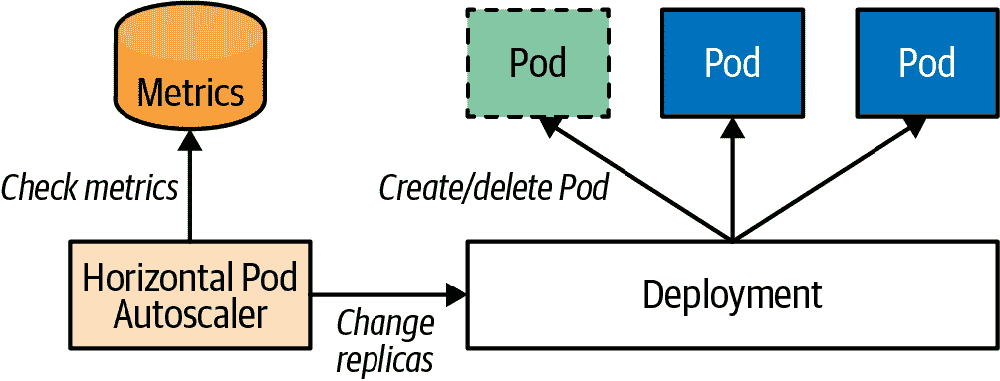
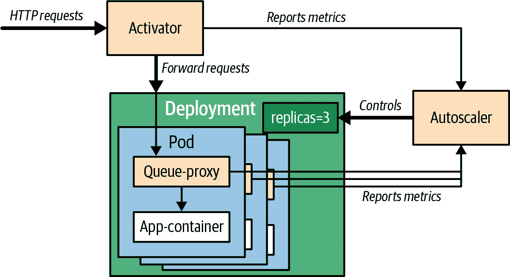
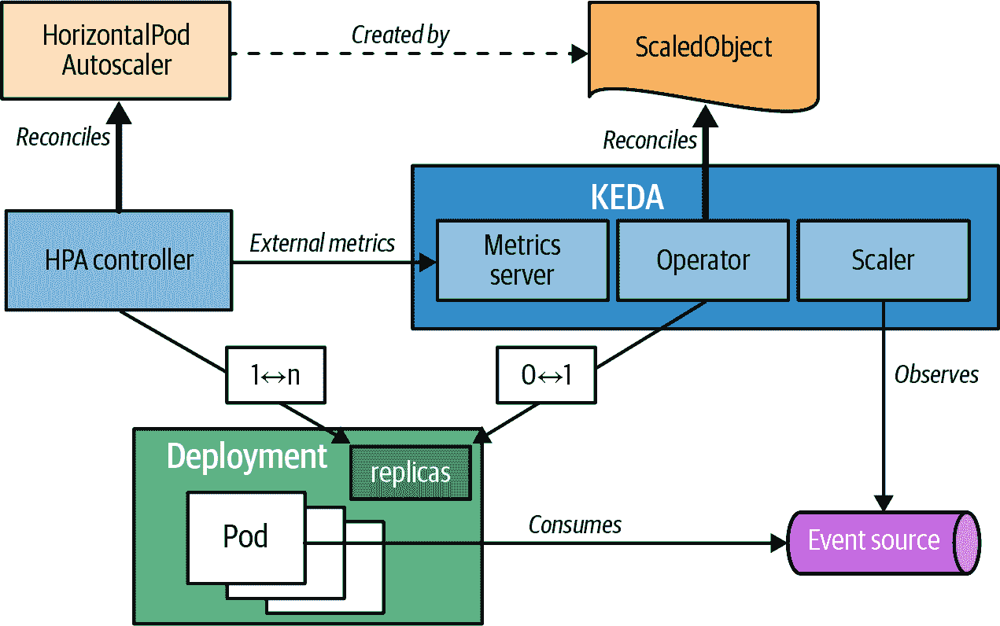
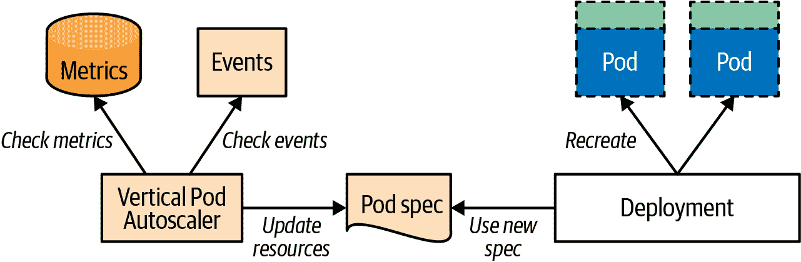
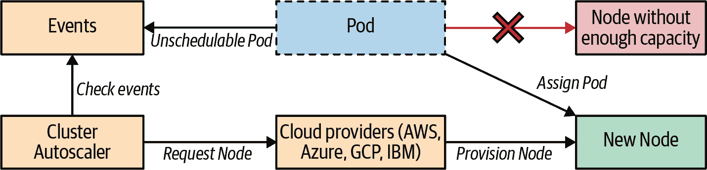
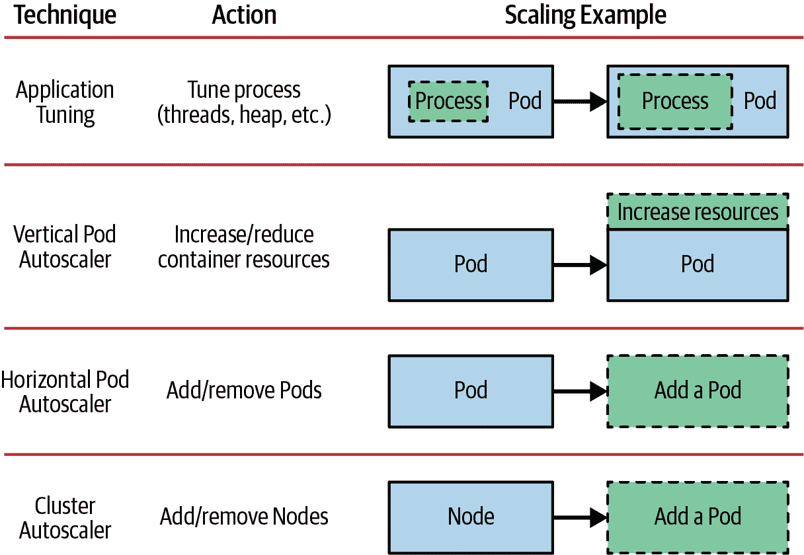

# 第二十九章：弹性伸缩

*弹性伸缩*模式涵盖了多维度的应用扩展：通过调整 Pod 副本数量进行水平扩展，通过调整 Pod 的资源需求进行垂直扩展，以及通过改变集群节点数量来扩展集群本身。虽然所有这些操作都可以手动执行，但在本章中，我们将探讨 Kubernetes 如何根据负载自动执行扩展。

# 问题

Kubernetes 自动化地编排和管理由大量不可变容器组成的分布式应用，通过维护其声明式表达的期望状态。然而，由于许多工作负载的季节性变化，通常随时间变化，确定期望状态应如何看起来并不容易。准确地确定一个容器需要多少资源以及一个服务在某个特定时间需要多少副本来满足服务级别协议，需要时间和精力。幸运的是，Kubernetes 可以轻松地修改容器的资源、服务的期望副本，或者集群中节点的数量。这些变化可以手动进行，或者根据特定规则，在完全自动化的方式下执行。

Kubernetes 不仅可以保持固定的 Pod 和集群设置，还可以监视外部负载和与容量相关的事件，分析当前状态，并根据期望性能自动扩展。这种观察是 Kubernetes 根据实际使用度量而非预期因素来适应和获取反脆弱特性的一种方式。让我们探索可以实现这种行为的不同方式，以及如何结合各种扩展方法以获得更好的体验。

# 解决方案

扩展任何应用有两种主要方法：水平和垂直。在 Kubernetes 中，*水平*扩展意味着创建更多 Pod 的副本。*垂直*扩展则意味着向由 Pod 管理的运行容器提供更多资源。尽管在纸面上看起来很简单，但在共享云平台上创建一个适合自动扩展的应用配置，同时不影响其他服务和集群本身，需要进行大量的试验和错误。作为一直以来的做法，Kubernetes 提供了各种功能和技术来找到我们应用的最佳设置，我们在这里简要探讨一下。

## 手动水平扩展

手动扩展方法，顾名思义，基于操作人员向 Kubernetes 发出命令。在缺少自动扩展或用于逐步发现和调整应用程序在长时间内与慢变化负载匹配的最佳配置时，可以使用这种方法。手动方法的一个优势是它还允许预见性而不仅仅是反应性的变化：了解季节性和预期的应用负载，您可以提前扩展它，而不是通过自动扩展来对已经增加的负载做出反应。我们可以以两种方式进行手动扩展。

### 命令式扩展

控制器如 ReplicaSet 负责确保始终运行特定数量的 Pod 实例。因此，扩展 Pod 就像简单地更改所需副本数量一样简单。假设存在名为`random-generator`的 Deployment，可以通过一条命令将其扩展到四个实例，如示例 29-1 所示。

##### 示例 29-1\. 在命令行上扩展 Deployment 的副本

```
kubectl scale random-generator --replicas=4
```

在这种改变后，ReplicaSet 可能会创建额外的 Pod 以进行扩展，或者如果 Pod 多于期望值，则删除它们以进行缩减。

### 声明性扩展

虽然使用 scale 命令非常简单，适用于对紧急情况做出快速反应，但它不会在集群外保留此配置。通常，所有 Kubernetes 应用程序的资源定义都将存储在包含副本数的源控制系统中。从其原始定义重新创建 ReplicaSet 将使副本数更改为其先前的数目。为了避免这种配置漂移并引入用于反向传播更改的操作流程，最好是在 ReplicaSet 或其他定义中以声明性方式更改所需的副本数，并将更改应用于 Kubernetes，如示例 29-2 所示。

##### 示例 29-2\. 使用 Deployment 来声明性地设置副本数量

```
kubectl apply -f random-generator-deployment.yaml
```

我们可以扩展管理多个 Pod 的资源，如 ReplicaSets、Deployments 和 StatefulSets。请注意在扩展带有持久存储的 StatefulSet 时的非对称行为。正如第十二章，“有状态服务”中描述的那样，如果 StatefulSet 具有`.spec.volumeClaimTemplates`元素，它将在扩展时创建 PVC，但在缩减时不会删除它们，以保护存储免受删除。

另一个可以扩展但遵循不同命名约定的 Kubernetes 资源是 Job 资源，我们在第七章，“批处理作业”中描述过。通过更改`.spec.parallelism`字段而不是`.spec.replicas`，可以扩展作业以同时执行多个相同 Pod 的实例。然而，语义效果是相同的：增加处理单元，这些单元作为单个逻辑单元。

###### 注意

用于描述资源字段的是 JSON 路径表示法。例如，`.spec.replicas` 指向资源的 `spec` 部分的 `replicas` 字段。

无论是命令式还是声明式的手动缩放样式，都期望人类观察或预期应用程序负载的变化，做出扩展决策，并将其应用到集群中。它们具有相同的效果，但不适合经常变化且需要持续适应的动态工作负载模式。接下来，让我们看看如何自动化缩放决策本身。

## 水平 Pod 自动缩放

许多工作负载具有动态的特性，随时间变化，这使得固定的扩展配置变得困难。但是，像 Kubernetes 这样的云原生技术使您能够创建适应不断变化负载的应用程序。Kubernetes 中的自动缩放允许我们定义一个不固定但确保足够处理不同负载的应用程序容量。实现这种行为的最简单方法是使用 HorizontalPodAutoscaler（HPA）来水平扩展 Pod 的数量。HPA 是 Kubernetes 的一个固有部分，不需要任何额外的安装步骤。HPA 的一个重要限制是它不能将 Pod 缩减到零，以确保不使用已部署工作负载时不会消耗任何资源。幸运的是，Kubernetes 的附加组件提供了零缩放功能，并将 Kubernetes 转变为真正的无服务器平台。Knative 和 KEDA 是此类 Kubernetes 扩展中最显著的两个。我们将在“Knative”和“KEDA”中详细讨论它们，但首先让我们看看 Kubernetes 如何提供即插即用的水平自动缩放功能。

### Kubernetes HorizontalPodAutoscaler

通过示例来最好地解释 HPA。可以使用 示例 29-3 中的命令为 `random-generator` 部署创建 HPA。为了使 HPA 生效，重要的是 Deployment 声明 `.spec.resources.requests` 作为 CPU 的限制，如 第二章，“可预测的需求” 中所述。另一个要求是启用指标服务器，这是资源使用数据的集群级聚合器。

##### 示例 29-3\. 在命令行上创建 HPA 定义

```
kubectl autoscale deployment random-generator --cpu-percent=50 --min=1 --max=5
```

上述命令将创建如示例 29-4 所示的 HPA 定义。

##### 示例 29-4\. HPA 定义

```
apiVersion: autoscaling/v2
kind: HorizontalPodAutoscaler
metadata:
  name: random-generator
spec:
  minReplicas: 1               
  maxReplicas: 5               
  scaleTargetRef:              
    apiVersion: apps/v1
    kind: Deployment
    name: random-generator
  metrics:
  - resource:
      name: cpu
      target:
        averageUtilization: 50 
        type: Utilization
    type: Resource
```


应始终运行的最小 Pod 数量。


HPA 可以扩展的最大 Pod 数量。


用于关联此 HPA 的对象引用。


期望的 CPU 使用率作为 Pod 请求的 CPU 资源的百分比。例如，当 Pod 的 `.spec.resources.requests.cpu` 为 200m 时，如果平均使用了超过 100m 的 CPU（= 50%），则会发生扩展。

这个定义指示 HPA 控制器保持一个到五个 Pod 实例，以保持 Pod CPU 使用率在 Pod 的 `.spec.resources.requests` 声明中指定的 CPU 资源限制的大约 50%。虽然可以将这样的 HPA 应用于支持 `scale` 子资源的任何资源，如 Deployments、ReplicaSets 和 StatefulSets，但必须考虑副作用。在更新期间，Deployments 会创建新的 ReplicaSets，但不会复制任何 HPA 定义。如果将 HPA 应用于由 Deployment 管理的 ReplicaSet，它不会复制到新的 ReplicaSet 中，并且将会丢失。更好的技术是将 HPA 应用于更高级别的 Deployment 抽象，这样可以将 HPA 保留和应用于新的 ReplicaSet 版本。

现在，让我们看看 HPA 如何取代人工操作员以确保自动缩放。在高层次上，HPA 控制器连续执行以下步骤：

1.  它从 Kubernetes Metrics API 检索关于需要根据 HPA 定义进行缩放的 Pod 的指标。指标不是直接从 Pod 中读取的，而是从服务聚合的 Metrics API（甚至是自定义和外部指标，如果配置为这样做）中获取的。从 Metrics API 获取 Pod 级别的资源指标，并从 Kubernetes 的 Custom Metrics API 中获取所有其他指标。

1.  它根据当前指标值和目标指标值计算所需的副本数。以下是公式的简化版本：

<math alttext="d e s i r e d upper R e p l i c a s equals left ceiling c u r r e n t upper R e p l i c a s times StartFraction c u r r e n t upper M e t r i c upper V a l u e Over d e s i r e d upper M e t r i c upper V a l u e EndFraction right ceiling" display="block"><mrow><mi>d</mi> <mi>e</mi> <mi>s</mi> <mi>i</mi> <mi>r</mi> <mi>e</mi> <mi>d</mi> <mi>R</mi> <mi>e</mi> <mi>p</mi> <mi>l</mi> <mi>i</mi> <mi>c</mi> <mi>a</mi> <mi>s</mi> <mo>=</mo> <mo>⌈</mo> <mi>c</mi> <mi>u</mi> <mi>r</mi> <mi>r</mi> <mi>e</mi> <mi>n</mi> <mi>t</mi> <mi>R</mi> <mi>e</mi> <mi>p</mi> <mi>l</mi> <mi>i</mi> <mi>c</mi> <mi>a</mi> <mi>s</mi> <mo>×</mo> <mfrac><mrow><mi>c</mi><mi>u</mi><mi>r</mi><mi>r</mi><mi>e</mi><mi>n</mi><mi>t</mi><mi>M</mi><mi>e</mi><mi>t</mi><mi>r</mi><mi>i</mi><mi>c</mi><mi>V</mi><mi>a</mi><mi>l</mi><mi>u</mi><mi>e</mi></mrow> <mrow><mi>d</mi><mi>e</mi><mi>s</mi><mi>i</mi><mi>r</mi><mi>e</mi><mi>d</mi><mi>M</mi><mi>e</mi><mi>t</mi><mi>r</mi><mi>i</mi><mi>c</mi><mi>V</mi><mi>a</mi><mi>l</mi><mi>u</mi><mi>e</mi></mrow></mfrac> <mo>⌉</mo></mrow></math>

例如，如果有一个单独的 Pod，其当前 CPU 使用率指标值为指定的 CPU 资源请求值的 90%^(1)，并且期望值为 50%，则副本的数量将加倍，如 <math alttext="left ceiling 1 times StartFraction 90 Over 50 EndFraction right ceiling equals 2"><mrow><mo>⌈</mo> <mn>1</mn> <mo>×</mo> <mfrac><mn>90</mn> <mn>50</mn></mfrac> <mo>⌉</mo> <mo>=</mo> <mn>2</mn></mrow></math> 。实际的实现更为复杂，因为它必须考虑多个运行中的 Pod 实例，涵盖多种指标类型，并考虑许多边界情况和波动值。例如，如果指定了多个指标，则 HPA 将分别评估每个指标，并提出最大值。在所有计算完成后，最终输出是一个表示期望的副本数量的单个整数，以保持测量值低于期望阈值值。

自动缩放资源的`replicas`字段将根据计算出的数量进行更新，其他控制器将通过它们各自的工作部分来实现和保持新的期望状态。图 29-1 展示了 HPA 的工作方式：监视指标并相应地更改声明的副本数量。



###### 图 29-1\. 水平 Pod 自动缩放机制

自动缩放是 Kubernetes 的一个包含许多低级细节的领域，每个细节都可能对自动缩放的整体行为产生重大影响。因此，本书无法涵盖所有细节，但“更多信息”提供了该主题的最新更新信息。

广义上，有以下几种指标类型：

标准指标

这些指标被声明为`.spec.metrics.resource[].type`等于`Resource`，表示资源使用指标，如 CPU 和内存。它们是通用的，并且适用于同一名称下的任何集群上的任何容器。您可以像前面的示例中那样指定它们为百分比，也可以指定为绝对值。在两种情况下，值都基于保证的资源量，即容器资源的`requests`值而不是`limits`值。这些是由度量服务器组件提供的最易于使用的度量类型，可以作为集群附加组件启动。

自定义指标

这些具有`.spec.metrics.resource[].type`等于`Object`或`Pod`的指标需要更高级的集群监控设置，这些设置可能因集群而异。如其名称所示，带有 Pod 类型的自定义指标描述了特定于 Pod 的指标，而 Object 类型则可以描述任何其他对象。自定义指标在聚合的 API 服务器下提供，位于`custom.metrics.k8s.io`API 路径下，并由不同的指标适配器（如 Prometheus、Datadog、Microsoft Azure 或 Google Stackdriver 等）提供。

外部指标

此类别用于描述不属于 Kubernetes 集群的资源指标。例如，您可能有一个 Pod，它从基于云的队列服务中消费消息。在这种情况下，您会希望根据队列深度来扩展消费者 Pod 的数量。这样的指标将由类似于自定义指标的外部指标插件填充。只能将一个外部指标端点连接到 Kubernetes API 服务器。要使用来自多个不同外部系统的指标，需要额外的聚合层，例如 KEDA（参见“KEDA”）。

正确设置自动缩放并不容易，并且需要一些试验和调整。在设置 HPA 时需要考虑以下几个主要方面：

指标选择

自动缩放周围可能是最关键的决策之一是使用哪些指标。对于 HPA 来说，指标值与 Pod 副本数之间必须有直接的关联。例如，如果选择的指标是每秒查询量（例如每秒 HTTP 请求），增加 Pod 的数量会导致平均查询量下降，因为查询被分发到更多的 Pod。如果指标是 CPU 使用率，情况也是如此，因为查询率和 CPU 使用率之间存在直接的关联（增加查询数量会导致 CPU 使用率增加）。对于内存消耗等其他指标，情况则不同。内存的问题在于，如果一个服务消耗了一定量的内存，启动更多的 Pod 实例可能不会导致内存减少，除非应用程序是集群化的并且意识到其他实例并具有分配和释放内存的机制。如果内存没有释放并反映在指标中，HPA 将会试图创建越来越多的 Pod 以减少内存消耗，直到达到上限副本阈值，这可能不是期望的行为。因此，选择一个与 Pod 数量直接（最好是线性地）相关的指标。

防止抖动

HPA 应用各种技术来避免在负载不稳定时导致副本数量波动的冲突决策快速执行。例如，在扩展时，当 Pod 初始化时，HPA 忽略高 CPU 使用率样本，确保对增加负载的平滑反应。在缩减时，为了避免响应短期使用量下降而缩小规模，控制器在可配置的时间窗口内考虑所有规模建议，并选择窗口内的最高建议。所有这些使得 HPA 在处理随机指标波动时更加稳定。

延迟反应

基于指标值触发扩展操作是一个多步骤过程，涉及多个 Kubernetes 组件。首先是 cAdvisor（容器顾问）代理，定期收集 Kubelet 的指标。然后指标服务器定期收集来自 Kubelet 的指标。HPA 控制器循环也定期运行并分析收集到的指标。HPA 缩放公式引入了一些延迟反应，以防止波动/抖动（如前一点所述）。所有这些活动累积成为原因和缩放反应之间的延迟。通过引入更多的延迟来调整这些参数会使得 HPA 的响应性降低，但减少延迟会增加平台的负载并增加抖动。配置 Kubernetes 来平衡资源和性能是一个持续的学习过程。

在 Kubernetes 中调整 HPA 的自动缩放算法可能很复杂。为了帮助解决这个问题，Kubernetes 在 HPA 规范中提供了 `.spec.behavior` 字段。该字段允许您在扩展 Deployment 中的副本数量时自定义 HPA 的行为。

对于每个缩放方向（向上或向下），您可以使用 `.spec.behavior` 字段来指定以下参数：

`policies`

这些描述了在给定时间段内扩展副本的最大数量。

`stabilizationWindowSeconds`

这指定了 HPA 将不再做进一步缩放决策的条件。设置此字段可以帮助防止 HP 迅速在副本数量上下波动。

Example 29-5 显示了如何配置行为。所有行为参数也可以通过 `kubectl autoscale` 在 CLI 中配置。

##### Example 29-5\. 自动缩放算法的配置

```
apiVersion: autoscaling/v2
kind: HorizontalPodAutoscaler
...
spec:
  ...
  behavior:
    scaleDown:                        
      stabilizationWindowSeconds: 300 
      policies:
      - type: Percent                 
        value: 10
        periodSeconds: 60

    scaleUp:                          
      policies:
      - type: Pods                    
        value: 4
        periodSeconds: 15
```


在缩减时的缩放行为。


为防止波动，下缩放决策的最小窗口为 5 分钟。


在一分钟内最多减少当前副本的 10%。


在扩展时的缩放行为。


在 15 秒内最多扩展四个 Pod。

请参考 Kubernetes 文档中关于 [配置扩展行为](https://oreil.ly/gQAa9) 的所有详细信息和使用示例。

虽然 HPA 非常强大，并且涵盖了自动缩放的基本需求，但它缺少一个关键功能：即在应用程序不使用时将所有 Pod 缩减至零。这一点很重要，以免基于内存、CPU 或网络使用产生任何费用。然而，缩减到零并不难；困难的部分是再次唤醒并通过触发器（如传入的 HTTP 请求或要处理的事件）至少扩展到一个 Pod。

下面的两节介绍了用于启用零缩放的两个最显著的基于 Kubernetes 的附加组件：Knative 和 KEDA。了解 Knative 和 KEDA 不是替代方案，而是互补解决方案至关重要。这两个项目涵盖了不同的用例，可以理想地结合使用。正如我们将看到的那样，Knative 专门用于无状态 HTTP 应用程序，并提供超出 HPA 能力的自动缩放算法。另一方面，KEDA 是一种拉取式方法，可以由许多不同的源触发，例如 Kafka 主题中的消息或 IBM MQ 队列。

让我们仔细看看 Knative 和 KEDA。

### Knative

Knative 是谷歌在 2018 年发起的 CNCF 项目，得到了来自 IBM、VMware 和 Red Hat 等供应商的广泛行业支持。这个 Kubernetes 插件包括三个部分：

Knative Serving

这是一个简化的应用程序部署模型，具有复杂的自动缩放和流量分割功能，包括零缩放。

Knative 事件驱动

这提供了创建事件网格所需的一切，以连接产生 CloudEvents 的事件源与消费这些事件的接收器。这些接收器通常是 Knative Serving 服务。

Knative 函数

这是从源代码构建 Knative Serving 服务的脚手架和构建工具。它支持多种编程语言，并提供类似于 AWS Lambda 的编程模型。

在本节中，我们将专注于 Knative Serving 及其用于使用 HTTP 提供服务的应用程序的自动缩放器。对于这些工作负载，CPU 和内存是仅间接相关到实际使用的度量。一个更好的度量是每个 Pod 的并发请求数量，即并行处理的请求。

###### 注意

Knative 可以使用的另一个基于 HTTP 的度量是每秒请求数（rps）。但是，这个度量并不反映单个请求的成本，因此并发请求通常是更好的度量，因为它们捕捉请求的频率和持续时间。您可以为每个应用程序单独选择扩展度量或作为全局默认设置。

基于并发请求的自动缩放决策与 HTTP 请求处理的延迟有更好的相关性，而基于 CPU 或内存消耗的扩展则无法提供。

历史上，Knative 曾作为 Kubernetes 中 HPA 的自定义度量适配器实现。然而，为了在影响扩展算法时拥有更大的灵活性，并避免只能在 Kubernetes 集群中注册单个自定义度量适配器的瓶颈，后来它发展出自己的实现。

虽然 Knative 仍支持使用 HPA 根据内存或 CPU 使用情况进行扩展，但现在它专注于使用自己的自动缩放实现，称为 Knative Pod Autoscaler（KPA）。这使 Knative 能够更好地控制扩展算法，并优化以满足应用程序的需求。

KPA 的架构显示在图 29-2 中。



###### 图 29-2\. Knative Pod Autoscaler

三个组件一起用于自动缩放服务：

激活器

这是一个位于应用程序前端的代理，即使应用程序缩减到零个 Pod 时也始终可用。当应用程序缩减到零时，如果有第一个请求进入，请求将被缓冲，并且应用程序将至少扩展到一个 Pod。重要的是，在*冷启动*期间，所有传入请求都将被缓冲，以确保不丢失请求。

队列代理

队列代理是一个大使边车，在应用的 Pod 中由 Knative 控制器注入，其拦截请求路径以收集与自动缩放相关的度量，如并发请求。

自动缩放器

这是在后台运行的服务，负责根据从激活器和队列代理获取的数据做出缩放决策。自动缩放器设置应用程序 ReplicaSet 中的副本计数。

可以通过多种方式配置 KPA 算法，以优化任何工作负载和流量形状的自动缩放行为。表 29-1 展示了通过注释调整单个服务的 KPA 的一些配置选项。类似的配置选项也存在于全局默认配置中，这些配置存储在 ConfigMap 中。您可以在[Knative 文档](https://oreil.ly/m09BV)中找到所有自动扩展配置选项的完整集合。该文档详细介绍了 Knative 缩放算法，例如通过在并发请求增加超过阈值时更积极地扩展来处理突发工作负载。

表 29-1\. 重要的 Knative 扩展参数。`autoscaling.knative.dev/`，通用注释前缀，已被省略。

| 注释 | 描述 | 默认值 |
| --- | --- | --- |
| `target` | 每个副本可以处理的同时请求数量。这是一个软限制，在流量突发情况下可能会暂时超过。`.spec.concurrencyLimit`用作无法超过的硬限制。 | 100 |
| `target-utilization-percentage` | 如果已达到并发限制的此分数，则开始创建新的副本。 | 70 |
| `min-scale` | 要保留的最小副本数。如果设置为大于零的值，则应用程序永远不会缩减到零。 | 0 |
| `max-scale` | 副本数的上限；零表示无限扩展。 | 0 |
| `activation-scale` | 从零开始扩展时要创建的副本数。 | 1 |
| `scale-down-delay` | 在缩小之前必须保持的缩小条件的持续时间。有助于在缩小为零之前保持副本的热状态，以避免冷启动时间。 | 0s |
| `window` | 用于平均度量指标以提供缩放决策输入的时间窗口长度。 | 60s |

示例 29-6 展示了一个 Knative 服务，部署了一个示例应用程序。它看起来类似于 Kubernetes 的部署（Deployment）。然而，在幕后，Knative 操作员创建了必要的 Kubernetes 资源，以将您的应用程序公开为 Web 服务，即 ReplicaSet、Kubernetes 服务和用于将应用程序暴露到集群外部的 Ingress。

##### 示例 29-6\. Knative 服务

```
apiVersion: serving.knative.dev/v1         
kind: Service
metadata:
  name: random
  annotations:
    autoscaling.knative.dev/target: "80"   
    autoscaling.knative.dev/window: "120s"
spec:
  template:
    spec:
      containers:
      - image: k8spatterns/random          
```


Knative 还使用 Service 作为资源名称，但 API 组`core`的 Kubernetes 服务不同于 API 组`serving.knative.dev`。


调整自动扩展算法的选项。请参阅表 29-1 获取可用选项。


Knative 服务的唯一必需参数是对容器镜像的引用。

我们在这里仅简要提及 Knative。在操作 Knative 自动缩放器方面，还有很多内容可供您参考。请查看[在线文档](https://knative.dev)了解更多 Knative Serving 的功能，例如用于我们在第三章，“声明式部署”中描述的复杂部署方案的流量分割。此外，如果您正在遵循事件驱动架构（EDA）范例来开发应用程序，Knative Eventing 和 Knative Functions 也有很多提供。

### KEDA

Kubernetes 事件驱动自动缩放（KEDA）是另一个重要的基于 Kubernetes 的自动缩放平台，支持零缩放，但其范围与 Knative 有所不同。虽然 Knative 支持基于 HTTP 流量的自动缩放，但 KEDA 是一种基于拉取的方法，根据来自不同系统的外部指标进行缩放。Knative 和 KEDA 之间有很好的协作，只有少量重叠^(3)，因此您可以同时使用这两个附加组件。

那么，什么是 KEDA？KEDA 是一个 CNCF 项目，由 Microsoft 和 Red Hat 在 2019 年创建，包括以下组件：

+   KEDA 操作员调和了一个 ScaledObject 自定义资源，将缩放目标（例如 Deployment 或 StatefulSet）与一个通过所谓的*scaler*连接到外部系统的自动缩放触发器连接起来。它还负责配置 HPA，使用由 KEDA 提供的外部指标服务。

+   KEDA 的指标服务在 Kubernetes API 聚合层注册为 APIService 资源，以便 HPA 可以将其用作外部指标服务。

图 29-3 展示了 KEDA 操作员、指标服务和 Kubernetes HPA 之间的关系。



###### 图 29-3. KEDA 自动缩放组件

虽然 Knative 是一个完整的解决方案，完全替代了基于消耗的自动缩放器 HPA，但 KEDA 是一个混合解决方案。KEDA 的自动缩放算法区分两种情况：

+   从零副本到一个的缩放激活（*0 ↔ 1*）：当 KEDA 操作员检测到使用的缩放器指标超过某一阈值时，由 KEDA 操作员自身执行此操作。

+   在运行时进行扩展和收缩（*1 ↔ n*）：当工作负载已经活动时，HPA 接管并根据 KEDA 提供的外部指标进行缩放。

KEDA 的核心元素是 ScaledObject 自定义资源，由用户提供以配置基于 KEDA 的自动缩放，并起到类似 HorizontalPodAutoscaler 资源的作用。一旦 KEDA 操作员检测到 ScaledObject 的新实例，它将自动创建一个 HorizontalPodAutoscaler 资源，该资源使用 KEDA 指标服务作为外部指标提供程序和缩放参数。

Example 29-7 显示了如何基于 Apache Kafka 主题中的消息数量来扩展部署。

##### Example 29-7\. ScaledObject 定义

```
apiVersion: keda.sh/v1alpha1
kind: ScaledObject
metadata:
  name: kafka-scaledobject
spec:
  scaleTargetRef:
    name: kafka-consumer                           
  pollingInterval: 30                              
  triggers:
    - type: kafka                                  
      metadata:
        bootstrapServers: bootstrap.kafka.svc:9092 
        consumerGroup: my-group
        topic: my-topic
```


提到应该自动缩放的名为`kafka-consumer`的部署。您还可以在此处指定其他可扩展的工作负载；部署是默认选择。


在动作阶段（从零扩展），每 30 秒轮询度量值。在此示例中，它是 Kafka 主题中的消息数量。


选择 Apache Kafka 缩放器。


Apache Kafka 缩放器的配置选项——即如何连接到 Kafka 集群以及要监视的主题。

KEDA 提供许多开箱即用的缩放器，可以选择连接到外部系统以进行自动缩放刺激。您可以从[KEDA 主页](https://oreil.ly/rkJKU)获取完整的直接支持的缩放器列表。此外，您可以通过提供一个通过基于 gRPC 的 API 与 KEDA 通信的外部服务，轻松集成自定义缩放器。

当您需要根据外部系统中持有的工作项（如您的应用程序消费的消息队列）来进行扩展时，KEDA 是一个很好的自动缩放解决方案。在某种程度上，此模式与第七章，“批处理作业”的一些特性相似：工作负载仅在有工作时运行，在空闲时不消耗任何资源。两者都可以扩展以并行处理工作项。不同之处在于，KEDA ScaledObject 会自动进行扩展，而对于 Kubernetes 的`Job`，您必须手动确定并行参数。使用 KEDA，您还可以基于外部工作负载的可用性自动触发 Kubernetes Jobs。ScaledJob 自定义资源正是为此目的而设计，以便在满足扩展器激活阈值时启动 Job 资源，而不是将副本从 0 扩展到 1。请注意，Job 中的`parallelism`字段仍然是固定的，但是自动缩放发生在 Job 资源级别上（即 Job 资源本身起到副本的作用）。

Table 29-2 总结了 HPA、Knative 和 KEDA 之间的独特功能和差异。

表 29-2\. Kubernetes 上的水平自动缩放配置选项

|  | HPA | Knative | KEDA |
| --- | --- | --- | --- |
| 缩放指标 | 资源使用率 | HTTP 请求 | 外部度量，如消息队列积压 |
| 零缩放 | 否 | 是 | 是 |
| 类型 | 拉取 | 推送 | 拉取 |
| 典型用例 | 稳定流量 Web 应用程序，批处理 | 快速扩展的无服务器应用程序，无服务器函数 | 消息驱动的微服务 |

现在，我们已经看到了通过 HPA、Knative 和 KEDA 进行水平扩展的所有可能性，让我们看看一种完全不同的扩展方式，它不会改变并行运行副本的数量，而是允许您的应用程序自由增长和收缩。

## 垂直 Pod 自动缩放

与无状态服务相比，水平扩展优于垂直扩展，因为它更少会造成中断。对于有状态服务来说，情况并非如此，垂直扩展可能更可取。垂直扩展有助于根据实际负载模式调整服务的资源需求的其他场景。我们已经讨论过，在负载随时间变化时，确定 Pod 副本的正确数量可能是困难甚至不可能的。垂直扩展也面临着识别容器的正确 `requests` 和 `limits` 的挑战。Kubernetes 垂直 Pod 自动缩放器（VPA）旨在通过根据实际使用反馈自动调整和分配资源的过程来应对这些挑战。

正如我们在 第二章，“可预测的需求” 中看到的，Pod 中的每个容器都可以指定其 CPU 和内存的 `requests`，这影响 Pod 的调度位置。从某种意义上说，Pod 的资源 `requests` 和 `limits` 形成了 Pod 与调度器之间的合同，这会确保分配一定量的资源或防止 Pod 被调度。将内存的 `requests` 设置得太低可能导致节点过于密集，从而出现内存不足的错误或由于内存压力而导致工作负载被驱逐。如果 CPU 的 `limits` 设置过低，可能会发生 CPU 饥饿和工作负载性能不佳。另一方面，指定过高的资源 `requests` 会分配不必要的容量，导致资源浪费。准确设置资源 `requests` 非常重要，因为它们影响集群利用率和水平扩展的有效性。让我们看看 VPA 如何解决这个问题。

在安装了 VPA 和度量服务器的集群上，我们可以使用 VPA 定义来演示 Pods 的垂直自动缩放，如 示例 29-8。

##### 示例 29-8\. VPA

```
apiVersion: autoscaling.k8s.io/v1
kind: VerticalPodAutoscaler
metadata:
  name: random-generator-vpa
spec:
  targetRef:            
    apiVersion: apps/v1
    kind: Deployment
    name: random-generator
  updatePolicy:
    updateMode: "Off"   
```


引用到包含选择器以识别要管理的 Pods 的更高级别资源。


VPA 将如何应用更改的更新策略。

VPA 定义有以下主要部分：

目标参考

目标参考指向一个更高级别的资源，控制 Pods，例如 Deployment 或 StatefulSet。从这个资源中，VPA 查找标签选择器，以识别应该处理的 Pods。如果参考指向不包含这样的选择器的资源，则会在 VPA 状态部分报告错误。

更新策略

更新策略控制 VPA 如何应用更改。 `Initial` 模式允许您仅在 Pod 创建时分配资源请求，而不是以后。默认的 `Auto` 模式允许在 Pod 创建时为 Pod 分配资源，并且可以在 Pod 的生命周期内更新 Pod，通过逐出和重新调度 Pod。值 `Off` 禁用对 Pod 的自动更改，但允许您建议资源值。这是一种在不直接应用更改的情况下发现容器适当大小的试运行。

VPA 定义还可以具有资源策略，影响 VPA 如何计算推荐的资源（例如，通过设置每个容器的资源下限和上限边界）。

根据配置的 `.spec.updatePolicy.updateMode`，VPA 涉及不同的系统组件。所有三个 VPA 组件——推荐器、准入插件和更新器——都是解耦且独立的，并且可以替换为替代实现。生成推荐的模块是推荐器，受 Google 的 Borg 系统启发。该实现分析容器在负载下的实际资源使用情况，持续一段时间（默认为八天），生成直方图，并选择该期间的高百分位值。除了指标外，还考虑了资源和特别是内存相关的 Pod 事件，例如驱逐和 `OutOfMemory` 事件。

在我们的示例中，我们选择了 `.spec.updatePolicy.updateMode` 等于 `Off`，但还有两个其他选项可供选择，每个选项对扩展的 Pod 造成不同程度的潜在中断。让我们看看不同的 `updateMode` 值如何工作，从不造成中断到更具破坏性的顺序：

关闭

VPA 推荐器收集 Pod 的指标和事件，然后生成推荐。 VPA 的推荐始终存储在 VPA 资源的 `status` 部分。然而，这就是 `Off` 模式的功能范围。它分析并生成推荐，但不将其应用于 Pod。这种模式有助于了解 Pod 资源消耗情况，而不引入任何变化和造成中断。如果需要，用户可以自行决定是否应用推荐。

初始

在此模式下，VPA 进一步进行。除了推荐器组件执行的活动外，还激活了 VPA 准入控制器，仅将推荐应用于新创建的 Pod。例如，如果手动扩展 Pod，由 Deployment 更新或由于任何原因驱逐并重新启动 Pod，则 VPA 准入控制器将更新 Pod 的资源请求值。

这个控制器是一个*变异接受 Webhook*，它会覆盖与 VPA 资源相关联的新匹配 Pod 的`requests`。这种模式不会重新启动运行中的 Pod，但它仍然部分干扰，因为它改变了新创建 Pod 的资源请求。这反过来可能会影响新 Pod 的调度位置。更糟糕的是，如果集群上没有足够的容量，应用推荐的资源请求后，Pod 可能根本无法被调度到任何节点。

重新创建和自动

除了之前描述的推荐创建及其在新创建的 Pod 上的应用之外，在这种模式下，VPA 还会激活其更新的组件。`Recreate`更新模式强制驱逐并重新启动部署中的所有 Pod 以应用 VPA 的建议，而`Auto`更新模式据说在未来的 Kubernetes 版本中将支持资源限制的就地更新而无需重新启动 Pod。截至 2023 年，`Auto`的行为与`Recreate`相同，因此这两种更新模式可能会带来干扰，并可能导致之前描述的意外调度问题。

Kubernetes 旨在管理具有不可变 Pod `spec`定义的不可变容器，如图 29-4 所示。虽然这简化了水平扩展，但对于垂直扩展，如需要 Pod 删除和重新创建，这可能会影响调度并引起服务中断。即使 Pod 在缩减时想要释放已分配的资源而不造成中断，这也是真实的。

另一个问题是 VPA 和 HPA 的共存，因为这些自动缩放器目前不相互感知，这可能导致不希望的行为。例如，如果 HPA 正在使用 CPU 和内存等资源指标，而 VPA 也影响相同的值，则可能导致水平扩展的 Pod 也同时进行垂直扩展（因此会双倍扩展）。

我们不能在这里详细讨论。虽然它仍在不断发展中，但值得关注 VPA，因为它是一个有潜力显著改善资源消耗的功能。



###### 图 29-4\. 垂直 Pod 自动缩放机制

## 集群自动缩放

本书中的模式主要使用针对已经设置的 Kubernetes 集群的开发人员的 Kubernetes 基元和资源，这通常是一个运维任务。由于这是与工作负载的弹性和扩展相关的主题，我们将简要介绍 Kubernetes 集群自动缩放器（CA）。

云计算的一个原则是按需使用资源。我们可以在需要时消费云服务，且仅使用所需的量。在高峰时段，CA 可以与运行 Kubernetes 的云提供商进行交互，请求额外的节点；在其他时间关闭空闲节点，从而降低基础设施成本。虽然 HPA 和 VPA 执行 Pod 级别的扩展，并确保集群内服务能力的弹性，但 CA 则提供节点的扩展能力，以确保集群容量的弹性。

CA 是一个 Kubernetes 的附加组件，必须在云计算基础设施上开启和配置，其中节点可以按需配置和下线，并支持 Kubernetes CA，如 AWS、IBM Cloud Kubernetes Service、Microsoft Azure 或 Google Compute Engine。

CA 主要执行两种操作：向集群添加新节点或从集群中移除节点。让我们看看这些操作是如何执行的：

添加新节点（扩展）

如果您的应用具有变化负载（一天中的繁忙时段、周末或假期季节和其他时间负载较少），您需要可变的容量来满足这些需求。您可以从云提供商购买固定的容量以覆盖高峰时段，但在较不繁忙的时段支付固定成本会减少云计算的优势。这正是 CA 真正有用的地方。

当一个 Pod 被水平或垂直地扩展，无论是手动操作还是通过 HPA 或 VPA，副本都必须分配到有足够 CPU 和内存容量以满足要求的节点上。如果集群中没有节点有足够的容量来满足 Pod 的所有需求，该 Pod 将被标记为 *unschedulable*，并保持等待状态，直到找到这样的节点。CA 监控这些 Pod，以确定是否添加新节点可以满足这些 Pod 的需求。如果答案是肯定的，它会调整集群大小并容纳等待的 Pods。

CA 不能通过随机节点来扩展集群—它必须从集群正在运行的可用节点组中选择一个节点。^(4) 它假设节点组中的所有机器具有相同的容量和相同的标签，并且它们运行由本地清单文件或 DaemonSets 指定的相同 Pods。这种假设对于 CA 估算新节点将为集群添加多少额外 Pod 容量是必要的。

如果多个节点组都能满足等待的 Pods 的需求，CA 可以配置为通过不同的策略选择一个节点组，称为 *expanders*。一个 expander 可以通过优先考虑最低成本或最小资源浪费来扩展节点组，容纳大多数 Pods，或者仅仅是随机选择。在成功选择节点之后，云服务提供商应在几分钟内为 API 服务器注册一个新的 Kubernetes 节点，并准备好托管等待的 Pods。

删除节点（缩减）

在不造成服务中断的情况下缩减 Pods 或节点始终更为复杂，并且需要进行许多检查。如果不需要扩展并且标识出节点不需要，则 CA 执行缩减。如果节点满足以下主要条件，则节点有资格进行缩减：

+   其容量超过一半未使用，即节点可分配资源容量的所有请求 CPU 和内存的总和少于节点资源容量的 50%。

+   节点上的所有可移动 Pod（非通过清单文件本地运行或由 DaemonSets 创建的 Pod）都可以放置在其他节点上。为证明此点，CA 进行调度模拟，并确定每个可能被驱逐 Pod 的未来位置。Pod 的最终位置仍由调度程序确定，并可能不同，但模拟确保了 Pod 的备用容量。

+   没有其他原因阻止节点删除，如通过注释排除节点从缩减中。

+   不能被迁移的 Pod 包括具有无法满足的 PodDisruptionBudget、具有本地存储的 Pod、阻止驱逐的注释的 Pod、没有控制器创建的 Pod 或系统 Pod。

所有这些检查都是为了确保不删除任何无法在不同节点上启动的 Pod。如果所有前述条件在一段时间内为真（默认为 10 分钟），则节点符合删除条件。将节点标记为不可调度，并将其上的所有 Pod 移动到其他节点来删除节点。

图 29-5 总结了 CA 如何与云提供商和 Kubernetes 交互，以扩展集群节点。



###### 图 29-5\. 集群自动扩展机制

正如您现在可能已经了解的那样，扩展 Pods 和节点是解耦但互补的过程。HPA 或 VPA 可分析使用情况指标和事件，并扩展 Pods。如果集群容量不足，CA 介入并增加容量。在由批处理作业、定期任务、持续集成测试或其他需要临时增加容量的高峰任务导致集群负载异常时，CA 也是有帮助的。它可以增加和减少容量，并在云基础设施成本上实现显著节省。

## 缩放级别

在本章中，我们探讨了各种技术，以满足部署工作负载的不断变化的资源需求。虽然人工操作员可以手动执行此处列出的大部分活动，但这与云原生思维不一致。为了实现大规模分布式系统管理，自动化重复活动是必不可少的。首选方法是自动缩放，使人工操作员能够专注于 Kubernetes Operator 尚不能自动化的任务。

让我们按照从更精细到更粗粒度的顺序回顾所有的扩展技术，如 图 29-6 所示。



###### 图 29-6\. 应用程序缩放级别

### 应用程序调优

在最精细的级别，有一种应用程序调优技术我们在本章中没有涵盖，因为它不是与 Kubernetes 相关的活动。然而，您可以采取的第一个行动是调整运行在容器中的应用程序以最佳利用分配的资源。这种活动并非每次服务扩展时都要执行，但必须在投入生产之前进行。例如，对于 Java 运行时，可以通过配置更改而不是代码更改来调整线程池的大小，以最佳利用容器获取的可用 CPU 资源份额，然后调整不同的内存区域，如堆、非堆和线程堆栈大小的值。

容器本机应用程序使用启动脚本，根据分配的容器资源而不是共享的整个节点容量，可以计算出线程数和应用程序内存大小的良好默认值。使用这种脚本是一个很好的第一步。您还可以进一步使用技术和库，如 Netflix 自适应并发限制库，其中应用程序可以通过自我分析和适应动态计算其并发限制。这是一种应用程序内自动缩放的方式，无需手动调优服务。

调优应用程序可能会导致类似代码更改的回归，并且必须进行一定程度的测试。例如，更改应用程序的堆大小可能会导致其因 `OutOfMemory` 错误而被终止，水平缩放无法帮助解决此问题。另一方面，垂直或水平扩展 Pods，或者提供更多节点，如果你的应用程序未正确消耗为容器分配的资源，则效果不佳。因此，在此级别进行规模调整可能会影响所有其他扩展方法，并且可能会造成干扰，但至少必须执行一次以获得最佳的应用程序行为。

### 垂直 Pod 自动缩放

假设应用程序有效地消耗了容器资源，下一步是在容器中设置正确的资源请求和限制。之前我们已经探讨了 VPA 如何自动化发现和应用由实际消耗驱动的最优值的过程。这里的一个重要问题是 Kubernetes 要求删除并从头开始创建 Pods，这可能导致服务短暂或意外的中断。为资源匮乏的容器分配更多资源可能会使 Pod 无法调度，并进一步增加其他实例的负载。增加容器资源可能还需要对应用程序进行调优，以最佳利用增加的资源。

### 水平 Pod 自动缩放

前面两种技术是一种垂直扩展的形式；通过调整现有 Pod 而不改变其数量，我们希望获得更好的性能。接下来的两种技术是一种水平扩展的形式：我们不触及 Pod 的规格，但是改变 Pod 和节点的数量。这种方法减少了引入任何回归和中断的机会，并允许更简单的自动化。HPA、Knative 和 KEDA 是最流行的水平扩展形式。最初，HPA 仅通过 CPU 和内存指标支持提供了最小功能。现在它使用自定义和外部指标来支持更高级别的扩展用例，允许基于具有改进成本关联的指标进行扩展。

假设您已经执行了前面两种方法，用于确定应用程序设置本身的良好值，并确定了容器的资源消耗，从那时起，您可以启用 HPA，并使应用程序适应不断变化的资源需求。

### 集群自动缩放

在 HPA 和 VPA 中描述的扩展技术仅在集群容量边界内提供弹性。只有在 Kubernetes 集群内有足够的空间时，才能应用它们。CA 在集群容量级别引入了灵活性。CA 是其他扩展方法的补充，但完全解耦。它不关心额外容量需求的原因，也不关心为什么有未使用的容量，或者是人为操作员还是自动缩放器在改变工作负载配置文件。CA 可以扩展集群以确保所需的容量，或者缩小以节省一些资源。

# 讨论

弹性和不同的扩展技术是 Kubernetes 中仍在积极发展的领域。例如，VPA 仍处于实验阶段。此外，随着无服务器编程模型的普及，缩放到零和快速缩放已成为优先考虑的事项。Knative 和 KEDA 是 Kubernetes 的附加组件，正好满足了提供基础以实现零缩放的需求，正如我们在 “Knative” 和 “KEDA” 中简要描述的那样。这些项目正在快速发展，并引入非常激动人心的新的云原生基元。我们正在密切关注这个领域，并建议您也关注 Knative 和 KEDA。

鉴于分布式系统的期望状态规范，Kubernetes 可以创建并维护它。它还通过持续监控和自我修复来提高可靠性和抗故障能力，并确保其当前状态与期望状态一致。尽管对于今天的许多应用来说，一个具有弹性和可靠性的系统已经足够了，但 Kubernetes 更进一步。一个小而正确配置的 Kubernetes 系统在面对重载时不会崩溃，而是会扩展 Pods 和节点。因此，在面对这些外部压力时，系统会变得更大更强，而不是更脆弱，这赋予了 Kubernetes 抗脆弱的能力。

# 更多信息

+   [弹性扩展示例](https://oreil.ly/PTUws)

+   [通过垂直 Pod 自动缩放来优化你的 Pods](https://oreil.ly/x2DJI)

+   [Kubernetes 自动缩放 101](https://oreil.ly/_nRvf)

+   [水平 Pod 自动缩放](https://oreil.ly/_hg2J)

+   [HPA 算法细节](https://oreil.ly/n1C4o)

+   [水平 Pod 自动缩放演练](https://oreil.ly/4BN1z)

+   [Knative](https://oreil.ly/8W7WM)

+   [Knative 自动缩放](https://oreil.ly/dt15f)

+   [Knative：服务你的无服务器服务](https://oreil.ly/-f2di)

+   [KEDA](https://keda.sh)

+   [使用 Kubernetes 事件驱动自动缩放轻松构建应用自动缩放（KEDA）](https://oreil.ly/0Q4g4)

+   [Kubernetes Metrics API 和客户端](https://oreil.ly/lIDRK)

+   [垂直 Pod 自动缩放](https://oreil.ly/GowW1)

+   [配置垂直 Pod 自动缩放](https://oreil.ly/bhuVj)

+   [垂直 Pod 自动缩放提案](https://oreil.ly/8LUZT)

+   [垂直 Pod 自动缩放 GitHub 仓库](https://oreil.ly/Hk5Xc)

+   [Kubernetes VPA：Kubernetes 自动缩放指南](https://oreil.ly/eKb8G)

+   [集群自动缩放器](https://oreil.ly/inobt)

+   [在 Netflix 的负载下性能表现：自适应并发限制](https://oreil.ly/oq_FS)

+   [集群自动缩放器 FAQ](https://oreil.ly/YmgkB)

+   [集群 API](https://oreil.ly/pw4aC)

+   [Kubermatic 机器控制器](https://oreil.ly/OvJrT)

+   [OpenShift 机器 API 操作员](https://oreil.ly/W2o6v)

+   [自适应并发限制库（Java）](https://oreil.ly/RH7fI)

+   [Knative 教程](https://oreil.ly/f0TyP)

^(1) 对于多个运行中的 Pods，平均 CPU 利用率被用作 *currentMetricValue*。

^(2) CloudEvents 是一个 CNCF 标准，用于描述云环境中事件的格式和元数据。

^(3) 初始时，KEDA 不支持 HTTP 触发的自动缩放，尽管现在有一个 [KEDA HTTP add-on](https://oreil.ly/DyvZK)，但其仍处于早期阶段（截至 2023 年），需要复杂的设置，并且需要大幅赶上 Knative 自带的 KPA 的成熟度。

^(4) 节点组不是 Kubernetes 的固有概念（即没有 NodeGroup 资源），但在 CA 和集群 API 中被用作描述共享某些特性的节点的抽象概念。
