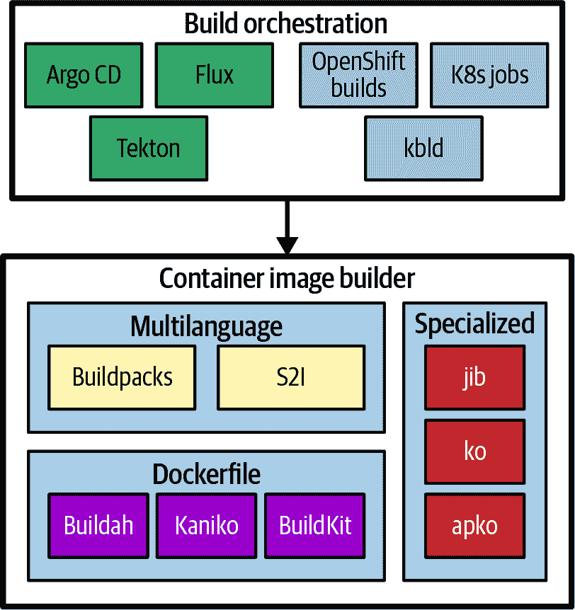
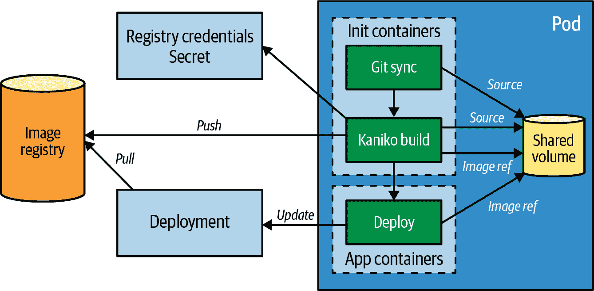
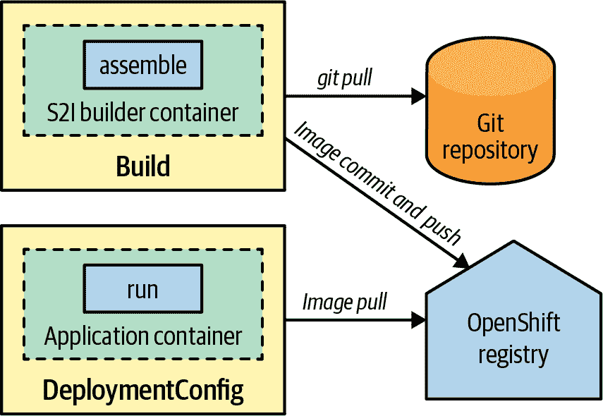
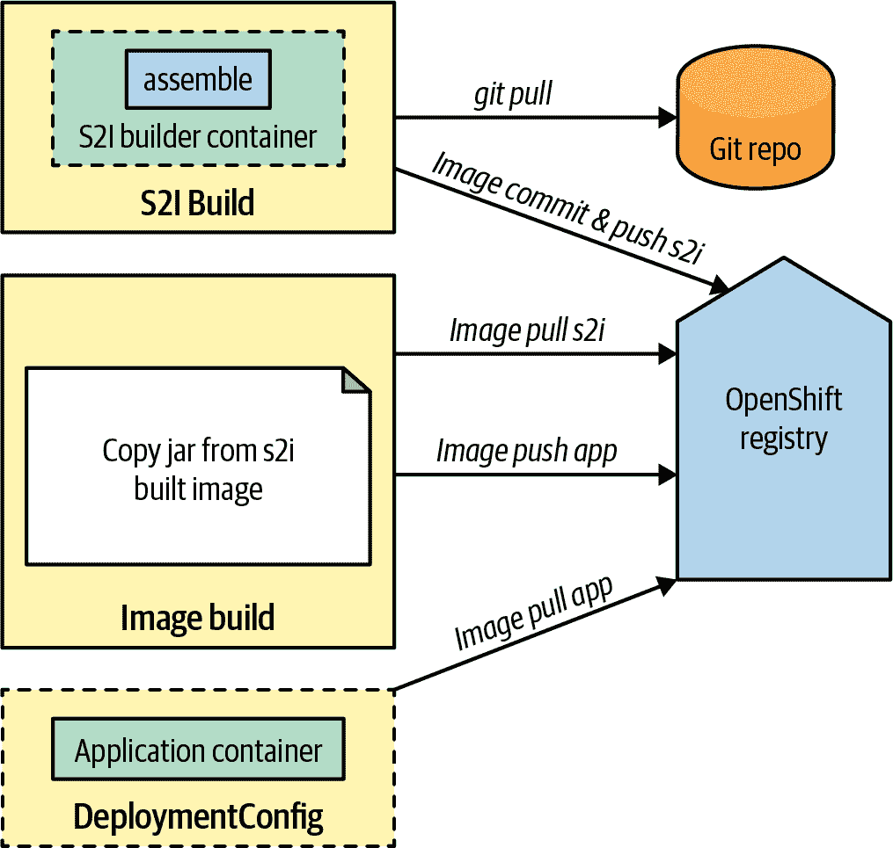

# 第三十章：镜像构建器

Kubernetes 是一个通用的编排引擎，不仅适用于运行应用程序，还适用于构建容器镜像。*镜像构建器*模式解释了为什么在集群内构建容器镜像是有意义的，以及今天在 Kubernetes 中存在哪些创建镜像的技术。

# 问题

到目前为止，本书中的所有模式都是关于在 Kubernetes 上运行应用程序的。您已经学会了如何开发和准备应用程序以成为良好的云原生公民。但是，*构建*应用程序本身呢？传统的方法是在集群外构建容器镜像，将其推送到注册表，并在 Kubernetes 部署描述符中引用它们。然而，在集群内构建具有几个优势。

如果您公司的政策允许，只有一个集群对一切都是有利的。在一个地方构建和运行应用程序可以大大减少维护成本。它还简化了容量规划并减少了平台资源的开销。

通常使用像 Jenkins 这样的持续集成（CI）系统来构建镜像。使用 CI 系统进行构建是一个调度问题，需要有效地为构建作业找到空闲的计算资源。Kubernetes 的核心是一个高度复杂的调度器，非常适合解决这类调度挑战。

一旦我们转向持续交付（CD），从*构建*镜像转向*运行*容器，如果构建发生在同一个集群内，两个阶段共享相同的基础设施，并且容易过渡。例如，假设发现了一个新的安全漏洞在所有应用程序使用的基础镜像中。当您的团队解决了这个问题后，您必须重建所有依赖于此基础镜像的应用程序镜像，并使用新镜像更新正在运行的应用程序。在实现*镜像构建器*模式时，集群同时知道镜像的构建和部署，如果基础镜像发生变化，可以自动重新部署。在“OpenShift Build”，我们将看到 OpenShift 如何实现这样的自动化。

在平台上看到构建镜像的好处后，让我们看看在 Kubernetes 集群中创建镜像的技术有哪些存在。

# 解决方案

截至 2023 年，存在一整套在集群中构建容器镜像的技术。虽然所有技术的目标都是构建镜像，但每种工具都添加了一些独特的功能，使其适用于特定的情况。

图 30-1 包含了截至 2023 年在 Kubernetes 集群中构建容器镜像的基本技术。



###### 图 30-1 Kubernetes 内的容器镜像构建

本章节简要概述了大多数这些技术。你可以通过跟随“更多信息”中的链接找到关于这些工具更多的细节。请注意，尽管这里描述的许多工具已经成熟并用于生产项目中，但不能保证在您阅读这些文字时这些项目仍然存在。在使用之前，您应该检查项目是否仍然活跃并得到支持。

对这些工具进行分类并不简单，因为它们在某种程度上重叠或相互依赖。每个工具都有其独特的重点，但对于集群内构建，我们可以识别出以下高级分类：

容器镜像构建器

这些工具在集群内创建容器镜像。这些工具之间存在一定的重叠，各有所异，但全部都可以在非特权访问的情况下运行。你也可以将这些工具作为 CLI 程序在集群外运行。这些构建器的唯一目的是创建容器镜像，但它们并不关心应用程序的重新部署。

构建编排

这些工具在更高的抽象层上运作，并最终触发容器镜像构建器来创建镜像。它们还支持构建相关任务，如在构建完镜像后更新部署描述符。如前所述的 CI/CD 系统是编排器的典型例子。

## 容器镜像构建器

从集群内部构建镜像的一个基本前提是在没有特权访问节点主机的情况下创建镜像。存在各种工具满足此前提条件，并且可以根据容器镜像的规范和构建方式进行粗略分类。

### 基于 Dockerfile 的构建器

下列构建器基于众所周知的 Dockerfile 格式来定义构建指令。它们在 Dockerfile 级别上是兼容的，并且要么完全不依赖与后台守护程序交互，要么通过 REST API 与在非特权模式下运行的构建进程远程交流：

Buildah 和 Podman

Buildah 及其姊妹项目 Podman 是强大的工具，用于构建符合 OCI 规范的镜像，而无需 Docker 守护程序。它们在容器内部创建镜像，然后将其推送到镜像注册表中。Buildah 和 Podman 在功能上有重叠，Buildah 专注于构建容器镜像（尽管 Podman 也可以通过包装 Buildah API 创建容器镜像）。在这篇[自述文件](https://oreil.ly/kSgHk)中更清楚地描述了它们的区别。

Kaniko

Kaniko 是 Google Cloud Build 服务的一个支柱，并且专门用于在 Kubernetes 中作为构建容器运行。在构建容器内部，Kaniko 仍然以 UID 0 运行，但持有容器本身的 Pod 是非特权的。这一要求阻止了在禁止容器中以 root 用户身份运行的集群中使用 Kaniko，比如 OpenShift。我们可以在“构建 Pod”中看到 Kaniko 的实际应用。

BuildKit

Docker 将其构建引擎拆分为一个独立的项目，BuildKit，可以独立于 Docker 使用。它继承了 Docker 的客户端-服务器架构，通过后台运行的 BuildKit 守护进程等待构建作业。通常情况下，这个守护进程直接在触发构建的容器中运行，但也可以在 Kubernetes 集群中运行，以支持分布式无根构建。BuildKit 引入了低级构建（LLB）定义格式，并支持多个前端。LLB 允许复杂的构建图，并可以用于任意复杂的构建定义。BuildKit 还支持超出原始 Dockerfile 规范的功能。除了 Dockerfile 外，BuildKit 还可以使用其他前端通过 LLB 定义容器镜像的内容。

### 多语言构建器

许多开发者只关心他们的应用程序被打包为容器镜像，而不太关心这是如何完成的。为了满足这种情况，存在多语言构建器以支持多种编程平台。它们检测现有项目，如 Spring Boot 应用程序或通用的 Python 构建，并选择一个有意见的镜像构建流程。

*Buildpacks* 自 2012 年以来存在，并最初由 Heroku 引入，允许将开发者的代码直接推送到其平台。Cloud Foundry 接纳了这个思路，并创建了 Buildpack 的分支，最终形成了被广泛认为是平台即服务（PaaS）黄金标准的 `cf push` 成语。2018 年，各种 Buildpack 的分支统一在 CNCF 的旗下，并被称为 *Cloud Native Buildpacks* (CNB)。除了为不同的编程语言提供个别的构建包外，CNB 还引入了一个生命周期，用于将源代码转换为可执行的容器镜像。

生命周期大致可以分为三个主要阶段：^(1)

+   在 *detect* 阶段，CNB 会迭代一个配置好的构建包列表。每个构建包可以决定它是否适合给定的源代码。例如，基于 Java 的构建包在检测到 Maven 的 *pom.xml* 后会响应。

+   所有在 detect 阶段存活下来的构建包将在 *build* 阶段被调用，为最终的、可能已编译的工件提供它们的部分。例如，Node.js 应用的构建包会调用 `npm install` 来获取所有必需的依赖项。

+   CNB 生命周期的最后一步是将结果 *export* 到最终的 OCI 镜像，并将其推送到注册表。

CNB 针对两种用户群体。主要受众包括*开发者*，他们希望将他们的代码部署到 Kubernetes 或任何其他基于容器的平台上。另一个是*Buildpack 作者*，他们创建单个 Buildpack，并将它们组合成所谓的*builders*。您可以从预制的 Buildpacks 和 builders 列表中进行选择，或者为您和您的团队创建自己的 Buildpacks。然后，开发者可以通过在其源代码上运行 CNB 生命周期时引用它们来选择这些 Buildpacks。有多种工具可用于执行此生命周期；您可以在[Cloud Native Buildpacks 网站](https://oreil.ly/B07Et)上找到完整的列表。

对于在 Kubernetes 集群中使用 CNB，以下任务非常有帮助：

+   `pack` 是一个 CLI 命令，用于在本地配置和执行 CNB 生命周期。它需要访问像 Docker 或 Podman 这样的 OCI 容器运行时引擎来运行包含要使用的 Buildpacks 列表的 Builder 镜像。

+   像 Tekton 构建任务或通过 GitHub actions 直接调用从配置的 Builder 镜像中调用生命周期的 CI 步骤。

+   `kpack`配备了一个操作器，允许您在 Kubernetes 集群中配置和运行 buildpacks。CNB 的所有核心概念，如 Builder 或 Buildpacks，都直接反映为 CustomResourceDefinitions。`kpack`目前尚未成为 CNB 项目的一部分，但自 2023 年以来即将被吸收。

许多其他平台和项目已经采用 CNB 作为其首选的构建平台。例如，Knative Functions 在将 Function 代码转换为容器镜像并部署为 Knative 服务之前，使用 CNB 作为其内部的转换工具。

*OpenShift 的 Source-to-Image*（S2I）是另一种具有见解的构建方法，使用 builder 镜像。S2I 直接从您的应用程序源代码生成可执行的容器镜像。我们将在“OpenShift 构建”中详细研究 S2I。

### 专门的 builders

最后，专门的 builders 具有一种有见解的创建镜像的方式，适用于特定情况。虽然它们的范围狭窄，但它们的强烈意见允许高度优化的构建流程，增加灵活性并减少构建时间。所有这些 builders 都执行无根权限构建。它们在本地创建包含应用程序工件的容器镜像层，并直接推送到容器镜像注册表：

Jib

Jib 是一个纯 Java 库和构建扩展，与 Java 构建工具（如 Maven 或 Gradle）很好地集成。它直接为 Java 构建工件、依赖项和其他静态资源创建单独的镜像层，以优化镜像重建时间。与其他构建工具一样，它直接与容器镜像注册表通信，用于生成的镜像。

ko

对于从 Golang 源代码创建镜像，ko 是一个很好的工具。它可以直接从远程 Git 存储库创建镜像，并在构建和推送到注册表后更新 Pod 规范以指向该镜像。

Apko

Apko 是一种独特的构建器，它使用 Alpine 的 Apk 包作为构建块，而不是 Dockerfile 脚本。这种策略允许在创建多个相似镜像时轻松重用构建块。

此列表仅选择了许多专业化构建技术中的一部分。它们都对它们可以构建的内容有着非常狭窄的范围。这种主观化方法的优势在于，它们可以优化构建时间和镜像大小，因为它们精确地了解它们操作的领域，并能做出明确的假设。

现在我们已经看到了一些构建容器镜像的方法，让我们跳到更高的抽象级别，看看如何在更广泛的上下文中嵌入实际的构建。

## 构建编排器

构建编排器是诸如 Tekton、Argo CD 或 Flux 等 CI 和 CD 平台。这些平台涵盖了应用程序的整个自动化管理生命周期，包括构建、测试、发布、部署、安全扫描等。有一些优秀的书籍涵盖了这些平台并将其整合在一起，所以我们在这里不会详细介绍。

除了通用的 CI 和 CD 平台外，我们还可以使用更专业的编排器来创建容器镜像：

OpenShift 构建

在 Kubernetes 集群中构建镜像的最古老和最成熟的方法之一是 *OpenShift 构建* 子系统。它允许您以多种方式构建镜像。我们将在“OpenShift 构建”中更详细地了解 OpenShift 构建镜像的方式。

kbld

kbld 是 Carvel 工具集的一部分，用于在 Kubernetes 上构建、配置和部署。kbld 负责使用我们在“容器镜像构建器”中描述的构建技术之一构建容器，并更新资源描述符，引用已构建的镜像。更新 YAML 文件的技术与 ko 的工作方式非常相似：kbld 查找`image`字段，并将它们的值设置为新构建镜像的坐标。

Kubernetes 作业

您还可以使用标准的 Kubernetes 作业触发“容器镜像构建器”中的任何一个构建器进行构建。详细描述作业的内容在第七章，“批处理作业”中。这样的作业包装了一个构建 Pod 规范，用于定义运行时部分。构建 Pod 从远程源代码库获取源代码，并使用集群内的一个构建器创建适当的镜像。我们将在“构建 Pod”中看到这样的 Pod 在运行中的情况。

## 构建 Pod

要挖掘典型的集群内构建的基本要素，让我们从最小化开始，使用 Kubernetes Pod 执行完整的构建和部署周期。这些构建步骤在图 30-2 中有所说明。



###### 图 30-2\. 集群内使用构建 Pod 构建容器镜像

以下任务代表了所有构建编排器的特征，并涵盖了创建容器镜像的所有方面：

+   从给定的远程 Git 仓库检出源代码。

+   对于编译语言，在容器内执行本地构建。

+   使用“容器镜像构建器”中描述的一种技术构建应用程序。

+   将镜像推送到远程镜像注册表。

+   可选地，使用新的镜像引用更新部署，这将触发按第三章，“声明式部署”描述的策略重新部署应用程序。

在我们的示例中，构建 Pod 使用了如第十五章，“初始化容器”所述的初始化容器，以确保构建步骤按顺序运行。在实际场景中，您会使用像 Tekton 这样的 CI 系统来指定和顺序执行这些任务。

完整的构建 Pod 定义显示在示例 30-1 中。

##### 示例 30-1\. 使用 Kaniko 构建 Pod

```
apiVersion: v1
kind: Pod
metadata:
  name: build
spec:
  initContainers:
  - name: git-sync          
    image: k8s.gcr.io/git-sync/git-sync
    args: [
      "--one-time",
      "--depth", "1",
      "--root", "/workspace",
      "--repo", "https://github.com/k8spatterns/random-generator.git",
      "--dest", "main",
      "--branch", "main"]
    volumeMounts:           
    - name: source
      mountPath: /workspace
  - name: build             
    image: gcr.io/kaniko-project/executor
    args:
    - "--context=dir:///workspace/main/"
    - "--destination=index.docker.io/k8spatterns/random-generator-kaniko"
    - "--image-name-with-digest-file=/workspace/image-name"
    securityContext:
      privileged: false     
    volumeMounts:
    - name: kaniko-secret   
      mountPath: /kaniko/.docker
    - name: source          
      mountPath: /workspace
  containers:
  - name: image-update      
    image: k8spatterns/image-updater
    args:
    - "random"
    - "/opt/image-name"
    volumeMounts:
    - name: source
      mountPath: /opt
  volumes:
  - name: kaniko-secret     
    secret:
      secretName: registry-creds
      items:
      - key: .dockerconfigjson
        path: config.json
  - name: source            
    emptyDir: {}
  serviceAccountName: build-pod  
  restartPolicy: Never      
```


用于从远程 Git 仓库获取源代码的初始化容器。


存储源代码的卷。


Kaniko 作为构建容器，将创建的镜像作为共享工作空间中的引用存储。


构建正在以非特权方式运行。


将用于推送到 Docker Hub 注册表的秘密挂载在一个已知路径上，以便 Kaniko 可以找到它。


挂载共享工作空间以获取源代码。


使用 Kaniko 构建的镜像引用更新部署`random`的容器。


带有 Docker Hub 凭证的秘密卷。


将共享卷定义为节点本地文件系统上的空目录。


允许修补部署资源的 ServiceAccount。


永不重新启动此 Pod。

这个示例比较复杂，让我们将其分解为三个主要部分。

首先，在能够构建容器镜像之前，需要获取应用程序代码。在大多数情况下，源代码从远程 Git 仓库获取，但也有其他技术可用。为了开发方便，可以从本地机器获取源代码，这样就不必访问远程源代码仓库，并避免通过触发提交来搞乱提交历史。由于构建发生在集群内部，因此必须以某种方式将该源代码上传到构建容器中。另一种可能性是通过容器镜像打包和分发源代码，并通过容器镜像注册表分发。

在示例 30-1 中，我们使用一个初始化容器从源 Git 存储库中获取源代码，并将其存储在类型为`emptyDir`的共享 Pod 卷`source`中，以便后续构建过程可以获取它。

接下来，在检索应用程序代码之后，实际的构建过程开始。在我们的示例中，我们使用[Kaniko](https://oreil.ly/SQeYa)，它使用常规的 Dockerfile，并且可以完全无特权地运行。我们再次使用一个初始化容器，以确保只有在完全获取源代码后才开始构建。容器镜像会在本地磁盘上创建，并且我们还配置了 Kaniko 将生成的镜像推送到远程 Docker 注册表。

用于推送到注册表的凭据从 Kubernetes Secret 中获取。我们在第二十章，“配置资源”中详细解释了 Secrets。

幸运的是，对于针对 Docker 注册表的认证的特定情况，我们可以直接从`kubectl`获得支持，以创建存储此配置的密钥，其格式是众所周知的。

```
kubectl create secret docker-registry registry-creds \
    --docker-username=k8spatterns \
    --docker-password=********* \
    --docker-server=https://index.docker.io/
```

对于示例 30-1，将此类密钥挂载到给定路径下的构建容器中，以便 Kaniko 在创建镜像时可以获取它。在第二十五章，“安全配置”中，我们解释了如何安全地存储此类密钥，以防止伪造。

最后一步是使用新创建的镜像更新现有的 Deployment。现在，在 Pod 的实际应用程序容器中执行此任务。^(2) 所引用的镜像来自我们的示例仓库，仅包含一个`kubectl`二进制文件，该文件通过以下调用修补指定的 Deployment 以使用新的镜像名称，如示例 30-2 所示。

##### 示例 30-2\. 更新 Deployment 中的镜像字段

```
IMAGE=$(cat $1)               
PATCH=<<EOT  [{
  "op":    "replace",
  "path":  "/spec/template/spec/containers/0/image",
  "value": "$IMAGE"
}]
EOT
kubectl patch deployment $2 \ 
   --type="json" \
   --patch=$PATCH
```


检索之前构建步骤中存储的镜像名称，位于文件*/opt/image-name*中。此文件作为该脚本的第一个参数提供。


用于更新 Pod 规范以使用新镜像引用的 JSON 路径。


为给定的第二个参数（在我们的示例中是`random`）打补丁，并触发新的滚动更新。

Pod 分配的 ServiceAccount `build-pod` 已设置为可以写入此 Deployment。有关为 ServiceAccount 分配权限的说明，请参阅第二十六章，“访问控制”。在 Deployment 中更新镜像引用后，会执行如第三章，“声明式部署”所述的滚动更新。

您可以在书籍的[示例仓库](https://oreil.ly/jVF6h)中找到完全可用的设置。构建 Pod 是在集群内进行构建和重部署的最简单方式。如前所述，它仅用于说明目的。

对于真实世界的用例，您应该使用像 Tekton 这样的 CI/CD 解决方案或整个构建编排平台，如我们现在描述的 OpenShift 构建。

## OpenShift 构建

红帽 OpenShift 是 Kubernetes 的企业分发版。除了支持 Kubernetes 支持的一切外，它还增加了一些企业相关功能，如集成容器镜像注册表、单点登录支持和新用户界面，并为 Kubernetes 添加了本地镜像构建能力。[OKD](https://www.okd.io) 是上游开源社区版分发，包含所有 OpenShift 特性。

OpenShift 构建是通过 Kubernetes 直接构建图像的首个集群集成方式。它支持多种构建图像的策略：

源到镜像（S2I）

获取应用程序源代码，并利用特定于语言的 S2I 构建器镜像创建可运行的构件，然后将图像推送到集成注册表。

Docker 构建

使用一个 Dockerfile 加上一个上下文目录，并像 Docker 守护程序一样创建一个镜像。

流水线构建

通过允许用户配置 Tekton 流水线来映射内部管理的 Tekton 的构建作业之间的映射。

自定义构建

为您提供如何创建图像的完全控制权。在自定义构建中，您必须在构建容器内自行创建图像并将其推送到注册表。

执行构建的输入可以来自不同的来源：

Git

通过远程 URL 指定的仓库，从中提取源代码。

Dockerfile

一个 Dockerfile 直接存储为构建配置资源的一部分。

镜像

另一个容器镜像，从中提取文件以进行当前构建。此源类型允许 *链式构建*，如 Example 30-4 所示。

密钥

为构建提供机密信息的资源。

二进制

来自外部的所有输入的来源。必须在启动构建时提供此输入。

我们可以在构建策略中使用哪些输入来源的选择取决于构建策略。*二进制* 和 *Git* 是互斥的源类型。所有其他源可以组合或单独使用。我们稍后将在 Example 30-3 中看到这是如何工作的。

所有构建信息都定义在一个名为 BuildConfig 的中心资源对象中。我们可以通过直接将其应用于集群或使用 CLI 工具 `oc`（OpenShift 版本的 `kubectl`）来创建此资源。`oc` 支持用于定义和触发构建的特定于构建的命令。

在我们查看 BuildConfig 之前，我们需要了解两个与 OpenShift 特定的附加概念。

ImageStream 是一个 OpenShift 资源，引用一个或多个容器镜像。这有点类似于 Docker 仓库，后者也包含具有不同标签的多个镜像。OpenShift 将实际标记的镜像映射到 ImageStreamTag 资源，以便 ImageStream（仓库）具有对 ImageStreamTags（已标记镜像）的引用列表。为什么需要这种额外的抽象？因为它允许 OpenShift 在镜像在注册表中更新为 ImageStreamTag 时发出事件。图像在构建期间创建或将图像推送到 OpenShift 内部注册表时创建。这样，构建或部署控制器可以监听这些事件并触发新的构建或开始部署。

###### 注：

要将 ImageStream 连接到部署，OpenShift 使用 DeploymentConfig 资源，而不是直接使用 Kubernetes 的 Deployment 资源来使用容器镜像引用。但是，您仍然可以通过添加一些[OpenShift 特定的注解](https://oreil.ly/Tu9GA)在 OpenShift 中使用普通的 Deployment 资源与 ImageStreams。

另一个概念是*触发器*，我们可以将其视为事件的一种监听器。一个可能的触发器是`imageChange`，它对因 ImageStreamTag 更改而发布的事件做出反应。作为响应，这样的触发器可以导致另一个镜像的重新构建或使用此镜像重新部署 Pods。您可以在[OpenShift 文档](https://oreil.ly/J4qTQ)中了解有关触发器及其可用类型的更多信息。

### Source-to-Image

让我们快速看一下 S2I 构建器镜像的样子。我们不会在这里详细展开，但 S2I 构建器镜像是一个标准的容器镜像，其中包含一组 S2I 脚本。它与 Cloud Native Buildpacks 非常相似，但生命周期简单得多，只知道两个必需的命令：

`assemble`

构建开始时调用的脚本。它的任务是获取一个配置输入源提供的源代码，必要时进行编译，并将最终产物复制到适当的位置。

`run`

用作此镜像的入口点。OpenShift 在部署镜像时调用此脚本。此运行脚本使用生成的产物来提供应用服务。

可选地，您还可以编写脚本以提供使用消息，保存所谓的*增量构建*中的生成产物，这些产物可在后续构建运行中由`assemble`脚本访问，或者添加一些健全性检查。

让我们仔细看看图 30-3 中的 S2I 构建。S2I 构建包含两个组成部分：构建器镜像和源输入。当启动构建时，S2I 构建系统将两者结合在一起——无论是因为接收到触发事件还是手动启动。例如，当构建镜像完成编译源代码时，容器将提交为一个镜像，并推送到配置的 ImageStreamTag。此镜像包含已编译和准备好的构件，并将镜像的`run`脚本设置为入口点。



###### 图 30-3\. 使用 Git 源作为输入的 S2I 构建

示例 30-3 展示了一个简单的 Java S2I 构建，使用了 Java S2I 镜像。该构建接受一个源和构建器镜像，并生成一个推送到 ImageStreamTag 的输出镜像。可以通过`oc start-build`手动启动它，或者在构建器镜像变更时自动启动。

##### 示例 30-3\. 使用 Java 构建器镜像的 S2I 构建

```
apiVersion: build.openshift.io/v1
kind: BuildConfig
metadata:
  name: random-generator-build
spec:
  source:    
    git:
      uri: https://github.com/k8spatterns/random-generator
  strategy:  
    sourceStrategy:
      from:
        kind: DockerImage
        name: fabric8/s2i-java
  output:    
    to:
      kind: ImageStreamTag
      name: random-generator-build:latest
  triggers:  
  - type: GitHub
    github:
      secretReference: my-secret
```


引用源代码以获取；在本例中，从 GitHub 中提取。


`sourceStrategy`切换到 S2I 模式，并直接从 Docker Hub 中选择构建器镜像。


要更新的 ImageStreamTag 是生成的镜像。这是在运行`assemble`脚本后提交的构建器容器。


当仓库中的源代码更改时，自动重新构建。

S2I 是创建应用程序镜像的强大机制，比纯 Docker 构建更安全，因为构建过程完全受信任的构建器镜像控制。但是，这种方法仍然存在一些缺点。

对于复杂的应用程序，S2I 可能会很慢，特别是当构建需要加载许多依赖项时。如果没有任何优化，S2I 将在每次构建时重新加载所有依赖项。对于使用 Maven 构建的 Java 应用程序，不存在像本地构建时的缓存。为了避免反复下载半个互联网，建议您设置一个集群内部的 Maven 仓库，用作缓存。然后，必须配置构建器镜像以访问此公共存储库，而不是从远程存储库下载构件。

减少构建时间的另一种方法是使用 S2I 的*增量构建*，它允许您重用先前 S2I 构建中创建或下载的构件。然而，大量数据会从先前生成的镜像复制到当前构建容器中，性能收益通常不会比使用保存依赖项的集群本地代理更好。

另一个 S2I 的缺点是生成的镜像还包含整个构建环境。^(3)这个事实不仅增加了应用镜像的大小，也增加了潜在攻击的面积，因为构建工具也可能变得脆弱。

为了摆脱不必要的构建工具如 Maven，OpenShift 提供了*串行构建*，它接收 S2I 构建的结果并创建一个精简的运行时镜像。我们将在“串行构建”中查看串行构建。

### Docker 构建

OpenShift 还支持直接在集群内进行 Docker 构建。Docker 构建通过直接挂载 Docker 守护程序的套接字到构建容器中来工作，然后用于`docker build`。Docker 构建的源是一个 Dockerfile 和一个保存上下文的目录。您还可以使用一个引用任意镜像的`Image`源，从中可以将文件复制到 Docker 构建上下文目录中。正如下一节中提到的，这种技术与触发器一起可以用于串行构建。

或者，您可以使用标准的多阶段 Dockerfile 来分离构建和运行时部分。我们的[示例存储库](https://oreil.ly/mn4vg)包含一个完整工作的多阶段 Docker 构建示例，其结果与下一节描述的串行构建相同。

### 串行构建

图 30-4 展示了串行构建的机制。串行构建包括一个初始的 S2I 构建，该构建创建运行时的构件，如二进制可执行文件。这个构件然后被第二个构建所使用，通常是一个 Docker 构建。



###### 图 30-4\. 使用 S2I 进行编译和 Docker 构建创建应用镜像的串行构建

示例 30-4 展示了第二个构建配置的设置，该配置使用在示例 30-3 中生成的 JAR 文件。最终推送到 ImageStream `random-generator-runtime`的镜像可以在 DeploymentConfig 中用于运行应用程序。

###### 注意

在示例 30-4 中使用的触发器监视 S2I 构建的结果。这个触发器导致每次运行 S2I 构建时都重新构建这个运行时镜像，以便保持两个 ImageStream 始终同步。

##### 示例 30-4\. 用于创建应用镜像的 Docker 构建

```
  apiVersion: build.openshift.io/v1
  kind: BuildConfig
  metadata:
    name: runtime
  spec:
    source:
      images:
      - from:             
          kind: ImageStreamTag
          name: random-generator-build:latest
        paths:
        - sourcePath: /deployments/.
          destinationDir: "."
      dockerfile: |-      
        FROM openjdk:17
        COPY *.jar /
        CMD java -jar /*.jar
    strategy:             
      type: Docker
    output:               
      to:
        kind: ImageStreamTag
        name: random-generator:latest
    triggers:             
    - imageChange:
        automatic: true
        from:
          kind: ImageStreamTag
          name: random-generator-build:latest
      type: ImageChange
```


Image 源引用了包含 S2I 构建运行结果的 ImageStream，并选择了镜像中包含已编译 JAR 存档的目录。


Dockerfile 源用于从 S2I 构建生成的 ImageStream 复制 JAR 存档的 Docker 构建。


`strategy`选择了一个 Docker 构建。


当 S2I 结果 ImageStream 变化后自动重新构建 —— 在成功的 S2I 运行后编译 JAR 归档。


注册监听器以获取图像更新，并在 ImageStream 添加新图像时重新部署。

您可以在我们的[示例存储库](https://oreil.ly/mn4vg)中找到带有安装说明的完整示例。

如前所述，OpenShift 构建以及其最突出的 S2I 模式是在 OpenShift 集群内安全构建容器镜像的最古老和最成熟的方式之一。

# 讨论

在集群内构建容器镜像的两种方式已经介绍完毕。普通构建 Pod 展示了每个构建系统需要执行的最关键任务：从源代码获取、从您的源代码创建可运行的 artifact、创建包含应用程序 artifact 的容器镜像、将此镜像推送到镜像注册表，最后更新任何部署，以从该注册表中获取新创建的镜像。这个例子并不适合直接生产使用，因为它包含太多现有构建编排工具更有效地处理的手动步骤。

OpenShift 构建系统很好地展示了在同一集群中构建和运行应用程序的主要优势之一。通过 OpenShift 的 ImageStream 触发器，您可以连接多个构建并重新部署您的应用程序，如果一个构建更新了您应用程序的容器镜像。构建与部署之间更好的集成是持续交付的重要一步。OpenShift 使用 S2I 的构建是一种经过验证和成熟的技术，但只有在使用 Kubernetes 的 OpenShift 分发时才能使用 S2I。

截至 2023 年的集群内构建工具的景观非常丰富，并包含许多令人兴奋的技术部分重叠。因此，您可以预期会有一些整合，但随着时间的推移，新的工具将会出现，因此我们将看到更多实现*镜像构建器*模式的实现。

# 更多信息

+   [镜像构建器示例](https://oreil.ly/39C_l)

+   镜像构建器：

    +   [Buildah](https://oreil.ly/AY7ml)

    +   [Kaniko](https://oreil.ly/SQeYa)

    +   [BuildKit 是什么？](https://oreil.ly/N28Dn)

    +   [使用 Buildpacks 构建多架构图像](https://oreil.ly/sBth1)

    +   [Jib](https://oreil.ly/jy9KH)

    +   [Pack](https://oreil.ly/iILs7)

    +   [Kpack](https://oreil.ly/LpGvB)

    +   [Ko](https://oreil.ly/9hARS)

    +   [Apko：构建容器的更好方式？](https://oreil.ly/5227Q)

+   构建编排器：

    +   [OpenShift 构建](https://oreil.ly/dIii_)

    +   [Kbld](https://oreil.ly/Uako8)

+   [多阶段构建](https://oreil.ly/8-zKu)

+   [链接 S2I 构建](https://oreil.ly/3MPXZ)

+   [构建触发器概述](https://oreil.ly/jcFx7)

+   [源到镜像规范](https://oreil.ly/0B2cc)

+   [增量 S2I 构建](https://oreil.ly/YbUen)

+   [在 Kubernetes 中构建容器镜像：一场漫长的旅程！](https://oreil.ly/0ijOJ)

+   [使用 Kubernetes 构建多架构容器镜像](https://oreil.ly/0Neln)

+   [在容器中运行 Buildah 的最佳实践](https://oreil.ly/8E76m)

^(1) CNB 覆盖更多阶段。整个生命周期在[构建包网站](https://oreil.ly/8l69J)上有详细解释。

^(2) 在这里，我们也可以再次选择一个初始化容器，并使用一个无操作的应用程序容器，但由于应用程序容器仅在所有初始化容器完成后才启动，因此放置容器的位置并不重要。在所有情况下，三个指定的容器都是依次运行的。

^(3) 这与云原生构建包不同，后者在其堆栈中使用单独的运行时镜像来承载最终的构件。
