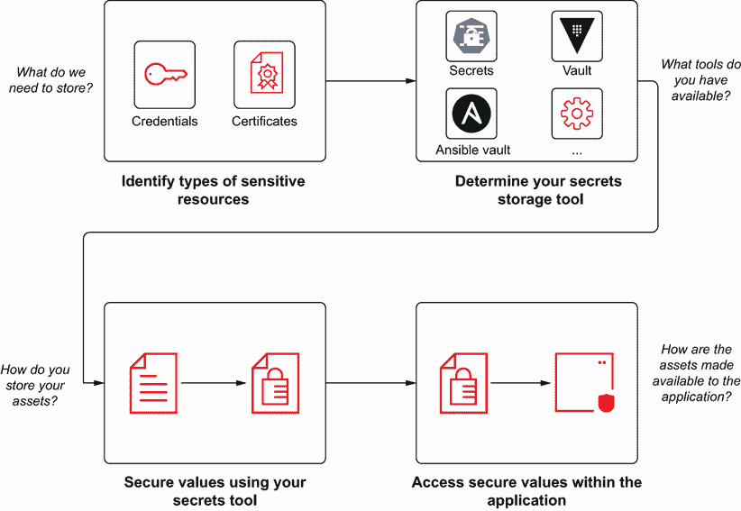
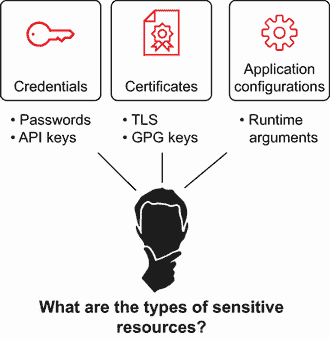
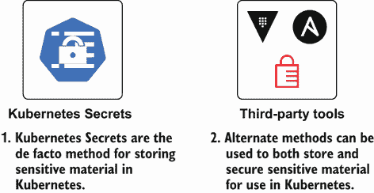
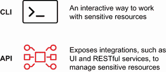

# 1 Kubernetes Secrets

本章节涵盖

+   专注于安全性

+   充分利用 Kubernetes 生态系统

+   区分什么是密钥，什么不是

+   将所有内容整合在一起

+   开始使用你成功所需的工具

企业级软件系统依赖于准确的配置数据来支持它们的正常操作。配置可以采取多种形式，并且可以根据用例和上下文以多种方式设置。这些可配置属性可能包括支持应用程序框架或程序正常操作所需的详细信息。

虽然许多属性旨在被任何一方查看，但有一些属性，如密码，应该只由某些个人或组件查看或访问。这些敏感数据形式被称为 *Secrets*，保护这些 Secrets 是 Kubernetes 管理员和开发者的首要任务。正如人们可能预期到的任何复杂系统一样，Kubernetes 配置使用了许多属性来支持正常操作，其中一些可能包含敏感信息，如果泄露，将危及整个平台的安全性和完整性。

随着时间的推移，越来越多的选项可用于管理 Kubernetes 中的配置，但大多数都源于在平台内存储配置的两种主要方法：ConfigMaps 和 Secrets。虽然每个资源都通过使用键值对提供存储配置材料的方式，但两者之间的主要区别在于 Secrets 被设计用来存储机密数据，同时支持更复杂的数据类型，如二进制资产而不是纯文本值。需要注意的是，这些数据类型中可能包含敏感属性。

然而，就 Kubernetes 中的密钥管理而言，包含的 Kubernetes Secrets 资源只是冰山一角。为了补充 Kubernetes Secrets 的本地功能，已经发展出额外的工具和方法。这些工具演变的驱动力之一是本地的 Kubernetes Secrets 资源并没有提供人们可能从密钥管理系统期望的安全级别。

与使用合适的加密算法不同，存储在 Kubernetes Secrets 中的值仅仅是 Base64 编码的，这意味着恶意攻击者可以轻易地解码这些值；这种编码方案是为了存储二进制数据而不是提供任何形式的安全性。但是，是什么使得这些替代工具优于本地的 Kubernetes Secrets 资源？是因为它们提供了更强大的加密机制，使用起来更直观，或者与目标系统或最终应用程序集成得更好？也许吧。这些都是选择可用选项时需要考虑的因素。

在许多情况下，没有“正确”的答案。无论是个人开发者还是跨国组织，每个人对安全的评估方式都不同。对某个人来说可能合适的东西，对另一个人来说可能就不合适，尤其是在必须遵守安全法规的情况下。理解不仅在于保护 Kubernetes 中敏感资产的重要性，还在于了解可以用来保护这些资产的各种方法，这是本书的目标。完成阅读后，你将更好地理解 Secrets 在 Kubernetes 环境中的应用，以及可以用来正确管理敏感资源和支持基础架构的技术和方法。

## 1.1 专注于安全

安全是一个持续发展的主题。每周都会报道新的漏洞，无疑会随之而来。采用容器原生策略的一个原因是因为云原生应用程序开发和运营带来了许多好处。然而，在许多情况下，安全仍然被视为事后考虑的事情，其优先级低于云原生开发的某些其他方面。系统构建和部署的根本转变为组织提供了一个反思如何优先考虑工作以及基础设施和应用程序设计应考虑的一些因素的机会。组织开始注意到安全的重要性，并“左移”以在开发过程中更早地纳入安全。这也给了他们反思当前安全实践的机会，并思考他们如何设计和发展未来的策略和政策。

采用最小权限原则等概念，将对资源的访问权限限制在完成任务所需的最小必要权限，强调了对敏感资源访问管理的重要性。将基于角色的访问控制（RBAC）应用于限制授权用户的访问是应用此原则最常见的方法之一。但关注安全不应被视为仅在规划和初始实施阶段发生的“一次性和完成”的任务。持续审查这些政策，以确认是否有任何行为者仍然需要访问所需资源，这一点非常重要。这种持续的评估不仅是一种良好的做法，而且还能提高整体安全性。

## 1.2 充分利用 Kubernetes 生态系统

如同人们可能想象的那样，在 Kubernetes 环境中实施适当的秘密管理远远超出了简单部署 Pods 和服务的范畴。更高级的话题，例如 *sidecars*（位于主容器旁边的独立容器，提供补充功能，并带有可以响应平台内各种变化的准入 webhook）将 Kubernetes 推向极限，以实现安全解决方案。平台真正的可扩展性通过自定义资源定义（CRD）得到体现，它扩展了基础的应用程序编程接口（API）资源集，可以通过多种方式用于管理安全资产，包括支持如何管理和访问秘密。

但推动项目前进并开辟机会的并不总是技术本身。开源社区的成员与各种组织合作，不懈地投入时间和资源，为这个领域提供解决方案，使更多的选项和方法成为可能，以提供最安全的操作环境。

## 1.3 并非所有内容都是秘密

虽然拥有以安全为首要考虑的心态很重要，但人们必须考虑到正确执行秘密管理所需的努力。例如，如果你开发了一个应用程序，该应用程序在达到可配置阈值时发送警报，例如冰箱温度达到 5 摄氏度，那么这个 5 摄氏度的阈值是否真正被视为敏感资源？可能不是。必须考虑到完全保护和管理工作所需的时问、资源和努力，因为管理开销和持续的生命周期可能会超过其带来的好处。

认为每个可配置的值都应该一视同仁的观点是一种常见的谬误，阻碍了许多团队。确定哪些值可以保持明文形式，哪些值需要保护，是所有团队都应该进行的练习。定义一个标准化的方法来识别敏感资源将有助于统一应用团队处理秘密管理的方式，同时也会促进做出更明智的决策并减少浪费的时间。

## 1.4 将秘密管理与 Kubernetes 结合起来

在 Kubernetes 时代之前，秘密管理就已经是一个挑战了。这个过程可能是费时的，并且很可能会涉及仔细的计划和考虑。那么你应该采取哪些步骤呢？让我们从图 1.1 所示的鸟瞰视角逐个分析各个部分，这将有助于理解你需要检查的步骤。

图 1.1 在 Kubernetes 中处理敏感资源所涉及的步骤

首先，在实施或执行任何形式的操作之前，应该就存在哪些类型的可配置材料以及哪些将被视为敏感材料达成一致（图 1.2）。

在某些情况下，答案相当直接，例如数据库的密码。对于其他情况，可能并不那么容易。以一个连接到相同后端数据库的 Web 应用程序为例。数据库的主机名会被认为是敏感材料吗？对一些人来说可能是，因为可能存在隐藏位置的愿望，以减少潜在的攻击向量。然而，如果位置指的是开发环境中团队成员共同使用的公共数据库，那么可能就不是了。在这个过程中，已经进行了许多战斗，有赢有输，答案实际上各不相同。

图 1.2 常见的敏感资产类型

一旦就认为敏感的属性类型达成一致，下一步就是确定它们应该如何存储。应该考虑几个因素：

1.  可用的秘密管理解决方案有哪些？

1.  敏感资产打算如何使用？

1.  正在使用什么应用程序框架，以及注入外部配置的选项有哪些？

在 Kubernetes 环境中，Secret 资源是一种自然默认的选择，因为它提供了一定形式的安全保护，并且包含在 Kubernetes 的每个发行版中。但是，还有其他什么选择呢？图 1.3 展示了两种主要的方法。

图 1.3 存储敏感 Kubernetes 资产的典型工具

如果您的应用程序或组件框架提供了秘密管理系统，那么利用这个本地功能可能是一个可行的选择。许多云服务提供商也提供自己的密钥管理系统（KMS）以及托管服务选项。在云环境中操作时，这非常诱人。其他解决方案，如 HashiCorp Vault，提供了一种可以在任何地方部署的密钥管理系统，无论是在公共云还是其他地方。

在确定秘密管理解决方案并在此特定实现中前进之后，下一步是在工具中存储资产。虽然存储资源的过程可能因工具而异，但大多数工具都提供了一个基于 API 的接口，可以在各种级别上使用以进行集成。API 成为与秘密管理解决方案交互的焦点，以及进行转换。

便捷性，命令行界面（CLI）选项或通过网页浏览器暴露的用户界面抽象了与 API 的底层交互。所有这些选项都有助于存储秘密，并且可以手动实现或集成到持续集成/持续交付（CI/CD）流程中，以实现可重复性和一致性（图 1.4）。

图 1.4 常见与秘密管理工具交互的方法

最后，也是可能最重要的步骤，是从密钥管理工具中检索存储的资源，以便应用程序使用。多亏了 Kubernetes 的强大功能，有各种各样的选项和方法可以用来完成这个任务。最终，这归结为两个不同的步骤：

1.  将值从其受保护形式转换为纯文本

1.  暴露值，以便它可以被应用程序消费

将存储的值转换回其纯文本表示的过程取决于所使用的密钥管理工具。在许多情况下，可以采用与存储值相同的方法，只是方向相反。根据您如何使这些值可供应用程序使用，事情可能会变得很有趣。最简单的方法，就像标准的 Kubernetes Secrets 一样，在创建的 Kubernetes 清单中引用存储的 Secret，然后该资产作为环境变量暴露给应用程序，或者包含在应用程序文件系统上的文件中。然而，如果使用了更高级的密钥管理工具，或者希望有更多动态功能来进一步限制值暴露给应用程序的方式，可能还有其他选项可用。

某些工具可以与上述边车容器中的运行应用程序一起部署，以与密钥管理存储进行交互，并将敏感值注入到应用程序中以供消费。或者，在部署时，可以通过平台修改应用程序的 Kubernetes 清单来动态地解耦值的注入方式。此外，还有敏感值从未以纯文本形式暴露，而是直接由应用程序在内存中访问的方法。从开始到结束，无论采用何种方法，都需要仔细规划和思考，评估所需的工具、应用程序的要求以及实施解决方案所需的总时间和精力。

## 1.5 开始的工具

为了指导您在整个书籍的旅程中，您将使用几个工具，这些工具不仅与 Kubernetes 集群交互，还与所讨论的任何密钥管理解决方案交互。拥有一个允许安装和配置软件的环境很重要。至少，要与 Kubernetes 集群交互并管理 Kubernetes Secret 资源，需要 Kubernetes 命令行工具（*kubectl*）。随着您在密钥管理空间的一些替代解决方案中工作，将引入额外的工具。因此，让我们不再拖延，开始吧！

## 摘要

+   配置有多种形式——其中一些可能是敏感的——以支持应用程序和基础设施环境。

+   存储在 Kubernetes Secrets 中的值未加密，而是使用 Base64 编码，并且易于解码。

+   最小权限原则仅包括启用必要的最低访问级别。

+   Kubernetes 容器编排平台包含原语，以实现管理机密的方法。

+   概念和方法将在后续章节中介绍，以便读者能够正确管理 Kubernetes 中的机密。
