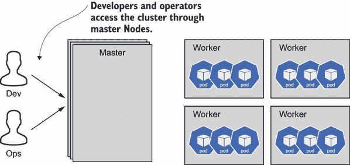
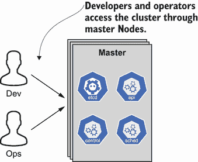
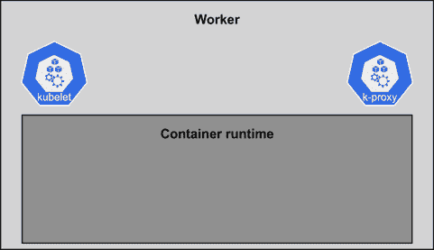
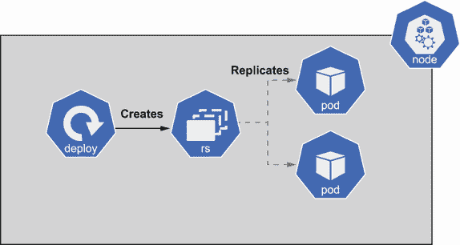
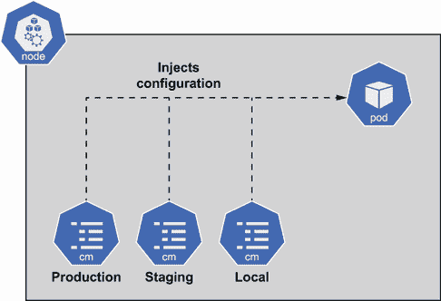
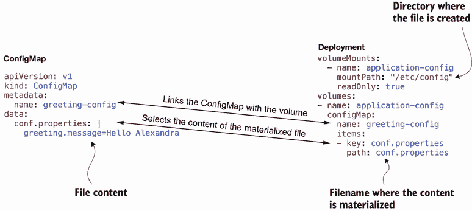
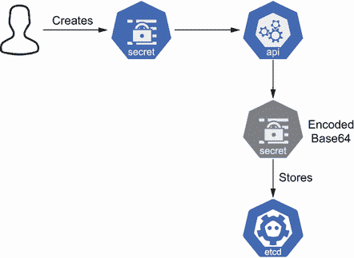

# 2 Kubernetes 和 Secrets 简介

本章涵盖

+   理解 Kubernetes 集群的基本架构

+   将应用程序部署到 Kubernetes

+   外部管理应用程序配置

+   使用 Kubernetes Secrets 存储敏感信息

由于密钥管理始于初始配置和应用程序的安全需求，因此完全理解初始设置过程非常重要。在本章中，您将了解如何通过部署一个简单的 RESTful Web 服务来管理配置，该服务返回一个问候消息，无论是不可靠的还是可靠的。

注意：您需要 Kubernetes 集群来运行本书中的实现。您可以使用任何由公共云提供或本地运行的 Kubernetes 发行版。

本书中的示例使用 minikube 集群进行测试。Minikube 允许您在笔记本电脑上的虚拟机（VM）中运行单个节点 Kubernetes 集群内的本地 Kubernetes。按照附录 A 中的说明安装您的 Kubernetes 集群，然后返回本章开始。

我们将首先回顾一些关于 Kubernetes 架构和配置的基本知识。如果您已经非常熟悉 Kubernetes，接下来几页，我们将为您建立 Web 服务的初始配置，应该非常熟悉。在完成默认设置后，我们将深入了解 Kubernetes Secrets。

## 2.1 Kubernetes 架构

了解 Kubernetes 架构的第一件事是存在两种类型的节点——主节点和工作节点——在典型的生产部署中，您可能拥有每种类型的大量节点。

重要提示：Kubernetes 社区已经开始更改节点名称，使用更具包容性的语言（例如，控制平面和二级节点）；我们真正支持这一变化，但本书中使用的 minikube 版本尚未实施这一变化。为了与 minikube 输出保持一致，本章使用主节点和工作节点。

图 2.1 展示了 Kubernetes 集群的整体概述以及主节点和工作节点之间的关系。工作节点（s）负责运行您的负载，例如开发的服务或数据库，而主节点（s）管理工作节点并决定工作负载的部署位置。



图 2.1 主节点和工作节点的 Kubernetes 架构概述

符合 Kubernetes 要求所需的最少节点数量只有一个主节点，充当主节点和工作节点。尽管这可能在生产环境中不是典型用例，但在本地开发中却是典型情况。通常，在生产环境中，您将拥有三到五个主节点和多个工作节点，其数量可能取决于要部署的工作负载数量以及您期望的应用程序冗余程度。让我们探索主节点和工作节点内部的内容。

### 2.1.1 什么是主节点？

*主节点*负责在 Kubernetes 集群中执行多个任务；例如，它决定应用程序部署的位置，检测并响应异常，存储应用程序配置参数，并且默认情况下，是存储应用程序秘密（或敏感信息）的地方。

Kubernetes 集群必须至少有一个主节点，但在生产环境中，您可能为了冗余而拥有多个。您将在每个主节点内部找到以下四个元素：

+   `kube-apiserver`—这是 Kubernetes 的前端，并向 Kubernetes 用户公开 Kubernetes API。当操作员对 Kubernetes 集群运行命令时，它通过 `api-server` 来执行。

+   `etcd`—这是一个用于存储所有集群数据的关键值数据库。每次您获取有关集群的信息时，这些数据都是从 `etcd` 中检索的。

+   *调度器*—这是负责选择节点以运行工作负载的过程。在选择部署工作负载的节点时考虑的因素可能取决于其需求，例如硬件、策略约束、亲和力和反亲和力规则、数据本地性等。

+   *控制器*—控制器的主要任务是监控特定的 Kubernetes 资源。

有四个主要的控制器：

1.  *节点控制器*—这个控制器负责监控任何节点宕机时采取行动。

1.  *副本控制器*—这个控制器负责确保您的工作负载始终处于运行状态。

1.  *端点控制器*—这个控制器使得使用静态 IP 和 DNS 名称访问工作负载成为可能。

1.  *服务账户和令牌控制器*—这为新的命名空间创建默认账户和令牌。

图 2.2 展示了构成主节点的所有元素。



图 2.2 主节点的元素 (`kube-apiserver`、`etcd`、调度器和控制器)

现在您已经了解了主节点的组成部分，让我们看看工作节点的组成部分。

### 2.1.2 什么是工作节点？

*工作节点*是部署和运行工作负载的实例。由于 Kubernetes 中的工作负载是软件容器，因此容器运行时托管在每个工作节点内部。

每个工作节点由以下三个元素组成：

+   *kubelet*—这是一个代理，确保容器在 Pod 中运行。

+   *代理*—这是一个实现了 Kubernetes `Service` 概念一部分的网络代理。

+   *容器运行时*—这是负责运行容器的。

在撰写本书时，以下运行时得到支持：`Docker`、`containerd`、`crio-o` 以及任何 Kubernetes 容器运行时接口 (CRI) 的实现。图 2.3 展示了构成工作节点的所有元素。现在您已经很好地理解了 Kubernetes 架构，让我们从开发人员或操作员的视角开始使用 Kubernetes。



图 2.3 工作节点元素

## 2.2 在 Kubernetes 中部署工作负载

到目前为止，您已经看到了 Kubernetes 集群的架构，但作为开发者，您可能希望将 Web 服务、数据库、消息代理或任何其他应用程序所需元素部署到 Kubernetes 中。您将探索开发者如何通过部署一个返回欢迎信息的简单应用程序来与 Kubernetes 交互。此外，您还希望能够从平台外部配置它们或能够使用网络协议访问它们。

### 2.2.1 部署工作负载

将工作负载部署到集群的最重要 Kubernetes 资源之一是 *Pod*。Pod 是 Kubernetes 中可部署的最小单元，由一个或多个容器组成。Pod 中的每个容器共享 IP、存储、资源和生命周期。

Pods 是业务工作负载运行的单元（例如，服务 API、数据库和邮件服务器）。理解 Pod 的一个有用的类比是将其视为一种 VM（当然不是），在其中运行进程，每个进程共享 VM 的资源、网络和生命周期。在 Pod 中，概念相同，但不是运行进程，而是运行容器。

在 Kubernetes 集群中部署 Pod 有许多方法，但最常见的一种是描述 YAML 文件中的部署，并使用 `kubectl` CLI 工具应用它。要创建包含 Pod 定义的 YAML 文件，请打开一个新的终端窗口，在新的目录中创建一个名为 `greeting-pod.yaml` 的文件，定义属于 Pod 的容器镜像，如下所示。

列表 2.1 创建 Pod

```
apiVersion: v1
kind: Pod                                               ①
metadata:
  name: greeting-demo                                   ②
spec:
  containers:
  - name: greeting-demo
    image: quay.io/lordofthejars/greetings-jvm:1.0.0    ③
```

① 将文件设置为 Pod 类型

② 为 Pod 赋予一个名称

③ 设置要运行的容器镜像

创建文件后，您可以使用 `kubectl apply` 子命令将其应用到集群中：

```
kubectl apply -f greeting-pod.yaml
```

重要提示：Minikube 不需要您进行身份验证即可访问集群。但根据 Kubernetes 的实现方式，您可能需要在运行此命令之前进行身份验证。

您需要等待 Pod 被分配到节点并且可以访问。为此，请在终端中使用 `kubectl wait` 子命令：

```
kubectl wait --for=condition=Ready pod/greeting-demo
```

现在通过获取 Pod 的状态来验证 Pod 是否正确分配：

```
kubectl get pods
```

Pod 被分配到节点并正确启动，因为最终状态是 `Running`。

```
NAME           READY   STATUS    RESTARTS   AGE
greeting-demo   1/1     Running   0          18s     ①
```

① 可能的状态有 Pending、Running、Succeeded、Failed、Unknown、Terminating、ContainerCreating 和 Error。

让我们做一个实验，删除您创建的 Pod 来查看其生命周期发生了什么：

```
kubectl delete pod greeting-demo
```

等待几秒钟直到 Pod 终止，然后获取 Pod 状态：

```
kubectl get pods
```

输出（如果您已经等待足够的时间）将显示 `greeting-demo` Pod 已不再可用：

```
No resources found in default namespace.
```

您可以多次运行 `kubectl get pods`，但 Pod 总是会永远消失。因此，Pod 本身可能在大多数情况下可能没有用，因为如果服务因任何原因死亡，它将变得不可用，直到您手动重新部署它。

当服务以意外方式死亡（或停止）时（例如，如果运行它的节点关闭，网络关闭或应用程序有致命错误）执行的过程是重启服务以最小化应用程序的停机时间。在 Kubernetes 之前，重启服务的过程是通过（半）手动完成的，但使用 Kubernetes，如果使用 `Deployment` 或 `ReplicaSet` 创建，Pod 中运行的服务将自动重启。

### 2.2.2 部署对象

到目前为止，当一个 Pod 死亡时，它并没有自动重启；这是 Pod 的性质。如果您想为 Pod 生命周期添加一些弹性，以便在出现错误时自动重启，那么您需要创建一个 `ReplicaSet`。

通常，ReplicaSet 不是手动创建的，而是通过 `Deployment` 资源创建的。`Deployment` 总是与一个 ReplicaSet 关联，因此当使用 `Deployment` 资源部署服务时，它明确地有一个 ReplicaSet 来监控和重启 Pod，以防出现错误，如图 2.4 所示。



图 2.4 部署的性质

要创建一个部署，请在之前打开的终端窗口中创建一个名为 `greeting-deployment.yaml` 的新文件。部署文件包含比 Pod 文件更多的元素。您需要在启动时设置所需的 Pod 副本数量。一个典型的值是 `1`，但可以是任何其他数字。

部署还必须定义属于 Pod 的容器镜像和容器的监听端口。部署文件如下所示。

列表 2.2 创建部署

```
apiVersion: apps/v1
kind: Deployment
metadata:
  name: greeting-demo-deployment     ①
spec:
  replicas: 1
  selector:
    matchLabels:
      app: greeting-demo
  template:
    metadata:
      labels:
        app: greeting-demo           ②
    spec:
      containers:                    ③
      - name: greeting-demo
        image: quay.io/lordofthejars/greetings-jvm:1.0.0
        imagePullPolicy: Always
        ports:
        - containerPort: 8080
```

① 部署名称

② 在 Pod 中设置的标签

③ 如在 Pod 定义中看到的容器部分

创建文件后，您可以使用 `kubectl apply` 子命令将其应用到集群中：

```
kubectl apply -f greeting-deployment.yaml
```

您需要等待 Pod 被分配到节点并准备好访问。为此，请在终端中使用 `kubectl wait` 子命令：

```
kubectl wait --for=condition=available deployment/greeting-demo-deployment --timeout=90s
```

通过获取 Pod 状态来确认 Pod 已启动并正确分配：

```
kubectl get pods
```

您应该得到以下类似输出：

```
NAME                                        READY   STATUS    RESTARTS   AGE
greeting-demo-deployment-854c4f4f69-xh5v6   1/1     Running   0          18s
```

运行以下命令以获取部署状态：

```
kubectl get deployment
```

部署的输出略不同于 Pod。在这种情况下，`available` 字段是最重要的，因为它显示了正在运行和运行的副本数量。由于您在示例中将副本设置为 `1`，因此只有一个 Pod 通过此部署可用：

```
NAME                       READY   UP-TO-DATE   AVAILABLE   AGE
greeting-demo-deployment   1/1     1            1           5m50s
```

现在重复之前的实验，删除 Pod 以查看其生命周期现在发生了什么。首先，您需要通过运行 `kubectl get pods` 命令找到之前部署文件中创建的 Pod 名称：

```
NAME                                        READY   STATUS    RESTARTS   AGE
greeting-demo-deployment-7884dd68c8-4nf6q   1/1     Running   0          14h
```

获取 Pod 名称，在你的情况下是`greeting-demo-deployment-7884dd68c8-4nf6q`，然后删除它：

```
kubectl delete pod greeting-demo-deployment-7884dd68c8-4nf6q
```

等待几秒钟直到 Pod 被终止，并获取 Pod 状态：

```
kubectl get pods
```

现在的输出与之前只创建了一个 Pod 的章节不同。注意，现在有一个新的 Pod 正在运行。你可以通过检查两个字段来看到 Pod 是新的：Pod 的`name`，与之前的情况不同，以及`age`，它接近你的时间：

```
NAME                                        READY   STATUS    RESTARTS   AGE
greeting-demo-deployment-7884dd68c8-qct8p   1/1     Running   0          13s
```

Pod 与`Deployment`和`ReplicaSet`相关联；因此，它已经被自动重启。现在你知道如何正确部署你的工作负载，是时候看看你如何访问它们了。

服务

到目前为止，你已经将应用程序部署到了 Kubernetes 集群中；然而，属于每个部署的 Pod 都会获得自己的 IP 地址。由于 Pod 按定义是短暂的，它们会动态地创建和销毁，新的 IP 地址也会动态分配。通过 IP 地址访问这些 Pod 可能不是最佳选择，因为它们在未来可能会无效。

Kubernetes 服务是将一组 Pod 通过稳定的 DNS 名称和 IP 地址暴露出来的方式，它们之间将进行负载均衡。在完成上一个示例中的`greeting-demo`部署之后，现在是时候创建一个服务，以便我们可以访问它。

在介绍这个概念之前，我们将先介绍 Kubernetes 中的标签概念。标签是一个与 Kubernetes 资源相关联的键值对，其主要目的是从用户的角度识别这些对象。例如，你可以设置一个带有自定义标签的部署，以标识它属于生产环境的部署。

如果你仔细查看之前的部署，你会看到有一个带有键`app`和值`greeting-demo`的标签被应用到所有创建的 Pod 上：

```
template:
  metadata:
    labels:
      app: greeting-demo
```

服务针对的 Pod 集通常由 Pod 中注册的标签确定。现在你将使用一个选择带有`app: greeting-demo`标签的 Pod 的服务来暴露之前部署中创建的 Pod。

在工作目录中创建一个名为`greeting-service.yaml`的新文件。服务定义应该配置部署中定义的`containerPort`（`8080`）与服务暴露的端口的映射。此外，你需要定义选择器值，设置`greeting-demo` Pods 的标签。服务文件应该看起来像以下列表中所示。

列表 2.3 创建服务

```
apiVersion: v1
kind: Service
metadata:
  name: the-service
spec:
  selector:
    app: greeting-demo
  ports:
    - protocol: TCP
      port: 80
      targetPort: 8080
  type: LoadBalancer
```

一旦你创建了文件，你可以使用`kubectl`的`apply`子命令将其应用到集群中：

```
kubectl apply -f greeting-service.yaml
```

由于你正在使用 minikube，将没有外部 IP 可以访问服务，必须使用 minikube 地址。你可以在终端窗口中运行以下命令来验证创建的服务没有关联外部 IP：

```
kubectl get services
```

你应该会看到`the-service`服务的`external IP`仍然处于`Pending`状态。

```
NAME          TYPE           CLUSTER-IP     EXTERNAL-IP   PORT(S)        AGE
kubernetes    ClusterIP      10.96.0.1      <none>        443/TCP        35d
the-service   LoadBalancer   10.102.78.44   <pending>     80:30951/TCP   4s
```

在终端窗口中，运行以下命令将连接值作为环境变量设置以访问服务：

```
IP=$(minikube ip)
PORT=$(kubectl get service/the-service -o jsonpath=
➥"{.spec.ports[*].nodePort}")                        ①
```

① 访问端口是随机分配的，不使用你在服务定义中设置的公开端口。

接下来，你可以使用 `curl` 工具查询服务：

```
curl $IP:$PORT/hello
```

欢迎应用程序对请求返回 `Hello World` 消息。

重要提示：在公共云中运行 Kubernetes 的情况下，外部 IP 将在几秒钟内变成一个真实 IP。你可以通过获取服务配置来获取外部 IP 值：

```
kubectl get services

NAME    TYPE           CLUSTER-IP      EXTERNAL-IP     PORT(S)          AGE
myapp   LoadBalancer   172.30.103.41   34.71.122.153   8080:31974/TCP   44s
```

清理

在你跳到以下概念之前，现在是时候删除你在本节中部署的应用程序了。为此，你可以使用 `kubectl delete` 命令：

```
kubectl delete -f greeting-deployment.yaml
```

服务故意没有被删除，因为稍后你将需要使用它。

### 2.2.3 卷

Kubernetes 的 *volume* 是一个包含一些数据的目录，这些数据可以被运行在 Pods 内部的容器访问。卷的物理存储由所使用的卷类型决定。例如，`hostPath` 类型使用工作节点文件系统来存储数据，或者 `nfs` 使用 *NFS*（网络文件系统）来存储数据。

Kubernetes 卷是一个广泛的话题，因为它与持久化存储相关，并且超出了本书的范围。你将在本书中使用卷，但仅作为挂载 ConfigMaps 和 Secrets 的方式。如果你不熟悉这些，不要害怕；我们将在接下来的章节中介绍它们。

## 2.3 管理应用程序配置

在前面的部分中，你已经看到了如何将带有硬编码欢迎消息的应用程序部署到 Kubernetes 集群中。在本节中，你将外部设置应用程序的欢迎消息，从一个配置参数中设置。

### 2.3.1 ConfigMaps

*ConfigMap* 是一个 Kubernetes 对象，用于以映射形式存储非机密数据。ConfigMap 的一个优点是它允许你将环境配置数据从应用程序代码外部化，根据集群设置特定的值，如图 2.5 所示。



图 2.5 ConfigMap 注入

配置映射可以被注入到 Pod 中，作为环境变量或卷来使用。在本章前面的部分中已部署的应用程序返回默认的欢迎消息（`Hello World`），但这个欢迎消息与代码解耦，因此你可以外部设置它。列表 2.4 展示了服务中加载欢迎消息的逻辑，以便返回给调用者。

首先，代码检查是否设置了 `GREETING_MESSAGE` 环境变量。如果没有设置，那么它尝试加载位于 /etc/config/conf.properties 的 `properties` 文件，其中定义了 `greeting.message` 键。否则，将返回默认消息给调用者。

列表 2.4 欢迎服务

```
final String envGreeting = System.getenv("GREETING_MESSAGE");

if (envGreeting != null) {
  return envGreeting;
}

java.nio.file.Path confFile = Paths.get("/etc/config/conf.properties");
if (Files.exists(confFile)) {

  final Properties confProperties = new Properties();
  confProperties.load(Files.newInputStream(confFile));

  if (confProperties.containsKey("greeting.message")) {
    return confProperties.getProperty("greeting.message");
  }

}

return "Hello World";
```

让我们开始使用 ConfigMap 外部配置应用程序。

环境变量

从 ConfigMap 获取值的一种方法是将它作为环境变量注入到 Pod 中。然后你可以使用编程语言提供的任何方法在你的应用程序中获取环境变量。

ConfigMap 资源最重要的部分是 `data` 部分。这是你将定义配置项的地方，形式为键值对。创建一个名为 `greeting-config.yaml` 的 ConfigMap 资源，其中 `greeting.message` 是配置键，`Hello Ada` 是配置值，如下所示。

列表 2.5 创建 ConfigMap

```
apiVersion: v1
kind: ConfigMap
metadata:
  name: greeting-config
data:
  greeting.message: "Hello Ada"   ①
```

① 将配置值设置为键值属性

此 ConfigMap 创建了一个带有新欢迎消息的配置项。像其他 Kubernetes 资源一样，使用 `kubectl apply` 将其应用到集群中：

```
kubectl apply -f greeting-config.yaml
```

ConfigMap 已经创建，但它只是一个配置元素。你现在需要更改之前的部署文件，以便它从 ConfigMap 获取配置，并将其作为环境变量注入到容器内部。

在工作目录中创建一个名为 `greeting-deployment-configuration.yaml` 的新文件。这个 Deployment 文件将类似于你之前创建的文件，但它将包含一个 `env` 部分，该部分设置要在 Pod 内部创建的环境变量（`GREETING_MESSAGE`）。环境变量的值来自之前创建的 `greeting-config` 配置映射。文件应类似于以下列表所示。

列表 2.6 创建带有 ConfigMaps 的部署

```
apiVersion: apps/v1
kind: Deployment
metadata:
  name: greeting-demo-deployment
spec:
  replicas: 1
  selector:
    matchLabels:
      app: greeting-demo
  template:
    metadata:
      labels:
        app: greeting-demo
    spec:
      containers:
      - name: greeting-demo
        image: quay.io/lordofthejars/greetings-jvm:1.0.0
        imagePullPolicy: Always
        ports:
        - containerPort: 8080
        env:
        - name: GREETING_MESSAGE        ①
          valueFrom:
            configMapKeyRef:
              name: greeting-config     ②
              key: greeting.message     ③
```

① 定义要使用的环境变量名称

② 设置要使用的 ConfigMap 的名称

③ 设置获取值的键

通过运行 `kubectl apply` 命令将其应用到集群中：

```
kubectl apply -f greeting-deployment-configuration.yaml
```

在 `greeting-demo` 容器内部创建了一个名为 `GREETING_MESSAGE` 的环境变量，其值为 `Hello Ada`。由于你的应用程序知道这个变量，返回的消息是 ConfigMap 中 `greeting .message` 键下配置的消息。现在检查一下：由于已经设置了 `IP` 和 `PORT` 环境变量，如第 2.2.2 节所述，你可以查询服务并看到消息已更新为配置的消息：

```
curl $IP:$PORT/hello
```

返回的响应是 `Hello Ada`，因为它是在 ConfigMap 中配置的消息。现在你已经看到了如何使用 ConfigMap 配置应用程序并将值作为环境变量注入，让我们继续将此配置值作为文件注入。

卷

到目前为止，你已经看到 ConfigMap 可以作为环境变量注入，这在将遗留工作负载迁移到 Kubernetes 时是一个完美的选择，但你也可以使用卷将 ConfigMap 挂载为文件。由于应用程序可以使用属性文件进行配置，你将使用 ConfigMap 和卷在容器内编写一个新的属性文件。

在工作目录中创建一个名为 greeting-config-properties.yaml 的 ConfigMap 资源。为了定义属性文件，在 `data` 部分，将应用程序所需的文件名（`conf.properties`）作为键，将属性文件的内容嵌入作为值。新的 Deployment 文件如下所示。

列表 2.7 创建 ConfigMap

```
apiVersion: v1
kind: ConfigMap
metadata:
  name: greeting-config
data:
  conf.properties: |                 ①
    greeting.message=Hello Alexandra
```

① 这是属性文件的文件名。文件内容是嵌入的。

通过运行 `kubectl apply` 命令将其应用到集群中：

```
kubectl apply -f greeting-config-properties.yaml
```

现在你需要将 config.properties 文件从 ConfigMap 物化到容器中。为此任务，你需要在容器定义中定义一个 Kubernetes 卷，并将 ConfigMap 中放置的内容存储在其中。

在工作目录中创建一个名为 `greeting-deployment-properties.yaml` 的新文件。在 Deployment 文件中，你需要定义两个重要的事情：卷配置和内容检索的 ConfigMap。

在 `volumeMounts` 部分中，设置卷的名称（`application-config`）和卷挂载的目录。你的应用程序将从 /etc/config 读取配置属性文件。你需要做的第二件事是将 ConfigMap 链接到卷上，这样配置文件就会在定义的卷内以特定的名称（`conf.properties`）和 ConfigMap 中定义的内容创建。

在以下列表中显示了在卷中注入配置的 Deployment 文件。

列表 2.8 使用 ConfigMap 创建部署

```
apiVersion: apps/v1
kind: Deployment
metadata:
  name: greeting-demo-deployment
spec:
  replicas: 1
  selector:
    matchLabels:
      app: greeting-demo
  template:
    metadata:
      labels:
        app: greeting-demo
    spec:
      containers:
      - name: greeting-demo
        image: quay.io/lordofthejars/greetings-jvm:1.0.0
        imagePullPolicy: Always
        ports:
        - containerPort: 8080
        volumeMounts:
        - name: application-config     ①
          mountPath: "/etc/config"     ②
          readOnly: true
      volumes:
      - name: application-config       ③
        configMap:
          name: greeting-config        ④
          items:
          - key: conf.properties       ⑤
            path: conf.properties      ⑥
```

① 为挂载设置名称

② 设置挂载卷的目录

③ 链接 volumeMounts 和 volumes 字段

④ 设置用作卷的 ConfigMap 名称

⑤ 要物化的键值

⑥ 内容物化的文件名



图 2.6 注入 ConfigMap

通过运行 `kubectl apply` 命令将其应用到集群中：

```
kubectl apply -f greeting-deployment-properties.yaml
```

启动的容器在 /etc/config/conf.properties 目录下包含一个新文件，文件内容是嵌入在 ConfigMap 中的。现在检查属性文件中配置的值是否被服务使用。根据 2.2.2 节中所述，已经设置了 `IP` 和 `PORT` 环境变量，你可以查询服务并看到消息已更新为配置的值：

```
curl $IP:$PORT/hello
```

返回了 `Hello Alexandra` 消息，因为它是在 Config-Map 中配置的值。你可以使用这两种方法将 ConfigMap 中的所有配置值注入到容器中，但最好的方法是什么？让我们通过一些用例来探索如何最佳地操作。

环境变量和卷之间的区别

在本节中，您将探索何时使用环境变量以及何时使用卷。*环境变量*方法通常用于与可以使用环境变量配置且无法或不想更新源代码的遗留应用程序一起使用。*卷*方法可以用于处理绿色字段应用程序或使用文件配置的应用程序。如果应用程序需要设置多个配置属性，则使用卷方法配置过程更简单，因为您可以在文件中一次性配置所有这些属性。此外，如果 ConfigMap 被更新，Kubernetes 会刷新卷的内容。当然，您的应用程序需要处理此用例并提供重新加载配置的能力。请注意，此同步过程不会立即发生；更改与 kubelet 同步更改之间存在延迟，以及 ConfigMap 缓存的生存时间（TTL）。

TIP 如果刷新配置值是您应用程序的关键功能，您可以采取更确定性的方法：使用 Reloader 项目。`Reloader`是一个 Kubernetes 控制器，它监视 ConfigMaps 和 Secrets 中的更改，并对与其关联的`Deployment`、`StatefulSet`、`DaemonSet`和`DeploymentConfig`的 Pod 执行滚动升级。它的优点是它可以在环境变量和卷方法中工作，并且您不需要更新服务源代码来处理此用例，因为应用程序在滚动更新期间会重新启动。然而，缺点是必须在集群内部安装`Reloader`控制器。

到目前为止，您已经看到了两种将配置数据注入容器的 Kubernetes 方法中的第一种。但 ConfigMaps 的内容既不是秘密也不是加密的，因为它是以纯文本形式存在的。这意味着数据没有保密性。如果您试图配置数据库 URL、端口或数据库配置，如超时、重试或数据包大小，您可以使用 ConfigMaps 而无需过多关注安全问题。但对于数据库用户名、数据库密码和 API 密钥等需要高度保密性的参数，您将需要使用第二种可以注入配置数据到容器的 Kubernetes 对象。

## 2.4 使用 Kubernetes Secrets 存储敏感信息

让我们继续前进这个例子：假设经过一些测试后，你决定问候信息是敏感信息，因此需要将其作为 Kubernetes Secret 存储。*Secret* 是一个 Kubernetes 对象，用于存储敏感或机密数据，如密码、API 密钥、SSH 密钥等。Secrets 与 ConfigMaps 类似，因为两种方法都用于在容器内注入配置属性；然而，前者是安全的，而后者则不是。它们以类似的方式创建（区别在于 `kind` 字段，它指定了对象的类型），并且以类似的方式在容器内公开（作为环境变量或挂载为卷）。但显然，它们之间有一些区别，我们将在以下章节中探讨。

### 2.4.1 Secrets 以 Base64 编码

如第一章所述，Secrets 和 ConfigMaps 之间的一大区别在于数据在 `etcd` 中的存储方式。Secrets 以 Base64 格式存储数据；ConfigMaps 以纯文本格式存储数据。

让我们更深入地了解 Base64 格式。*Base64* 是一种编码方案，它以 ASCII 字符串格式表示二进制和文本数据，将其转换为 64 进制表示。例如，在 Base64 格式中，`Alex` 文本数据被转换为 `QWxleA==`。重要的是要记住，Base64 不是一个加密方法，因此任何以 Base64 编码的文本都是被掩蔽的纯文本。

现在创建一个包含你希望保持机密的问候信息的 Secret。Secret 对象类似于 ConfigMap 对象，但它包含两种设置数据的方式：`data` 和 `stringData`。`data` 用于当你想手动将配置值编码为 Base64 时，而 `stringData` 允许你以未编码的字符串设置配置值，这些字符串将自动编码。让我们在当前工作目录中创建一个名为 `greeting-secret-config.yaml` 的 Secret，如下所示，其中包含在 `stringData` 字段中的秘密信息。

列表 2.9 创建一个秘密

```
apiVersion: v1
kind: Secret
metadata:
  name: greeting-secret
type: Opaque
stringData:
  greeting.message: Hello Anna    ①
```

① 使用 stringData，不需要进行 Base64 编码。

通过运行 `kubectl apply` 命令将此应用到集群中：

```
kubectl apply -f greeting-secret-config.yaml
```

现在 Secret 已经创建，你需要更改部署文件，以便它从之前步骤中创建的 Secret 中获取消息值，并将其注入到容器中。同样，你可以将 ConfigMaps 中的配置属性作为环境变量或作为卷注入。

你将编写一个部署文件，以与 ConfigMap 部分中类似的方式将秘密作为环境变量注入，但在这个案例中，你将使用 `secretKeyRef` 而不是 `configMapKeyRef`。在当前工作目录中创建一个名为 `greeting-deployment-secret-env.yaml` 的新文件，如下所示。

列表 2.10 使用 Secret 创建部署

```
apiVersion: apps/v1
kind: Deployment
metadata:
  name: greeting-demo-deployment
spec:
  replicas: 1
  selector:
    matchLabels:
      app: greeting-demo
  template:
    metadata:
      labels:
        app: greeting-demo
    spec:
      containers:
      - name: greeting-demo
        image: quay.io/lordofthejars/greetings-jvm:1.0.0
        imagePullPolicy: Always
        ports:
        - containerPort: 8080
        env:
        - name: GREETING_MESSAGE       ①
          valueFrom:
            secretKeyRef:              ②
              name: greeting-secret    ③
              key: greeting.message    ④
```

① 定义要使用的环境变量名称

② 使用 secretKeyRef 而不是 configMapKeyRef，正如 ConfigMaps 中的情况一样

③ 设置要使用的 Secret 的名称

④ 设置将获取值的密钥

通过运行 `kubectl apply` 命令将其应用于集群：

```
kubectl apply -f greeting-deployment-secret-env.yaml
```

现在检查当发送请求时服务是否使用了密钥值。在终端中已经设置了 `IP` 和 `PORT` 环境变量，如第 2.2.2 节所述，你可以查询服务并看到消息已更新为配置的值：

```
curl $IP:$PORT/hello
```

返回 `Hello Anna`，因为这是为该应用程序配置的密钥的值。当然，在生产环境中不要这样做；密钥是你在公共 API 中永远不应该暴露的东西，但为了这个练习，我们认为这是一种展示密钥如何工作的好方法。你还可以以类似处理 ConfigMap 的方式将密钥作为卷注入。

在这种情况下，未指定 `items` 字段；因此，Secret 对象中定义的所有键都会自动挂载。由于挂载目录的键是 `greeting.message`，因此在配置的卷中创建了一个名为 `greeting.message` 的文件，其数据内容为 `Hello Anna`。

```
volumeMounts:
    - name: greeting-sec
      mountPath: "/etc/config"       ①
      readOnly: true
    imagePullPolicy: "IfNotPresent"
    name: "greeting"
    ports:
    - containerPort: 8080
      name: "http"
      protocol: "TCP"
volumes:
- name: greeting-sec                 ②
  secret:                            ③
    secretName: greeting-secret      ④
```

① 存储密钥的路径

② 挂载的名称

③ 使用 secret 而不是 configMap。

④ 设置用于卷的 ConfigMap 名称

现在你已经了解了密钥的基本知识，ConfigMap 和 Secrets 之间的区别，以及如何将它们注入到容器中。但这些都是基础知识；在你可以说你的应用程序正确管理密钥之前，还有很多事情要做。

作为读者，你可能想知道，“如果 Secret 实际上并不真正保密，为什么它会被命名为 *Secret*？它没有被加密；它只是以 Base64 编码。”这是一个合理的问题，但请继续阅读本章的结尾，以完全理解其背后的推理。

### 2.4.2 密钥在临时文件系统中挂载

只有当存在需要它的 Pod 时，Secret 才会被发送到 Node。但重要的是，即使 Secret 作为卷挂载，也永远不会写入磁盘，而是使用 `tmpfs` 文件系统在内存中。`tmpfs` 代表临时文件系统，正如其名称所暗示的，它是一个文件系统，其中数据存储在易失性内存中而不是持久存储。当包含 Secret 的 Pod 被删除时，kubelet 负责从内存中删除它。

### 2.4.3 密钥可以在静止状态下加密

*静止数据* 是指持久化但很少访问的数据。配置属性属于这一类别（Secrets 也是配置属性），因为它们通常存储在文件中，并在启动时访问一次以加载到应用程序中。*加密* 是将明文数据转换为密文的过程。在文本被加密后，只有授权方才能将其解密回明文。*静止数据加密* 就是加密静止状态下的敏感数据。

在其他方面，所有来自 ConfigMaps 和机密的数据都存储在 `etcd` 中，并且默认情况下未加密。请注意，所有这些元素都是静态数据，其中一些应该受到保护。Kubernetes 通过在 `etcd` 中加密机密对象来支持静态加密，为攻击者提供了额外的保护层。我们知道这只是一个对这个主题的快速介绍，但我们将在第四章中更深入地探讨它，因为这是机密和 Kubernetes 的一个重要概念。

### 2.4.4 风险

你可能认为通过使用 Kubernetes 机密，你正在正确地管理你的机密，但你并没有。让我们列举一个假设的攻击者可能利用的所有可能的安全漏洞来窃取你的机密。

将机密作为环境变量或作为卷注入是否更安全？

可能你在想，将机密注入为环境变量或作为卷是否更好。直观上，你可能认为将机密作为卷注入比作为环境变量更安全，因为如果攻击者能够访问到 Pod，列出环境变量会比在整个文件系统中搜索尝试找到机密文件要容易。这是一个合理的观点，但以下示例将展示在安全方面，当存在对 Pod 的未授权访问时，环境变量和卷提供了相似的安全级别。

假设攻击者获取了对一个正在运行的 Pod 的访问权限，并且机密作为环境变量注入。攻击者可以通过在 shell 中运行 `export` 命令来列出所有环境变量：

```
export

declare -x GREETING_MESSAGE="Hello Anna"     ①
declare -x HOME="/"
declare -x HOSTid="greeting-demo-deployment-5664ffb8c6-2pstn"
...
```

① 机密被泄露。

攻击者很容易就能找出你的机密值。

另一个选择是使用卷。由于任何任意目录都可以挂载，你可能认为你是安全的，因为攻击者应该需要知道卷挂载的位置。是的，这是真的，但遗憾的是，有一种方法可以轻易地找到它。

如果攻击者获取了对一个已挂载机密作为卷的正在运行的 Pod 的访问权限，他们可以通过在 shell 中运行 `mount` 命令来列出所有挂载的文件系统：

```
mount | grep tmpfs

tmpfs on /dev type tmpfs (rw,nosuid,size=65536k,mode=755)
tmpfs on /sys/fs/cgroup type tmpfs (ro,nosuid,nodev,noexec,relatime,mode=755)
tmpfs on /etc/sec type tmpfs (ro,relatime) /   ①
...

ls /etc/sec                                    ②

greeting.message

cat /etc/sec/greeting.message                  ③

Hello Anna
```

① 使用机密的卷挂载

② 列出机密的密钥

③ 打印机密值

没有完美的解决方案。使用卷而不是环境变量的一个优点是，某些应用程序可能在启动时记录当前的环境变量，这同时也可以发送到中央日志系统，这意味着日志系统的任何安全漏洞都会暴露机密值。

保护 Kubernetes 机密是否是一项无望的任务？当然不是。首先，你需要评估攻击者获取对您的 Pods、节点和基础设施访问权限的可能性。其次，有一些操作可以应用来限制对 Pod 的访问——例如，移除执行 `kubectl exec` 或 `kubectl attach` 的权限。

机密存储在 etcd 中

正如你在 2.1.1 节中读到的，`etcd` 是一个键值数据库，其中存储了所有 Kubernetes 对象，当然，ConfigMaps 和秘密也不例外。创建秘密的过程如下：

1.  开发者或操作员创建一个新的秘密资源，并与 Kubernetes API 服务通信以应用它（`kubectl apply -f ...`）。

1.  Kubernetes API 服务处理资源，并将秘密插入到 `etcd` 中，位于 `/registry/secrets/<namespace>/<secret-name>` 键下。

这个过程在图 2.7 中展示。



图 2.7 存储秘密的过程

`etcd` 仍然是一个数据库。因此，您需要考虑以下方面：

+   `etcd` 的访问必须限制为管理员用户。如果不这样做，任何人都可以查询 `etcd` 来获取秘密。

+   `etcd` 数据库的内容持久化到磁盘。由于秘密默认情况下没有加密，任何有权访问磁盘的人都可以读取 `etcd` 的内容。

+   执行磁盘备份是正常操作，但要注意备份中发生的事情，因为它们包含未加密的敏感信息。

+   `etcd` 是一个外部服务，由 Kubernetes API 服务器通过网络访问。请确保使用 SSL/TLS 与 `etcd` 进行点对点通信（*传输中的数据*）。

Base64 不是加密

再次强调一次，因为这可能导致误解，Base64 不是一个加密方法，而是一种编码方法。重要的是要记住，秘密默认情况下是没有加密的，您需要启用加密静态数据功能来将您的秘密加密存储到 `etcd` 中。这一点将在第四章中详细讨论。

访问 Pods

正如您之前看到的，如果攻击者获得了对 Pod 的访问权限，窃取秘密相对容易，即使您正在使用环境变量或卷。还有另一种与这种攻击相关的攻击类型，您应该为此做好准备：能够创建 Pod 的攻击者可以注入和读取秘密。在第五章中，我们将讨论防止这种攻击的方法。

源代码仓库中的秘密

使用 `kubectl` CLI 工具可以创建一个秘密。

```
kubectl create secret generic greeting-secret \
                --from-literal=greeting.message=Hello
```

大多数情况下，您通过文件（无论是 JSON 还是 YAML）配置秘密，其中可能包含以 Base64 编码的秘密数据，而不是加密。这种方法存在一些风险，因为秘密可能在以下情况下被泄露：

+   以不安全的方式共享文件（例如，通过电子邮件）

+   将文件提交到源代码仓库

+   失去文件

+   没有任何安全措施地备份文件

根权限

任何具有任何节点上 root 权限的人都可以通过模拟 kubelet 从 API 服务器读取任何秘密。您还需要注意基础设施（工作节点），以避免来自操作系统的直接攻击。

你已经完成了处理秘密和 Kubernetes 的基本策略的实施，但你的秘密管理工作还没有完成，因为你还没有解决本节中识别的大多数风险。让我们从头开始；第三章从管理秘密的开始讨论，即如何根据最佳安全原则创建和管理 Kubernetes 资源文件。请留下来，因为接下来事情会变得有趣起来。

## 摘要

+   一个 Kubernetes 集群由主节点和可选的 worker 节点组成。

+   任何 Kubernetes 资源和集群的当前状态都存储在 `etcd` 实例中。

+   我们讨论了将应用程序部署到 Kubernetes。

+   我们介绍了如何使用 ConfigMaps 在外部配置应用程序，无论是作为环境变量还是作为文件。

+   在构建和使用方面，Secrets 与 ConfigMaps 并没有太大的不同。
