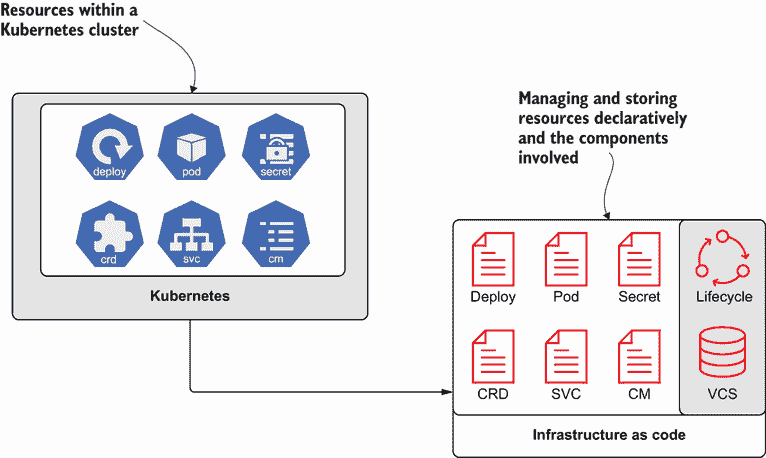
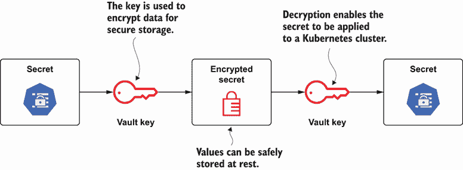
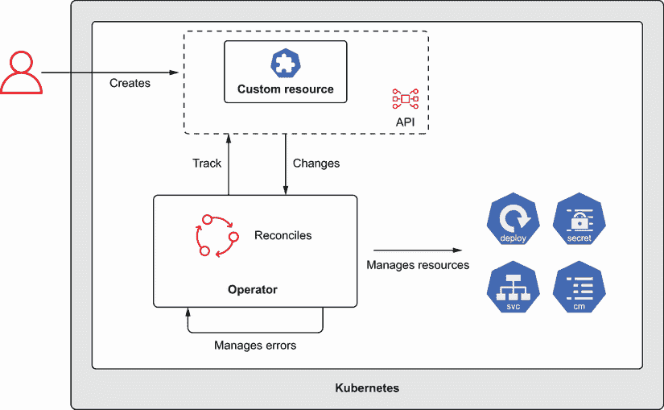
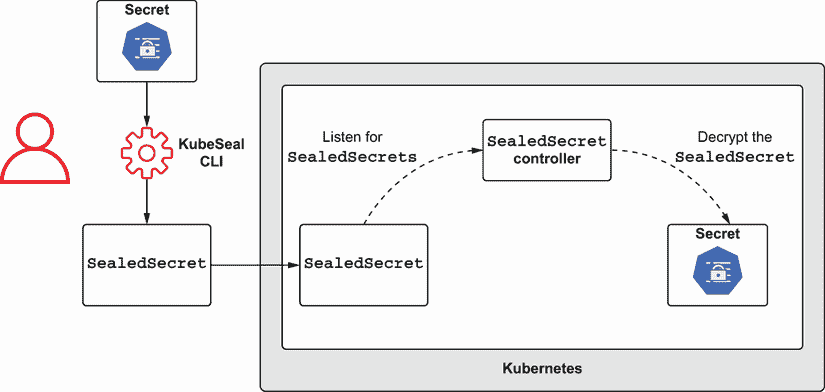
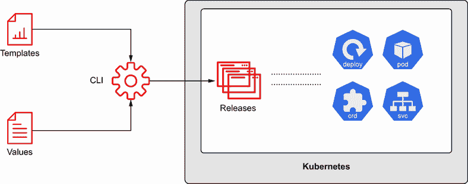
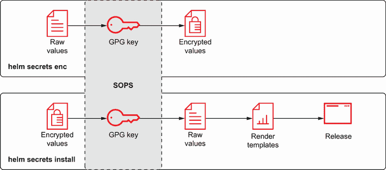

# 3 安全存储秘密

本章涵盖

+   将 Kubernetes 清单捕获以存储在版本控制系统

+   启用安全的静态秘密存储

+   使用 Kubernetes Operators 来管理 Kubernetes 资源，包括 Secrets

+   将安全考虑纳入 Kubernetes 软件包管理器

+   实施密钥轮换以改善你的安全态势

第二章概述了 Kubernetes 环境的关键架构组件，以及工作负载的部署方式和通过 ConfigMaps 和 Secrets 注入配置的方法。但是，一旦资源被添加到 Kubernetes 集群中，它们是如何被管理的？如果它们被意外删除会发生什么？确保它们被捕获并存储以备将来使用变得越来越重要。然而，当处理可能包含敏感信息的资源时，必须仔细思考和考虑。本章介绍了可以用来安全存储 Kubernetes Secrets 的工具和方法，并说明了声明性定义 Kubernetes 资源的好处。

## 3.1 静态存储 Kubernetes 清单

云原生技术的优势之一是资源可以根据需求构建、部署和配置。只需几点击或按键，就可以以最小的努力构建整个架构。如果你刚开始使用 Kubernetes，当你意识到构建复杂应用程序是多么容易时，你会感到兴奋。你甚至可能想要向父母、朋友或同事展示。但是，当你展示你的工作时，你可能会被问到如何复制它。这时，对于每个 Kubernetes 资源，包括包含敏感值的资源，正确管理和存储以备将来使用变得至关重要。

在第二章中，我们介绍了在 Kubernetes 环境中创建资源的两种主要方法：

1.  使用 Kubernetes CLI（kubectl），将命令行参数提供的输入进行转换。

1.  明确使用 YAML 或 JSON 格式的文件来指定资源配置。

前者，其中 Kubernetes CLI 为你提供转换，被称为*命令式方法*。例如，当你在上一个章节中使用 `kubectl` `create` `secret` 子命令创建部署的秘密时，Kubernetes CLI 确定了如何解释你提供的输入并向 Kubernetes API 发送请求以创建秘密。虽然这种方法简化了资源的初始设置和配置，但它也带来了长期支持性的挑战。`kubectl` `create` `secret` 命令不是幂等的，再次运行它将导致错误。这可以通过执行以下命令来看到，它将尝试创建一个名为 `greeting-secret` 的秘密，并将导致错误，因为在第二章中创建的 `default` 命名空间中已经存在具有相同名称的秘密：

```
kubectl create secret generic greeting-secret -n default \
  --from-literal=greeting.message=Hello

Error from server (AlreadyExists): secrets "greeting-secret" already exists
```

注意：如果默认命名空间中尚未存在密钥，再次运行此命令将导致类似的错误。

现在不再使用强制方法，资源可以明确地以 YAML 或 JSON 格式表示，并使用 `kubectl` 工具应用到集群中。这种方法被称为 *声明性配置*，它对支持 Kubernetes 环境中资源的长期生命周期有好处。

声明性配置是近年来获得流行的一个概念的关键特性：基础设施即代码（IaC）。与手动配置资源或使用随机脚本相比，应用到基础设施或应用程序的配置是明确定义的，这带来了以下好处：

+   减少错误

+   可重复性

+   审计和跟踪

能够审计和跟踪这些配置，尤其是在将清单存储在版本控制系统（VCS）如 Git 中时变得可能。一旦资源被捕获，它们的生命周期，包括更改了什么和谁更改了它们，都可以得到适当的跟踪。因此，如果发生灾难，而无需确定 Kubernetes 集群在那个时刻的状态，之前捕获并存储的清单可以被重新应用，从而最小化停机时间和努力。

### 3.1.1 捕获用于声明性配置的资源

当采用基于声明的配置或从主要基于强制的做法过渡时，有多种策略可以捕获清单（图 3.1）。回想一下，最终结果将是一系列 YAML 或 JSON 文件。虽然这两种文件类型都可以使用 `kubectl` 命令行工具应用到 Kubernetes 集群，但由于其可读性，基于 YAML 的文件更受欢迎。



图 3.1 捕获 Kubernetes 资源作为基础设施即代码（IaC）

可以使用两种常见场景来捕获用于声明性存储的清单：

1.  捕获 `kubectl` 强制命令的输出。

1.  在 Kubernetes 环境中捕获已存在的资源输出。

捕获 kubectl 强制命令

为了帮助以声明性方式存储清单，Kubernetes CLI 提供了两个有用的标志，可以在调用强制命令时添加，例如 `kubectl create secret`。

+   `--dry-run`—模拟资源如何应用到 Kubernetes 环境中。Kubernetes 版本低于 1.18 不需要使用参数，如 `client`，因为 APIServer 的 dry-run 在新版本中已被重构。

+   `-o`—以多种格式输出命令的结果，包括 YAML。

将这些标志添加到强制密钥创建命令中，将输出发送到 Kubernetes 集群的内容表示，而不会对集群的实际状态进行任何更改。

```
kubectl create secret generic greeting-secret -n default \
  --from-literal=greeting.message=Hello --dry-run=client -o yaml
```

捕获已部署的资源

Kubernetes CLI 的命令式能力仍然具有巨大的价值。在开发过程中，通常将命令式调用和手动配置结合起来，同时测试和验证每个资源的细节。一旦配置就绪，建议捕获这些资产，以便将它们存储在版本控制系统中，以符合基础设施即代码（IaC）原则。

可以使用 `kubectl get` 子命令查询资源的当前状态。与 3.1 列表所示类似，该命令可以以多种格式输出。执行以下命令以显示在第二章中创建的 `greeting-secret` 的内容。

列表 3.1 `greeting-secret` 机密

```
kubectl get secrets greeting-secret -o yaml

apiVersion: v1
data:
  greeting.message: SGVsbG8=    ①
kind: Secret
metadata:
  creationTimestamp: "2020-12-25T00:22:44Z"
  managedFields:
  - apiVersion: v1
    fieldsType: FieldsV1
    fieldsV1:
      f:data:
        .: {}
        f:greeting.message: {}
      f:type: {}
    manager: kubectl-create
    operation: Update
    time: "2020-12-25T00:22:44Z"
  name: greeting-secret
  namespace: default
  resourceVersion: "27935"
  selfLink: /api/v1/namespaces/k8s-secrets/secrets/greeting-secret
  uid: b6e87686-f4e6-454d-b391-aef37a99076e
type: Opaque
```

① 创建机密时实例化的字面值的 Base64 编码值

如你可能在输出中注意到的，包括 `status` 在内的字段，以及 `metadata` 中的一些字段（例如 `uid`、`resourceVersion` 和 `creationTimestamp` 等）都包含来自当前集群的运行时细节。这些属性不适合存储，应该被移除。它们可以手动移除或使用工具，如 `yq`（一个轻量级的 YAML 处理器）来移除。以下列表展示了使用 `yq` 移除运行时属性的一个示例。

列表 3.2 将机密内容输出到文件

```
kubectl get secrets greeting-secret -o yaml | \
  yq e 'del(.metadata.namespace)' - | \
  yq e 'del(.metadata.selfLink)' - | \
  yq e 'del(.metadata.uid)' - | \
  yq e 'del(.metadata.resourceVersion)' - | \
  yq e 'del(.metadata.generation)' - | \
  yq e 'del(.metadata.creationTimestamp)' - | \
  yq e 'del(.deletionTimestamp)' - | \
  yq e 'del(.metadata.deletionGracePeriodSeconds)' - | \
  yq e 'del(.metadata.ownerReferences)' - | \
  yq e 'del(.metadata.finalizers)' - | \
  yq e 'del(.metadata.clusterName)' - | \
  yq e 'del(.metadata.managedFields)' - | \
  yq e 'del(.status)' -
```

在附录 B 中可以找到如何在您的机器上安装 `yq` 工具的概述。可以将先前命令的输出重定向到文件中，以在版本控制系统中启用版本存储：

```
kubectl get secrets greeting-secret -o yaml | \
  yq e 'del(.metadata.namespace)' - | \
  yq e 'del(.metadata.selfLink)' - | \
  yq e 'del(.metadata.uid)' - | \
  yq e 'del(.metadata.resourceVersion)' - | \
  yq e 'del(.metadata.generation)' - | \
  yq e 'del(.metadata.creationTimestamp)' - | \
  yq e 'del(.deletionTimestamp)' - | \
  yq e 'del(.metadata.deletionGracePeriodSeconds)' - | \
  yq e 'del(.metadata.ownerReferences)' - | \
  yq e 'del(.metadata.finalizers)' - | \
  yq e 'del(.metadata.clusterName)' - | \
  yq e 'del(.metadata.managedFields)' - | \
  yq e 'del(.status)' - \
  > greeting-secret.yaml
```

由于资源现在以声明性方式描述，并且有资格在版本控制系统中跟踪和可见，因此确保这些值不易被确定的保护措施变得更加重要。由于机密只是 Base64 编码的，因此采用额外的机制来阻止确定其值的能力至关重要。本章的剩余部分将介绍并演示可以用来在静态存储中保护机密的工具。

## 3.2 安全存储 Kubernetes 资源的工具

虽然 Kubernetes CLI 没有提供任何额外的原生功能来保护存储的清单，但 Kubernetes 的流行使得与其他云原生工具集成以帮助解决这一挑战成为可能。这些工具包括那些已经具有在静态存储中保护清单的功能的工具，以及专门为在 Kubernetes 环境中解决此目的而开发的解决方案。作为 Kubernetes 的消费者，你可能需要管理那些专注于底层基础设施或平台内部署的应用程序，或者两者兼而有之。你最终将使用的工具取决于你的用例。了解哪些工具可用以及如何使用它们将帮助你做出明智的决定，选择适合你特定任务的适当工具。

### 3.2.1 Ansible Vault

Kubernetes 的典型部署（不包括 minikube）需要对基础设施和应用程序组件都进行考虑。这包括支持控制平面和工作节点的物理和虚拟资源以及 Kubernetes 清单的配置。配置管理工具在这个领域处于有利位置，因为它们不仅管理与 Kubernetes 环境相关的有时复杂的配置，而且有助于说明和实现基础设施即代码（IaC）的概念。

Ansible 是一款流行的配置管理工具，可用于管理 Kubernetes 生态系统的各个方面。与其他类似工具相比，Ansible 的一个关键优势是它非常适合云环境，因为它是无代理的（即，它不需要中央管理服务器）并且通过安全外壳（SSH），一种常见的通信协议进行通信。你只需要在你的本地机器上安装这个工具，就可以立即开始工作了！

安装 Ansible

Ansible 是一个基于 Python 的工具，因此，它是唯一的前提条件，并且可以安装在各种操作系统上。由于安装说明取决于目标操作系统，请参考官方文档（[`mng.bz/2rew`](http://mng.bz/2rew)）以了解如何为您的机器安装 Ansible。

Ansible 101

Ansible 将自动化指令组织成一系列 YAML 文件。描述要应用于目标配置的指令被组织到 Playbooks 中，这些 Playbooks 声明了配置应该应用到的主机以及一系列定义每个目标机器期望状态的任务。例如，一个简单的 Playbook 可以强制所有 Linux 机器在用户登录时显示每日消息（MOTD）。以下是一个示例 Playbook。

列表 3.3 一个示例 Ansible Playbook

```
-  hosts: linux                                 ①
   tasks:
     - name: Set motd
       copy:                                    ②
         content: "Linux Hosting Environment."  ③
         dest: /etc/motd                        ④
```

① 应应用于更改的主机组

② 复制模块将内容复制到远程位置。

③ 目标文件的值

④ 目标文件的存储位置

目标实例被组织成组并在清单文件中声明；它们定义了 Ansible 如何促进连接，以及在使用 Playbook 调用期间使用的任何变量。然后使用 `ansible-playbook` 命令调用 Playbooks，该命令将执行自动化：

```
ansible-playbook <playbook_file>
```

Ansible 和 Kubernetes

Ansible 的“核心”是基础设施的管理和配置。随着 Kubernetes 的普及继续增长，它正成为许多组织基础设施的关键组成部分，因此，Ansible 和 Kubernetes 之间的集成是可用的。

这种集成的一个有用功能是管理 Kubernetes 资源，这是通过使用 `k8s` 模块实现的。模块是可以包含在 Playbooks 中的可重用脚本。在先前的 MOTD 示例中，使用了 `copy` 模块将内容从本地机器复制到远程目标。

现在，您将创建一个 Ansible Playbook，通过使用您在本地机器上已经可用的 `greeting-secret` 来管理您的 Kubernetes 集群的配置。在您开始之前，准备您的开发环境。首先，在您的机器上复制 `greeting-secret.yaml` 文件，并创建一个名为 `greeting-secret_ansible.yaml` 的新文件：

```
cp greeting-secret.yaml greeting-secret_ansible.yaml
```

接下来，创建一个名为 `kubernetes-secrets-ansible` 的命名空间，用于此场景：

```
kubectl create namespace kubernetes-secrets-ansible
```

接下来，更改您的 kubectl 客户端的命名空间首选项，以指向新创建的命名空间：

```
kubectl config set-context --current --namespace=kubernetes-secrets-ansible
```

注意：在设置命名空间首选项后，所有后续命令都将查询目标命名空间。

现在，在文件 `greeting-secret_ansible.yaml` 所在的同一目录下，创建一个名为 `k8s-secret-mgmt.yaml` 的新文件，其中包含以下内容以包含 Playbook。

列表 3.4 k8s-secret-mgmt.yaml

```
- hosts: localhost                               ①
  gather_facts: no                               ②
  connection: local                              ③
  tasks:
    - name: Create Secret on Cluster
      k8s:                                       ④
        definition: >                            ⑤
          "{{lookup('file', playbook_dir +
          '/greeting-secret_ansible.yaml') }}"
        state: present
        namespace: kubernetes-secrets-ansible    ⑥
      no_log: True                               ⑦
```

① 在本地机器上执行 Playbook。

② 禁用 Ansible 收集与目标机器相关的信息。

③ 使用本地连接而不是默认的 SSH 与目标机器通信。

④ 使用 k8s 模块来管理 Kubernetes 资源。

⑤ 查找功能允许查询执行 Playbook 的控制节点（资源所在）的资源。在这种情况下，名为 greeting-secret.yaml 的文件值来源于包含 Playbook 文件的目录。

⑥ 将资源应用到 Kubernetes 集群的 `kubernetes-secrets-ansible` 命名空间。

⑦ 由于 Kubernetes Secrets 是作为此 Playbook 的一部分进行管理的，因此不要提供调用输出，因为这会暴露清单的内容。

默认情况下，`k8s` 模块使用本地机器上的 `kubeconfig` 文件来确定与 Kubernetes 集群通信的方法。由于您已经对 minikube 实例进行了认证，所以这一点已经处理好了。

在执行 Playbook 之前，必须安装 `openshift` Python 模块，以便 Ansible 能够与 Kubernetes 集群通信。OpenShift 是 Kubernetes 的一个发行版，`k8s` Ansible 模块在执行前需要 `openshift` 模块。这可以通过 pip 完成，这取决于您的操作系统，可能也是 Ansible 本身安装的方式。如果 pip 目前尚未安装，有关其安装的说明可以在附录 C 中找到。通过执行以下命令添加 `openshift` Python 模块：

```
pip install openshift
```

在安装了必要的依赖项后，运行 Playbook：

```
ansible-playbook k8s-secret-mgmt.yaml

[WARNING]: No inventory was parsed, only implicit localhost is available
[WARNING]: provided hosts list is empty, only localhost is available.
➥Note that the implicit localhost does not match 'all'

PLAY [localhost] **********************************************************
***************************************************************************
***********************

TASK [Create Secret on Cluster] *******************************************
***************************************************************************
***********************
changed: [localhost]

PLAY RECAP ****************************************************************
***************************************************************************
***********************
localhost                  : ok=1    changed=1    unreachable=0    failed=0
    skipped=0    rescued=0    ignored=0
```

注意：您可以安全地忽略警告，因为它们不会影响 Playbook 的执行。

如输出中强调的，Playbook 在本地定义了密钥后成功运行，现在该密钥已存在于 Kubernetes 集群的 `kubernetes-secrets-ansible` 命名空间中。这可以通过运行 `kubectl get secrets greeting-secret` 来确认。

Ansible Vault

如你所想，配置管理工具，如 Ansible，在管理敏感值方面面临相同的挑战。在上一节创建 Ansible Playbook 时，从`greeting-secret_ansible.yaml`文件中获取的秘密包含 Base64 编码的值，而这些值最终可能被解码。幸运的是，Ansible 通过启用文件加密功能来提供帮助，这些文件可以在运行时通过 Ansible Vault 进行解码。

Ansible Vault 允许保护变量和文件，因此可以安全存储。与 Kubernetes Secrets 不同，Ansible Vault 使用加密而不是编码来避免被轻易逆向工程（图 3.2）。



图 3.2 使用 Ansible Vault 的加密和解密过程

截至 Ansible 2.10 版本，Ansible Vault 仅支持`AES256`作为加密敏感材料的加密算法。要加密包含敏感值的秘密的`greeting-secret_ ansible.yaml`文件的内容，请使用`ansible-value encrypt`命令。你将被提示提供可以用于加密和解密加密密码内容的密码：

```
ansible-vault encrypt greeting-secret_ansible.yaml

New Vault password:
Confirm New Vault password:
Encryption successful
```

一旦文件被 Ansible Vault 加密，生成的文件将采取以下形式。

列表 3.5 greeting-secret_ansible.yaml

```
$ANSIBLE_VAULT;1.1;AES256
<ENCRYPTED_CONTENT>
```

结果是一个 UTF-8 编码的文件，它包含一个以换行符终止的头部，后面跟着加密内容。头部包含最多四个元素：

+   格式 ID（目前仅支持`$ANSIBLE_VAULT`）

+   保险库格式版本

+   密码算法

+   保险库 ID 标签（在此示例中未使用）

文件的负载是密文和 SHA256 摘要的连接，这是由于 Python `binascii`模块的`hexlify()`方法。具体细节在此不详细描述，但它们在 Ansible Vault 文档中有详细解释([`mng.bz/19rR`](http://mng.bz/19rR))。

一旦使用 Ansible Vault 加密了文件，在调用`ansible-playbook`命令时必须提供`--ask-vault-password`或`--vault-password-file`。为了使用`--vault-password-file`标志，密码必须作为引用文件中的内容提供。

提示：除了向`ansible-playbook`命令提供标志外，还可以通过`ANSIBLE_VAULT_PASSWORD_FILE`环境变量提供 Vault 密码文件的位置。

运行 Playbook，并添加`--ask-vault-pass`标志，这将提示输入 Vault 密码。当提示时，输入密码并按 Enter 键。如果提供了正确的密码，Playbook 将成功执行。

```
ansible-playbook k8s-secret-mgmt.yaml --ask-vault-pass
Vault password:
[WARNING]: No inventory was parsed, only implicit localhost is available
[WARNING]: provided hosts list is empty, only localhost is available.
➥Note that the implicit localhost does not match 'all'

PLAY [localhost] **********************************************************
***************************************************************************
***********************

TASK [Create Secret on Cluster] *******************************************
***************************************************************************
***********************
ok: [localhost]

PLAY RECAP ****************************************************************
***************************************************************************
***********************
localhost                  : ok=1    changed=0    unreachable=0    failed=0
   skipped=0    rescued=0    ignored=0
```

如果提供了错误的值，将显示如下消息：

```
TASK [Create Secret on Cluster] *******************************************
***************************************************************************
***********************
fatal: [localhost]: FAILED! => {"censored": "the output has been hidden
➥due to the fact that 'no_log: true' was specified for this result"}
```

由于你在任务中指定了`no_log`，因此不会提供更详细的错误信息。为了进一步调查，你可以暂时注释掉`no_log`以确定失败的根本原因。

通过使用 Ansible Vault 加密`greeting-secret_ansible.yaml`文件中 Kubernetes Secret 的内容，可以将 Playbook 和加密文件安全地存储在版本控制系统中。

Ansible Vault 展示了从客户端的角度如何管理加密和解密 Kubernetes 资源。下一节将介绍将责任转移到在 Kubernetes 集群内运行的组件。

## 3.3 Kubernetes Operators

虽然 Ansible Vault 满足了安全存储敏感 Kubernetes 资产的需求，但仍有几个方面可以改进：

+   执行 Ansible 自动化的用户被赋予了解密敏感资产所需的密码。

+   解密在客户端进行。任何敏感资产要么以明文值的形式传输，要么与 Kubernetes Secret 一起传输，因此是 Base64 编码的。

另一种策略是利用一个模型，其中解密过程完全在 Kubernetes 集群内部进行，将最终用户或自动化过程从管理敏感材料中抽象出来，因为资源被应用。这是 Sealed Secrets 项目所采用的方法，其中解密是通过在集群内运行的运算符来管理的。

回想第二章，主节点的一个关键组件是它们包含控制器，这些控制器名称恰当，因为它们实现了一个非终止的控制循环来管理和监控集群中至少一个资源的期望状态。当目标资源发生变化时，控制器将确保集群的状态与期望状态相匹配。

用户最熟悉的常见控制器之一是 ReplicaSet 控制器。部署是将工作负载注册到 Kubernetes 的常用方法，每当创建一个部署时，都会自动生成一个 ReplicaSet。ReplicaSet 控制器将监视与 ReplicaSet 关联的 Pod，并确保活动 Pod 的数量与 ReplicaSet 中定义的期望状态相匹配。

### 3.3.1 自定义资源定义（CRDs）

从历史上看，Kubernetes 的资源数量相对较少，例如 Pod 和 Secret。随着该平台知名度的提高，对新的资源类型的需求也随之增加，这既来自核心维护者，也来自用户。任何开发者都可以证明，对核心 API 的更改通常是一个具有挑战性和耗时漫长的过程。

自定义资源定义（CRD），作为一种新的资源类型，是解决这一问题的方法，因为它为开发者提供了注册他们自己的 API 以及与这些资源相关联的属性的机会，同时能够利用 API 服务器中的功能，而不会干扰核心 API 集。例如，可以定义一个新的资源`CronTabs`，其目的是在特定的时间点执行任务。可以开发一个应用程序来查询 Kubernetes API 的`CronTabs`资源并执行任何所需的业务逻辑。然而，如果你能够执行许多与包含的控制器集相同的操作，比如能够立即对状态变化做出反应，比如资源的创建或修改，那会怎么样？幸运的是，客户端库，特别是 Go 编程语言的 client-go，提供了这些功能。

开发一个应用程序来监控自定义资源并对其实施操作的这一概念被称为*操作员*，这一模式在 Kubernetes 社区中得到了广泛的应用；Sealed Secrets 项目也实现了这一模式。开发操作员和自定义控制器的过程曾经是一项巨大的成就，因为开发者需要深入了解 Kubernetes 的内部结构。幸运的是，工具，如 kubebuilder 和 Operator Framework，简化了这一过程（图 3.Figure 3.3）。



图 3.3  操作员在 Kubernetes 中管理资源概述

### 3.3.2 密封秘密

由于 Sealed Secrets 的大多数解决方案都卸载到控制器或操作员，那么它执行哪些操作呢？Sealed Secrets 包含三个不同的组件：

+   操作员或控制器

+   一个名为*kubeseal*的 CLI 工具，由最终用户用于加密 Kubernetes Secrets

+   一个名为`SealedSecret`的 CRD

在将 CRD 添加到集群并将控制器部署到命名空间后，如果不存在，控制器将创建一个新的 4096 位 RSA 公私钥对，并将其作为秘密保存在控制器部署的同一命名空间中。

最终用户使用 kubeseal 工具将标准的 Kubernetes Secret 转换为`SealedSecret`资源。加密过程对 Kubernetes Secret 中的每个值执行以下操作（图 3.4）：

1.  该值使用随机生成的 32 位一次性会话密钥进行对称加密。

1.  会话密钥随后使用控制器先前生成的公共证书创建的公钥，通过最优非对称加密填充（RSA-OAEP）进行非对称加密。

1.  结果存储在`SealedSecret`资源中。



图 3.4  使用 Sealed Secrets 项目加密和解密秘密的过程和组件

注意：有关使用的加密和解密更详细的概述，可以在 Sealed Secret 项目主页上找到：[`github.com/bitnami-labs/sealed-secrets`](https://github.com/bitnami-labs/sealed-secrets)。

安装 Sealed Secrets

安装 Sealed Secrets 的第一步是将控制器部署到集群中。虽然支持多种方法，但这里将使用通过原始 Kubernetes 清单进行安装的方式。

为了本书的目的，将使用版本`v0.13.1`，与控制器和相关 kubeseal 命令行工具的安装步骤可以在项目存储库中的发布页面上找到（[`mng.bz/PoP5`](http://mng.bz/PoP5)）。

与之前操作 Ansible Vault 时完成的步骤类似，创建一个名为`kubernetes-secrets-sealedsecrets`的新命名空间，并将命名空间首选项设置为针对此命名空间：

```
kubectl create namespace kubernetes-secrets-sealedsecrets
kubectl config set-context --current \
  --namespace=kubernetes-secrets-sealedsecrets
```

通过执行以下命令将控制器添加到 Kubernetes 集群：

```
kubectl apply -f https://github.com/bitnami-labs/sealed-secrets/releases/
➥download/v0.13.1/controller.yaml
```

默认情况下，控制器将安装到`kube-system`命名空间。通过列出`kube-system`命名空间中的运行中的 Pod 来确认控制器已成功部署：

```
kubectl get pods -n kube-system -l=name=sealed-secrets-controller

NAME                                       READY  STATUS   RESTARTS   AGE
sealed-secrets-controller-5b54cbfb5f-4gz9j 1/1    Running  0          3m43s
```

接下来安装 kubeseal 命令行工具。二进制发布和安装步骤可以在本节之前引用的发布页面上找到。务必遵循适用于您操作系统的详细步骤。一旦安装了 kubeseal，请确认 CLI 已正确安装，并且可以获取控制器生成的公钥证书，从而能够加密秘密：

```
kubeseal --fetch-cert         ①

-----BEGIN CERTIFICATE-----
MIIErjCCApagAwIBAgIRAIOgwJnDRCIcZon5GumMT8UwDQYJKoZIhvcNAQELBQAw
ADAeFw0yMDEyMjgxNjI3MDhaFw0zMDEyMjYxNjI3MDhaMAAwggIiMA0GCSqGSIb3
DQEBAQUAA4ICDwAwggIKAoICAQDosr3qLBJ4YQRiKvQgkQgMN+sCp2mQo8vJbj8z
rOaINXdkD6isHqq80uJ0uJ6ZigFpDmoyOUVlHbkprlngu6d41fBpEW0caREZrcd9
2s8yT2/8yJQ2Q1pZawGl0XjHOFMNEtdk3bvepLWGWcY7QUKJJwHpW5vGVs9xLU34
nnbPK0/dY1O6bnhIfVRgYvomO+IIfSDx3t7OGg/hEm2jp7rkNBIdW0qnH7GwTNVx
6FdD+DGztSgqTMdttla7IwRZjfXSf3HAIK0ZY8cq7hsd3+JewSsWwctNCHbeW4Y5
QNjKXcBr9UeReZ6+BOw8p8xSSBYE0DPNLbqccjcjYT/lD/r7Ja2Pb1W4X/tt8Dwc
EccnjGW+3zYdAQulxLN+EZos+hlgFcNAeBHkPwbC9oDAamfsJAihGIWMa/CyBZAm
2eF2aFtU0djDEhrVIuzrw4JKSdatqD0Bu0QOLQl08PM/GnAzDGzZ9jswfdRmjoPS
t20XyRG+9irB4SIv47KjWXulc7h9hYrQWxDlNy/R6TeqirA/hOiBn4ZgaY3xx3+/
tDFJ5YkR+rzEcf+W/5I3SbOzKQ9XvERGVUJUfJbjXoes8JY0qxFZosUyaiwi+xWT
F8R/1k0+OwtH2u1e4pq265I1HBJGQcOpuKpf1U/q1uACncRsi2s+EHA323T7Jkc7
3srk9wIDAQABoyMwITAOBgNVHQ8BAf8EBAMCAAEwDwYDVR0TAQH/BAUwAwEB/zAN
BgkqhkiG9w0BAQsFAAOCAgEAeX4Mf+65e8r2JMTqNKP1XnEYEw/jnq7BpjwxjNxw
AVoF2YdZifi/0U9Xr5SA+uCWYVgRB5wFpZ8trckTaLUiszTeLtlwl1Jouf2VIcbY
N6RF1uHbBEYEyZl7daoF3Sd1stj/oZBPmjEPl2OLus0WpYkGDdy+29fzUz271yA8
P1UE5Uq/7/0P/UIuU9pMQMbciuP0F97ODp/8i2iXyEiXPbe7s+h0GXlsrjyD65Fz
cwc9etAXuHrxcKPyCAtyzW3CmU+WqE6nVCNgwwh4j5r2SEeR3UZVw8Yub45IoZiE
PMcTlfA9e4hw4muKEmygdYCbiFQLsa0G/MtBv+IwpaMPtoY6edjUY+OOpgX7OlI9
ymfnhGLyGqHLbwhZpc3gvJHWCJ9mRkGr66KAHA1+HOlJw/aua0A3Fo2DBP2Ruftu
g3NgE5G6zPnfcalaPjt+Cl7Wu9TfzcIxVtTgM6g+LePgYP3tTRzAMv0DzKHSpBqW
v98pF1cG0vrVk15rLIcAlCMYhP95el4qtfcXwQzKmnQBhW+emaCIudvyFRJdFM2o
f0pSiRYkpLDrqZ2fiqw+eqts80hUDOh9GvJzxtZbOccxTbgaKxX9MtAQllw3vYJx
EHCp06JmUc09GtYCju2gJH29baHWldNDeP/3z9913RmnIWggh4b+G0FmPmB5XOhb
PR4=
-----END CERTIFICATE-----
```

① --fetch-cert 获取当前公钥证书。

使用 Sealed Secrets 加密秘密

现在，Sealed Secrets 已成功安装，请使用列表 3.2 中创建的`kubeseal`加密`greeting-secret.yaml`的内容，创建一个名为`greeting-secret_sealedsecrets.yaml`的新文件，如下所示。

列表 3.6 使用 kubeseal 加密秘密

```
kubeseal --format yaml  <greeting-secret.yaml \
  >greeting-secret_sealedsecrets.yaml -n kubernetes-secrets-sealedsecrets
```

查看以下列表中新生成的`greeting-secret-sealedsecrets.yaml`文件的内容。

列表 3.7 greeting-secret-sealedsecrets.yaml

```
apiVersion: bitnami.com/v1alpha1
kind: SealedSecret
metadata:
  creationTimestamp: null
  name: greeting-secret
  namespace: kubernetes-secrets-sealedsecrets
spec:
  encryptedData:
    greeting.message: AgAKGnqEn6MRRsDGoH2lhKTwJ0UVeUaN+Kq0Uyr13ZNnQB/eLFjJ
    ➥qkzN9+kbnMC9J9ptA2MS2WMIkKnF7cRaX3HloCp/SqgsN3eIhZs6zL4EHcpxUkXTPl
    ➥83ynwa6oC6z/vAFwwJhKHkQPKJ4yrwOpo1bauddL7Oi4fwxqRyK98EHiQ485qv26rK
    ➥qJgl9q26gsGii0JFyL73OU3/r7nhdzKJ7+eL1EYVqV2Mn95O95ShqVYq970TPpPtLy
    ➥1MzeA/bT9hhgTmWyBzREZsG+O+knCO3j5NK0QBt7UEEenOlNQBgc5mTFaQ2SBjD9k7
    ➥MEG979jiPEIOL0LkkLbv2R8cox7HqlEZTOJ0E18ghWwxf3zsxPE2/IJw5WVxcmcAG1
    ➥O+cy0L+YP36xnaOe15WAtEmWTXk8aVh8SCzaLsYZEoom96Jh8ZGZHMsRuly2gmMUjW
    ➥4dTGQazeZm+T+q6kJuYxDZ/SDvlui+q9G6IB4joJIRndp16cTxQlqopqhjAO/YZOIc
    ➥KmAD1YrbXwSNw/Z+X+Y20xZQrp5BMFrvspar+1drNvJ+8/nvhYlo+j3p0MiHI7tyUt
    ➥5cqxsxhTpZLth5T6/VEt2hBIOQ5AKgJitm6yGnmZKzQwvkHYxGuy15sExI+MJ3LNyO
    ➥sLTprWzAzSuf/c0KFXM2/fQ+DlysZJsFCDYmiBygcbD65xqLFaQ4oHIcxwhXwmkYnd
    ➥oA==
  template:          ①
    metadata:
      creationTimestamp: null
      name: greeting-secret
      namespace: kubernetes-secrets-sealedsecrets
```

① 模板属性向生成的秘密添加字段。可以包括其他属性，如标签和注解。

作为额外的安全措施，与秘密关联的命名空间和名称作为 OAEP 过程的一部分被添加，因此重要的是要考虑在生成`SealedSecret`资源时这一点。最后，验证新创建的`SealedSecret`资源是否可以添加到 Kubernetes 集群。一旦添加，Sealed Secrets 控制器应解密内容并在同一命名空间中创建一个新的 Secret：

```
kubectl apply -f greeting-secret_sealedsecrets.yaml
```

确认已在新创建的`kubernetes-secrets-sealedsecrets`命名空间中创建了一个名为`greeting-secret`的新秘密：

```
kubectl get secrets -n default greeting-secret
NAME              TYPE     DATA   AGE
greeting-secret   Opaque   1      20s
```

Sealed Secrets 控制器还会根据其执行的操作发出 Kubernetes 事件，可以通过查询`default`命名空间中的事件来验证：

```
kubectl get events -n kubernetes-secrets-sealedsecrets

LAST SEEN   TYPE     REASON     OBJECT                         MESSAGE
3m38s       Normal   Unsealed   sealedsecret/greeting-secret   SealedSecret
                                                               unsealed
                                                               successfully
```

事件添加提供了对 Sealed Secrets 管理的资源生命周期的洞察。

由于`SealedSecret`资源与相关 Secret 之间的紧密联系，如果删除`SealedSecret`资源，Kubernetes 也会删除引用的 Secret。这是因为 Secret 由`SealedSecret`资源拥有。Kubernetes 垃圾回收会将资源删除的删除操作级联到任何拥有的资源。有关 Kubernetes 垃圾回收的更多详细信息，请参阅 Kubernetes 文档（[`mng.bz/JVDQ`](http://mng.bz/JVDQ)）。

通过展示如何在我们的 Kubernetes 环境中使用 Sealed Secrets，您可以放心地将`SealedSecret`资源存储在版本控制系统中，而无需担心敏感资产容易被发现。在下一节中，我们将介绍如何在 Kubernetes 包管理器中管理敏感资产。

## 3.4 在 Kubernetes 包管理器中管理 Secrets

如您迄今为止所看到的，Kubernetes 提供了运行复杂应用程序的原语：ConfigMaps 和 Secrets 用于存储配置资产，Services 用于简化网络访问，Deployments 用于管理容器资源的期望状态。然而，Kubernetes 本身并不提供易于管理这些资源的机制。随着资源开始在 IaC 存储库中积累，这个问题变得越来越明显。Kubernetes 社区成员将此视为挑战，并产生了更好地管理 Kubernetes 应用程序生命周期的愿望，类似于任何其他集群外应用程序。传统上，这些功能是由包管理器（如 yum、apt-get 或 Homebrew）提供的。他们努力的成果导致了 Helm 的创建，并最终使其流行起来，Helm 是 Kubernetes 的包管理器。

Helm 通过提供以下关键功能简化了应用程序开发人员和 Kubernetes 应用程序消费者的生活：

+   生命周期管理（例如，安装、升级和回滚）

+   清单模板

+   依赖管理

Helm 使用一种称为 *charts* 的打包格式，其中包含与应用程序相关联的 Kubernetes 清单，并作为一个单一单元部署。在 Helm 中，清单被称为 *模板*，并在部署时通过 Helm 的模板引擎进行处理（它们基于 go-template，并从库（如 Sprig）中获得额外支持）。

*值* 是注入到模板资源中的参数。一旦部署到 Kubernetes，渲染的清单集合被称为 *发布*（图 3.5）。



图 3.5 Helm 发布通过组合模板和值来创建 Kubernetes 资源

最后，Helm 使用命令行客户端工具进行管理，该工具有助于简化图表的整个生命周期。这将是下一节中使用的首要工具。

提示：有关 Helm 的更多信息，可以在 Helm 网站上找到 [`helm.sh/`](https://helm.sh/)。

### 3.4.1 部署 Greeting Demo Helm 图表

我们在第二章中提到的问候演示应用程序的清单已被打包成 Helm 图表，以展示 Helm 可以提供的优势。在本节中，你将安装 Helm CLI 工具，审查 Greeting Demo Helm 图表，并将其部署到你的 Kubernetes 集群。

首先，下载 Helm 命令行工具。根据你的操作系统，有多种安装选项。步骤和说明可以在 Helm 项目网站上找到（[`helm.sh/docs/intro/install/`](https://helm.sh/docs/intro/install/))。

一旦安装了 Helm CLI，请确保你的机器上安装了 Git，因为在本章以及随后的章节中管理版本控制中的资产需要 Git。有关如何安装和配置 Git 的说明，请参阅附录 D。

现在克隆包含 Helm 图表的存储库到你的机器上：

```
git clone https://github.com/lordofthejars/
➥kubernetes-secrets-source                 ①
cd greeting-demo-helm                       ②
```

① 克隆包含图表的存储库。

② 切换到图表目录。

一旦进入图表目录，你会注意到以下目录结构：

```
── Chart.yaml
├── templates
│     ├── NOTES.txt
│     ├── _helpers.tpl
│     ├── configmap.yaml
│     ├── deployment.yaml
│     ├── ingress.yaml
│     ├── secret.yaml
│     ├── service.yaml
│     └── serviceaccount.yaml
└── values.yaml
```

`Chart.yaml` 是 Helm 图表的清单，包含关键元数据，包括图表的名称以及版本。模板目录包含在安装图表时将部署到集群中的 Kubernetes 资源。关键区别在于，它们现在是模板化资源，而不是你迄今为止一直在使用的原始清单，如下所示。

列表 3.8 secret.yaml

```
{{- if not .Values.configMap.create -}}    ①
apiVersion: v1
kind: Secret
metadata:
  name: {{ include "greeting-demo.fullname" . }}
  labels:
    {{- include "greeting-demo.labels" . | nindent 4 }}
type: Opaque
stringData:
  greeting.message: {{ required "A valid greeting message is required!"
  ➥$.Values.greeting.message | quote }}
{{- end }}
```

① 内容被 {{ }} 包围，将通过 Helm 的模板引擎进行处理。

`include` 函数引用了 `_helpers.tpl` 文件中存在的命名模板。有关模板和 Helm 目录结构的完整概述，请参阅 Helm 文档（[`helm.sh/docs/chart_template_guide/named_templates`](https://helm.sh/docs/chart_template_guide/named_templates/)/）。

注意：此图表还包括其他 Kubernetes 资源，如 Ingress 和 Service Account。这些资源在执行 `helm create` 命令时作为典型模板的一部分创建。默认情况下，这些资源在典型使用此图表时不会部署，但如果需要，可以通过设置适当的值来部署。

与模板关联的参数位于 `Values.yaml` 文件中。通过浏览该文件，你会注意到许多关键属性，包括副本数量以及镜像位置和标签。在文件底部，你会注意到一个名为 `greeting.message` 的属性，但没有指定值：

```
greeting:
  message:
```

如果你回想起列表 3.8 中的片段，这个属性是通过在模板目录中的 `secret.yaml` 文件中引用 `$.Values.greeting.message` 来注入的。值得注意的是，`required` 函数强制在安装此图表之前设置一个值。值可以通过多种方式指定，包括通过文件或使用命令行，并且 Helm 使用优先级来确定最终应用哪个属性。在 `values.yaml` 文件中定义的属性具有最低优先级。

在将此图表安装到 Kubernetes 集群之前，首先创建一个名为 `kubernetes-secrets-helm` 的新命名空间，并将当前内容更改到新创建的命名空间中：

```
kubectl create namespace kubernetes-secrets-helm
kubectl config set-context --current --namespace=kubernetes-secrets-helm
```

由于必须提供 `greeting.message` 的值，因此创建一个名为 `values-kubernetes-secrets.yaml` 的新文件，包含以下内容。

列表 3.9 values-kubernetes-secrets.yaml

```
greeting:
  message: Hello from Helm!
```

接下来，通过提供发布名称、图表位置和包含所需属性的值文件的引用来安装 Helm 图表：

```
helm upgrade -i greeting-demo . -f values-kubernetes-secrets.ymal
```

注意：使用 `-i` 标志执行了 `helm upgrade` 命令，因为它提供了一种幂等的方法来安装 Helm 图表。如果存在现有图表，它将被升级。否则，将发生新的安装。

如果安装成功，将提供发布概述以及从模板中包含的 `Notes.txt` 文件的渲染内容。通过 curl 查询 minikube 服务公开的 IP 地址和端口，以确认在 Helm 值中设置并在 `greeting-secret` 密钥中存储的问候语是否呈现：

```
curl $(minikube ip):$(kubectl get svc --namespace kubernetes-secrets-helm \
  greeting-demo -o jsonpath="{.spec.ports[*].nodePort}")/hello
```

### 3.4.2 使用 Helm Secrets

当我们成功将应用程序作为 Helm 图表部署时，我们再次面临如何管理存储在 `values-kubernetes-secrets.yaml` 文件中的敏感内容的挑战。正如你所预期的那样，Helm 和 Kubernetes 社区的其他成员试图找到一种解决方案，以提供对 Helm 值的安全性，以便它们可以存储在静态状态下。最流行的选项之一是 Helm Secrets，这是一个提供与各种密钥管理后端集成的 Helm 插件。Helm 中的插件是外部工具，不属于 Helm 代码库的一部分，但可以从 Helm CLI 访问。

Helm Secrets 使用来自 Mozilla 的 Secrets OPerationS (SOPS) 作为其默认的密钥管理驱动程序。SOPS 是一个加密键值文件类型（如 YAML）的工具，并与云（AWS/GCP KMS）和非云密钥管理解决方案集成。

对于将 SOPS 作为 Helm Secrets 后端的集成，最直接且最容易为我们目的设置的选项是利用 Pretty Good Privacy (PGP)。PGP 与 Sealed Secrets 类似，使用非对称公钥/私钥加密来保护文件内容，并且一直是安全传输电子邮件的流行方法。在加密时，使用一个随机的 256 位数据密钥，并将其传递给 PGP 以加密数据密钥，然后加密文件中的属性（图 3.6）。



图 3.6 使用 Helm Secrets 加密机密并将其作为 Helm 发布的一部分使用

现在准备您的机器，安装必要的软件和配置，以保护 Helm 图表的敏感属性。GNU Privacy Guard (GPG) 是专有 PGP 的开放标准实现，相应的 `gpg` 工具将使您能够适当地管理您的密钥。查看附录 E 以获取有关如何安装的进一步说明。一旦安装了 `gpg` CLI，创建一个新的公钥/私钥对：

```
gpg --generate-key
```

输入您的姓名和电子邮件地址。当提示输入密码短语时，不要输入任何值。

注意，虽然留下 GPG 密码短语为空可能看起来有些反直觉，但它简化了与自动化工具的集成（一些不支持密码短语）以及减少了管理另一个敏感资产的需求。

公钥/私钥对成功创建后，您可以按以下方式列出密钥环中的密钥以进行确认。

列表 3.10 列出 GPG 密钥

```
gpg --list-keys

pub   rsa2048 2020-12-31 [SC] [expires: 2022-12-31]
      53696D1AB6954C043FCBA478A23998F0CBF2A552          ①
uid           [ultimate] John Doe <jdoe@example.com>
sub   rsa2048 2020-12-31 [E] [expires: 2022-12-31]
```

① GPG 指纹

记录以 `5369` 开头的值，因为这将是公钥的指纹，将在配置 SOPS 时稍后使用。接下来，使用 Helm CLI 安装 Helm Secrets 插件：

```
helm plugin install https://github.com/jkroepke/helm-secrets
```

SOPS 也将作为 Helm Secrets 安装的一部分进行安装。由 Helm Secrets 插件管理的值文件，按照惯例，位于名为 `helm_vars` 的目录中。在 `greeting-demo` 图表存储库中创建此目录：

```
mkdir helm_vars
```

要完成 Helm Secrets 和 SOPS 之间的集成，请在 `helm_vars` 目录下创建一个名为 `.sops.yaml` 的新文件，内容如下：

```
---
creation_rules:
  - pgp: "53696D1AB6954C043FCBA478A23998F0CBF2A552"
---
```

将 `pgp` 旁边的内联代码替换为在第 3.10 列表中发现的您自己的公钥指纹。

接下来，将 `values-kubernetes-secrets.yaml` 文件移动到 `helm_vars` 目录，使其与 `.sops.yaml` 文件位于同一目录中。这将确保 SOPS 正确解密文件。

```
---
mv values-kubernetes-secrets.yaml helm_vars
---
```

在与 SOPS 集成完成并所需值文件位于适当位置后，使用 Helm Secrets 按以下方式加密文件。

列表 3.11 使用 Helm Secrets 加密

```
helm secrets enc helm_vars/values-kubernetes-secrets.yaml

Encrypted values-kubernetes-secrets.yaml
```

确认 `values-kubernetes-secrets.yaml` 文件的内容已加密，如下所示列表。

列表 3.12 values-kubernetes-secrets.yaml

```
greeting:
    message: ENC[AES256_GCM,data:SYfMBpax8mTOqzPed3ksjA==,iv:OrN/r/WVF+ROR
    ➥BBaiyqyiRyIRS+LPb3gf2q9gU4OVH8=,tag:
    ➥B9NYch4tNruKzBQMKqk00g==,type:str]                    ①
sops:
    kms: []
    gcp_kms: []
    azure_kv: []
    hc_vault: []
    lastmodified: '2020-12-31T04:21:40Z'
    mac: ENC[AES256_GCM,data:h2fQPc9hzmGMaKIE73aYU2TxbwVYQQLRcYHWh++kAYjK
    ➥zm+o9KibOcsVXz8iRLVbeER62FR4h2AON6ZC8ZxoWW5MxQm
    ➥w729YOQc1nkrgWxsx+ST2ucYmUxn3D4Kqb9X8NSu8P3fPcr
    ➥/Q77fFQ4SK1fLh2Jd92UZt5dJ6hOGJEr0=,iv:cvXEVhZUP
    ➥9uHbYAASbXL8KS3sso34STMZhpG/phzN4U=,tag:PtCoqDf
    ➥Z4C+KN7Qxz55DSw==,type:str]
    pgp:
    -   created_at: '2020-12-31T04:21:39Z'
        enc: |
            -----BEGIN PGP MESSAGE-----

            hQEMA0e7sMUYmEkyAQgAhrnbGtCkbRwEDkylTmWTHXeKhoEx+2bbD8vJ+g9m7hYl
            iDwat80MKu2lGKgnVj2RAMIxwyjaLdoGY+pDXYxUJ5StFojh1bJbkEYKT5KYaGni
            uvkpeYNwLtAZWd6Shjl1vAkVEdMsh3xFtv9ot2uwL/DuxmSvoIR5OxpLwEZSAPgM
            UzsK0SMWQjyIT69oUKlJYd+Nwj0sv1oWJMAkra367EZxKzKKi1eKFZ3QHQ4JVAdp
            +P8ctjQqeWi8bC/wN6PdRGVYfZD8bF3CxgdtYUKHRseNvjX2H6rD60x15FgADx9v
            bGfOu4n5SccgGftgnYI8nXL7vnAntuLREz6XDnLQDNJeAVzDt623nJmlqKGP+x/G
            HYfaEqBWI8bcPfBwHv3g9F1sAk86W86IR6pB0mOwD/twW9/J7InW91xEz2Q9KhMR
            oWVWwF8IZzNWVb6Sjl6EXIaB+ssJXOtfWXyBD83w8Q==
            =TH/P
            -----END PGP MESSAGE-----
        fp: 53696D1AB6954C043FCBA478A23998F0CBF2A552        ②
    unencrypted_suffix: _unencrypted
    version: 3.6.1
```

① 加密值

② 指纹

注意，该文件已被分为两个主要部分。

1.  保留原始文件中的密钥。值现在已加密。

1.  与 SOPS 相关的元数据，包括足够的信息以启用加密值的解密。

内容可以很容易地根据需要更新，使用`helm secrets edit`命令。为了表明您现在正在使用 Helm Secrets 以安全的方式管理我们的值文件的内容，将`greeting.message`属性的值更新为读取`Hello` `from` `Helm` `Secrets!`：

```
helm secrets edit helm_vars/values-kubernetes-secrets.yaml
```

更新文件的内容：

```
greeting:
    message: Hello from Helm Secrets!
```

现在使用 Helm Secrets 升级图表，并使用更新的加密值文件：

```
helm secrets upgrade greeting-demo . -i -f
➥helm_vars/values-kubernetes-secrets.yaml
```

应该显示修订版`2`，表示成功发布。然而，如果您尝试查询应用程序公开的端点，它将不会反映更新的值，因为只有底层密钥被修改，并且没有使用类似于第二章中引入的重载器。

删除正在运行的 Pod，这将允许更新的值被注入到新创建的 Pod 中：

```
kubectl delete pod -l=app.kubernetes.io/instance=greeting-demo
```

一旦新创建的 Pod 运行，查询应用程序端点以确认响应显示您加密值文件中包含的属性：

```
curl $(minikube ip):$(kubectl get svc --namespace
➥kubernetes-secrets-helm \
  greeting-demo -o jsonpath="{.spec.ports[*].nodePort}")/hello
```

使用 Helm Secrets 的一个好处是它介绍了 SOPS，这是一个可以用于在 Helm 生态系统之外安全存储敏感键值文件的工具。敏感资产的管理并不随着值的加密而结束。在下一节中，我们将讨论如何使用密钥旋转来提高您整体的安全态势，而不仅仅是第一天。

## 3.5 旋转密钥

个人和组织会不遗余力地保护可能使关键系统访问成为可能的敏感信息。然而，无论任何安全值有多强大或用于保护其访问的工具有多先进，总是存在被破坏的可能性。关键是最大限度地减少或降低这种可能性。

考虑到这一点，可以用来减少攻击向量的一种方法是实现某种形式的密钥旋转。旋转可以在两个主要领域发生：

+   实际上需要保护的值

+   用于生成加密资产的密钥或值

旋转敏感资产是一个我们大多数人应该熟悉的概念——例如，定期重置密码。然而，这种做法在管理资产方面一直存在不足，因为系统使用的是资产而不是人类。幸运的是，到目前为止介绍的所有工具（Ansible Vault、Sealed Secrets 和 Helm Secrets）都支持某种形式的旋转。

### 3.5.1 Ansible Vault 密钥旋转

由 Ansible Vault 生成的加密文件可以通过`ansible-vault`的`rekey`子命令重新加密，以使用不同的密码来保护和访问存储的资产。使用列表 3.11 中加密的`greeting-secret_ansible.yaml`文件，使用`ansible-vault`的`rekey`子命令开始重新加密过程，输入现有密码，然后根据提示输入新密码：

```
ansible-vault rekey greeting-secret_ansible.yaml

Vault password:
New Vault password:
Confirm New Vault password:
Rekey successful
```

`greeting-secret_ansible.yaml`文件的内容已更新。

### 3.5.2 Sealed Secrets 密钥轮换

每次 Sealed Secret 控制器启动时，它会检查是否存在现有的公钥/私钥对（带有以下标签：`sealedsecrets.bitnami.com/sealed-secrets-key=active`）。如果没有，将生成新的密钥对。密封密钥本身会自动更新（创建新的密钥），每 30 天更新一次，控制器会将带有`sealedsecrets.bitnami.com/sealed-secrets-key=active`标签的任何密钥视为用于解密的潜在密钥。

然而，无论是因为泄露还是其他原因，都可以在任何时间启动密钥轮换，通过设置`--key-cutoff-time`标志或在控制器部署中使用`SEALED_ SECRETS_KEY_CUTOFF_TIME`环境变量。使用任何一种方法，值都必须是 RFC1123 格式。通过在`sealed-secrets-controller`部署中添加环境变量来执行以下命令，强制 Sealed Secrets 控制器重新生成新的密钥对：

```
kubectl -n kube-system set env deployment/sealed-secrets-controller \
  SEALED_SECRETS_KEY_CUTOFF_TIME="$(date -R)"
```

将会启动`sealed-secrets-controller`的新部署。确认已生成新的密钥对：

```
kubectl -n kube-system get secrets \
  -l=sealedsecrets.bitnami.com/sealed-secrets-key=active

NAME                      TYPE                DATA   AGE
sealed-secrets-key6kdnd   kubernetes.io/tls   2      25m26s
sealed-secrets-keyqdrb5   kubernetes.io/tls   2      47s
```

控制器有了新的私钥后，可以重新加密与现有`SealedSecrets`关联的密钥，或者可以使用 kubeseal CLI 加密新的密钥。

注意：每次添加新键时，现有键不会被删除，因为新键被添加到活动键列表中。只有在创建新键之后，才能手动删除旧键。

### 3.5.3 SOPS 密钥轮换

作为 Helm Secrets 底层密钥管理工具的 SOPS 也支持密钥轮换。在 SOPS 中可以实施轮换有两种机制：

+   GPG 密钥本身

+   加密时使用的数据密钥

最直接的方法是轮换用于加密文件的数据密钥。要使用位于`helm_vars`文件夹中的现有 Helm 值文件完成此任务，请使用 SOPS 工具本身，传递`-r`标志以及要轮换的文件位置：

```
sops -r --in-place helm_vars/values-kubernetes-secrets.yaml
```

您可以通过验证`sops`部分下的`lastmodified`属性来确认 SOPS 已更新文件。

除了轮换数据密钥外，主 GPG 密钥也可以更新。要这样做，创建一个新的 GPG 密钥或引用现有的 GPG，并使用`--add-pgp`标志传递相关指纹：

```
sops -r --in-place --add-pgp <FINGERPRINT> \
  helm_vars/values-kubernetes-secrets.yaml
```

要删除旧键，执行此命令，但将`--add-pgp`替换为`--rm-pgp`，并使用您希望删除的键的指纹。在任何情况下，请确保更新`helm_vars/.sops.yaml`文件的内容，以包含 Helm Secrets 用于管理安全资产所需的键的指纹。

无论使用哪种密钥管理工具，一旦完成轮换，重要的是任何依赖于安全资产的系统或应用程序都应适当更新，以减少因配置错误而导致停机或错误的可能性。

## 摘要

+   以声明性方式表达 Kubernetes 资源允许它们被捕获并存储在版本控制系统中。

+   如 Ansible 和 Helm 等工具支持安全地存储静态的敏感资源。

+   操作符在 Kubernetes 环境中自动化操作，并可用于从集群内部加密敏感值。

+   SOPS 是一种通用工具，用于加密各种文件格式，并包括与 KMS 提供程序的集成。

+   密钥轮换通过生成新的加密密钥来替换现有的加密密钥，从而降低泄露风险。
