# 4 加密静态数据

本章涵盖

+   Kubernetes 集群存储的静态数据加密

+   启用数据加密的 KMS 提供商

在第三章中，你学习了如何在 Git 中存储密钥时保护密钥，但这只是密钥可以存储的一个地方。在本章中，我们将讨论在 Kubernetes 集群内部存储密钥。

我们将通过直接查询 `etcd` 数据库来证明密钥默认情况下未加密。然后我们将介绍加密静态数据的过程，以及在 Kubernetes 中启用它以加密密钥（图 4.1）。

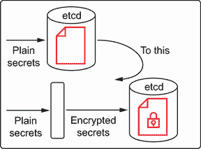

图 4.1 从纯文本密钥到加密密钥

最后，我们将使用关键管理服务（KMS）来管理加密密钥，以确保过程安全，如图 4.2 所示。

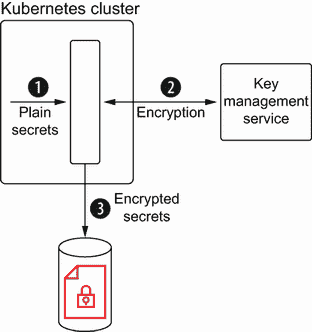

图 4.2 管理密钥的关键管理服务

## 4.1 在 Kubernetes 中加密密钥

想象一下，你有一个需要连接到数据库服务器的应用程序；显然，需要用户名和密码来访问它。这些配置值是密钥，它们需要正确存储，以便如果系统（或集群）被入侵，它们将保持保密，攻击者将无法利用它们访问应用程序的任何部分。解决方案是加密这些密钥，这样如果它们被入侵，攻击者只能得到一些字节数据，而不是真实值。

### 4.1.1 静态数据与传输数据

我们在第三章中详细介绍了 *静态数据* 的特征——持久数据，很少更改——广泛地。另一方面，*传输中的数据*，或 *运动中的数据*，是指从一个位置移动到另一个位置的数据，通常通过网络。您可以通过在各方通信期间使用相互 TLS 协议来保护传输中的数据（图 4.3），但这超出了本书的范围；我们将专注于如何保护静态数据。在解决不加密静态数据的问题之前，您需要创建一个纯文本密钥，并通过直接查询 `etcd` 服务器来获取它，就像攻击者可能做的那样。

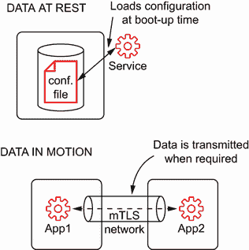

图 4.3 传输中的数据需要在通信级别加密

### 4.1.2 纯文本密钥

让我们使用 `kubectl` 工具通过使用 `etcdctl` CLI 查询 etcd 服务器来创建一个密钥。

创建密钥

在终端窗口中，切换到 `default` Kubernetes 命名空间，并创建一个新的密钥，包含两个键值对：

```
kubectl config set-context --current --namespace=default

kubectl create secret generic db-secret --from-literal=username=devuser
➥--from-literal=password=devpassword
```

我们可以使用 `kubectl` 工具列出创建的密钥：

```
kubectl get secrets

NAME                  TYPE                                  DATA   AGE
db-secret             Opaque                                2      47s
```

安装 etcdctl

`etcdctl` 是一个用于与 `etcd` 服务器交互的命令行客户端，用于查询数据库中存储的键，以及其他操作。这个工具可以帮助理解数据是如何存储在 `etcd` 数据库中的。

工具的安装过程可能因您使用的操作系统而异；有关更详细的说明，请参阅本书中使用的 `etcd` 版本的官方安装指南（[`github.com/etcd-io/etcd/releases/tag/v3.4.14`](https://github.com/etcd-io/etcd/releases/tag/v3.4.14)）。

访问 etcd

`etcd` 服务器正在 `kube-system` 命名空间下运行，端口为 2379。由于您正在使用 minikube，您可以使用端口转发功能直接从您的本地机器访问 `etcd` 服务器。在终端窗口中，运行以下命令以在 `localhost` 主机上暴露 `etcd`：

```
kubectl port-forward -n kube-system etcd-minikube 2379:2379
```

重要 如果您运行前面的命令，您将得到以下错误：`Error from server (NotFound): pods "etcd-minikube" not found`。运行以下命令以获取您环境的名称：

```
kubectl get pods -n kube-system

NAME                                 READY   STATUS    RESTARTS   AGE
coredns-66bff467f8-mh55d             1/1     Running   1          5m22s
etcd-vault-book                      1/1     Running   1          5m36s
kube-apiserver-vault-book            1/1     Running   0          3m21s
kube-controller-manager-vault-book   1/1     Running   1          5m36s
kube-proxy-lbhd6                     1/1     Running   1          5m22s
kube-scheduler-vault-book            1/1     Running   1          5m36s
storage-provisioner                  1/1     Running   1          5m36s
```

在此情况下，`etcd` Pod 的名称是 `etcd-vault-book`。

访问 `etcd` 服务器的第二步是将正在运行的 Pod 中的 `etcd` 证书复制到本地机器。打开一个新的终端窗口，并使用 `kubectl` 工具复制证书：

```
kubectl cp kube-system/etcd-minikube:/var/lib/minikube/certs/etcd/peer.key
➥/tmp/peer.key
kubectl cp kube-system/etcd-minikube:/var/lib/minikube/certs/etcd/peer.crt
➥/tmp/peer.crt
```

重要 etcd-minikube 是一个与 `etcd` Pod 名称匹配的目录。根据您的环境进行修改。

最后，您可以将 `etcdctl` 配置为连接到 `etcd` 服务器并查询之前步骤中创建的密钥。`etcd` 以键值格式组织其内容；对于密钥对象的特定情况，内容存储在以下格式的键中：

```
/registry/secrets/<namespace>/<secret_name>.
```

按照终端窗口中所示执行以下命令。

列表 4.1 配置 `etcdctl`

```
export \                                           ①
  ETCDCTL_API=3 \
  ETCDCTL_INSECURE_SKIP_TLS_VERIFY=true  \
  ETCDCTL_CERT=/tmp/peer.crt \
  ETCDCTL_KEY=/tmp/peer.key

etcdctl get /registry/secrets/default/db-secret    ②
```

① 使用环境变量配置 etcdctl

② 查询 etcd 数据库以获取密钥。

输出应该类似于以下列表所示。请注意，尽管输出并不完全清晰，但并不难看出密钥内容。

列表 4.2 `etcdctl` 输出

```
/registry/secrets/default/db-secret
k8s

v1Secret 
N
    db-secretdefault"*$df9e87f7-4eed-4f5b-985a-7888919198472   z
password
        devpassword       ①
usernamedevuserOpaque"
```

① 密钥未加密，但以纯文本形式存储。

您可以通过终止进程（在第一个终端上按 Ctrl-C）来停止端口转发，因为您目前不需要它。

您现在应该明白，如果 `etcd` 服务器被入侵，将没有任何东西阻止攻击者以纯文本形式获取所有密钥。在下一节中，您将探索存储加密密钥的第一个解决方案。

### 4.1.3 加密密钥

要使用静态加密数据，您需要引入一个新的 Kubernetes 对象，名为 `EncryptionConfiguration`。在这个对象中，您将指定您想要加密的 Kubernetes 对象；它可以是密钥对象，但实际上可以加密任何其他 Kubernetes 对象。您还需要指定密钥提供者，这是一个可插拔的系统，您在其中指定要使用的加密算法和加密密钥。

在撰写本文时，以下提供者是受支持的：

+   *身份*—未启用加密；资源按原样写入。

+   *aescbc*—使用 PKCS#7 填充算法的 AES-CBC；这是静态加密的最佳选项。

+   *secretbox*—使用 XSalsa20 和 Poly1305 算法；这是一个新标准，但在审查级别高的环境中可能不适用。

+   *aesgcm*—使用随机 nonce 算法的 AES-GCM；仅在您实现自动密钥轮换时推荐。

+   *kms*—使用信封加密模式；密钥加密密钥由配置的 KMS 管理。这是最安全的方法，您将在本章后面探索它。

要检查 Kubernetes 中静态加密数据的工作方式，重复上一节中的练习，但这次将 Kubernetes 配置为加密机密。

启用静态数据加密

重要的是要理解，静态数据加密发生在运行在主节点上的 `kube-apiserver` 上。如果启用，每次将 Kubernetes 对象发送到 Kubernetes 集群时，`kube-apiserver` 都会将对象加密的任务委托给加密配置部分，在将对象发送到 etcd 数据库存储之前进行加密。显然，当需要使用机密时，它会自动解密，因此从开发者的角度来看，不需要做任何特殊操作；他们像往常一样工作（图 4.4）。

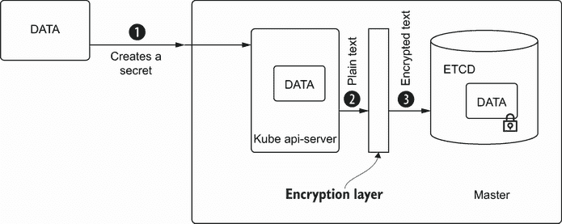

图 4.4 加密层在将机密发送到 etcd 之前自动加密。

现在生成一个 `EncryptionConfiguration` 对象，以确保任何 Kubernetes 机密都使用 `aescbc` 算法和随机加密密钥进行加密，如下面的列表所示。

列表 4.3 `EncryptionConfiguration`

```
apiVersion: apiserver.config.k8s.io/v1
kind: EncryptionConfiguration
resources:
  - resources:
    - secrets                                                   ①
    providers:
    - aescbc:
        keys:
        - name: key1
          secret: b6sjdRWAPhtacXo8mO1cfgVYWXzwuls3T3NQOo4TBhk=  ②
    - identity: {}
```

① 机密内容被加密，但任何 Kubernetes 资源都是有效的。

② 加密数据使用的加密密钥

提示：要生成 Base64 的随机密钥，您可以使用 `openssl` 或 `head` 等工具：

```
openssl rand -base64 32

head -c 32 /dev/urandom | base64 -i -
```

如您所记，加密发生在 `kube-apiserver` 进程中，这意味着您需要将加密配置文件实体化到运行它的主节点上。访问主节点的过程因每个 Kubernetes 平台而异；在 minikube 中，通过运行 `minikube` `ssh` 命令来获得主节点上的 SSH 会话。一旦进入主节点，运行 `sudo` `-i` 命令以超级用户身份执行以下命令。

列表 4.4 SSH’d minikube

```
minikube ssh
sudo -i
```

提示：如果您遇到类似 `Error getting config` 的错误，则需要使用 `-p` 标志指定 minikube 配置文件。您可以使用 `minikube profile list` 列出当前活动配置文件：

```
minikube profile list

|--------|-----------|---------|----------------|------|---------|---------|
|Profile | VM Driver | Runtime |       IP       | Port | Version | Status  |
|--------|-----------|---------|----------------|------|---------|---------|
|istio   | virtualbox| docker  | 192.168.99.116 | 8443 | v1.18.6 | Stopped |
|kube    | virtualbox| docker  | 192.168.99.117 | 8443 | v1.18.6 | Started |
|--------|-----------|---------|----------------|------|---------|---------|

minikube ssh -p kube.
```

然后在 SSH 实例内部运行 `sudo` 命令。

列表 4.5 更新到超级用户

```
sudo -i
```

到目前为止，您已进入 minikube VM，其中 `kube-apiserver` 正在运行。让我们在 `/var/lib/minikube/certs/encryptionconfig.yaml` 创建一个新文件，其内容如下面的列表所示。

列表 4.6 encryptionconfig.yaml

```
echo "
apiVersion: apiserver.config.k8s.io/v1
kind: EncryptionConfiguration
resources:
  - resources:
    - secrets
    providers:
    - aescbc:                                                ①
        keys:
        - name: key1
          secret: b6sjdRWAPhtacXo8mO1cfgVYWXzwuls3T3NQOo4TBhk=
    - identity: {}
"  | tee /var/lib/minikube/certs/encryptionconfig.yaml       ②
```

① 加密提供者

② tee 命令为指定的文件创建回显内容。

文件在主节点上创建。现在我们可以通过输入 `exit` 两次来退出 SSH 终端。

```
exit

exit
```

现在你已经回到你的电脑上，但你在密钥加密之前仍需要完成最后一步：更新 `kube-apiserver` 以获取上一步骤中创建的 EncryptionConfiguration 文件。要配置 `kube-apiserver` 进程，你需要将 `--encryption-provider-config` 参数值设置为 EncryptionConfiguration 路径。在 `minikube` 中这样做最简单的方法是停止实例，然后使用 `--extra-config` 参数重新启动它。

提示：如果你没有使用 minikube，以下链接提供了有关在 Kubernetes `kube-apiserver` 中设置此配置属性的信息：[`kubernetes.io/docs/reference/command-line-tools-reference/kube-apiserver/`](https://kubernetes.io/docs/reference/command-line-tools-reference/kube-apiserver/)。

```
minikube stop
minikube start --vm-driver=virtualbox
➥--extra-config=apiserver.encryption-provider-config=/var/lib/minikube/
➥certs/encryptionconfig.yaml
```

### 4.1.4 创建密钥

在一个终端窗口中，切换到 `default` Kubernetes 命名空间，并创建一个名为 `db-secret-encrypted` 的新密钥，包含两个键值对。

```
kubectl config set-context --current --namespace=default

kubectl create secret generic db-secret-encrypted
➥--from-literal=username=devuser --from-literal=password=devpassword
```

到目前为止，密钥的创建方式与之前相同，但让我们探讨一下数据如何在 `etcd` 内部存储。

访问 etcd

让我们在访问 `etcd` 的部分中重复执行完全相同的步骤，以获取 `db-secret-encrypted` 密钥的内容，并验证现在它是加密的而不是明文。

在一个终端窗口中，在本地主机上公开 `etcd` 服务器：

```
kubectl port-forward -n kube-system etcd-minikube 2379:2379
```

在另一个终端中，重复复制 `etcd` 证书的过程，并使用环境变量配置 `etcdctl`：

```
kubectl cp kube-system/etcd-minikube:/var/lib/minikube/certs/etcd/peer.key
➥/tmp/peer.key
kubectl cp kube-system/etcd-minikube:/var/lib/minikube/certs/etcd/peer.crt
➥/tmp/peer.crt

export \
  ETCDCTL_API=3 \
  ETCDCTL_INSECURE_SKIP_TLS_VERIFY=true  \
  ETCDCTL_CERT=/tmp/peer.crt \
  ETCDCTL_KEY=/tmp/peer.key
```

现在，你可以查询 `etcd` 以获取 `db-secret-encrypted` 键的值，以验证它是否已加密，其值是否无法解密：

```
etcdctl get /registry/secrets/default/db-secret-encrypted
```

输出应类似于以下内容：

```
/registry/secrets/default/db-secret-encrypted
cm 9> * -        ~ 6I    =@    e    .  
                         8Y
t  p  b                     V    w  6 ̒  l  v  Ey q. ^ Z 
➥ n xh  $   d  1  y  Q  q  LJ }       I w  %;
```

与上一节不同，密钥在 `kube-apiserver` 中加密，然后发送到 `etcd` 服务器进行存储。你可以通过终止进程（在第一个终端中按 Ctrl-C）来停止端口转发，因为你目前不需要这样做。

现在，你可以看到攻击者可以访问 `etcd` 服务器或 `etcd` 的备份（请防止这种情况发生），但密钥是使用 `EncryptionConfiguration` 对象中配置的密钥加密的。但这足够了吗？

密钥的安全性

使用 `EncryptionConfiguration`，你增加了攻击者需要克服的障碍才能访问明文密钥，但你仍然有一些弱点。这些弱点源于加密密钥在主节点文件系统中以明文形式存储。如果攻击者能够访问主机器，他们可以访问 EncryptionConfiguration 文件，获取密钥，查询加密密钥，并使用从主节点窃取的密钥解密它们。

这里主要的问题之一是加密数据的密钥与数据本身一起存储（图 4.5）。任何可以访问你的主节点的攻击者都可能访问密钥和解密密钥。换句话说，如果主节点被入侵，你并没有在很大程度上提高安全性。

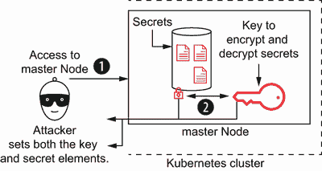

图 4.5 一个被攻陷的集群意味着数据和用于解密数据的密钥都暴露了。

为了避免这种向量攻击，加密密钥和数据应该存储在不同的机器上。这样，攻击者需要攻破多个系统才能获取到秘密，如图 4.6 所示。

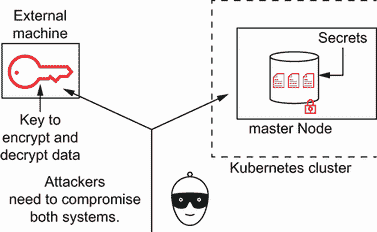

图 4.6 将数据和密钥分割到不同的机器上使系统更安全。

除了这个问题之外，在采用之前的方法时，还需要考虑其他缺点：

+   密钥需要使用外部工具手动生成。

+   密钥管理过程是手动完成的。

+   密钥轮换是一个手动过程，需要更新 EncryptionConfiguration 文件，这将对`kube-apiserver`进程的重新启动产生影响。

显然，通过加密秘密，你已经改进了你的安全模型，这可能已经足够，取决于你的用例和预期的安全级别，但仍有改进的空间。在下一节中，我们将深入了解如何在 Kubernetes 中使用 KMS 来在不同机器上存储加密密钥和加密数据。

## 4.2 密钥管理服务器

之前的应用程序秘密被加密了，但用于加密它们的密钥没有得到保护。任何未授权的访问都会导致它们丢失，并给攻击者解密应用程序秘密的机会。现在你将改进之前的应用程序，在使用 Kubernetes 时保护这些密钥。

为了提高用于加密数据的密钥的安全性，你需要将 KMS 部署在 Kubernetes 集群外部。这样，密钥在集群外部管理，而秘密存储在集群内部（`etcd`）。

这种新的方法使得可能的攻击者难以获取你的秘密，因为必须攻破两个系统。首先，攻击者需要访问`etcd`或磁盘备份来获取秘密，假设他们获取到了，这些秘密将只是一堆加密的字节。接下来，攻击者需要获取解密这些密钥，但与前一部分不同的是，现在密钥不在同一台机器上，也不是以明文形式存储。需要攻破第二个系统，因为攻击者需要访问 KMS 并获取用于加密时解密秘密的密钥。当然，这仍然是可能的，但你已经增加了一层需要被破坏的保护。

为了保持你的秘密得到保护，并对可能的攻击具有弹性，你需要将密钥和加密数据存储在同一台机器上的做法改为明确区分密钥和加密数据存储的位置。KMS 是一个服务器，它集中管理加密密钥，并为处理传输中的数据提供一些加密操作的能力。这使得它成为将密钥和数据存储完全分离的完美工具。

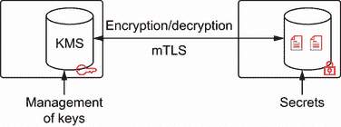

图 4.7 用于加密和解密的密钥由 KMS 管理。

### 4.2.1 Kubernetes 和 KMS 提供商

在启用静态加密数据部分，您已经看到 Kubernetes 可以使用静态加密来加密秘密，并支持多种数据加密提供商——其中之一就是 KMS 提供商。当使用外部 KMS 时，建议使用此提供商。

KMS 加密提供者的重要特性是它使用信封加密方案来加密所有数据。了解这个方案的确切工作原理以及为什么它被用于在`etcd`中存储数据非常重要。

信封加密

要使用信封加密方案，你需要三份数据：要加密的数据（秘密）、数据加密密钥（DEK）和密钥加密密钥（KEK）。每次需要加密新数据时，都会生成一个新的数据加密密钥（DEK）并用于加密数据。如您所见，每份数据（或秘密）都由一个新的加密密钥（DEK）加密，并且是即时创建的。

除了数据加密密钥之外，信封加密方案还有一个密钥加密密钥。这个密钥用于加密数据加密密钥（DEK）。相比之下，KEK 只生成一次，并存储在第三方系统，如 KMS 中。

此时，有两个加密的字节数据块：使用 DEK 加密的数据和用 KEK 加密的 DEK。图 4.8 显示了这两个数据块以及它们是如何加密的。

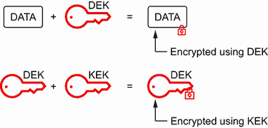

图 4.8 数据使用 DEK 加密，DEK 使用 KEK 加密。

这两部分被拼接在一起，并作为单一数据块存储在一起。这种方法的一个重大优点是每个数据都有自己的加密密钥，这意味着如果数据加密密钥被泄露（例如，通过暴力破解），攻击者只能解密那个秘密，而不能解密其他秘密。图 4.9 显示了整个过程。

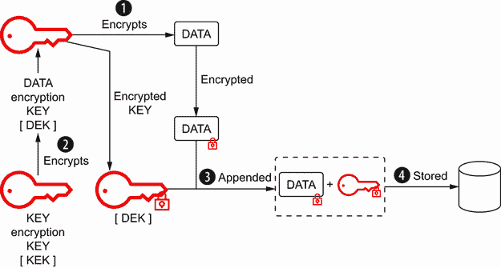

图 4.9 信封加密方案

要解密一个秘密，使用相反的过程。首先，将数据再次分成两块数据（加密的秘密和加密的 DEK）；使用 KEK 解密 DEK，最后使用解密后的 DEK 解密秘密，如图 4.10 所示。

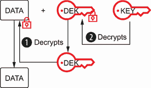

图 4.10 解密信封加密方案

Kubernetes 和信封加密

Kubernetes KMS 加密提供者使用以下方式使用信封加密：每次需要加密数据时，都会使用 AES-CBC 与 PKCS7#填充算法生成一个新的数据加密密钥（DEK）。然后使用由远程 KMS 管理的密钥加密密钥（KEK）加密 DEK。图 4.11 显示了此过程。

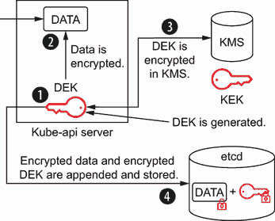

图 4.11 Kubernetes 和信封加密方案

HashiCorp Vault 作为 KMS

使用 KMS 提供商是加密和解密秘密最安全的方式，但您需要一个管理密钥加密密钥并加密数据加密密钥的 KMS 实现。但 Kubernetes 集群如何与远程 KMS 通信呢？为了与远程服务器通信，KMS 提供商使用 gRPC 协议与部署在 Kubernetes 主节点上的 Kubernetes KMS 插件进行通信。此插件充当`kube-apiserver`和 KMS 之间的桥梁，将`kube-apiserver`的加密和解密流程适配到远程 KMS 所需的协议。图 4.12 显示了此协议。

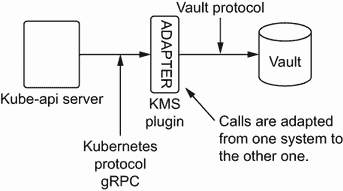

图 4.12 KMS 提供程序/插件系统

已经有多个 Kubernetes KMS 插件得到原生支持，包括 IBM Key Protect、SmartKey、AWS KMS、Azure Key Vault、Google Cloud KMS 和 HashiCorp Vault 等。由于本书旨在编写时对云服务提供商保持中立，您将使用 HashiCorp Vault 作为远程 KMS，但请记住，这个过程将与这里解释的任何其他 KMS 实现的过程类似。

目前，不必担心 HashiCorp Vault 是什么，因为我们在下一章将深入探讨这个问题，因为它提供了许多针对特定秘密的关键特性。但就这一特定章节而言，将 HashiCorp Vault 视为一种可部署的服务，它提供了一个端点来加密和解密传输中的数据而不存储它。所有密钥管理都在 Vault 服务内部进行，因此从用户的角度来看，数据被发送到服务，并根据用例返回加密或解密的数据。在下一节中，我们将开始将密钥从主节点移动到外部 KMS。

小贴士：KMS 插件系统被设计为可扩展的，因此您可以针对特定的 KMS 实现实现一个新的插件。通常，这不应该需要，因为大多数 KMS 提供商都提供与 Kubernetes 的集成，但请记住，没有任何东西阻止您自己实现 Kubernetes KMS 插件。

安装 HashiCorp Vault

我们反复强调，秘密和加密密钥应该部署在不同的机器上，这意味着 KMS 必须独立于 Kubernetes 主节点运行。

在实际场景中，您应该始终以这种方式进行操作，但在这个学术用例中，我们使用在 VM 内部运行的 minikube，为了简化，您将在 VM 内部但不在 Kubernetes 集群外部安装 HashiCorp Vault。图 4.13 说明了配置。

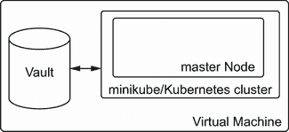

图 4.13 HashiCorp Vault 作为 KMS

重要提示：在本节末尾，我们将提供一个命令，该命令执行一个脚本，自动化以下各节中解释的所有步骤。尽管这个过程是自动化的，但我们将解释整个过程，以便您可以在任何其他环境中重复它。

要安装 HashiCorp Vault，您需要将其下载并安装到虚拟机中，并在 `systemd` 中将其注册为服务，以便每次启动虚拟机时自动启动。以下列出步骤。

列表 4.7 安装脚本

```
curl -sfLo vault.zip https://releases.hashicorp.com/vault/1.1.2/
➥vault_1.1.2_linux_amd64.zip                                      ①
unzip vault.zip
sudo mv vault /usr/bin/
sudo chmod +x /usr/bin/vault                                       ②
cat <<EOF | sudo tee /etc/profile.d/vault.sh
export VAULT_ADDR=http://127.0.0.1:8200
EOF
source /etc/profile.d/vault.sh                                     ③
sudo addgroup vault
sudo adduser -G vault -S -s /bin/false -D vault                    ④
sudo mkdir -p /etc/vault/{config,data}

cat <<EOF | sudo tee /etc/vault/config/config.hcl
disable_mlock = "true"
backend "file" {
  path = "/etc/vault/data"
}
listener "tcp" {
  address     = "0.0.0.0:8200"
  tls_disable = "true"
}
EOF

sudo chown -R vault:vault /etc/vault                               ⑤
cat <<"EOF" | sudo tee /etc/systemd/system/vault.service
[Unit]
Description="HashiCorp Vault - A tool for managing secrets"
Documentation=https://www.vaultproject.io/docs/
Requires=network-online.target
After=network-online.target
[Service]
User=vault
Group=vault
ExecStart=/usr/bin/vault server -config=/etc/vault/config
ExecReload=/bin/kill --signal HUP $MAINPID
ExecStartPost=-/bin/sh -c "/bin/sleep 5 && /bin/vault operator unseal
➥-address=http://127.0.0.1:8200 $(/bin/cat /etc/vault/init.json |
➥/bin/jq -r .unseal_keys_hex[0])"
KillMode=process
KillSignal=SIGINT
Restart=on-failure
RestartSec=5
TimeoutStopSec=30
StartLimitBurst=3

[Install]
WantedBy=multi-user.target
EOF

sudo systemctl start vault
```

① 下载并安装 Vault。

② 设置配置文件。

③ 创建一个运行 Vault 的用户。

④ 创建 Vault 配置。

⑤ 设置 systemd 以启动 Vault。

警告：在此示例中，监听地址已设置为 `0.0.0.0`，因此任何主机都可以访问 Vault 服务器。这对于非生产环境或教育目的来说是可行的，但在实际环境中，您应该适当地进行配置。

配置传输密钥引擎

Vault 需要解密，以便可以从外部访问，并且传输密钥引擎将被启用，这样 Vault 就可以用于加密和解密传输中的数据。如果您仍然不理解为什么需要这些步骤，请不要担心，我们将在下一章中更详细地介绍它们。

对于这个特定的示例，您将配置 Vault，使其可以通过提供 `vault-kms-k8s-plugin-token` 值作为令牌的用户访问，并创建一个名为 `my-key` 的加密密钥：

```
vault operator init -format=json -key-shares=1 -key-threshold=1 |
➥sudo tee /etc/vault/init.json                                  ①
vault operator unseal "$(cat /etc/vault/init.json |
➥jq -r .unseal_keys_hex[0])"                                    ②
vault login "$(cat /etc/vault/init.json | jq -r .root_token)"    ③
vault token create -id=vault-kms-k8s-plugin-token                ④
vault secrets enable transit                                     ⑤
vault write -f transit/keys/my-key
```

① 初始化并解密 Vault。

② 使用根令牌登录 Vault。

③ 启用传输密钥引擎。

④ 创建一个特殊的令牌以访问传输密钥引擎。

⑤ 创建加密密钥。

安装 Vault KMS 提供程序

Vault 启动并运行后，您需要安装和设置 Vault KMS 提供程序/插件。对于 KMS 提供程序，有四个重要的配置项：

1.  加密密钥名称（`my-key`）

1.  Vault 服务器运行地址（`127.0.0.1`）

1.  访问 Vault 所需的令牌（`vault-kms-k8s-plugin-token`）

1.  Vault KMS 提供程序的套接字文件（`/var/lib/minikube/certs/vault-k8s-kms-plugin.sock`）

记住，KMS 提供程序是一个 gRPC 服务器，它充当 `kube-apiserver` 和 KMS 之间的桥梁。以下列出步骤。

列表 4.8 安装 `kms vault 脚本`

```
curl -sfLo vault-k8s-kms-plugin https://github.com/lordofthejars/      ①
➥kubernetes-vault-kms-plugin/releases/download/book/
➥vault-k8s-kms-plugin-amd64
unzip vault-k8s-kms-plugin.zip
sudo mv vault-k8s-kms-plugin /bin/vault-k8s-kms-plugin
sudo chmod +x /bin/vault-k8s-kms-plugin

sudo mkdir -p /etc/vault-k8s-kms-plugin                                ②
cat <<EOF | sudo tee /etc/vault-k8s-kms-plugin/config.yaml
keyNames:
- my-key
transitPath: /transit
addr: http://127.0.0.1:8200
token: vault-kms-k8s-plugin-token
EOF

sudo chown -R vault:vault /etc/vault-k8s-kms-plugin                    ③
cat <<EOF | sudo tee /etc/systemd/system/vault-k8s-kms-plugin.service
[Unit]
Description="KMS transit plugin"
Requires=vault.service
After=vault.service
[Service]
User=root
Group=root                                                             ④
ExecStart=/usr/bin/vault-k8s-kms-plugin -socketFile=/var/lib/minikube/
➥certs/vault-k8s-kms-plugin.sock -vaultConfig=/etc/vault-k8s-kms-plugin/
➥config.yaml
ExecReload=/bin/kill --signal HUP $MAINPID
KillMode=process
KillSignal=SIGINT
Restart=on-failure
RestartSec=5
TimeoutStopSec=30
StartLimitBurst=3
[Install]
WantedBy=multi-user.target
EOF

sudo systemctl start vault-k8s-kms-plugin
```

① 下载 Vault KMS 插件。

② 将插件配置为我们在上一节中在 Vault 中配置的参数。

③ 设置 systemd 以启动 Vault KMS 插件。

④ 设置 Vault KMS 插件启动的套接字文件。

配置 Kubernetes KMS 提供程序

在之前的示例中，为了启用静态加密数据，您创建了一个 EncryptionConfiguration 文件以在 Kubernetes 集群中启用静态加密数据。现在您需要创建一个 EncryptionConfiguration 文件来配置 Vault KMS 提供程序而不是 `aescbc` 提供程序。图 4.14 展示了 Kubernetes-api 服务器如何与 Kubernetes KMS 插件交互。

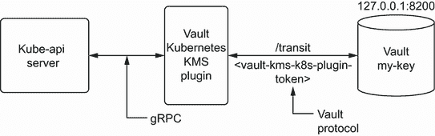

图 4.14 HashiCorp Vault 作为 KMS

需要设置的重要参数是 `endpoint`，因为那是提供者/插件进行通信的位置。在本例中，它已在之前的步骤中配置，使用 `socketFile` 参数设置为 `/var/lib/minikube/certs/vault-k8s-kms-plugin.sock`。

```
cat <<EOF | sudo tee /var/lib/minikube/certs/encryption-config.yaml
kind: EncryptionConfiguration
apiVersion: apiserver.config.k8s.io/v1
resources:
- resources:
  - secrets
  providers:
  - kms:                                                                  ①
      name: vault
      endpoint: unix:///var/lib/minikube/certs/vault-k8s-kms-plugin.sock  ②
      cachesize: 100
  - identity: {}
EOF
```

① 使用 KMS 作为提供者。

② 设置之前步骤中指定的 socketFile。

图 4.15 显示了当使用 KMS 时和使用 KMS 时不使用时的 EncryptionConfiguration 文件之间的差异。

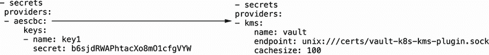

图 4.15 加密配置与 KMS 加密配置的比较

重新启动 kube-apiserver

最后一步是重新启动 `kube-apiserver`，以便新配置生效，并使用 Vault 作为远程 KMS 进行信封加密。在过去，您需要重新启动整个 minikube 实例，但在此情况下，您将通过仅重新启动 `kubelet` 进程来使用不同的方法。

```
sudo sed -i '/- kube-apiserver/ a \ \ \ \ - --encryption-provider-config=/ ①
➥var/lib/minikube/certs/encryption-config.yaml' /etc/kubernetes/
➥manifests/kube-apiserver.yaml                                            ②
sudo systemctl daemon-reload
sudo systemctl stop kubelet
docker stop $(docker ps -aq)
sudo systemctl start kubelet
```

① kube-apiserver 已配置为使用创建以使用 KMS 的 EncryptionConfiguration 文件

② kubelet 已重新启动。

将一切整合

如前所述，提供了一个脚本以自动执行所有之前的步骤。此外，我们建议您现在使用一个新的 minikube 实例，以便您有一个干净且在 VM 内安装了 Vault 的 minikube 实例。

在 `vault` 配置文件下创建一个 minikube 实例，SSH 到运行 Kubernetes 集群的 VM，并运行执行所有之前解释步骤的脚本。执行以下命令：

```
minikube stop                                                           ①
minikube start -p vault --memory=8192 --vm-driver=virtualbox            ②
➥--kubernetes-version='v1.18.6'
minikube ssh "$(curl https://raw.githubusercontent.com/lordofthejars/   ③
➥vault-kubernetes-tutorial/master/scripts/install_vault_kms.sh -s)"
➥-p vault
```

① 停止之前的 minikube 实例。

② 在 vault 配置文件下启动一个新的 minikube 实例。

③ 执行脚本以配置 KMS 提供者。

### 4.2.2 创建机密

在一个终端窗口中，创建一个名为 `kms-db-secret-encrypted` 的新机密，包含两个键值条目：

```
kubectl create secret generic kms-db-secret-encrypted
➥--from-literal=username=devuser --from-literal=password=devpassword
```

在此阶段，机密的创建方式与之前相同，但机密使用信封加密方案加密。让我们探索数据如何在 `etcd` 内部存储。

访问 etcd

重复您在访问 `etcd` 以获取 `kms-db-secret-encrypted` 机密内容时遵循的完全相同的流程，并验证它已加密存储而不是以纯文本形式存储。在一个终端窗口中，在本地主机上公开 `etcd` 服务器：

```
kubectl port-forward -n kube-system etcd-vault 2379:2379
```

在另一个终端中，重复复制 `etcd` 证书的流程，并使用环境变量配置 `etcdctl`：

```
kubectl cp kube-system/etcd-vault:/var/lib/minikube/certs/etcd/peer.key
➥/tmp/peer.key
kubectl cp kube-system/etcd-vault:/var/lib/minikube/certs/etcd/peer.crt
➥/tmp/peer.crt

export \
  ETCDCTL_API=3 \
  ETCDCTL_INSECURE_SKIP_TLS_VERIFY=true  \
  ETCDCTL_CERT=/tmp/peer.crt \
  ETCDCTL_KEY=/tmp/peer.key
```

您现在可以查询 `etcd` 以获取 `kms-db-secret-encrypted` 键的值，以验证它已加密且其值无法解密。

```
etcdctl get /registry/secrets/default/kms-db-secret-encrypted
```

输出应类似于以下列表。

列表 4.9 加密 KMS 机密

```
/registry/secrets/default/kms-db-secret-encrypted
cm 9> * -        ~ 6I    =@    e    .  
                         8Y
t  p  b                     V    w  6 ̒  l  v  Ey q. ^ Z 
➥ n xh  $   d  1  y  Q  q  LJј}        I w  %;
```

与上一节不同，机密在 `kube-apiserver` 中使用信封加密方案加密，然后发送到 `etcd` 服务器存储。您可以通过终止进程（在第一个终端上按 Ctrl-C）来停止端口转发，因为您目前不需要这样做。您还可以停止当前的 minikube 实例并启动默认实例，该实例仅包含一个运行的 Kubernetes 实例：

```
minikube stop -p vault

minikube start
```

## 摘要

+   默认情况下，`etcd` 中不加密机密；因此，您需要找到一种方法来加密它们，以防止任何访问 `etcd` 的攻击者读取它们。

+   `EncryptionConfiguration` Kubernetes 对象在配置 Kubernetes 加密资源（机密）方面至关重要，但如果未使用远程 KMS，则加密数据和加密密钥都存储在同一台机器上。

+   为了允许数据和密钥存储在不同的机器上，Kubernetes 支持使用远程 KMS。
