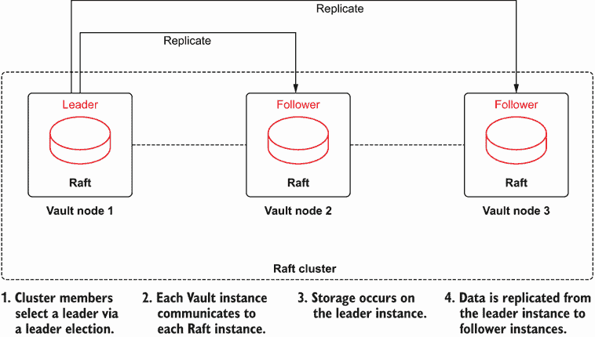
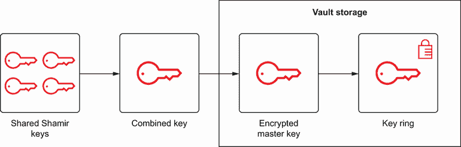
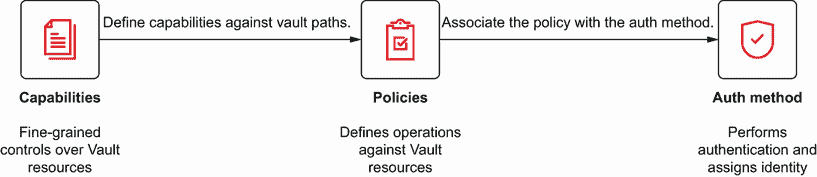
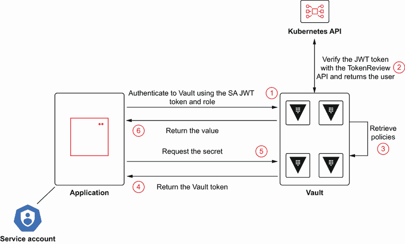
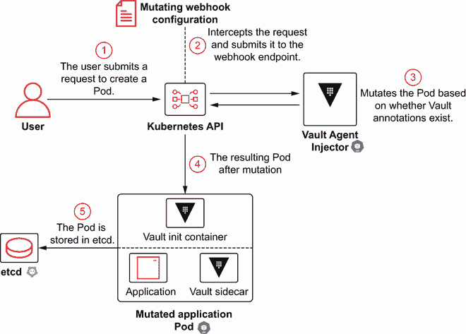

# 5 HashiCorp Vault 和 Kubernetes

本章涵盖

+   启用 HashiCorp Vault 以供部署到 Kubernetes 的最终用户应用程序使用

+   集成 Kubernetes 认证以简化对 Vault 资源的访问

+   通过部署到 Kubernetes 的应用程序访问存储在 HashiCorp Vault 中的秘密

第四章介绍了 HashiCorp Vault 作为一种 KMS，可用于为存储在 `etcd`（Kubernetes 的键/值存储）中的秘密和其他资源提供加密，因此这些值不能轻易访问，因为它们是静态存储的。

本章重点介绍了使用像 HashiCorp Vault 这样的秘密管理工具的重要性，以安全地存储和管理部署到 Kubernetes 的应用程序的敏感资产，并展示了如何配置应用程序和 Vault 以实现彼此的无缝集成。通过使用 Vault 这样的工具，应用团队可以将管理敏感资源的一些责任转移到专门构建的工具上，同时仍然能够与他们的应用程序集成。

## 5.1 使用 HashiCorp Vault 管理应用程序秘密

如您迄今为止所看到的，敏感资产可以被 Kubernetes 的核心基础设施组件或部署到平台上的应用程序使用。第四章主要关注基础设施部分，以及如何通过使用 HashiCorp Vault 加密值来正确保护 Kubernetes 的主要数据库 `etcd`。虽然 Vault 可以帮助保持平台的安全，但它更常用于存储和保护用于应用程序的属性。

当像第四章中描述的那样在 `etcd` 中保护存储的值时，Vault 被用作中介来执行使用 Vault 的传输秘密加密和解密数据所需的加密功能。对于部署到 Kubernetes 的应用程序，它们自身并不是设计为作为秘密存储的，它们会寻找另一个更适合此目的的工具。这就是 Vault 可以作为解决方案的地方。

假设您想使用 Vault 存储全球各地部署的字节代理的秘密位置。虽然在这种情况下可以使用数据库，但我们将演示如何使用部署到 Kubernetes 的 Vault 实例以安全的方式存储任意数据，并在部署到 Kubernetes 的应用程序中访问这些值（图 5.1）。


图 5.1 Vault 中的秘密存储以及请求访问以检索存储值的应用程序

### 5.1.1 在 Kubernetes 上部署 Vault

在第四章中，您在 minikube VM 中安装了 HashiCorp Vault，以在 Kubernetes 基础设施组件（尤其是 `etcd`）和 KMS 之间提供清晰的分离。由于 `etcd` 对 Kubernetes 集群的功能至关重要，您应确保它们之间没有相互依赖，以确保正常操作（即所谓的“先有鸡还是先有蛋”的困境）。

由于应用程序和 KMS（反之亦然）之间的硬依赖性较小，并且为了能够利用 Kubernetes 本身的大多数好处（例如，调度和应用程序健康监控），Vault 将部署到 Kubernetes 以充当应用程序的 KMS。您可以使用几种方法将 Vault 部署到 Kubernetes，但最直接的方法是使用 Helm。从 HashiCorp 可用的图表（[`github.com/hashicorp/vault-helm`](https://github.com/hashicorp/vault-helm)）支持大多数部署选项，无论是用于开发实例还是支持生产就绪集群。

要开始使用，请从任何目录使用终端首先将 Hashicorp 仓库添加到 Helm，其中包含 Vault 图表：

```
helm repo add hashicorp https://helm.releases.hashicorp.com

"hashicorp" has been added to your
```

然后从远程仓库检索最新更新，这将把内容拉到您的机器上：

```
helm repo update

Hang tight while we grab the latest from your chart repositories...
...Successfully got an update from the "hashicorp" chart repository
Update Complete. ⎈ Happy Helming!⎈
```

Vault 使用集成 RaftHA（高可用性）存储进行高可用性存储

每次部署 Vault 时，下一个考虑因素是您将如何处理其元数据的存储。当 Vault 在 Kubernetes 之外的 minikube VM 中部署时，使用了文件系统存储类型。此配置将持久化到本地文件系统，并且是让 Vault 运行起来的简单方法。然而，当使用生产式部署时，文件系统存储类型是不理想的，因为它只支持单个实例。

在 Kubernetes 上部署 Vault 的另一个好处，除了上述好处以及与更生产式部署的愿望相一致之外，是能够轻松实现高可用性（HA）。然而，要超越单个实例，需要使用除文件系统之外的不同存储类型。虽然 Vault 支持多种外部存储后端，从关系型数据库和 NoSQL 数据库到云对象存储，但一个简单且高可用且没有外部依赖的选项是使用 Raft 的集成存储（图 5.2）。



图 5.2 领导者选举和 Raft 存储的数据复制

Raft 是一种分布式 **一致性算法**，在发生选举后，多个成员形成一个集群。根据选举结果确定领导者，当他们在确定集群的共享状态并将状态复制到每个跟随者方面承担责任时。任何集群的最小数量是 3（*N*/2+1，其中 *N* 是总节点数）以确保在发生故障时有最小数量的节点。Raft 是一种常见协议，当它在高可用配置下运行时，被云原生空间中的其他解决方案使用，包括 `etcd`。

在了解支持 Vault 高可用性部署所需的存储需求后，通过设置 `server.ha.enabled=true` 和 `server.ha.raft.enabled=true` 的值来安装 Vault Helm 图表，这将启用高可用性并启用 Raft。此外，由于您正在尝试将高可用性部署部署到单个 minikube 节点，请将 `server.affinity` 的值设置为 `""`；这将跳过默认的 Pod 亲和性配置，该配置会尝试将每个 Vault Pod 调度到不同的节点，从而导致调度失败。执行以下列表中的命令来安装图表。

列表 5.1 使用 Helm 部署 vault

```
helm upgrade -i vault hashicorp/vault \           ①
  --set='server.ha.enabled=true' \                ②
  --set='server.ha.raft.enabled=true' \           ③
  --set='server.affinity=""' -n vault \           ④
  --create-namespace                              ⑤
```

① 指定发布名称和要安装的图表名称。

② 在高可用性模式下启用 Vault。

③ 在高可用性模式下启用 Raft。

④ 禁用 Pod 亲和性。

⑤ 如果尚不存在，创建一个名为 vault 的命名空间。

确认已将三个 Vault 实例部署到 `vault` 命名空间：

```
kubectl get pods -n vault

NAME                                    READY   STATUS    RESTARTS   AGE
vault-0                                 0/1     Running   0          76s
vault-1                                 0/1     Running   0          76s
vault-2                                 0/1     Running   0          76s
vault-agent-injector-76d54d8b45-dvzww   1/1     Running   0          76s
```

除了预期的三个 Vault 实例外，还有一个以 `vault-agent-injector` 为前缀的 Pod 也已部署，其目的是动态地将机密注入到 Pod 中。Vault Agent Injector 将在本章的后面详细讨论。如果 Vault 或 Vault Injector Pod 中任何一个当前不在 `Running` 状态，或者没有任何 Pod 出现，请使用 `kubectl get events -n vault` 命令来调查此类问题的原因。

Vault 部署后，第一步是初始化 Vault。由于存在多个 Vault 实例，其中一个实例应被指定为初始领导者——在本例中为 `vault-0`。

首先检查 Vault 的状态，它应该表明尚未初始化：

```
kubectl -n vault exec -it vault-0 -- vault operator init -status

Vault is not initialized
```

现在初始化 Vault，以便您可以开始与之交互，操作如下。

列表 5.2 初始化 vault

```
kubectl -n vault exec -it vault-0 -- vault operator init     ①
```

① 输出将显示可用于解密 Vault 的每个密钥以及初始根令牌。

当 Vault 初始化时，它将被置于 *密封* 模式，这意味着它知道如何访问存储层，但不能解密任何内容。当 Vault 处于密封状态时，它类似于银行保险库，资产安全，但无法进行任何操作。要能够与 Vault 交互，必须将其解密。

*解封*是获取访问主密钥的过程。然而，这个密钥只是 Vault 中数据加密的一部分。当数据存储在 Vault 中时，它使用一个*加密密钥*进行加密。这个密钥与数据一起存储在 Vault 中，并使用另一个密钥加密，称为*主密钥*。然而，这还没有结束。主密钥也存储在 Vault 中的数据中，并再次使用*解封密钥*进行加密。解封密钥随后使用称为 Shamir 的密钥共享算法分布到多个碎片中。为了重建*封印密钥*，必须提供一定数量的碎片，这将允许访问组合密钥，最终访问 Vault 中存储的数据（图 5.3）。



图 5.3 解封 Vault 的步骤

当 Vault 初始化时，提供了五个解封密钥，代表将用于构建组合密钥的碎片。默认情况下，需要三个密钥来重建组合密钥。开始为`vault-0`实例解封 Vault 的过程。

执行以下命令以开始解封过程。当提示时，输入在以下列表中执行的`vault` `operator` `init`命令旁边`Unseal Key 1`的值。

```
kubectl -n vault exec -it vault-0 -- vault operator unseal

Unseal Key (will be hidden):
```

列表 5.3 解封 Vault 的进度

```
Key                Value
---                -----
Seal Type          shamir
Initialized        true
Sealed             true
Total Shares       5
Threshold          3
Unseal Progress    1/3              ①
Unseal Nonce       fbb3714f-27cb-e362-ba40-03db093aea23
Version            1.7.2
Storage Type       raft
HA Enabled         true
```

① 解封进度

解封过程正在进行中，如列表 5.3 中所示的`Unseal` `Progress`行表明已输入了一个密钥。执行相同的`kubectl` `-n` `vault exec` `-it` `vault-0—vault` `operator` `unseal`命令两次，当提示时提供`Unseal Key 2`、`Unseal Key 3`等旁边的值。

继续提供密钥，直到您看到以下列表中的输出类似结果。

列表 5.4 一个解封的 Vault 实例

```
Key                     Value
---                     -----
Seal Type               shamir
Initialized             true
Sealed                  false                           ①
Total Shares            5
Threshold               3
Version                 1.7.2
Storage Type            raft
Cluster Name            vault-cluster-c5e28066          ②
Cluster ID              0a3170f4-b486-7358-cba7-381349056f3e
HA Enabled              true                            ③
HA Cluster              n/a
HA Mode                 standby
Active Node Address     <none>
Raft Committed Index    24
```

① 封存状态

② 集群名称

③ 高可用模式状态

`vault-0`实例现在已解封。然而，由于 Vault 正在运行在 HA 模式，其他两个成员必须加入新创建的集群并经历解封过程。

首先将`vault-1`实例加入 Raft 集群，如下所示。

列表 5.5 将新节点加入 Raft 集群

```
kubectl -n vault exec -ti vault-1 -- vault operator \
  raft join http://vault-0.vault-internal:8200         ①

Key       Value
---       -----
Joined    true
```

① Raft 领导者的地址

接下来执行以下命令三次，提供不同的解封密钥，就像在`vault-0`中完成的那样：

```
kubectl -n vault exec -it vault-1 -- vault operator unseal

Unseal Key (will be hidden):
```

在`vault-1`实例上完成这些步骤后，在`vault-2`实例上执行`vault operator` `join`和`vault` `operator` `unseal`命令。

要确认高可用 Vault 集群已就绪，请使用`vault operator` `init`命令提供的`Initial` `Root` `Token`登录到`vault-0`实例，如下所示：

```
kubectl -n vault exec -it vault-0 -- vault login

Token (will be hidden):
Success! You are now authenticated. The token information displayed below
is already stored in the token helper. You do NOT need to run "vault login"
again. Future Vault requests will automatically use this token.

Key                  Value
---                  -----
token                s.cm8HyaIxR2MPseDxTvOU7ugD
token_accessor       Fx23YMxqiYabU8u5Ptt2qpcH
token_duration       ∞
token_renewable      false
token_policies       ["root"]
identity_policies    []
policies             ["root"]
```

现在您已使用 root 令牌登录，通过列出所有 Raft 成员来确认所有成员是否已成功加入 Vault 集群：

```
kubectl -n vault exec -ti vault-0 -- vault operator raft list-peers

Node                                 Address                     State    Voter
----                                 -------                     -----    -----
8b58cb62-7da7-5e8d-298b-95d4e8203ea5 vault-0.vault-internal:8201 leader   true
4cef7124-d40a-bba8-4dac-4830936ceea3 vault-1.vault-internal:8201 follower true
d1a8d5fd-82be-feb7-a3e7-ca298d81d050 vault-2.vault-internal:8201 follower true
```

注意 `vault-0` 被列为 `leader`，其他两个成员是 `followers`，如 `State` 列所示。如果出现三个 Raft 实例，请确认每个成员在列表 5.5 中都成功加入。此时，高可用性的 Vault 已部署到 minikube 实例。

密钥管理引擎

我们之前讨论过可以作为 Vault 信息持久化存储使用的存储后端类型。Vault 内部数据的实际存储、生成和加密由支持的密钥管理引擎之一提供便利。密钥管理引擎可以执行简单的操作，如存储或读取数据。然而，更复杂的密钥管理引擎可能会调用外部资源按需生成资产。第四章中描述的传输密钥管理引擎有助于加密和解密存储在 `etcd` 中的值，但对于需要从 Vault 中检索值的程序，例如本章中你打算实现的程序，可以使用键/值或 `kv` 密钥管理引擎。

`kv` 引擎确实如其名称所示：它允许在 Vault 中存储键值对。这个密钥管理引擎随着时间的推移而发展，截至本文撰写时，有两个版本可以使用。

+   `kv`*版本 1*—非版本化的键值对存储。更新值会覆盖现有值。由于没有存储支持版本化的额外元数据的要求，存储占用空间较小。

+   `kv`*版本 2*—支持版本化的键值对。它提供了增强的数据避免意外覆盖的支持。需要额外的存储空间来存储用于跟踪版本化的元数据。

在这种情况下，可以使用任意的 `kv` 版本，但鉴于大多数实现都使用版本 2，因此将使用该版本。密钥管理引擎在 Vault 的特定 *路径* 或位置上启用。对于你的应用程序，你将使用 `agents` 路径。

在启用 `kv` 引擎之前，列出所有启用的密钥管理引擎：

```
kubectl -n vault exec -it vault-0 -- vault secrets list

Path       Type      Accessor            Description
----       ----      --------            -----------
cubbyhole/ cubbyhole cubbyhole_4cc71c5d  per-token private secret storage
identity/  identity  identity_9f9aa91a   identity store
sys/       system    system_8f066be3     system endpoints used for control,
                                         policy and
```

现在，在 `agents` 路径上启用 `kv-v2` 密钥管理引擎以启用存储键值对密钥，如下所示。

列表 5.6 启用 `kv` 密钥管理引擎

```
kubectl -n vault exec -it vault-0 -- vault secrets enable \
  -path=agents \                                           ①
  -version=2 \                                             ②
  kv-v2                                                    ③

Success! Enabled the kv-v2 secrets engine at: agents/
```

① Vault 中 kv 密钥管理引擎的位置

② 密钥管理引擎的版本

③ 要启用的引擎名称

在 `agents` 路径上启用了引擎后，你现在可以存储一些值。每个代理将与它们的键相关联几个属性：

+   `名称`

+   `电子邮件`

+   `位置`

为代理 `bill` 创建一个新的条目：

```
kubectl -n vault exec -it vault-0 -- vault kv put agents/bill \
  id="Bill Smith" \
  email="bill@acme.org" \
  location="New York, USA"

Key              Value
---              -----
created_time     2021-05-29T17:20:48.24905171Z
deletion_time    n/a
destroyed        false
version          1
```

从 Vault 中检索存储的值同样简单：

```
kubectl -n vault exec -it vault-0 -- vault kv get agents/bill

====== Metadata ======
Key              Value
---              -----
created_time     2021-05-29T17:20:48.24905171Z
deletion_time    n/a
destroyed        false
version          1

====== Data ======
Key         Value
---         -----
email       bill@acme.org
location    New York, USA
name        Bill Smith
```

现在你已经确认能够成功添加和检索密钥，添加几个更多代理：

```
kubectl -n vault exec -it vault-0 -- vault kv put agents/jane \
  id="Jane Doe" \
  email="jane@acme.org" \
  location="London, United Kingdom"
kubectl -n vault exec -it vault-0 -- vault kv put agents/maria \
  id="Maria Hernandez" \
  email="maria@acme.org" \
  location="Mexico City, Mexico"
kubectl -n vault exec -it vault-0 -- vault kv put agents/james \
  id="James Johnson" \
  email="james@acme.org" \
  location="Tokyo, Japan"
```

到目前为止，Vault 中应该存储了四个密钥。

应用程序访问和安全

当前用于与 Vault 交互的根令牌具有对 Vault 所有能力的无限制访问权限，不建议在与应用程序交互的 Vault 服务器中使用。相反，应用最小权限原则，应使用单独的方法让应用程序对 Vault 进行认证。Vault 支持多种认证方法，供消费者识别自身，包括用户名和密码、TLS 证书以及前面提到的令牌，仅举几例。

可以将一种或多种*策略*与认证方法关联，这些策略定义了在 Vault 中对不同路径的权限。每个策略都与*能力*相关联，这些能力提供了对特定路径的细粒度控制（图 5.4）。



图 5.4 能力、策略和认证方法之间的关系

以下是在 Vault 中可用的能力集：

+   `create`—允许在给定路径上创建数据

+   `read`—允许在给定路径上读取数据

+   `delete`—允许在给定路径上删除数据

+   `list`—允许在给定路径上列出值

策略可以以 JSON 或 HashiCorp 配置语言（HCL [兼容 JSON]）格式编写，并在创建时通过 CLI 提交给 Vault 服务器。

创建一个名为`agents-policy.hcl`的新文件，该文件将定义提供对`agents`路径中的`read`和`list`值访问权限的策略，如下所示。

列表 5.7 创建策略以管理对 Vault 内容的访问

```
path "agents/data/*" {
  capabilities = ["list", "read"]    ①
}

path "agents/metadata/*" {
  capabilities = ["list", "read"]
}
```

① 与给定路径关联的能力列表

重要版本化的内容，如`kv`版本 2，存储以`data/`为前缀的内容，这在`kv`版本 1 中被省略，在设计策略时必须考虑。

通过将列表 5.7 中创建的.hcl 策略文件复制到 Vault Pod 并创建策略，创建一个名为`agents_reader`的新策略：

```
cat agents-policy.hcl | \
  kubectl -n vault exec -it vault-0 -- vault policy write agents_reader -

Unable to use a TTY - input is not a terminal or the right kind of file
Success! Uploaded policy: agents_reader
```

现在创建一个新的令牌，该令牌可用于代理应用程序，并且仅提供对`agents`路径的访问权限，并将其分配给名为`AGENTS_APP_TOKEN`的变量，如下所示。

列表 5.8 为代理应用程序创建令牌

```
export AGENTS_APP_TOKEN=$(kubectl -n vault exec -it vault-0 \
  -- vault token create -policy=agents_reader -format=yaml | \    ①
  grep client_token |  awk '{ print $2 }')                        ②
```

① 创建令牌并以 yaml 格式打印输出

② 从响应中提取令牌

您可以通过查找其详细信息来查看有关令牌的信息：

```
kubectl -n vault exec -it vault-0 -- vault token lookup $AGENTS_APP_TOKEN

Key                 Value
---                 -----
accessor            9N8JDsdVrGfspYILad3DxZUq
creation_time       1622320692
creation_ttl        768h
display_name        token
entity_id           n/a
expire_time         2021-06-30T20:38:12.973925141Z
explicit_max_ttl    0s
id                  s.1ErBLPR3QTrNks8HhLNQcpjv       ①
issue_time          2021-05-29T20:38:12.973933315Z
meta                <nil>
num_uses            0
orphan              false
path                auth/token/create
policies            [agents_reader default]
renewable           true
ttl                 767h51m20s
type
```

① 可以用于与代理路径交互的令牌的 ID

如果命令返回了错误或没有任何值，请确认列表 5.8 中分配的`$AGENTS_APP_TOKEN`值的正确性。

默认情况下，*有效期限*（TTL），或令牌有效的时长，设置为 32 天。在许多企业组织中，限制令牌有效的时间长度可以增加安全性，并在令牌被泄露的情况下减少威胁向量。要显式设置令牌的有效期限，可以将`-ttl`标志添加到`vault token create`命令中，以自定义令牌的有效时长。

确认令牌只能查看 `agents` 路径中的资源，如 `agents_reader` 策略所述。首先，将当前根令牌备份到 Vault Pod 中的另一个位置，以便稍后可以恢复访问：

```
kubectl -n vault exec -it vault-0 -- \
  cp /home/vault/.vault-token \
  /home/vault/.vault-token.root
```

现在使用列表 5.8 中创建的新令牌登录：

```
echo $AGENTS_APP_TOKEN | kubectl -n vault exec -it vault-0 -- vault login -

Unable to use a TTY - input is not a terminal or the right kind of file
Success! You are now authenticated. The token information displayed below
is already stored in the token helper. You do NOT need to run "vault login"
again. Future Vault requests will automatically use this token.

Key                  Value
---                  -----
token                s.1ErBLPR3QTrNks8HhLNQcpjv
token_accessor       9N8JDsdVrGfspYILad3DxZUq
token_duration       767h26m48s
token_renewable      true
token_policies       ["agents_reader" "default"]
identity_policies    []
policies             ["agents_reader" "default"]
```

登录会显示与令牌关联的键信息，包括其有效时间和包含的权限。确认 `agents` 路径中的密钥可以被列出：

```
kubectl -n vault exec -it vault-0 -- vault kv list /agents

Keys
---
bill
james
jane
maria
```

如果发生错误，请确认策略已正确创建，从列表 5.7 开始。

如果密钥被正确列出，尝试访问资源，例如列出令牌不应具有访问权限的已启用密钥管理引擎：

```
kubectl -n vault exec -it vault-0 -- vault secrets list

Error listing secrets engines: Error making API request.

URL: GET http://127.0.0.1:8200/v1/sys/mounts
Code: 403\. Errors:

* 1 error occurred:
        * permission denied
```

确认权限级别受限后，通过将备份令牌复制到 Vault 期望的默认位置来恢复根令牌，以便您可以再次执行提升权限：

```
kubectl -n vault exec -it vault-0 -- \
  cp /home/vault/.vault-token.root \
  /home/vault/.vault-token
```

确认可以执行提升请求，以便后续步骤可以实施：

```
kubectl -n vault exec -it vault-0 -- vault secrets list
```

### 5.1.2 将应用程序部署到访问 Vault

使用可以访问 Vault 中 `agents` 路径的令牌，部署一个演示在 Vault 中访问值的应用程序。源代码可在 GitHub 上找到（[`mng.bz/WMXa`](http://mng.bz/WMXa)），但本章不会从编程角度介绍该应用程序本身。

第一步是创建一个名为 `agents-vault-token` 的 Kubernetes Secret，它将包含我们的令牌，该令牌将被注入为应用程序中的环境变量，以便它可以与 Vault 进行通信：

```
kubectl create secret generic agents-vault-token \
  --from-literal=token=$(echo -n $AGENTS_APP_TOKEN | tr -d '\r\n')

secret/agents-vault-token created
```

创建一个名为 `serviceaccount.yml` 的文件，以定义一个名为 `agents` 的 Kubernetes 服务账户，将其与应用程序关联，如下所示。始终建议每个工作负载在单独的服务账户下执行，以便仅委派所需的必要权限。这将在列表 5.14 中进一步详细说明。

列表 5.9 serviceaccount.yml

```
---
apiVersion: v1
kind: ServiceAccount
metadata:
  name: agents
```

创建引用以下清单的 `agents` 服务账户：

```
kubectl -n vault apply -f serviceaccount.yml

serviceaccount/agents created
```

创建一个名为 `deployment_token_auth.yml` 的文件，包含使用之前在 `agents-vault-token` secret 中定义的令牌进行基于令牌认证的应用程序清单，如下所示。

列表 5.10 deployment_token_auth.yml

```
---
apiVersion: apps/v1
kind: Deployment
metadata:
  name: agents
spec:
  replicas: 1
  selector:
    matchLabels:
      app: agents
  strategy:
    rollingUpdate:
      maxSurge: 25%
      maxUnavailable: 25%
    type: RollingUpdate
  template:
    metadata:
      labels:
        app: agents
    spec:
      containers:
        - env:
            - name: QUARKUS_VAULT_AUTHENTICATION_CLIENT_TOKEN
              valueFrom:
                secretKeyRef:           ①
                  key: token
                  name: agents-vault-token
          image: quay.io/ablock/agents
          imagePullPolicy: Always
          name: agents
          ports:
            - containerPort: 8080
              protocol: TCP
      restartPolicy: Always
      serviceAccountName: agents
```

① 存储在 Kubernetes secret 中并作为环境变量注入的令牌

将部署应用到集群以创建应用程序：

```
kubectl -n vault apply -f deployment_token_auth.yml

deployment.apps/agents
```

部署创建后，确认应用程序正在运行：

```
kubectl -n vault get pods -l=app=agents

NAME                     READY   STATUS    RESTARTS   AGE
agents-595b85fc6-6fdbj   1/1     Running   0          66s
```

Vault 令牌通过 `QUARKUS_VAULT_AUTHENTICATION_CLIENT_TOKEN` 环境变量暴露给应用程序。然后应用程序框架促进与 Vault 服务器的后端通信。

现在测试应用程序以确认可以接收值。应用程序在端口 8080 上通过 /agents 端点公开一个 restful 服务，可以用于查询 Vault 中存储的代理。

首先通过定位正在运行的`agents` Pod 的名称，然后调用`/agents/bill`端点来尝试定位代理`bill`的记录。

```
AGENTS_POD=$(kubectl get pods -l=app=agents \
  -o jsonpath={.items[0].metadata.name})
kubectl -n vault exec -it $AGENTS_POD -- \
  curl http://localhost:8080/agents/bill

{"email":"bill@acme.org","location":"New York, USA","name":"Bill Smith"}
```

既然您能够检索到一个有效的结果，现在尝试检索一个不存在的值，应该返回一个空的结果：

```
kubectl -n vault exec -it $AGENTS_POD -- \
  curl http://localhost:8080/agents/bad
```

随意查询存储在 Vault 中的其他代理，以全面测试应用程序。在下一节中，您将探索如何避免使用 Vault 令牌来认证访问 Vault。

## 5.2 Kubernetes 认证方法

5.1.2 节探讨了应用程序如何使用 Vault 令牌，使用令牌认证方法与 Vault 服务器交互以访问存储的值。虽然使用令牌访问 Vault 相对简单，但它需要额外的步骤来管理令牌的生命周期，这最终可能导致整体安全态势的降低。

如 5.1 节所述，Vault 支持多种认证方法。由于您在 Kubernetes 环境中操作，您可以利用不同的方法——*Kubernetes 认证方法*——来简化应用程序与 Vault 的交互。使用此方法将防止您需要管理访问 Vault 的令牌的额外任务。

Kubernetes 认证方法并没有消除令牌的概念（恰恰相反），但它不是管理源自 Vault 的单独令牌，而是使用与 Kubernetes 服务账户关联的 JSON Web Tokens (JWTs)。在 Kubernetes 上运行的应用程序通过 Pod 内挂载的服务账户令牌（`/var/run/secrets/kubernetes.io/serviceaccount/token`）与 Vault 交互。然后在 Vault 中创建*角色*，这些角色将 Kubernetes 服务账户与定义了授予访问级别的 Vault 策略映射。Kubernetes 认证方法中涉及的组件图示在图 5.5 中。



图 5.5 Kubernetes 认证方法中涉及的组件概述

### 5.2.1 配置 Kubernetes 认证

您的第一步是在 Vault 中启用 Kubernetes 认证方法：

```
kubectl -n vault exec -it vault-0 -- vault auth enable kubernetes

Success! Enabled kubernetes auth method at: kubernetes/
```

由于 Vault 将与 Kubernetes 服务账户交互，它必须能够验证提交的令牌与谁关联，以及它是否仍然有效。幸运的是，Kubernetes 提供了 TokenReview API，正是为了这个目的，并且本质上执行 JWT 令牌的反向查找。通过使用给定服务账户的 JWT 令牌对 TokenReview API 进行认证，将返回有关账户的详细信息，包括但不限于用户名。

为了使 Vault 能够与 Kubernetes TokenReview API 交互以检查应用程序提供的令牌，它必须被授予执行此类请求的权限。在名为`vault-tokenreview-serviceaccount.yml`的文件中创建一个新的服务账户`vault-tokenreview`，该账户将被 Kubernetes 认证方法使用，如下所示。

列表 5.11 vault-tokenreview-serviceaccount.yml

```
---
apiVersion: v1
kind: ServiceAccount
metadata:
  name: vault-tokenreview      ①
```

① 将由 Kubernetes 认证方法使用的服务账户的名称

现在创建 `vault-tokenreview` 服务账户，使用列表 5.11 中创建的清单：

```
kubectl -n vault apply -f vault-tokenreview-serviceaccount.yml

serviceaccount/vault-tokenreview
```

现在已经创建了 `vault-tokenreview` 服务账户，必须授予其对 Token Review API 进行请求的权限。有一个内置的 Kubernetes `ClusterRole` 提供这种级别的访问权限，称为 `system:auth-delegator`。在名为 `vault-tokenreview-binding.yml` 的文件中创建一个新的 `ClusterRoleBinding`，名为 `vault-tokenreview-binding`，包含以下内容。

列表 5.12 vault-tokenreview-binding.yml

```
apiVersion: rbac.authorization.k8s.io/v1
kind: ClusterRoleBinding
metadata:
  name: vault-tokenreview-binding
roleRef:
  apiGroup: rbac.authorization.k8s.io
  kind: ClusterRole
  name: system:auth-delegator
subjects:
  - kind: ServiceAccount
    name: vault-tokenreview
    namespace: vault
```

从 `vault-tokenreview-binding.yml` 文件中的清单创建 `ClusterRoleBinding`：

```
kubectl -n vault apply -f vault-tokenreview-binding.yml

clusterrolebinding.rbac.authorization.k8s.io/vault-tokenreview-binding created
```

由于 Vault 需要使用 `vault-tokenreview` 服务账户的 JWT 来与 Kubernetes 通信，请执行以下命令组，首先找到包含 JWT 令牌的 Kubernetes 机密名称，然后是存储在机密中的 Base64 解码的令牌值。

列表 5.13 设置 Vault `TokenReview` 变量

```
SA_SECRET_NAME=$(kubectl -n vault get serviceaccount vault-tokenreview \
  -o jsonpath={.secrets[0].name})                                          ①
VAULT_TOKENREVIEW_SA_TOKEN=$(kubectl -n vault get secret $SA_SECRET_NAME \
  -o jsonpath='{.data.token}' | base64 -d)                                 ②
```

① 定位与 vault-tokenreview 服务账户关联的机密名称

② 获取 vault-tokenreview 服务账户的 JWT 令牌

接下来，通过提供 Kubernetes API 的位置、证书颁发机构的证书以及列表 5.13 中获取的服务账户的 JWT，指定 Kubernetes 集群的配置：

```
kubectl -n vault exec -it vault-0 -- vault write auth/kubernetes/config \
  kubernetes_host="https://kubernetes.default.svc" \
  kubernetes_ca_cert="@/var/run/secrets/kubernetes.io/\
  serviceaccount/ca.crt" \token_reviewer_jwt=$VAULT_TOKENREVIEW_SA_TOKEN

Success! Data written to: auth/kubernetes/config
```

现在，Vault 能够进行身份验证请求后，想要从 Vault 内部获取资源的应用程序必须与它们关联一个角色，以获取 Vault 中存储的值。一个 *角色* 包括提交请求的服务账户的名称和命名空间，以及一组 Vault 策略。回想列表 5.10，Agents 应用程序正在使用名为 `agents` 的服务账户运行。虽然之前在运行应用程序时使用的服务账户之间几乎没有区别，但在此处需要它以方便使用 Kubernetes 认证方法与 Vault 集成。执行以下操作以在 Vault 中创建一个名为 `agents` 的新角色：

列表 5.14 创建 Vault 角色

```
kubectl -n vault exec -it vault-0 -- \
  vault write auth/kubernetes/role/agents \          ①
  bound_service_account_names=agents \               ②
  bound_service_account_namespaces=vault \           ③
  policies=agents_reader                             ④

 Success! Data written to: auth/kubernetes/role/agents
```

① 创建名为 agents 的新角色的路径

② 要与角色关联的服务账户的名称

③ 包含与角色关联的服务账户的命名空间

④ 应用到角色的策略

在 Vault 中创建角色的操作允许 Agents 应用程序使用 Kubernetes 认证方法从 Vault 获取值。

### 5.2.2 测试和验证 Kubernetes 认证

为了测试和验证 Agents 应用程序中 Kubernetes 认证的集成，首先删除任何可能仍然存在的先前基于令牌认证方法的现有工件，因为它们将不再需要：

```
kubectl -n vault delete deployment agents
kubectl -n vault delete secrets agents-vault-token
```

注意：请忽略任何与资源未找到相关的错误。此步骤确保您有一个实现 Kubernetes 认证方法的全新环境。

在先前部署的 Agents 应用程序中，`QUARKUS_VAULT_AUTHENTICATION_CLIENT_TOKEN` 包含了用于对 Vault 进行认证的令牌值。当迁移到 Kubernetes 认证方法时，将使用 `QUARKUS_VAULT_AUTHENTICATION_KUBERNETES_ROLE` 代替，并引用 Vault 中在列表 5.14 中创建的 `agents` 角色。

创建一个名为 `deployment_kubernetes_auth.yml` 的文件，包含以下 Deployment 定义。

列表 5.15 deployment_kubernetes_auth.yml

```
---
apiVersion: apps/v1
kind: Deployment
metadata:
  name: agents
spec:
  replicas: 1
  selector:
    matchLabels:
      app: agents
  strategy:
    rollingUpdate:
      maxSurge: 25%
      maxUnavailable: 25%
    type: RollingUpdate
  template:
    metadata:
      labels:
        app: agents
    spec:
      containers:
        - env:
            - name: QUARKUS_VAULT_AUTHENTICATION_KUBERNETES_ROLE
              value: "agents"
          image: quay.io/ablock/agents
          imagePullPolicy: Always
          name: agents
          ports:
            - containerPort: 8080
              protocol: TCP
      restartPolicy: Always
      serviceAccountName: agents
```

现在根据列表 5.15 中创建的清单创建部署：

```
kubectl -n vault apply -f deployment_kubernetes_auth.yml

deployment.apps/agents
```

一旦应用程序启动，查询代理 `maria` 以确认存储在 Vault 中的值可以成功检索，从而验证 Kubernetes 认证方法已成功集成。

```
kubectl -n vault exec -it $(kubectl get pods -l=app=agents \
  -o jsonpath={.items[0].metadata.name}) -- \
  curl http://localhost:8080/agents/maria

{"email":"maria@acme.org","location":"Mexico City,
➥Mexico","name":"Maria Hernandez"}
```

成功的响应展示了如何使用 Kubernetes 认证方法从 Vault 中检索机密，而不需要明确地为应用程序提供一个 Vault 令牌进行认证。如果没有返回成功的结果，请确认本节中描述的步骤。

## 5.3 Vault 代理注入器

Kubernetes 认证方法简化了在 Kubernetes 上部署的应用程序访问 Vault 中存储的值的方式。使用令牌或 Kubernetes 认证方法（如 5.2.1 节所述）所面临的挑战之一是，应用程序需要了解 Vault。在许多情况下，尤其是在遗留应用程序或第三方供应商提供的应用程序中，可能无法修改源代码来配置此类集成。

为了克服这些挑战，出现了几种方法，利用 Kubernetes 生态系统中的模式来解决如何使存储在 Vault 中的值可供应用程序使用。每种方法都依赖于 Kubernetes 中 Pod 的一个关键特性，通过该特性可以使用 `emptyDir` 卷类型在容器之间共享卷。然后可以在 Pod 中打包一个单独的容器，其责任是促进与 Vault 的交互并通过共享卷向应用程序提供机密值。

在 Kubernetes 中采用了两种模式来支持这种方法：

+   *init container*—在应用程序容器启动之前执行的一个容器或一组容器。在 Vault 的上下文中，从 Vault 中检索资产并将其放置在为应用程序预先填充的共享卷中，以便应用程序可以消费。

+   *sidecar*–与应用程序容器一起运行的容器。在 Vault 的上下文中，它们继续与 Vault 交互并使用 Vault 的资产刷新共享卷的内容。

为了避免要求最终用户开发和维护他们自己的容器集以与 Vault 交互，并提供一种机制以自动将具有 Vault 意识的容器注入 Pod，HashiCorp 创建了 Vault Agent Injector。*Vault Agent Injector* 在 Kubernetes 中以 Pod 的形式运行，并监视声明在其 Pod 中的注解以寻求成为 Vault 意识的应用程序。一旦将注入器安装到集群中，当创建任何其他 Pod 时，就会向 Vault Agent Injector 发送一个准入 webhook，其中包含 Pod 的详细信息。如果 Pod 中存在特定的注解，特别是 `vault.hashicorp.com/agent-inject:` `true`，则修改 Pod 本身的定义以自动注入 `initContainer` 和/或 `sidecar` 容器。此过程利用了 Kubernetes 的 `MutatingWebhookConfiguration` 功能，该功能允许在资源持久化到 `etcd` 之前修改 Kubernetes 资源（图 5.6）。



图 5.6 通过 `MutatingWebhookConfiguration` 在准入时间修改 Pod 以注入 Vault Agent Injector

### 5.3.1 支持 Kubernetes Vault Agent 注入的配置

为了演示应用程序如何通过最小化对应用程序本身的更改将存储在 Vault 中的值注入，你将再次使用代理应用程序作为目标。首先在 Vault 中定义一个新的名为 `config` 的密钥，包含与应用程序相关的属性。通过 Vault Agent Injector，密钥中的值将被添加到应用程序 Pod 内的一个文件中。

首先通过以下命令在 Vault 中定义 `config` 密钥。

列表 5.16 创建键值密钥

```
kubectl -n vault exec -it vault-0 -- \
  vault kv put agents/config \            ①
  mission="Kubernetes Secrets" \          ②
  coordinator="Manning Publishing"
```

① 将数据写入指定的路径

② 将多个键值对写入密钥

在添加新值之后，下一步是修改代理应用程序的 Deployment，通过定义几个必要的注解，不仅支持自动容器注入，还可以自定义 Pod 中呈现的值。

创建一个名为 `deployment_vault_agent.yml` 的新文件，如下所示。

列表 5.17 deployment_vault_agent.yml

```
apiVersion: apps/v1
kind: Deployment
metadata:
  name: agents
spec:
  replicas: 1
  selector:
    matchLabels:
      app: agents
  strategy:
    rollingUpdate:
      maxSurge: 25%
      maxUnavailable: 25%
    type: RollingUpdate
  template:
    metadata:
      annotations:
        vault.hashicorp.com/agent-inject: "true"                   ①
        vault.hashicorp.com/role: "agents"                         ②
        vault.hashicorp.com/agent-inject-secret-config.properties:
        ➥"agents/config"                                          ③
        vault.hashicorp.com/agent-inject-template-
        ➥config.properties: |                                     ④
          {{- with secret "agents/config" }}
          {{- range $k, $v := .Data.data }}
          {{ $k }}: {{ $v }}
          {{- end }}
          {{- end }}
      labels:
        app: agents
    spec:
      containers:
        - image: quay.io/ablock/agents
          imagePullPolicy: Always
          name: agents
          ports:
            - containerPort: 8080
              protocol: TCP
      restartPolicy: Always
      serviceAccountName: agents
```

① 启用 Vault Agent 注入

② 与 Kubernetes 认证方法关联的角色名称

③ Vault 密钥的名称作为值以及应用程序 Pod 中的结果文件名

④ 描述密钥内容如何呈现的模板

Vault Agent Injector 建立在 Kubernetes 认证方法之上，因此将重用第 5.1 节中应用的部分配置。

`vault.hashicorp.com/role` 表示与运行 Pod 的服务账户相关联的角色以及授予访问 Vault 内容的策略。以 `vault.hashicorp.com/agent-inject-secret-` 开头的代码行用于定义最终将在应用 Pod 中创建的文件。此注释的值引用了 Vault 中的密钥名称。在列表 5.16 中创建的 `agents` 路径中的 `config` 密钥。注释键的其余部分引用了将在 Pod 中创建的文件名。因此，具有键 `vault.hashicorp.com/agent-inject-secret-config.properties` 的注释会在 Pod 中创建一个名为 `config.properties` 的文件。

最后，以 `vault.hashicorp.com/agent-inject-template-` 开头的代码行指的是 Consul 语言中的模板，并定义了密钥内容的渲染方式。与以 `vault.hashicorp.com/agent-inject-secret-` 开头的行类似，其余部分引用了将要创建的文件名。这里定义的模板只是遍历密钥中包含的所有键和值。

如果集群中存在现有的代理部署，请将其删除以确保不会使用 5.1.2 和 5.2 节中描述的与 Vault 的任何现有集成：

```
kubectl -n vault delete deployment agents

deployment.apps/agents
```

现在执行以下命令以创建代理部署，该部署将使用 Kubernetes Vault Agent Injector：

```
kubectl -n vault apply -f deployment_vault_agent.yml

deployment.apps/agents
```

如果您观察 `agents` Pod 的状态，您将注意到与这次部署有几种不同的情况。

```
kubectl -n vault get pod -l=app=agents

NAME                      READY   STATUS    RESTARTS   AGE
agents-795fcd5565-6f6cg   2/2     Running   0          79s
```

首先注意，在 `READY` 列下，现在有两个容器。额外的容器是负责保持从 Vault 获取的密钥内容更新的边车容器。此外，在边车容器或代理容器启动之前，Pod 中还包含一个名为 `vault-agent-init` 的初始化容器，该初始化容器在 `/vault/secrets` 挂载点处预填充了 Vault 密钥的内容。（此路径可以通过注释进行修改。）由于初始化容器必须在启动主容器之前成功完成，并且由于 Pod 中的两个容器目前都在运行，您可以放心地认为密钥值已从 Vault 中检索出来。让我们通过查看位于 `agents` 容器中 `/vault/secrets/config.properties` 文件的内容来验证这一点。

列表 5.18 查看由 vault secrets injector 创建的文件

```
kubectl -n vault exec -it $(kubectl get pods -l=app=agents \
  -o jsonpath={.items[0].metadata.name}) \                    ①
  -c agents -- cat /vault/secrets/config.properties           ②

coordinator: Manning Publishing
mission: Kubernetes Secrets
```

① 获取正在运行的代理 Pod 的名称

② 打印由 Vault Agent Injector 创建的文件的内容

您可以随意更新 Vault 中 `config` 机密的内容。Pod 内捆绑的边车容器将定期检查机密的状态，并更新应用程序容器内文件的内容。通过使用 Kubernetes Vault Agent Injector，可以在不修改应用程序的情况下自动提供 Vault 机密，完全抽象化 Vault 的使用，同时提供引用存储在 HashiCorp Vault 中的敏感值的优点。

## 摘要

+   使用 Helm 图表，可以快速轻松地将 HashiCorp Vault 安装到 Kubernetes 环境中。

+   解密 HashiCorp Vault 实例是获取纯文本根密钥的过程，以启用对底层数据的访问。

+   Kubernetes 认证方法使用 Kubernetes 服务帐户与 HashiCorp Vault 进行身份验证。

+   Kubernetes TokenReview API 提供了一种从 JWT 令牌中提取用户详情的方法。

+   HashiCorp Vault Agent Injector 修改了 Pod 的定义，使其能够获取存储在 Vault 中的机密。
