# 6 访问云秘密存储库

本章涵盖

+   使用容器存储接口（CSI）和秘密存储 CSI 驱动程序从云秘密存储库注入秘密作为卷

+   将云秘密填充到 Kubernetes 集群作为 Kubernetes Secrets

+   使用秘密存储 CSI 驱动程序中的秘密自动轮换来提高安全态势

+   从云秘密存储库中消费敏感信息

第五章介绍了 HashiCorp Vault，它可以用于安全地存储和管理部署到 Kubernetes 的应用程序的敏感资产，并演示了如何配置应用程序和 Vault 以提供彼此的无缝集成。本章扩展了上一章中介绍的想法，即使用外部秘密管理工具存储秘密并将它们注入 Pod 内，无论是作为卷还是作为环境变量。但在这章中，我们将重点关注云秘密存储库，如 Google Secret Manager、Azure Key Vault 和 AWS Secrets Manager。

首先，您将了解容器存储接口（CSI）和秘密存储 CSI 驱动程序，并使用它们将存储在 HashiCorp Vault 中的秘密注入。然后，您将了解如何使用秘密存储 CSI 驱动程序注入 Kubernetes Secrets 以及秘密自动轮换。最后，我们将讨论 CSI 驱动程序与 Google Secret Manager、Azure Key Vault 和 AWS Secrets Manager 之间的集成，以便可以从秘密存储库直接将秘密注入 Pod。

## 6.1 容器存储接口和秘密存储 CSI 驱动程序

如您迄今为止所见，`etcd` 数据库以未加密（默认情况下）或加密的形式存储 Kubernetes Secrets，如第四章所示。但如果你不想在 `etcd` 中存储你的秘密，而是想将它们存储和管理在 Kubernetes 集群之外呢？第五章中展示的一个选项是使用 HashiCorp Vault 和 HashiCorp Vault Agent 存储秘密并将它们注入 Pod。

HashiCorp Vault 是一个选项，但如今云提供商也提供了它们自己的密钥保管库；例如，Google 提供了 Google Secret Manager，而 Amazon 提供了 AWS Secrets Manager。如果你想使用它们来存储秘密而不是 `etcd` 或 Hashicorp Vault 会发生什么？你能使用之前相同的方法，但将秘密作为卷或环境变量从外部云存储库注入而不是 `etcd` 吗？

答案是肯定的！但在我们向您展示如何做之前，我们需要介绍 CSI 创新计划——一个用于将任意块和文件存储系统暴露给容器化工作负载（如 Kubernetes）的标准。

### 6.1.1 容器存储接口

正如您在第二章中所见，Kubernetes `volume` 是一个包含对运行在 Pod 内的容器中某些数据访问的目录。卷的物理存储由所使用的卷类型确定，卷在 Pod 初始化期间进行映射，执行以下步骤：

1.  API 服务器收到在 Kubernetes 集群中创建新 Pod 的命令。

1.  调度器找到一个满足所需标准的节点，并将 Pod 定义发送到该节点。

1.  节点 kubelet 读取 Pod 定义，看到您想要将卷附加到 Pod 容器，并通过卷插件创建卷。这个卷插件负责连接到配置的持久存储。

图 6.1 总结了所有这些步骤。

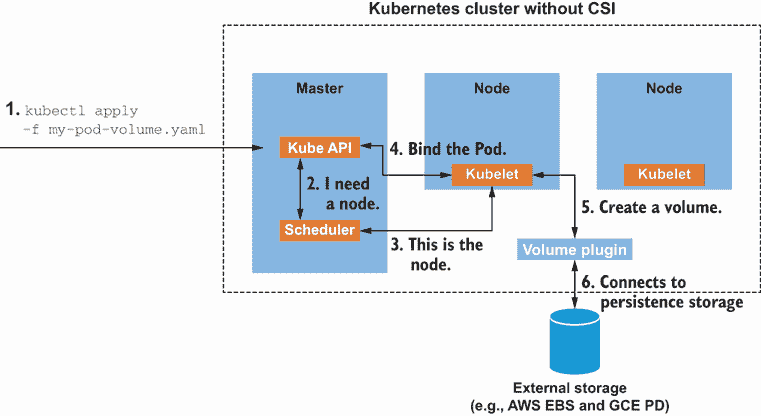

图 6.1 从 Pod 视角创建卷的过程

如您所见，*卷插件*属于 Kubernetes 核心。然而，这种方法有以下缺点：

+   卷插件开发与 Kubernetes 开发和发布周期相关联。任何新的受支持的卷（和卷插件）都需要 Kubernetes 的新版本。

+   在卷插件（例如，修复错误或改进）中的任何更正都需要发布新的 Kubernetes 版本。

+   由于卷插件在 Kubernetes 内部，源代码是开放的；这并不是问题，直到您需要将插件私有化。

CSI 是一个可以用来统一容器编排器（CO）系统（如 Kubernetes、Mesos、Docker Swarm 等）的存储接口的倡议，结合了存储供应商（如 Ceph、Azure Disk、GCE 持久磁盘等）。

CSI 的第一个含义是任何实现都保证与所有 CO 一起工作。第二个含义是 CSI 元素的定位；它们位于 CO 核心（即 Kubernetes 核心）之外，这使得它们可以独立于 CO 进行开发和发布。图 6.2 展示了 CSI 的简要概述。

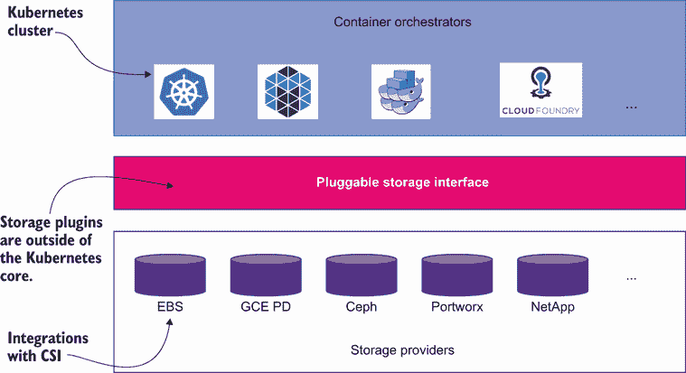

图 6.2 CSI 架构

CSI 驱动程序是容器集群和实现 CSI 规范所需操作的持久存储之间的桥梁。CSI 驱动程序提供以下功能：

+   创建持久的外部存储。

+   配置持久的外部存储。

+   管理集群和存储之间的所有输入/输出（I/O）。

+   提供高级磁盘功能，如快照和克隆。

CSI 驱动程序包括阿里云磁盘、AWS 弹性块存储、Azure 磁盘存储、CephFS、DigitalOcean 块存储和 GCE 持久磁盘。

### 6.1.2 容器存储接口和 Kubernetes

CSI 在 Kubernetes 1.13 版本中获得了一般可用性（GA）状态，并且可以与 Kubernetes 卷组件（例如，持久卷、持久卷声明和存储类）一起使用。Kubernetes 有一些不属于核心的组件，它们与外部可插拔容器存储进行交互。这种交互是通过 Google 远程过程调用（gRPCs）在域套接字上发生的。

安装了 CSI 的 Kubernetes 集群具有以下组件：

+   *Kubernetes 核心*——这是 Kubernetes 的核心，本书中介绍的大部分元素都生活在这里。

+   *CSI 外部组件*——这是一组 Linux 容器，其中包含触发适当 Kubernetes 事件到 CSI 驱动程序的通用逻辑。尽管这些容器不是必需的，但它们有助于减少实现 CSI 驱动程序所需的样板代码量。

+   *第三方外部组件*——这是与持久化存储解决方案通信的供应商特定实现。

这些组件中每个都有子组件，其中最重要的可以在图 6.3 中看到。

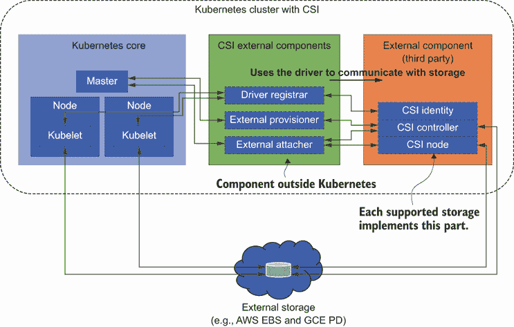

图 6.3 带有 CSI 的 Kubernetes 集群

对于本书的范围，这就是您需要了解的关于 CSI 规范及其与 Kubernetes 集成的所有内容。要实现特定持久化存储系统的特定 CSI 驱动程序，需要深入了解该系统。感谢这种关注点的分离，您现在可以编写和部署插件，在 Kubernetes 中暴露新的存储系统，而无需触及 Kubernetes 核心，因此不需要进一步发布 Kubernetes。

### 6.1.3 CSI 和密钥

CSI 旨在以标准方式将所有不同的存储系统暴露给 Kubernetes 和容器工作负载。有了这个标准，您只需在您的集群上部署插件（CSI 驱动程序）即可。这能否扩展到其他类型的系统，如密钥存储？

Secrets Store CSI 驱动程序与其他任何 CSI 驱动程序没有区别，允许 Kubernetes 将放置在外部密钥存储中的密钥附加到 Pod 作为卷。卷附加后，密钥在容器的文件系统中可用。

Secrets Store CSI 驱动程序可扩展性的一个要素是 Secrets Store CSI 提供者。驱动程序不是直接连接到密钥存储，而是通过提供者这一新的抽象级别，因此，根据所使用的密钥存储，您只需要安装特定的提供者。

在撰写本文时，以下密钥存储得到支持：

+   AWS Secrets Manager Systems Manager Parameter Store（AWS 提供者）

+   Azure Key Vault（Azure 提供者）

+   Google Secret Manager（GCP 提供者）

+   HashiCorp Vault（Vault 提供者）

图 6.4 展示了 Secrets Store CSI 架构的概览。

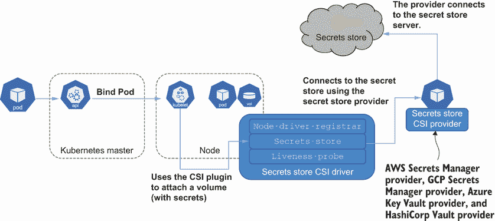

图 6.4 带有 CSI 的 Kubernetes 集群

在您使用 CSI 和 Secrets Store CSI 驱动程序之前，您需要创建一个 Kubernetes 集群并安装 CSI 和 Secrets Store CSI 驱动程序。我们将在以下部分详细说明此过程。

### 6.1.4 安装先决条件

在终端窗口中运行以下命令以启动一个新的 minikube 实例。

列表 6.1 启动 minkube

```
minikube start -p csi --kubernetes-version='v1.21.0'
➥--vm-driver='virtualbox' --memory=8196             ①
```

① 在 CSI 配置文件下创建一个 Kubernetes 集群

### 6.1.5 安装 Secrets Store CSI 驱动程序

目前 Secrets Store CSI 驱动程序的最新版本是 `0.1.0`；尽管您可能认为它是一个不成熟的项目，但事实是它已经开发很长时间了。运行以下列表中显示的命令来安装 Secrets Store CSI。

列表 6.2 安装 Secrets Store CSI 驱动程序

```
kubectl apply -f https://raw.githubusercontent.com/
➥kubernetes-sigs/secrets-store-csi-driver/v0.1.0/
➥deploy/rbac-secretproviderclass.yaml                        ①
kubectl apply -f https://raw.githubusercontent.com/
➥kubernetes-sigs/secrets-store-csi-driver/v0.1.0/
➥deploy/csidriver.yaml                                       ②
kubectl apply -f https://raw.githubusercontent.com/
➥kubernetes-sigs/secrets-store-csi-driver/v0.1.0/deploy/
➥secrets-store.csi.x-k8s.io_secretproviderclasses.yaml       ③
kubectl apply -f https://raw.githubusercontent.com/kubernetes-sigs/
➥secrets-store-csi-driver/v0.1.0/deploy/
➥secrets-store.csi.x-k8s.io_secretproviderclasspodstatuses.yaml
kubectl apply -f https://raw.githubusercontent.com/kubernetes-sigs/
➥secrets-store-csi-driver/v0.1.0/deploy/
➥secrets-store-csi-driver.yaml                               ④
```

① 为密钥提供程序配置 RBAC

② 配置 CSI 驱动程序

③ 注册 Secrets Store CRDs

④ 安装 Secrets Store CSI 驱动程序

由于我们将在密钥存储库内容与 Kubernetes 密钥之间的映射以及密钥自动轮换中使用，因此需要一些额外的 RBAC 权限来启用它，如下所示。

列表 6.3 安装 RBAC

```
kubectl apply -f https://raw.githubusercontent.com/kubernetes-sigs/
➥secrets-store-csi-driver/v0.1.0/deploy/
➥rbac-secretprovidersyncing.yaml                                    ①
kubectl apply -f https://raw.githubusercontent.com/kubernetes-sigs/
➥secrets-store-csi-driver/v0.1.0/deploy/
➥rbac-secretproviderrotation.yaml                                   ②
```

① 将 secrets-store 内容同步为 Kubernetes 密钥。

② 密钥轮换的额外 RBAC 权限

注意：如果您正在 Windows 节点上运行 Kubernetes（请注意，minikube 运行在一个 Linux 虚拟机中，因此您不需要运行该命令），您还需要运行以下命令：

```
kubectl apply -f https://raw.githubusercontent.com/kubernetes-sigs/
➥secrets-store-csi-driver/v0.1.0/deploy/
➥secrets-store-csi-driver-windows.yaml      ①
```

① 如果您正在运行 Windows 节点，请使用此命令。

为了验证 Secrets Store CSI 驱动程序的安装，运行以下列表中显示的命令以验证 Pods 是否正在正确运行。

列表 6.4 验证 Secrets Store CSI 驱动程序

```
kubectl get pods --namespace=kube-system    ①
```

① 从 kube-system 命名空间获取 Pods

您应该看到 Secrets Store CSI 驱动程序 Pods 在每个代理节点上运行：

```
csi-secrets-store-8xlcn         3/3     Running   0          4m
```

现在您已经将 Secrets Store CSI 驱动程序安装到 Kubernetes 集群中，是时候选择一个 Secrets Store CSI 提供程序并将其部署了。在第一个示例中，您将使用 HashiCorp Vault，因为它是一个无差别的密钥存储库，您已经在上一章中使用过它。

与您之前使用 HashiCorp Vault 的最大不同之处在于密钥将如何注入到 Pod 中。在第五章的一个示例中，您看到了负责执行注入的 HashiCorp Vault 代理；图 6.5 包含了 HashiCorp Vault Agent 的工作回顾。然而，在本章中，将不会使用代理，而是 Secrets Store CSI 驱动程序将注入密钥。

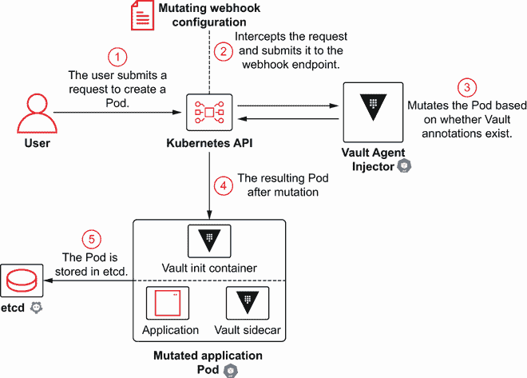

图 6.5 Pod 在 admission 时间被 `MutatingWebhookConfiguration` 修改以注入 Vault Agent Injector

### 6.1.6 通过 Secrets Store CSI 驱动程序和 HashiCorp Vault 提供程序消费 HashiCorp Vault 密钥

在本节中，您将使用 HashiCorp Vault 作为密钥存储库，并通过 Secrets Store CSI 驱动程序和 HashiCorp Vault 提供程序来消费密钥。图 6.6 展示了您在本节中将实现的内容概述。

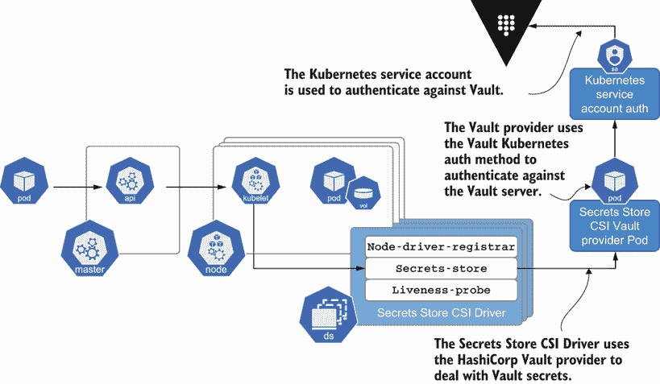

图 6.6 带有 HashiCorp Vault 提供程序的 Secrets Store CSI 驱动程序

您首先需要的是一个在 Kubernetes 集群中运行的 HashiCorp Vault 实例。您已经在第五章中部署了一个 HashiCorp Vault 实例；现在您将在当前集群中再次部署。要开始，首先按照以下步骤将 HashiCorp 仓库添加到 Helm。

列表 6.5 添加 Helm 图表

```
helm repo add hashicorp https://helm.releases.hashicorp.com    ①

"hashicorp" has been added to your
```

① 添加 HashiCorp Helm 仓库

然后从远程仓库检索最新更新：

```
helm repo update       ①

Hang tight while we grab the latest from your chart repositories...
...Successfully got an update from the "hashicorp" chart repository
Update Complete. ⎈ Happy Helming!⎈
```

① 更新图表仓库

执行以下列表中的命令以启用 Vault CSI 提供者并安装开发模式下的图表。

列表 6.6 使用 Secrets Store CSI 提供者部署 HashiCorp Vault

```
helm install vault hashicorp/vault \     ①
    --set "server.dev.enabled=true" \    ②
    --set "injector.enabled=false" \     ③
    --set "csi.enabled=true"             ④
```

① 安装最新的 Vault

② 启用 dev 模式以快速启动

③ 禁用 Vault Agent，因为在使用 CSI 提供者时不需要它

④ 启用 Vault CSI 提供者 Pod

运行以下列表中的命令以等待 HashiCorp Vault 部署启动并运行。

列表 6.7 等待 HashiCorp Vault 就绪

```
kubectl wait --for=condition=ready pod -l app.kubernetes.io/name=vault --timeout=90s      ①
```

① 等待 Vault 启动。

在 HashiCorp Vault 内部创建一个密钥

现在通过在 Vault Pod 上打开交互式 shell 会话，在 Vault 内部创建一个键值密钥。

列表 6.8 打开交互式 shell

```
kubectl exec -it vault-0 -- /bin/sh      ①
```

① 对 Vault 容器打开交互式 shell

从现在起，发出的命令将在 Vault 容器上执行。现在在 secret/pass 路径下创建一个具有`my_secret_password`值的密钥。

列表 6.9 创建密钥

```
vault kv put secret/pass password="my_secret_password"      ①

Key              Value
---              -----
created_time     2021-08-03T04:59:49.920719431Z
deletion_time    n/a
destroyed        false
version          1
```

① 在 Vault 密钥存储中创建一个新的密钥

配置 Kubernetes 认证

当使用 Vault CSI 提供者时，Vault 的主要认证方法是 Pod 关联的服务账户。因此，您需要启用 Kubernetes 认证方法并对其进行配置，以便 Vault CSI 驱动程序可以使用它。仍然在 Vault 容器内部，运行以下列表中的命令。

列表 6.10 启用和配置 Kubernetes 认证方法

```
vault auth enable kubernetes                              ①

Success! Enabled kubernetes auth method at: kubernetes/

vault write auth/kubernetes/config \
    issuer="https://kubernetes.default.svc.cluster.
    ➥local" \                                            ②
    token_reviewer_jwt="$(cat /var/run/secrets/
    ➥kubernetes.io/serviceaccount/token)" \              ③
    kubernetes_host="https://$KUBERNETES_PORT_443
    ➥_TCP_ADDR:443" \                                    ④
    kubernetes_ca_cert=@/var/run/secrets/kubernetes.io/
    ➥serviceaccount/ca.crt                               ⑤

Success! Data written to: auth/kubernetes/config
```

① 启用 Kubernetes 认证方法

② 设置发行者字段

③ Kubernetes 在该位置写入令牌。

④ 指向 Kubernetes 主机内部网络地址的引用

⑤ Kubernetes 在该位置写入证书。

使用 Secrets Store CSI 驱动读取密钥需要所有挂载的读取权限以及访问密钥本身。创建一个名为`csi-internal-app`的策略。

列表 6.11 应用 Vault 策略

```
vault policy write csi-internal-app - <<EOF    ①
path "secret/data/pass" {                      ②
  capabilities = ["read"]                      ③
}
EOF

Success! Uploaded policy: csi-internal-app
```

① 设置策略名称

kv-v2 的数据需要在挂载路径之后添加一个额外的数据路径元素。

③ 读取权限

最后，创建一个名为`my-app`的 Kubernetes 认证角色，将此策略与名为`app-sa`的 Kubernetes 服务账户绑定，如以下列表所示。该角色用于 Vault CSI 提供者配置（您将在下一节中看到），服务账户用于运行 Pod。

列表 6.12 创建 Kubernetes 认证角色

```
vault write auth/kubernetes/role/my-app \        ①
    bound_service_account_names=app-sa \         ②
    bound_service_account_namespaces=default \   ③
    policies=csi-internal-app \                  ④
    ttl=120m                                     ⑤

Success! Data written to: auth/kubernetes/role/my-app
```

① 设置角色名称

与角色关联的 app-sa 服务账户

③ 命名空间

④ Vault 策略

⑤ 认证后返回的令牌有效期为 120 分钟。

最后，退出 Vault Pod 返回到计算机。

列表 6.13 退出 shell 会话

```
exit
```

定义一个 SecretProviderClass 资源

`SecretProviderClass` Kubernetes 自定义资源描述了提供给 Secrets Store CSI 驱动的配置参数。Vault CSI 提供者需要以下参数：

+   Vault 服务器的地址

+   Vault Kubernetes 身份验证角色的名称

+   要注入 Pod 中的机密

下面的列表显示了连接到 Vault 安装的`SecretProviderClass`定义。

列表 6.14 vault-spc.yaml

```
apiVersion: secrets-store.csi.x-k8s.io/v1alpha1
kind: SecretProviderClass
metadata:
  name: vault-secrets                             ①
spec:
  provider: vault                                 ②
  parameters:
    vaultAddress: "http://vault.default:8200"     ③
    roleName: "my-app"                            ④
    objects: |
      - objectName: "my-password"                 ⑤
        secretPath: "secret/data/pass"            ⑥
        secretKey: "password"                     ⑦
```

① 资源名称

② 设置配置的提供者

③ 保管库 URL

④ 在 Kubernetes 身份验证方法中设置的角色

⑤ 该机密的符号名称。这代表包含机密值的文件名，位于卷内。

⑥ 机密在 Vault 中的路径

⑦ 要注入的机密的关键名称

通过运行以下命令应用 vault-secrets `SecretProviderClass`。

列表 6.15 应用 Vault 机密`SecretProviderClass`

```
kubectl apply -f vault-spc.yaml -n default    ①
```

① 注册服务提供者类

部署一个挂载机密的 Pod

一切准备就绪后，是时候创建一个名为`app-sa`的服务账户（与“配置 Kubernetes 身份验证”部分中配置的名称相同）以及一个 Pod，该 Pod 使用由 CSI 创建的机密存储创建卷，如下所示。卷配置现在包含一个`csi`部分，其中你将设置要使用的 CSI 驱动程序——在这种情况下，是机密存储一个（`secrets-store.csi.k8s.io`）以及之前创建的`SecretProviderClass`名称（`vault-secrets`）。

列表 6.16 vault-app-pod.yaml

```
kind: ServiceAccount
apiVersion: v1
metadata:
  name: app-sa                                      ①
---
kind: Pod
apiVersion: v1
metadata:
  name: greeting-demo
  labels:
    app: greeting
spec:
  serviceAccountName: app-sa                        ②
  containers:
  - image: quay.io/lordofthejars/greetings-jvm:1.0.0
    name: greeting-demo
    volumeMounts:                                   ③
    - name: secrets-store-inline
      mountPath: "/mnt/secrets-vault"               ④
      readOnly: true
  volumes:
    - name: secrets-store-inline
      csi:                                          ⑤
        driver: secrets-store.csi.k8s.io            ⑥
        readOnly: true
        volumeAttributes:
          secretProviderClass: "vault-secrets"      ⑦
```

① 在 Kubernetes 身份验证方法中设置的服务账户

② 用于运行 Pod 的服务账户

③ 卷挂载部分

④ 存储机密的路径

⑤ 开始 csi 部分

⑥ 设置机密存储驱动程序

⑦ 参考 SecretProviderClass

图 6.7 显示了所有这些元素之间的关系。

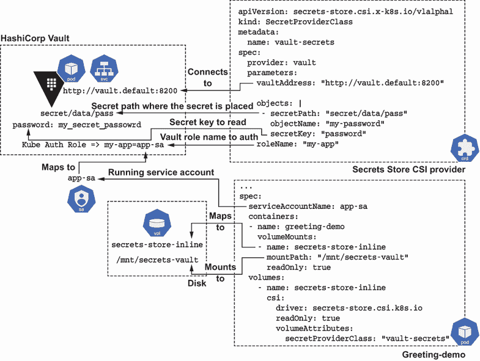

图 6.7 机密提供者、Pod 和 Vault 之间的关系

通过运行以下命令部署 Pod。

列表 6.17 应用带有 CSI 卷的 Pod

```
kubectl apply -f vault-app-pod.yaml -n default      ①
```

① 部署服务账户和应用程序

当 Pod 部署时，它将包含一个卷，其中挂载了所有 Vault 机密作为文件。然后等待 Pod 运行，如下所示。

列表 6.18 等待问候 Pod 运行

```
kubectl wait --for=condition=ready pod -l app=greeting --timeout=90s    ①
```

① 等待应用程序准备就绪

最后，验证机密是否已挂载在`volumesMount`部分指定的`/mnt/secrets-vault`，并且包含机密的文件名为`my-password`，如`objectName`字段中设置的那样。运行以下列表中显示的命令。

列表 6.19 读取注入的机密

```
kubectl exec greeting-demo -- cat /mnt/secrets-vault/my-password

my_secret_password%       ①
```

① 显示的值与机密的密码值匹配。

回顾一下，你已经看到了如何安装 CSI 和 Secrets Store CSI 驱动程序，并创建了一个`SecretProviderClass`资源来配置 Secrets Store CSI 驱动程序以使用 HashiCorp Vault 作为机密存储。你现在应该理解 Secrets Store CSI 驱动程序是如何工作的，并且你已经看到机密被挂载为磁盘上的卷。但在某些情况下，你可能需要将这些机密挂载为 Kubernetes 机密。让我们来探讨一下这是如何完成的。

## 6.2 同步 CSI 机密为 Kubernetes 机密

同步在应用程序（通常是遗留应用程序）需要以环境变量或直接使用 Kubernetes API 服务器读取秘密时特别有用。Secrets Store CSI 驱动使用 Kubernetes Volumes 将秘密挂载到磁盘，但通过在 `SecretProviderClass` 自定义资源（图 6.8）中使用可选的 `secretObjects` 字段，也支持将这些秘密镜像到 Kubernetes Secrets。

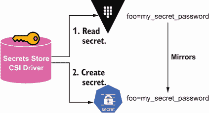

图 6.8 Secrets Store CSI 驱动将秘密作为 Kubernetes Secrets 镜像。

重要提示：卷挂载仍然需要，并且必须定义以与 Kubernetes Secrets 同步。

您将通过将秘密也映射为 Kubernetes Secret 来扩展之前的 HashiCorp Vault 示例。

### 6.2.1 准备命名空间

在将秘密映射为 Kubernetes Secrets 之前，您可能需要删除 `SecretProviderClass` 资源并卸载 `greeting-demo` Pod 以获得一个干净的环境。在终端窗口中，运行以下命令。

列表 6.20 清理环境

```
kubectl delete -f vault-app-pod.yaml -n default    ①

kubectl delete -f vault-spc.yaml -n default        ②
```

① 卸载 Pod。

② 删除 SecretProviderClass 资源。

在示例卸载后，您可以开始同步示例。

### 6.2.2 使用 secretObjects 定义 SecretProviderClass 资源

要使用 Secrets Store CSI 驱动挂载秘密存储中的秘密，修改 `SecretProviderClass` 资源，添加 `secretObjects` 字段。此字段用于定义如何将秘密存储中的秘密映射到 Kubernetes Secret。

在以下片段中，您将看到如何将名为 `foo` 的秘密存储中的秘密值映射到名为 `bar` 的键，该键属于名为 `foosecret` 的 `opaque` Kubernetes Secret：

```
apiVersion: secrets-store.csi.x-k8s.io/v1alpha1
kind: SecretProviderClass
metadata:
  name: my-provider
spec:
  provider: vault
  secretObjects:
  - data:
    - key: bar              ①
      objectName: foo       ②
    secretName: foosecret   ③
    type: Opaque            ④
```

① 用于在秘密资源中查找秘密值的密钥名称

② 要同步的挂载内容名称

③ Kubernetes 秘密对象名称

④ 秘密类型

图 6.9 显示了秘密存储、`SercretProviderClass` 定义和 Kubernetes Secret 之间的关系。

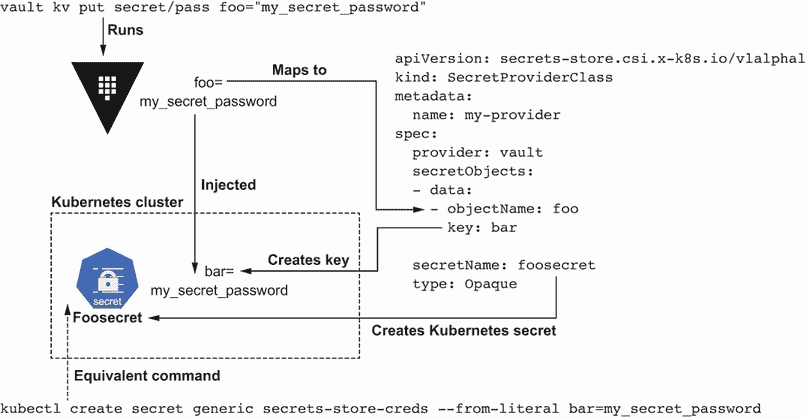

图 6.9 秘密存储、SecretProviderClass 和 Kubernetes Secrets

关于支持的秘密类型

在撰写本书时，以下秘密类型受到支持：

+   Opaque

+   kubernetes.io/basic-auth

+   bootstrap.kubernetes.io/token

+   kubernetes.io/dockerconfigjson

+   kubernetes.io/dockercfg

+   kubernetes.io/ssh-auth

+   kubernetes.io/service-account-token

+   kubernetes.io/tls

打开之前创建的 `vault-spc.yaml` 文件，并添加 `secretObjects` 节来使存储在 HashiCorp Vault 中的数据成为 Kubernetes Secret。

列表 6.21 vault-spc.yaml

```
apiVersion: secrets-store.csi.x-k8s.io/v1alpha1
kind: SecretProviderClass
metadata:
  name: vault-secrets
spec:
  provider: vault
  secretObjects:                   ①
  - data:
    - key: password
      objectName: my-password      ②
    secretName: my-secret          ③
    type: Opaque
  parameters:                      ④
    vaultAddress: "http://vault.default:8200"
    roleName: "my-app"
    objects: |
      - objectName: "my-password"
        secretPath: "secret/data/pass"
        secretKey: "password"
```

① 定义秘密与 Kubernetes Secrets 之间的同步

② 在参数部分定义 objectName。

③ Kubernetes 秘密名称

④ 定义使用秘密作为文件的卷创建

应用以下资源。

列表 6.22 应用 `SecretProviderClass`

```
kubectl apply -f vault-spc.yaml     ①
```

① 部署 SecretProviderClass

部署了 `SecretProviderClass` 后，是时候部署 Pod 了。

部署一个挂载了机密和机密对象的 Pod

只有在启动一个挂载了机密的 Pod 后，机密才会同步。在部署 Pod 之前，先列出默认命名空间中的当前机密。

列表 6.23 列出机密

```
kubectl get secrets -n default      ①

NAME                           TYPE                                DATA AGE
sh.helm.release.v1.vault.v1    helm.sh/release.v1                  1    6m51s
vault-csi-provider-token-chhwj kubernetes.io/service-account-token 3    6m51s
vault-token-qj2jk              kubernetes.io/service-account-token 3    6m51s
```

① 列出机密

一切准备就绪后，是时候重新部署上一节定义的 Pod 了。

列表 6.24 使用 CSI 卷应用 Pod

```
kubectl apply -f vault-app-pod.yaml -n default     ①
```

① 使用 CSI 驱动程序部署 Pod

等待 Pod 运行。

列表 6.25 等待问候 Pod 运行

```
kubectl wait --for=condition=ready pod -l app=greeting --timeout=90s    ①
```

① 等待 Pod 部署完成

在 Pod 部署后列出机密以确认机密现在已创建。

列表 6.26 列出机密

```
kubectl get secrets -n default

NAME                           TYPE                                DATA AGE
my-secret                      Opaque                              1    28s①
sh.helm.release.v1.vault.v1    helm.sh/release.v1                  1    9m19s
vault-csi-provider-token-chhwj kubernetes.io/service-account-token 3    9m19s
vault-token-qj2jk              kubernetes.io/service-account-token 3    9m19s
```

① 使用 secretName 字段设置的名称创建了一个机密。

描述机密以验证其是否正确创建。

列表 6.27 描述机密

```
kubectl describe secret my-secret

Name:         my-secret                                ①
Namespace:    default
Labels:       secrets-store.csi.k8s.io/managed=true    ②
Annotations:  <none>

Type:  Opaque                                          ③

Data
====
password:  18 bytes                                    ④
```

① 在 secretName 字段中设置的名称

② 设置机密的标签由 Secrets Store CSI 管理

③ 在 type 字段中定义的类型

④ 如 key 字段中定义的机密密钥名称

创建与 Secrets Store CSI 创建的机密等效的 `kubectl` 命令

```
kubectl create secret generic my-secret
➥--from-literal password=my_secret_password -n default
```

最后，删除 Pod 以验证它是否会被自动删除，因为没有任何 Pod 消耗机密。

列表 6.28 删除 Pod

```
kubectl delete -f vault-app-pod.yaml -n default    ①
```

① 删除 Pod。

再次列出机密，你会看到 `my-secret` 机密已被删除，因为没有 Pod 使用它。

列表 6.29 列出机密

```
kubectl get secrets -n default

NAME                           TYPE                                DATA AGE
sh.helm.release.v1.vault.v1    helm.sh/release.v1                  1    11m
vault-csi-provider-token-chhwj kubernetes.io/service-account-token 3    11m
vault-token-qj2jk              kubernetes.io/service-account-token 3    11m
```

提示：一旦创建了机密，你可以将其设置为任何 Kubernetes Secret 的环境变量：

```
env:
- name: MY_SECRET
  valueFrom:
    secretKeyRef:
      name: my-secret
      key: password
```

记住你正在创建 Kubernetes Secrets，因此它们需要像第三章和第四章中所示那样进行管理（即在 Git 仓库中加密它们，并启用 KMS 以在 Kubernetes 中加密存储而不是编码）。到目前为止，你已经看到了如何使用 Secrets Store CSI 驱动程序将机密从机密存储库挂载为 Kubernetes 卷和 Kubernetes Secrets。但是，当机密在机密存储库中更新时会发生什么？Secrets Store CSI 驱动程序支持机密自动轮换。

## 6.3 通过自动轮换机密来提高安全态势

假设你收到针对系统的攻击，并且一些机密数据被泄露；你应该做的第一件事之一是重新生成机密到新的值（机密的轮换）。Secrets Store CSI 驱动程序可以在 Pod 运行后检测外部机密存储库中机密的更新，并将此更改填充到相应的卷内容和 Kubernetes Secrets 对象中，如果它们被使用，如图 6.10 所示。

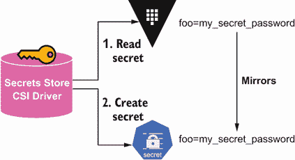

图 6.10 Secrets Store CSI 驱动程序将机密镜像为 Kubernetes Secrets

*自动轮换密钥* 是指定期自动更改密钥数据的过程。从更改密钥数据中可以获得两个重要优势：第一个优势是，这使得攻击者更难获取值，并且使用可能被窃取的密钥来解密它变得更加困难。第二个优势是，如果发生密钥数据泄露，您需要尽可能快地轮换密钥，以避免出现重大问题。

需要注意的是，Secrets Store CSI 驱动程序仅更新密钥存储位置（卷或 Kubernetes 密钥），但消耗这些密钥的应用程序需要实现一些逻辑来对这些更改做出反应并读取新的密钥值。例如，当将密钥作为卷挂载时，应用程序将需要监视更改。如果密钥作为环境变量注入，那么 Pod 需要重新启动以获取最新的密钥作为环境变量。

提示：像 Reloader ([`github.com/stakater/Reloader`](https://github.com/stakater/Reloader)) 这样的项目在检测到关联的 ConfigMap 或 Secret 发生更改时，会自动在 Pod 上推送滚动升级。

### 6.3.1 准备命名空间

在使用自动轮换功能之前，您可能需要卸载 `greeting-demo` Pod（尽管这不是必需的），以便有一个全新的 Pod，例如。如果您之前没有删除 Pod，请在终端窗口中运行以下命令。

列表 6.30 清理环境

```
kubectl delete -f vault-app-pod.yaml -n default      ①
```

① 卸载 Pod。

当 Secrets Store CSI 驱动程序安装时，自动轮换功能默认是禁用的。要启用此功能，Secrets Store CSI 驱动程序 Pod 应该以 `--enable-secret-rotation` 标志设置为 `true` 并使用 `rotation-poll-interval` 标志设置轮换轮询间隔（即检查密钥是否已更改的频率）的方式启动。要启用自动轮换，请在终端中运行以下命令停止之前的部署。

列表 6.31 卸载 Secrets Store CSI 驱动程序

```
kubectl delete -f https://raw.githubusercontent.com/kubernetes-sigs/
➥secrets-store-csi-driver/v0.1.0/deploy/secrets-store-csi-driver.yaml
```

接下来修改 Secrets Store CSI 驱动程序的部署文件，以配置 `--enable-secret-rotation` 和 `rotation-poll-interval` 标志。在这个例子中，将 `rotation-poll-interval` 时间设置为 `1 分钟`，这意味着每分钟，驱动程序将查询密钥存储，检查值是否已更改。

列表 6.32 install-csi-polling.yaml

```
kind: DaemonSet                                     ①
apiVersion: apps/v1
metadata:
  name: csi-secrets-store
  namespace: kube-system
spec:
  selector:
    matchLabels:
      app: csi-secrets-store
  template:
    metadata:
      labels:
        app: csi-secrets-store
      annotations:
        kubectl.kubernetes.io/default-logs-container: secrets-store
    spec:
      serviceAccountName: secrets-store-csi-driver
      containers:
        - name: node-driver-registrar
          image: k8s.gcr.io/sig-storage/csi-node-driver-registrar:v2.2.0
          args:
            - --v=5
            - --csi-address=/csi/csi.sock
            - --kubelet-registration-path=/var/lib/kubelet/plugins/
            ➥csi-secrets-store/csi.sock
          env:
            - name: KUBE_NODE_NAME
              valueFrom:
                fieldRef:
                  apiVersion: v1
                  fieldPath: spec.nodeName
          imagePullPolicy: IfNotPresent
          volumeMounts:
            - name: plugin-dir
              mountPath: /csi
            - name: registration-dir
              mountPath: /registration
          resources:
            limits:
              cpu: 100m
              memory: 100Mi
            requests:
              cpu: 10m
              memory: 20Mi
        - name: secrets-store
          image: k8s.gcr.io/csi-secrets-store/driver:v0.1.0
          args:
            - "--endpoint=$(CSI_ENDPOINT)"
            - "--nodeid=$(KUBE_NODE_NAME)"
            - "--provider-volume=/etc/kubernetes/secrets-store-csi-providers"
            - "--metrics-addr=:8095"
            - "--enable-secret-rotation=true"       ②
            - "--rotation-poll-interval=1m"         ③
            - "--filtered-watch-secret=true"
            - "--provider-health-check=false"
            - "--provider-health-check-interval=2m"
          env:
            - name: CSI_ENDPOINT
              value: unix:///csi/csi.sock
            - name: KUBE_NODE_NAME
              valueFrom:
                fieldRef:
                  apiVersion: v1
                  fieldPath: spec.nodeName
          imagePullPolicy: IfNotPresent
          securityContext:
            privileged: true
          ports:
            - containerPort: 9808
              name: healthz
              protocol: TCP
          livenessProbe:
              failureThreshold: 5
              httpGet:
                path: /healthz
                port: healthz
              initialDelaySeconds: 30
              timeoutSeconds: 10
              periodSeconds: 15
          volumeMounts:
            - name: plugin-dir
              mountPath: /csi
            - name: mountpoint-dir
              mountPath: /var/lib/kubelet/pods
              mountPropagation: Bidirectional
            - name: providers-dir
              mountPath: /etc/kubernetes/secrets-store-csi-providers
          resources:
            limits:
              cpu: 200m
              memory: 200Mi
            requests:
              cpu: 50m
              memory: 100Mi
        - name: liveness-probe
          image: k8s.gcr.io/sig-storage/livenessprobe:v2.3.0
          imagePullPolicy: IfNotPresent
          args:
          - --csi-address=/csi/csi.sock
          - --probe-timeout=3s
          - --http-endpoint=0.0.0.0:9808
          - -v=2
          volumeMounts:
            - name: plugin-dir
              mountPath: /csi
          resources:
            limits:
              cpu: 100m
              memory: 100Mi
            requests:
              cpu: 10m
              memory: 20Mi
      volumes:
        - name: mountpoint-dir
          hostPath:
            path: /var/lib/kubelet/pods
            type: DirectoryOrCreate
        - name: registration-dir
          hostPath:
            path: /var/lib/kubelet/plugins_registry/
            type: Directory
        - name: plugin-dir
          hostPath:
            path: /var/lib/kubelet/plugins/csi-secrets-store/
            type: DirectoryOrCreate
        - name: providers-dir
          hostPath:
            path: /etc/kubernetes/secrets-store-csi-providers
            type: DirectoryOrCreate
      nodeSelector:
        kubernetes.io/os: linux
```

① DaemonSet 在所有 Kubernetes 节点上部署驱动程序。

② 启用密钥轮换

③ 设置轮询时间为 1 分钟

最后，使用之前的修改部署 Secrets Store CSI 驱动程序。

列表 6.33 启用自动轮换的 Secrets Store CSI 驱动程序部署

```
kubectl apply -f install-csi-polling.yaml    ①
```

① 启用轮询功能的 Secret 存储 CSI 安装

现在等待 Pod 运行。

列表 6.34 等待驱动程序 Pod 运行

```
kubectl wait --for=condition=ready pod -l app=csi-secrets-store
➥--timeout=90s -n kube-system    ①
```

① 等待 Pod 部署完成

### 6.3.2 部署挂载密钥的 Pod

现在重新部署上一节中定义的 Pod，以注入密钥轮换示例。

列表 6.35 应用带有 CSI 卷的 Pod

```
kubectl apply -f vault-app-pod.yaml -n default     ①
```

① 将 Pod 部署到默认命名空间

等待 Pod 运行。

列表 6.36 等待问候 Pod 运行

```
kubectl wait --for=condition=ready pod -l app=greeting --timeout=90s    ①
```

① 等待 Pod 准备就绪。

最后，验证秘密是否已挂载在 `/mnt/secrets-vault`，如 `volumesMount` 部分所述，并且包含秘密的文件是 `my-password`，如 `objectName` 字段所设置。运行以下列表中所示的命令。

列表 6.37 读取注入的秘密

```
kubectl exec greeting-demo -- cat /mnt/secrets-vault/my-password

my_secret_password%      ①
```

① 打印秘密的当前值。

### 6.3.3 更新秘密

现在，通过在 Vault Pod 上打开交互式 shell 会话，在 Vault 中更新密钥的新秘密值。

列表 6.38 打开交互式 shell

```
kubectl exec -it vault-0 -- /bin/sh     ①
```

① 对 Vault 容器启动交互式 shell

从现在开始，发出的命令将在 Vault 容器上执行。使用 `my_new_secret_password` 值更新秘密/pass 路径上的秘密。

列表 6.39 更新秘密

```
vault kv put secret/pass password=
➥"my_new_secret_password"           ①

Key              Value
---              -----
created_time     2021-08-09T17:26:26.665179027Z
deletion_time    n/a
destroyed        false
version          2                   ②
```

① 值已更新。

② 版本增加 1。

输入 `exit` 以退出 `kubectl` `exec` 命令。至少等待一分钟，直到 Secrets Store CSI 驱动程序轮询秘密，检测到更改，并将其填充到 Pod 中，然后再次运行命令以打印秘密值。

列表 6.40 读取注入的秘密

```
kubectl exec greeting-demo -- cat /mnt/secrets-vault/my-password

my_new_secret_password%     ①
```

① 打印新的秘密版本。

输入 `exit` 以退出 `kubectl` `exec` 命令。注意，秘密值已注入，无需重新启动 Pod。

现在你应该理解 Secrets Store CSI 驱动程序的工作方式；然而，示例中没有使用任何云秘密存储。在下一节中，我们将扩展此示例，以涵盖在公共云秘密存储中存储秘密。

## 6.4 从云秘密存储中消费秘密

到目前为止，你在这个章节和第五章中使用了 HashiCorp Vault 作为秘密存储。但是，如果你使用公共云作为部署 Kubernetes 集群的平台，你可能希望使用他们在基础设施中提供的秘密存储服务。例如，如果你使用 Azure 云服务，你可能希望使用 Azure Key Vault 作为秘密存储。在本节中，你将了解如何使用 Secrets Store CSI 驱动程序从云秘密存储中消费秘密。

Secret Storage CSI 驱动程序支持 AWS Secrets Manager 和 AWS 系统管理器参数存储；Azure Key Vault；以及 Google Secret Manager。你将实现与上一节相同的示例，但将从公共云秘密存储中获取秘密，而不是从 HashiCorp Vault 获取。你将首先将秘密存储 CSI 驱动程序集成到 Azure Key Vault。

重要 无论是哪种情况，集成秘密存储和 Secrets Store CSI 的过程都是相同的：

1.  安装和配置秘密存储。

1.  根据所使用的秘密存储安装 Secrets Store CSI 提供程序（例如，Vault、AWS 或 Azure）。

1.  使用秘密存储配置参数配置 `SecretProviderClass`。

两者之间最大的区别是秘密存储库的安装和配置。在本节中，我们将向您展示如何将云秘密存储库与 CSI 集成，但我们假设您有云提供商的账户来部署秘密存储库，并且对它们的工作方式有基本的了解。

### 6.4.1 Azure 密钥保管库

Azure 密钥保管库是 Azure 云服务，提供秘密（例如，密钥、密码和证书）的安全存储。要运行 Azure 密钥保管库，您需要一个至少具有免费服务订阅的 Azure 账户，因为 Azure 密钥保管库不能在 Azure 云之外运行。

安装和配置 Azure 密钥保管库

要安装 Azure 密钥保管库，请登录到您的 Azure 订阅以创建一个具有访问密钥保管库策略的服务主体。

列表 6.41 Azure 登录

```
az login    ①
```

① 登录到 Azure。

登录到 Azure 后，您可以执行以下列表中的命令来创建服务主体。

列表 6.42 创建 Azure 服务主体

```
az ad sp create-for-rbac --skip-assignment --name alex    ①
```

① 创建名为 alex 的服务主体

命令返回一个 JSON 文档，其中包含一些您稍后配置 CSI 驱动程序所需的敏感参数：

```
{
  "appId": "7d3498f8-633e-4c58-bbaa5-1b2a015017a7",   ①
  "displayName": "alex",
  "name": "http://alex",
  "password": "2CAT7NvT9OzrLneTdi3..rYnU.M4_qGIMP",   ②
  "tenant": "66ee79ad-f624-4a81-b14e-319d7dd9e699"
}
```

① 这是 CSI 驱动程序所需的客户端 ID。

② 这是 CSI 驱动程序所需客户端密钥。

提示：为 Azure 密钥保管库创建特定的服务主体不是强制性的，您也可以使用默认服务主体。

接下来，您需要通过 Azure 门户创建 Azure 密钥保管库。访问 [`portal.azure.com/`](https://portal.azure.com/)，并使用您的账户登录。在门户中，转到顶部搜索栏，输入“密钥保管库”，然后点击如图 6.11 所示的 Azure 密钥保管库资源。

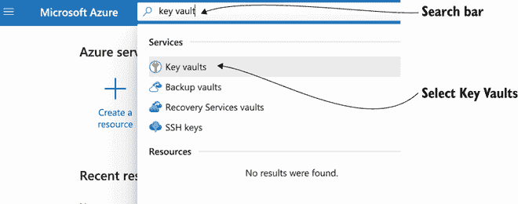

图 6.11 Azure 门户

在“密钥保管库”部分，点击“创建密钥保管库”按钮以开始创建 Azure 密钥保管库实例（图 6.12）。

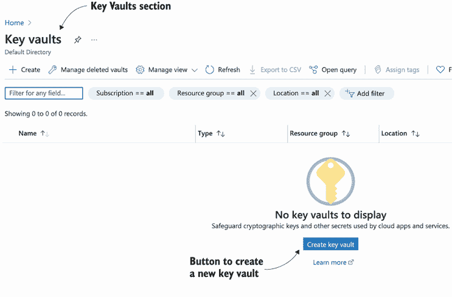

图 6.12 Azure 密钥保管库门户；云提供商持续调整他们的网络界面。

使用图 6.13 中显示的参数填写创建密钥保管库向导。

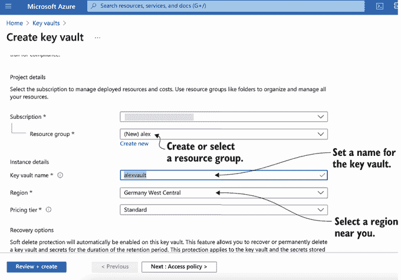

图 6.13 创建 Azure 密钥保管库

在此示例中，`密钥` `保管库` `名称` 为 `alexvault`，但可以是任何其他名称、`区域` 和 `定价层`。点击“审查 + 创建”，审查值，然后点击“创建”。

现在应该显示创建的密钥保管库概述（图 6.14）。在此阶段，点击 JSON 视图链接，它将显示相同的内容，但以 JSON 格式显示，以及密钥保管库的租户 ID。

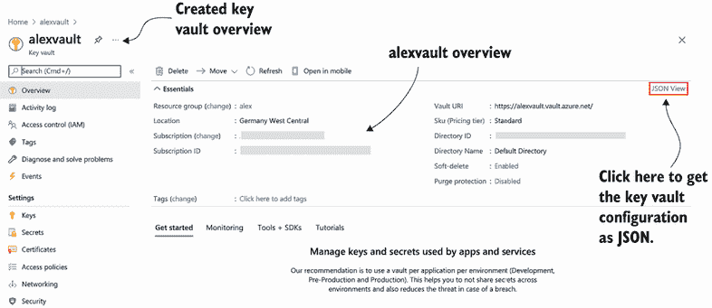

图 6.14 Azure 密钥保管库概述

您需要创建要注入到 Pod 中的秘密。点击左侧菜单中的“秘密”部分，然后点击如图 6.15 所示的左上角菜单中的“生成/导入”按钮。

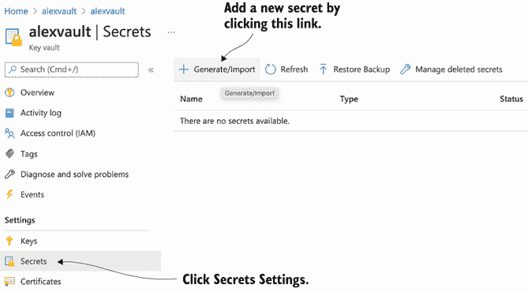

图 6.15 创建 Azure 密钥保管库秘密

在 `name` 字段中填写 `password` 值，在 `value` 字段中填写 `my_password`；然后点击创建，如图 6.16 所示。

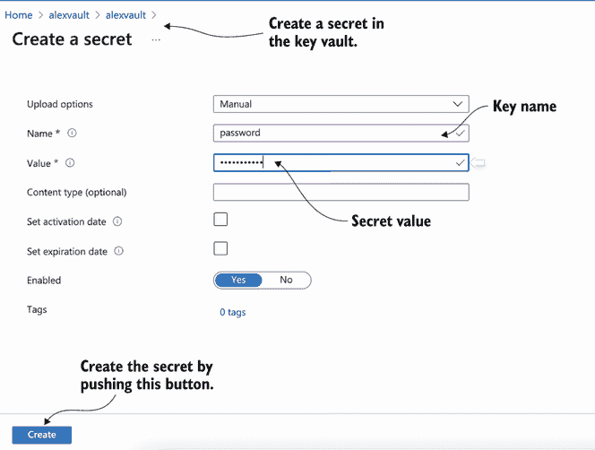

图 6.16 创建 Azure Key Vault 秘密

NOTE 可以通过运行 `az keyvault secret set --vault-name "alexvault" --name "password" --value "my_password"` 命令使用 `az` CLI 工具创建一个秘密。

最后，您需要将之前创建的服务主体权限分配给您刚刚创建的密钥库。返回终端窗口，并执行以下命令。

列表 6.43 分配权限

```
az keyvault set-policy -n $KEYVAULT_NAME
➥--key-permissions get --spn $AZURE_CLIENT_ID        ①
az keyvault set-policy -n $KEYVAULT_NAME
➥--secret-permissions get --spn $AZURE_CLIENT_ID     ②
az keyvault set-policy -n $KEYVAULT_NAME
➥--certificate-permissions get --spn $AZURE_CLIENT_ID
```

① `KEYVAULT_NAME` 是分配给密钥库的名称。在本例中，它是 alexvault。

② `$AZURE_CLIENT_ID` 是服务主体的 `appId` 字段。在本例中，它是 7d3498f8-633e-4c58-bbaa5-1b2a015017a7。

现在，您已经准备好返回 Kubernetes！在下一节中，您将学习如何配置它以从 Azure Key Vault 消费秘密。

Azure Key Vault CSI 驱动程序

首先，安装并配置 Azure Key Vault CSI 驱动程序。您需要创建一个新的 Kubernetes 命名空间来部署 Azure 示例。

列表 6.44 创建 Azure 命名空间

```
kubectl create namespace azure         ①

kubectl config set-context --current
➥--namespace=azure                    ②
```

① 创建一个命名空间。

② 切换到创建的命名空间。

安装 Azure Secrets Store CSI 提供程序，以使用 CSI 接口将 Azure Key Vault 中的秘密注入到 Pod 中。

列表 6.45 安装 Azure Secrets Store CSI 提供程序

```
kubectl apply -f https://raw.githubusercontent.com/Azure/
➥secrets-store-csi-driver-provider-azure/v0.1.0/deployment/
➥provider-azure-installer.yaml -n azure
```

TIP 对于 Windows 节点，您需要应用 `provider-azure-installer-windows.yaml` 文件。

通过执行以下命令来检查提供程序是否正在运行。

列表 6.46 检查 Azure Secrets Store CSI 提供程序

```
kubectl get pods -n azure      ①

NAME                                     READY   STATUS    RESTARTS   AGE
csi-secrets-store-provider-azure-6fcdc   1/1     Running   1          161m
```

① 列出 Pod。

Warning 对于 AKS 集群，提供程序需要安装到 `kube-system` 命名空间，以与 Kube API 服务器建立连接。

然后，您将设置服务主体凭据作为 Kubernetes Secrets，使其可通过 Azure Secrets Store CSI 驱动程序访问。驱动程序使用此秘密登录到远程 Azure Key Vault。该秘密必须包含 `clientid` 和 `clientsecret` 键，分别设置为服务主体的 `app ID` 和 `password` 字段。图 6.17 展示了认证步骤的概述。

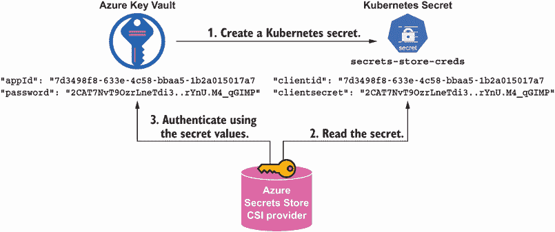

图 6.17 Azure Secrets Store CSI 提供程序的认证过程

以下列表显示了使用 Azure 凭据创建 Kubernetes 秘密的示例。

列表 6.47 创建 Kubernetes 秘密

```
kubectl create secret generic secrets-store-creds --from-literal
➥clientid=$AZURE_CLIENT_ID --from-literal
➥clientsecret=$AZURE_CLIENT_SECRET -n azure       ①
```

① `$AZURE_CLIENT_ID` 是服务主体的 `appId` 字段。在本例中，它是 7d3498f8-633e-4c58-bbaa5-1b2a015017a7。`$AZURE_CLIENT_SECRET` 是服务主体的 `password` 字段。在本例中，它是 2CAT7NvT9OzrLneTdi3..rYnU.M4_qGIMP。

Important 秘密必须与应用程序 Pod 在同一命名空间中创建。此外，与任何 Kubernetes 秘密一样，它需要按照第三章和第四章中讨论的方式进行管理。

此外，您还可以标记在 `nodePublishSecretRef` 部分中使用的秘密（如刚刚创建的那个），以限制 CSI 驱动程序使用的内存量。

列表 6.48 创建 Kubernetes 秘密

```
kubectl label secret secrets-store-creds secrets
➥-store.csi.k8s.io/used=true -n azure               ①
```

① 要限制 CSI 驱动程序消耗的内存量，您可以标记秘密。

在创建包含秘密的 Pod 之前，最后一步是使用 Azure Key Vault 名称和 Azure Key Vault 租户 ID 配置 `SecretProviderClass`。

列表 6.49 azure-spc.yaml

```
apiVersion: secrets-store.csi.x-k8s.io/v1alpha1
kind: SecretProviderClass
metadata:
  name: azure-manning                                   ①
spec:
  provider: azure                                       ②
  parameters:
    keyvaultName: "alexvault"                           ③
    objects:  |
      array:
        - |
          objectName: password                          ④
          objectType: secret

    tenantId: "77aa79ad-f624-7623-b14e-33447dd9e699"    ⑤
```

① 资源名称

② 设置配置的提供者

③ Azure Key Vault 名称

④ 要注入的秘密的密钥名称

⑤ Azure Key Vault 租户 ID

通过运行以下命令应用 `azure-manningSecretProviderClass`：

列表 6.50 应用 `azure-manningSecretProviderClass`

```
kubectl apply -f azure-spc.yaml -n azure      ①
```

① 注册 Azure SercretProviderClass

部署挂载秘密的 Pod

配置类似于您在 HashiCorp Vault 示例中看到的配置；您有 `csi` 部分，其中将 CSI 驱动程序设置为 `secrets-store.csi.k8s.io`，以及刚刚创建的 `SecretProviderClass` 名称（`azure-manning`）。但在此情况下，设置 `nodePublishSecretRef` 指向之前创建的包含 Azure 服务主体凭据的 Kubernetes 秘密（`secrets-store-creds`），以访问 Azure Key Vault。

列表 6.51 azure-app-pod.yaml

```
kind: Pod
apiVersion: v1
metadata:
  name: greeting-demo
  labels:
    app: greeting
spec:
  containers:
  - image: quay.io/lordofthejars/greetings-jvm:1.0.0
    name: greeting-demo
    volumeMounts:                                  ①
    - name: secrets-store-inline
      mountPath: "/mnt/secrets-azure"              ②
      readOnly: true
  volumes:
    - name: secrets-store-inline
      csi:
        driver: secrets-store.csi.k8s.io
        readOnly: true
        volumeAttributes:
          secretProviderClass: "azure-manning"     ③
        nodePublishSecretRef:
          name: secrets-store-creds                ④
```

① 卷挂载部分

② 秘密挂载的路径

③ 引用 SecretProviderClass

④ 使用服务主体作为秘密时需要。

通过运行以下命令部署 Pod。

列表 6.52 应用带有 CSI 卷的 Pod

```
kubectl apply -f azure-app-pod.yaml -n azure    ①
```

① 部署配置为使用 Azure Secrets Store CSI 提供者的 Pod。

现在等待 Pod 运行。

列表 6.53 等待问候 Pod 运行

```
kubectl wait --for=condition=ready pod -l app=greeting --timeout=90s -n azure        ①
```

① 等待 Pod 就绪。

在以下片段中，提供了一个完整的 `SecretProviderClass` 对象，因此您可以看到所有可能的选项。

```
apiVersion: secrets-store.csi.x-k8s.io/v1alpha1
kind: SecretProviderClass
metadata:
  name: azure-kvname
spec:
  provider: azure
  parameters:
    usePodIdentity: "false"                   ①
    useVMManagedIdentity: "false"             ②
    userAssignedIdentityID: "client_id"       ③
    keyvaultName: "kvname"
    cloudName: ""                             ④
    cloudEnvFileName: ""                      ⑤
    objects:  |                               ⑥
      array:
        - |
          objectName: secret1
          objectAlias: SECRET_1               ⑦
          objectType: secret                  ⑧
          objectVersion: ""                   ⑨
        - |
          objectName: key1
          objectAlias: ""
          objectType: secret
          objectVersion: ""
          objectFormat: "pem"                 ⑩
          objectEncoding: "utf-8"             ⑪
    tenantId: "tid"
```

① 设置为 true 以使用 aad-pod-identity 访问密钥保管库（false）。

② 指定访问模式以启用用户分配的托管身份的使用（false）。

③ 在 User-assigned Managed Identity 模式下，需要分配给身份 ID 的用户。

④ 根据 Azure Go SDK 指定的 Azure 云名称（AzurePublicCloud）

⑤ 填充 Azure 环境时使用的文件路径

⑥ 要注入的秘密数组

⑦ 在写入磁盘时指定对象的文件名（objectName 值）。

⑧ 对象类型：秘密、密钥或证书

⑨ 对象版本（最新版）

⑩ 格式对象；支持类型为 pem 和 pfx

⑪ 对秘密对象的编码；支持类型为 UTF-8、HEX 和 BASE64

提供访问密钥保管库的标识

在本节中，我们已通过服务主体授予身份对密钥保管库的访问权限。在编写本文时，这是从非 Azure 环境连接到 Azure Key Vault 的唯一方式。但如果您处于 Azure 环境中（即 AKS），则支持以下其他身份验证模式：

+   AAD Pod 身份

+   用户分配的托管身份

+   系统分配的托管身份

您知道如何使用 Secrets Store CSI 驱动程序注入存储在 Azure Key Vault 中的秘密。如前所述，Secrets Store CSI 驱动程序支持除 Azure 之外的其他提供程序。在下一节中，您将回顾相同的示例——这次将秘密存储在 GCP 秘密管理器中。

### 6.4.2 GCP 秘密管理器

GCP 秘密管理器是 Google 云服务，它为秘密（例如，密钥、密码和证书）提供了一个安全的存储库。要运行 GCP 秘密管理器，您需要一个安装了秘密管理器的 GCP 账户，因为它不能在 Google 云之外运行。

安装和配置 GCP 秘密管理器

要安装 GCP 秘密管理器，请使用您的 GCP 账户登录到 GCP 控制台([`console.cloud.google.com/home`](https://console.cloud.google.com/home))，并启用秘密管理器。在页面顶部的搜索栏中搜索*秘密管理器*，然后在搜索结果中点击它，如图 6.18 所示。

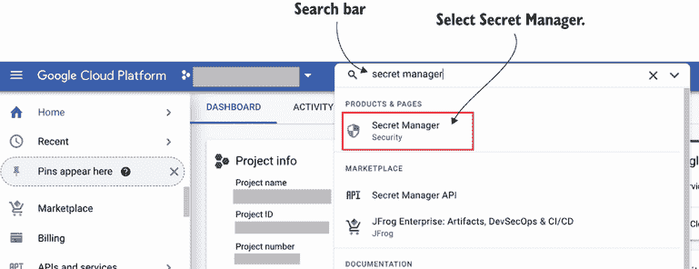

图 6.18 搜索 GCP 秘密管理器

然后通过点击启用按钮（图 6.19）来启用 GCP 秘密管理器。

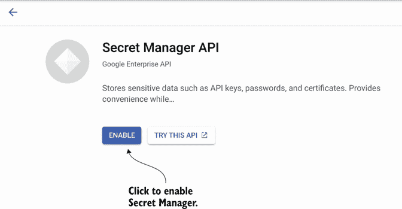

图 6.19 启用秘密管理器

启用秘密管理器后，创建一个新的秘密，使用 CSI 将其注入 Pod。从左侧菜单的安全部分选择秘密管理器资源，然后点击创建秘密按钮，如图 6.20 所示。

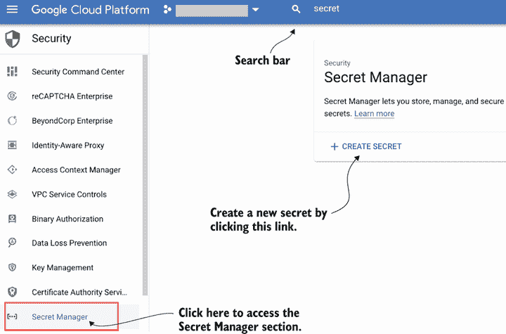

图 6.20 创建秘密

使用名称为`app-secret`和值为`my_password`的创建秘密表单，如图 6.21 所示填写。

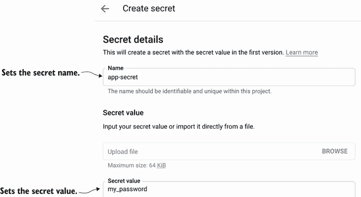

图 6.21 创建秘密

创建秘密时，会显示所有创建的秘密列表。现在点击创建的秘密的名称，以检查其详细信息并获取资源名称，因为您稍后需要它来配置 GCP Secrets Store CSI 提供程序（图 6.22）。

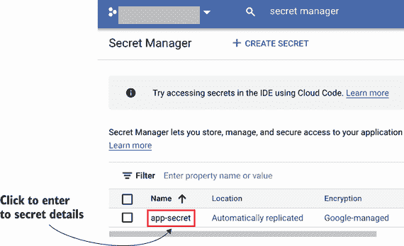

图 6.22 选择创建的秘密

记录`资源 ID`值（`projects/466074950013/secrets/app-secret`），因为当创建`SecretProviderClass`时，您将需要它作为参数。图 6.23 显示了秘密概述的示例。

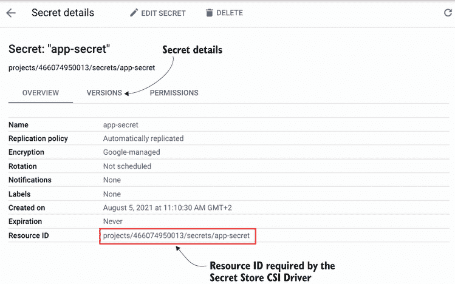

图 6.23 创建的秘密概述

在离开 GCP 控制台之前的最后一步是导出 GCP 服务账户凭证密钥以验证秘密管理器实例。通常，当密钥添加到服务账户时，此 JSON 文件会自动下载。如果您没有密钥，可以通过点击服务账户菜单然后点击添加密钥按钮来添加一个新的密钥，如图 6.24 所示。

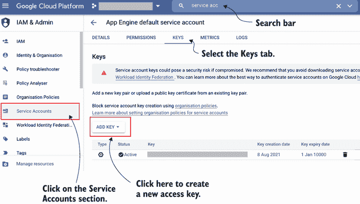

图 6.24 创建的秘密概述

生成一个 JSON 格式的密钥，并具有足够的权限访问 GCP Secret Manager 非常重要。最后回到机密概览页面，点击权限选项卡和添加按钮，将之前的服务账户添加为可以消费机密的账户。此过程如图 6.25 所示。

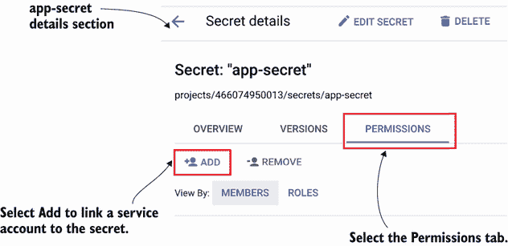

图 6.25 给服务账户赋予访问机密的权限

GCP Secret Manager CSI 驱动程序

让我们安装和配置 GCP Secret Manager CSI 驱动程序。首先，创建一个新的 Kubernetes 命名空间以部署 GCP 示例。

列表 6.54 创建 GCP 命名空间

```
kubectl create namespace gcp                           ①

kubectl config set-context --current --namespace=gcp   ②
```

① 创建一个命名空间。

② 切换到创建的命名空间。

按照列表 6.55 的说明安装 GCP Secrets Store CSI Provider，以便使用 CSI 接口将 GCP Secret Manager 中的机密注入到 Pods 中。

列表 6.55 安装 GCP Secrets Store CSI 提供程序

```
kubectl apply -f https://raw.githubusercontent.com/GoogleCloudPlatform/
➥secrets-store-csi-driver-provider-gcp/v0.5.0/deploy/
➥provider-gcp-plugin.yaml                               ①
```

① 安装 GCP Secrets Store CSI 提供程序

通过执行以下命令检查提供程序是否正在运行。

列表 6.56 检查 GCP Secrets Store CSI 提供程序

```
kubectl get pods -n kube-system       ①

NAME                                   READY   STATUS    RESTARTS   AGE
coredns-558bd4d5db-4l9tk               1/1     Running   4          5d20h
csi-secrets-store-8xlcn                3/3     Running   11         5d3h
csi-secrets-store-provider-gcp-62jb5   1/1     Running   0          17s
```

① 列出 kube-system 命名空间中的 Pods。

警告：提供程序安装在 `kube-system` 命名空间中，以建立与 Kube API 服务器的连接。

然后将服务账户凭据设置为 Kubernetes Secrets，使其可通过 GCP Secrets Store CSI Driver 访问，如列表 6.57 所示。驱动程序使用此机密登录远程 GCP Secret Manager。该机密必须有一个 `key.json` 密钥，其值为导出的 GCP 服务账户凭据。

列表 6.57 创建 Kubernetes 机密命名空间

```
KEY_GCP='{"private_key_id": "123","private_key": "a-secret",
➥"token_uri": "https://example.com/token",
➥"type": "service_account"}'                        ①

kubectl create secret generic secrets-store-creds
➥--from-literal key.json=$KEY_GCP -n gcp            ②
```

① $AKEY_GCP 是上一步中下载的服务账户 JSON 文件。

② 使用 key.json 密钥和 GCP 密钥的值创建一个机密。

重要机密必须在与应用程序 Pod 相同的命名空间中创建。此外，与任何 Kubernetes 机密一样，它需要按照第三章和第四章所述进行管理。

在创建包含机密的 Pod 之前，最后一步是配置 `SecretProviderClass`，包括机密资源 ID 和机密内容存储的文件名。

列表 6.58 gcp-spc.yaml

```
apiVersion: secrets-store.csi.x-k8s.io/v1alpha1
kind: SecretProviderClass
metadata:
  name: gcp-manning
spec:
  provider: gcp
  parameters:
    secrets: |
      - resourceName: projects/466074950013/secrets/
      ➥app-secret/versions/latest       ①
        fileName: app-secret             ②
```

① 指的是以下格式的机密版本：<Resource ID>//versions/

② 存储机密内容的文件名

通过运行以下命令应用 gcp-manning 的 `SecretProviderClass`。

列表 6.59 应用 gcp-manning 的 `SecretProviderClass`

```
kubectl apply -f gcp-spc.yaml -n gcp    ①
```

① 注册 GCP SecretProviderClass

部署挂载机密的 Pod

此示例中的配置与您在 HashiCorp Vault 示例中看到的内容类似；您有 `csi` 部分，其中将 CSI 驱动程序设置为 `secrets-store.csi.k8s.io`，以及之前创建的 `SecretProviderClass` 名称（`gcp-manning`）。但在此情况下，设置 `nodePublishSecretRef` 指向之前创建的、使用 GCP 服务账户凭据（`secrets-store-creds`）访问 GCP Secret Manager 的 Kubernetes 机密。 

列表 6.60 gcp-app-pod.yaml

```
kind: Pod
apiVersion: v1
metadata:
  name: greeting-demo
  labels:
    app: greeting
spec:
  containers:
  - image: quay.io/lordofthejars/greetings-jvm:1.0.0
    name: greeting-demo
    volumeMounts:                             ①
    - name: secrets-store-inline
      mountPath: "/mnt/secrets-gcp"           ②
      readOnly: true
  volumes:
    - name: secrets-store-inline
      csi:
        driver: secrets-store.csi.k8s.io
        readOnly: true
        volumeAttributes:
          secretProviderClass: "gcp-manning"  ③
        nodePublishSecretRef:
          name: secrets-store-creds           ④
```

① 卷挂载部分

② 秘密挂载的路径

③ 对 SecretProviderClass 的引用

④ 当使用服务账户作为秘密时需要

通过运行以下命令部署 Pod。

列表 6.61 应用带有 CSI 卷的 Pod

```
kubectl apply -f gcp-app-pod.yaml -n gcp      ①
```

① 部署一个配置为使用 GCP Secrets Store CSI 提供者的 Pod。

等待 Pod 运行。

列表 6.62 等待问候 Pod 运行

```
kubectl wait --for=condition=ready pod -l app=greeting --timeout=90s   ①
```

① 等待 Pod 准备就绪。

最后，验证秘密是否已挂载在 `volumesMount` 部分指定的 `/mnt/secrets-gcp`，并且包含秘密的文件名为 `app-secret`，如 `fileName` 字段所述。运行以下列表中显示的命令。

列表 6.63 读取注入的秘密

```
kubectl exec greeting-demo -- cat /mnt/secrets-gcp/app-secret

my_secret%      ①
```

① 显示的值与之前设置的密码值匹配。

向 GCP Secret Manager 提供身份

在本节中，你已使用服务账户提供了对 GCP Secret Manager 的身份访问权限。在撰写本文时，这是从非 GCP 环境连接到 GCP Secret Manager 的唯一方法。以下认证模式也得到支持：

+   Pod 工作负载身份

+   GCP 提供者身份

你现在知道如何使用秘密存储 CSI 驱动程序注入存储在 GCP Secret Manager 中的秘密。在下一节中，你将看到相同的示例——这次是存储在 AWS Secrets Manager 中的秘密。

### 6.4.3 AWS Secrets Manager

AWS Secrets Manager 是一种 AWS 云服务，它为秘密（例如，密钥、密码、证书）提供了一个安全的存储库。要运行 AWS Secrets Manager，你需要一个安装了 AWS Secrets Manager 的 AWS 账户；它不能在 AWS 云之外运行。此外，在撰写本文时，AWS Secrets Manager 可以在 Amazon Elastic Kubernetes Service (EKS) 1.17+ 上运行。

本书不会解释准备 EKS 集群的整个过程。我们还将假设 EKS 集群已启动并配置，并且 `eksctl` CLI 工具已安装在你的机器上。

在 AWS Secrets Manager 中创建秘密

如前几节所述，你需要将一个秘密存储到秘密存储中——在本例中为 AWS Secrets Manager——以便由秘密存储 CSI 驱动程序使用。使用 `aws` CLI 工具（[`mng.bz/ZpaR`](http://mng.bz/ZpaR)）创建一个名为 `AppSecret` 且值为 `my_secret` 的秘密。

列表 6.64 创建秘密

```
REGION=us-east-2                             ①

aws --region "$REGION" secretsmanager  create-secret --name AppSecret
➥--secret-string 'my_secret'                ②
```

① Kubernetes 集群运行的区域

② 在秘密管理器中创建秘密

然后创建一个 IAM 访问策略来访问之前步骤中创建的秘密。这一步很重要，因为你将以类似于在 HashiCorp Vault Kubernetes 认证模式中的方式将此访问策略与运行 `greeting-demo` Pod 的 Kubernetes 服务账户关联起来。

运行列表 6.65 中显示的命令，创建一个名为 `greeting-deployment-policy` 的访问策略来访问 `AppSecret` 秘密。策略名称很重要，因为你需要在这项策略和 Kubernetes 服务账户之间建立联系。

列表 6.65 创建访问策略

```
$(aws --region "$REGION" --query Policy.Arn --output
➥text iam create-policy --policy-name greeting-deployment-policy
➥--policy-document '{                                  ①
    "Version": "2012-10-17",
    "Statement": [ {
        "Effect": "Allow",                              ②
        "Action": ["secretsmanager:GetSecretValue",
        ➥"secretsmanager:DescribeSecret"],             ③
        "Resource": ["arn:*:secretsmanager:*:*:
        ➥secret:AppSecret-??????"]                     ④
    } ]
}')

arn:aws:iam::aws:policy/greeting-deployment-policy      ⑤
```

① 创建一个名为 greeting-deployment-policy 的策略

② 允许操作字段中描述的操作

③ 允许获取和描述机密

④ 为名为 AppSecret 的机密设置策略

⑤ 命令返回策略 ARN ID。

您需要一个 IAM OIDC 提供者，以便在集群中创建 IAM 访问策略与 Kubernetes 服务账户之间的关联。如果您还没有一个，可以通过运行以下命令来创建一个。

列表 6.66 创建 IAM OIDC 提供者

```
eksctl utils associate-iam-oidc-provider --region="$REGION"
➥--cluster="$CLUSTERNAME" --approve     ①
```

① `$CLUSTERNAME` 是您集群的名称。

最后创建一个 IAM 服务账户，该账户将被 Pod 使用，并将其与之前创建的 IAM 访问策略（`arn:aws:iam::aws:policy/greeting-deployment-policy`）关联。在这种情况下，使用 `greeting-deployment-sa` 作为服务账户名称和 Kubernetes 服务账户名称。

列表 6.67 创建访问策略

```
eksctl create iamserviceaccount \
    --name greeting-deployment-sa                     ①
    --region="$REGION" --cluster "$CLUSTERNAME" \
    --attach-policy-arn "arn:aws:iam::aws:policy/
    ➥greeting-deployment-policy" \                   ②
    --approve --override-existing-serviceaccounts
```

① 创建 IAM 服务账户

② 将策略附加到以访问机密

该过程总结在图 6.26 中。

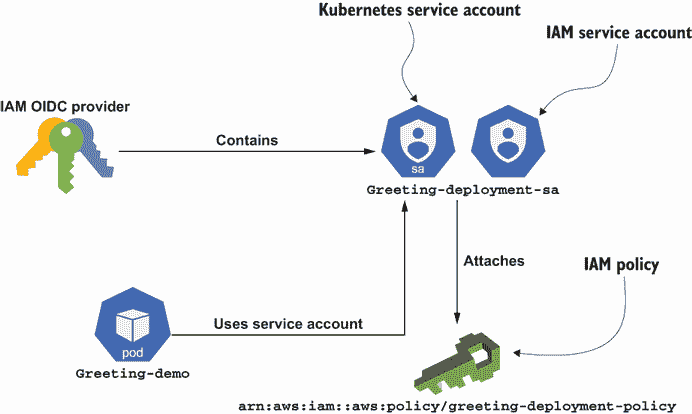

图 6.26 Pod-Volume 连接

AWS Secrets Manager CSI 驱动程序

现在安装和配置 AWS Secret Manager CSI 驱动程序。首先创建一个新的 Kubernetes 命名空间来部署 AWS 示例。

列表 6.68 创建 AWS 命名空间

```
kubectl create namespace aws                            ①

kubectl config set-context --current --namespace=aws    ②
```

① 创建一个命名空间。

② 切换到创建的命名空间。

按照列表 6.69 中的说明安装 AWS Secrets Store CSI 提供者，以使用 CSI 接口将 AWS Secret Manager 中的机密注入到 Pod 中。

列表 6.69 安装 AWS Secrets Store CSI 提供者

```
kubectl apply -f https://raw.githubusercontent.com/aws/
➥secrets-store-csi-driver-provider-aws/main/deployment/
➥aws-provider-installer.yaml                            ①
```

① 安装 AWS Secrets Store CSI 提供者

通过执行以下命令来检查提供者是否正在运行：

列表 6.70 检查 GCP Secrets Store CSI 提供者

```
kubectl get pods -n kube-system      ①

NAME                                   READY   STATUS    RESTARTS   AGE
coredns-558bd4d5db-4l9tk               1/1     Running   4          5d20h
csi-secrets-store-8xlcn                3/3     Running   11         5d3h
csi-secrets-store-provider-aws-34bj1   1/1     Running   0          17s
```

① 列出 kube-system 命名空间中的 Pod。

警告：提供者安装在 `kube-system` 命名空间中，以建立与 Kube API 服务器的连接。

在创建包含机密的 Pod 之前，最后一步是使用机密名称配置 `SecretProviderClass`。

列表 6.71 aws-spc.yaml

```
apiVersion: secrets-store.csi.x-k8s.io/v1alpha1
kind: SecretProviderClass
metadata:
  name: aws-manning
spec:
  provider: aws
  parameters:
    objects: |
        - objectName: "AppSecret"       ①
          objectType: "secretsmanager"
```

① 设置之前创建的机密名称

通过运行以下命令应用 `aws-manningSecretProviderClass`。

列表 6.72 应用 aws-manning `SecretProviderClass`

```
kubectl apply -f aws-spc.yaml -n aws     ①
```

① 注册 AWS SecretProviderClass

部署挂载机密的 Pod

此示例中的配置与您在 HashiCorp Vault 示例中看到的内容类似。您有 `csi` 部分，其中将 CSI 驱动程序设置为 `secrets-store.csi.k8s.io`，以及之前创建的 `SecretProviderClass` 名称（`aws-manning`）。在这种情况下，将服务账户名称设置为之前步骤中创建的服务账户（`greeting-deployment-sa`）以访问 AWS Secrets Manager。

列表 6.73 aws-app-pod.yaml

```
kind: Pod
apiVersion: v1
metadata:
  name: greeting-demo
  labels:
    app: greeting
spec:
  serviceAccountName: greeting-deployment-sa
  containers:
  - image: quay.io/lordofthejars/greetings-jvm:1.0.0
    name: greeting-demo
    volumeMounts:                             ①
    - name: secrets-store-inline
      mountPath: "/mnt/secrets-aws"           ②
      readOnly: true
  volumes:
    - name: secrets-store-inline
      csi:
        driver: secrets-store.csi.k8s.io
        readOnly: true
        volumeAttributes:
          secretProviderClass: "aws-manning"  ③
```

① 卷挂载部分

② 机密挂载的路径

③ 引用 SecretProviderClass

通过运行以下命令部署 Pod。

列表 6.74 应用带有 CSI 卷的 Pod

```
kubectl apply -f aws-app-pod.yaml -n aws     ①
```

① 部署一个配置为使用 AWS Secrets Store CSI 提供者的 Pod。

等待 Pod 运行。

列表 6.75 等待问候 Pod 运行

```
kubectl wait --for=condition=ready pod -l app=greeting --timeout=90s   ①
```

① 等待 Pod 准备就绪。

最后，验证密钥是否已挂载在 `volumesMount` 部分指定的 `/mnt/secrets-aws`，并且包含密钥的文件名称与 `objectName` 中设置的一致。运行以下列表中显示的命令。

列表 6.76 读取注入的密钥

```
kubectl exec greeting-demo -- cat /mnt/secrets-aws/AppSecret

my_secret%       ①
```

① 显示的值与之前设置的密钥集的密码值匹配。

其他配置参数

AWS CSI 提供商还有其他配置参数，在之前的示例中没有显示；在下面的代码片段中，您可以看到一个包含所有可能参数的 `SecretProviderClass` 示例。

```
apiVersion: secrets-store.csi.x-k8s.io/v1alpha1
kind: SecretProviderClass
metadata:
  name: aws-manning
spec:
  provider: aws
  parameters:
    objects: |
        - objectName: "AppSecret"
          objectType: "secretsmanager"      ①
          objectAlias: "secret"             ②
          objectVersion: "latest"           ③
          objectVersionLabel: "latest"      ④
```

① 密钥类型之一为 secretsmanager 或 ssmparameter

② 可选的基础文件名，用于存储密钥

③ 可选的密钥版本 ID

④ 可选的密钥版本/阶段标签

使用密钥存储 CSI 驱动时的全局安全考虑

正如我们在第二章中提到的，将密钥作为卷挂载或注入为环境变量会使您面临一些值得考虑的威胁：

+   当密钥在文件系统中挂载时，潜在的漏洞——如目录遍历攻击、未经授权访问节点磁盘或访问 Pod——可能成为问题，因为攻击者可能能够访问密钥数据。您需要在应用级别（例如，针对目录遍历）和 Kubernetes 级别（例如，禁用 `kubectl exec`）保护这些问题。

+   当密钥通过环境变量注入时，潜在漏洞，如应用级别记录环境数据或访问 Pod，可能成为问题，因为攻击者可能读取密钥数据。

+   当将密钥同步到 Kubernetes 密钥存储时，请记住应用在第四章中学到的所有安全考虑。您可能已经将密钥安全地放置在外部密钥存储中，但将其移动到 Kubernetes 密钥时可能会丢失所有这些机密性。

有不同的工具和项目可以帮助我们自动检测安全威胁并提供一些解决安全问题的指导。在我们看来，有两个工具结合使用可以最好地帮助您检测和审计容器中的安全配置错误以及异常行为。

第一个项目是 KubeLinter ([`docs.kubelinter.io/`](https://docs.kubelinter.io/))。该项目是一个静态代码分析工具，它分析 Kubernetes YAML 文件和 Helm 图表，检查安全配置错误和最佳实践。它检测的一些问题包括以特权模式运行容器、暴露特权端口、暴露 SSH 端口、未设置资源需求以及从环境变量读取密钥。

第二个项目是 Falco ([`falco.org/`](https://falco.org/))。该项目在运行时工作，解析来自内核的 Linux 系统调用，并将它们与一系列规则进行比对，以验证它们是否被允许。如果违反了规则，则会触发警报，并可以采取一些行动作为响应。Falco 附带一组规则；其中一些包括通知对知名目录的读写操作，例如 `/etc`、`/usr/bin` 和 `/usr/sbin`；所有者和模式更改；以及执行 SSH 二进制文件，如 `ssh`、`scp` 和 `sftp`。

可以说，现在你知道为什么 CSI 和秘密存储 CSI 驱动程序是处理多个秘密管理器的完美抽象。

## 摘要

+   容器存储接口是一个旨在统一容器编排器存储接口的倡议。

+   Secrets Store CSI 是一个实现 CSI 规范的方案，用于从外部数据存储中消费机密。

+   Secrets Store CSI 允许我们从 HashiCorp Vault、AWS Secret Manager、GCP Secret Manager 和 Azure Key Vault 将机密注入到 Pod 中。

+   虽然 Secrets Store CSI 支持密钥轮换，但应用程序需要通过监视磁盘更改或重新加载 Pod 来支持它。
