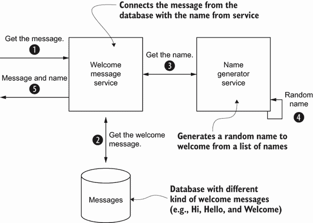
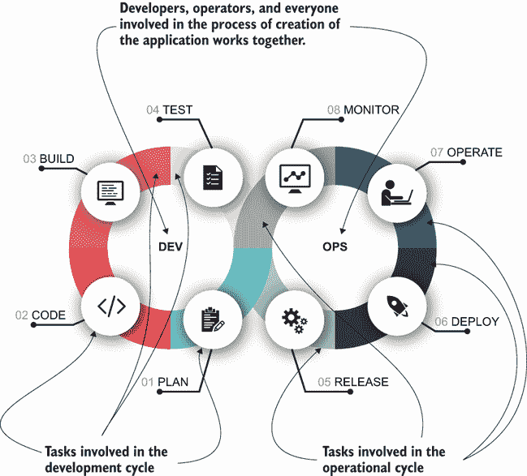
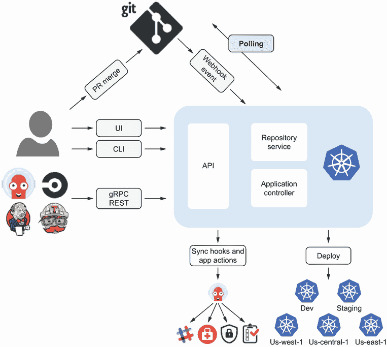
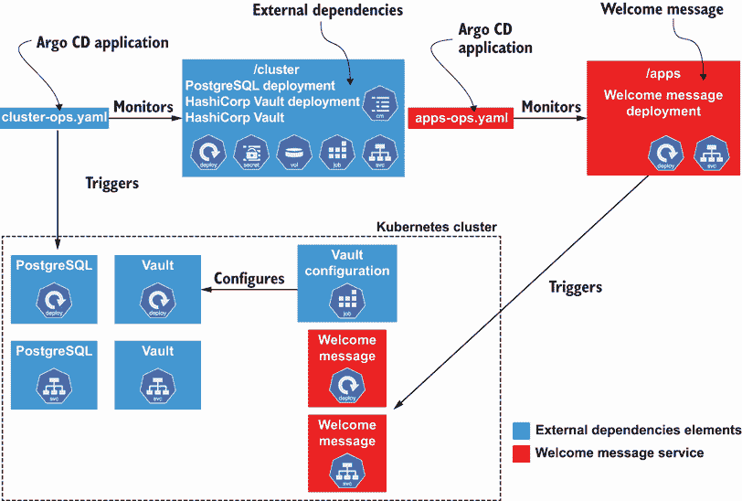
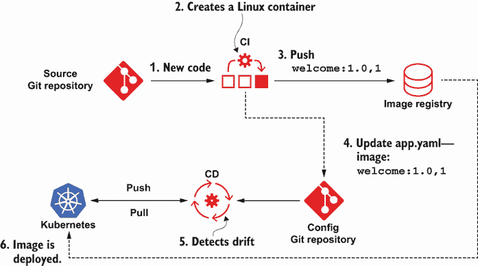

# 8 Kubernetes 原生持续交付和机密信息

本章涵盖

+   介绍持续交付和部署方法

+   使用 GitOps 方法实现 Kubernetes 原生持续部署管道

+   展示 ArgoCD 作为实现 GitOps 的 Kubernetes 原生解决方案

在上一章中，你了解了如何在 CI 阶段管理机密信息，构建应用程序，创建容器镜像，并将其发布到容器注册库。但是，服务尚未部署或发布到 Kubernetes 集群。在本章中，你将了解如何安全地交付应用程序。

在本章中，你将了解如何使用持续部署和 GitOps 方法将服务部署和发布到 Kubernetes 集群，使用 Argo CD 快速交付高质量应用程序，同时在整个管道中正确管理机密信息，以防止在开发阶段发生泄露。

## 8.1 持续交付和部署简介

*持续交付*是一种涉及更快、更频繁发布软件的方法。这种方法有助于降低可能影响用户体验的更改交付的成本、时间和风险。由于应用程序的交付是持续进行的，并且是增量更新，因此更容易从最终用户那里收集反馈并相应地做出反应。

CD 的核心概念是*部署管道*。正如其名所示，它是一系列步骤或程序，应用程序必须通过这些步骤或程序才能发布到生产环境。部署管道可能会根据你在发布应用程序时选择遵循的过程而改变，但一个典型的管道通常由以下阶段组成：

+   *提交阶段*——发布流程的第一部分，在团队成员向 SCM 服务器提交内容后触发。这一阶段是前一章中展示的持续集成阶段。

+   *验收测试*——这一阶段测试应用程序是否满足业务方面的预期。其中一些测试可能是自动的，但也有一些不是，例如探索性测试。

+   *发布*——基于每个阶段的反馈，关键用户决定是否将版本发布到生产环境或放弃该版本。

注意，持续交付中的发布流程意味着进行实际发布的手动决策。另一方面，持续部署在构建成功后自动将每个更改发布到生产环境。图 8.1 显示了 CI/CD 管道的阶段。


图 8.1 持续集成与持续交付阶段对比

在以下章节中，你将专注于服务的发布流程，自动将其部署到 Kubernetes 集群，并使用 DevOps 方法保护涉及到的机密信息。

## 8.2 欢迎信息的持续交付

在本章中，你将部署与上一章相同的应用程序到 Kubernetes 集群中。它从 CI 阶段结束的地方（将欢迎信息容器推送到容器注册库）继续，并将其交付到生产环境中。提醒一下，图 8.2 展示了应用程序及其组成部分的概述。



图 8.2 欢迎和名称服务之间交互的概述

现在你已经对要部署的应用程序有了概述，展示部署它的 Kubernetes 资源文件。

### 8.2.1 部署名称生成器服务

本章重点介绍在欢迎信息服务中应用 CD 原则，以使用 GitOps 方法自动将其部署到 Kubernetes 集群中。虽然这是一个特定服务的示例，但相同的方法可以应用于任何其他服务，包括支付服务、股票服务或用户管理服务。为了保持简单，使用以下部署文件手动部署名称生成器服务。

列表 8.1 src/main/kubernetes/deployment.yml

```
---
apiVersion: v1
kind: Service
metadata:
  labels:
    app.kubernetes.io/name: name-generator
    app.kubernetes.io/version: 1.0.0
  name: name-generator                                        ①
spec:
  ports:
  - name: http
    port: 8080
    targetPort: 8080
  selector:
    app.kubernetes.io/name: name-generator
    app.kubernetes.io/version: 1.0.0
  type: ClusterIP
---
apiVersion: apps/v1
kind: Deployment
metadata:
  labels:
    app.kubernetes.io/version: 1.0.0
    app.kubernetes.io/name: name-generator
  name: name-generator
spec:
  replicas: 1
  selector:
    matchLabels:
      app.kubernetes.io/version: 1.0.0
      app.kubernetes.io/name: name-generator
  template:
    metadata:
      labels:
        app.kubernetes.io/version: 1.0.0
        app.kubernetes.io/name: name-generator
    spec:
      containers:
      - env:
        - name: KUBERNETES_NAMESPACE
          valueFrom:
            fieldRef:
              fieldPath: metadata.namespace
        image: quay.io/lordofthejars/name-generator:1.0.0     ②
        imagePullPolicy: Always
        name: name-generator
        ports:
        - containerPort: 8080
          name: http
          protocol: TCP
```

① 为名称生成器服务创建 Kubernetes 服务

② 部署名称生成器容器

创建部署文件后，运行以下命令。

列表 8.2 部署名称生成器服务

```
kubectl apply -f src/main/kubernetes/deployment.yml    ①

service/name-generator created
deployment.apps/name-generator created
```

① 为名称生成器服务创建服务和部署

当名称生成器服务运行起来后，使用 GitOps 方法部署和发布欢迎信息服务。

### 8.2.2 DevOps 和 GitOps

*DevOps* 是一套自动化并帮助整合软件开发和 IT 团队流程的实践，以便更快、更可靠地构建、测试和发布应用程序。DevOps 不仅关乎开发者和运维团队；它涉及整个组织。每个团队都应从规划阶段开始，直到应用程序在生产环境中发布（图 8.3）成为软件生命周期的一部分。



图 8.3 DevOps 生命周期

*GitOps* 是一种实现 DevOps 方法的方式，基于 Git 是唯一真相来源的假设。不仅应用程序的源代码存储在 Git 中，构建应用程序和基础设施代码的脚本以及用于发布和更新应用程序的管道定义也存储在 Git 中。这意味着应用程序的所有部分都是版本化的、分叉的，当然，它们也可以被审计。

总结来说，GitOps 原则包括以下内容：

+   Git 是唯一的真相来源。

+   将一切视为代码。

+   运维是通过 Git 工作流程产生的。

GitOps 的重要方面之一是，与基础设施相关的任何 Git 仓库更新都必须触发环境的更新，以满足应用程序的期望状态。当期望状态（在 Git 仓库中设置）与观察状态（集群中的实际状态）之间存在差异时，收敛机制将被执行，以将观察状态驱动到版本控制中定义的期望状态。有两种方式可以导致差异：

1.  如果手动更新 Kubernetes 集群，期望状态和观察状态将不同，收敛机制将更新 Kubernetes 集群到 Git 中定义的期望状态。

1.  如果在 Git 中更新了文件（例如，需要发布新的容器镜像），期望状态和观察状态将不同，Kubernetes 集群状态将更新到 Git 中定义的新状态。

让我们看看如何使用 Argo CD，一个 Kubernetes 的 GitOps 持续交付工具，通过 Git 更新 Kubernetes 集群。

## 8.3 Argo CD

现在是时候使用 Argo CD 和 GitOps 方法将欢迎信息服务部署到 Kubernetes 集群了。如前所述，应用程序的源代码以及构建应用程序的脚本和管道定义，以及发布和更新应用程序的基础设施代码都存储在 Git 中。

Argo CD 有三个主要组件：

+   *API 服务器*——ArgoCD 后端将 API 暴露给 Web UI、CLI 或任何其他系统。该组件的主要职责是应用程序管理、安全问题和管理 Git webhook 事件。

+   *仓库服务器*——这是一个内部服务，用于维护 Git 仓库的本地缓存。

+   *应用程序控制器*——这是一个 Kubernetes 控制器，它持续监控 Git 仓库中放置的清单，并将其与集群上的实时状态进行比较。可选地，它可以采取纠正措施。

图 8.4 展示了这些部分及其相互关系。



图 8.4 ArgoCD 元素与 Kubernetes 集群之间部署应用程序的交互

### 8.3.1 安装 ArgoCD

要安装 ArgoCD 1.8.7，创建一个新的 Kubernetes 命名空间，并将 Argo CD 资源应用到 Kubernetes 集群中，如下所示。

列表 8.3 安装 ArgoCD

```
kubectl create namespace argocd                                          ①
kubectl apply -n argocd -f https://raw.githubusercontent.com/argoproj/
➥argo-cd/v1.8.7/manifests/install.yaml                                  ②
customresourcedefinition.apiextensions.k8s.io/applications.argoproj.io
➥created
customresourcedefinition.apiextensions.k8s.io/appprojects.argoproj.io
➥created
serviceaccount/argocd-application-controller created
serviceaccount/argocd-dex-server created
serviceaccount/argocd-redis created
serviceaccount/argocd-server created
role.rbac.authorization.k8s.io/argocd-application-controller created
role.rbac.authorization.k8s.io/argocd-dex-server created
role.rbac.authorization.k8s.io/argocd-redis created
role.rbac.authorization.k8s.io/argocd-server created
clusterrole.rbac.authorization.k8s.io/argocd-application-controller created
clusterrole.rbac.authorization.k8s.io/argocd-server created
rolebinding.rbac.authorization.k8s.io/argocd-application-controller created
rolebinding.rbac.authorization.k8s.io/argocd-dex-server created
rolebinding.rbac.authorization.k8s.io/argocd-redis created
rolebinding.rbac.authorization.k8s.io/argocd-server created
clusterrolebinding.rbac.authorization.k8s.io/argocd-application-controller
➥created
clusterrolebinding.rbac.authorization.k8s.io/argocd-server created
configmap/argocd-cm created
configmap/argocd-gpg-keys-cm created
configmap/argocd-rbac-cm created
configmap/argocd-ssh-known-hosts-cm created
configmap/argocd-tls-certs-cm created
secret/argocd-secret created
service/argocd-dex-server created
service/argocd-metrics created
service/argocd-redis created
service/argocd-repo-server created
service/argocd-server created
service/argocd-server-metrics created
deployment.apps/argocd-dex-server created
deployment.apps/argocd-redis created
deployment.apps/argocd-repo-server created
deployment.apps/argocd-server created
statefulset.apps/argocd-application-controller created
```

① 创建 argocd 命名空间

② 从 argocd 命名空间中的官方资源安装 Argo CD

TIP `argocd` CLI 是一个用于与 Argo CD 交互的命令行工具。要安装它，只需访问 [`github.com/argoproj/argo-cd/releases/tag/v1.7.14`](https://github.com/argoproj/argo-cd/releases/tag/v1.7.14)，下载您平台上的包，解压缩存档，并将 `argocd` 文件复制到 `PATH` 目录中，这样就可以从任何目录访问它。

接下来，通过使用列表 8.4 中所示的补丁命令，将 Argo CD Kubernetes 服务更改为`LoadBalancer`类型以暴露`Argo CD 服务器`。

列表 8.4 暴露 ArgoCD 服务器

```
kubectl patch svc argocd-server -n argocd -p
➥'{"spec": {"type": "LoadBalancer"}}'         ①
```

① 将 Kubernetes 服务类型更改为 LoadBalancer

要使用`argocd` CLI 工具，你需要外部 IP 和暴露的 Argo CD 服务器端口。你可以通过运行以下列表中的命令来获取它们。

列表 8.5 Argo CD 访问 IP 和端口

```
IP=$(minikube ip -p argo)                                   ①
PORT=$(kubectl get service/argocd-server -n argocd
➥-o jsonpath="{.spec.ports[?(@.port==443)].nodePort}")     ②
```

① 设置访问 Argo CD 服务器的 IP

② 设置暴露的端口以访问 Argo CD 服务器

在配置 Argo CD 之前，最后一步是使用 CLI 工具登录到 Argo CD 服务器。默认情况下，用户名为`admin`，初始密码是自动生成的 Argo CD API 服务器 Pod 名称。密码可以通过以下列表中的命令检索。

列表 8.6 获取 Argo CD 密码

```
kubectl get pods -n argocd -l app.kubernetes.io/name=argocd-server
➥-o name | cut -d'/' -f 2      ①
```

① 获取 Argo CD Pod 名称

运行如下所示的`login`命令，使用在最后一步检索到的`admin`用户名和密码登录到 Argo CD 服务器。

列表 8.7 ArgoCD 登录

```
argocd login $IP:$PORT     ①
```

① 登录到 Argo CD。

### 8.3.2 欢迎服务与 GitOps

在 7.2.1 节中安装 Gitea 时，本章所需源代码的 Git 仓库已迁移到内部。此仓库包含两个源目录：每个服务一个，还有一个名为`welcome-message-gitops`的目录，其中放置了与欢迎信息服务和 GitOps 定义相关的所有 Kubernetes YAML 文件。仓库布局如下所示。

列表 8.8 仓库布局

```
├── name-generator                  ①
│     ├── README.md
│     ├── mvnw
│     ├── mvnw.cmd
│     ├── pipelines
│     ├── pom.xml
│     ├── src
│     └── target
├── welcome-message                 ②
│     ├── Dockerfile
│     ├── README.md
│     ├── mvnw
│     ├── mvnw.cmd
│     ├── pom.xml
│     ├── src
│     ├── target
│     └── vault-init
└── welcome-message-gitops          ③
     ├── apps                       ④
     ├── cluster                    ⑤
     └── gitops                     ⑥
```

① 名称生成器服务源代码

② 欢迎信息服务源代码

③ GitOps 文件

④ 欢迎信息服务部署文件

⑤ 单次操作部署文件

⑥ Argo CD 定义

`welcome-message-gitops`目录由三个目录组成：

+   *应用程序*—发布欢迎信息服务到 Kubernetes 的部署 YAML 文件

+   *集群*—部署欢迎信息服务（PostgreSQL 和 Vault）所需的外部依赖项的 YAML 文件

+   *GitOps*—在 Argo CD 中注册应用程序所需的 YAML 文件

```
welcome-message-gitops
├── apps
├── cluster
└── gitops
```

应用程序

应用程序文件夹包含将服务部署到 Kubernetes 集群所需的部署文件。在这种情况下，有两个标准的 Kubernetes `Deployment`和`Service`资源。

```
welcome-message-gitops
├── apps
│      └── app.yml
│      └── service.yml
```

要部署欢迎信息服务，创建包含以下列表中内容的`apps.yaml`文件。

列表 8.9 apps/apps.yml

```
---
apiVersion: apps/v1
kind: Deployment
metadata:
  labels:
    app.kubernetes.io/name: welcome-message
  name: welcome-message
spec:
  replicas: 1
  selector:
    matchLabels:
      app.kubernetes.io/name: welcome-message
  template:
    metadata:
      labels:
        app.kubernetes.io/name: welcome-message
    spec:
      containers:
      - env:
        - name: KUBERNETES_NAMESPACE
          valueFrom:
            fieldRef:
              fieldPath: metadata.namespace
        image: quay.io/lordofthejars/welcome-message:1.0.0    ①
        imagePullPolicy: Always
        name: welcome-message
        ports:
        - containerPort: 8080
          name: http
          protocol: TCP
```

① 部署欢迎信息的第一个版本

创建一个`service.yml`文件，使其内容如下所示，以便使欢迎信息可访问。

列表 8.10 apps/service.yml

```
---
apiVersion: v1
kind: Service
metadata:
  labels:
    app.kubernetes.io/name: welcome-message
  name: welcome-message
spec:
  ports:
  - name: http
    port: 8080
    targetPort: 8080
  selector:
    app.kubernetes.io/name: welcome-message
  type: LoadBalancer
```

集群

集群文件夹包含部署和配置服务所需的所有 YAML 文件，在这种情况下，作为数据库的 PostgreSQL 和作为秘密管理系统 HashiCorp Vault：

```
welcome-message-gitops
├── cluster
│      ├── postgresql.yaml
│      ├── vault-job.yaml
│      ├── vault-secrets.yaml
│      └── vault.yaml
```

`postgresql.yaml` 和 `vault.yaml` 文件是部署这两个服务到 Kubernetes 集群的标准部署文件，但还有两个文件需要解释。`vault-secrets.yaml` 文件是一个 Kubernetes `Secret` 对象，包含需要存储到 HashiCorp Vault 并由应用程序使用的机密。在这种情况下，这些是登录 HashiCorp Vault 的令牌和 Welcome 服务用于验证 Name Generator 服务的 API 令牌。文件的部分内容如下所示。

列表 8.11 cluster/vault-secrets.yml

```
apiVersion: v1
kind: Secret
metadata:
  name: vault-secrets
type: Opaque
data:
  VAULT_LOGIN: cm9vdA==                       ①
  NAME_SERVICE_TOKEN: ZXlKcmFXUWlPa........   ②
```

① HashiCorp Vault 访问令牌

② API 密钥

`vault-job.yaml` 文件是一个 Kubernetes `Job` 对象，用于配置 HashiCorp Vault 实例。它在部署 HashiCorp Vault 之后应用，启用 Kubernetes 认证模式和数据库动态机密，配置策略，并将 API 令牌添加到键值机密存储中。文件的部分内容如下所示。

列表 8.12 cluster/vault-job.yml

```
apiVersion: batch/v1
kind: Job
metadata:
  name: init-vault
  annotations:
    argocd.argoproj.io/hook: PostSync         ①
    argocd.argoproj.io/hook-delete-policy: HookSucceeded
spec:
  template:
    spec:
      volumes:
      - name: vault-scripts-volume
        configMap:
          name: vault-scripts
          defaultMode: 0777
      containers:
      - name: init-vault
        image: vault:1.6.2
        envFrom:
          - secretRef:                        ②
              name: vault-secrets
        volumeMounts:
          - mountPath: /vault-scripts         ③
            name: vault-scripts-volume
        command:
          - /bin/ash                          ④
          - -c
          - |
            export VAULT_ADDR=http://vault:8200
            vault login $VAULT_LOGIN
            vault auth enable kubernetes
            vault secrets enable database
            vault write database/config/mydb
            ➥plugin_name=postgresql-database-plugin
            ➥allowed_roles=mydbrole ...
            vault write database/roles/mydbrole db_name=mydb ...
            vault policy write vault-secrets-policy
            ➥/vault-scripts/vault-secrets-policy.hcl
            vault kv put secret/myapps/welcome/config
            ➥name-service-token=$NAME_SERVICE_TOKEN
      restartPolicy: Never
  backoffLimit: 2
```

① 该文件在部署 HashiCorp Vault 之后应用。

② 机密作为环境变量注入。

③ 将 HashiCorp Vault 配置文件挂载为卷。

④ 配置 HashiCorp Vault 的作业命令

重要的是，为了保持简单，`vault-secrets.yaml` 是一个标准的 Kubernetes Secrets 文件，但它应该以第三章中解释的任何一种方式得到保护。

Gitops

`gitops` 文件夹包含所有用于将前面的文件夹注册为 Argo CD 应用程序的文件。

```
welcome-message-gitops
└── gitops
     ├── apps-ops.yaml        ①
     └── cluster-ops.yaml     ②
```

① 配置 Argo CD 以监控 apps 目录上的任何更改

② 配置 Argo CD 以监控集群目录上的任何更改

在下一节中，您将更详细地了解这些文件。

提示：您可以将应用程序和外部依赖项部署文件放入同一目录中。然而，我们的建议是将通常会更改的文件与很少更改的文件分开。

### 8.3.3 从 Git 仓库创建欢迎信息服务

Argo CD 的 *应用程序* 是一组 Kubernetes 资源，用于将应用程序部署到目标环境并保持其处于期望状态。应用程序在 Argo CD 自定义资源定义 (CRD) 文件中定义，其中您指定参数，如 Git 仓库、Kubernetes 资源路径或应用程序将要部署的目标。图 8.5 显示了 `cluster-ops` 和 `apps-ops` Argo CD 应用程序部署的架构。



图 8.5 Argo CD 应用程序部署

列表 8.13 展示了如何定义一个 Argo CD 应用程序，该程序克隆 Gitea 中定义的 Git 仓库，监听 welcome-message-gitops/apps 目录中的任何更改，并将这些更改应用到满足期望状态。正如我们之前所说的，apps 目录包含将欢迎信息服务部署到 Kubernetes 集群所需的所有资源。在 welcome-message-gitops/gitops 文件夹中创建 `apps-ops.yaml` 文件。

列表 8.13 welcome-message-gitops/gitops/apps-ops.yaml

```
apiVersion: argoproj.io/v1alpha1
kind: Application
metadata:
  name: welcome-cluster-apps
  namespace: argocd
spec:
  project: default
  syncPolicy:                                ①
    automated:
      prune: true                            ②
      selfHeal: true                         ③

  source:
    repoURL: http://gitea.default.svc:3000/gitea/
    ➥kubernetes-secrets-source.git          ④
    targetRevision: HEAD
    path: welcome-message-gitops/apps        ⑤
  destination:                               ⑥
    server: https://kubernetes.default.svc
    namespace: default
```

① 自动同步资源

② 当 Argo CD 检测到 Git 中不再定义资源时删除资源

③ 当实时集群的状态漂移时，对 Git 中定义的值执行自动同步。

④ 设置 Git 仓库 URL

⑤ 应用清单的目录

⑥ 应用清单的目标集群

以类似的方式，将集群目录添加为 Argo CD 应用。在 welcome-message-gitops/gitops 文件夹中创建 `cluster-ops.yaml` 文件。

列表 8.14 welcome-message-gitops/gitops/cluster-ops.yaml

```
apiVersion: argoproj.io/v1alpha1
kind: Application
metadata:
  name: welcome-cluster-ops
  namespace: argocd
spec:
  project: default
  syncPolicy:
    automated:
      prune: true
      selfHeal: true
  source:
    repoURL: http://gitea.default.svc:3000/gitea/
    ➥kubernetes-secrets-source.git
    targetRevision: HEAD
    path: welcome-message-gitops/cluster      ①
  destination:
    server: https://kubernetes.default.svc
    namespace: default%
```

① 外部依赖的清单目录

将 cluster-ops.yaml 资源应用到安装和配置 Welcome Message 服务所需的外部依赖。在终端窗口中，运行以下列表中显示的命令。

列表 8.15 注册集群应用

```
kubectl apply -f welcome-message-gitops/gitops/
➥cluster-ops.yaml        ①
```

① 注册集群应用

上次执行将集群目录注册为 Argo CD 应用。由于是第一次，并且 `syncPolicy` 参数设置为 `automated`，Argo CD 会自动应用那里定义的资源。通过以下列表中显示的命令获取默认命名空间中的 Pods 来验证 PostgreSQL 和 Vault 是否已部署。

列表 8.16 获取所有 `pods`

```
kubectl get pods -n default

NAME                                  READY   STATUS    RESTARTS   AGE
gitea-deployment-7fbbf9c8b-bbcjq      1/1     Running   1          2d17h
name-generator-579ccdc5d5-mhzft       1/1     Running   2          2d23h
postgresql-59ddd57cb6-tjrg2           1/1     Running   0          6m30s  ①
registry-deployment-64d49ff847-hljg9  1/1     Running   2          2d23h
vault-0                               1/1     Running   0          6m30s  ②
welcome-message-55474d6b78-g9l5w      1/1     Running   0          2m1s
```

① PostgreSQL 已部署。

② Vault 状态集已部署。

`argocd` CLI 工具还允许你使用以下列表中显示的命令来审查部署的状态。

列表 8.17 列出 ArgoCD 应用

```
argocd app list    ①

NAME                 CLUSTER                             NAMESPACE  PROJECT
welcome-cluster-ops  https://kubernetes.default.svc      default    default
➥STATUS  HEALTH   SYNCPOLICY  CONDITIONS
  Synced  Healthy  Auto-Prune  <none>
➥REPO
  https://github.com/lordofthejars/kubernetes-secrets-source.git
➥PATH                            TARGET
  welcome-message-gitops/cluster  HEAD
```

① 列出当前 Argo CD 应用

`status` 字段显示资源的当前状态。当它设置为 `Synced` 时，集群与 Git 仓库中指定的状态保持一致。要部署 Welcome Message 服务，使用以下列表中显示的命令应用之前步骤中创建的 `apps-ops.yaml` 文件。

列表 8.18 注册服务应用

```
kubectl apply -f welcome-message-gitops/gitops/apps-ops.yaml    ①
```

① 注册应用

使用以下列表中显示的命令，当 Pod 处于运行状态时，部署 Welcome Message 服务。

列表 8.19 获取所有 `pods`

```
kubectl get pods -n default

NAME                                   READY  STATUS    RESTARTS   AGE
gitea-deployment-7fbbf9c8b-bbcjq       1/1    Running   1          2d17h
name-generator-579ccdc5d5-mhzft        1/1    Running   2          2d23h
postgresql-59ddd57cb6-tjrg2            1/1    Running   0          6m30s
registry-deployment-64d49ff847-hljg9   1/1    Running   2          2d23h
vault-0                                1/1    Running   0          6m30s
welcome-message-55474d6b78-g9l5w       1/1    Running   0          2m1s   ①
```

① Welcome Message 服务已部署。

### 8.3.4 更新 Welcome 服务

到目前为止，你已经学习了如何使用 Tekton 构建 Welcome Message 服务，以及如何使用 Argo CD 项目自动部署它。但是，当服务已经部署并且需要发布新版本时会发生什么呢？

除了打包服务的新版本、构建容器并将其推送到容器注册库，如第 7.3 节中所述，现在 CI 管道需要更新 Welcome Message 服务的 Kubernetes 部署文件，并使用新容器标签将其推送到 Git 仓库以启动服务的滚动更新。图 8.6 展示了 Tekton（持续集成部分）和 Argo CD（持续交付部分）如何协同工作以实现 CD 管道。



图 8.6 Tekton 和 Argo CD 之间的相互关系

要实现这两个剩余步骤，需要对 Tekton 资源进行一些更改。

GitOps 仓库的 PipelineResource

首先需要注册的是一个新的 PipelineResource，用于注册 GitOps 仓库位置。这个仓库是 Argo CD 监听更改的地方。定义如下所示。

列表 8.20 welcome-service-gitops-resource.yaml

```
apiVersion: tekton.dev/v1alpha1
kind: PipelineResource
metadata:
  name: welcome-service-git-gitops-source
spec:
  type: git
  params:
    - name: url
      value: http://gitea.default.svc:3000/gitea/
      ➥kubernetes-secrets-source.git               ①
```

① 章节开头迁移的仓库

在终端窗口中，使用以下列表中的命令应用资源。

列表 8.21 注册 GitOps 仓库

```
kubectl apply -f welcome-service-gitops-resource.yaml    ①
```

① 注册管道资源

您需要设置用户名和密码，以便将部署文件中做出的更改推送到先前存储库。这通过创建包含以下列表内容的 Kubernetes Secret 和服务帐户来完成。

列表 8.22 git-secret.yaml

```
---
apiVersion: v1
kind: Secret
metadata:
  name: git-auth
  annotations:
    tekton.dev/git-0: http://gitea.default.svc:3000    ①
type: kubernetes.io/basic-auth                         ②
stringData:                                            ③
  username: gitea
  password: gitea1234
---
apiVersion: v1
kind: ServiceAccount
metadata:
  name: git-service-account
secrets:
  - name: git-auth                                     ④
```

① 设置用于认证的服务 URL（gitea 主机）

② 配置认证模式。

③ 在基本认证机制中使用的用户名和密码

④ 使用创建的密钥的服务帐户

重要提示：请记住使用第三章中展示的任何技术正确管理这些密钥。

在终端窗口中，使用以下列表中的命令应用资源。

列表 8.23 注册 Gitea 密钥

```
kubectl apply -f git-secret.yaml     ①
```

① 创建密钥

更新 Tekton 任务以更新容器镜像

关于 `yq`

`yq` 是一个轻量级且便携的命令行 YAML 处理器。它可以用于查询 YAML 文档或修改它们。`yq` 工具使用以下结构：

```
yq eval [flag] [expression] [yaml_file]
```

给定以下 YAML 文档：

```
apiVersion: apps/v1
kind: Deployment
metadata:
  labels:
    app: myboot
  name: myboot
spec:
  replicas: 1
  selector:
    matchLabels:
      app: myboot
  template:
    metadata:
      labels:
        app: myboot
    spec:
      containers:
      - image: quay.io/rhdevelopers/myboot:v1
```

您可以使用以下表达式通过 `image` 字段进行引用：`.spec.template .spec.containers[0].image`。运行以下命令使用 `yq` 更新 `image` 字段到新值：

```
yq eval -i '.spec.template.spec.containers[0].image =
➥"quay.io/rhdevelopers/myboot:v2"' deployment.yml
```

在配置管道之前，您需要修改先前定义的任务，并添加两个新功能：

+   定义 GitOps 存储库的新资源，以便自动克隆

+   定义一个步骤，使用前一个步骤中创建的容器镜像标签更新部署定义

```
apiVersion: tekton.dev/v1beta1
kind: Task
metadata:
  name: welcome-service-app
spec:
  params:
    ...
  resources:
    inputs:
      - name: source
        type: git
      - name: gitops                                          ①
        type: git
  steps:
    - name: maven-build
      ...

    - name: build-and-push-image
      ...

    - name: update-deployment-file
      image: quay.io/lordofthejars/image-updater:1.0.0        ②
      script: |
        #!/usr/bin/env ash

        cd /workspace/gitops                                  ③

        git checkout -b newver                                ④

        git config --global user.email "alex@example.com"     ⑤
        git config --global user.name "Alex"

        yq eval -i '.spec.template.spec.containers[0].image
        ➥= env(DESTINATION_IMAGE)'
        ➥welcome-message-gitops/apps/app.yml                 ⑥

        git add .                                             ⑦
        git commit -m "Update to $DESTINATION_IMAGE"
        git push origin newver:master
      env:
        - name: DESTINATION_IMAGE
          value: "$(inputs.params.imageName)"
  volumes:
    - name: varlibc
      emptyDir: {}
```

① 使用 gitops 名称定义 GitOps 输入资源

② 使用 git 和 yq 安装的定制镜像

③ 进入克隆的仓库

④ 为更新创建新分支

⑤ 配置 Git 用户

⑥ 使用新容器更新部署文件

⑦ 将更改提交并推送到仓库

以下列表显示了 `Task` 的完整版本。

列表 8.24 welcome-service-task.yaml

```
apiVersion: tekton.dev/v1beta1
kind: Task
metadata:
  name: welcome-service-app
spec:
  params:
    - name: contextDir
      description: the context dir within source
      default: .
    - name: imageName
      description: the container name url-group-artifact-tag
  resources:
    inputs:
      - name: source
        type: git
      - name: gitops
        type: git
  steps:
    - name: maven-build                                                  ①
      image: docker.io/maven:3.6.3-jdk-11-slim
      command:
        - mvn
      args:
        - clean
        - install
      workingDir: "/workspace/source/$(inputs.params.contextDir)"

    - name: build-and-push-image
      image: quay.io/buildah/stable
      script: |
        #!/usr/bin/env bash
        buildah bud --layers -t $DESTINATION_IMAGE $CONTEXT_DIR          ②
        buildah push --tls-verify=false
        ➥$DESTINATION_IMAGE docker://$DESTINATION_IMAGE                 ③
      env:
        - name: DESTINATION_IMAGE
          value: "$(inputs.params.imageName)"
        - name: CONTEXT_DIR
          value: "/workspace/source/$(inputs.params.contextDir)"
      securityContext:
        runAsUser: 0
        privileged: true
      volumeMounts:
        - name: varlibc
          mountPath: /var/lib/containers
    - name: update-deployment-file
      image: quay.io/lordofthejars/image-updater:1.0.0
      script: |
        #!/usr/bin/env ash
        cd /workspace/gitops                                             ④
        git checkout -b newver                                           ⑤
        git config --global user.email "alex@example.com"
        git config --global user.name "Alex"
        yq eval -i '.spec.template.spec.containers[0].image
        ➥= "$DESTINATION_IMAGE"' welcome-message-gitops/apps/app.yml    ⑥
        git add .
        git commit -m "Update to $DESTINATION_IMAGE"
        git push origin newver:master                                    ⑦
      env:
        - name: DESTINATION_IMAGE
          value: "$(inputs.params.imageName)"
  volumes:
    - name: varlibc
      emptyDir: {}
```

① Apache Maven 任务打包应用程序

② 构建容器的 Buildah 命令

③ 将容器推送到容器注册表的 Buildah 命令

④ 移动到 gitops 仓库

⑤ 创建新分支

⑥ 使用新容器镜像标签更新部署 YAML 文件

⑦ 将更改提交并推送到 Git 仓库

在终端窗口中，执行以下列表中的命令以应用资源。

列表 8.25 更新 Welcome 服务任务

```
kubectl replace -f welcome-service-task.yaml    ①
```

① 更新上一章中的任务

重要：如果你在上一节中没有应用 Tekton `task`，请将 `replace` 替换为 `apply`。

更新 pipeline 定义

`pipeline` 定义需要在资源部分进行更新，如下所示，以注册 GitOps 仓库。

列表 8.26 welcome-service-pipeline.yaml

```
apiVersion: tekton.dev/v1beta1
kind: Pipeline
metadata:
  name: welcome-deployment
spec:
  resources:
    - name: appSource
      type: git
    - name: appGitOps            ①
      type: git
  ...
  tasks:
    - name: welcome-service-app
      ...
      resources:
        inputs:
          - name: source
            resource: appSource
          - name: gitops
            resource: appGitOps  ②
```

① 定义一个新的 Git 资源

② 将资源设置为任务

在终端窗口中，执行以下列表中的命令以应用资源。

列表 8.27 更新 Welcome 服务 pipeline

```
kubectl replace -f welcome-service-pipeline.yaml
```

重要：如果你在上一节中没有应用 Tekton `task`，请将 `replace` 替换为 `apply`。

更新 PipelineRun

最后，创建一个新的 `PipelineRun`，包含以下更改：

+   增加镜像标签号。

+   设置新的 `PipelineResource` 的引用。

+   配置运行 Pipeline 的服务账户。

新的 `PipelineRun` 如下所示。

列表 8.28 welcome-service-gitops-resource-2.yaml

```
apiVersion: tekton.dev/v1beta1
kind: PipelineRun
metadata:
  name: welcome-pipeline-run-2                        ①
spec:
  params:
    - name: imageTag
      value: "1.0.1"                                  ②
  resources:
    ...
    - name: appGitOps
      resourceRef:
        name: welcome-service-git-gitops-source       ③
  serviceAccountName: git-service-account             ④
  pipelineRef:
    name: welcome-deployment
```

① 新的 PipelineRun

② 增加容器版本。

③ 注册一个新的 GitOps 资源。

④ 使用 gitea 凭据的 serviceAccount

在终端窗口中，执行以下列表中的命令以应用资源。

列表 8.29 注册 PipelineRun

```
kubectl apply -f welcome-service-gitops-resource-2.yaml    ①
```

① 注册新的 PipelineRun

检查输出

在应用了之前的 `PipelineRun` 之后，一个新的 `Pipeline` 实例被启动。它在 Tekton 中执行以下步骤：

+   从 `gitea` 克隆 service Git 仓库和 GitOps 仓库

+   构建 service

+   创建容器镜像并将其推送到容器 `registry` 实例

+   使用新镜像更新部署文件

+   将部署文件推送到 GitOps 仓库

要查看当前正在执行的日志行，请运行以下列表中的命令。

列表 8.30 列出 PipelineRun

```
tkn pr logs -f     ①
```

① 显示当前 PipelineRun 的日志

步骤如下面的日志行所示：

```
[welcome-service-app : git-source-source-8xjvv] {
➥"level":"info","ts":1618242546.5564516,"caller":"git/git.go:165",
➥"msg":"Successfully cloned
➥http://gitea:3000/gitea/kubernetes-secrets-source.git @
➥841cd108640cc2aef9b52250e0ed8f5bf53ec973 (grafted, HEAD)
➥in path /workspace/source"}
[welcome-service-app : git-source-source-8xjvv] {
➥"level":"info","ts":1618242546.5845127,"caller":"git/git.go:203",
➥"msg":"Successfully initialized and updated submodules
➥in path /workspace/source"}                                         ①

[welcome-service-app : git-source-gitops-v6f2q] {
➥"level":"info","ts":1618242546.842591,"caller":"git/git.go:165",
➥"msg":"Successfully cloned
➥http://gitea:3000/gitea/kubernetes-secrets-source.git @
➥841cd108640cc2aef9b52250e0ed8f5bf53ec973 (grafted, HEAD)
➥in path /workspace/gitops"}
[welcome-service-app : git-source-gitops-v6f2q] {
➥"level":"info","ts":1618242546.8661046,"caller":"git/git.go:203",
➥"msg":"Successfully initialized and updated submodules
➥in path /workspace/gitops"}                                         ②

[welcome-service-app : maven-build] [INFO]
➥Scanning for projects...                                            ③

....

[welcome-service-app : maven-build] [INFO] BUILD SUCCESS
[welcome-service-app : maven-build] [INFO] ---------------------------------
[welcome-service-app : maven-build] [INFO] Total time:  01:12 min
[welcome-service-app : maven-build] [INFO] Finished at: 2021-04-12T15:50:22Z
[welcome-service-app : maven-build] [INFO] ---------------------------------

[welcome-service-app : build-and-push-image] STEP 1: FROM
➥registry.access.redhat.com/ubi8/ubi-minimal:8.3                     ④
[welcome-service-app : build-and-push-image] Getting image source signatures

....

[welcome-service-app : build-and-push-image]
➥Writing manifest to image destination
[welcome-service-app : build-and-push-image]
➥Storing signatures                                                  ⑤

[welcome-service-app : update-deployment-file]
➥Switched to a new branch 'newver'                                   ⑥

....

[welcome-service-app : update-deployment-file]
➥To http://gitea:3000/gitea/kubernetes-secrets-source.git
[welcome-service-app : update-deployment-file]
➥841cd10..472d777  newver -> master                                  ⑦
```

① 克隆 Welcome 服务 Git 仓库。

② 克隆 Welcome 服务 GitOps 仓库。

③ 构建 Welcome 服务 Java 项目

④ 构建 Welcome 服务 Linux 容器

⑤ 将 Linux 容器推送到容器注册库

更新欢迎服务部署文件

⑦ 将部署文件推送到 GitOps 仓库

执行这些步骤后，Argo CD 将检测 `welcome-message-gitops/apps/app.yml` 部署文件上的更改。它将应用这些更改，触发服务的滚动更新到新版本。

重要：Argo CD 控制器可以使用 webhook 或每三分钟轮询来检测和同步新的清单。轮询策略是默认的。

等待最多三分钟后，Argo CD 将检测到更改并开始同步过程，应用新的部署文件。假设你持续监控 Pod 的状态，你会看到旧的欢迎信息 Pod 被终止，并自动启动一个新的 Pod，该 Pod 在 Tekton 流程中创建的容器中。连续执行以下列表中的命令以检查更改。

列表 8.31 获取所有 pod

```
kubectl get pods

NAME                                  READY  STATUS      RESTARTS  AGE
gitea-deployment-7fbbf9c8b-xc27w      1/1    Running     0         16m
name-generator-579ccdc5d5-mhzft       1/1    Running     2         3d5h
postgresql-59ddd57cb6-tjrg2           1/1    Running     0         5h34m
registry-deployment-64d49ff847-hljg9  1/1    Running     2         3d5h
vault-0                               1/1    Running     0         5h34m
welcome-message-55799f7dc9-c5j24      1/1    Running     0         13s    ①
welcome-message-6778c7978b-tqxkv      1/1    Terminating 0         8m58s  ②
welcome-pipeline-run-welcome
-service-app-mj5z6-pod-mkkpx          0/5    Completed   0         6m17s  ③
```

① 已部署服务的最新版本。

② 服务的老版本已卸载。

③ PipelineRun 已完成。

如列表 8.32 所示，描述新部署的 Pod 显示了新容器被使用。

列表 8.32 描述新的欢迎服务 `pod`

```
kubectl describe pod welcome-message-55799f7dc9-c5j24                 ①

....
Controlled By:  ReplicaSet/welcome-message-55799f7dc9
Containers:
 welcome-message:
  Container ID:
  ➥docker://fa8b45f46311819adb0fcfc5c8d8a17e4626792aac38f0e6a116d71cb0571718
    Image:          registry:5000/k8ssecrets/welcome-message:1.0.1    ②
....
```

① 将 pod 名称更改为正确的名称

② 版本标签已更新。

图 8.7 显示了 Argo CD 仪表板的截图，其中显示了欢迎信息的状态。如果你仔细看，你会看到 `rev:2` 是当前的部署，因为服务已被更新。


图 8.7 Argo CD 仪表板

## 摘要

+   Kubernetes Secrets 被用于应用程序代码（例如，用户名、密码和 API 密钥）以及 CI/CD 管道（例如，外部服务的用户名和密码）。

+   启用 Kubernetes 数据静态加密以在 Kubernetes 内部存储加密密钥。

+   CD 密钥需要像其他密钥一样受到保护。使用 Argo CD 中的 `SealSecrets` 将加密密钥存储在 Git 中。

+   Git 被用作源代码和部署脚本的单一真相来源。

+   Argo CD 是一个 Kubernetes 控制器，允许你在 Kubernetes 中实现 GitOps。
