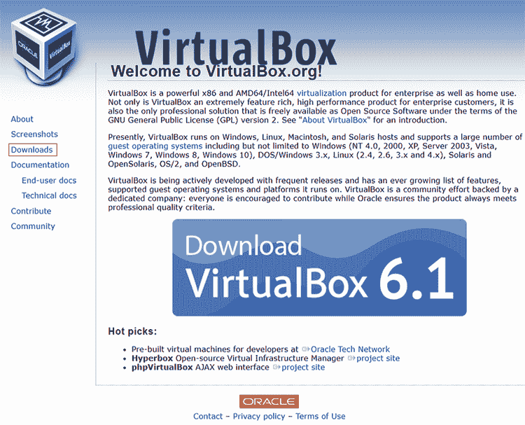
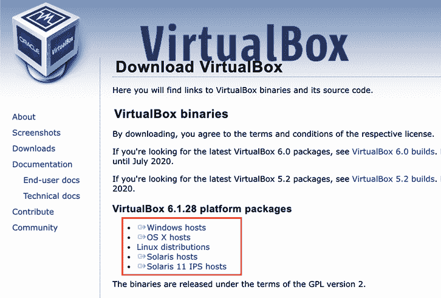
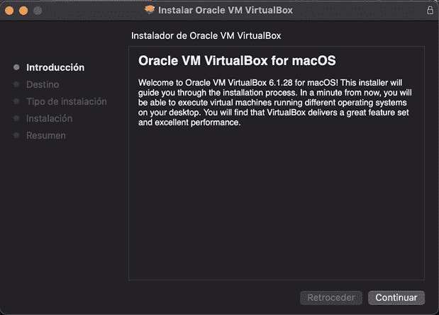
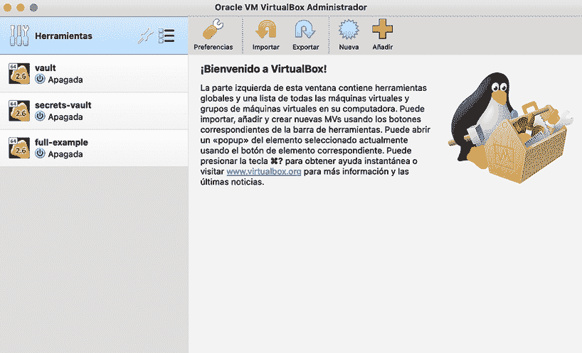
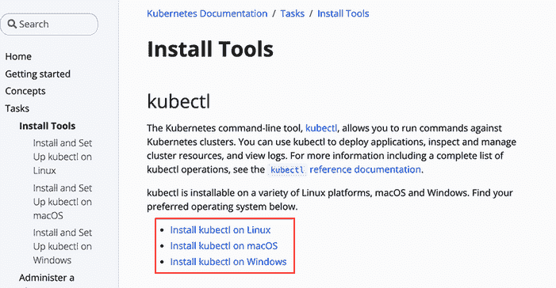
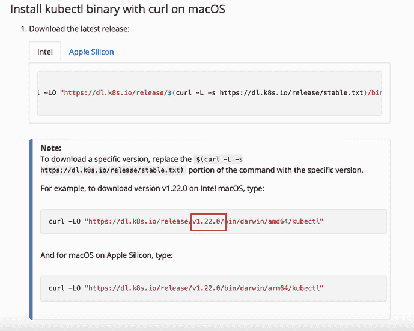
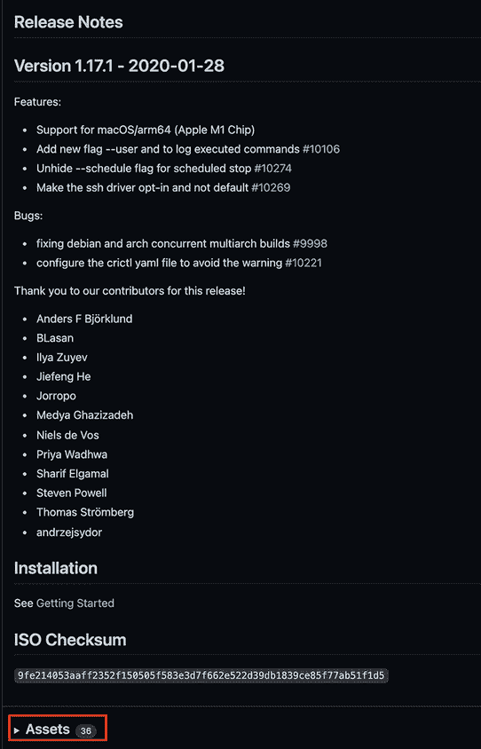
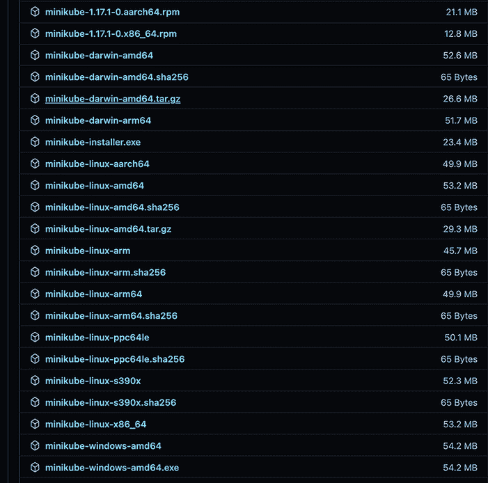

# 附录 A. 工具

要在你的机器上部署和管理 Kubernetes 环境，需要安装和配置几个工具。

## A.1 Minikube

Minikube 是一个本地 Kubernetes 集群，专注于使在本地环境中学习和开发 Kubernetes 变得容易。它依赖于容器/虚拟化技术，如 Docker、Podman、HyperKit、Hyper-V、KVM 或 VirtualBox，以启动安装了 Kubernetes 的 Linux 机器。VirtualBox 虚拟化工具因其简单性和通用性而被使用，因为它可以在最常用的操作系统（Microsoft Windows、Linux 和 Mac OS）中工作。

如果尚未安装 VirtualBox，请在浏览器中打开以下网址：[`www.virtualbox.org/`](https://www.virtualbox.org/)。当网页打开时，点击左侧菜单中的“下载”链接，如图 A.1 所示。



图 A.1 VirtualBox 主页，标注了“下载”部分

然后根据运行示例的操作系统选择你的软件包，如图 A.2 所示。



图 A.2 VirtualBox 下载页面，展示了不同的软件包

下载过程将开始将软件包存储在你的本地磁盘上。当此过程完成后，点击下载的文件以启动安装过程，如图 A.3 所示。



图 A.3 VirtualBox 安装窗口

你可以使用安装过程提供的默认 VirtualBox 配置值，或者根据你的需求进行修改。安装完成后，你可以通过打开它来验证 VirtualBox 是否已正确安装。见图 A.4，展示了 VirtualBox 的打开屏幕，其中安装了三台机器。



图 A.4 VirtualBox 状态窗口，显示三个实例

## A.2 Kubectl

要与 Kubernetes 集群交互，你需要安装 kubectl CLI 工具。下载和安装 kubectl 的最佳方式是访问以下网址：[`kubernetes.io/docs/tasks/tools/`](https://kubernetes.io/docs/tasks/tools/)。当网页打开时，点击对应你平台的安装链接，如图 A.5 所示。



图 A.5 kubectl 主页

你将安装 Kubernetes 1.19.0；因此，下载 kubectl CLI 版本 1.19.0 是至关重要的。要下载特定版本，请向下滚动页面，直到看到讨论安装特定版本而不是最新稳定版本的“注意”标题。图 A.6 展示了有关下载特定版本的说明部分。



图 A.6 下载特定 kubectl 版本；将 v1.22.0 替换为 v1.19.0

在安装了 VirtualBox 和 kubectl 之后，你可以开始下载 minikube 版本 1.17.1 以启动 Kubernetes 集群。

在浏览器中打开以下 URL：[`github.com/kubernetes/minikube/releases/tag/v1.17.1`](https://github.com/kubernetes/minikube/releases/tag/v1.17.1)。当网页加载完成后，展开“资产”菜单以找到针对您平台的特定 minikube 发布。图 A.7 展示了 minikube 1.17.1 的 GitHub 发布页面。



图 A.7 Minikube 在“资产”部分作为 GitHub 发布

当展开“资产”菜单时，点击与您的平台对应的 minikube 链接。图 A.8 展示了发布列表。



图 A.8 Minikube 已发布到多个平台；下载适合您平台的版本

当文件下载完成后，将其重命名为 `minikube`，因为文件名也包含平台和架构。例如，`minikube-linux-amd64` 是适用于 Linux 64 位架构的 minikube 版本。安装 VirtualBox 并将 minikube 文件重命名后，在终端窗口中运行以下命令以创建 Kubernetes 集群：

```
minikube start --kubernetes-version='v1.19.0'
➥--vm-driver='virtualbox' --memory=8196       ①
```

① 启动 Kubernetes 集群

输出行应类似于以下内容：

```
😄  [vault] minikube v1.17.1 en Darwin 11.6
🆕  Kubernetes 1.20.2 is now available. If you would like to upgrade,
  specify: --kubernetes-version=v1.20.2
🎉  minikube 1.24.0 is available! Download it:
  https://github.com/kubernetes/minikube/releases/tag/v1.24.0
✨  Using the virtualbox driver based on existing profile
💡  To disable this notice, run:
  'minikube config set WantUpdateNotification false'

👍  Starting control plane node vault in cluster vault
🔄  Restarting existing virtualbox VM for "vault" ...
🐳  Preparando Kubernetes v1.19.0 en Docker 20.10.2...
🔎  Verifying Kubernetes components...
🌟  Enabled addons: storage-provisioner, default-storageclass

❗  /usr/local/bin/kubectl is version 1.21.3, which may have
  incompatibilites with Kubernetes 1.19.0.
    ▪ Want kubectl v1.19.0? Try 'minikube kubectl -- get pods -A'
🏄  Done! kubectl is now configured to use "" cluster and "default"
  namespace by default
```
