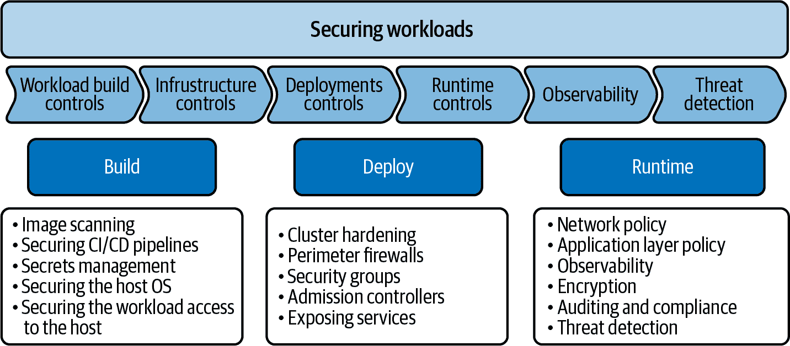
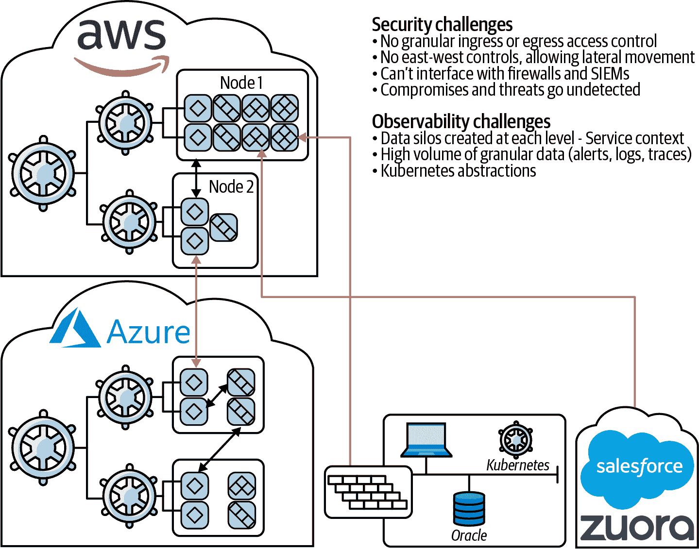
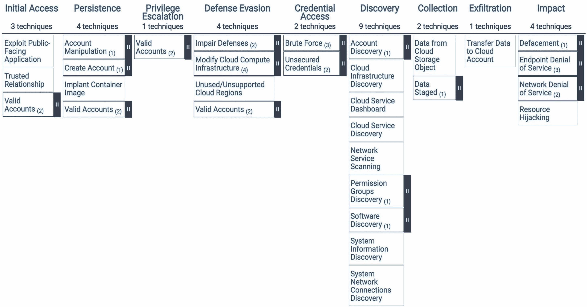
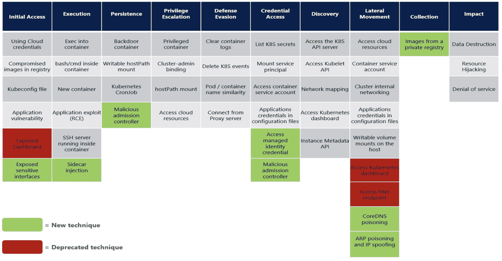

# 第一章：安全性和可观察性策略

在本章中，我们将概述您如何为 Kubernetes 实施构建安全性和可观察性策略。后续章节将更详细地涵盖这些概念。在您的 Kubernetes 之旅的试点/预生产阶段，您需要考虑安全策略，因此如果您是安全团队的一部分，本章非常重要。如果您是网络、平台或应用团队的一部分，本章展示了您如何成为安全策略的一部分，并讨论了安全、平台和应用团队之间合作的重要性。

我们将涵盖以下概念，指导您制定安全性和可观察性策略：

+   如何保护 Kubernetes 与传统安全方法有所不同

+   在 Kubernetes 集群中部署应用程序（工作负载）的生命周期以及每个阶段的最佳实践

+   您应该如何实施可观察性以帮助安全。

+   知名的安全框架以及如何在安全策略中使用它们

# Kubernetes 的安全性：一个新的不同世界

在本节中，我们将强调 Kubernetes 的不同之处以及为什么传统的安全方法在 Kubernetes 实施中不起作用。

随着工作负载转移到云端，Kubernetes 是最常见的编排器来管理它们。Kubernetes 受欢迎的原因在于其声明性特质：它抽象了基础设施细节，并允许用户指定他们想要运行的工作负载和期望的结果。应用团队不需要担心工作负载如何部署，工作负载在哪里运行，或者像网络这样的其他细节；他们只需要在 Kubernetes 中设置配置来部署他们的应用。

Kubernetes 通过管理工作负载的创建、关闭和重启来实现这种抽象。在典型的实现中，根据工作负载的要求，工作负载可以安排在网络中的任何可用资源（物理主机或虚拟机）上。工作负载运行的一组资源被称为*Kubernetes 集群*。Kubernetes 监视工作负载的状态（在 Kubernetes 中部署为 pod）并根据需要采取纠正措施（例如，重新启动无响应的节点）。它还管理所有必要的网络以便 pod 和主机之间进行通信。您可以通过从一组支持的网络插件中进行选择来决定网络技术。虽然有一些网络插件的配置选项，但您将无法直接控制网络行为（无论是用于 IP 地址分配还是在典型配置中节点被调度的情况）。

对于安全团队来说，Kubernetes 是一个全新的世界。他们传统的方法是构建一个“机器网络”，然后启用工作负载（应用程序）。在启用的过程中，需要分配 IP、根据需要更新网络设置，并定义和实施网络访问控制规则。完成这些步骤后，应用程序就可以供用户使用了。这个过程确保安全团队有很大的控制权，并且可以轻松地启用和保护应用程序。由于应用程序的 IP 分配、部署位置等方面都是静态的，因此应用程序也更容易保护。

在 Kubernetes 环境中，工作负载作为容器镜像构建，并使用配置文件（yaml）在 Kubernetes 集群中部署。这通常集成在开发过程中，大多数开发团队使用持续集成（CI）和持续交付（CD）来确保软件的快速可靠交付。这意味着安全团队对每个应用程序变更对集群安全的影响具有有限的可见性。在此过程中添加安全审查步骤是不可取的，因为唯一合理的地方是在提交代码时进行。此后的开发过程是自动化的，打断它会与 CI/CD 模型冲突。那么在这种环境下如何保护工作负载呢？

为了了解如何在 Kubernetes 中保护工作负载，了解部署工作负载的各个阶段是非常重要的。

# 在 Kubernetes 中部署工作负载：每个阶段的安全性

在前一节中，我们描述了使用 CI/CD 管道部署应用程序时面临的安全挑战。本节描述了 Kubernetes 集群中工作负载部署的生命周期，并解释了如何保护每个阶段。工作负载部署的三个阶段是构建、部署和运行时阶段。与传统的客户端-服务器应用程序不同，在 Kubernetes 部署中，应用程序是分布式的，并且 Kubernetes 集群网络作为正常操作的一部分被应用程序使用。由于这种配置，需要考虑以下几点：

+   在构建工作负载和基础设施时，需要考虑安全最佳实践。这一点非常重要，因为 Kubernetes 中的应用程序是通过 CI/CD 管道部署的。

+   在部署 Kubernetes 集群和应用程序时，需要考虑安全最佳实践。

+   最后，应用程序使用基础设施和 Kubernetes 集群网络进行正常操作，需要考虑应用程序运行时的安全最佳实践。

图 1-1 描述了在 Kubernetes 环境中保护工作负载时需要考虑的各个阶段和方面。

###### 图 1-1\. 工作负载部署阶段及每个阶段的安全性

每个阶段下方的框描述了您需要考虑该阶段的各个安全方面：

+   构建阶段是您为工作负载（应用程序）创建（构建）软件并构建基础设施组件（主机或虚拟机）以托管应用程序的阶段。此阶段是开发周期的一部分，在大多数情况下由开发团队负责。在此阶段，您需要考虑 CI/CD 管道的安全性，实施镜像库的安全性，扫描镜像中的漏洞，并加固主机操作系统。您需要确保实施最佳实践以保护镜像注册表，并避免影响镜像注册表中的镜像。通常通过保护对镜像注册表的访问来实现这一点，尽管许多用户拥有私有注册表，并且不允许来自公共注册表的镜像。最后，您需要考虑密钥管理的最佳实践；密钥类似于密码，允许访问集群中的资源。我们将在第三章中详细讨论这些主题。我们建议，在考虑此阶段的安全性时，您应与安全团队合作，以使此阶段的安全性与您的整体安全策略保持一致。

+   接下来的阶段是部署阶段，在此阶段您设置运行 Kubernetes 部署的平台并部署工作负载。在此阶段，您需要考虑配置 Kubernetes 集群的安全最佳实践，以及为在 Kubernetes 集群内运行的应用程序提供外部访问的安全控制。您还需要考虑安全控制，例如限制对工作负载的访问（Pod 安全策略）、网络策略以控制应用程序对平台组件的访问以及基于角色的访问控制（RBAC）以访问资源（例如服务创建、命名空间创建和向 Pod 添加/更改标签）。在大多数企业中，平台团队负责此阶段。作为平台团队的一员，您需要与开发团队和安全团队合作，实施您的安全策略。

+   最后一个阶段是运行时阶段，在此阶段您已部署了应用程序并且它正在运行。在此阶段，您需要考虑网络安全，涉及使用网络策略进行控制、威胁防御（使用技术检测和预防集群中的恶意活动）以及企业安全控制，如合规性、审计和加密。安全团队负责此部署阶段。作为安全团队的一员，在设计和实施运行时安全时，您需要与平台和开发团队合作。团队之间的协作（开发、平台和安全）对于建立有效的安全策略非常重要。我们建议您确保所有这些团队保持一致。

请注意，与传统的安全策略不同，传统安全策略在关键点（如边界）强制执行安全性，而在 Kubernetes 集群的情况下，您需要在每个阶段实施安全性。此外，所有参与的团队（应用程序、平台和安全团队）在实施安全性方面都起着非常重要的作用，因此成功实施策略的关键是团队之间的协作。记住，安全是一种共同责任。让我们探讨每个阶段及您可以使用的构建策略的技术。

## 构建时安全性：向左移动

本节将指导您通过示例了解构建时安全性的各个方面。

### 映像扫描

在这个阶段，您需要确保应用程序没有任何已公开的主要未修补问题，这些问题在国家漏洞数据库中被披露为常见的漏洞枚举 (CVEs)，并且需要扫描应用程序代码和依赖项以查找利用程序和易受攻击的代码段。然后对构建和交付为容器的映像进行扫描，以检测未修补的严重或主要漏洞，这些漏洞被披露为 CVEs。通常通过将基础映像及其所有软件包与跟踪易受攻击软件包的数据库进行对比来执行此操作。为了实施扫描，您可以使用几种开源和商业工具。例如，Whitesource、Snyk、Trivy、Anchor，甚至像谷歌这样的云提供商都提供容器映像的扫描功能。我们建议您选择一个理解容器构建方式并不仅仅扫描主机操作系统，还扫描容器基础映像的扫描解决方案。考虑到 Kubernetes 部署的动态性质，保障 CI/CD 管道的安全非常重要；代码和映像扫描必须成为管道的一部分，并且必须检查从映像注册表交付的映像是否受到妥协。您需要确保对注册表的访问受到控制，以避免妥协。这个阶段的流行术语是“向左移动安全性”，也被称为“向左移动安全性”。

### 主机操作系统的加固

在这里，您必须确保被部署的应用程序仅限于在其部署的主机上具有所需的权限。为此，您应该使用支持控制以仅允许限制应用程序对系统调用和文件系统访问的必要权限的强化主机操作系统。这样可以有效地减轻与“特权升级”相关的攻击，即利用容器中部署的软件中的漏洞来访问主机操作系统。

### 减少攻击面：基础容器镜像

我们建议您审查容器镜像的组成，并最小化构成基础镜像的软件包，只包括您的应用程序运行所绝对必需的软件包。在基于 Dockerfile 的容器镜像中，您可以从一个父镜像开始，然后将您的应用程序添加到镜像中以创建一个容器镜像。例如，您可以使用 `FROM scratch` 指令在 Docker 中构建一个基础镜像，这将创建一个最小的镜像。然后，您可以添加您的应用程序和必需的软件包，这将让您完全控制容器镜像的组成，并且有助于 CVE 管理，因为您无需担心在容器镜像中不需要的软件包中修补 CVE。如果构建一个 scratch 镜像不可行，您可以考虑从 distroless 镜像（一个精简的 Linux 发行版镜像）或 Alpine 最小镜像作为容器的基础镜像开始。

这些技术将帮助您设计和实施构建时安全策略。作为开发团队的一部分，您将负责与平台和安全团队合作设计和实施构建时安全，以确保与整体安全策略一致。我们提醒不要相信“左移安全”可以成为您整个安全策略的全部。这是不正确的，是保护工作负载的一种幼稚方法。还有其他几个重要方面，如部署和运行时安全，也需要作为安全策略的一部分考虑进去。

## 部署时安全

保护工作负载的下一阶段是保护部署。为了实现这一点，您需要加固您部署工作负载的 Kubernetes 集群。您需要详细审查 Kubernetes 集群配置，以确保与安全最佳实践保持一致。首先，建立一个信任模型来评估集群的各个组件。信任模型是一个框架，您在其中审查威胁概况并定义响应机制。您应该利用诸如基于角色的访问控制（RBAC）、标签分类法、标签治理和准入控制等工具来设计和实施信任模型。这些是控制资源访问、在资源创建时应用控制和验证的机制。这些主题在第三章、第四章和第七章中有详细覆盖。集群中的另一个关键组件是 Kubernetes 数据存储和 Kubernetes API 服务器，在设计这些组件的信任模型时，您需要特别注意访问控制和数据安全等细节。我们建议您使用强密码、公钥基础设施（PKI）进行访问以及传输层安全（TLS）进行数据传输加密。有关如何保护 Kubernetes API 和数据存储的详细信息，请参阅第二章。

您应该将部署关键任务负载的 Kubernetes 集群视为一个实体，然后为该实体设计信任模型。这要求您审查边界的安全控制，由于 Kubernetes 部署架构的复杂性，这将是一个具有挑战性的任务；我们将在下一节中详细介绍这一点。目前，让我们假设当前部署在边界的产品，如 Web 访问控制网关和下一代防火墙，对 Kubernetes 架构并不了解。我们建议您通过与这些设备建立集成来解决这个问题，使它们了解 Kubernetes 集群的上下文，从而能够有效地在边界应用安全控制。这样一来，您可以创建一个非常有效的安全策略，其中边界安全设备与 Kubernetes 集群内实施的安全控制协同工作。例如，假设您需要使这些设备了解您的工作负载的身份（IP 地址、TCP/UDP 端口等）。这些设备可以有效地保护构成您 Kubernetes 集群的主机，但在大多数情况下，它们无法区分单个主机上运行的工作负载。如果您在云提供商环境中运行，您可以使用安全组，这些是允许对一组节点（例如 Amazon Web Services 中的 EC2 实例）进行访问控制的虚拟防火墙，这些节点承载工作负载。安全组比传统防火墙和安全网关更符合 Kubernetes 架构；然而，即使是安全组也不了解集群内运行工作负载的上下文。

总结一下，当您考虑部署时间安全性时，您需要为 Kubernetes 集群实施信任模型，并与保护集群的边界安全设备建立有效的集成。

## 运行时安全性

现在您已经制定了保护构建和部署阶段的策略，需要考虑运行时安全性。术语*运行时安全性*用于描述保护 Kubernetes 集群的各个方面，例如在运行软件的主机上，但任何保护主机和工作负载免受未经授权活动的配置（例如系统调用、文件访问）也被称为运行时安全性。第四章将详细介绍主机和工作负载的运行时安全性。在本节中，我们将专注于确保 Kubernetes 集群网络安全运行所需的安全最佳实践。Kubernetes 是一个编排器，可以在主机网络上部署工作负载和应用程序。您必须将网络安全性视为运行时安全性的一个非常重要的方面。

Kubernetes 承诺提升灵活性和更有效地利用计算资源，相比于静态分区和服务器或虚拟机的预配。它通过在集群中动态调度工作负载来实现这一点，考虑每个节点上的资源使用情况，并在平面网络上连接工作负载。默认情况下，当部署新工作负载时，相应的 Pod 可以被调度到集群中的任何节点，并使用 Pod IP 地址中的任何 IP 地址。如果稍后将 Pod 重新调度到其他地方，则通常会获得不同的 IP 地址。这意味着 Pod IP 地址需要视为临时的。Pod IP 地址或其在网络中的位置没有长期或特殊的意义。

现在考虑传统的网络安全方法。在企业网络中，网络安全通常使用安全设备（或设备的虚拟版本），如防火墙和路由器来实现。这些设备强制执行的规则通常基于网络的物理拓扑结构以及为不同类别的工作负载分配特定 IP 地址范围的组合。

由于 Kubernetes 基于平面网络，并且 Pod IP 地址没有任何特殊含义，很少有传统设备能够提供有意义的工作负载感知的网络安全，而是不得不将整个集群视为单个实体。此外，在同一节点上托管的两个 Pod 之间的东西流量甚至不会经过底层网络。因此，这些设备根本看不到这些流量，基本上只能限制于北向安全，即保护从外部源进入集群的流量以及从集群内部源到外部源的流量。

鉴于这一切，很明显 Kubernetes 需要一种新的网络安全方法。这种新方法需要涵盖广泛的考虑因素，包括：

+   新方法来执行网络安全（允许哪些工作负载与哪些其他工作负载通信），不依赖于 IP 地址或网络拓扑的特殊含义，并且即使流量不经过底层网络也能工作；Kubernetes 网络策略旨在满足这些需求。

+   新工具帮助管理支持新开发流程和微服务愿景的网络策略，以增加组织的灵活性，例如策略推荐、策略影响预览和策略分阶段。

+   新方法来监视和可视化网络流量，涵盖集群范围的整体视图（例如如何轻松查看整体网络和集群的网络安全状态）以及针对微服务序列进行深入分析以帮助排除故障或诊断应用程序问题的有针对性拓扑视图。

+   实施入侵检测和威胁防御的新方法，包括违规策略警报、网络异常检测和集成威胁源。

+   新的修复工作流程，以便在法医调查期间可以快速安全地隔离潜在受损的工作负载。

+   审计配置和策略变更以符合合规要求的新机制。

+   审计配置和策略变更的新机制，以及 Kubernetes 感知的网络流日志以满足合规性要求（因为传统的网络流日志是基于 IP 的，在 Kubernetes 上下文中长期意义不大）。

我们将审查一个典型的企业 Kubernetes 部署示例，以了解这些挑战。 图 1-2 是多云环境中 Kubernetes 和微服务的常见部署模型的表示。多云环境是指企业在多个云服务提供商（如亚马逊网络服务、谷歌云等）上部署 Kubernetes 的情况。混合云环境指企业在至少一个云服务提供商的环境中部署 Kubernetes，并且在其数据中心内部署 Kubernetes。大多数企业都有双云战略，并将在亚马逊网络服务（AWS）、微软 Azure 或谷歌云上运行集群；更多企业还在其数据中心运行一些传统应用程序。数据中心的工作负载可能位于安全网关后，该网关通过过滤进入的流量来保护外围。在这些 Kubernetes 部署中运行的微服务也可能对以下一种或多种依赖有所依赖：

+   其他云服务，如 AWS RDS 或 Azure DB

+   Twilio 等第三方 API 终端

+   SaaS 服务，如 Salesforce 或 Zuora

+   数据库或在数据中心内运行的传统应用程序

数据中心的工作负载可能位于安全网关后，该网关通过过滤进入的流量来保护外围。

*可观察性* 在 Kubernetes 中是通过收集的度量标准获取有关 Kubernetes 状态的可行见解的能力（稍后详述）。虽然可观察性还有其他应用，比如监视和故障排除，但在网络安全的背景下也很重要。将应用于流日志的可观察性概念与其他 Kubernetes 元数据（Pod 标签、策略、命名空间等）相关联，用于监视（然后保护）Kubernetes 集群中的 Pod 之间的通信，通过比较 IP 地址与已知恶意 IP 地址来检测恶意活动，并使用基于机器学习的技术来检测恶意活动。这些主题将在下一节中详细介绍。正如您在 图 1-2 中所见，Kubernetes 的部署由于每个集群中的数据孤立以及将一个集群中的工作负载与另一个集群或外部服务的工作负载关联起来可能导致的可见性损失而面临挑战。

###### 图 1-2\. 企业中 Kubernetes 部署示例

如图 1-2 所示，微服务应用程序的足迹通常延伸到虚拟私有云（VPC）边界之外，保护这些应用程序需要一种不同于传统周界安全方法的方法。它是网络安全控制、可观察性、威胁防御和企业安全控制的组合。接下来我们将详细介绍每一个。

### 网络安全控制

云提供商提供的本地安全控制（例如 AWS 安全组或 Azure 网络安全组）或位于 VPC 或数据中心周边的安全网关（例如下一代防火墙）并不理解 Kubernetes 集群内微服务的身份。例如，您不能使用安全组规则或防火墙策略来过滤与 Kubernetes pod 或服务之间的流量。此外，从 pod 发送的流量到达云提供商的网络或第三方防火墙时（根据云提供商的架构），流量会应用源网络地址转换（SNAT）。换句话说，从节点上所有工作负载的流量的源 IP 地址都设置为节点 IP，因此，最多只能具有节点级别（节点的 IP 地址）的允许/拒绝策略粒度。

Kubernetes 工作负载具有高度动态和短暂的特性。假设开发人员提交了一个特定工作负载的新检入。自动化的 CI/CD 工作流将启动，构建一个新版本的 pod（容器），并开始在 Kubernetes 集群中部署这个新版本的工作负载。Kubernetes orchestrator 将进行滚动升级并部署工作负载的新实例。所有这些都是自动化进行的，没有手动或带外工作流重新配置新部署工作负载的空间。

你需要一种新的安全架构来保护在多云或混合云基础设施中运行的工作负载。就像你在 Kubernetes 集群中部署工作负载一样，工作负载的安全性必须以代码形式定义，采用声明性模型。安全控制必须能够跨 Kubernetes 发行版、云、基础设施和/或网络进行移植。这些安全控制必须随着工作负载一起移动，因此，如果工作负载的新版本在 Amazon Elastic Kubernetes Service（EKS）的 VPC 上部署，而不是在本地集群上部署，您可以放心，与服务相关的安全控制将无缝执行，而无需重新设计任何网络拓扑、超出带外配置的安全组或 VPC/周界防火墙。

网络安全控制通过使用 Kubernetes 原生的网络策略解决方案实施，提供精细的访问控制。有几种众所周知的网络策略实现（例如 Calico，Weave Net，Kube-router，Antrea）可供选择使用。除了在第 3/第 4 层（TCP/IP）应用策略外，我们建议您查看支持应用层策略（例如 HTTP/HTTPS）的解决方案。我们还建议选择基于流行的代理 Envoy 的解决方案，因为它广泛用于应用层策略。Kubernetes 支持将应用程序部署为微服务（服务应用程序功能的小组件），分布在节点网络上。微服务之间的通信依赖于应用程序协议如 HTTP。因此，有必要实施可以通过应用层策略实现的精细应用程序控制。例如，在三层应用程序中，前端微服务可能只允许与后端数据库微服务使用基于 HTTP GET 的请求（读访问），而不允许与后端数据库微服务使用 HTTP POST（写访问）。所有这些请求最终可以使用相同的 TCP 连接，因此必须添加支持所述应用层控制的策略引擎是至关重要的。

### 企业安全控制

现在您已经定义了网络访问控制和可观察性策略，应考虑其他重要且在企业中普遍存在的安全控制措施。在数据传输中加密是安全和合规的关键要求。有几种选择可以考虑使用传统方法进行加密，比如在您的工作负载中使用基于 TLS 的加密；双向 TLS，它是服务网格平台的一部分；或者基于 VPN 的方法，比如提供基于加密密钥的 VPN 的 Wireguard。

我们建议您利用观察策略的数据收集来生成所需的报告，以帮助满足 PCI、HIPAA、GDPR 和 SOC 2 等标准的合规要求。您还应考虑确保持续合规性的能力，可以利用 Kubernetes 的声明性特性来协助设计和实施持续合规性。例如，您可以通过使用 Pod 的合规性状态来响应未通过合规性检查的 Pod，触发必要的操作以纠正情况（触发镜像更新）。

### 威胁防御

Kubernetes 集群中的威胁防御是查看集群中的恶意活动并防御其的能力。恶意活动允许对手未经授权访问并操纵或窃取 Kubernetes 集群中的数据。恶意活动可以采用多种形式，例如利用不安全的配置或利用应用程序流量或应用程序代码中的漏洞。

在构建威胁防御策略时，您必须考虑入侵检测和预防两个方面。入侵检测的关键在于可观察性；您需要回顾收集的数据以扫描已知威胁。在 Kubernetes 部署中，由于您需要检查的数据量很大，数据收集非常具有挑战性。我们经常听到这样的问题：“我需要一个 Kubernetes 集群来收集数据以保护 Kubernetes 集群吗？”答案是“不需要”。我们建议您将可观察性策略与入侵检测保持一致，并利用智能聚合来收集和检查数据。例如，您可以考虑使用一种工具，将数据聚合为“类似”pod 组，这些 pod 在给定目标端口和协议上相互通信，而不是使用传统的五元组（源 IP、源端口、目标 IP、目标端口、协议）聚合方法。这种方法将有助于显著减少收集的数据量，而不会牺牲效果。请记住，运行相同容器镜像并以相同方式部署的多个 pod 将为交易生成相同的网络流量。您可能会问，“如果只有一个实例被感染怎么办？如何检测到？”这是一个很好的问题。有几种方法可以解决。您可以选择一个支持基于各种指标（如连接、字节和数据包）收集的机器学习的工具来检测异常工作负载。另一种方法是使用工具，作为收集的一部分检测和匹配来自知名威胁源的已知恶意 IP 和域名，或记录未聚合的由策略拒绝的网络流量。这些都是帮助您构建策略的简单技术。请注意，威胁防御技术在不断发展，您需要与安全研究团队合作，帮助理解您的应用程序并构建威胁模型，以实施您的威胁防御策略。

## 可观察性

可观察性对于监控和保障像 Kubernetes 这样的分布式系统非常有用。Kubernetes 抽象了很多细节，在监视这样的系统时，您不能单独收集和独立基线化和监视各个指标（如单个网络流，pod 创建/销毁事件或一个节点上的 CPU 峰值）。需要的是一种在 Kubernetes 上下文中监视这些指标的方法。例如，一个与服务或部署相关联的 pod 被重新启动，并作为其对等体的不同二进制运行，或者与部署中的其他 pod 的活动（网络，文件系统，内核系统调用）不同。当考虑由多个服务（微服务）组成的应用时，情况变得更加复杂，这些服务又由多个 pod 支持。

可观察性在故障排除和监控 Kubernetes 工作负载的安全性方面非常有用。例如，在 Kubernetes 服务的上下文中，可观察性将允许您执行以下操作：

+   将您的 Kubernetes 集群可视化为服务图，显示 Pod 如何与服务相关联及服务之间的通信流量。

+   在服务图上叠加应用程序（第 7 层）和网络流量（第 3/第 4 层）作为独立层，这将使您能够轻松确定应用程序和底层网络的流量模式和流量负载。

+   查看部署有 Pod 的节点的元数据（例如 CPU、内存或主机操作系统详情）。

+   查看与 Pod 操作、流量负载、应用延迟（例如 HTTP 持续时间）、网络延迟（网络往返时间）或 Pod 操作（例如 RBAC 策略、服务账户或容器重启）相关的指标。

+   查看给定服务（支持该服务的 Pod）的 DNS 活动（DNS 响应代码、延迟、负载）。

+   追踪跨多个服务进行通信的用户事务；这也被称为*分布式跟踪*。

+   查看给定服务与外部实体的网络通信。

+   查看与给定服务相关的 Pod 和资源的 Kubernetes 活动日志（例如审计日志）。

我们将在后续章节详细介绍可观测性的细节及其如何帮助安全性。在本讨论中，我们将简要描述如何将可观测性作为安全策略的一部分使用。

### 网络流量可见性

如前所述，需要一个解决方案，它提供以服务级别汇总的网络流量，并提供如命名空间、标签、服务账户或网络策略等上下文，以充分监视集群中应用的活动和应用的访问控制。例如，报告 IP1 与 IP2 在端口 8080 上通信与报告标记为“前端”和“后端”的 Pod 在 Kubernetes 集群中的特定端口或流量模式之间的通信有显著差异。此报告将允许您审查来自外部实体的通信，并应用基于 IP 地址的威胁源来检测来自已知恶意 IP 地址的活动，甚至来自意外地理位置的流量。我们将在第十一章中详细介绍这些概念。

### DNS 活动日志

域名系统（DNS）是将域名转换为 IP 地址的系统。在您的 Kubernetes 集群中，审查 DNS 活动日志至关重要，以检测意外活动，例如查询已知恶意域的情况、DNS 响应代码如 NXDOMAIN，以及 DNS 查询中字节和数据包的意外增加。我们将在第十一章中详细介绍这些概念。

### 应用程序流量可见性

我们建议您审查应用程序流量，以寻找异常活动，如意外的响应代码和罕见或已知的恶意 HTTP 头部（用户代理，查询参数）。在 Kubernetes 部署中，HTTP 是最常用的协议，因此重要的是与您的安全研究团队合作，监控 HTTP 流量以检测恶意流量。如果您使用其他应用程序协议（例如 Kafka、MySQL），同样需要进行相同的操作。

### Kubernetes 活动日志

除了网络活动日志外，您还必须监视 Kubernetes 活动日志以检测恶意活动。例如，审查资源访问拒绝日志以及服务账户创建/修改。审查命名空间创建/修改日志以寻找意外活动。并审查记录对 Kubernetes API 请求的审计日志。

### 机器学习/异常检测

机器学习是一种技术，系统能够通过数据在一段时间内推导出模式。输出结果是一个机器学习模型，然后可以用于预测和基于预测检测实际数据中的偏差。我们建议您考虑将基于机器学习的异常检测应用于各种指标，以检测异常活动。一种简单有效的方法是对单独的指标应用称为*基线设定*的机器学习技术。这样您就不需要担心为每个指标应用规则和阈值；系统会为您执行这些操作并将偏差报告为异常。将机器学习技术应用于网络流量是一个相对新的领域，并且正在获得安全团队的关注。我们将在第六章详细讨论这个主题。

对于 Kubernetes 的可观测性策略，您可以选择许多解决方案（如 Datadog、Calico Enterprise、来自 Google、AWS、Azure 的基于云提供商的解决方案）。

## 安全框架

最后，我们希望让您了解安全框架，这些框架为行业提供了安全最佳实践的共同方法和术语。安全框架是理解攻击技术和最佳实践以防御和减轻攻击的良好途径。您应该使用它们来构建和验证您的安全策略。请注意，这些框架可能不特定于 Kubernetes，但它们提供了有关对手在攻击中使用的技术的见解，安全研究人员需要审查并确定它们是否与 Kubernetes 相关。我们将回顾两个知名框架——MITRE 和 Kubernetes 威胁矩阵。

### MITRE

MITRE 是基于对网络攻击的实际观察而建立的对手战术和技术知识库。[企业版 MITRE ATT&CK® 矩阵](https://oreil.ly/fxBKB)非常有用，因为它为每个网络安全杀伤链的阶段提供了分类的战术和技术。杀伤链描述了网络攻击的各个阶段，对于构建有效的防御措施非常有用。MITRE 还提供了针对 AWS、Google Cloud 和 Microsoft Azure 等云环境的攻击矩阵。

图 1-3 描述了[适用于 AWS 的 MITRE ATT&CK® 矩阵。](https://oreil.ly/Mvyzz)我们建议您查看攻击矩阵中描述的每个阶段，以便构建您的威胁模型，保护您的 Kubernetes 集群。

###### 图 1-3\. AWS 云环境攻击矩阵

### Kubernetes 的威胁矩阵

另一个框架是一种[威胁矩阵](https://oreil.ly/GQery)，它是对通用 MITRE 攻击矩阵的 Kubernetes 特定应用。这是微软团队基于安全研究和实际攻击发布的。这是另一个优秀的资源，用于构建和验证您的安全策略。

图 1-4 提供了与您的 Kubernetes 集群相关的各个阶段。它们映射到我们在本章讨论的各个阶段。例如，您应该考虑初始访问阶段中注册表中的受损镜像，特权升级阶段中的访问云资源，以及构建、部署和运行时安全性的侧向移动阶段中的集群内部网络。

###### 图 1-4\. Kubernetes 的威胁矩阵

# 安全性和可观察性

在像 Kubernetes 这样的动态环境中，通过同时考虑安全性和可观察性，可以实现应用程序的安全部署。例如，你需要“观察”你的集群，找到实施控制以保护集群的最佳方式。作为编排引擎，Kubernetes 具有强大的采用率，因为它具有声明性的特性，允许用户指定更高级别的结果。Kubernetes 还具有内置功能，以确保您的集群按照规范运行。它通过监视各种属性并采取行动（例如，重新启动 pod）来实现这一点，如果属性偏离指定值一段时间，就会采取行动。Kubernetes 的这些方面使得实施确保集群安全所需的可见性和控制变得困难。你实施的控制需要与 Kubernetes 运营保持一致。因此，在考虑向 Kubernetes 添加任何控制之前，了解上下文非常重要——例如，你不能通过应用不允许其与其他任何元素通信的策略来隔离一个 pod。Kubernetes 将检测到 pod 无法与其他元素（例如，API 服务器）通信，确定 pod 未按规定操作，然后重新启动并在集群的其他位置启动 pod。

你需要做的第一件事是先了解 pod 的运行方式，了解其预期操作是什么，然后应用控制或检测意外事件。之后，你需要确定意外事件是运营问题还是安全问题，然后应用所需的补救措施。为了做到这一点，可观察性和安全性需要并重：你观察以了解预期情况并应用控制以确保预期操作，然后观察以检测意外事件并分析它们，然后添加必要的控制以补救由事件引起的任何问题。因此，在考虑保护你的集群时，你需要一种全面的安全和可观察性方法。

# 结论

到目前为止，你应该对 Kubernetes 安全性和可观察性的高层概述有了了解。这些是支撑整本书的基本概念。简而言之：

+   Kubernetes 的安全性与传统安全性非常不同，并且在工作负载部署的所有阶段——构建、部署和运行时都需要一种全面的安全性和可观察性方法。

+   Kubernetes 是声明性的，并抽象了工作负载操作的细节，这意味着工作负载可以在节点网络的任何地方运行。此外，工作负载可能是短暂的，它们会在不同节点上被销毁并重新创建。保护这样的声明式分布式系统需要你在所有阶段考虑安全性。

+   我们希望你理解在设计和实施全面安全方法时，应用程序、平台和安全团队之间合作的重要性。

+   [MITRE](https://www.mitre.org)和 Kubernetes 的威胁矩阵是广泛被安全团队采纳的两个安全框架。

重要的是要将所有内容整合在一起，因为成功的安全和可观察性策略是一体化的。在接下来的章节中，我们将涵盖基础设施安全。
