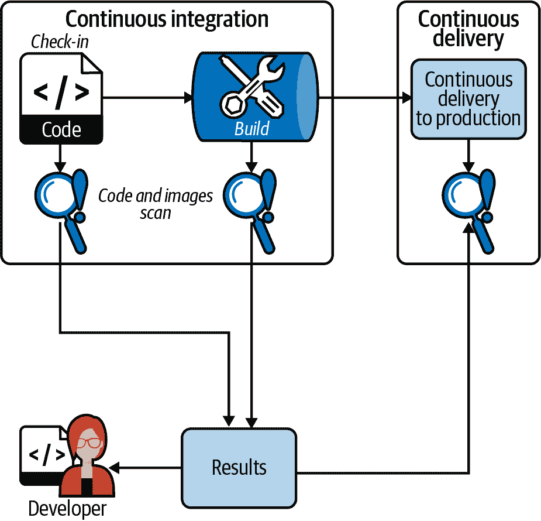
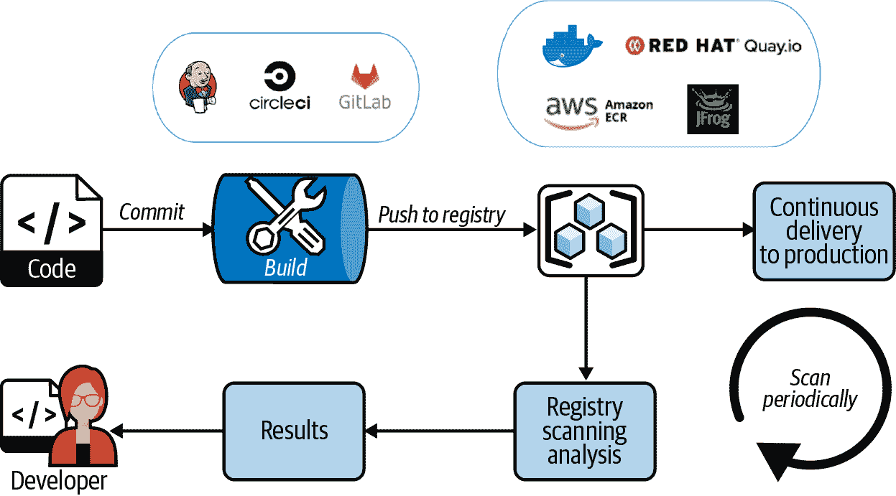
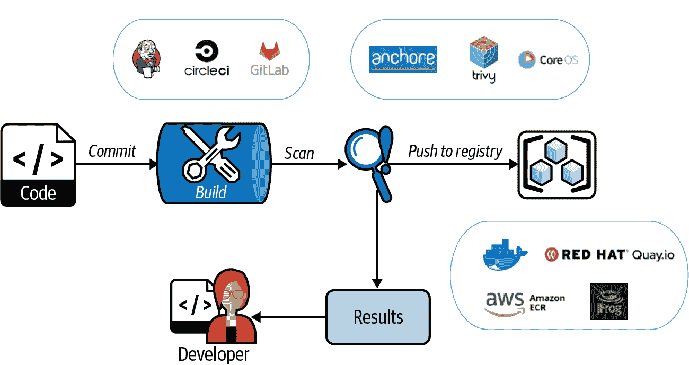
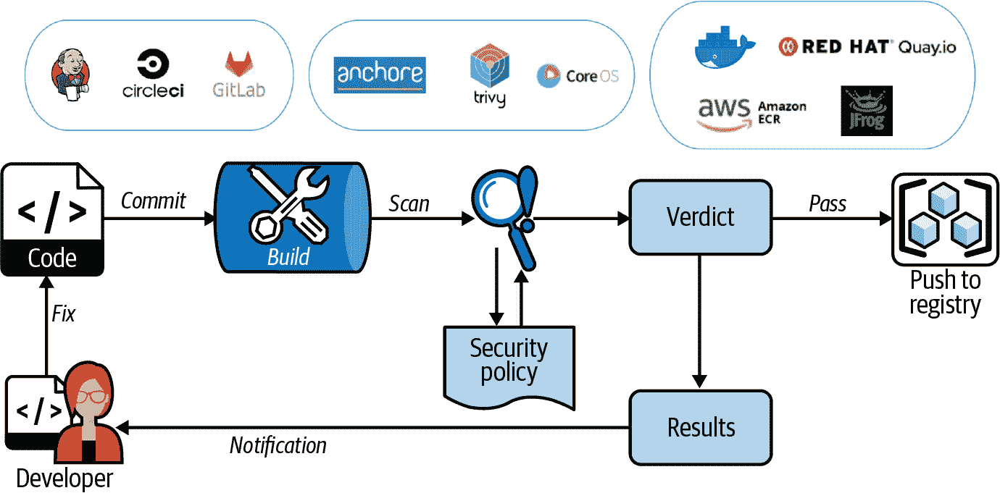
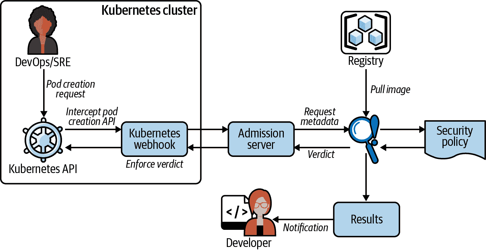
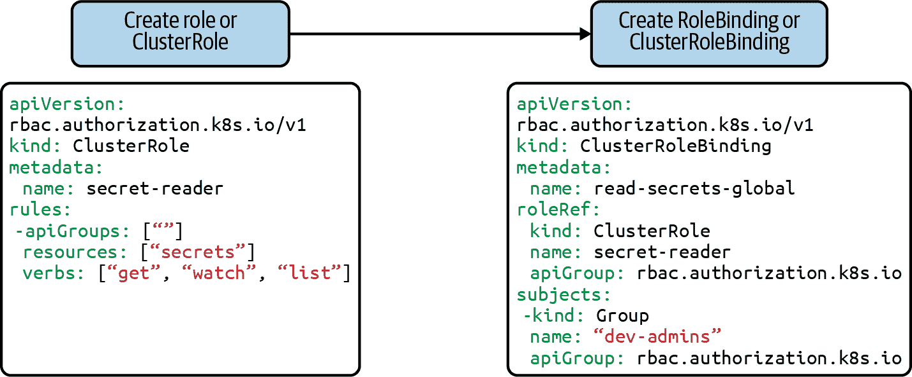
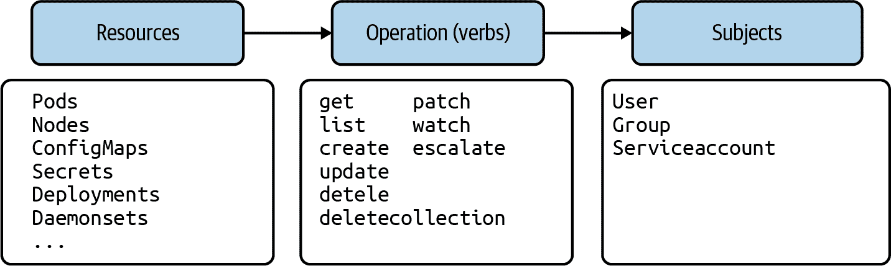

# 第三章：工作负载部署控制

在 Manoj Ahuje 的贡献下，

Tigera 的高级威胁情报研究工程师

一旦您决定了基础设施安全策略，下一个步骤是工作负载部署控制。在本章中，我们将探讨镜像构建和扫描策略，CI/CD（将镜像扫描集成到构建中），以及 Kubernetes 基于角色的访问控制（RBAC），这是一种广泛使用的授权系统，允许您根据用户角色定义访问控制，以及应用程序的密钥管理。

# 镜像构建和扫描

在本节中，我们将探讨镜像构建和扫描的最佳实践。这些包括选择基础映像以减少攻击面，使用 scratch 映像和镜像硬化最佳实践以防止对手入侵。镜像扫描涉及选择镜像扫描解决方案的细节，隐私问题，以及容器威胁分析解决方案的概述。

## 基础映像的选择

如在前一章节讨论的，您可以选择像 Bottlerocket 这样的现代 Linux 发行版作为容器的基础映像。传统 Linux 发行版的最小版本，如 Ubuntu、Red Hat 和 Alpine，也是可用的。

虽然使用最小映像作为起点是个不错的开始，但是最小映像方法并不能阻止发现存在于操作系统中的 OS 包的漏洞。在这种情况下，distroless 或 scratch 映像会是更好的选择。这些类型的映像仅包含应用程序及其特定的运行时依赖项。

这里是 distroless 或 scratch 映像的好处：

+   这种策略显著减少了大小、攻击面和漏洞，从而提高了安全性。

+   Distroless 映像已经可以用于生产环境。Kubernetes 本身就使用 distroless 映像来构建各种组件，如 kublet、scheduler 等。

+   如果您要为应用程序选择一个基础映像，可以使用多阶段 Dockerfile 来构建一个基础映像。第一阶段涉及构建您的应用程序。第二阶段涉及将运行时依赖和应用程序移到基础映像。

distroless 映像项目的最受欢迎的例子是来自 Google 的 [distroless](https://oreil.ly/UIzu0)，它为 Java、Python 或 C++ 等各种运行时提供映像。

一个空白镜像从 Dockerfile 指令 FROM:scratch 开始，表示一个空文件系统。在 Dockerfile 中的下一条指令创建了容器镜像的第一个文件系统层。在这里，第一个文件系统层需要与应用程序和依赖项一起编译。因为在容器外部构建应用程序是不生产和不直观的，Docker 引入了[多阶段构建](https://oreil.ly/K161o)。通过多阶段构建，Dockerfile 允许多个 FROM 指令。每个 FROM 指令创建一个独立的阶段，之前阶段的文件系统产物可以在后续阶段的构建中复制。这个机制使开发者能够在较早的阶段（构建器镜像）中构建和编译应用程序，所有依赖项都可用，并最终仅复制运行生产应用程序所需的文件系统产物到后续阶段。构建的最后阶段可以是一个空白镜像，只需要在结果镜像中存在应用程序二进制文件和依赖项。

下面是一个基于空白镜像的 bash 脚本示例，目标是在容器内运行一个脚本。在这里，你可以创建一个两阶段 Dockerfile，其中第二阶段是一个仅包含脚本依赖项的空白镜像。

你可以使用这个模板来容器化甚至是使用 Node.js、Python 和 Go 构建的复杂应用程序。Go 还提供了一个选项，可以将所有的运行时库编译到二进制文件中。在下面的示例中，你可以使用 Alpine 作为基础镜像，为运行脚本的容器构建一个空白镜像：

```
# use alpine 3 as base image
FROM alpine:3 as builder

# upgrade all alpine packages
RUN apk update && apk upgrade

# add your script into container fs
ADD your_init_script.sh your_init_script.sh
RUN chmod u+x your_init_script.sh

# stage 2
FROM scratch

# shell
COPY --from=builder /bin/sh /bin/sh

# dependent linux shared libraries
COPY --from=builder /lib/ld-musl-x86_64.so.1 /lib/ld-musl-x86_64.so.1

ENV PATH=/usr/local/bin:/usr/local/sbin:/usr/local/bin:/usr/sbin:/usr/bin:
/sbin:/bin

ENTRYPOINT ["./your_init_script.sh"]
In this example, only two files are copied into scratch images (second stage). 
Hence, the alpine base image containing more than five thousand files is minimized 
to two files, reducing the attack surface significantly.
```

现在我们已经回顾了如何为你的容器选择基础镜像，让我们探讨一下容器镜像的强化。

## 容器镜像强化

容器镜像强化是构建镜像以减少安全弱点和攻击面的过程。同时，它被用来为容器内的应用程序添加防御层，以确保安全运行。

如果你使用一个未强化的容器镜像，可能会容易受到滥用、信息泄露或者更容易提升到容器主机的特权攻击。你应该利用以下工具和最佳实践来为你的应用程序构建强化的容器镜像：

+   只使用来自受信任来源的基础镜像，比如官方 Ubuntu 和 Red Hat 发行渠道，并且使用发布信息双重检查镜像哈希，因为很容易在镜像中嵌入恶意代码，比如加密货币挖矿程序，并将这些镜像发布在像 Docker Hub 这样的仓库中。

+   将基础镜像最小化，仅包含应用程序的运行时依赖项。

+   遵循最小权限访问原则，并以最低所需权限运行容器。例如，除非需要 root 权限，否则应将容器作为非 root 用户运行。这使得攻击者难以逃离容器，并提供了对漏洞的保护，例如 *[CVE-2020-15257](https://oreil.ly/txXJL)*，其中 root 用户能够逃离容器。

+   不要使用 Docker 镜像的标签；而是在 Dockerfile 中固定基础镜像版本（例如，ubuntu:20.08）。可变的标签如 *latest* 或 *master* 不断更新以增加功能和修复问题，这可能导致在 CI/CD 流水线的镜像扫描中出现问题。此外，它们可能导致应用程序稳定性问题（其中底层依赖库被更新/移除或更改）。

+   将 Docker 镜像层压缩为单个层。使用 Docker 或 buildah 等工具构建的容器镜像通常具有多个层。这些层显示了开发历史，有时会泄露敏感信息。压缩现有层的最佳方法是使用多阶段构建；还有一个实验性的 Docker 功能（即 Docker API 1.25+ 中提供的选项 [`--squash`](https://oreil.ly/U5RaL)）。

+   使用容器镜像签名来信任该镜像。原生的 Kubernetes 并不具备容器镜像验证功能。可以使用 Docker Notary 对镜像进行签名，并通过 Kubernetes 准入控制器验证镜像签名，以确定镜像是否被恶意行为者篡改（例如，在镜像位于注册表时对其进行更改）。

在接下来的部分，我们将审查容器镜像扫描。

## 容器镜像扫描解决方案

容器镜像扫描工具检查容器文件系统以获取元数据，了解镜像中是否存在易受攻击的组件。市场上有许多开源和商业企业解决方案可供选择，用于此目的。它们具有 CI/CD 集成和丰富的扫描功能。您选择的解决方案应该能够回答一些基本问题：

+   镜像扫描器能否为您选择的基础镜像中的操作系统包进行扫描？

+   它能否扫描您的应用程序依赖项（是否理解应用程序使用的语言，如 Go、Python、Node.js）？

+   镜像扫描器能否检测文件系统中存在的敏感文件（如证书、密码）？

+   误报率是多少？

+   它可以扫描二进制文件（.elf 或 .exe）吗？

+   扫描解决方案将收集哪些数据？扫描解决方案是否将您的镜像上传到其 SaaS 服务，还是仅收集包元数据？由于数据暴露风险，了解这一点非常重要。

+   收集的数据将存储在哪里？在本地还是云端 SaaS？请查阅并选择符合安全/合规团队指南的选项。

+   镜像扫描器是否与您的 CI/CD 系统集成？

大多数扫描器从文件系统收集元数据，并尝试与从国家漏洞数据库或私人情报来源收集的漏洞信息匹配，以确定漏洞的存在。请注意，扫描中可能会出现假阳性和假阴性。对于已确认存在漏洞的镜像，应用程序和安全团队需要共同分析 CVE 对运营的影响和风险。修复步骤涉及在更新可用时实施解决方法和修补镜像。

许多公共云提供商和容器注册服务提供商提供容器扫描服务。然而，它们支持的操作系统版本有限，并且大多数不扫描应用程序依赖关系。在这方面，开源世界提供了更多选择。一些可以扫描应用程序依赖关系的著名开源工具包括[Anchore](https://oreil.ly/QNdyU)，允许用户定义策略，以及[Trivy](https://oreil.ly/CYP4B)，易于集成到 CI 中。

## 隐私问题

产品中的安全漏洞及相关信息是高度机密的数据，如果落入错误的手中，可能对组织构成重大责任。因此，在选择任何解决方案之前，最好验证扫描解决方案收集了哪些数据以及这些数据存储在哪里（例如，在企业内部的本地或作为 SaaS 服务的一部分在云端）。如果购买商业解决方案，请检查合同以了解在数据泄露情况下的损害条款。通常，这些条款可以帮助您了解组织对数据安全的严肃态度。如果使用开源解决方案，请阅读文档以了解数据泄露风险。

## 容器威胁分析

除了传统的镜像扫描，使用基于沙箱的解决方案进行容器威胁分析的领域正在日益流行。这是一个相对较新的领域，我们建议您关注。这些基于沙箱的解决方案可以运行 Docker 镜像，并监视容器系统调用、进程、内存、网络流量（HTTP、DNS、SSL、TCP）以及容器的整体行为，利用机器学习和其他技术来检测任何恶意活动。此外，它们还可以扫描容器文件系统以检查漏洞和恶意二进制文件。这些技术可用于检测高级持续性威胁（APTs）和恶意软件。

# CI/CD

在本节中，我们将讨论将镜像扫描解决方案集成到您的 CI/CD 流水线中的各种策略，保护 CI/CD 流水线的最佳实践，以及实施 CI/CD 和漏洞扫描的组织政策技术。

连续集成（CI）是一种开发实践，每个开发者的检入都会通过自动化构建进行验证，使团队能够早期检测问题。而连续部署（CD）是 CI 的延伸，一旦通过所有发布检查，变更就会发布给下游消费者。

在 CI/CD 的目标中，将安全性集成到开发和发布过程的每个步骤中是关键，这是 DevOps 流程中左移策略的一个重要部分。通过将图像扫描集成到您的 CI/CD 流水线中（见图 3-1），开发团队可以在开发者提交到代码库后立即获得检查结果。这种方法的主要优势在于可以在构建时检测到新的安全漏洞或威胁。一旦发现问题，所有利益相关者和 DevOps 团队通常会通过 CI 作业失败收到通知。然后各团队可以立即开始进行修复工作。



###### Figure 3-1\. 将图像扫描集成到 CI/CD 过程中

如图 3-1 所示，扫描应该在开发周期的每个步骤中进行集成，从开发者检入到持续交付到生产。本节的其余部分将专注于集成中的 CI 部分，以展示图像扫描过程的细粒度。可以将以下策略应用于图 3-1 中显示的每个步骤（即代码、构建[CI]和 CD 流水线）。

选择特定的 CI/CD 构建基础设施是次要的，可以根据更广泛的需求进行选择。流行的 CI/CD 提供者包括但不限于[Jenkins](https://oreil.ly/ge9Q1)，[Semaphore](https://oreil.ly/xpiFH)，和[CircleCI](https://circleci.com)。有四种主要方式将图像扫描集成到您的 CI/CD 流水线和构建基础设施中，如图 3-2 所示。



###### Figure 3-2\. 将图像扫描集成为图像注册表的一部分

## 通过注册表扫描服务扫描图像

如图 3-2 所示，在这种方法中，一旦开发者提交了检入，CI 即构建并将图像推送到注册表。然后图像会定期被注册表内集成的服务扫描。这种方法有许多缺点；注册表提供商通常仅限于扫描操作系统软件包层（例如 GCR 和 Quay）。由于它们显示的信息有限，使用漏洞白名单、分类和跟踪时间表来解决各种问题可能非常麻烦。此外，大多数情况下没有选项可以编写符合您组织需求的策略。

当镜像扫描器发现问题时，可能已经使用 CD 消耗了镜像。注册表不会跟踪消耗了哪些镜像及其部署者。使用这些镜像的用户可能面临妥协风险，却不知道注册表扫描服务识别出的漏洞。漏洞修复仅在通知后进行，可以是向开发团队和其他利益相关者发出的警报或电子邮件。修复可能是从上游提供商的简单更新到复杂的代码和配置修复。这种修复工作往往滞后于开发过程。

图 3-3 显示了镜像作为 CI 过程的一部分进行构建和扫描的方式，但无视扫描器的判定将镜像推送到内部注册表。如果您是一个敏捷的 DevOps 团队，您可能每天或每小时在多个分支上提交检查后立即构建和推送镜像至内部注册表。在这种情况下，如果镜像中存在漏洞，您不希望每个构建都作为 CI 的一部分失败。相反，您会收到有关漏洞的通知，开发人员可以在 CD 启动之前修复该漏洞。



###### 图 3-3\. 镜像作为构建过程的一部分进行扫描

## 构建后扫描镜像

这种方法的缺点在于，即使每个镜像在构建后立即进行扫描，也没有机制强制开发人员立即修复发现的问题。此外，即使检测到漏洞，镜像也可从注册表内提供给内部使用，因此可能成为组织中的薄弱环节，可能导致妥协。

如图 3-4 所示，开发人员提交检查时会启动 CI 作业，构建并随后扫描镜像。扫描完成后，会评估镜像扫描器的判定。若通过，则将镜像推送至内部注册表以供使用。若未通过，则开发人员需立即修复问题，因为他们无法使用包含更改的最新构建。



###### 图 3-4\. 镜像内联扫描作为 CI/CD 过程的一部分

## 内联镜像扫描

最初阶段，这种管道可能难以管理，这取决于您组织的规模和速度，但一旦掌握，组织就能更好地控制其安全姿态。同样的管道设计可以应用于您的 CD 作业，以确保在发布/部署时您的应用程序最为安全。

Kubernetes 准入控制器可以拦截来自 Kubernetes API 的 Pod 创建请求（参见图 3-5）。该机制可以作为最后一分钟的检查，通过触发 CI 作业来扫描正在部署到集群上的镜像。根据扫描的结果，准入控制器可以允许或驳回该 Pod。



###### 图 3-5\. 作为 Pod 创建的一部分的镜像扫描

## Kubernetes 准入控制器

通常需要自定义或现成的准入控制器，它能够与准入服务器通信，并对执行的扫描给出判断。从容错的角度来看，值得注意的是，如果准入服务器因某些原因失败，则可能影响整个集群中的 Pod 创建。在准入服务器失败的情况下，您希望准入控制器“故障开放”（即继续进行 Pod 创建）还是“故障关闭”（即阻止所有 Pod 创建）是组织的决定；权衡安全风险与容错风险。

由于准入控制器是最后一分钟的检查，通常开发团队在查看正在扫描和拒绝的内容之前是不知道发现的安全漏洞的。因此建议将此方法与早期方法结合使用，作为您防御策略的一部分。

## 保护 CI/CD 流水线

CI/CD 流水线的自主性质和最少人为干预使得 CI/CD 成为攻击者的一个吸引目标。此外，开发环境可能过于宽容，对安全关注不足。以下是保护您的 CI/CD 流水线的最佳实践。

### CI/CD 环境的零信任策略

所有与您的 CI/CD 流水线的连接，无论是入站还是出站，都需要根据您的威胁模型进行零信任策略的严格审查。这将确保对 CI/CD 流水线的出站和入站访问通过安全策略进行管理。

### 安全的机密管理

审查您的 CI/CD 流水线所需的每个机密，并确保仅在需要时调用密码、访问令牌和加密密钥。机密管理的设计需要考虑对机密的细粒度访问、机密使用和更改日志功能、自动机密轮换以及停用和废弃。我们将在本章的后续部分详细讨论机密管理，以帮助您选择合适的策略。

### 访问控制

对 CI/CD 资源的严格访问控制和用户责任的分离是确保安全的关键，无论是基于角色、时间还是任务的方法。访问控制需要对流水线的访问进行分段，以便在受到威胁时大幅减少爆炸半径。此外，使用默认启用的两因素认证机制。

### 审计和监控

对 CI/CD 资源的访问需要持续审核和监控，以确定过度访问、用户离开组织或更改工作角色时的访问停用、滥用或可疑用户行为。

# 组织策略

解决 CI/CD 流水线和扫描带来的挑战，需要全局组织策略。该策略需指出对 CI/CD 资源的访问要求、用户职责的分离、秘密管理、日志记录和监控要求以及审计策略。

初始时，漏洞扫描可能会使团队不堪重负。因此，开发、DevOps 和安全团队需要明确的指导方针，用于产品漏洞发现和评估、风险、修复和根据组织的威胁模型关闭问题的时间表。

漏洞扫描解决方案可以具有 codified 策略，根据扫描结果和组织的风险容忍度，可以接受或拒绝镜像。

构建有效策略的过程需要迭代，并基于持续反馈以实现量身定制的策略，根据您的行业、规模、工作流程和合规要求，平衡安全性和性能。

## 秘密管理

一个秘密可以是用于认证和授权用户、组或实体的任何内容。它可以是用户名/密码、API 令牌或 TLS 证书。当应用程序或微服务迁移到 Kubernetes 时，开发人员需要做出的早期设计选择是在哪里存储这些秘密，以及如何检索并在应用程序中根据需要使其可用，而不会 compromis 安全性。以下是实现此目标的主要方法。

## etcd 用于存储秘密

应用程序迁移到 Kubernetes 的常见情景是将秘密以 Base64 编码格式存储在 etcd 中作为键值对。Etcd 是 Kubernetes 部署中支持的数据存储。这些秘密可以作为卷挂载或来自 Kubernetes 部署规范中的环境变量在容器内部提供。由于环境变量存储在内存中，与存储在容器文件系统上的卷挂载相比，提取秘密更加困难。对 etcd 的访问由 Kubernetes RBAC 支持，带来了所需的安全性和灵活性。

Etcd 提供了强大的并发原语、可线性读取和用于规模化管理秘密的 API。这种方法的缺点是秘密以明文（Base64 编码）存储，并且在没有配置 etcd 使用 TLS 加密通信的情况下，检索和发送也是以明文进行的。在 第二章 中，您学习了在数据静止状态下加密数据的策略，其中秘密可以在存储在 etcd 中时进行加密。

此外，在 etcd 中存储的秘密既不是有版本控制的，也不能在删除后恢复，而且 etcd 的访问没有经过审计，因此任何有权限访问 etcd 的人都可以访问所有的秘密。由于 etcd 是 Kubernetes 的数据存储，因此无法满足组织更广泛的秘密管理需求。

## 秘密管理服务

要解决组织的加密和秘密管理需求，可以利用云提供商的秘密管理服务。所有主要的公共云提供商都提供秘密管理服务。

最流行的云提供商的秘密管理服务有[AWS Secrets Manager](https://oreil.ly/7tuNL)、[Google Secret Manager](https://oreil.ly/JnfOA)和[Azure Key Vault](https://oreil.ly/MaMgd)。

一个显著的第三方示例是[HashiCorp Vault](https://oreil.ly/xDMd3)，可以用作集中式秘密管理器。它提供了许多功能来满足组织的端到端秘密管理需求（密钥管理、加密、轮换、PKI、存储、复制、吊销、日志记录、监控、审计等）。例如，当 Vault 初始化时，初始密钥可以被加密并存储到 Cloud KMS 中，这样操作员就不必处理明文密钥。

## Kubernetes 秘密存储 CSI 驱动程序

[容器存储接口（CSI）驱动程序](https://oreil.ly/kOio7)整合了外部秘密存储，如 Azure、GCP、AWS 和 HashiCorp Vault，通过 CSI 将它们集成到 Kubernetes 中，自版本 1.13 以来已普遍可用。

简而言之，CSI 驱动程序使用卷属性与您的秘密存储服务进行身份验证，并无缝地将所需的秘密挂载到 Pod 中。这种方法避免了使用 Kubernetes etcd 数据存储，并允许您有效地扩展和管理组织的秘密。

## 秘密管理最佳实践

在管理 Kubernetes 中的秘密时，以下是需要考虑的最佳实践。

### 避免秘密扩散

秘密管理的主要目标是避免秘密扩散，即应用程序的秘密分散在配置文件、YAML 和 Git 存储库等地方。这通常表明组织缺乏秘密管理工作流程。减少秘密扩散的唯一方法是建立一个集中式秘密管理策略，其中凭证可以安全地存储和检索，并由整个组织在适当的授权、日志记录和监控机制下使用。

### 使用反亲和性规则

理想情况下，秘密管理解决方案应该是少量专用虚拟机或专用主机上的单一进程。由于可能需要在 Kubernetes 上作为微服务运行此解决方案，因此它将作为运行在专用 Pod 中的进程。但问题在于这些 Pod 应该在哪些节点上运行。在此，反亲和性有助于将 Pod 分布在所需节点上，这些节点被分类为运行秘密管理解决方案。

### 数据加密（传输和静态）

默认情况下，Kubernetes 不安全地存储和传输秘密。配置或使用能够在传输中使用端到端 TLS 加密的解决方案至关重要。同时，要有机制来以加密形式存储秘密。请参阅第二章了解如何实现此目标的选项。

### 使用自动化秘密轮换

组织对于不同秘密的轮换采用不同的时间框架，但随着自动化秘密轮换的出现，您可以每天甚至每小时进行轮换。云秘密管理服务和外部第三方解决方案都可以帮助实现自动化的秘密轮换和管理。

### 临时或动态秘密

临时或动态秘密是临时生成的、按需生成的秘密，通常有短暂的生命周期，并在该时间间隔后被销毁。这些秘密可以根据应用程序的类别或运维团队的需要提供。如果攻击者发现秘密（例如通过调试日志、应用程序代码泄露或意外在 GitHub 上公开），这些秘密将在短时间窗口内被更改，从而保护应用程序。此外，它们还可以帮助追踪基础设施中的攻击者行踪，因为很容易确定攻击者发现秘密的时间范围。HashiCorp Vault 和 CyberArk Conjur 是一些提供此类功能的第三方秘密提供者。

### 启用审计日志

在你的秘密管理解决方案中具有审计日志，可以查看组织中秘密及其使用的可见性。审计日志对于确定意图或无意中的妥协、攻击的影响范围以及相关的取证步骤至关重要。

### 将秘密存储在容器内存中

当容器化应用程序接收到秘密时，不要将秘密存储在磁盘上（或在主机中可用的 volumeMount 中）。相反，将其存储在内存中，以便在妥协的情况下，这些秘密不易于攻击者获取。

### 零秘密问题

许多机密管理解决方案采用信封加密，其中 DEK 受 KEK 保护。KEK 被视为零号秘密。如果攻击者破坏了 KEK，则可以解密 DEK，并随后解密 DEK 加密的数据。云提供商的 IAM 和 KMS 的组合可用于帮助保护零号秘密。（当然，这些实际上也有自己的零号秘密链，必须视为高度敏感。）

### 使用您的证书颁发机构

作为深度防御的一部分，可以使用自定义证书颁发机构 (CA) 实施端到端的 TLS 实现。在这里，组织可以选择使用自己的 CA 签署其证书。在这种情况下，服务只能通过提交组织签署的证书进行访问。

# 身份验证

一旦您准备好强化您的镜像、CI/CD 管道和机密管理策略，就是 Kubernetes 的认证和授权策略的时候了。Kubernetes 允许多种身份验证机制；在最简单的形式中，认证可以使用证书、令牌或基本身份验证（用户名和密码）完成。此外，可以使用 Webhook 验证持有者令牌，并集成外部 OpenID 提供商。

让我们更详细地看看 Kubernetes 中可用的每种身份验证方法。身份验证方法的配置超出本书的范围。

## X509 客户端证书

有两种签署客户端证书的方法，以便用于与 Kubernetes API 进行身份验证。首先是通过 Kubernetes API 内部签署证书。这涉及客户端创建证书签署请求 (CSR)。管理员可以批准或拒绝 CSR。一旦批准，管理员可以提取并提供签署后的证书给请求的客户端或用户。由于这种方法需要手动干预，无法为大型组织提供规模化支持。

第二种方法是使用企业 PKI，它可以签署客户端提交的 CSR。此外，签署授权机构可以将签署后的证书发送回客户端。这种方法要求外部解决方案管理私钥。

## 持有者令牌

Kubernetes 服务账户使用持有者令牌与 Kubernetes API 进行身份验证。使用持有者令牌的最简单方式是创建一个新的服务账户。Kubernetes API 自动分配与服务账户关联的随机令牌，可以检索并用于验证该账户。

可以使用 Webhook 验证持有者令牌，这涉及使用选项 `--authentication-token-webhook-config-file` 配置 API，并包含远程 Webhook 服务的详细信息。

Kubernetes 内部使用引导和节点认证令牌初始化集群。此外，还可以使用静态令牌文件的较不安全选项，在配置 Kubernetes API 时使用 `--token-auth-file` 选项提供。

## OIDC 令牌

[OpenID Connect 协议](https://oreil.ly/8t476) 是通过扩展现有的 OAuth2 协议构建的。Kubernetes 不提供 OpenID Connect 身份提供者。您可以使用 Google 或 Azure 等身份提供者，或者使用 [dex](https://oreil.ly/Rd2sg)、[keycloak](https://oreil.ly/ah3IY) 或 [UAA](https://oreil.ly/oMhzC) 运行自己的身份提供者。这些外部身份提供者可以根据需要轻松集成到您的认证工作流中，并支持原生身份提供者功能（例如，使用轻量目录访问协议的企业）。

## 认证代理

可以使用代理与 Kubernetes API 建立信任连接。Kubernetes API 可以通过请求头（如由认证代理设置的 X-Remote-User）识别用户，认证代理会代表 Kubernetes API 对用户进行身份验证。认证代理可以根据工作流程需要进行用户身份验证。

## 匿名请求

如果对 Kubernetes API 的请求未被任何配置的认证方法拒绝，则将其视为匿名请求（即没有承载令牌的请求）。

对于 Kubernetes 版本 1.6 及以上，需要注意，默认情况下启用了匿名访问，但不包括 `AlwaysAllow` 授权模式。在配置 Kubernetes API 时，可以通过添加选项 `--anonymous-auth=false` 来禁用匿名访问。

## 用户冒充

这是一种微妙的认证机制，通过在请求到 Kubernetes API 中设置额外的头部信息，具有对 Kubernetes 的某些访问权限的用户可以冒充另一个用户。

此机制允许 Kubernetes API 根据被冒充用户的权限和上下文处理请求。此外，Kubernetes API 还可以记录谁冒充了谁以及来自请求的其他相关细节，这在监控和审计过程中可能很有用。

# 授权

本节将涵盖可用的授权方法、Kubernetes 中的 RBAC、命名空间 RBAC 和注意事项。

Kubernetes 具有多种授权机制，如节点、ABAC、RBAC 和 AlwaysDeny/AlwaysAllow，其中 RBAC 是 Kubernetes 的行业标准。

## 节点

节点授权由 Kubernetes 在内部使用。它是一种专用授权模式，专门授权 kubelet 发出的 API 请求。它使 kubelet 可以进行读取、写入和与认证相关的操作。为了成功发出请求，kubelet 必须使用标识其属于 system:nodes 组的凭据。

## ABAC

Kubernetes 将属性基于访问控制（ABAC）定义为“一种通过将属性组合在一起来授予用户访问权限的访问控制范式”。可以通过在 Kubernetes API 配置中提供 *.json* 文件，并使用 `--authorization-policy-file` 和 `--authorization-mode=ABAC` 选项来启用 ABAC。在调用 Kubernetes API 之前，需要存在 *.json* 文件。

## AlwaysDeny/AlwaysAllow

AlwaysDeny 或 AlwaysAllow 授权模式通常用于开发环境，其中需要允许或拒绝对 Kubernetes API 的所有请求。在配置 Kubernetes API 时，可以使用选项 `--authorization-mode=AlwaysDeny/AlwaysAllow` 启用 AlwaysDeny 或 AlwaysAllow 模式。这种模式被认为是不安全的，因此不建议在生产环境中使用。

## RBAC

基于角色的访问控制是 Kubernetes 中最安全和推荐的授权机制。这是一种根据集群中用户角色限制系统访问的方法。它允许组织强制执行最小权限原则。Kubernetes RBAC 遵循声明性的性质，具有明确的权限（操作）、API 对象（资源）和主体（用户、组或 ServiceAccounts）在授权请求中声明。在 Kubernetes 中应用 RBAC 是一个两步过程。第一步是创建一个 Role 或 ClusterRole。后者是一个全局对象，而前者是一个命名空间对象。一个 Role 或 ClusterRole 由动词、资源和主体组成，提供了对资源的能力（动词），如 图 3-6 所示。第二步是创建一个 ClusterRoleBinding，将第一步中定义的权限分配给用户或组。

让我们举一个例子，假设一个 dev-admins 组需要对集群中的所有秘密进行读取访问。第一步是创建一个 ClusterRole secret-reader，允许通过各种操作（get、list）读取秘密，第二步是将其绑定到一个主体（即用户、组或 ServiceAccounts）以提供访问权限。在这种情况下，组 dev-admins 允许组用户全局读取秘密。

图 3-6 是一个示例，展示了如何创建一个允许您定义对资源访问权限的 ClusterRole。右侧的示例展示了如何将 ClusterRole 绑定到一组用户。



###### 图 3-6\. Kubernetes 角色和角色绑定

图 3-7 显示了 RBAC 的概述；您可以根据需要使用任何操作、资源或主体的组合。

除了这些资源外，还有 Kubernetes 的非资源，如 /healths 或 /version API，如果需要的话也可以使用 RBAC 进行控制。



###### 图 3-7\. Kubernetes 资源的 RBAC

## 命名空间 RBAC

在之前的示例中，您看到了一个在集群中全局应用的 RBAC。可以将类似的 RBAC 应用于资源所在的命名空间，使命名空间内的资源受到此 RBAC 策略的约束。应使用命名空间资源 Role 和 RoleBinding 来配置命名空间策略。

在使用命名空间 RBAC 时，有一些注意事项需要注意：

+   角色和角色绑定是唯一的命名空间资源。

+   ClusterRoleBindings（全局资源）不能与 Role（命名空间资源）一起使用。

+   角色绑定（命名空间资源）不能与全局资源集群角色一起使用。

+   只有集群角色可以进行聚合。

## 提权缓解

Kubernetes RBAC 减少了攻击者通过编辑角色或角色绑定来提升自己权限的能力。这种行为在 Kubernetes 的 API 级别上强制执行，即使 RBAC 授权器未被使用时也适用：

+   如果用户 user-no-secret 没有能力在整个集群中列出秘密，他们将无法创建包含该权限的集群角色或集群角色绑定。

+   对于用户 user-no-secret 要获取秘密权限列表，他们将需要以下其中一种：

    +   授予他们一个允许他们创建/更新角色、集群角色、角色绑定或集群角色绑定的角色。

    +   为他们在这些资源上提供显式的提权权限。

# 结论

在本章中，我们涵盖了以下关键概念，这些概念将帮助您理解安全工具和构建部署工作负载的最佳实践：

+   仅使用 Docker 提供的基础镜像是不够的，因为它们只是为您的容器提供。您必须花时间确保您的容器镜像经过硬化并考虑了安全性。就像在软件开发中一样，构建时发现漏洞比部署后发现漏洞要便宜得多。

+   有几种方法可以将图像扫描添加到您的 CI/CD 过程中。我们探讨了像注册表扫描、构建时或内联扫描以及使用 Kubernetes 准入控制器等多种知名方法，帮助您将图像扫描添加到您的 CI/CD 流水线中。我们还讨论了保护 CI/CD 流水线并添加组织策略，有效地为您的组织制定工作流程。

+   我们讨论了秘密管理的方法和最佳实践。

+   最后，我们涵盖了可用的 Kubernetes 认证和授权机制。我们建议您使用 RBAC 来减少提权风险。
