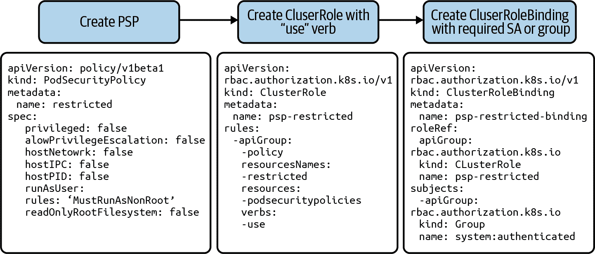
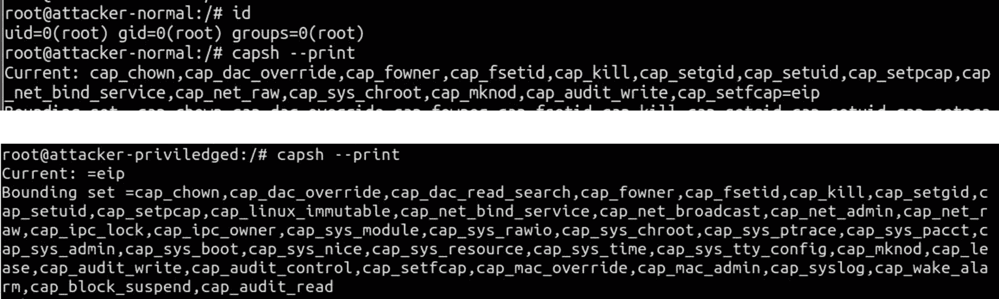
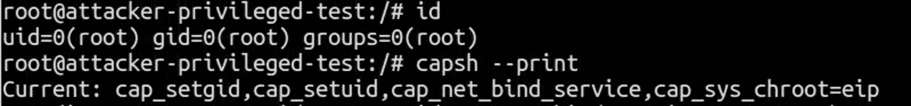
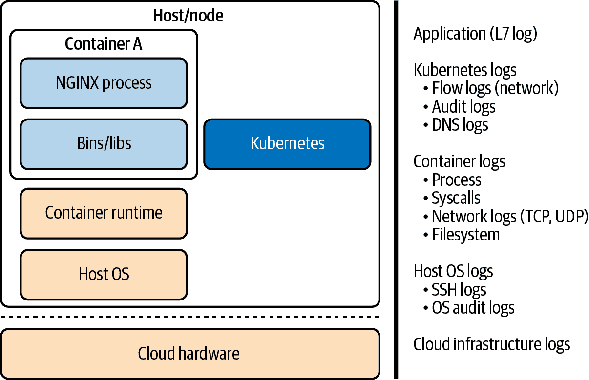
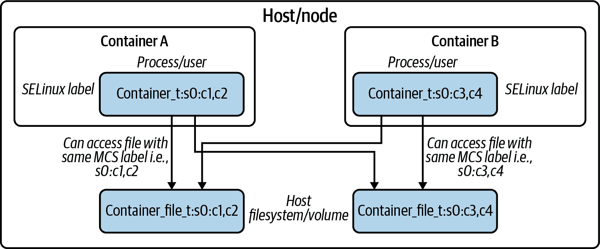

# 第四章：工作负载运行时安全性

与 Manoj Ahuje 的贡献，

Tigera 的高级威胁情报研究工程师

Kubernetes 的默认 Pod 提供机制存在广泛的攻击面，敌对方可以利用这一点来攻击集群或逃逸容器。本章将教您如何实施 Pod 安全策略（PSP），以限制 Pod 的攻击面，并学习如何监控进程（例如进程权限）、文件访问以及工作负载的运行时安全性。以下是我们将讨论的一些具体内容：

+   我们将覆盖 PSP 的实现细节，例如 Pod 安全上下文，并解释 PSP 的限制。请注意，自 Kubernetes v1.21 起，PSP 已被弃用；然而，由于我们知道 PSP 被广泛使用，本章节将继续讨论此主题。

+   我们将讨论过程监控，重点是需要 Kubernetes 本地监控来检测可疑活动。我们将覆盖使用内核安全特性如 seccomp、SELinux 和 AppArmor 来防止容器访问主机资源的运行时监控和强制执行。

+   我们将同时讨论漏洞的检测和运行时防御、工作负载隔离以及爆炸半径的控制。

# Pod 安全策略

Kubernetes 通过使用 PSP 提供了一种安全地引导 Pod 和容器的方法。它们是一个集群范围的资源，可以在将 Pod 允许并计划在集群中运行之前，检查一组条件。这通过一个 Kubernetes 准入控制器实现，该控制器会评估每个 Pod 创建请求，以确保其符合分配给 Pod 的 PSP 的规定。

请注意，自 Kubernetes 1.21 版本起，PSP 已被弃用，并计划在 1.25 版本中移除。尽管如此，它们在生产集群中被广泛使用，因此本节将帮助您了解它们的工作原理以及实施 PSP 的最佳实践。

PSP 允许您通过诸如 *Pods 不应作为 root 运行* 或 *Pods 不应使用主机网络、主机命名空间或以特权模式运行* 等控制来强制执行规则。这些策略在 Pod 创建时生效。通过使用 PSP，您可以确保 Pod 以操作所需的最低特权创建，从而减少应用程序的攻击面。此外，该机制还帮助您符合 PCI、SOC 2 或 HIPAA 等各种标准的要求，这些标准要求使用最少特权访问原则。正如其名称所示，该原则要求任何进程、用户或者在我们的情况下，工作负载都被授予其运行所需的最低权限。

## 使用 Pod 安全策略

Kubernetes PSP 被推荐但通过可选的准入控制器实现。启用 PSP 的强制性可以通过启用一个准入控制器来实现。这意味着 Kubernetes API 服务器清单应在其--enable-admission-plugins 列表中具有一个 PodSecurityPolicy 插件。许多 Kubernetes 发行版不支持或默认禁用 PSP，因此在选择 Kubernetes 发行版时值得检查。

一旦启用了 PSP，将 PSP 应用到组而不是单个服务帐户是一个三步骤的过程，如图 4-1 所示。一个最佳实践是应用 PSP 到组。



###### 图 4-1\. 应用 PSP 的过程

第 1 步是创建一个 PSP。第 2 步是创建具有`use`动词的 ClusterRole，授权 Pod 部署控制器使用这些策略。然后第 3 步是创建 ClusterRoleBindings，用于对组（例如，system:authenticated 或 system:unauthenticated）或服务帐户强制执行策略。

一个良好的起点是来自 Kubernetes 项目的 PSP 模板：

```
apiVersion: policy/v1beta1
kind: PodSecurityPolicy
metadata:
  name: restricted
  annotations:
    seccomp.security.alpha.kubernetes.io/allowedProfileNames: |
    'docker/default,runtime/default'
    apparmor.security.beta.kubernetes.io/allowedProfileNames: 'runtime/default'
    seccomp.security.alpha.kubernetes.io/defaultProfileName:  'runtime/default'
    apparmor.security.beta.kubernetes.io/defaultProfileName:  'runtime/default'
spec:
  privileged: false
  # Required to prevent escalations to root.
  allowPrivilegeEscalation: false
  # This is redundant with non-root + disallow privilege escalation,
  # but we can provide it for defense in depth.
  requiredDropCapabilities:
    - ALL
  # Allow core volume types.
  volumes:
    - 'configMap'
    - 'emptyDir'
    - 'projected'
    - 'secret'
    - 'downwardAPI'
    # Assume that persistentVolumes set up by the cluster admin are safe to use.
    - 'persistentVolumeClaim'
  hostNetwork: false
  hostIPC: false
  hostPID: false
  runAsUser:
    # Require the container to run without root privileges.
    rule: 'MustRunAsNonRoot'
  seLinux:
    # This policy assumes the nodes are using AppArmor rather than SELinux.
    rule: 'RunAsAny'
  supplementalGroups:
    rule: 'MustRunAs'
    ranges:
      # Forbid adding the root group.
      - min: 1
        max: 65535
  fsGroup:
    rule: 'MustRunAs'
    ranges:
      # Forbid adding the root group.
      - min: 1
        max: 65535
  readOnlyRootFilesystem: false
```

在以下示例中，您可以使用 Kubernetes 基于角色的访问控制将此策略应用于所有经过身份验证的用户：

```
apiVersion: rbac.authorization.k8s.io/v1
kind: ClusterRole  Policy
metadata:
  name: psp-restricted
rules:
- apiGroups:
  - policy
  resourceNames:
  - restricted
  resources:
  - podsecuritypolicies
  verbs:
  - use
---
apiVersion: rbac.authorization.k8s.io/v1
kind: ClusterRoleBinding
metadata:
  name: psp-restricted-binding
roleRef:
  apiGroup: rbac.authorization.k8s.io
  kind: ClusterRole
  name: psp-restricted
subjects:
  - apiGroup: rbac.authorization.k8s.io
    kind : Group
    name: system:authenticated
```

## Pod 安全策略功能

让我们关注 PSP 提供的功能，您可以根据您的用例和内部威胁模型进行利用。您可以按照我们刚讨论过的示例 PSP 模板来构建您自己的 PSP。在此模板中，大部分 PSP 功能被利用来制定一种限制性策略。

要解释一项能力的影响，让我们看一个示例，在这个示例中，您可以看到为使用 privileged:true 和 privileged:false 创建的 Pod 授予的能力。Linux 实用程序[capsh](https://oreil.ly/UuDcu)可以用来评估容器化根用户的权限。正如您在图 4-2 中所见，特权 Pod 在其 Linux 命名空间中具有大量能力，这意味着攻击者可以更广泛地攻击您的容器逃逸面。



###### 图 4-2\. 默认和特权 Pod 的 Pod 功能

表 4-1 总结了在[Kubernetes PSP 文档](https://oreil.ly/FSDGN)中描述的 Pod 功能。

表 4-1\. Pod 功能

| Field | Uses |
| --- | --- |
| privileged | 允许容器获得访问主机挂载、文件系统以更改设置等功能。您可以使用命令`capsh --print`检查功能。 |
| hostPID, hostIPC | 允许容器访问主机命名空间，其中进程和以太网接口对其可见。 |
| hostNetwork, hostPorts | 允许容器访问主机网络和端口。 |
| volumes | 允许卷类型如 configMap、emtyDir 或 secret。 |
| allowedHostPaths | 允许列出可以被 hostPath 卷使用的主机路径的白名单（例如，/tmp）。 |
| allowedFlexVolumes | 允许特定的 FlexVolume 驱动程序（例如 azure/kv）。 |
| fsGroup | 设置拥有 pod 卷的 GID 或 GID 范围。 |
| readOnlyRootFilesystem | 将容器的根文件系统设置为只读。 |
| runAsUser, runAsGroup, supplementalGroups | 定义容器的 UID 和 GID。在此处，您可以指定非 root 用户或组。 |
| allowPrivilegeEscalation, defaultAllowPrivilegeEscalation | 通过进程限制特权升级。 |
| defaultAddCapabilities, requiredDropCapabilities, allowedCapabilities | 根据需要添加或删除 [Linux capabilities](https://oreil.ly/H87Jc)。 |
| SELinux | 定义容器的 SELinux 上下文。 |
| allowedProcMountTypes | 容器允许的 proc 挂载类型。 |
| forbiddenSysctls,allowedUnsafeSysctls | 设置容器使用的 sysctl 配置文件。 |
| annotations | 设置容器使用的 AppArmor 和 seccomp 配置文件。 |

在使用 PSP 注释时，可以使用 AppArmor 和 seccomp 配置文件，其中可以使用运行时（Docker、CRI）的默认配置文件或者您在主机上加载的自定义配置文件。您将在 “进程监控” 中了解更多关于这些防御措施的信息。

## Pod 安全上下文

与定义为整个集群的 PSPs 不同，pod securityContext 可以在创建部署或 pod 时定义运行时。以下是 pod securityContext 在操作中的简单示例，其中 pod 使用 root 用户 `(uid=0)` 创建，并且只允许四种功能：

```
kind: Pod
apiVersion: v1
metadata:
  name: attacker-privileged-test
  namespace: default
  labels:
    app: normal-app
spec:
  containers:
  - name: attacker-container
    image: alpine:latest
    args: ["sleep", "10000"]
    securityContext:
      runAsUser: 0
      capabilities:
        drop:
          - all
        add:
          - SYS_CHROOT
          - NET_BIND_SERVICE
          - SETGID
          - SETUID
```

此代码片段展示了如何通过指定安全上下文创建一个以 root 用户运行但只允许部分功能集的 pod。图 4-3 展示了可以运行的命令，以验证 pod 以 root 用户和受限功能集运行。



###### 图 4-3\. 允许的四种 pod 功能

Pod 安全上下文，如 图 4-3 所示，可以在不启用 PSPs 的情况下使用，但一旦启用 PSPs，您需要定义 securityContext 以确保正确创建 pod。由于 securityContext 具有 PSP 构造，所有 PSP 的功能都适用于 securityContext。

## PSPs 的限制

PSPs 的一些限制包括：

+   PodSecurityPolicySpec 引用了 allowedCapabilities、privileged 或 hostNetwork。这些强制措施仅适用于基于 Linux 的运行时。

+   如果您正在使用控制器（例如复制控制器）创建 pod，则值得检查这些控制器是否被授权使用 PSPs。

+   一旦在整个集群启用了 PSPs 并且由于错误的 PSP 导致 pod 无法启动，那么排除问题将变得非常繁琐。此外，如果在生产集群中整个集群启用了 PSPs，您需要测试集群中的每个组件，包括像突变接入控制器和冲突判断这样的依赖项。

+   [Azure Kubernetes Service (AKS)](https://oreil.ly/Z99lf) 已弃用对 PSP 的支持，并优先使用 OPA Gatekeeper 进行策略执行，以支持使用 OPA 引擎实现更灵活的策略。

+   PSP 已被弃用，并计划在 Kubernetes v1.25 中移除。

+   Kubernetes 可能存在 PSP 可被绕过的边缘情况（例如，[TOB-K8S-038](https://oreil.ly/PqfNQ)）。

现在您了解了 PSP、实施它们的最佳实践以及 PSP 的限制，让我们来看看进程监控。

## 进程监控

当您将工作负载容器化并在像 Kubernetes 这样的编排器上运行时，您需要考虑的层次很多，以监控容器内的进程。这些层次包括容器进程日志和工件、文件系统访问、网络连接、所需的系统调用、内核权限（特殊工作负载）、Kubernetes 工件和云基础设施工件。通常，您组织的安全姿态取决于您的解决方案在将这些各种日志上下文有机地结合起来方面的表现。这也是传统监控系统明显不足之处，需要 Kubernetes 的本地监控和可观察性的原因。传统解决方案，如终端点检测与响应（EDR）和终端点保护系统，在 Kubernetes 集群中使用时存在以下限制：

+   他们不知道容器。

+   他们不了解容器网络，通常从主机的角度看待活动，这可能导致对攻击者的侧向移动产生误判。

+   他们对容器之间的流量一无所知，也看不到像 IPIP 或 VXLAN 这样的底层协议。

+   他们不了解容器访问底层主机的进程权限和文件权限。

+   他们不了解 Kubernetes 容器运行时接口（CRI）或其复杂性和安全问题，这可能导致容器能够访问主机上的资源。这也被称为*权限提升*。

在接下来的几节中，我们将介绍您可以用于进程监控的各种技术。首先，我们将查看 Kubernetes 中可用的各种日志进行监控；然后，我们探讨 seccomp、SELinux 和 AppArmor 功能，这些功能允许您控制进程可以访问的内容（例如系统调用、文件系统等）。

## Kubernetes 本地监控

如 图 4-4 所示，每一层到您的容器化应用程序进程都引入了监控和日志记录要求，以及与传统 IT 安全从业人员监控网络和应用程序不同的新攻击面。挑战在于减少这种监控开销，因为对于存储和计算资源来说这可能变得非常昂贵。有关度量收集及其高效执行的详细信息将在 第五章 中详细讨论。



###### 图 4-4\. Kubernetes 本地监控

要在每个层面构建防御，你在选择解决方案时应该考虑以下几个选项：

+   能够阻止每个容器或 Kubernetes 编排创建容器生成的进程。

+   监控每个容器进程使用的内核系统调用，并能够过滤、阻止和警报可疑调用，以防止容器访问主机资源。

+   监控每个容器进程发起的每个网络连接（套接字），并能够强制执行网络策略。

+   能够使用网络策略隔离容器（或运行该容器的节点），并将其暂停以调查可疑活动并在 Kubernetes 中收集取证数据。基于 Docker 的容器的 [`pause` 命令](https://oreil.ly/LE52U) 暂停容器中的进程以进行详细分析。请注意，暂停容器将导致其停止正常操作，应作为对事件（例如安全事件）的响应而使用。

+   监控文件系统的读写操作，了解文件系统变更（二进制、软件包），并通过强制访问控制（MAC）进行额外隔离，以防止提权。

+   监控 Kubernetes 审计日志，了解客户端发出的 Kubernetes API 请求及检测可疑活动。

+   启用云服务提供商的基础设施日志记录，并能够在云服务提供商的基础设施中检测可疑活动。

有许多企业和开源解决方案（例如，Falco），利用各种工具和机制（如 ebpf、kprobes、ptrace、tracepoints 等）来瞄准各层级，帮助在各个层面构建防御。你应该查看它们的威胁模型，并选择满足其需求的解决方案。

在接下来的部分，你将看到 Kubernetes 提供的一些机制，通过将 Linux 防御措施与容器更紧密地结合，帮助你在各层面监控和减少攻击面。前一部分侧重于监控，以便检测意外（恶意）行为。以下机制允许你设置控件以防止意外（恶意）行为。

内核安全功能如 seccomp、AppArmor 和 SELinux 可以控制容器化应用程序所需的系统调用，为每个容器提供虚拟隔离和定制，以及使用 MAC 为访问资源（如卷或文件系统）提供访问，有效防止容器越界。仅使用默认设置的功能即可大幅减少集群中的攻击面。在接下来的部分中，你将深入了解每种防御措施及其在 Kubernetes 集群中的工作方式，以便选择适合你威胁模型的最佳选项。

## Seccomp

Seccomp 是 Linux 内核的一个功能，可以在粒度基础上过滤容器执行的系统调用。Kubernetes 允许您通过像[Docker](https://www.docker.com)、[podman](https://oreil.ly/O4ZUZ)或[CRI-O](https://oreil.ly/Cgrep)这样的运行时自动应用加载到节点上的 seccomp 配置文件。简单的 seccomp 配置文件包括一系列 syscalls 和在调用 syscalls 时要采取的适当操作。此操作将攻击面减少到仅允许的 syscalls，从而减少特权升级和容器逃逸的风险。

在下面的 seccomp 配置文件中，默认操作是`SCMP_ACT_ERRNO`，这会拒绝系统调用。但是对于 syscall chmod，默认的操作被覆盖为`SCMP_ACT_ALLOW`。通常，seccomp 配置文件由您的运行时加载到所有节点的/var/lib/kubelet/seccomp 目录中。您可以在同一位置添加自定义配置文件：

```
{
    "defaultAction": "SCMP_ACT_ERRNO",
    "architectures": [
        "SCMP_ARCH_X86_64",
        "SCMP_ARCH_X86",
        "SCMP_ARCH_X32"
    ],
    "syscalls": [
        {
            "names": [
                "chmod",
            ],
            "action": "SCMP_ACT_ALLOW"
        }
    ]
}
```

要查找应用程序使用的系统调用，可以使用`strace`，如下例所示。例如，您可以列出`curl`实用程序使用的 syscalls 如下：

```
$ strace -c -S name curl -sS google.com

% time     seconds  usecs/call     calls    errors syscall
------ ----------- ----------- --------- --------- ----------------
  4.56    0.000242           6        43        43 access
  0.06    0.000003           3         1           arch_prctl
  1.28    0.000068          10         7           brk
  0.28    0.000015          15         1           clone
  4.62    0.000245           5        48           close
  1.38    0.000073          73         1         1 connect
  0.00    0.000000           0         1           execve
  0.36    0.000019          10         2           fcntl
  4.20    0.000223           5        48           fstat
  0.66    0.000035           3        11           futex
  0.23    0.000012          12         1           getpeername
  0.13    0.000007           7         1           getrandom
  0.19    0.000010          10         1           getsockname
  0.24    0.000013          13         1           getsockopt
  0.15    0.000008           4         2           ioctl
 13.96    0.000741           7       108           mmap
 11.94    0.000634           7        85           mprotect
  0.32    0.000017          17         1           munmap
 11.02    0.000585          13        45         1 openat
  0.11    0.000006           6         1           pipe
 19.50    0.001035         115         9           poll
  0.08    0.000004           4         1           prlimit64
  5.43    0.000288           6        45           read
  0.41    0.000022          22         1           recvfrom
 11.47    0.000609          17        36           rt_sigaction
  0.08    0.000004           4         1           rt_sigprocmask
  1.00    0.000053          53         1           sendto
  0.06    0.000003           3         1           set_robust_list
  0.04    0.000002           2         1           set_tid_address
  2.22    0.000118          30         4           setsockopt
  1.60    0.000085          43         2           socket
  0.08    0.000004           4         1         1 stat
  2.35    0.000125          21         6           write
------ ----------- ----------- --------- --------- ----------------
100.00    0.005308                   518        46 total
```

Kubernetes 运行时提供的默认 seccomp 配置文件包含大多数应用程序使用的常见 syscalls 列表。启用此功能可以禁止使用危险的系统调用，从而可以导致内核漏洞利用和容器逃逸。您可以参考[默认 Docker 运行时 seccomp 配置文件](https://oreil.ly/pGX2O)。

###### 注

在撰写本文时，Docker/default 配置文件已弃用，建议您改用 runtime/default 作为 seccomp 配置文件。

表格 4-2 展示了通过 PSP 注释在 Kubernetes 中部署 seccomp 配置文件的选项。

表格 4-2\. Seccomp 选项

| 值 | 描述 |
| --- | --- |
| runtime/default | 默认容器运行时配置文件 |
| 未限制 | Kubernetes 中默认没有 seccomp 配置文件—此选项是默认的。 |
| localhost/<path> | 您在节点上的自定义配置文件，通常位于/var/lib/kubelet/seccomp 目录中 |

## SELinux

在最近的过去，每个容器运行时的突破（容器逃逸或特权升级）都是某种文件系统的突破（即 CVE-2019-5736、CVE-2016-9962、CVE-2015-3627 等）。通过提供控制谁可以访问文件系统以及资源之间的交互（例如用户、文件、目录、内存、套接字等），SELinux 可以减轻这些问题。在云计算环境中，应用 SELinux 配置文件对工作负载进行更好的隔离，通过限制主机内核对文件系统的访问来减少攻击面。

SELinux 最初由国家安全局在 2000 年代初开发，主要用于基于 Red Hat 和 centOS 的发行版。SELinux 之所以有效，是因为它提供了 MAC，极大增强了传统的 Linux 自主访问控制（DAC）系统。

在传统的 Linux DAC 中，用户可以更改文件、目录和自己拥有的进程的权限。根用户可以访问所有内容。但是使用 SELinux（MAC）时，每个操作系统资源都由内核分配一个标签，并存储为扩展文件属性。这些标签用于在内核内评估 SELinux 策略，以允许任何交互。启用 SELinux 后，即使容器中的根用户也无法访问挂载卷中主机的文件，如果标签不准确的话。

SELinux 有三种模式：强制执行（Enforcing）、宽松（Permissive）和禁用（Disabled）。强制执行使 SELinux 策略生效，宽松提供警告，禁用则不使用 SELinux 策略。SELinux 策略本身可以进一步分为定向（Targeted）和严格（Strict），定向策略适用于特定进程，而严格策略适用于所有进程。

下面是主机上 Docker 二进制文件的 SELinux 标签，由 `<user:role:type:level>` 组成。在这里，您将看到类型，即 `container_runtime_exec_t`：

```
$ ls -Z /usr/bin/docker*
-rwxr-xr-x. root root system_u:object_r:container_runtime_exec_t:s0
/usr/bin/docker
-rwxr-xr-x. root root system_u:object_r:container_runtime_exec_t:s0
/usr/bin/docker-current
-rwxr-xr-x. root root system_u:object_r:container_runtime_exec_t:s0
/usr/bin/docker-storage-setup
```

为了进一步增强 SELinux，使用多类别安全（MCS）允许用户为资源打上类别标签。因此，标有类别标签的文件只能被该类别的用户或进程访问。

一旦启用 SELinux，像 [Docker](https://oreil.ly/WKf97)、[podman](https://oreil.ly/HW4Cc) 或 [`CRI-O`](https://oreil.ly/2bOJA) 这样的容器运行时会选择一个随机的 MCS 标签来运行容器。这些 MCS 标签由两个在 1 到 1023 之间的随机数组成，并以字符“c”（类别）和一个敏感级别（即 s0）为前缀。因此，完整的 MCS 标签看起来像 “s0:c1,c2”。如 图 4-5 所示，除非正确标记，否则容器无法访问主机或 Kubernetes 卷上的文件。这在资源交互之间提供了重要的隔离，防止许多针对逃逸容器的安全漏洞。



###### 图 4-5\. SELinux 强制执行文件系统访问权限

接下来是一个部署有 SELinux 配置文件的 pod 示例；除非在主机上标记为 so:c123,c456，否则此 pod 将无法访问任何主机卷挂载文件。即使您可以看到整个主机，文件系统也是以 pod 的方式挂载的：

```
apiVersion: v1
metadata:
  name: pod-se-linux-label
  namespace: default
  labels:
    app: normal-app
spec:
  containers:
  - name: app-container
    image: alpine:latest
    args: ["sleep", "10000"]
    securityContext:
      seLinuxOptions:
        level: "s0:c123,c456"
  volumes:
    - name: rootfs
      hostPath:
        path: /
```

表 4-3 列出了关于容器逃逸的 CVE，通过在主机上启用 SELinux 可以预防。虽然 SELinux 策略可能难以维护，但它们对于深度防御策略至关重要。Openshift，一个 Kubernetes 分发版，在其默认配置中启用了 SELinux，并使用定向策略；对于其他发行版，检查状态值得一试。

表 4-3\. 与容器逃逸相关的 CVE

| CVE | 描述 | SELinux 阻止 |
| --- | --- | --- |
| CVE-2019-5736 | 允许攻击者覆盖主机的 runc 二进制文件，从而获取主机 root 访问权限 | 是 |
| CVE-2016-9962 | RunC 执行漏洞 | 是 |
| CVE-2015-3627 | 不安全的文件描述符利用 | 是 |

Kubernetes 通过 PSP 提供以下选项来强制执行 SELinux：

| Value | 描述 |
| --- | --- |
| MustRunAs | 需要像 图 4-5 中显示的那样配置 seLinuxOptions。 |
| RunAsAny | 在 PSP 中不提供默认设置（可以选择性地在 pod 和 deployments 上配置） |

## AppArmor

与 SELinux 类似，AppArmor 是为 Debian 和 Ubuntu 操作系统开发的。AppArmor 的工作方式类似于 SELinux，其中一个 AppArmor 配置文件定义了进程可以访问的内容。让我们看一个 AppArmor 配置文件的示例：

```
#include <tunables/global>
/{usr/,}bin/ping flags=(complain) {
  #include <abstractions/base>
  #include <abstractions/consoles>
  #include <abstractions/nameservice>

  capability net_raw,
  capability setuid,
  network inet raw,

  /bin/ping mixr,
  /etc/modules.conf r,

  # Site-specific additions and overrides. See local/README for details.
  #include <local/bin.ping>
}
```

这里的 ping 实用工具仅具备三个能力（即 net_raw、setuid 和对 /etc/modules.conf 的 inet 原始和读取访问权限）。有了这些权限，ping 实用程序无法修改或写入文件系统（密钥、二进制文件、设置、持久性），也不能加载任何模块，这减少了 ping 实用程序在受到威胁时执行任何恶意活动的攻击面。

默认情况下，像 [Docker](https://oreil.ly/WKf97)、[podman](https://oreil.ly/HW4Cc) 或 [CRI-O](https://oreil.ly/Cgrep) 这样的 Kubernetes 运行时会提供一个 AppArmor 配置文件。Docker 的运行时配置文件可以参考 [此处](https://oreil.ly/utKNx)。

由于 AppArmor 更加灵活且易于使用，我们建议为每个微服务单独创建一个策略。Kubernetes 通过 PSP 注解提供以下选项来强制执行这些策略：

| Value | 描述 |
| --- | --- |
| runtime/default | 运行时的默认策略 |
| localhost/<profile_name> | 应用于主机上加载的配置文件，通常位于目录 /sys/kernel/security/apparmor/profiles |
| unconfined | 不加载任何配置文件 |

## Sysctl

[`Kubernetes sysctl`](https://oreil.ly/zwlcG) 允许您使用 sysctl 接口在集群中使用和配置内核参数。使用 sysctl 的一个示例是管理需要处理大量并发连接或需要特殊参数设置（例如 IPv6 转发）以有效运行的资源密集型工作负载的容器。在这种情况下，sysctl 提供了一种仅对这些工作负载修改内核行为而不影响集群其余部分的方法。

sysctl 可以将 sysctl 分为两个桶：安全和不安全。安全的 sysctl 只影响容器，但不安全的 sysctl 影响容器和运行在其上的节点。管理员可以自行决定如何设置这两个 sysctl 桶。

举例来说，如果一个容器化的 Web 服务器需要处理大量并发连接，并且需要将 net.core.somaxconn 值设置为高于内核默认值，可以如下设置：

```
apiVersion: v1
kind: Pod
metadata:
  name: sysctl-example
spec:
  securityContext:
    sysctls:
    - name: net.core.somaxconn
      value: "1024"
```

请注意，我们建议您使用节点亲和性来安排工作负载，以便在需要使用适用于节点的 sysctl 时使用。以下示例显示了 PSPs 如何允许或禁止 sysctl：

```
apiVersion: policy/v1beta1
kind: PodSecurityPolicy
metadata:
  name: sysctl-psp
spec:
  allowedUnsafeSysctls:
  - kernel.msg*
  forbiddenSysctls:
  - kernel.shm_rmid_forced
```

# 结论

在本章中，我们讨论了定义和实施工作负载运行时安全性的工具和最佳实践。最重要的要点是：

+   Pod 安全策略是在工作负载创建时启用工作负载控制的一种绝佳方式。它们有一些限制，但可以有效使用。

+   您需要选择一个在 Kubernetes 中本地支持的监控进程的解决方案，并根据您的工作负载威胁模型实施控制。

+   我们建议您审查 Linux 内核中提供的各种安全选项，并根据您的用例利用适当的功能集。
