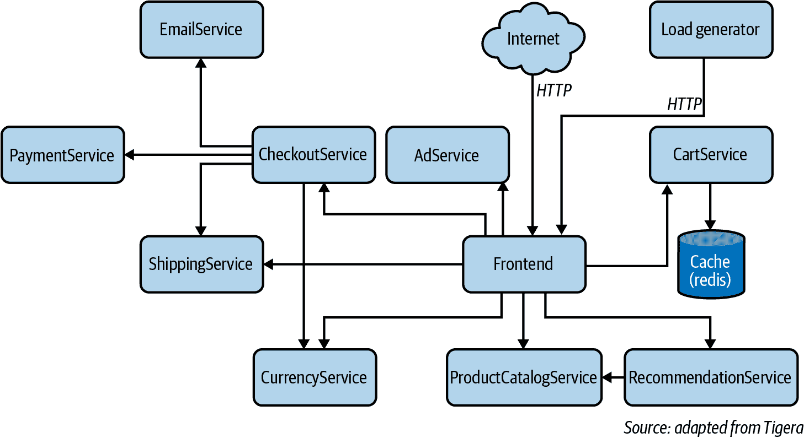
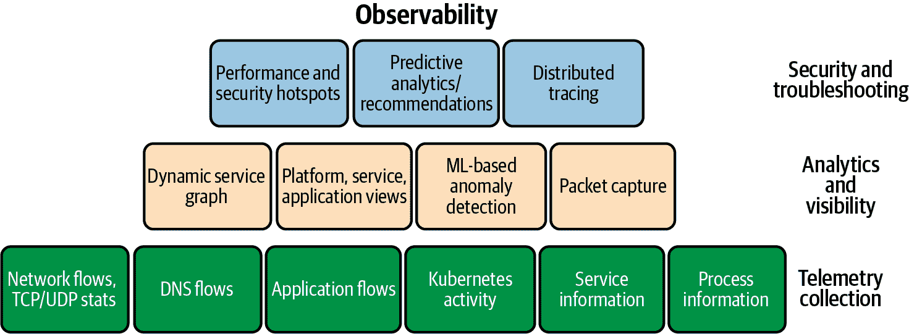
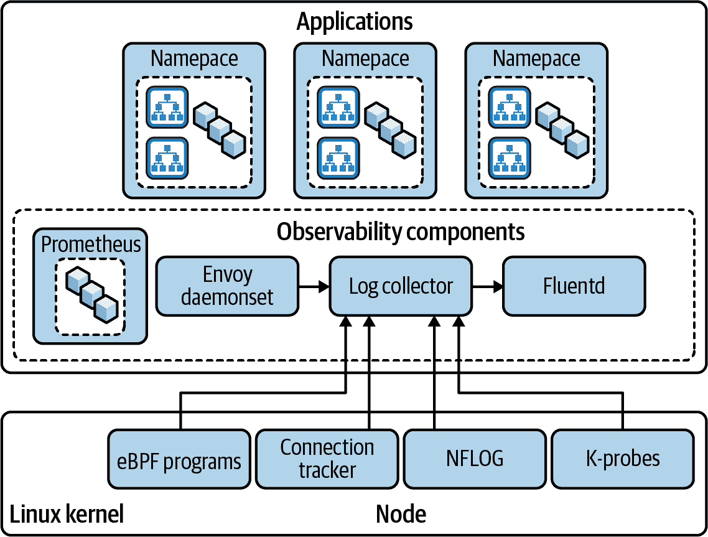
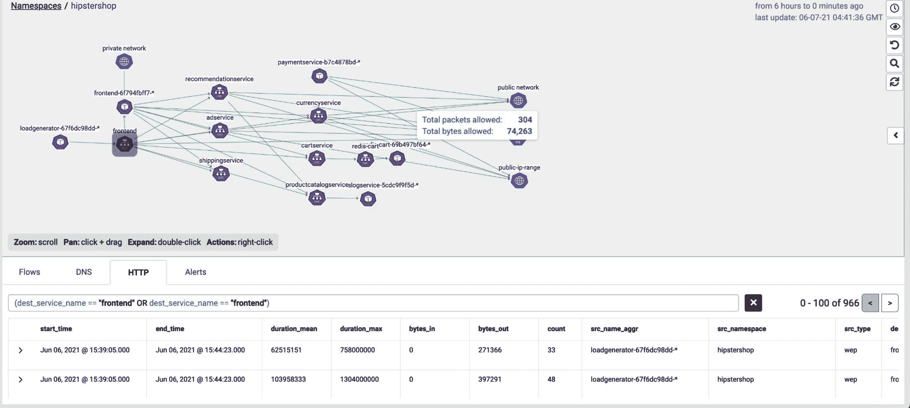
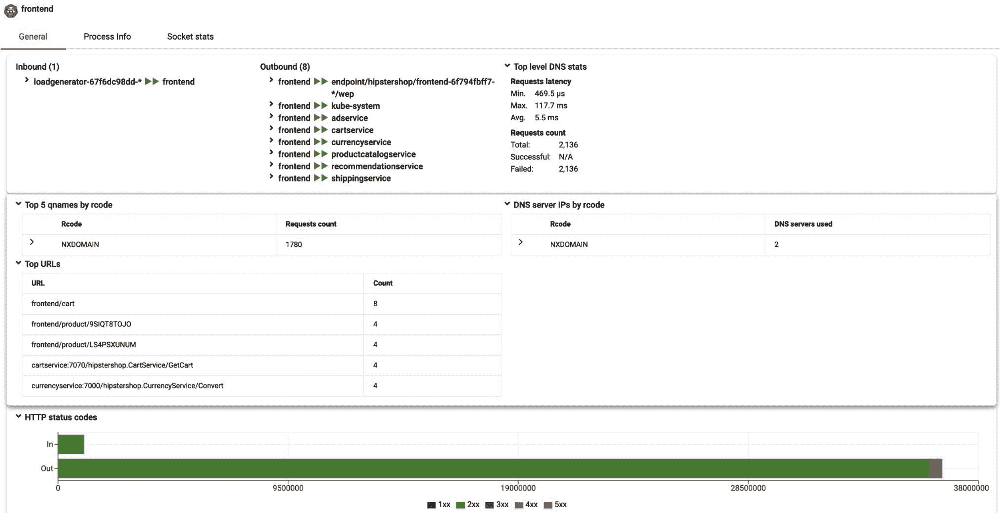
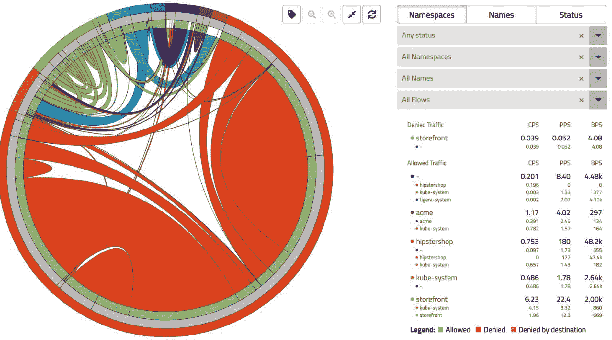

# 第五章：观察性

在本章中，我们将讨论在 Kubernetes 部署背景下监控和可观察性之间的区别。我们将解释在您的 Kubernetes 集群中实施可观察性的最佳实践和工具。在下一章中，我们将介绍如何利用可观察性来保护您的集群。

可观察性最近在 Kubernetes 社区中成为讨论的话题，并引起了很多关注。我们首先要理解监控和可观察性之间的区别。然后，我们将看看为何在像 Kubernetes 这样的分布式应用中，可观察性对安全至关重要，并审查实现可观察性的工具和参考实现。虽然可观察性是一个广泛的话题，并适用于多个领域，但在本章中，我们将讨论重点放在 Kubernetes 上。让我们从监控和可观察性开始，并了解它们的区别。

# 监控

监控是系统中用于警示从正常范围偏离的已知一组测量。以下是在 Kubernetes 中您可以监视的数据类型示例：

+   Pod 日志

+   网络流日志

+   应用程序流日志

+   审计日志

您可以监控的指标示例包括以下内容：

+   每秒连接数

+   每秒数据包数，每秒字节数

+   应用程序（API）每秒请求数

+   CPU 和内存利用率

这些日志和指标可以帮助您识别已知故障，并提供有关症状的更多信息，以帮助您解决问题。

为了监视您的 Kubernetes 集群，您使用诸如轮询和正常运行时间检查的技术，具体取决于您需要为其集群维护的 SLA。以下是您可以监视 SLA 的示例指标：

+   轮询应用程序/API 端点

+   应用响应代码（例如 HTTP 或数据库错误代码）

+   应用程序响应时间（例如 HTTP 持续时间，数据库事务时间）

+   用于扩展用例的节点可用性

+   节点上的内存/CPU/磁盘/IO 资源

监控的另一个重要部分是警报。您需要一个警报系统作为监控解决方案的一部分，为任何违反指定阈值的度量生成警报。像 Grafana、Prometheus、OpenMetrics、OpenTelemetry 和 Fluentd 这样的工具被用作监控工具，用于收集日志和指标，并为 Kubernetes 集群生成报告、仪表板和警报。Kubernetes 提供了与类似 Opsgenie、PagerDuty、Slack 和 JIRA 这样的工具集成的选项，用于警报转发和管理。

监控您的生产 Kubernetes 集群存在以下问题：

日志数据量

在类似 Kubernetes 的系统中，一个节点上有多个运行在主机上的 pod，每个 pod 都有其自己的日志、网络标识和资源。这意味着您需要收集来自应用程序操作、网络流量日志、Kubernetes 活动（审计）日志以及每个 pod 的应用程序流量日志。在非 Kubernetes 环境中，通常一个节点上运行一个应用程序，因此日志集合只是单一的一组日志，而不是每个运行在节点上的 pod 的一组日志。这增加了需要收集/检查的日志数据量。除了每个 pod 的日志外，您还需要收集 Kubernetes 的集群日志。通常这些也称为审计日志，提供了对 Kubernetes 集群活动的可见性。系统中的日志数量将使监视变得非常耗费资源且昂贵。您的日志收集集群不应该比运行应用程序的集群更昂贵！

监视分布式应用程序

在 Kubernetes 集群中，应用程序分布在 Kubernetes 集群网络中。一个需要多个 pod 的应用程序（例如，一个部署集或一个服务）将会有每个 pod 的日志需要检查，除了需要考虑 pod 集合的上下文（例如，扩展，错误处理等）。在生成应用程序警报之前，我们需要将多个 pod 视为一个组。请注意，目标是监视应用程序并为其生成警报，独立为应用程序的一部分生成警报并不会准确反映应用程序的状态。还有微服务应用程序的情况，其中单个应用程序部署为一组称为*微服务*的服务，每个微服务负责应用程序功能的一部分。在这种情况下，您需要将每个微服务作为一个实体进行监视（请注意，一个微服务是一个或多个 pod 的集合），然后理解哪些微服务影响了任何给定的应用程序事务。只有在这之后才能为应用程序报告警报。

Kubernetes 的声明性质

正如我们所涵盖的，Kubernetes 是声明式的，允许您精确指定如何在集群中创建和运行 pod。Kubernetes 允许您为内存、CPU、存储等指定资源限制，还可以创建自定义资源并为这些资源指定限制。调度器将查找具有所需资源的节点，并在节点上调度 pod。Kubernetes 还监视 pod 的使用情况，并将消耗超过分配资源的 pod 终止。此外，Kubernetes 提供详细的指标，可用于监控 pod 和集群状态。例如，您可以使用类似 [Prometheus](https://oreil.ly/zzjVG) 的工具监控 pod 和集群状态，并使用这些指标，还可以使用所谓的 [水平 Pod 自动伸缩器](https://oreil.ly/luM5u) 自动扩展 pod 或其他集群资源。这意味着 Kubernetes 作为其操作的一部分正在监视并对集群进行更改，以维持根据配置的规范运行。在这种情况下，监控单个指标的警报可能是 Kubernetes 进行更改以适应集群负载的结果，也可能是一个真正的问题。您需要能够区分这两种情况，以准确监控您的应用程序。

现在我们了解了监控及其如何实施以及在使用监控时 Kubernetes 集群面临的挑战后，让我们来看看可观察性以及它如何帮助克服这些挑战。

# 可观察性

可观察性是指仅通过观察系统的外部输出就能理解系统内部状态的能力。[*可观察性工程*，查理蒂·梅杰斯等人（O’Reilly）](https://oreil.ly/3hPEr) 是了解可观察性的绝佳资源。该书的第二章讨论了监控和可观察性，对本次讨论非常相关。

可观察性基于监控，并使您能够获取有关应用程序内部状态的见解。例如，在 Kubernetes 集群中，意外的 pod 重新启动事件可能对服务没有或只有很少的影响，因为在重新启动时，可能已经有足够的 pod 实例来处理负载。监控系统将生成警报，说明发生了意外的 pod 重新启动事件；可观察性系统将生成一个中等优先级事件，并说明发生了意外的 pod 重新启动事件，但如果在 pod 重新启动时没有应用程序错误等其他事件，则对系统没有影响。另一个例子是在应用程序层生成事件时（例如，HTTP 请求的持续时间大于正常值）。在这种情况下，可观察性系统将为应用程序响应时间下降的原因提供背景信息（例如，网络层问题、重传、由于资源或其他应用程序问题导致的应用程序 pod 重新启动、Kubernetes 基础设施问题，如 DNS 延迟或 API 服务器负载）。正如前面所解释的，可观察性系统可以查看影响应用程序状态的多个事件，并在考虑所有这些事件后报告应用程序状态。现在让我们看看如何在 Kubernetes 系统中实现可观察性。

## 可观察性在 Kubernetes 中的工作原理

Kubernetes 的声明性特性在实施可观察性系统中非常有帮助。我们建议您构建一个与 Kubernetes 本地化且能够理解集群操作的系统。例如，一个了解 Kubernetes 的系统将监视一个 pod（例如，重新启动、内存不足、网络活动等），但还将了解一个 pod 是否是独立实例或部署、副本集或服务的一部分。它还将知道 pod 对服务或部署的关键性有多大（例如，服务配置为可扩展性和高可用性的方式）。因此，当它报告与 pod 相关的任何事件时，它将提供所有这些上下文，并帮助您轻松地做出关于如何响应事件的决定。

另一个需要记住的是，在 Kubernetes 中，您可以将应用程序部署为 pod，这些 pod 是高级结构的一部分，例如部署或服务。为了理解为这些结构实施可观察性所带来的复杂性，我们将使用一个示例来解释它们。当您配置一个服务时，Kubernetes 管理与该服务关联的所有 pod，并确保将流量传递到服务的可用 pod。让我们来看一个来自 [Kubernetes 文档的服务定义示例](https://oreil.ly/ijVz5)：

```
`apiVersion`: v1
`kind`: Service
`metadata`:
  `name`: my-service
`spec`:
  `selector`:
    `app`: MyApp
  `ports`:
    - `protocol`: TCP
      `port`: 80
      `targetPort`: 9376
```

在这个例子中，所有标签为 MyApp 并监听 TCP 端口 9376 的 pod 都成为服务的一部分，所有发送到服务的流量都会被重定向到这些 pod 上。我们在第八章中详细讨论了这个概念。因此，在这种场景下，观测解决方案也应该能够提供服务级别的洞察力。仅仅监视一个 pod 是不够的。所需的是观测能够在服务中汇总所有 pod 的指标，并使用聚合信息进行更多的分析和警报。

现在让我们看一个在 Kubernetes 中的[部署](https://oreil.ly/23Eam)的例子。部署允许你管理 pod 和副本集（pod 的副本，通常用于扩展和高可用性）。以下是 Kubernetes 中部署的一个示例配置：

```
`apiVersion`: apps/v1
`kind`: Deployment
`metadata`:
  `name`: nginx-deployment
  `labels`:
    `app`: nginx
`spec`:
  `replicas`: 3
  `selector`:
    `matchLabels`:
      `app`: nginx
  `template`:
    `metadata`:
      `labels`:
        `app`: nginx
    `spec`:
      `containers`:
      - `name`: nginx
        `image`: nginx:1.14.2
        `ports`:
        - `containerPort`: 80
```

这个配置将创建一个 nginx 的部署，其中有三个副本 pod，具有配置的元数据和规范。Kubernetes 拥有一个部署控制器来确保部署中所有的 pod 和副本都是可用的。使用部署资源在 Kubernetes 中还可以实现滚动更新、自动扩展等多种其他好处。在这样的情况下，观测工具应该查看部署中所有 pod（副本）的活动作为一个整体（例如，部署中所有 pod 的流量、pod 的重新启动及其对部署的影响等）。仅监视和警报每个 pod 并不足以理解部署的运行情况。

在这两个例子中都清楚地表明，指标的收集需要在 Kubernetes 的上下文中进行。我们不应该在 pod 级别粒度上收集所有数据和指标，而是在适用时应该在部署或服务级别粒度上收集数据，以提供部署或服务状态的准确表现。请记住，Kubernetes 抽象了 pod 级别的细节，因此我们需要在更高的级别上进行测量和警报。在部署和服务级别进行数据聚合将减少你需要一直收集的日志数量，并解决与大量日志相关的成本问题。请注意，该工具需要在操作员需要分析问题时有能力深入了解并捕获 pod 级别的细节。我们将在本章后面讨论数据收集时详细介绍这一点。

现在我们已经了解了如何利用 Kubernetes 的声明性特性来帮助观测，并减少我们需要收集和生成相关警报的日志数据量，让我们来探讨 Kubernetes 的分布式特性及其对观测的影响。

在基于微服务的应用部署中，单个应用由多个部署在 Kubernetes 集群中的微服务组成。这意味着为了为用户服务一个单一事务，一个或多个服务需要相互交互，从而产生一个或多个子事务。一个典型的微服务应用示例是 [Google 在线精品演示微服务应用](https://oreil.ly/wx7bj)。图 5-1 展示了该应用的架构。

图 5-1 展示了在线精品应用如何作为 Kubernetes 中的微服务部署。这里有 11 个微服务，每个负责应用的某个方面。我们鼓励您查看这个应用，因为我们将在本章后面使用它来演示如何实现可观测性。如果您查看结帐交易，用户会向前端服务发出请求，然后前端服务会向结帐服务发出请求。结帐服务需要与多个服务进行交互（例如 PaymentService、Shipping Service、CurrencyService、EmailService、ProductCatalog Service、CartService）来完成交易。因此，在这种情况下，如果我们的 HTTP 应用日志显示结帐流程 API 响应时间大于预期，我们需要审查每个子事务，并查看是否存在问题以及问题是什么（应用问题、网络问题等）。另一个使情况复杂化的因素是每个子事务都是异步的，而每个微服务同时提供几个独立的事务。在这种情况下，您需要使用一种称为 *分布式跟踪* 的技术来跟踪单个事务在一组微服务中的流动。分布式跟踪可以通过对应用程序或内核进行仪器化来实现。我们将在本章后面介绍分布式跟踪。



###### 图 5-1\. 谷歌微服务演示应用架构

现在我们理解了可观测性以及在 Kubernetes 集群中如何考虑它之后，让我们来看看 Kubernetes 可观测性工具的组件。图 5-2 展示了 Kubernetes 可观测性工具的各个组件的块图。



###### 图 5-2\. Kubernetes 可观测性工具的组件

图 5-2 显示了实现可观测性所需的以下组件：

遥测数据收集

如前所述，您的可观测性解决方案需要从集群中的各种传感器收集遥测数据。它需要是分布式的且本地化于 Kubernetes。它必须支持从 L3 到 L7 的所有层的传感器。它还需要收集有关 Kubernetes 基础设施（例如 DNS 和 API 服务器日志）以及 Kubernetes 活动（这些称为审计日志）的信息。正如描述的那样，这些信息必须在部署和服务的上下文中收集。

分析和可见性

在这一层面上，系统必须提供特定于 Kubernetes 操作的可视化（例如服务图、Kubernetes 平台视图、应用程序视图）。我们将涵盖一些本地化于 Kubernetes 的常见可视化。我们建议您选择一个利用机器学习技术进行基线化和报告异常的解决方案。最后，系统需要支持运营人员启用 pod 到 pod 的数据包捕获能力（请注意，这与在主机接口上启用数据包捕获不同，因为会丢失 pod 级别的可见性）。我们将在下一节中详细介绍这一点。

安全性和故障排除应用程序

您实施的可观测性系统必须支持分布式跟踪，如前一节所述，以帮助排除应用程序问题。我们还建议使用先进的机器学习技术来理解 Kubernetes 集群的行为并预测性能或安全问题。请注意，这是一个新领域，正在不断创新。

现在我们已经讨论了在 Kubernetes 集群中实施可观测性所需的内容，让我们详细审查每个组件。

## 实施 Kubernetes 的可观测性

在这一部分，我们将审查构建 Kubernetes 中有效观测系统所需的每个组件。

你应该将日志收集视为分布在你的集群中的一组传感器。您需要确保这些传感器是高效的，并且不会干扰系统操作（例如增加延迟）。我们将在本节后面涵盖收集方法，展示如何有效地收集指标。您应该考虑在整个堆栈的所有层部署传感器（或收集信息），如 图 5-2 所示。Kubernetes 审计日志是了解各种 Kubernetes 资源完整生命周期的重要信息源。除了审计日志外，Kubernetes 还提供了多种选项用于 [监控](https://oreil.ly/FSwUs)。接下来，您需要关注流量流日志（Layer 3/Layer 4），以理解 Kubernetes 集群网络操作。考虑到 Kubernetes 的声明性特性，重要的是收集与应用程序流（例如 HTTP 或 MySQL）相关的日志，这些日志可以展示用户看到的应用程序行为可见性（例如响应时间、可用性等）。为了帮助故障排除，您还应该收集与 Kubernetes 集群基础设施相关的日志（例如 API 服务器、DNS）。一些高级故障排除系统还会收集由 pod 活动引起的 Linux 内核信息（例如，由 pod 发起的流的进程信息、套接字统计信息），并提供一种启用 pod 之间流量的数据包捕获（原始数据包）的方式。以下描述了您应该每个流收集的内容：

Kubernetes 审计日志

Kubernetes 提供了收集和监控活动的能力。这是一个优秀的 [指南](https://oreil.ly/aKmCE)，解释了如何控制收集什么以及日志记录和警报机制。我们建议您仔细审查您需要收集和设置审计策略 —— 我们建议不要仅仅收集所有内容。例如，您应该记录 API 请求、用户名、RBAC、决策、请求动词、发出请求的客户端（用户代理）以及 API 请求的响应代码。我们将在可视化部分展示一个样本 Kubernetes 活动仪表板。

网络流量日志

网络流量日志（Layer 3/Layer 4）是理解 Kubernetes 集群网络操作的关键。通常包括五元组（源和目标 IP 地址/端口和端口）。收集与 pods 相关的 Kubernetes 元数据（源和目标命名空间、pod 名称、与 pods 相关的标签、运行 pods 的主机）以及每个流的聚合字节/数据包是非常重要的。请注意，这可能导致大量的流量数据，因为一个节点上可能有大量的 pods。在下一节关于集合时的聚合部分，我们将讨论如何解决这个问题。

DNS 流量日志

除了 API 服务器，DNS 服务器是 Kubernetes 集群的关键部分，被应用程序用于解析域名以连接其他服务/pod，作为正常运行的一部分。DNS 服务器的问题可能会影响集群中的多个应用程序。从客户端的角度收集信息非常重要。应记录由 pod 发出的 DNS 请求，包括请求计数、延迟、用于解析请求的 DNS 服务器、DNS 响应代码和响应。这些信息应与 Kubernetes 元数据（例如，命名空间、pod 名称、标签等）一起收集，因为这将有助于将 DNS 问题与服务关联并进一步进行故障排除。

应用程序日志

正如所解释的那样，在声明式系统如 Kubernetes 中，收集应用程序日志（HTTP、MySQL）非常重要。这些日志提供了用户体验的视图（例如，响应时间或可用性）。日志将是特定于应用程序的信息，但必须包括响应码（状态）、响应时间和其他特定于应用程序的上下文。例如，对于 HTTP 请求，应记录域（URL 的一部分）、用户代理、请求次数、HTTP 响应代码，并在某些情况下完整的 URL 路径。再次强调，日志应包括 Kubernetes 元数据（例如，命名空间、服务、标签、pod 名称等）。

处理信息和套接字统计

如前所述，这些统计信息不属于典型的可观测性实现的一部分，但我们建议您考虑收集这些统计信息，因为它们提供了 Kubernetes 集群操作的更全面视图。例如，如果您可以获取进程信息（运行在 pod 中的进程），这可以很好地与应用程序性能数据相关联（例如，将基于 Java 的应用程序中的内存使用情况或垃圾收集事件与响应时间和由进程发起的网络活动进行关联）。套接字统计是两个端点之间 TCP 流的详细信息（例如，网络往返时间、TCP 拥塞窗口、TCP 重传等）。当这些统计信息与 pod 关联时，可以查看底层网络对 pod 间通信的影响。

现在我们已经讨论了完整的可观测性解决方案所需收集的内容，让我们来看看可用于实施收集的工具和技术。图 5-3 是一个示例参考实现，展示了如何在你的 Kubernetes 集群中的节点上实现收集。

图 5-3 展示了你的 Kubernetes 集群中的一个节点，该节点部署了作为服务、部署和命名空间中的 pod，这与典型的 Kubernetes 集群中看到的情况相同。为了方便收集，如可观测性组件部分所示，添加了一些组件，并展示了一些用于方便收集的 Linux 内核补丁。让我们探讨每个组件的功能。



###### 图 5-3\. 节点上的参考实现收集

## Linux 内核工具

Linux 内核提供了几个选项，可用于帮助数据收集。非常重要的是，您使用的工具利用这些工具，而不是专注于处理其他工具生成的原始日志：

eBPF 程序和 kprobes

eBPF 是扩展的伯克利数据包过滤器的缩写。它是一项令人兴奋的技术，可用于收集和可观察性。它最初设计用于数据包过滤，但后来扩展为允许将程序添加到内核中各种挂钩点，用作跟踪点。如果您正在使用基于 eBPF 的数据平面，管理数据包路径的 eBPF 程序还将提供数据包和流量信息。我们建议阅读 [Brendan Gregg 的博客文章“Linux Extended BPF (eBPF) Tracing Tools”](https://oreil.ly/s54kG) 以了解如何使用 eBPF 进行性能和跟踪。在本讨论的背景下，您可以将 eBPF 程序附加到内核探针（kprobe），这实质上是一个跟踪点，当注册了 kprobe 的函数执行时触发并执行程序。有关 [kprobes 的内核文档](https://oreil.ly/hLziH) 提供了更多细节。这是从 Linux 内核获取可观察性信息的绝佳方式。

NFLOG 和 conntrack

如果您使用标准的 Linux 网络数据平面（基于 iptables），有可用工具来跟踪数据包和网络流量。我们建议使用 NFLOG，这是一个与 iptables 结合使用的机制，用于记录数据包。您可以在 iptables 文档中查看详细信息；在高层次上，NFLOG 可以被设置为 iptables 规则的目标，并通过 netlink 套接字在多播地址上记录数据包，用户空间进程可以订阅并收集数据包。Conntrack 是另一个模块，与 iptables 结合使用，用于查询数据包或流的连接状态，并可用于更新流的统计信息。

我们建议您审查 Linux 内核提供的选项（例如 Net Filter），并在用于收集信息的传感器中利用它们。这非常重要，因为这将是一种高效的数据收集方式，由于 Linux 内核提供的这些选项都经过了高度优化。

# 可观察性组件

现在我们了解了如何从 Linux 内核收集数据，让我们看看如何在用户空间处理这些数据，以确保我们有一个有效的可观察性解决方案：

日志收集器

这是系统中非常重要的一个组件。该组件的目标是从 Kubernetes 集群中为从其他传感器收集的数据添加上下文，例如，将 Pod 元数据（名称、命名空间、标签等）添加到网络流的源和目标 IP 地址中。这是您可以将 Kubernetes 上下文添加到原始网络流日志的方式。同样，您收集的任何来自内核探测器的数据也可以通过添加相关的 Kubernetes 元数据来丰富。通过这种方式，您可以获得将内核中的活动与 Kubernetes 集群中的对象（例如 Pod、服务、部署）关联起来的日志数据。您能够从中推断出有关 Kubernetes 集群操作的见解。请注意，这个组件是您需要实现的，或者必须确保您选择的可观察性工具具有此功能。这是您可观察性实施中的关键部分。

Envoy（代理）

我们讨论了拥有一个应用特定数据集的重要性，并为此推荐您使用[Envoy](https://oreil.ly/0niF8)，这是一个广为人知的代理工具，用于分析应用协议并记录应用事务流（例如，在单个 HTTP 连接上的 HTTP 事务）。请注意，Envoy 可以作为侧车模式使用，附加到每个 Pod，并跟踪与 Pod 的数据包进出。它还可以部署为守护进程集（透明代理），您可以使用数据平面将流量重定向，通过运行在主机上的 Envoy 实例。我们强烈建议您使用后一种配置的 Envoy，因为使用侧车模式存在安全问题，并且可能会对应用程序造成干扰。在这次讨论的背景下，Envoy 守护进程集将是应用流日志的来源，提供给日志收集器。现在，日志收集器可以使用 Pod 元数据（名称、命名空间、标签、部署、服务、IP 地址）将这些数据与从内核接收的数据进行关联，并进一步丰富应用数据。

Fluentd

请注意，到目前为止讨论的数据收集是由集群中每个节点上的日志收集器处理的。您需要实现一种机制，将所有节点的数据发送到数据存储或安全信息和事件管理（SIEM）中，在那里可以被分析和可视化工具获取。[Fluentd](https://oreil.ly/11s22)是将收集的数据发送到您选择的数据存储的绝佳选择。它提供了出色的集成，是一个本地支持 Kubernetes 的工具。还有其他选择可用，但我们建议您使用 Fluentd 来将收集的日志数据发送到数据存储。

Prometheus

我们已经讨论了如何收集流日志；现在我们需要一个组件来收集指标和警报。Prometheus，一个原生于 Kubernetes 的工具，是收集指标和警报的一个很好的选择。它部署为端点，这些端点抓取指标并将其发送到 Prometheus 服务器中的时间序列数据库进行分析和查询。您还可以为发送到 Prometheus 服务器的数据定义警报。它是一个广泛使用的选项，并且具有与仪表板和警报工具的集成。我们建议您考虑它作为集群的一个选项。

希望这次讨论使您了解如何为您的 Kubernetes 集群实现数据收集。现在让我们来看一下聚合和相关性。

# 聚合和相关性

在前一节中，我们涵盖了数据收集并讨论了如何从集群中的各种来源（API 服务器、网络流量、内核探测器、应用程序流量）收集数据。这非常有用，但如果我们将收集保持在 Pod 级别的粒度，我们仍然需要解决数据量的问题。另一个需要注意的是，如果我们保持来自不同来源的数据分开，然后在查询时关联数据，数据量的问题会成倍增加。可以说，尽可能保留尽可能多的原始数据是更好的选择，而且在收集后有高效的工具来查询和聚合数据（离线），为什么不采用这种方法呢？是的，这是一个有效的观点，但有几件事需要考虑。大量数据意味着数据的聚合和查询时间的连接将消耗大量资源（操作您的数据收集系统可能比操作您的 Kubernetes 集群更昂贵！）。此外，鉴于 Kubernetes 的临时性质（Pod 生命周期可能非常短暂），离线分析数据的延迟阻止了对收集到的数据报告问题的任何合理响应。在某些情况下，如果在收集时未进行相关性，则无法关联两个不同的收集。例如，您无法收集策略列表和流量列表，然后在离线模式下重新运行策略评估而不将策略与流量关联。

我们还讨论了 Kubernetes 的声明性质，以及部署（deployment）和服务（service）是比 Pod 更高级的构建。在这种情况下，我们建议您考虑在部署或服务级别聚合数据。这意味着服务的所有 Pod 的数据被聚合；您将默认收集部署之间和服务之间的数据。这将为您提供正确的粒度级别。您可以提供一个选项来减少聚合以收集 Pod 级别的数据，作为深入操作或响应事件的一部分。这样，您可以解决关于收集大量日志数据及相关处理成本的问题。此外，数据收集更符合 Kubernetes 本身，因为 Kubernetes 监控部署/服务作为一个单元，并进行调整，以确保部署/服务按照规范运行。

在数据收集部分，我们讨论了日志收集器组件，它从各种来源接收数据。它可以用作收集时数据关联的源，因此您无需在数据收集后进行任何额外的关联，并且您还将受益于不必为每个来源收集冗余数据。例如，如果内核中的 kprobe 收集五元组（IP 地址、端口、协议）的套接字数据，并且 NFLOG 为相同的五元组提供其他信息，如字节和数据包，日志收集器可以创建一个包含五元组、Kubernetes 元数据、网络流数据和套接字统计数据的单个日志。这将为收集和处理提供具有非常高上下文和低占用率的日志。

现在让我们回到 Google 在线精品示例，并看一看带有内核和网络流数据聚合和关联的日志样本。样本日志是使用前面描述的收集和聚合概念为应用程序的前端服务和货币服务之间的交易生成的，这是基于 gRPC 的交易：

```
{
   "_id": "YTBT5HkBf0waR4u9Z0U3",
   "_score": 3,
   "_type": "_doc",
   "start_time": 1623033303,
   "end_time": 1623033334,
   "source_ip": "10.57.209.32",
   "source_name": "frontend-6f794fbff7-58qrq",
   "source_name_aggr": "frontend-6f794fbff7-*",
   "source_namespace": "onlinebotique",
   "source_port": null,
   "source_type": "wep",
   "source_labels": [
       "app=frontend",
       "pod-template-hash=6f794fbff7"
   ],
   "dest_ip": "10.57.209.29",
   "dest_name": "currencyservice-7fd6c64-t2zvl",
   "dest_name_aggr": "currencyservice-7fd6c64-*",
   "dest_namespace": "onlinebotique",
   "dest_service_namespace": "onlinebotique",
   "dest_service_name": "currencyservice",
   "dest_service_port": "grpc",
   "dest_port": 7000,
   "dest_type": "wep",
   "dest_labels": [
       "app=currencyservice",
       "pod-template-hash=7fd6c64"
   ],
   "proto": "tcp",
   "action": "allow",
   "reporter": "src",
   "policies": [
       "1|platform|platform.allow-kube-dns|pass",
       "2|__PROFILE__|__PROFILE__.kns.hipstershop|allow",
       "0|security|security.pass|pass"
   ],
   "bytes_in": 68437,
   "bytes_out": 81760,
   "num_flows": 1,
   "num_flows_started": 0,
   "num_flows_completed": 0,
   "packets_in": 656,
   "packets_out": 861,
   "http_requests_allowed_in": 0,
   "http_requests_denied_in": 0,
   "process_name": "wrk:worker_0",
   "num_process_names": 1,
   "process_id": "26446",
   "num_process_ids": 1,
   "tcp_mean_send_congestion_window": 10,
   "tcp_min_send_congestion_window": 10,
   "tcp_mean_smooth_rtt": 9303,
   "tcp_max_smooth_rtt": 13537,
   "tcp_mean_min_rtt": 107,
   "tcp_max_min_rtt": 107,
   "tcp_mean_mss": 1408,
   "tcp_min_mss": 1408,
   "tcp_total_retransmissions": 0,
   "tcp_lost_packets": 0,
   "tcp_unrecovered_to": 0,
   "host": "gke-v2y0ly8k-logging-default-pool-e0c7499d-76z8",
   "@timestamp": 1623033334000
}
```

这是 Calico Enterprise 的流日志示例。有几点需要注意：它聚合了支持前端服务的所有 Pod（`frontend-6f794fbff7-*`）和属于 currencyservice 的所有 Pod（`currencyservice-7fd6c64-*`）的数据。来自 kprobe 和套接字统计的数据被聚合为每个指标的平均值、最小值和最大值，用于服务之间的数据。来自内核的进程 ID 和进程名称与其他数据相关联，我们还看到网络策略操作和影响流的网络策略与其他数据相关联。这是您在 Kubernetes 集群中进行数据收集的目标示例！

现在我们已经讨论了如何以 Kubernetes 本地方式收集、聚合和关联数据，让我们来探索数据的可视化。

# 可视化

有一些很棒的工具支持收集数据的可视化。例如，Prometheus 与 Grafana 的集成提供了非常好的仪表板来可视化数据。还有一些商业工具如 Datadog、New Relic 和 Calico Enterprise，支持数据的收集和可视化。我们将介绍一些对 Kubernetes 集群有用的常见可视化方式。

## Service Graph

这是将您的 Kubernetes 集群表示为一个图表，显示 Kubernetes 集群中的服务及其之间的交互。如果我们回到 Google 微服务在线精品店的示例，图 5-4 显示了实施并表示为服务图的在线精品店应用程序。

图 5-4 是将在线精品店命名空间表示为服务图的可视化，其中节点表示服务和支持服务或部署的一组 Pod，无论是独立的还是作为部署的一部分。边缘显示了网络活动和策略操作。该图是交互式的，允许您选择一个服务（例如前端服务），并允许查看为该服务收集的详细日志。图 5-5 显示了所选服务（前端）的所有收集数据的汇总视图。

图 5-5 显示了前端服务的详细视图，作为一种钻取方式——它展示了来自所有来源的信息，因此非常容易分析服务的操作。

服务图是表示 Kubernetes 集群拓扑结构的一种非常常见的模式。有几种工具提供了这种视图，例如 Kiali、Datadog 和 Calico Enterprise。



###### 图 5-4\. 在线精品店应用程序的服务图表示



###### 图 5-5\. 前端微服务的详细视图

## 网络流量的可视化

图 5-6 显示了一种用于可视化流量的常见模式。这是基于环的可视化，其中每个环代表一个聚合级别。在 图 5-5 中显示的示例中，最外层的环代表一个命名空间及其内的所有流量。选择中间的环显示了一个服务的所有流量，选择最内层的环显示了支持该服务的 Pod 的所有流量。右侧面板是一个选择器，可以通过过滤和详细信息如选择的流量和策略操作来启用更细粒度的视图。这是在集群中可视化网络流量的一个绝佳方式。



###### 图 5-6\. 网络流量可视化

在本节中，我们介绍了一些常见的可视化模式，并尝试展示它们如何应用于 Kubernetes。请注意，有几种可应用于 Kubernetes 的可视化方法；这些只是示例，展示了如何表示在 Kubernetes 集群中收集的数据。

现在我们已经讲解了数据收集、聚合、关联和可视化，让我们探讨一些高级主题，利用收集的数据来洞察 Kubernetes 集群的运行情况。

# 分析和故障排除

在这一节中，我们将探讨分析应用程序，这些应用程序利用收集、聚合和关联组件来提供额外的洞察力。请注意，有许多应用程序可以构建以利用 Kubernetes 集群中的上下文丰富数据。我们提供一些应用程序作为示例。

## 分布式跟踪

我们之前解释过分布式跟踪，并讨论了它在基于微服务的架构中的重要性，在这种架构中，跟踪单个用户请求穿越需要在各种微服务之间发生的多个事务是至关重要的。有两种众所周知的实现分布式跟踪的方法，

仪器化事务请求头

在这种方法中，HTTP 头部被仪器化为一个请求 ID，并且请求 ID 在调用其他服务时通过头部保留。[Envoy](https://oreil.ly/jprHR)是一个非常流行的工具，用于实现分布式跟踪。它支持与其他知名应用程序跟踪器如 Lightstep 和 AWS X-Ray 的集成。如果您可以接受仪器化应用程序以在微服务之间的调用中添加和保留请求 ID，我们建议您使用 Envoy。

eBPF 和 kprobes

在使用 Envoy 描述的方法中，需要对应用程序流量进行更改。可以使用 eBPF 和 Linux 内核探针为服务间调用实现分布式跟踪。您可以将 eBPF 程序附加到内核中的 kprobes/uprobes 和其他跟踪点，并构建一个分布式跟踪应用程序。请注意，此类应用程序的详细实现超出了本书的范围，但我们想提到这是实现分布式跟踪的一个选项，以防您担心修改应用程序流量。

现在我们已经讲解了分布式跟踪，让我们看看如何在您的 Kubernetes 集群中实现数据包捕获。

## 数据包捕获

在你的 Kubernetes 集群中，我们建议您实施或选择一个支持 pod 之间原始数据包捕获的工具。该工具应支持基于选择器的数据包捕获（例如，pod 标签）和基于角色的访问控制，以便启用和查看数据包捕获。这是一个简单而非常有效的功能，可以作为响应事件（例如，应用程序延迟增加）的一种操作来分析原始数据包流，以理解问题并找到根本原因。为了实施原始数据包捕获，我们建议使用 [libpcap](https://oreil.ly/c2UFJ)，它支持在 Linux 系统上的接口上捕获数据包的能力。

# 结论

在本章中，我们讨论了什么是可观察性，以及如何为您的 Kubernetes 集群实施它。以下是本章的要点：

+   监控需要成为您可观察性战略的一部分；仅仅进行监控是不够的。

+   在实施可观察性解决方案时，利用 Kubernetes 的声明性特性非常重要。

+   为实施 Kubernetes 集群的可观察性，关键组件包括日志收集、日志聚合与关联、可视化、分布式追踪和分析。

+   您必须使用适用于 Kubernetes 的本地工具来实现您的可观察性。

+   您应该使用 Linux 内核中提供的工具来驱动数据的高效收集和聚合（例如，NFLOG、基于 eBPF 的探针）。
