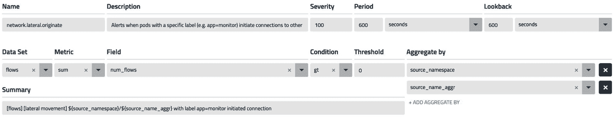
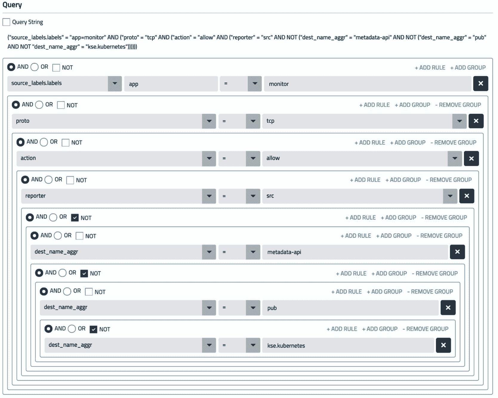
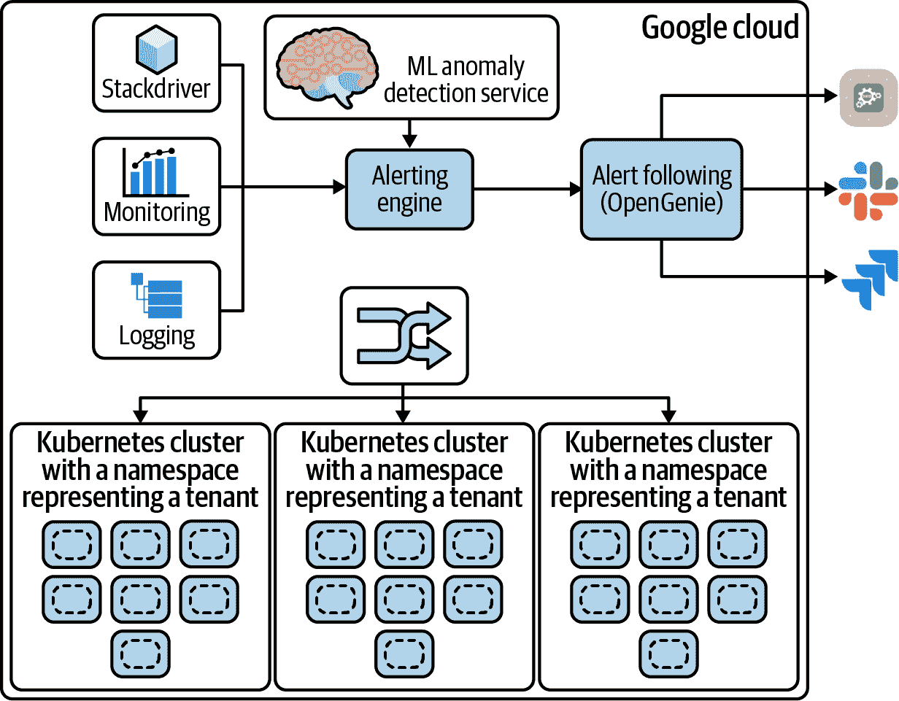
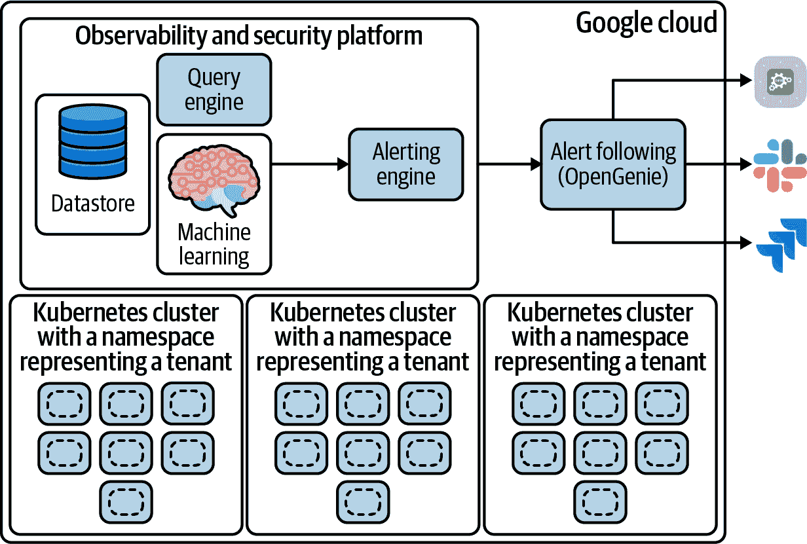
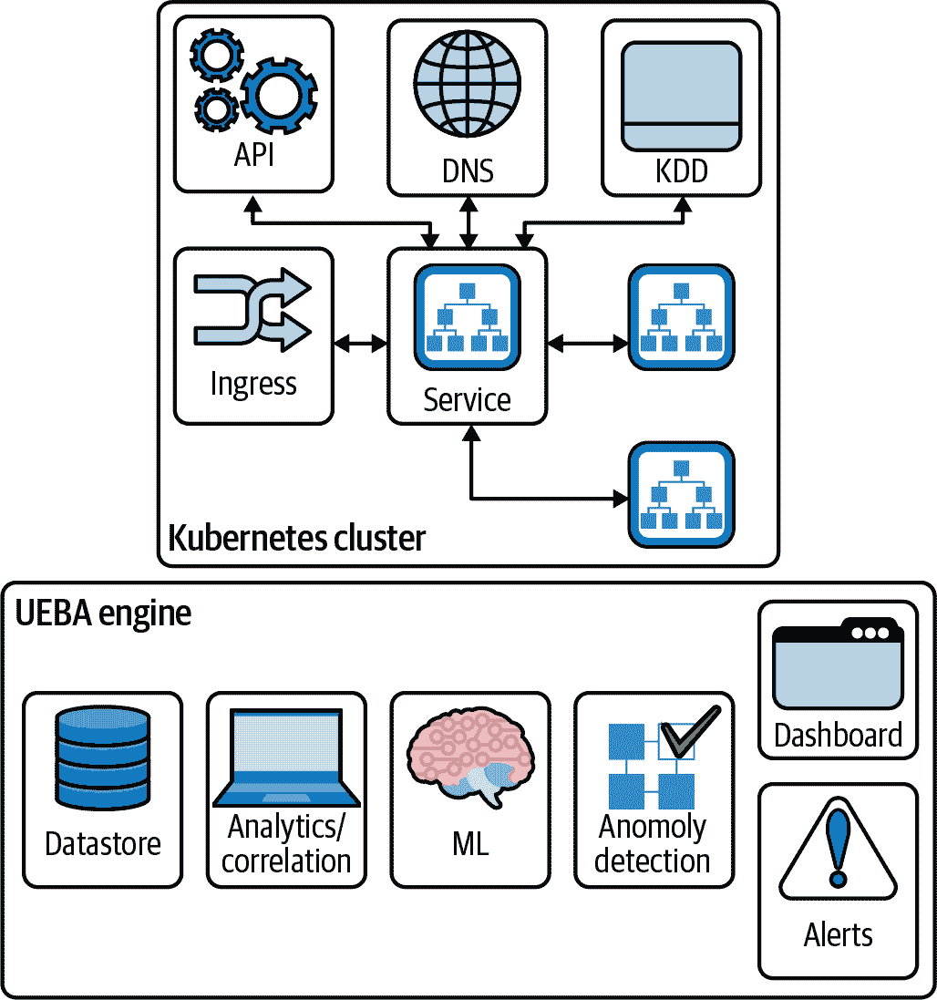

# 第六章：观测性和安全性

本章将解释一个观测性平台如何帮助提升您的 Kubernetes 集群的安全性。我们将涵盖以下主题：

警报

在第五章中，我们介绍了实施日志收集的最佳实践。本章将重点讨论如何构建一个能够生成高保真警报的系统。我们还将讨论使用机器学习进行异常检测。

安全运营中心

我们将审查一个安全运营中心（SOC）的参考实现，以及观测性如何帮助您为 Kubernetes 集群构建 SOC。

行为分析

我们将介绍用户与实体行为分析（UEBA）的概念，以及如何在您的 Kubernetes 集群中实施它。

# 警报

在前一章中，我们讨论了如何为您的 Kubernetes 集群实施日志记录。一个有效的警报系统必须包括以下内容：

+   系统应能够自动在各种日志数据源（例如 Kubernetes 活动日志、网络日志、应用程序日志、DNS 日志等）上运行查询。

+   系统必须能够支持一个状态机，用于在指定持续时间内生成特定数目的阈值违规事件。系统还必须支持设置查询的时间段（称为*回溯*）。我们将在下一节中介绍一个示例。

+   系统必须能够向外部安全、信息和事件管理（SIEM）导出可操作的警报，以便它们成为企业中的事件响应过程的一部分。

主要的云服务提供商提供的警报系统可以帮助您在云服务提供商环境中定义基于日志的警报。Google Cloud 提供了关于其警报能力的[学习资源](https://oreil.ly/DyLh3)。Amazon Web Services（AWS）也有类似的警报能力。这些警报可以在云提供商的日志系统中收集的日志上定义规则，以基于阈值触发警报。例如，在给定时间段内 API 调用的数量可能表明可能存在拒绝服务（DoS）攻击。虽然这些系统适用于一般的日志记录和警报，但是对于 Kubernetes 的日志收集系统来说，像我们在第五章中讨论的那种本地化系统是必要的，以便在 Kubernetes 集群中检测基于安全性的事件，因为它在收集时相关数据，并且可以轻松地在一个日志源上定义警报。此外，一个适用于 Kubernetes 的警报系统将帮助您使用 Kubernetes 构建如部署、标签等的构造定义警报，因为它可以增强正确的上下文与查询网络活动服务的服务和 IP 的标签集。

图 6-1 和 6-2 展示了如何定义警报来检测您的 Kubernetes 集群中的横向移动的示例。

###### 图 6-1\. 配置警报操作

图 6-1 显示了如何配置警报的操作及元数据，如名称、描述、严重程度和时间段，以轮询数据和回溯期限。回溯期限指系统在查询数据时查看的时间跨度。您还可以定义在触发警报之前发生阈值违规的次数阈值。此外，能够配置输出格式也非常重要；在本例中，当报告警报时，数据将按流量来源（命名空间和部署）进行聚合。输出的警报数据有助于下游系统（例如 SIEM）管理警报。

###### 图 6-2\. 警报查询配置

图 6-2 展示了一个警报查询配置的示例。在查询中需要注意的是能够使用 Kubernetes 元数据（例如标签）与网络流活动（例如目的地、协议）和策略判断（例如操作）进行单一查询。这使您能够在定义有效的 Kubernetes 集群警报时具有极大的灵活性。请注意，这是如何考虑构建有效警报系统的代表性示例。除了云提供商的警报系统之外，还有多种其他工具如 Datadog、Sysdig 和 Calico Enterprise 提供了基于 Kubernetes 的警报系统。

我们之前介绍的警报系统非常擅长在系统具有可预测行为并且您可以轻松定义系统正常活动阈值时检测和报告警报。如果警报系统能够“学习”系统的行为并能够动态定义阈值，那将是非常有用的；这将有助于生成高保真度的警报，并减少由于阈值未随系统状态变化而产生的误报。让我们探讨一下机器学习如何解决这个问题。

## 机器学习

机器学习的基础知识及其工作原理超出了本书的范围。在本节中，我们将回顾一些机器学习的概念，这些概念将向我们展示它如何帮助学习给定指标的行为，并在偏离预期行为时发出警报。在我们进行这些回顾之前，让我们来看看机器学习中的高级技术：

监督学习

这是一种通过一段时间内标记测试数据来训练系统的技术。它允许系统利用所学来对新数据进行分类并预测结果。

无监督学习

这是一种使用算法来检测和分类未标记数据中模式的技术。请注意，有许多资源可以理解这些概念；其中一个例子是朱利安娜·德卢亚的[“监督学习与无监督学习的区别是什么？”](https://oreil.ly/9aBfa)。考虑到 Kubernetes 集群中实体（例如 pod）的短暂性，以及我们检测来自该活动产生的数据中的异常的目标，我们建议使用无监督学习技术来检测异常。

基线设定

基线设定是一种在机器学习中用来连续预测给定度量标准（例如每秒连接数）的值并检测偏离的技术。[CMU ML 的博客文章“3–Baselines”](https://oreil.ly/zpeNO)是理解基线设定如何工作以及可以使用基线设定构建哪些类型模型的好资源。正如博客中提到的，可以创建简单但非常有效的模型，以达到人类水平的性能。这正是我们在警报系统中想要的：系统应该自动定义阈值，并在偏离基线时发出警报。

现在我们了解了应该使用的高级技术之后，让我们看一些例子，这些例子可以帮助实现对 Kubernetes 集群的可观察性和安全性。在像 Kubernetes 这样的动态环境中，工作负载是短暂的，可以在不同节点上重新启动/调度，因此在大多数情况下，使用基于规则的引擎来检测异常是不切实际的。需要的是将异常检测引擎层叠在机器学习引擎之上，该引擎报告给定度量标准的基线偏离。

## 机器学习工作的例子

如何创建机器学习模型超出了本书的范围；您应该让数据科学团队为您的部署构建模型。像谷歌云这样的主要云服务提供商为 Kubernetes 工作负载提供了一个[构建机器学习模型的服务](https://oreil.ly/0JxKq)，可以帮助数据科学团队实现合适的 ML 模型。以下是在您的集群中检测异常事件的一些有效的 ML 工作负载的示例：

IP 扫描检测

该工作负责查找您集群中向多个目标发送数据包的 pod。这可能表明攻击者已经控制了一个 pod，并正在收集有关其它可达目标的情报。该工作将 pod 与其复制集中的其他 pod，以及集群中的其他 pod 进行比较。

端口扫描检测

该工作负责查找您集群中向一个目标发送数据包的 pod。这可能表明攻击者已经控制了一个 pod，并正在收集有关其它可达目标的情报。该工作将 pod 与其复制集中的其他 pod，以及集群中的其他 pod 进行比较。

服务字节异常

该工作查找接收/发送异常高数据量的服务。这可能表明拒绝服务攻击、数据外泄或其他攻击。该工作查找相对于其副本集不寻常的服务，以及相对于集群其他部分不寻常的副本集。

进程重启异常

该工作查找具有过多进程重启的 Pod。这可能表明进程存在问题，如资源问题或攻击。该工作查找相对于其进程重启行为不寻常的 Pod。

DNS 延迟异常

该工作查找具有过高 DNS 请求延迟的客户端。这可能表明拒绝服务攻击。

L7 延迟异常

该工作查找具有过高 L7 请求延迟的 Pod。所有 HTTP 请求在此测量。此异常可能表明拒绝服务攻击或其他攻击。

HTTP 连接峰值异常

该工作查找接收过多 HTTP 入站连接的服务。这种异常可能表明拒绝服务攻击。

此列表提供了检测异常的作业示例。您可以使用[Google Cloud 提供的此资源](https://oreil.ly/1FaTm)为您的 Kubernetes 集群构建机器学习作业。请注意，每个作业的描述依赖于一组与 Kubernetes 原生相关的上下文丰富的日志（例如，比较副本集中的 Pod 与其他 Pod，使用发送到/从服务的字节）。

现在我们已经讨论了如何构建有效的警报系统来检测和报告异常，让我们看一个基于 Kubernetes 集群的安全运营中心的示例实现。

# 安全运营中心

在本节中，我们将审查基于 Kubernetes 的 SaaS 服务的安全运营中心（SOC）的参考实现。SOC 用于检测和响应安全事件；我们将探讨在实施 SOC 时如何利用可观察性。请注意，这是一个示例，应用于指导您的实施。在生产中实施时，您应该使用这些概念，但需要设计和实施适合您用例的 SOC。图 6-3 展示了 Google Cloud 中托管的服务的 SOC 实现示例。

###### 图 6-3\. Google Cloud 中的 SOC 示例实现

图 6-3 显示了一组运行在 Google Cloud 中的 Kubernetes 集群，每个租户都有一个命名空间表示。每个租户集群可以部署在 Google Kubernetes Engine (GKE) 中，也可以作为 Google Cloud 中的上游 Kubernetes 集群。有一个入口表示外部实体如何访问服务。图中省略了工作负载部署和供应的详细信息，因为我们想重点关注如何确保服务的安全性。为了确保服务的安全性，您需要日志记录、监视和警报。这可以通过使用 [Google Cloud 运营套件](https://oreil.ly/9rTas) 实现，该套件提供支持日志记录、监视和警报的能力。如果您正在使用 GKE，[Google Cloud 的博客](https://oreil.ly/QCGa0) 描述了如何利用这些服务来检测和管理 Kubernetes 集群的警报。如前所述，您需要利用机器学习进行基线制定，并提高警报的质量。Google 提供了一组称为 [AI Hub](https://oreil.ly/ICHTe) 的机器学习服务。请注意，您仍然需要构建与您的 SaaS 服务相关且有效的机器学习模型（请参阅本章前面的示例 ML 作业）。然后，您可以使用众所周知的工具，如 [OpsGenie](https://oreil.ly/gNSbr)，将警报路由到 SIEM、Slack、PagerDuty、JIRA 和其他工具进行警报管理。这些警报将触发由安全团队定义的修复工作流。请注意，我们以 Google Cloud 为例，但您可以使用前面提到的方法为 AWS 和 Azure 构建 SOC。这些云提供商也为用户提供了类似的一组服务。

如前所述的方法在您仅使用一个云提供商并且没有任何工作负载在本地或其他云提供商环境中时非常有效。此外，前面提到的所有服务都会增加部署成本，您还需要委派部分 DevOps/DevSecOps 资源来实施和管理这些服务。因此，我们建议您使用一种不特定于任何云提供商且可以跨云提供商/本地环境使用的工具来构建您的 SOC。

图 6-4 显示了如何替换一些特定于云提供商的组件，并使用基于 Kubernetes 的可观测性和安全平台创建 SOC。您可以自行构建这个平台，也可以选择使用产品，例如 Datadog、VMware 和 Calico Enterprise 提供的平台。选择产品时，请记住前一节涵盖的警报概念，并确保平台支持与您的修复/管理系统的集成。

现在我们已经回顾了如何构建一个对您的 Kubernetes 集群有效的 SOC，让我们再来看看如何将可观测性应用于保护您的 Kubernetes 集群。

###### 图 6-4\. 使用 Kubernetes 原生平台的 SOC

# 用户和实体行为分析

用户和实体行为分析（UEBA）是一个领域，在此领域中，您使用基于 ML 和 AI 的技术来分析用户或实体（如 pod、服务或部署）随时间的行为，并通过用户/实体的异常行为检测来检测异常行为。Microsoft Azure 作为其云平台的一部分提供 UEBA。Microsoft Azure 的博客文章，《在 Azure Sentinel 中使用用户和实体行为分析（UEBA）识别高级威胁》（https://oreil.ly/FDspV）是一篇优秀的资源，描述了如何在安全用例中使用 UEBA。请注意，实体的异常行为并不总是可疑行为；您需要将行为映射到如 MITRE 攻击框架或其他妥协指标的框架，以确认它是一个安全问题。

让我们举一个简单的例子，说明如何在 Kubernetes 中为实体（如服务）实施 UEBA。

图 6-5 展示了你的 Kubernetes 集群中的一个服务以及我们在分析服务行为时将考虑的各种交互。作为其正常操作的一部分，该服务将与 Kubernetes API 服务器和 Kubernetes 数据存储交互。此外，它将与入口资源交互，以与集群外的实体通信，并使用集群网络与集群内的其他实体交互。该服务还将使用集群中的 DNS 服务进行操作。

###### 图 6-5\. Kubernetes 服务行为分析

为了为服务建立一个档案，我们需要考虑服务的以下方面。这些在机器学习中被称为特征。

+   服务组成（如 pod 的端点数、RBAC、策略）

+   对服务的文件系统活动、进程信息和系统调用活动

+   与服务相关联的服务账户

+   服务的生命周期操作（例如创建、删除、缩放）

+   向服务的流量（网络、应用程序）和从服务的流量

+   服务中 pod 的 DNS 活动

图 6-5 中显示的 UEBA 引擎将从各种数据源（网络流日志、应用程序流日志、Kubernetes 审计日志、DNS 活动日志、进程信息、文件系统、系统调用活动日志）收集日志，并将它们存储在数据存储中。这些日志由分析引擎聚合和关联，以生成服务在各种特征上的关联日志。

机器学习引擎使用复杂模型来基线服务在各种特征上的行为。这是机器学习中的一个高级概念，其中模型考虑每个特征及其相互作用等因素来构建服务的配置文件。这最好由您的数据科学团队实施。然后，此配置文件用于预测异常并生成偏离的警报。有一个仪表板允许 SOC 操作员审查分析数据并用于取证或威胁狩猎。请注意，使用第五章描述的概念构建的安全和可观察性平台将有助于构建有效的 UEBA 系统。

UEBA 是一种高级技术，实施起来复杂，但却是快速查找集群中潜在脆弱实体的非常有效方式。这使得 SOC 运营非常高效和可扩展。一旦您的部署扩展到多个集群（50+），使用警报/仪表板手动审查以查找实际问题就不再实际。UEBA 将警告您有异常且需要立即关注的实体。

# 结论

当您考虑如何利用可观察性来帮助保护您的集群时，请考虑以下几点：

+   您使用的警报系统必须是基于 Kubernetes 的，并且必须支持使用机器学习进行基线设置，以便您无需手动定义各种特征的阈值。

+   建议您考虑选择一个基于 Kubernetes 的平台，可以跨云和本地部署，以建立您的 SOC。

+   UEBA 是一个高级概念，实施起来复杂，但在保护 Kubernetes 集群方面非常有效。
