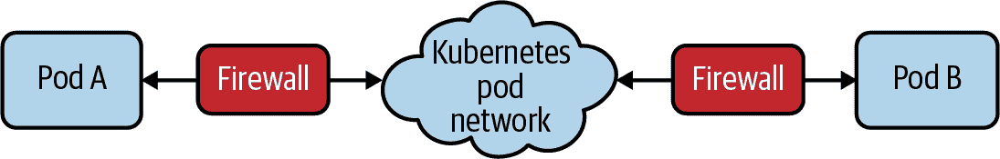
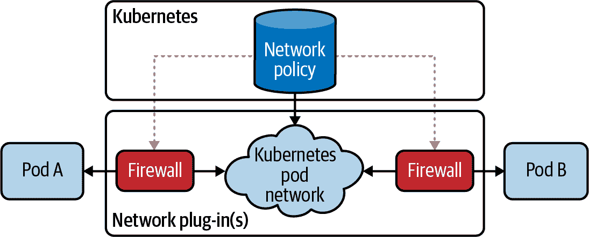
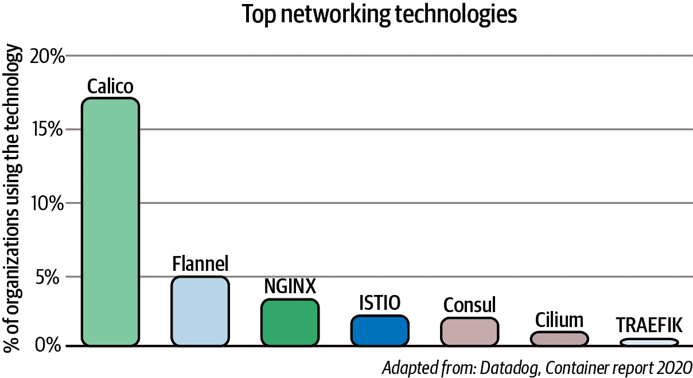

# 第七章：网络策略

在本章中，我们将描述网络策略并讨论其在保护 Kubernetes 集群中的重要性。我们将回顾各种网络策略的实现和支持网络策略实施的工具。我们还将介绍带有示例的网络策略最佳实践。

# 什么是网络策略？

网络策略是保护 Kubernetes 网络的主要工具。它允许您轻松地限制集群中的网络流量，使只有您希望流动的流量被允许。

要理解网络策略的重要性，让我们简要探讨一下在引入网络策略之前如何典型地实现网络安全。在企业网络的历史上，网络安全是通过设计网络设备（交换机、路由器、防火墙）的物理拓扑及其相关配置来实现的。物理拓扑定义了网络的安全边界。在虚拟化的第一阶段中，云中同样对网络和网络设备构造进行了虚拟化，并使用相同的技术来创建（虚拟）网络设备的特定网络拓扑，以提供网络安全。添加新的应用程序或服务通常需要更新网络拓扑和网络设备配置，以提供所需的安全性。

相比之下，Kubernetes 网络模型定义了一个“扁平”的网络，在这种网络中，默认情况下，每个 Pod 可以直接与集群中的所有其他 Pod 进行通信。这种方法极大地简化了网络设计，并允许新的工作负载在集群中的任何位置动态调度，而无需依赖于网络设计。

在这种模型中，与其通过网络拓扑边界来定义网络安全，不如使用独立于网络拓扑的网络策略来定义。网络策略进一步通过使用标签选择器作为其主要机制来定义哪些工作负载可以与哪些工作负载通信，而不是使用 IP 地址或 IP 地址范围。

可以将网络策略执行视为每个 Pod 都受其自身的专用虚拟防火墙保护，并根据已定义的网络策略自动编程和实时更新。图 7-1 展示了在 Pod 上使用其专用虚拟防火墙进行网络策略执行的情况。



###### 图 7-1\. 由虚拟防火墙保护的 Pod

# 为什么网络策略很重要？

在攻击者变得越来越复杂的时代，作为防线的网络安全比以往任何时候都更为重要。

虽然您可以（而且应该）使用防火墙来限制网络的边界流量（通常称为南北流量），但由于 Pod 调度的动态性和 Pod IP 地址，它们通常只能以集群整体的粒度进行 Kubernetes 流量的管控，而不能针对特定的 Pod 组进行细粒度管控。此外，一旦攻击者在边界内部获得小小的立足点，他们的大多数目标是横向移动（东西流量）以获取对更高价值目标的访问权限，而基于边界的防火墙无法对其进行管控。随着应用架构从单块到微服务的演变，东西流量的数量和因此横向移动的攻击面仍在继续增长。

另一方面，网络策略设计用于 Kubernetes 的动态特性，遵循标准的 Kubernetes 范式，使用标签选择器来定义 Pod 组，而不是 IP 地址。由于网络策略在集群内部执行，它可以保护南北和东西流量。

网络策略代表了网络安全的重要进步，不仅因为它处理了现代微服务的动态特性，而且因为它使开发和 DevOps 工程师能够轻松地自定义网络安全，而无需学习低级网络细节。网络策略使得定义意图变得容易，例如*只有这个微服务能连接到数据库*，将该意图编写为代码（通常是 *.yaml* 文件），并将网络策略的编写集成到 Git 工作流程和 CI/CD 过程中。

# 网络策略实现

Kubernetes 定义了一个标准的网络策略 API，因此您可以在任何集群上期望一组基本特性。但 Kubernetes 本身除了存储外不对网络策略进行任何操作。网络策略的执行委托给了网络插件，允许一系列实现。大多数网络插件支持 Kubernetes 网络策略的主要元素，尽管许多插件并未实现规范的每个功能。值得注意的是，大多数实现与网络插件特定的 Pod 网络实现耦合。然而，某些网络策略实现可以在多种不同的 Pod 网络插件上强制执行网络策略。图 7-2 显示存储在 Kubernetes 数据存储中的网络策略，由网络插件用于执行。



###### 图 7-2\. 由网络插件实施的存储在 Kubernetes 中的网络策略

有多种网络和网络策略实现可供选择，如图 7-3 所示。



###### 图 7-3\. 顶级网络技术实现的采纳情况

无论您选择哪种网络策略实现，我们建议出于以下原因选择其中一种：

+   它实现了完整的 Kubernetes 网络策略规范。

+   除了支持 Kubernetes 网络策略规范外，其自身的策略模型还提供额外的功能，可以与 Kubernetes 网络策略一起使用，支持额外的企业安全用例。

+   一些网络插件，如 Weave Net、Kube-router 和 Calico，可以在其自身丰富的网络功能集之上强制执行网络策略，也可以在包括亚马逊的弹性 Kubernetes 服务（EKS）、Azure Kubernetes 服务（AKS）和谷歌 Kubernetes 引擎（GKE）在内的几个其他网络选项上强制执行。这使它们成为多云策略的特别强大选择，因为它使您可以从广泛的选项中选择最适合您环境的网络，并在所有环境中使用相同丰富的网络策略功能。

+   网络策略可以应用于主机端点/接口，允许使用相同的灵活策略模型来保护 Kubernetes 节点或非集群主机/虚拟机。

+   它支持在网络/基础设施层以及上层（包括支持 L5-L7 匹配标准的策略规则，如 HTTP 方法和路径）强制执行的网络策略。多个执行点有助于保护您的基础设施免受受损工作负载的影响，并保护您的工作负载免受受损基础设施的影响。它还避免了需要在应用和基础设施层分别进行安全配置的需要，或者需要学习每一层不同的策略模型。

+   它需要是生产级的，这意味着它必须在任何大小的集群中表现出色，从单节点集群到数千节点集群。

+   它提供企业增加新功能的能力，并作为企业级 Kubernetes 网络安全解决方案的基础组件。

# 网络策略最佳实践

在本节中，我们将探讨如何使用示例实现网络策略，并涵盖实施的最佳实践。以下示例使用 Calico 网络策略模式，该模式扩展了 Kubernetes 网络策略模式。我们之所以选择这些示例，是因为我们熟悉 Calico 网络策略，但这些最佳实践也可以与其他可用的网络策略模型一起实现。

## 入口和出口

当人们考虑网络安全时，第一个想法往往是如何保护工作负载免受南北向的外部攻击者的侵害。为了帮助防御此类攻击，您可以使用网络策略来限制可以从集群外部访问的任何 Pod 的入口流量。

然而，当攻击者成功找到漏洞时，他们通常会使用受损的工作负载作为横向移动的起点，探测您网络的其余部分，以利用额外的漏洞来访问更有价值的资源或提升权限以发动更强大的攻击或窃取敏感数据。

即使您在集群中的所有 Pod 上设置了限制入口流量的网络策略，横向移动可能会针对集群外保护较弱的资产。因此，最佳实践是始终为集群中的每个 Pod 定义入口和出口网络策略规则。

尽管这并不能保证攻击者无法找到额外的漏洞，但它确实大大减少了可用的攻击面，使攻击者的工作变得更加困难。此外，如果结合适当的策略违规警报，可以大大缩短确定工作负载已受损的时间。以 2020 年 IBM 数据泄露成本报告为例，IBM 报告企业平均需要 207 天才能发现一次数据泄露，然后需要额外的 73 天来进行控制！通过正确编写的网络策略和违规警报，可以防止或大大减少泄露，潜在地将其减少到几分钟甚至几秒钟，并且甚至可以自动响应以隔离可疑工作负载。

## 不仅仅是使命关键的工作负载

最佳实践已建议确保每个 Pod 都具有限制其入口和出口流量的网络策略。这意味着当您考虑如何保护使命关键的工作负载时，您确实需要保护所有工作负载。如果不这样做，那么一些看似不重要、无害的工作负载最终可能成为攻击您网络其余部分的基础，最终导致最关键工作负载的失败。

## 策略和标签模式

Kubernetes 标签和网络策略的一个优势是您可以以多种方式灵活使用它们。然而，结果是通常存在多种标记和编写策略的方式可以实现相同的特定目标。因此，另一个最佳实践是考虑使用一致的模式或设计模式标准化标记 Pod 和编写网络策略的方式。这可以使编写和理解每个网络策略的意图变得更加简单明了，特别是如果您的集群托管大量微服务时。

例如，您可以指定每个 Pod 都将具有标识其所属微服务的“app”标签，并且每个 Pod 将使用该 app 标签应用单一网络策略，该策略使用该 app 标签定义与其预期交互的微服务的入口和出口规则：

```
apiVersion: projectcalico.org/v3
kind: NetworkPolicy
metadata:
  name: back-end-policy
  namespace: production
spec:
  selector: app == 'back-end'
  ingress:
  - action: Allow
    protocol: TCP
    source:
      selector: app == 'front-end'
    destination:
      ports:
        - 80
  egress:
  - action: Allow
    protocol: TCP
    destination:
      selector: app == 'database'
      ports:
        - 80
```

或者，您可以决定在策略规则中使用权限样式标签，而不是在其入口规则中列出允许访问每个服务的微服务。

```
apiVersion: projectcalico.org/v3
kind: NetworkPolicy
metadata:
  name: database-policy
  namespace: production
spec:
  selector: app == 'database'
  ingress:
  - action: Allow
    protocol: TCP
    source:
      selector: database-client == 'true'
    destination:
      ports:
        - 80
  egress:
  - action: Deny
```

这可以使得单独的微服务团队能够编写自己的网络策略，而无需知道必须消费该服务的其他微服务的完整列表。

还有很多其他方法可以解决这个问题，这里没有对错之分。但是，在前期定义如何标记和定义网络策略的方法会使得长期来看生活变得更加轻松。

如果不确定哪种方法最适合您，那么“应用程序”方法是一个很好的起点。稍后总是可以扩展为包括为那些具有大量客户端的微服务定义权限样式标签的想法，如果维护策略规则变得耗时。

## 默认拒绝和默认应用策略

Kubernetes 网络策略规范允许所有入口 Pod 流量通过，除非存在一个或多个适用于该 Pod 的入口规则的网络策略，然后只有策略明确允许的入口流量才被允许。出口 Pod 流量同理。因此，如果忘记为新的微服务编写网络策略，它将保持不安全状态。如果忘记为该微服务编写入口和出口规则，那么它将部分保持不安全状态。

鉴于此，一个良好的做法是制定一个“默认拒绝策略”，防止未经其他网络策略明确允许的任何流量。通常的做法是制定一个适用于所有 Pod 的策略，包括入口和出口规则，但本身不明确允许任何流量。因此，如果没有其他明确允许流量的网络策略适用，那么流量将被拒绝：

```
apiVersion: networking.k8s.io/v1
kind: NetworkPolicy
metadata:
  name: default-deny
  Namespace: my-namespace
spec:
  podSelector: {}
  policyTypes:
  - Ingress
  - Egress
```

由于 Kubernetes 网络策略是有命名空间的，前面提到的网络策略需要为每个命名空间重复，并且最好纳入集群中新命名空间配置的标准操作流程中。另外，一些网络策略实现超越了 Kubernetes 网络策略，提供了指定整个集群范围网络策略的能力（不限于单一命名空间）。下面的示例展示了如何创建一个策略，将整个集群切换到默认拒绝行为，包括将来创建的任何命名空间：

```
apiVersion: projectcalico.org/v3
kind: GlobalNetworkPolicy
metadata:
  name: default-deny
spec:
  selector: all()
  types:
  - Ingress
  - Egress
```

然而，值得注意的是，这个策略适用于所有 Pod，而不仅仅是应用 Pod，包括 Kubernetes 的控制平面 Pod。如果在创建此类策略之前没有正确的网络策略或配置故障安全端口，可能会导致集群出现严重问题。

一个风险较低的最佳实践是定义一个仅适用于 Pod 的网络策略，排除控制平面 Pod。除了触发默认拒绝行为外，此策略还可以包括您希望应用于所有应用 Pod 的任何规则。例如，您可以包括一个允许所有应用 Pod 访问 kube-DNS 的规则。这有助于简化需要编写的每个微服务策略，使其能够专注于所需的每个微服务特定行为：

```
apiVersion: projectcalico.org/v3
kind: GlobalNetworkPolicy
metadata:
  name: default-app-policy
spec:
  namespaceSelector: has(projectcalico.org/name) &&
projectcalico.org/name not in {"kube-system", "calico-system"}
  types:
  - Ingress
  - Egress
  egress:
    - action: Allow
      protocol: UDP
      destination:
        selector: k8s-app == "kube-dns"
        ports:
        - 53
```

由于此策略故意排除控制平面组件，为了保护控制平面，您可以为每个控制平面组件编写特定的策略。最好在集群创建时进行此类策略创建，而不是在集群托管工作负载之前，因为策略出错可能会使您的集群处于破损状态，可能导致重大的生产中断。此外，强烈建议在开始尝试为控制平面创建任何策略之前，始终确保已设置了您使用的网络插件的正确故障转移端口。

# 策略工具化

在这一节中，我们将探讨可用于有效向您的 Kubernetes 集群添加网络策略的工具。

## 开发过程和微服务的好处

与传统网络安全控制相比，网络策略的一个优点是定义网络策略不需要网络或防火墙专业知识。网络策略使用与其他 Kubernetes 资源相同的概念和范式。理论上，任何熟悉在 Kubernetes 中部署微服务的团队都可以轻松掌握网络策略。因此，网络策略代表了采用向左转移（shift-left）哲学的机会，其中网络安全在开发周期的早期定义，而不是在过程的后期定义。这是安全和开发团队合作以保护您的 Kubernetes 集群的绝佳机会。

与此同时，许多组织正在从单体应用架构转向微服务架构，其中一个目标通常是增加开发和组织的灵活性。在这种方法中，每个微服务通常由一个开发团队维护，该团队对微服务有显著的专业知识，但不一定了解微服务所属应用的整体。微服务的转移与网络策略的向左转移机会互补。负责开发微服务的团队通常很了解其消耗和依赖的其他微服务。他们可能也很了解哪些微服务消耗他们的微服务。

当与明确定义的、标准化的政策和标签模式方法结合时，这使他们在实施微服务网络策略时处于一个强势位置，作为微服务开发过程的一部分。在这种模型中，网络策略被视为内嵌并在开发过程中进行测试的代码，就像微服务代码的任何其他关键部分一样。

同样有效的方法是让开发团队专注于他们负责的微服务的内部，并将微服务的操作责任留给 DevOps 团队。然而，相同的理念仍然适用。这样的 DevOps 团队通常需要深入了解他们负责操作的微服务之间的依赖关系，以管理应用程序的运行和微服务的生命周期。网络安全可以由 DevOps 团队定义为代码，并在使用之前像他们开发的其他操作代码或脚本一样进行测试。

当然，今天的现实是，许多组织在实现微服务、敏捷和左移安全的天堂方面还有很长的路要走。网络安全可能在组织的流程中来得更晚，甚至作为已经投入生产的系统的事后想法。在这种情况下，定义网络策略可能会更具挑战性，错误的网络策略可能会对生产造成重大影响。好消息是，有一系列工具可帮助管理网络策略的生命周期，使这一过程更容易，包括政策推荐、政策影响预览和政策暂存/审核模式。

## 政策建议

政策推荐工具在那些负责网络安全的团队对他们需要保护的应用程序或微服务之间所有网络依赖关系没有很好、自信理解的情况下提供了极大的帮助。这些工具还帮助您正确开始编写网络策略，并使网络策略的创建比手工编写容易得多。

推荐工具通常的工作方式是分析每个微服务在一段时间内与其他微服务之间的网络流量。这意味着要获得推荐，微服务需要在生产中运行，或者在能够准确反映微服务与应用程序其余部分之间生产交互的暂存或测试环境中运行。

有许多可供选择的政策推荐工具，通常具有不同程度的复杂性、对 Kubernetes 的认识程度和政策模式方法。建议您使用集成到您的网络策略解决方案中的 Kubernetes 感知政策推荐引擎。

## 政策影响预览

政策影响预览工具在应用到集群之前提供了一种检查网络策略的方法。类似政策建议，通常通过分析一段时间内集群的历史网络流量来完成，计算新策略可能会影响哪些网络流。例如，识别以前允许但现在会被拒绝的流量，以及以前被拒绝但现在会被允许的流量。

政策影响预览在任何情况下都是极大的帮助，特别是在你并非完全依赖政策建议的场景下。例如，当你手动定义网络策略或者修改政策建议以与特定的政策和标签模式标准一致时，这将非常有用。即使团队对微服务的网络策略定义有很高的信心，了解微服务的网络依赖，政策影响预览也是无价的，它有助于捕捉任何意外错误，例如难以发现的拼写错误，这些错误可能会显著影响合法的网络流量。

政策影响预览工具比政策建议更少见。使用提供基于分析所收集的流日志数据的影响可视化表示的工具非常有用，无论在任何所需的时间段内。这将有助于减少由于不正确撰写的政策或由于操作员错误而导致的停机问题。

## 政策分阶段和审计模式

甚至比政策影响预览更少见但可能更有价值的是支持政策分阶段，有时称为政策审计模式。

政策分阶段允许应用于集群的网络策略变更，而不会影响网络流量。然后，分阶段的策略会记录其将与之交互的所有流的详细信息，而实际上不会影响任何流。在需要对个别政策进行历史数据的政策影响预览可能过于简单化的应用程序运行复杂性的情况下，这非常有用。例如，如果需要同时更新多个相互依赖的策略，或者希望使用实时而非历史网络流来监视策略影响。

为了使撰写有效网络策略的任务不再艰巨，你需要使用政策建议，然后将策略分阶段以了解其影响，然后再将其推广以供执行。这种基于历史网络流量的政策建议循环，随后是分阶段（将策略应用于当前和未来的网络流），然后进行所需的调整，最后实施策略，是确保策略变更能够确切达到预期效果的最佳方式。

# 结论

在本章中，我们讨论了网络策略的重要性以及各种网络策略的实施和工具，以帮助您进行实施。以下是网络策略的一些关键方面：

+   网络策略应该用于保护 Kubernetes 网络，并且它与在集群外围实施的防火墙相辅相成。

+   建议选择一个能够识别 Kubernetes 的实现，扩展基本的 Kubernetes 网络策略。

+   有许多网络策略实施提供工具，帮助在 Kubernetes 集群中实施网络策略。
