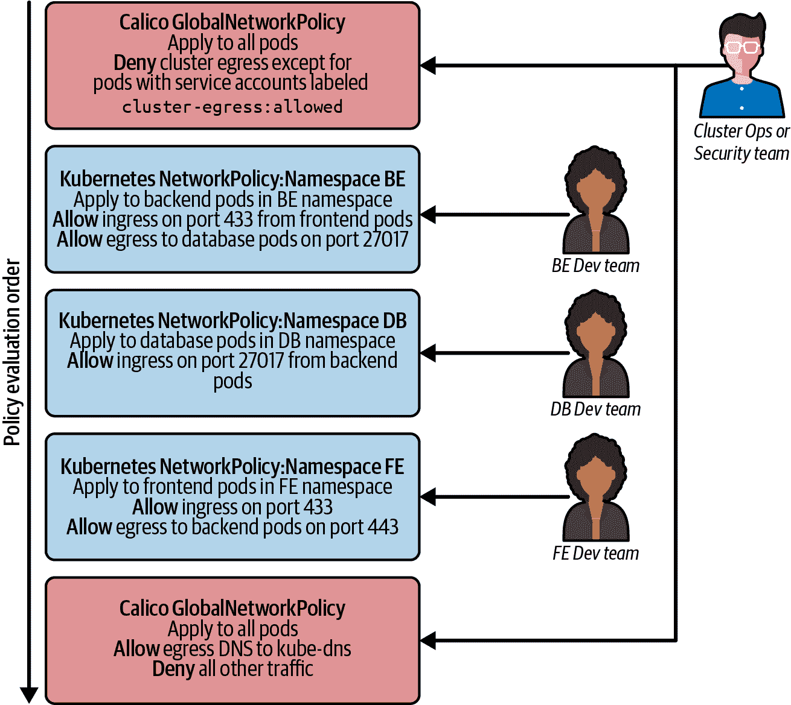
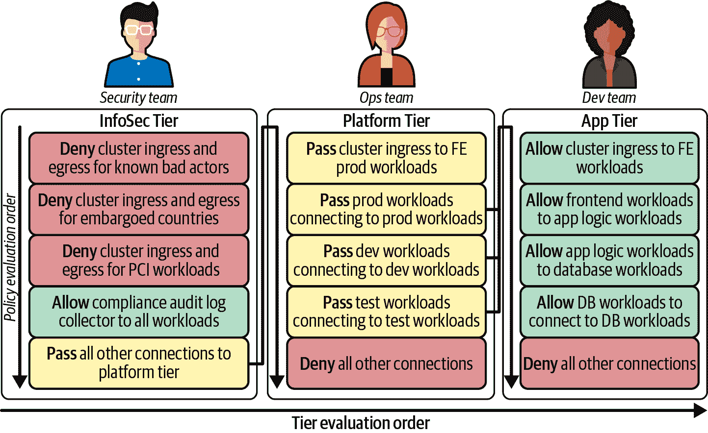

# 第八章：管理团队之间的信任

在前一章中，我们探讨了网络策略如何代表一种采用左移哲学来进行网络安全的机会，即由开发周期早期的团队定义安全，而不是由安全团队在过程晚期定义和维护安全。这种方法可以带来许多好处，但为了可行性，需要在涉及的团队之间建立相应的信任程度和责任划分。

在大多数组织中，将安全责任的 100%向左移动并不现实，其他团队（平台、网络和安全）不会完全摆脱安全责任。例如，尽管可能会将个体微服务安全的较低级别细节的责任向左移动，但安全团队仍可能负责确保您的 Kubernetes 部署具有符合内部和外部合规要求的安全姿态。

一些企业通过定义内部流程来处理这个问题，例如确保安全团队在应用安全更改之前审查所有安全更改。这种方法的缺点是可能会降低敏捷性，这与左移的动机之一相矛盾，即增加敏捷性。

幸运的是，在 Kubernetes 环境中可以设置各种类型的防护栏，从而减少对这些传统流程控制的需求。在本章中，我们将探讨一些这些能力以及它们如何用于控制在安全左移方法背景下从一个团队委托给另一个团队的信任程度。

# 基于角色的访问控制（RBAC）

Kubernetes 基于角色的访问控制（RBAC）是定义个别用户或用户组在 Kubernetes 集群中被允许做什么的主要工具。RBAC 权限是使用角色定义的，并通过角色绑定授予给用户或用户组。每个角色包括一系列资源（按资源类型指定，集群范围内，在命名空间内，甚至是特定的资源实例）以及每个资源的权限（例如，获取、列出、创建、更新、删除等）。

许多 Kubernetes 资源是有命名空间的，包括部署、守护进程集、Pod 和 Kubernetes 网络策略。这使得命名空间成为团队之间理想的信任边界。关于如何使用命名空间没有固定的规则，但一种常见的做法是为每个微服务使用一个命名空间。然后可以使用 RBAC 授予权限，以便团队能够管理对应微服务的命名空间中的资源。

如果安全已经向左移动，这通常包括管理适用于微服务的网络策略的权限，但不包括管理他们不负责的微服务适用的任何网络策略。

如果对入口和出口流量都遵循了默认拒绝式最佳实践，那么团队不能忘记编写网络策略，因为没有网络策略，微服务将无法正常工作。此外，由于其他团队已定义了覆盖其负责的微服务的入口和出口流量的等效网络策略，因此仅当两个团队都指定了允许该流量的网络策略时，两个微服务之间的流量才被允许。这进一步控制了每个团队委托的程度。

当然，根据安全左移的程度，定义网络策略的责任可能由不同的团队承担，而不是负责操作微服务的团队。同样，Kubernetes RBAC 可以用于轻松反映这种责任分担。

## Kubernetes 网络策略的限制

使用 RBAC 与 Kubernetes 网络策略在左移环境中存在一些值得注意的限制：

+   默认拒绝式策略需要在为命名空间提供服务时创建。负责为微服务定义网络策略的团队还可以修改或删除此默认策略。

+   网络策略是基于 IP 的，不能使用完全合格的域名 (FQDN)。这在定义到集群外部资源的策略时可能是一个限制。

+   Kubernetes RBAC 控制资源的访问，但不限制资源的内容。在网络策略的上下文中尤为相关的是 pod 标签，因为它们被用作网络策略规则中识别其他微服务的主要机制。例如，如果一个团队为其微服务编写了一个网络策略，允许来自具有特定标签的 pod 的流量访问它，那么理论上任何有权限管理 pod 的团队都可以将该标签添加到其 pod 中，并获得对该微服务的访问权限。通过始终在策略规则中使用命名空间部门并且有选择地授予哪些团队修改命名空间标签的权限，可以减少这种暴露。

如果已定义了标准化的策略和标签模式，并且团队被信任遵循它们，那么这些限制更多是理论上的问题而不是实际问题。然而，对于某些组织来说，它们可能代表了真正影响其安全需求的问题。这些组织因此可能希望利用超出 Kubernetes RBAC 和 Kubernetes 网络策略之外的额外能力。特别是，他们可能考虑：

+   更丰富的网络策略实现支持额外的网络策略类型、匹配条件和非命名空间网络策略，这些开放了更多的选项来分配责任和 RBAC 给团队。

+   准入控制器可在资源内的每个字段级别强制执行控制，例如确保遵循标准化的网络策略和标签模式，包括限制团队使用特定标签。

我们现在将审查扩展 Kubernetes 网络策略的网络策略实现及如何使用它们来管理信任。

## 更丰富的网络策略实现

一些网络策略实现支持 Kubernetes 网络策略及其自定义网络策略资源，可与或取代 Kubernetes 网络策略使用。根据实现情况，这些可能会为如何分割责任和跨团队使用 RBAC 提供额外选项。有些供应商提供更丰富的网络策略实现，支持 Kubernetes 网络策略并添加更多功能（例如，Weave Net，Kube-router，Antrea，Calico）。我们鼓励您审查这些内容，并选择最符合您需求的最佳选项。在本节中，我们将通过 Calico 来看具体示例，因为它是最广泛部署的容器网络插件。

Calico 支持 Kubernetes 网络策略功能集，以及其自身的 Calico 网络策略资源，可与 Kubernetes 网络策略并存使用。Calico 网络策略有两种类型，均属于 projectcalico.org/v3 API 组：

NetworkPolicy

这些策略是命名空间作用域的（与 Kubernetes 网络策略类似）。

GlobalNetworkPolicy

这些策略适用于整个集群，与命名空间无关。

Calico 网络策略的两种类型均支持超出 Kubernetes 网络策略的共同功能集，包括：

+   比 Kubernetes 网络策略具有更丰富的匹配条件集，例如能够匹配 Kubernetes 服务账户。

+   明确允许、拒绝或记录策略规则中的操作，而不是隐式始终允许的 Kubernetes 网络策略操作。

+   优先顺序排序以定义网络策略对同一工作负载应用时的评估顺序。（请注意，如果仅使用 Kubernetes 网络策略，或者 Calico 策略只包含允许操作，则评估顺序对策略结果没有影响。但是，一旦存在任何带有拒绝操作的策略规则，顺序就变得重要起来。）

我们想提到还有其他扩展 Kubernetes 网络策略的网络策略实现，如 Antrea，提供 ClusterNetworkPolicy（类似于 GlobalNetworkPolicy）。

以下示例展示了如何使用 Kubernetes RBAC 实现网络策略。在示例中，您可以基于分配给服务账号的标签来控制网络访问。在 Kubernetes 中，Pod 与其关联的服务账号相关联，因此可以通过服务账号来识别 Pod。您应使用 RBAC 来控制哪些用户可以为服务账号分配标签。示例中的网络策略使用分配给服务账号的标签来控制网络访问。具有 intern 服务账号的 Pod 只能与标记为`role == intern`的服务账号的 Pod 通信。

```
apiVersion: projectcalico.org/v3
kind: NetworkPolicy
metadata:
  name: restrict-intern-access
  namespace: prod-engineering
spec:
  serviceAccountSelector: 'role == "intern"'
  ingress:
    - action: Allow
      source:
        serviceAccounts:
          selector: 'role == "intern"'
  egress:
    - action: Allow
      destination:
        serviceAccounts:
          selector: 'role == "intern"'
```

通过这种方式，您可以扩展 RBAC 的概念，该概念用于控制服务账号访问 Kubernetes 资源的网络访问。这是一个两步过程。RBAC 用于控制对服务账号的标签分配，而基于标签的服务账号选择器用于控制网络访问。可以利用这些额外的功能与 Kubernetes 网络策略结合使用，更清晰地分离高级集群运维或安全团队与各个微服务团队之间的责任。

例如，可能如下所示：

+   将集群运维或安全团队的 RBAC 权限扩展至管理 Calico 网络策略，以覆盖整个集群范围，使其能够定义设定集群整体安全姿态的基本高级规则。例如，像在第七章讨论的默认拒绝式应用策略和限制集群出口到特定 Pod 的策略。

+   将每个微服务团队授予 RBAC 权限，以在微服务的命名空间中定义 Kubernetes 网络策略，使他们能够为其负责的微服务定义自己的细粒度约束。

在基础的网络策略 RBAC 权限分配之上，集群运维或安全团队可以通过使用命名空间或服务账号标签来定义规则，而不是简化匹配 Pod 标签，为每个微服务团队分配不同的信任级别。例如，他们可以使用服务账号标签来定义限制集群出口到特定 Pod 的策略，并授权各个微服务团队使用但不编辑分配给其命名空间的任何服务账号。通过这种机制，一些微服务团队可能被授予权限选择性地允许其某些 Pod 的集群出口，而其他团队则没有同样的权限。

图 8-1 提供了这些思想如何结合的简化示例。

虽然这些功能相当强大，但在一些组织中，跨团队责任的分割可能更为复杂，特别是在团队层级更多的情况下。例如，合规团队、安全团队、集群运维团队和各个微服务团队可能具有不同层次的责任。为了更轻松地满足这些要求，一种方法是使用支持分层网络策略概念的网络策略实施。



###### 图 8-1\. 展示了使用网络策略实现信任边界的示例

有一些商业实现支持使用策略层级实现分层网络策略。类似的概念（分层命名空间和策略）也在 Kubernetes 社区中讨论。可以为每个层级的 RBAC 定义，以限制谁可以与该层级进行交互。在此模型中，网络策略被分层在多个层级中，按照定义的顺序进行评估，以匹配组织责任分割的需要。可以为每个层级的 RBAC 定义，以限制谁可以与该层级进行交互。每个层级的网络策略可以做出允许或拒绝决策（终止后续策略的评估），或将决策传递给层级结构中的下一个层级，以根据该层级中的策略进行评估。

图 8-2 提供了一个简化的示例，展示了如何使用这些功能来在组织内部的三个不同责任层之间分割责任。



###### 图 8-2\. 使用层级实现分层网络策略

## 准入控制器

我们已经讨论了定义和遵循标准化网络策略和标签模式的价值。早期讨论的团队之间责任分割的方法是围绕资源和命名空间级别的 RBAC，团队在被允许管理的资源和命名空间范围内具有自由度，因此不能保证所有团队都遵循了这些模式。

Kubernetes 本身没有内置能力以在这种粒度级别强制执行限制，但它支持准入控制器 API，允许将第三方准入控制器插入 Kubernetes API 机制，以在创建、更新和删除操作期间执行对象的语义验证。您还可以使用准入控制器，也称为变异准入控制器，用于修改已准入的对象。

例如，在实施网络策略的上下文中，准入控制器可以帮助以下操作：

+   验证网络策略是否具有符合组织试图遵循的最佳实践的入口和出口规则。

+   确保每个 Pod 都具有一组特定的标签，以符合组织定义的标签标准。

+   限制不同组的用户对特定标签值的访问。

但是准入控制器的安全用例不仅限于网络策略。例如，Kubernetes 服务包括支持使用服务的 ExternalIP 字段关联的任意 IP 地址。如果没有一定程度的监管，这是一个非常强大的功能，可能会被具有 RBAC 权限创建和管理 Kubernetes 服务的任何人恶意使用，拦截 Pod 流量并将其重定向到 Kubernetes 服务。根据涉及团队内的信任水平，使用准入控制器对此进行监管可能是必要的。

根据组织的技能组合和具体需求，有几种准入控制器实现选项：

+   如果存在专门满足组织需求的预先存在的第三方准入控制器，则使用它

+   编写一个根据组织需求优化的自定义准入控制器

+   使用具有丰富策略模型的通用准入控制器，可以映射到广泛的用例范围

对于许多场景来说，选择一个通用准入控制器可以在灵活性和编码复杂性之间取得良好的平衡。例如，您可以考虑 Kyverno，它具有专为 Kubernetes 设计的策略引擎，或者围绕 Open Policy Agent 构建的准入控制器，其策略模型使用 Rego 定义灵活的匹配和语言能力。

尽管准入控制器非常强大，但通常建议仅在确实需要时才实施它们。对于某些组织来说，以这种方式使用准入控制器可能过度，考虑到团队之间的责任和信任水平。对于其他组织来说，它们可能是满足内部合规要求的重要工具，并且使用它们的理由非常明确。

# 结论

Kubernetes 安全需要各个团队实施，并需要团队之间的协作。本章涵盖了以下关键概念：

+   您应该使用 RBAC 和网络策略来定义边界，以帮助您管理跨团队的活动。

+   您可以通过利用网络策略中的服务账户来扩展 RBAC 的概念，以控制网络访问，帮助您管理信任。

+   准入控制器有助于控制访问并在各个团队之间实施信任边界。

+   开发、平台和安全团队之间的协作对于实施安全非常重要。
