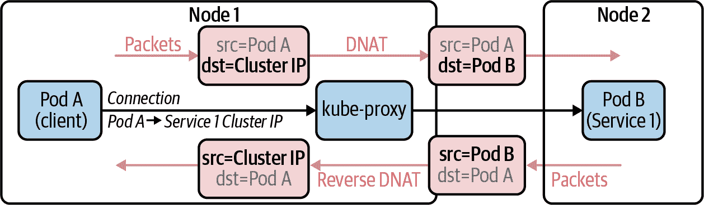
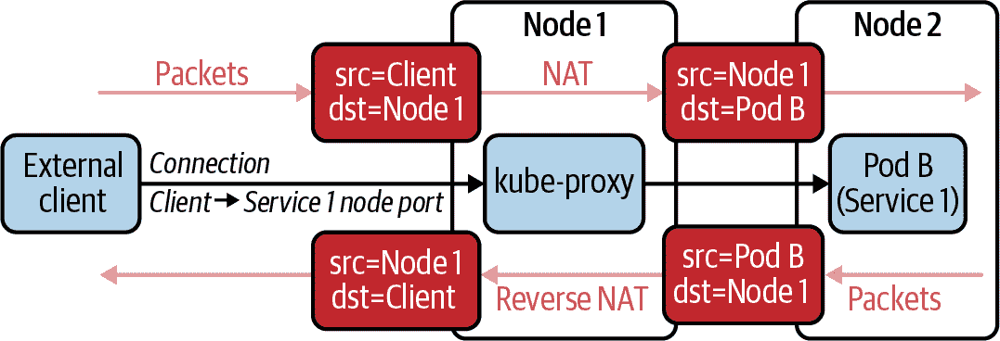
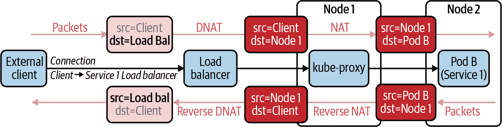
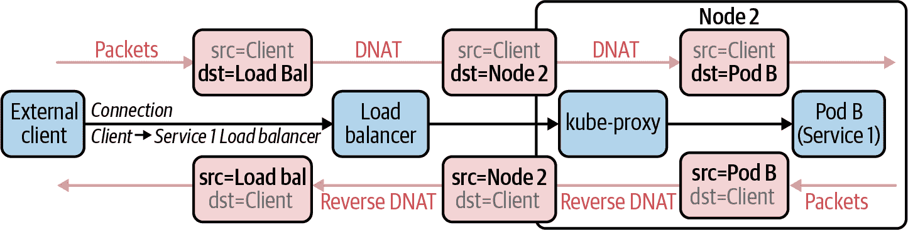
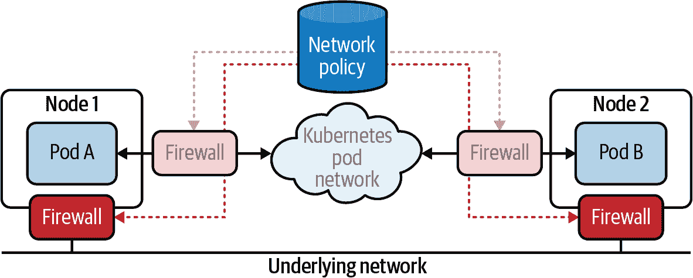
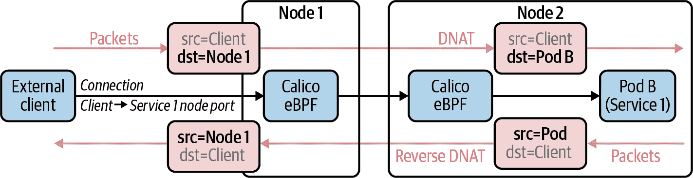
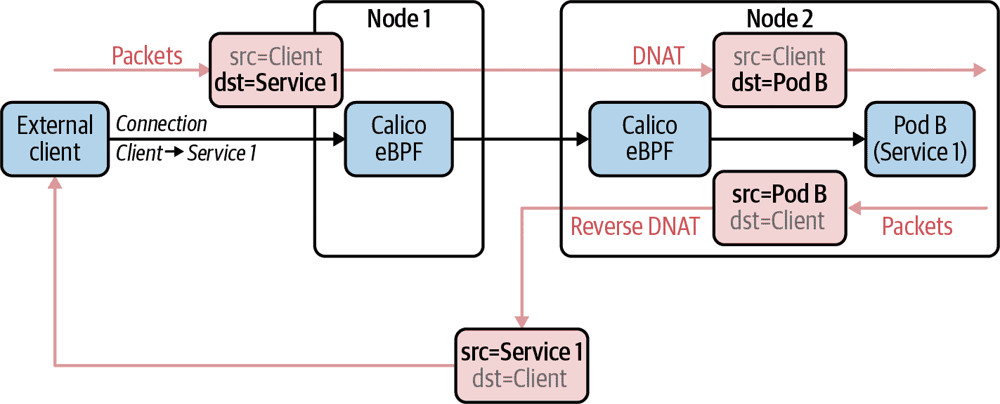
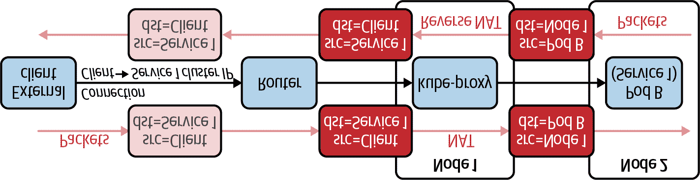
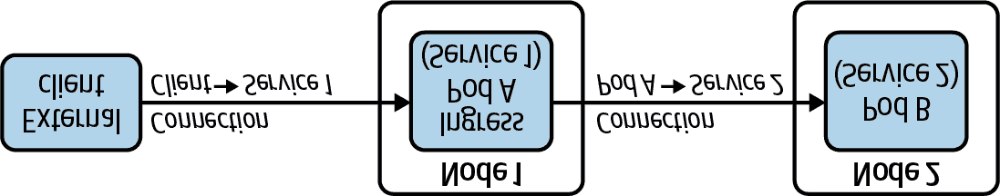
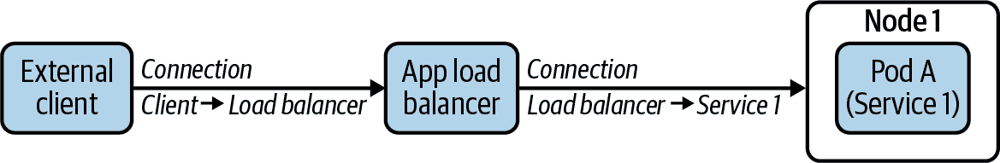

# 第九章：将服务暴露给外部客户端

在早期的章节中，我们探讨了网络策略是保护 Kubernetes 的主要工具之一。这适用于集群内部的 pod-to-pod 流量（东西向流量）以及 pod 与集群外部实体（南北向流量）之间的流量。对于所有这些流量类型，最佳实践都是相同的：使用网络策略来限制允许的网络连接到最窄的需要范围，因此只有您期望和需要的特定应用程序或微服务的连接才被允许。

对于需要由集群外部客户端访问的 pods，这意味着限制连接：

+   与相应微服务期望接收传入连接的特定端口(s)。

+   从需要连接到微服务的特定客户端。

特定的微服务通常只在企业内部（无论是本地还是公共云）被有限数量的客户端消耗是常见的。在这种情况下，理想情况下 Kubernetes 网络策略规则应该限制传入连接到与客户端相关的 IP 地址或 IP 地址范围。即使微服务暴露给公共互联网（例如，为公共可访问的 SaaS 或网站暴露前端微服务），仍然有一些情况需要在一定程度上限制访问。例如，基于合规性原因可能需要阻止某些地理位置的访问，或者可能希望阻止已知的不良行为者或威胁源的访问。

不幸的是，实施这一最佳实践的方式需要考虑使用哪些网络插件和 Kubernetes 原语来将微服务暴露在集群外部。特别是，在某些情况下，原始客户端源 IP 地址会被保留到达 pod，这使得 Kubernetes 网络策略能够轻松地限制对特定客户端的访问。在其他情况下，客户端源 IP 地址可能会被与网络负载平衡相关的网络地址转换（NAT）或与应用层负载平衡相关的连接终止所模糊。

在本章中，我们将探讨在三种主要选项中暴露应用程序或微服务到集群外部时可用的不同客户端源 IP 行为：直接 pod 连接、Kubernetes 服务和 Kubernetes Ingress。

# 了解直接 pod 连接

Pods 直接被集群外的客户端访问而不是通过 Kubernetes 服务或 Kubernetes Ingress 访问相对较少见。然而，在某些场景下可能希望或需要这样做。例如，某些类型的分布式数据存储可能需要多个 pod，每个 pod 都有特定的 IP 地址，可以配置用于数据分发或客户端对等连接。

支持从集群外部直接连接到 pod IP 地址需要使用使 pod IP 地址在集群边界之外可路由的 pod 网络。通常意味着使用以下之一：

+   公共云集群中的云提供者网络插件（例如，默认在 EKS 中使用的 Amazon VPC CNI 插件）

+   可以使用 BGP 与本地企业网络集成的网络插件（例如，Kube-router、Calico CNI 插件）。

除了底层网络支持的连接性之外，客户端还需要一种方法来找出 pod IP 地址。这可以通过 DNS、客户端的显式配置或其他第三方服务发现机制来完成。

从安全角度来看，客户端直接到 pod 的连接非常简单：它们在整个过程中都保留着原始客户端源 IP 地址，这意味着可以轻松使用网络策略来限制特定 IP 地址的客户端访问或特定 IP 地址范围的访问。

请注意，在任何 pod IP 地址在集群边界之外可路由的集群中，确保遵循网络策略的最佳实践变得更为重要。如果没有网络策略，本应仅接收东西向连接的 pod 可能会被从集群外访问，而无需配置相应的可外部访问的 Kubernetes 服务类型或 Kubernetes Ingress。

# 理解 Kubernetes 服务

Kubernetes 服务通过 NodePort 或 LoadBalancer 类型的服务或通过显式配置服务的外部 IP，为从集群外部访问 pod 提供了一种便捷的机制。默认情况下，Kubernetes 服务由 kube-proxy 实现。kube-proxy 在集群中的每个节点上运行，并负责拦截到 Kubernetes 服务的连接，并跨支持相应服务的 pod 进行负载平衡。这种连接处理具有对源 IP 地址保留和不保留的明确定义行为，我们将在每种服务类型中进行详细讨论。

## Cluster IP 服务

在我们探讨如何使用 Kubernetes 服务将 pod 暴露给外部客户端之前，值得了解的是，为集群内部发起的连接（即 pod 到 pod 的连接）提供服务发现和负载平衡的主要机制使用的是 Cluster IP 类型的 Kubernetes 服务。对于 Cluster IP 服务，kube-proxy 能够使用目标网络地址转换（DNAT）将连接映射到服务的 Cluster IP 到支持相应服务的 pod。连接返回数据包时会反向映射此映射。此映射不会更改源 IP 地址，如图 9-1 中所示。

###### 图 9-1. Kubernetes 服务广告集群 IP 的网络路径

重要的是，目标 Pod 看到连接是从客户端 Pod 的 IP 地址发起的。这意味着适用于目标 Pod 的任何网络策略都按预期行为，不受连接通过服务的集群 IP 进行负载平衡的影响。此外，适用于客户端 Pod 的任何网络策略出口规则在从集群 IP 映射到目标 Pod 后进行评估。这意味着适用于客户端 Pod 的网络策略也按预期行为，与连接通过服务的集群 IP 进行负载平衡无关。（作为提醒，网络策略规则匹配 Pod 标签，而不是服务标签。）

## 节点端口服务

从集群外部访问服务的最基本方法是使用类型为 NodePort 的 Kubernetes 服务。节点端口是集群中每个节点上保留的端口，通过它可以访问每个服务支持的 Pod。在典型的 Kubernetes 部署中，kube-proxy 负责拦截对节点端口的连接，并在支持每个服务的 Pod 之间进行负载平衡。

在此过程的一部分中，NAT 用于将节点 IP 和节点端口的目标 IP 地址和端口映射到所选的后备 Pod 和服务端口。然而，与连接到集群 IP 不同，其中 NAT 仅映射目标 IP 地址，对于节点端口而言，源 IP 地址也从客户端 IP 映射到节点 IP。

如果源 IP 地址没有以这种方式映射，那么连接上的任何响应数据包都将直接流回到外部客户端，绕过原始入口节点上 kube-proxy 反向映射目标 IP 地址的能力。（执行 NAT 的节点具有反向 NAT 所需的连接跟踪状态。）结果，外部客户端将丢弃数据包，因为它无法识别这些数据包是否属于其与原始入口节点上节点端口建立的连接。

这个过程在图 9-2 中有所说明。

###### 图 9-2. 使用节点端口的 Kubernetes 服务的网络路径

由于 NAT 更改了源 IP 地址，适用于目标 Pod 的任何网络策略都不能匹配原始客户端 IP 地址。通常这意味着任何此类策略仅限于限制目标协议和端口，并且无法基于外部客户端的 IP 地址进行限制。这反过来意味着在这种配置下，很难像最佳实践那样限制需要连接到微服务的特定客户端的访问，无法轻松地通过 Kubernetes 网络策略来实现。

幸运的是，有多种解决方案可用于规避节点端口默认行为的限制：

+   配置服务使用 `externalTrafficPolicy:local`

+   使用支持节点端口感知网络策略扩展的网络插件

+   使用替代实现的服务负载均衡，取代保留客户端源 IP 地址的 kube-proxy

我们将在本章后面详细介绍这些内容。但在此之前，为了完整地了解主流 Kubernetes 服务默认行为的情况，让我们看看类型为 LoadBalancer 的服务。

## 负载均衡器服务

类型为 LoadBalancer 的服务基于节点端口的行为，与外部网络负载均衡器集成。具体的网络负载均衡器类型取决于与您的集群集成的公共云提供商，或者在本地情况下，取决于集成的特定硬件负载均衡器。

默认情况下，可以通过网络负载均衡器上的特定 IP 地址从集群外部访问服务，该负载均衡器将默认均衡负载到服务的节点端口上的所有节点。

大多数网络负载均衡器位于网络中的某个点，连接的返回流量始终通过网络负载均衡器路由，因此它们可以仅使用 DNAT 实施负载均衡，网络负载均衡器不会改变客户端源 IP 地址，如 图 9-3 所示。

###### 图 9-3\. 类型为 LoadBalancer 的 Kubernetes 服务的网络路径

然而，由于网络负载均衡器正在负载均衡到服务的节点端口，并且 kube-proxy 的默认节点端口行为在其负载均衡实现中更改了源 IP 地址，目标 Pod 仍然无法匹配原始客户端源 IP 地址。就像使用原始节点端口服务一样，这反过来意味着在这种配置中很难通过 Kubernetes 网络策略实施限制连接到微服务的特定客户端的最佳做法。

幸运的是，可以与 NodePort 类型服务的默认行为限制相同的解决方案一起使用，与 LoadBalancer 类型服务一起使用：

+   配置服务为 `externalTrafficPolicy:local`

+   使用支持节点端口感知网络策略扩展的网络插件

+   使用替代实现的服务负载均衡，取代保留客户端源 IP 地址的 kube-proxy

现在让我们分别看看这些。

## externalTrafficPolicy:local

默认情况下，与服务关联的节点端口在集群中的每个节点上都可用，并且类型为 LoadBalancer 的服务将负载均衡到服务的节点端口，独立于实际托管服务的节点。可以通过配置服务为 `externalTrafficPolicy:local` 来更改此行为，该配置指定连接应仅负载均衡到本地节点上支持服务的 Pod。

当与负载均衡器类型的服务结合使用时，连接将仅定向到至少托管一个支持该服务的 pod 的节点。这样可以减少与 kube-proxy 正常节点端口处理相关的节点之间的潜在额外网络跳数。更重要的是，由于每个节点的 kube-proxy 仅对同一节点上的 pod 进行负载均衡，所以 kube-proxy 在负载均衡时无需执行源网络地址转换，这意味着客户端源 IP 地址可以一直保留到 pod。

网络流程示例见 图 9-4。

###### 图 9-4. 利用优化路由到支持 pod 的节点的 Kubernetes 服务的网络路径

由于原始客户端源 IP 地址一直保留到支持的 pod，因此现在可以将应用于支持的 pod 的网络策略限制为仅允许访问服务的特定客户端 IP 地址或地址范围。

注意，并非所有负载均衡器都支持此操作模式。因此，重要的是检查特定公共云提供商是否支持此功能，或者如果在本地部署，检查与集群集成的特定硬件负载均衡器是否支持此功能。好消息是，大多数大型公共提供商都支持此模式。一些负载均衡器甚至可以更进一步，跳过 kube-proxy，直接向支持的 pod 进行负载均衡，而不使用节点端口。

## 网络策略扩展

一些 Kubernetes 网络插件提供了标准 Kubernetes 网络策略能力的扩展，可用于帮助安全地访问集群外的服务。

存在许多解决方案提供网络策略扩展（例如 Weave Net、Kuberouter、Calico）。让我们再次关注 Calico，因为这是我们的专业领域。Calico 支持主机端点，允许将网络策略应用于集群内的节点，而不仅仅是集群内的 pod。标准 Kubernetes 网络策略可以被认为是在每个 pod 网络前面提供虚拟防火墙，而 Calico 的主机端点扩展可以被认为是在每个节点/主机前面提供虚拟防火墙，如 图 9-5 所示。

此外，Calico 的网络策略扩展支持指定主机端点应用的策略规则是在 kube-proxy 负载均衡相关的 NAT 之前还是之后。这意味着它们可以用于限制哪些客户端能够连接到特定的节点端口，不受 kube-proxy 可能即将做出的负载均衡决策的影响。

###### 图 9-5\. 使用主机端点保护的虚拟防火墙

## 替代 kube-proxy

Kube-proxy 提供了 Kubernetes 服务的默认实现，并且在大多数集群中作为标准包含。然而，一些网络插件提供了替代的 Kubernetes 服务实现来取代 kube-proxy。

对于某些网络插件，由于插件实现的 pod 网络方式与 kube-proxy 的数据平面不兼容（kube-proxy 使用由 iptables 和/或 IPVS 控制的标准 Linux 网络管道），因此需要进行这种替代实现。对于其他网络插件，替代实现是可选的。例如，实现了 Linux eBPF 数据平面的 CNI 将选择替换 kube-proxy，采用其本地服务实现。

这些替代实现中的一些提供了超出 kube-proxy 行为的额外功能。从安全角度来看，其中一个相关的附加功能是在从外部客户端进行负载均衡时保留客户端源 IP 地址直到后端 pod。

例如，图 9-6 展示了基于 eBPF 的数据平面如何实现这种行为。

###### 图 9-6\. 基于 eBPF 实现的 Kubernetes 服务的网络路径

这允许原始客户端源 IP 地址一直保留到服务的打包 pod，适用于类型为 NodePort 或 LoadBalancer 的服务，无需网络负载均衡器支持 `externalTrafficPolicy:local` 或节点端口的节点选择。这反过来意味着应用于支持 pod 的网络策略能够限制只有特定客户端、IP 地址或地址范围能够访问服务。

除了安全考虑，这些替代的 Kubernetes 服务实现（如基于 eBPF 的数据平面）相比于 kube-proxy 的实现还提供其他优势，例如：

+   在运行非常多服务时提升了性能，包括减少了首个数据包的延迟和减少了控制平面的 CPU 使用率

+   直接服务器返回（DSR），用于减少返回流量的网络跳数

我们将更详细地查看 DSR，因为它确实具有一些安全方面的影响。

## 直接服务器返回

DSR 允许目标 Pod 的返回流量直接流回客户端，而不必经过原始入口节点。有几种网络插件可以用它们自己的实现替换 kube-proxy 的服务处理，支持 DSR。例如，包括本地服务处理的 eBPF 数据平面（可选地）可以使用 DSR 处理返回流量，如图 9-7 所示。

###### 图 9-7\. Kubernetes 服务的网络路径，具有直接服务器返回

消除返回流量的一个网络跳跃会减少：

+   服务的整体延迟（因为每个网络跳跃都会引入延迟）

+   原始入口节点的 CPU 负载（因为它不再处理返回流量）

+   集群内部的东西向网络流量

对于特别网络密集或延迟敏感的应用程序，这可能是一个巨大的优势。然而，DSR 也有安全影响。特别是，底层网络可能需要配置相对放宽的反向路径过滤（RPF）设置。

RPF 是一种网络路由机制，阻止来自特定源 IP 地址的任何流量，如果没有相应的路由可以通过同一链路发送到该 IP 地址，则会阻止该流量。也就是说，如果路由器没有一条路由表明可以通过网络链路发送到特定的 IP 地址，则它不会允许来自该 IP 地址的流量通过网络链路。RPF 使攻击者更难“欺骗”IP 地址，即假装成不同于设备分配的 IP 地址。

在 DSR 和 Kubernetes 服务的背景下，图 9-7 展示了几个关键点：

+   如果通过节点 1 上的节点端口访问服务，则来自节点 2 的返回流量将具有节点 1 的源 IP 地址。因此，底层网络必须配置放宽的 RPF 设置，否则网络将过滤返回流量，因为网络通常不会通过节点 2 的网络链路路由到节点 1。

+   如果通过服务 IP 广告（例如，直接发送流量到服务的集群 IP、外部 IP 或负载均衡器 IP）访问服务，则来自节点 2 的返回流量将具有服务 IP 的源 IP 地址。在这种情况下，不需要放宽反向路径过滤（RPF），因为服务 IP 应该从集群中的所有节点广告，意味着网络将通过所有节点路由到服务 IP。我们将在本章后面更详细地讨论服务 IP 广告。

正如前面所解释的，DSR 是一种优秀的优化技术，您可以使用它，但需要审查您的用例，并确保您能够禁用 RPF 检查而感到舒适。

## 限制服务的外部 IP

到目前为止，在本章中，我们专注于服务类型和实现方式如何影响网络策略的使用，以限制只有特定的客户端 IP 地址或地址范围可以访问每个服务。

另一个重要的安全考虑是具有权限创建或配置 Kubernetes 服务的用户所拥有的权力。特别是，任何具有 RBAC 权限修改 Kubernetes 服务的用户实际上控制着该服务负载平衡到哪些 Pod。如果恶意使用，这可能意味着用户能够将本应发送到特定微服务的流量重定向到他们自己的恶意 Pod。

由于 Kubernetes 服务是命名空间资源，这很少会成为主流服务功能的真正安全问题。例如，已被授予在特定命名空间中定义服务权限的用户通常也有权限修改该命名空间中的 Pod。因此，对于标准服务功能（如处理集群 IP、节点端口或负载均衡器），在命名空间中定义和修改服务的权限实际上并不表示比在命名空间中定义或修改 Pod 的更高信任级别。

然而，还有一个显著的例外，即能够为服务指定外部 IP 的能力。服务定义中的 externalIP 字段允许用户将任意 IP 地址与服务关联起来。在集群中的任何节点上接收到对此 IP 地址的连接将被负载平衡到支持该服务的 Pod。

正常使用情况是提供一个面向 IP 的替代方案，用于外部客户端连接到服务。此用例通常需要在底层网络中进行特殊处理，以便将连接路由到集群中的节点上。这可以通过在底层网络中编程静态路由来实现，或者在支持 BGP 的网络中，使用 BGP 动态广播外部 IP。 （有关广告服务 IP 地址的更多详细信息，请参阅下一节。）

与主流服务功能类似，此用例在用户信任级别上相对温和。它允许用户为管理权限的命名空间中的 Pod 提供一种额外的访问方式，但不会干扰流向其他命名空间中的 Pod 的流量。

然而，与节点端口一样，从 Pod 到外部 IP 的连接也会被拦截并负载平衡到支持该服务的 Pod。由于 Kubernetes 不会对外部 IP 地址进行监控或尝试提供任何级别的验证，这意味着恶意用户实际上可以截取到任何 IP 地址的流量，而无需任何命名空间或其他范围限制。这对于恶意用户来说是一个极为强大的工具，同时也代表着相应的巨大安全风险。

如果您遵循最佳实践，即在整个集群中为入站和出站流量都采用默认拒绝的策略，那么这将极大地阻碍恶意用户试图访问应该在两个其他 Pod 之间的流量。然而，虽然网络策略将阻止它们访问流量，但服务负载平衡不会阻止将流量从其预期的目的地转移，这意味着恶意用户可以有效地阻止任何两个 Pod 之间的流量，即使他们自己无法接收到流量。

因此，除了遵循网络策略的最佳实践外，建议使用准入控制器来限制可以指定或修改外部 IP 字段的用户。对于允许指定外部 IP 地址的用户，还可能希望将 IP 地址值限制在被认为安全的特定 IP 地址范围内（即未用于任何其他目的的范围）。有关准入控制器的更多讨论，请参见第八章。

## 广告服务 IP

使用节点端口或网络负载均衡器的一种替代方法是通过 BGP 广告服务 IP 地址。这需要集群在支持 BGP 的底层网络上运行，通常意味着使用标准顶部机架路由器的本地部署。

例如，Calico 支持广告服务集群 IP、负载均衡器 IP 或配置了一个外部 IP 的服务。如果您不使用 Calico 作为您的网络插件，那么 MetalLB 提供了类似的功能，可以与各种不同的网络插件一起使用。

广告服务 IP 有效地允许底层网络路由器充当负载均衡器，而无需实际的网络负载均衡器。

广告服务 IP 的安全考虑与本章前面讨论的基于节点端口或负载均衡器的服务相当。在使用 kube-proxy 时，默认情况下会通过模糊示原始客户端 IP 地址，如图 9-8 所示。

###### 图 9-8\. 通过 BGP 广告集群 IP 的 Kubernetes 服务的网络路径

这种行为可以通过使用`externalTrafficPolicy:local`来更改，该选项（截至撰写本文时）由 kube-proxy 支持，适用于负载均衡器 IP 和外部 IP 地址，但不适用于集群 IP 地址。然而，应注意，当使用`externalTrafficPolicy:local`时，负载均衡的均匀性变为依赖于拓扑结构。为了规避这一问题，可以使用 Pod 反亲和性规则，以确保在拓扑结构中均匀分布支持 Pod，但这确实增加了部署服务的复杂性。

或者，可以使用具有本地服务处理的网络插件（替换 kube-proxy），支持源 IP 地址保留。由于其操作简单性和无需在网络拓扑中构建网络负载均衡器设备，这种组合对于本地部署非常有吸引力。

## 理解 Kubernetes Ingress

Kubernetes Ingress 构建在 Kubernetes 服务之上，提供应用层负载均衡，将特定域名或 URL 的 HTTP 和 HTTPS 请求映射到 Kubernetes 服务。如果多个微服务组成单个 Web 应用程序，Kubernetes Ingress 可以是一种方便的方式来通过单个外部接入点公开多个微服务。此外，它们可以用于在将流量负载均衡到后端微服务之前终止 SSL/TLS（用于接收来自外部客户端的 HTTPS 加密连接）。

Kubernetes Ingress 的实现细节取决于您使用的入口控制器。入口控制器负责监视 Kubernetes Ingress 资源，并配置一个或多个入口负载均衡器以实现所需的负载均衡行为。

与 Kubernetes 服务不同，后者在网络层（L3-L4）处理，入口负载均衡器在应用层（L5-L7）操作。入站连接在负载均衡器处终止，以便检查单独的 HTTP/HTTPS 请求。然后，请求通过从负载均衡器到选择的服务的分开连接进行转发。因此，应用于支持服务的 Pod 的网络策略将入口负载均衡器视为客户端源 IP 地址，而不是原始外部客户端 IP 地址。这意味着它们可以限制仅允许来自负载均衡器的连接，但不能限制对特定外部客户端的访问。

为了限制对特定外部客户端的访问，需要在应用负载均衡器内或应用负载均衡器前强制执行访问控制。如果选择基于 IP 的访问控制，则需要在流量转发到后端服务之前执行。如何执行这一点取决于您使用的具体入口控制器。

广义上说，有两种类型的入口解决方案：

In-cluster ingress

入口负载均衡由集群内的 Pod 执行。

外部入口

入口负载均衡由设备或云提供商的功能在集群外实现。

现在我们已经介绍了 Kubernetes Ingress，让我们来回顾一下入口解决方案。

### 集群内入口解决方案

集群内入口解决方案使用运行在集群内部 Pod 中的软件应用负载均衡器。有许多不同的入口控制器遵循此模式。例如，NGINX 入口控制器实例化和配置 NGINX Pod 以充当应用程序负载均衡器。

集群内 Ingress 解决方案的优势在于：

+   您可以水平扩展您的 Ingress 解决方案，直至达到 Kubernetes 的极限。

+   有许多不同的集群内 Ingress 控制器解决方案，因此您可以选择最适合您特定需求的 Ingress 控制器 — 例如，具有特定负载均衡算法、安全选项或可观测性功能。

要将您的 Ingress 流量发送到集群内的 Ingress Pod，通常将 Ingress Pod 作为 Kubernetes 服务外部公开，如 图 9-9 所示。

###### 图 9-9\. Kubernetes 集群中内部 Ingress 实现的示例

这意味着您可以使用任何标准的方式从集群外部访问服务。一个常见的方法是使用外部网络负载均衡器或服务 IP 广告，以及以下方法之一：

+   一个具有本地 Kubernetes 服务处理的网络插件，始终保留原始客户端源 IP

+   `externalTrafficPolicy:local`（和 Pod 反亲和规则以确保在 Ingress Pod 之间均衡负载）以保留原始客户端源 IP

应用于入口 Pod 的网络策略可以像本章前面描述的那样限制对特定外部客户端的访问，并且支持通过 Ingress 暴露的任何微服务的 Pod 可以限制连接仅限于来自入口 Pod 的连接。

### 外部 Ingress 解决方案

外部 Ingress 解决方案使用集群外的应用程序负载均衡器，如 图 9-10 所示。

###### 图 9-10\. Kubernetes 集群中外部 Ingress 的示例

具体的细节和功能取决于您使用的 Ingress 控制器。大多数公共云提供商都有自己的 Ingress 控制器，可以自动化云提供商的应用程序负载均衡器的配置和管理，以提供 Ingress。

大多数应用程序负载均衡器支持将流量转发到所选服务后端 Pod 的基本操作模式，通过相应服务的节点端口。除了负载均衡到服务节点端口的基本方法外，一些云提供商支持应用程序负载均衡的第二模式，直接负载均衡到每个服务后端的 Pod，而不经过节点端口或其他 kube-proxy 服务处理，这样做的优势是消除了与节点端口负载均衡到不同节点上的 Pod 相关的潜在第二个网络跳转。

外部 Ingress 解决方案的主要优势是云提供商为您处理 Ingress 的操作复杂性。潜在的缺点如下：

+   可用的功能集通常比集群内 Ingress 解决方案的丰富范围更有限。例如，如果您需要特定的负载均衡算法、安全控制或可观察性功能，则云服务提供商的实现可能或可能不支持这些功能。

+   支持的服务最大数量（以及可能支持的服务后端的 Pod 数量）受限于特定云服务提供商的限制。例如，如果您在非常高的规模下运行，每个服务后端支持数百个 Pod，您可能会超出应用层负载均衡器在此模式下能够负载均衡的最大 IP 数量限制。在这种情况下，切换到集群内的 Ingress 解决方案可能更适合您。

+   由于应用负载均衡器不托管在 Kubernetes 集群内，如果您需要限制对特定外部客户端的访问，则无法使用 Kubernetes 网络策略，而必须使用云服务提供商的特定机制。仍然可以按照本章开头提出的最佳实践进行，但这将依赖于云服务提供商的具体能力和 API，可能会引入一些额外的运维复杂性。

在这一节中，我们讨论了 Kubernetes Ingress 的工作原理以及现有的解决方案。我们建议您仔细查看这些部分，并决定是否适合您使用集群内的 Ingress 解决方案，或者应该选择外部的 Ingress 解决方案。

# 结论

在本章中，我们讨论了将 Kubernetes 服务暴露到集群外部的主题。以下是涵盖的关键概念：

+   Kubernetes 服务的概念，如直接 Pod 连接、广告服务 IP 和节点端口，是您可以利用的技术，以将 Kubernetes 服务暴露到集群外部。

+   我们建议使用基于 eBPF 的数据平面来优化 Ingress 路径，将流量路由到托管服务后端的 Pod。

+   由于其能够保留源 IP 到 Pod 的能力，eBPF 数据平面是默认 Kubernetes 服务实现 kube-proxy 的一个优秀替代方案。

+   Kubernetes Ingress 实现的选择将取决于您的用例。我们建议您考虑集群内的 Ingress 解决方案，因为它更符合 Kubernetes 的本地化特性，比使用外部 Ingress 解决方案更具控制性。

我们希望您能根据自己的用例利用这些概念，实施 Kubernetes 服务。
