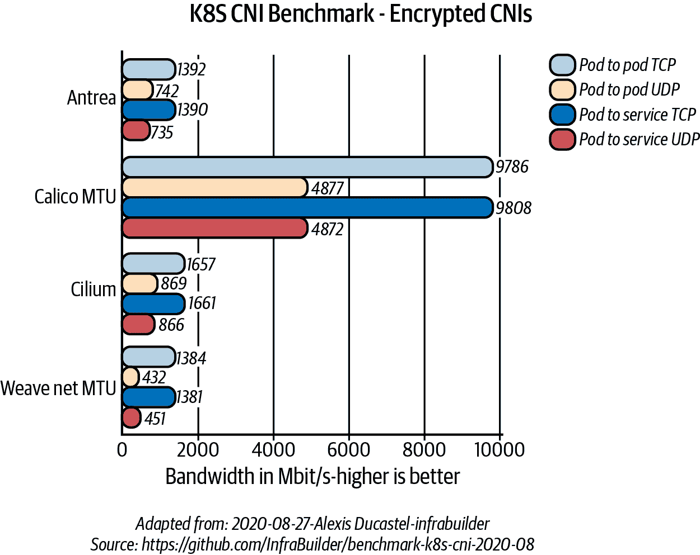

# 第十章：数据在传输中的加密

随着将关键任务工作负载转移到生产环境，您很可能需要加密传输中的数据。这对于满足某些类型数据的合规要求以及良好的安全实践非常重要。

数据在传输中的加密是许多合规标准（如 HIPAA、GDPR 和 PCI）规定的要求。具体要求略有不同；例如，PCI DSS（支付卡行业数据安全标准）有关在传输过程中加密持卡人数据的规定。根据具体的合规标准，您可能需要确保在 Kubernetes 中托管的应用程序或微服务之间传输的数据使用认可的强加密算法进行加密。

根据应用程序或微服务的架构，可能并非所有通过网络发送的数据都被分类为敏感数据，因此从理论上讲，您可能只需对传输中的数据子集进行严格加密。然而，从操作简易性和合规审计的角度来看，通常对微服务之间的所有数据进行加密是合理的选择，而不是尝试选择性加密。

即使您没有外部合规标准强制的强制要求，加密数据在传输中仍然可以是一种非常好的做法。没有加密，拥有网络访问权限的恶意行为者可以看到敏感信息。您如何评估这种风险可能会因您使用的是公共云还是本地/私有云基础架构以及您作为组织的内部安全流程而异。在大多数情况下，如果您处理敏感数据，那么您真的应该加密传输中的数据。

如果您提供的服务是由公共互联网上的客户访问的，则 Kubernetes 适用 HTTPS 的标准做法。根据您的微服务架构，这些 HTTPS 连接可以在目标微服务上终止，也可以由 Kubernetes Ingress 解决方案终止，无论是作为集群内 Ingress pods（例如使用 NGINX Ingress Controller 时）还是作为集群外应用程序负载均衡器（例如使用 AWS 负载均衡器控制器时）。请注意，如果使用集群外应用程序负载均衡器，则仍然需要确保从负载均衡器到目标微服务的连接使用 HTTPS，以避免未加密的网络跳跃。

在集群内部，有三种广泛的方法来加密传输中的数据：

+   在您的应用程序/微服务代码中构建加密功能。

+   使用基于 sidecar 或服务网格的加密，在无需对您的应用程序/微服务进行代码更改的情况下，在应用程序层加密。

+   使用网络级加密，无需对您的应用程序/微服务进行代码更改。

现在我们将探讨每种方法的利弊。

# 将加密集成到您的代码中

大多数编程语言都有用于加密网络连接的库，因此理论上您可以选择在构建微服务时将加密集成到其中。例如，您可以使用 HTTPS SSL/TLS 甚至 mTLS（双向 TLS）来验证连接两端的身份。

然而，这种方法有许多缺点：

+   在许多组织中，不同的微服务使用不同的编程语言构建，每个微服务开发团队都使用最适合其特定微服务和团队专长的语言。例如，前端 Web UI 微服务可能使用 Node.js 编写，中间层微服务可能使用 Python 或 Golang 编写。由于每种编程语言都有其可用于加密的库集合，这意味着实施工作量增加，可能需要每个微服务团队为其微服务实施加密，而不是能够跨所有微服务共享单一实现。

+   建立在不使用单一共享加密实现的理念基础上，微服务的配置也是如此，特别是微服务读取用于加密所需凭证的方式。

+   除了开发和维护所有这些代码所需的工作量之外，您拥有的实现越多，某个实现中存在导致安全漏洞的错误可能性就越大。

+   旧版加密库通常存在已知的漏洞，在新版本中得到修复。一旦发布新版本以解决任何新发现的漏洞，这些漏洞就会变为公开知识。这进一步增加了针对利用漏洞的攻击数量。为了减少风险，尽快更新使用该库的任何微服务至关重要。如果运行多个微服务，这可能代表显著的开发和测试工作量，因为每个微服务的代码都需要单独更新和测试。此外，如果您的 CI/CD 过程中缺乏大量自动化，那么更新每个微服务版本到生产集群中可能会增加操作上的头疼。

+   许多微服务基于第三方开源代码（部分或整体）。这通常意味着您只能使用第三方代码支持的特定加密选项，并且在许多情况下，您还会依赖于第三方代码支持的特定配置机制。您还会依赖于第三方代码的上游维护者，以确保开源项目保持更新，并在发现漏洞时进行修复。

+   最后，重要的是要注意，在配置不同实现及其各种配置范例时，通常存在操作开销，特别是在提供加密设置和凭据时。

因此，总的来说，虽然可以在每个微服务中构建加密功能，但涉及的工作量以及由于代码或设计问题或过时的加密库而不知不觉地引入安全漏洞的风险，可能会使这种方法显得相当令人望而却步。

# 边车或服务网格加密

在应用层面对微服务之间的流量进行加密的另一种架构方法是使用边车设计模式。边车是一个容器，可以与实现微服务的主要容器一起包含在每个 Kubernetes Pod 中。边车拦截与微服务进行的连接，并代表微服务执行加密，而无需对微服务本身进行任何代码更改。边车可以显式地包含在 Pod 规范中，也可以在创建时通过准入控制器注入到 Pod 规范中。

相较于在每个微服务中构建加密功能，边车（sidecar）方法的优势在于可以在所有微服务中使用单一的加密实现，独立于微服务可能使用的编程语言。这意味着只需维护一个实现，就可以轻松更新漏洞修复或安全改进，从而在所有微服务中进行推广。

理论上，您可以开发自己的边车。但除非您有某些特定需求，通常最好使用已经可用的众多免费开源实现之一，这些实现经过了大量的安全审查和现场强化。

一个广受欢迎的例子是由 Lyft 团队最初开发的 Envoy 代理，通常用于使用 mTLS（双向 TLS）加密微服务流量。双向 TLS 意味着源和目标微服务在建立连接时都提供凭据，因此每个微服务都可以确保与预期的其他微服务进行通信。Envoy 拥有丰富的配置模型，但本身不提供控制或管理平面，因此您需要编写自己的自动化流程来配置 Envoy 以按照您希望的方式工作。

与其自己编写此自动化，另一种方法是使用遵循旁路模式的许多服务网格解决方案之一。例如，Istio 服务网格提供了一个打包解决方案，使用 Envoy 作为集成到 Istio 控制和管理平面的旁路。服务网格除了加密外，还提供许多功能，包括服务路由和可见性。虽然服务网格越来越受欢迎，但其更丰富的功能集被普遍认为可能引入操作复杂性，或者使得服务网格在螺丝和螺母层面更难理解，因为涉及更多运行部件。另一个缺点是与旁路设计模式相关的安全风险，其中旁路是每个应用程序 Pod 的一部分，管理旁路的复杂性增加（例如，一个 CVE 可能需要您更新旁路，这并非简单更新，因为它会影响所有应用程序）。

# 网络层加密

实现微服务中的加密或使用旁路模式通常被称为*应用层加密*。本质上，应用程序（微服务或旁路）处理所有加密，而网络只负责发送和接收数据包，完全不知道加密正在进行。

实施加密的另一种选择是在网络层内部实现加密。从应用程序的角度来看，它发送的是未加密数据，而网络层负责在数据传输到网络之前对数据包进行加密。

多年来在行业中广泛使用的网络层加密的主要标准之一是 IPsec。大多数 IPsec 实现支持广泛的加密算法，如具有不同密钥长度的 AES 加密。IPsec 通常与 IKE（Internet Key Exchange）配对，作为管理和传输 IPsec 所需的主机凭证（证书和密钥）的机制。有许多开源项目，如流行的强 Swan 解决方案，提供 IKE 实现，简化创建和管理 IPsec 网络。

一些企业选择使用强 Swan 等解决方案作为其首选的 IPsec 管理解决方案，然后在其上运行 Kubernetes。在这种情况下，Kubernetes 并不真正了解 IPsec。即使像强 Swan 这样的项目帮助简化和管理 IPsec 设置，许多人仍认为 IPsec 在整体运营角度上相当笨重且难以管理。

IPsec 的一个替代方案是 WireGuard。WireGuard 是一种较新的加密实现，旨在极其简单且快速，采用最先进的密码学。在架构上，它更为简单，初步测试表明，在各种情况下，它确实优于 IPsec。但需要注意的是，WireGuard 和 IPsec 都在继续开发中，尤其是随着加密算法的进展，它们的比较性能可能会发生变化。

对于大多数组织而言，与其自行设置和管理 IPsec 或 WireGuard，更为操作简单的方法是使用内置支持加密的 Kubernetes 网络插件。有各种 Kubernetes 网络插件支持不同类型的加密，具有不同的性能特征。

如果您运行网络密集型工作负载，则考虑加密的性能成本至关重要。无论您是在应用层还是在网络层进行加密，这个成本都会存在，但加密技术的选择对性能可能会产生显著影响。例如，图 10-1 显示了四种流行的 Kubernetes 网络插件的独立基准结果（这是在撰写本文时最新的基准测试结果，发布于 2020 年）。

使用支持加密的 Kubernetes 网络插件，通常在操作上要简单得多，动态部署的组件也更少，比采用服务网格要简单得多，并且比将加密集成到应用程序/微服务代码中所需的工作量也少得多。如果您采用服务网格的主要动机是通过加密来确保安全性，那么使用支持网络层加密的 Kubernetes 网络插件以及 Kubernetes 网络策略可能更容易管理和维护。请注意，我们在第五章中还涵盖了服务网格的其他方面，如可观察性。

###### 图 10-1\. Kubernetes 中加密的基准结果

# 结论

在本章中，我们介绍了实现数据传输加密的各种选项，以及在 Kubernetes 集群中实现加密的各种方法。我们希望这能帮助您选择最适合您用例的选项。以下是一些需要记住的事项：

+   随着您将关键工作负载转移到生产环境，对于某些类型的数据，您需要实现数据传输加密。即使合规要求不要求对所有数据进行加密，我们也建议实现数据传输加密。

+   我们介绍了实施加密的常见方法：应用层加密、基于 sidecar 的服务网格加密以及网络层加密。

+   基于操作简易性和更好的性能，我们推荐网络层加密。
