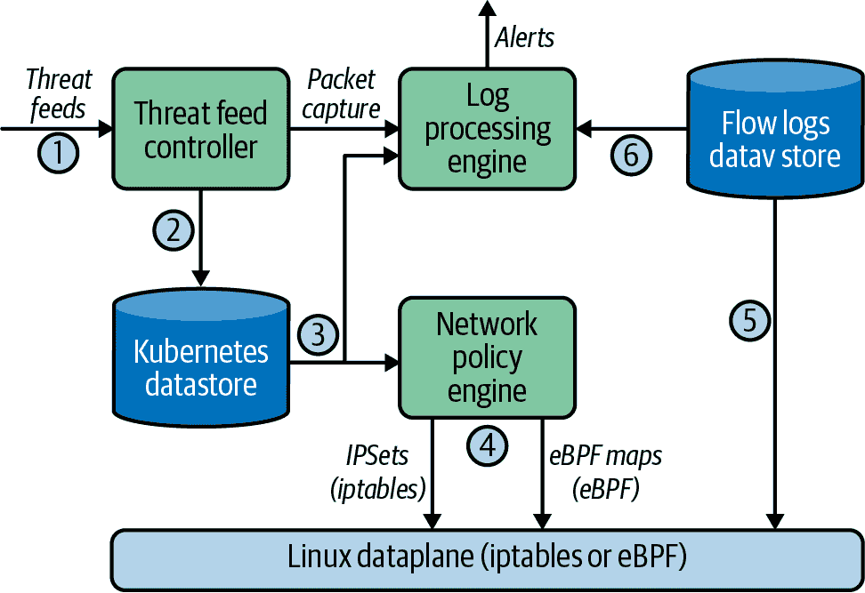
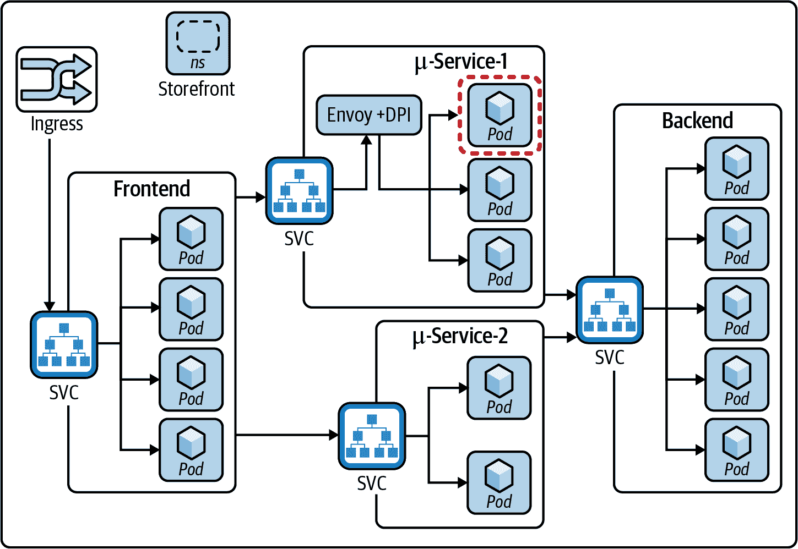
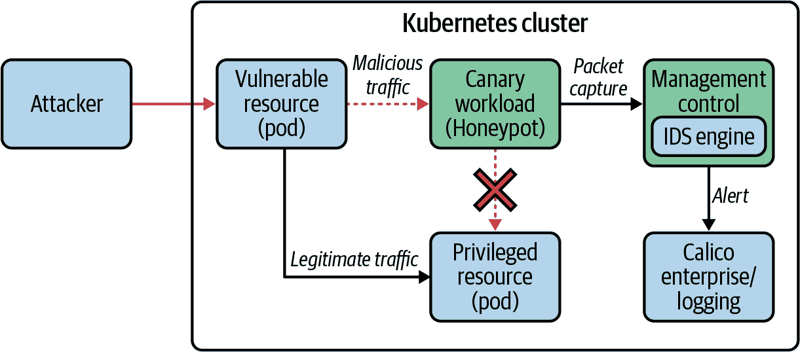
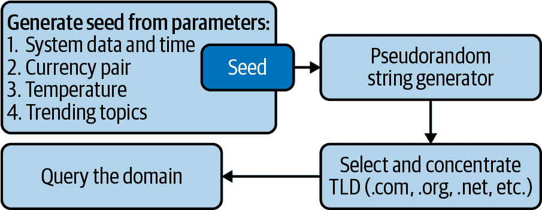

# 第十一章：威胁防御与入侵检测

在本章中，我们将探讨如何为您的 Kubernetes 集群实施威胁防御。我们已经在前几章中涵盖了 Kubernetes 部署的各个阶段（构建、部署、运行时）。本章重点讨论威胁防御，即运行时阶段的安全性。我们将涵盖以下概念，帮助您理解 Kubernetes 集群中的威胁防御以及其重要性。

+   Kubernetes 集群的威胁防御，包括为什么需要它以及它与传统安全的不同之处。

+   Kubernetes 的入侵检测

+   高级威胁防御技术。

让我们详细探讨每一个阶段。我们从威胁防御及其重要性开始。

# Kubernetes 的威胁防御（攻击阶段）

要理解威胁防御，一个很好的起点是审查网络安全杀伤链，它将攻击分解为几个阶段。然后用这些阶段来制定防御策略。网络安全杀伤链包括以下阶段：

侦察

对手探测目标并收集信息。

武器化

对手创建攻击方法，可以是新的漏洞，现有漏洞的变体或不安全配置的简单利用。

交付

对手创建一种方法，将漏洞或利用交付给目标或可用于攻击目标的位置。

利用

对手实施触发攻击的方法。

安装

对手安装恶意软件，通常包括创建与恶意软件通信的后门软件。

命令与控制

对手建立与恶意软件的通信渠道以控制软件。

目标动作

对手实现攻击的预期结果（例如窃取数据，加密数据等）。

几个组织已经适应了这一框架，以包含实际攻击和更多用例。Microsoft 在其博客文章 [“在 Kubernetes 上使用更新的威胁矩阵保护容器化环境”](https://oreil.ly/gebGs) 中描述了对 Kubernetes 的适应。让我们审视适用于 Kubernetes 的杀伤链阶段（威胁矩阵）：

初始访问

对手利用您的 Kubernetes 部署中的各种公开接口（例如 Kubeflow），通过窃取的凭据、被入侵的镜像或其他应用程序漏洞。

执行

对手在您的集群中执行恶意命令或软件。这可以通过多种方式实现；一些已知的技术包括在集群中创建新容器，在任何 Pod 中作为 sidecar 运行额外容器，以及利用已知的应用程序漏洞执行恶意命令。

持久性

对手将努力将恶意软件持久化在 Kubernetes 集群中，以便以后访问。通常通过在主机上创建可写存储路径、利用定期运行恶意软件的 Kubernetes 定时作业（也称为 cron 作业），或在某些情况下，破坏 Kubernetes 准入控制器，以便篡改 API 服务器的请求来发动攻击。在此阶段，对手还将尝试建立与其控制服务器的后门通信渠道，以便控制恶意软件。这被称为命令与控制服务器（C&C 服务器）。

特权升级

对手通过利用集群中具有特权访问权限的资源来获得特权访问。例如，他们可能通过利用特权容器中的漏洞来运行恶意软件，从而获得特权访问。

防御逃避

对手通过清除日志或删除事件等技术来保持攻击不被检测，以便监测系统不会检测到恶意活动的存在。另一种使用的技术是利用一个由许多 Pod 支持的 Kubernetes 部署中仅一个 Pod 中的漏洞，并利用它进一步发动攻击。

凭据访问

对手致力于获取集群中的凭据（Kubernetes secrets）。如果您正在使用托管服务，云提供商将提供一个访问云资源的令牌，并且此令牌对某些特权的 Pod 和服务账号可访问。对手将利用冒充或特权升级来获取凭据访问权限，然后利用云资源访问进一步发动攻击。

探测

对手将尝试对集群网络进行侦察，以了解集群中正在运行的内容。这可以通过在 Linux 系统上使用像[Nmap](https://nmap.org)这样的网络映射工具，或者访问 Kubernetes 仪表板来实现。此阶段是攻击的重要前期阶段，对手可以在集群中移动以寻找他们所需的内容。

横向移动

当攻击达到这个阶段时，攻击已经相当先进，对手已经建立了存在；他们现在将利用安装的恶意软件访问网络中的其他 Pod 和资源。一些常见的技术包括欺骗其他 Pod 的 IP 地址或域名，并冒充其他 Pod 以绕过集群内部的分段规则。攻击者还会寻找集群内运行的其他应用程序，因为他们现在可以访问这些应用程序。在这个阶段，恶意软件正在与命令与控制服务器通信，以获取进一步攻击的指令。在这个阶段，攻击者依靠过载 DNS 或 HTTP 等众所周知的协议来发送命令与控制请求作为这些协议的一部分，这使得他们可以绕过基于周界的安全控制，因为流量看起来像是正常的 DNS 或 HTTP 请求。

影响

这是攻击的最终阶段，通常的结果是窃取敏感数据。这是通过一种称为数据外泄、勒索软件数据加密，甚至使用资源进行加密货币挖掘的技术来实现的。

威胁防御包括一组技术，帮助您防御这些阶段并使您能够抵御攻击。考虑到对手可能使用的所有这些阶段和技术可能会让人感到不知所措。我们要提到的是，虽然对手需要在大多数（如果不是全部）阶段中取得成功才能执行成功的攻击，但您只需要在任何一个阶段阻止它们就可以挫败攻击。所以胜算在您这边。了解这些阶段及其在 Kubernetes 中的应用是构建有效防御机制的第一步。对手始终在创新，因此您应关注所有阶段，并使用与每个阶段相关的工具和技术，以使自己有最大成功挫败攻击的机会。

在第二章中，我们讨论了基础设施安全，向您展示了如何为运行工作负载创建安全的基础设施。在第三章中，我们介绍了您可以使用的最佳实践和技术，以安全地部署工作负载。第四章涵盖了您可以应用于工作负载以保护工作负载运行环境的安全策略，而第六章涵盖了如何应用网络策略来实施工作负载的网络访问控制。我们建议您在这里描述的杀伤链阶段的背景下回顾这些章节。您会发现，这些技术在处理初始访问、特权提升、凭证访问、持久性和执行阶段时非常有效。

现在我们将描述您可以使用的工具和技术来保护杀伤链的其他阶段。需要注意的是 Kubernetes 是一个分布式系统，其集群网络对其操作至关重要；因此，保护网络是一种非常有效的技术。例如，如果对手无法利用集群网络进行发现、命令与控制、横向移动或数据外泄，那么成功的特权升级或应用程序漏洞的利用将变得无效。仅仅基于 IP 地址/端口的网络分割是不够的，因为对手会找到方法继续攻击，即使像网络分割这样的技术在保护您的集群时。例如，您需要允许 HTTP 流量到达您的服务和支持该服务的 Pod，以便攻击可以作为触发特权升级的 HTTP 标头的一部分。

现在我们已经介绍了威胁防御的概念，让我们来探讨入侵检测。

# 入侵检测

在本节中，我们将介绍入侵检测及其在 Kubernetes 集群中的应用。为了理解这一点，我们将审查入侵的各种方法及入侵检测系统的角色。

## 入侵检测系统

入侵检测系统（IDS）顾名思义是一个监控网络活动、检测异常模式并报告可疑行为的系统。这些系统还监控违反现有控制措施（如网络策略、主机强化）并报告这些违规行为。IDS 的响应操作包括以下内容：

警报

生成警报并发送到 SIEM 进行进一步分析和处理。

入侵预防

系统通过利用现有的控制措施（例如网络策略、Kubernetes Pod 安全策略、主机强化策略）并重定向攻击至专门用于分析此类攻击的金丝雀资源来采取行动以防止入侵。当 IDS 能够预防入侵时，它被称为入侵预防系统（IPS）。

一个良好的入侵检测系统应能通过跟踪系统的行为来关联一组相关的异常。我们建议您了解用户和实体行为分析（UEBA）及其在安全领域的应用。[Microsoft Azure UEBA](https://oreil.ly/LqYWk) 是您审阅的一个优秀资源。请注意，对于 Kubernetes，实体行为分析是适用的。本书不涵盖其实施细节，但 UEBA 有助于减少警报数量并生成高保真度警报。请注意，警报数目的增加未必是好事；它们会使下游系统（例如 SIEM）对警报免疫。稍后我们将讨论如何利用机器学习系统生成高保真度警报。

现在我们将审查入侵检测方法及其在 Kubernetes 集群中的应用。

## IP 地址和域名威胁信息源

如网络安全杀链中所述，对手通常会使用恶意软件联系一个由他们控制的服务器。这些服务器用于远程控制恶意软件，获取有关系统的信息，下载更多软件并进一步进行攻击。全球的安全研究团队审查攻击并通过 IP 地址/域名识别已知的 C&C 服务器。这些信息作为威胁信息源和妥协指标的一部分定期更新。有几个众所周知的威胁信息源，既有开源的也有商业的。[STIX](https://oreil.ly/6mw8s) 是描述威胁情报的众所周知的标准，而[TAXII](https://oreil.ly/w9DSn) 是提供情报的标准。您可以找到几个解析 STIX 和 TAXII 信息源并提供情报的开源引擎（例如 AlienVault）。[Feodo tracker](https://oreil.ly/c0ccW) 和[Snort](https://oreil.ly/1isJX) 是提供 IP 地址阻塞列表的开源信息源的例子。

有时对手会使用 VPN（虚拟专用网络），这些是运行在物理网络上的覆盖网络，用于隐藏用户的位置。Tor 是另一个众所周知的用于此目的的覆盖网络。与用于 C&C 服务器的威胁信息源类似，已知的 VPN（https://oreil.ly/RGtxT）和 Tor 网络中的 IP（https://oreil.ly/VHGkZ）也有相关信息源。

现在我们将介绍如何在您的 Kubernetes 集群中使用这些信息源来实现 IDS/IPS。图 11-1 展示了在您的 Kubernetes 集群中应用可疑 IP 地址和域名的示例实现。



###### 图 11-1\. 使用威胁信息源实施 IDS/IPS

图 11-1 展示了如何在您的集群中实现对威胁信息源的支持，并描述了实现 IDS/IPS 能力的高级工作流程。该图展示了以下组件作为您 Kubernetes 集群的一部分。

### 威胁信息源控制器

此组件负责从配置的源（通常是一个 URL）检索威胁信息源。这可以通过多种方式实现。在本讨论中，我们假设这是一个观察配置资源的 pod（稍后的示例），并访问指定的 URL，并将威胁信息源数据存储在 Kubernetes 数据存储中以供其他组件使用。以下是威胁信息源控制器的配置示例：

```
apiVersion: projectcalico.org/v3
kind: GlobalThreatFeed
metadata:
  name: sample-global-threat-feed
spec:
  content: IPSet
  pull:
    http:
      url: https://an.example.threat.feed/blacklist
  globalNetworkSet:
    labels:
      security-action: block
```

在这个示例中，威胁信息源控制器被配置为从指定的 URL 拉取威胁信息，并将 IP 地址列表存储为名为 globalnetworkset 的自定义 Kubernetes 资源。这将由网络策略实施使用，以便基于此资源执行策略。以下是可以使用 globalnetworkset 资源定义的策略示例：

```
apiVersion: projectcalico.org/v3
kind: GlobalNetworkPolicy
metadata:
  name: default.blockthreats
spec:
  tier: default
  selector: all()
  types:
  - Ingress
  ingress:
  - action: Deny
    source:
      selector: security-action == 'block'
```

### 网络策略引擎

这是在您的集群中实施网络策略的组件，用于定义阻止与威胁情报中 IP 地址之间的流量的策略。请注意，IP 地址列表可能包含大量 IP 地址，并且可能定期更改。因此，您选择的网络策略实施应基于此要求进行扩展。作为提示，我们建议您选择一个引擎，支持基于 iptables 数据平面的 ipsets 扩展，其中 IP 地址集的匹配被优化。如果您使用基于 eBPF 的数据平面，请确保实现支持 eBPF 映射，以实现与 ipsets 功能等效的功能。

### 日志处理引擎

该组件负责报告来自您的集群的流日志，其中包含与威胁情报中任何 IP 地址匹配的 IP 地址，并生成警报。请注意，由于流数据量巨大，这可能是一个资源密集型操作。解决此问题的一种方法是，当数据平面检测到匹配时，使网络策略引擎向流日志添加一个注释，以命名包含流日志中 IP 地址的情报。在线执行此操作非常高效，而不是在收集数据后进行匹配。

现在我们了解了 IDS 的各个组件，让我们逐步审查其操作：

1.  威胁情报控制器定期轮询威胁情报。

1.  威胁情报控制器处理该情报并在 Kubernetes 数据存储中为威胁情报创建 globalnetworkset 资源。

1.  网络策略引擎和日志处理引擎读取威胁情报。

1.  如果定义了网络策略，则网络策略引擎会为威胁情报实施网络策略。

1.  日志引擎处理来自流日志数据存储的流日志，并为与威胁情报中 IP 地址匹配的流生成警报。

在第 4 步中，我们能够防止入侵，第 5 步是我们可以检测入侵的地方。

## 域名情报的特殊考虑事项

如前所述，威胁情报可以是 IP 地址或域名列表。对于域名情报，网络策略引擎必须支持基于域名的策略，并且日志处理引擎必须支持在流日志中捕获域名，并匹配来自情报中的域名的流日志中的域名。

请注意，所描述的技术能够检测并启用控制来防止恶意活动，因此使其实现成为入侵防护系统。

### 深度数据包检查

深度数据包检查（DPI）是一种入侵检测技术，其中网络流量被检查并与已知的恶意网络流量模式进行匹配。这要求超过第 3/第 4 层的数据包检查，并理解应用程序协议（例如，HTTP、MySQL 等）。与 IP 和域名的威胁数据源类似，还提供基于签名的数据源。[OWASP Top 10](https://oreil.ly/270Fw)和[SANs Top 25](https://oreil.ly/OmO85)是用于检测数据包的网络和应用程序层中已知应用软件风险和软件漏洞的签名。当您考虑在您的集群中实施 DPI 时，您需要考虑一些因素。

首先，您应该在哪里实施 DPI？一种选择是在入口处实施，这是流量进入/退出集群的地点。在 Kubernetes 中，入口是一种资源，允许用户将服务暴露给集群外的客户端。这个主题在第八章中有深入探讨。在这次讨论中，我们假设服务作为 URL 暴露。因此，在这种情况下，您将在入口处实施 DPI（例如，负载均衡器或用于通过节点端口传输的节点）。这是一个不错的选择，但在这种情况下，限制在于您可以检测到恶意网络流量，但信息并不完整，因为检测早在周期的开始阶段。您将无法看到恶意流量的目标 Pod 是哪一个，并且必须查看所有可能的目标 Pod，然后将每个支持服务的 Pod 的活动相关联以理解攻击。另外，如果攻击使用另一种机制触发漏洞（例如，API 服务器、kube-proxy 漏洞或节点操作系统映像漏洞），则恶意流量源自集群内部，并且不会在入口处被检测到。因此，最好在集群内部为服务实施 DPI。

因此，如果您选择在每个服务内部实施 DPI 的选项，您需要考虑由于 Kubernetes 的分布式特性而产生的大量集群内流量。这带来了一个挑战，因为 DPI 需要进行数据包解析，可能会影响应用程序的延迟，并增加资源利用率。为了解决应用程序延迟的挑战，我们建议您将 DPI 视为检测恶意活动的机制，而不是防止攻击。这意味着 DPI 引擎不需要在线操作，可以处理流中每个数据包的副本；原始数据包流不受影响，因此对延迟敏感的应用程序没有影响。仍然存在由于数据包解析而引起的资源利用率问题。为了解决这个问题，我们建议您在 Kubernetes 集群中使用上下文来选择需要 DPI 的服务流量。这可以简单地通过标记那些关键且具有合规要求的服务并使用基于标签的选择器启用 DPI，或者您可以使用 DPI 作为对异常流量的响应动作，该异常流量由 SIEM 或您的日志和警报引擎识别。

另一个重要的考虑因素是 DPI 引擎需要流量是未加密的，因此，如果您在集群内部使用加密流量（例如 HTTPS），您需要在 DPI 引擎中实施解密，或者选择像 WireGuard 这样的加密技术，在出口流量之前实施 DPI，并在入口流量解密后实施 DPI。您应考虑像 Envoy 这样的代理，它允许流量被重定向至其进行解密、检查、加密，并发送至其目的地。

现在我们已经确认 DPI 需要作为 IDS 机制实施在集群内部，并需要有选择地启用以限制资源消耗，让我们来探讨一个 DPI 实施的示例参考架构，适用于您的 Kubernetes 集群。图 11-2 展示了一个参考实施。在我们审查参考实施之前，我们想介绍一些可以集成到您的集群中的著名 IDS 引擎。[Snort](https://oreil.ly/yDteh) 和 [Suricata](https://oreil.ly/1Ka1q) 是一些可用的开源 IDS 引擎，但您可以根据您的用例选择任何适合的 IDS 引擎，包括实施您自己的 IDS 引擎。



###### 图 11-2\. 使用 Envoy 实现 DPI

图 11-2 显示了一个 Kubernetes 集群命名空间，其中包含几个微服务，这些微服务是应用程序的一部分。该图显示 Envoy 部署为每个节点的守护进程集。Envoy 是一个在 Kubernetes 集群中用于代理流量以进行分析和附加控制的众所周知的代理。我们建议您将 Envoy 用作透明代理，在此模式下，它终止要发送到支持服务的 pod 的连接，并在分析后将流量发送到支持服务的 pod。在第二个微服务的情况下，DPI 引擎作为 Envoy 的集成实施，Envoy 被配置为重定向发送到其自身的支持服务的流量。然后执行 DPI，Envoy 负责完成连接。Envoy 的透明模式意味着应用程序在数据包（例如 TCP/IP 头）中看不到任何差异。正如之前讨论的那样，如果 DPI 引擎检测到恶意流量，生成的警报将显示接收流量的 pod，并且可以轻松地检查该 pod 的活动并将其与恶意流量关联起来。在 图 11-2 中，以一个服务作为示例启用了流向此服务的 DPI。DPI 可以针对任何服务或一组 pod 启用；方法类似，但不同之处在于如何为流量重定向配置 Envoy。

我们建议您在 DPI 引擎中使用 Envoy，但也有其他集成 DPI 引擎到 Kubernetes 集群的方法。例如，如果您的集群运行 eBPF 数据平面，您可以在 BPF 程序中获取数据包的副本，并将其发送到 IDS 引擎进行分析。同样，如果您使用 [VPP](https://fd.io) 作为数据平面，也可以集成 DPI 引擎以检查流量。

您可以选择适合您的选项，但重要的是考虑在您的 Kubernetes 集群中集成 DPI 引擎进行基于签名的恶意软件检测。接下来，让我们来审视日志记录和可见性及其在威胁防御策略中的作用。

### 日志记录和可见性

安全性的一个非常重要的部分是查看集群中活动的可见性（例如，pod 创建、Kubernetes 资源访问/更改、应用程序活动、网络活动）。通过在集群中启用日志记录来实现这一点。我们在 第五章 中详细介绍了日志收集和指标收集。在本节中，我们希望重申日志记录和可见性的以下关键方面：

+   使用传统的五元组网络流量日志记录是不够的。您需要使用支持 Kubernetes 上下文丰富日志记录的工具，其中包括 pod、部署、副本集和服务之间的网络流量作为日志的一部分进行收集。

+   在收集时，日志需要带有 Kubernetes 元数据，如标签、使用的策略、节点信息，甚至进程信息（容器中运行的进程）。这一点非常重要，因为 Kubernetes 的短暂性质，所有这些都在变化，当网络流量和 Kubernetes 元数据独立收集时，很难将恶意网络流量与 Kubernetes 元数据关联起来。

+   DNS 活动日志至关重要，并且必须像前面描述的网络流量日志一样带有 Kubernetes 元数据进行标注。

+   基于应用协议的流量日志（例如 HTTP 头部、MySQL）同样至关重要，并且必须带有 Kubernetes 元数据进行收集。

+   最后，Kubernetes 审计日志（活动日志）非常重要，必须进行收集，因为这些日志将帮助检测恶意用户的异常活动（例如重复被拒绝访问资源、创建服务账户等）。

对于实施日志收集，您可以选择使用多种工具和机制。云提供商提供了日志记录功能（例如 Google 的 Stackdriver、AWS 的 CloudWatch）；您还可以选择使用诸如 Sysdig、Datadog 和 Calico Enterprise 等工具实施日志记录，这些工具提供了与 Kubernetes 上下文相关的日志记录功能。除了前述的日志收集外，您选择的工具还必须支持以下几个关键的简单功能，这些功能对您的 IDS 策略至关重要：

+   工具必须支持警报功能，允许您查询日志并针对基于规则的异常设置警报（例如对于异常的 NXDOMAIN 请求、HTTP 或 DNS 协议中入站和出站流量不平衡、从特定命名空间的特定 Pod 到某些 Pod 的意外连接、过多的网络策略拒绝日志等）。

+   工具必须支持使用基本机器学习技术对各种指标进行基线设定（例如对服务的连接数、HTTP 请求中的罕见用户代理进行检查），并将异常报告为警报。

+   工具必须支持将日志和警报转发到外部 SIEM（如 Splunk、QRadar、Sumo Logic）或云提供商的安全中心（Azure Security Center）。

前面的部分介绍了日志收集和分析。虽然大多数 Kubernetes 环境中都提供了日志记录功能，但您需要确保选择的实施日志记录工具对您的 IDS 策略有效。

# 高级威胁防御技术

在本节中，我们将介绍一些您可以在集群中使用的高级威胁防御技术。这些技术旨在在 Kubernetes 环境中发挥作用，特别是用于检测攻击生命周期中的横向移动和数据外流阶段。

## 脚本化部署的 Pods/Resources

使用蜜罐是一种广为人知的技术，用于检测集群中的恶意行为者，并通过暴露在集群中的模拟或有意漏洞的应用程序来监视对这些应用程序的访问，从而了解他们的行动。这些应用程序充当金丝雀，通知蓝队入侵的发生，并阻止攻击者进一步访问实际敏感的应用程序和数据。一旦蓝队意识到情况，攻击可以追溯到初始向量，并且可以在集群中被隔离甚至删除。

在 Kubernetes 环境中应用此技术非常有效，这是因为应用清单的声明性质负责部署工作负载。无论集群是独立的还是作为复杂管道的一部分，工作负载通信都由应用程序的代码定义。任何未定义的通信最少可能被视为可疑，并且源资源可能已被 compromise。通过在生产工作负载周围引入虚假工作负载和服务，在工作负载被 compromise 时，攻击者无法区分其他真实和虚假工作负载。攻击者与集群操作员之间的不对称知识使得从被 compromise 的工作负载侧移动容易检测出来。

图 11-3 展示了在 Kubernetes 集群中实现这一目标的示例。



###### 图 11-3\. Kubernetes 集群中蜜罐的示例实现

Calico Enterprise 提供了蜜罐功能，当严格的网络策略或监控不可行时，提供了一种补充检测方法。 Calico Enterprise 蜜罐通过在敏感命名空间部署金丝雀工作负载和服务，并监视访问来运行。通过利用 Calico Enterprise 的监控和警报功能，对这些金丝雀工作负载进行的任何连接都将生成警报，并可以追溯到源头。应使用 DPI 引擎检查金丝雀流量，以提供基于签名的高保真警报，并显著减少误报。

## 基于 DNS 的攻击与防御

当您查看 Kubernetes 集群中的活动时，DNS 对于正在运行的应用程序至关重要。 Kubernetes 支持 DNS 作为基础设施，并支持使用 DNS 名称来命名 pod 和服务。 CoreDNS 是您 Kubernetes 集群的推荐 DNS 服务器。由于 DNS 对集群操作至关重要，因此需要允许集群内部和外部的 DNS 流量。这使得 DNS 成为攻击者针对的有吸引力的选项。在本节中，我们将讨论攻击者使用的域生成算法（DGA）攻击，用于建立到其命令与控制中心的连接以及数据外泄。

图 11-4 显示了域生成攻击的工作原理。对手首先在集群内下载一个利用已知种子和算法生成域名的漏洞。然后漏洞会查询算法生成的域名。相同的算法运行起来，启动一个 DNS 服务器来响应 DNS 查询，这个过程会重复，直到客户端和服务器的域名匹配。成功匹配后，集群已经与恶意软件的命令与控制服务器建立了成功的连接。



###### 图 11-4\. 基于域生成算法的攻击

由于域名是通过算法随机生成的，而查询是合法的 DNS 查询，因此使用 DNS 威胁源或在 DPI 边缘检测这些类型的攻击是不可能的。此外，集群中存在大量的 DNS 活动意味着恶意软件可以轻松地隐藏其活动。检测这类攻击的方法是使用机器学习技术，通过分析域名就能预测恶意域。另一个有效的机制是使用机器学习来基线化那些没有解析到有效服务器的 DNS 响应数量，并在这类失败的 DNS 查询增加时报告异常。

您可以通过安全研究团队与数据科学团队合作来构建威胁防御机制，实施域生成算法的检测机制。Calico Enterprise 提供了一个集成了其警报引擎的域生成算法实现。

# 结论

在本章中，我们介绍了如何在您的 Kubernetes 集群中实施威胁防御。以下是本章的主要要点：

+   所介绍的技术基于我们目前的研究，这个领域在不断发展，对手使用更新的技术，安全团队正在研究解决这些威胁的方法。我们建议您的安全团队关注已发现的威胁，分析它们是否适用于 Kubernetes，并努力开发缓解技术。

+   Kubernetes 是一项新技术，我们开始看到它成为对手的一个关注领域，因此需要一种有效的威胁防御策略。

+   理解网络安全杀伤链及其在 Kubernetes 中的应用对于构建有效的威胁防御策略至关重要。

+   对于您来说，重要的是在集群内部的流量上应用威胁源和基于 DPI 的技术，以便检测内部发起的攻击。仅依靠边缘的这些技术是不够的，因为源自集群内部的流量可能不会通过边缘设备。

+   蜜罐和基于域生成算法的攻击是您在 Kubernetes 集群中应实施的高级威胁防御技术的示例，以防范复杂的攻击。
