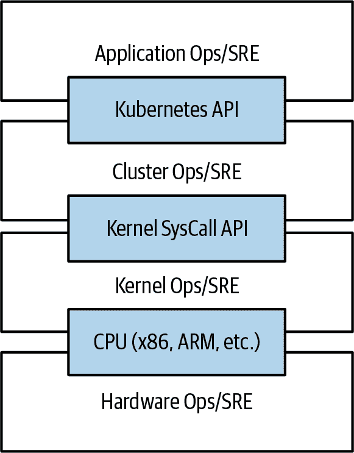

# 第一章：介绍

Kubernetes 是一个用于部署容器化应用程序的开源编排器。它最初由 Google 开发，灵感来自于十年在容器中通过面向应用程序的 API 部署可扩展、可靠系统的经验。^(1)

自 2014 年推出以来，Kubernetes 已经成长为世界上最大和最受欢迎的开源项目之一。它已成为构建云原生应用程序的标准 API，在几乎每个公共云中都可以找到。Kubernetes 是一个经过验证的适用于各种规模云原生开发者的分布式系统基础设施，从一组树莓派计算机到充满最新机器的数据中心。它提供了成功构建和部署可靠、可扩展分布式系统所需的软件支持。

当我们说“可靠、可扩展的分布式系统”时，您可能会想知道我们的意思。越来越多的服务通过 API 在网络上传送。这些 API 通常由*分布式系统*提供支持，实现 API 的各个部分运行在不同的机器上，通过网络连接并通过网络通信协调它们的操作。因为我们日常生活中对这些 API 的依赖越来越多（例如，寻找到最近医院的路线），这些系统必须具备极高的*可靠性*。即使系统的某个部分崩溃或停止工作，它们也不能失败。同样，它们必须在软件部署或其他维护事件期间保持*可用性*。最后，因为越来越多的世界正在上网并使用这类服务，它们必须具备高度*可扩展性*，以便能够根据不断增长的使用需求扩展其容量，而不需要彻底重新设计实现服务的分布式系统。在许多情况下，这还意味着自动增加（和减少）容量，以使您的应用程序能够达到最大效率。

根据您何时以及为何拿起这本书，您对容器、分布式系统和 Kubernetes 可能有不同的经验程度。您可能计划在公共云基础设施、私有数据中心或混合环境中构建应用程序。无论您的经验如何，本书都应能帮助您充分利用 Kubernetes。

人们开始使用容器和像 Kubernetes 这样的容器 API 的原因有很多，但我们认为它们都可以追溯到以下几个好处之一：

+   开发速度

+   扩展（软件和团队）

+   抽象化您的基础设施

+   效率

+   云原生生态系统

在接下来的几节中，我们将描述 Kubernetes 如何帮助提供每个功能。

# 速度

速度是当今几乎所有软件开发的关键组成部分。软件行业已经从以盒装 CD 或 DVD 发货的产品转变为通过网络交付的基于 Web 服务的软件，这些软件每小时更新。这种变化的格局意味着，你和竞争对手之间的差异往往是你开发和部署新组件和功能的速度，或者是你对他人开发的创新作出响应的速度。

然而，需要注意的是，速度并不是简单的原始速度定义。虽然用户始终在寻求迭代改进，但他们更感兴趣的是高度可靠的服务。曾经，服务每晚午夜进行维护关闭是可以接受的。但是今天，所有用户都期望服务始终可用，即使运行的软件不断变化。

因此，速度的衡量不是以每小时或每天可以发布的原始功能数量为准，而是以在保持高度可用服务的同时可以发布的事物数量为准。

因此，容器和 Kubernetes 可以提供您需要快速操作同时保持可用性的工具。实现这一点的核心概念包括：

+   不可变性

+   声明性配置

+   在线自愈系统

+   共享可重用的库和工具

所有这些想法都相互关联，以显著提高您可靠部署新软件的速度。

## 不可变性的价值

容器和 Kubernetes 鼓励开发者构建符合不可变基础设施原则的分布式系统。通过*不可变*基础设施，一旦在系统中创建了一个构件，它就不会通过用户修改而改变。

传统上，计算机和软件系统被视为*可变*基础设施。在可变基础设施中，更改被应用为对现有系统的增量更新。这些更新可以一次性完成，也可以在很长一段时间内分散进行。通过 `apt-get update` 工具进行系统升级是对可变系统的一个很好的例子。运行 `apt` 时，逐个下载任何更新的二进制文件，将它们复制到旧的二进制文件上，并对配置文件进行增量更新。在可变系统中，基础设施的当前状态不是表示为单个构件，而是作为随时间累积的增量更新和变化的累积。在许多系统中，这些增量更新不仅来自系统升级，还来自操作员的修改。此外，在由大型团队运行的任何系统中，很可能这些变更将由许多不同的人执行，并且在许多情况下，这些变更并没有记录在任何地方。

相比之下，在一个不可变系统中，与增量更新和更改的系列相比，一个全新的、完整的镜像被构建，其中更新只需在单个操作中用新镜像替换整个镜像。没有增量变化。可以想象，这与配置管理的传统世界是一个重大的转变。

为了在容器的世界中更具体化，考虑升级软件的两种不同方式：

+   你可以登录到一个容器中，运行一个命令来下载你的新软件，关闭旧服务器，然后启动新的服务器。

+   你可以构建一个新的容器镜像，推送到容器注册表，杀死现有的容器，然后启动一个新的容器。

乍一看，这两种方法可能看起来几乎无法区分。那么是什么让构建一个新的容器镜像提高了可靠性呢？

关键的区别在于你创建的构件，以及如何创建它的记录。这些记录使得能够准确理解某个新版本的差异，如果出现问题，也能确定发生了什么变化以及如何修复它。

此外，构建新镜像而不是修改现有镜像意味着旧镜像仍然存在，并且可以在错误发生时快速用于回滚。相比之下，一旦你将新的二进制文件复制到现有二进制文件上，回滚几乎是不可能的。

不可变容器镜像是你在 Kubernetes 中构建的一切的核心。虽然可以命令式地更改运行中的容器，但这是一种反模式，只应在极端情况下使用（例如，如果这是唯一的临时修复关键生产系统的方法）。即使如此，这些更改也必须在稍后通过声明式配置更新时记录。

## 声明式配置对象

不可变性扩展到在集群中运行的容器以及描述你的应用程序给 Kubernetes 的方式上。在 Kubernetes 中，一切都是*声明式配置对象*，代表系统的期望状态。Kubernetes 的工作是确保实际世界的状态与这个期望状态匹配。

就像可变与不可变基础架构一样，声明式配置是对*命令式*配置的一种替代，其中世界的状态是通过执行一系列指令来定义的，而不是声明世界期望的状态。虽然命令式命令定义了动作，声明式配置定义了状态。

要理解这两种方法，考虑一下生产软件的三个副本的任务。使用命令式方法，配置会说“运行 A，运行 B 和运行 C”。相应的声明式配置将是“副本等于三”。

因为它描述了世界的状态，声明性配置不必执行就能理解。它的影响被明确声明。由于声明性配置的效果可以在执行之前理解，因此声明性配置的错误可能性要少得多。此外，传统的软件开发工具，如源代码控制、代码审查和单元测试，可以以不可能用于命令式指令的方式用于声明性配置。将声明性配置存储在源代码控制中的想法通常被称为“基础设施即代码”。

近来，GitOps 的理念已经开始通过源代码控制正式化基础设施即代码的实践。当您采用 GitOps 时，对生产环境的更改完全通过推送到 Git 仓库来进行，然后通过自动化反映到您的集群中。实际上，您的生产 Kubernetes 集群被视为一个有效的只读环境。此外，GitOps 被越来越多地集成到由云提供的 Kubernetes 服务中，作为管理您的云原生基础设施的最简单方式。

存储在版本控制系统中的声明性状态与 Kubernetes 使现实与这种声明性状态匹配的能力结合起来，使回滚变更变得极为简单。它只是重新声明系统的先前声明状态。这通常对于命令式系统来说是不可能的，因为尽管命令式指令描述了如何从点 A 到点 B，但很少包括可以使您回到原点的反向指令。

## 自我修复系统

Kubernetes 是一个在线的、自我修复的系统。当它接收到期望的状态配置时，不只是单次地执行一组操作使当前状态与期望状态匹配。它**持续**地执行操作，确保当前状态始终与期望状态一致。这意味着 Kubernetes 不仅会初始化您的系统，还会防范可能会破坏系统稳定性和可靠性的任何故障或干扰。

更传统的操作员修复方式包括一系列手动的缓解步骤，或者对某种警报进行人工干预。这样的命令式修复更昂贵（因为通常需要值班操作员随时待命进行修复）。而且通常更慢，因为人类必须经常唤醒并登录以响应。此外，它也不太可靠，因为命令式修复操作序列具有前一节中描述的所有命令式管理问题。像 Kubernetes 这样的自我修复系统通过更快、更可靠地执行可靠的修复操作，不仅减轻了操作员的负担，还提高了系统的整体可靠性。

作为这种自我修复行为的一个具体例子，如果您向 Kubernetes 断言一个期望状态为三个副本，它不仅仅创建三个副本 —— 它会持续确保恰好有三个副本。如果您手动创建第四个副本，Kubernetes 将销毁一个以确保数量恢复到三个。如果您手动销毁一个副本，Kubernetes 将创建一个副本以再次将您带回到期望的状态。

在线自我修复系统提高了开发人员的速度，因为您本来可能花在运营和维护上的时间和精力可以用来开发和测试新功能。

在 Kubernetes 的*操作员*范式中，有了更高级的自我修复形式。使用操作员，编码进入集群中作为容器运行的操作员应用程序中的更高级逻辑，以维护、扩展和修复特定软件（例如 MySQL）。操作员中的代码负责比 Kubernetes 的通用自我修复更具针对性和高级的健康检测和修复。通常这被打包成“操作员”，这些在第十七章中有所讨论。

# 扩展您的服务和团队

随着产品的增长，您需要扩展开发它的软件和团队是不可避免的。幸运的是，Kubernetes 可以帮助实现这两个目标。Kubernetes 通过偏爱*解耦*架构来实现可伸缩性。

## 解耦

在解耦架构中，每个组件通过定义的 API 和服务负载均衡器与其他组件分离。API 和负载均衡器将系统的每个部分隔离开来。API 提供了实施者和使用者之间的缓冲，负载均衡器为每个服务的运行实例之间提供了一个缓冲区。

通过负载均衡器解耦组件使得可以轻松扩展构成您服务的程序，因为增加程序的规模（因此增加了容量）可以在不调整或重新配置服务的任何其他层的情况下完成。

通过 API 解耦服务器使得扩展开发团队变得更容易，因为每个团队可以专注于单个、更小的*微服务*，其可理解的表面积。清晰的微服务之间的 API 限制了构建和部署软件所需的跨团队通信开销。这种通信开销通常是扩展团队时的主要限制因素。

## 应用程序和集群的轻松扩展

具体来说，当你需要扩展你的服务时，Kubernetes 的不可变声明性质使得这种扩展变得轻而易举。因为你的容器是不可变的，并且副本的数量仅仅是配置文件中的一个数字，将服务扩展至更大规模只需要改变配置文件中的一个数字，声明这种新的状态给 Kubernetes，然后让它处理其余的工作。另外，你也可以设置自动扩展，让 Kubernetes 来处理。

当然，这种缩放方式假定你的集群有足够的资源可供使用。有时候，实际上需要扩展集群本身。同样，Kubernetes 使得这项任务更加简单。由于集群中的许多机器与该集合中的其他机器完全相同，并且应用程序本身通过容器与机器的具体细节解耦，因此向集群添加额外的资源只是将一个新的同类机器映像并加入集群的简单任务。这可以通过几个简单的命令或预制的机器映像来完成。

扩展机器资源的一个挑战是预测它们的使用情况。如果你在物理基础设施上运行，获取新机器的时间以天数或周数来计算。在物理和云基础设施上，预测未来的成本很困难，因为很难预测特定应用程序的增长和扩展需求。

Kubernetes 可以简化预测未来的计算成本。要理解这一点为何成立，请考虑将 A、B 和 C 三个团队进行扩展：历史上你会看到每个团队的增长高度不确定，因此难以预测。如果为每个服务预留单独的机器，你只能根据每个服务的最大预期增长进行预测，因为专用于一个团队的机器无法用于另一个团队。相反，如果使用 Kubernetes 将团队与它们使用的具体机器解耦，你可以基于所有三个服务的总体增长来预测增长。将三个变化率合并为单一增长率可以减少统计噪声，并产生更可靠的预期增长预测。此外，将团队与特定机器解耦意味着团队可以共享彼此机器的部分资源，进一步降低了计算资源增长预测所带来的开销。

最后，Kubernetes 使得资源可以自动扩展（扩展和收缩）。特别是在云环境中，可以通过 API 创建新的机器，结合 Kubernetes 和应用程序以及集群本身的自动缩放，意味着你可以根据当前负载始终调整你的成本。

## 使用微服务扩展开发团队

据多种研究指出，理想的团队规模是“两块披萨团队”，大约六到八人。这种团队规模通常会促进良好的知识共享、快速决策以及共同的目标感。而较大的团队往往会遭受层级问题、能见度不足和内讧等问题，这些问题会阻碍敏捷性和成功。

然而，许多项目需要更多的资源才能成功实现其目标。因此，敏捷性的理想团队规模与产品最终目标所需团队规模之间存在紧张关系。

解决这种紧张关系的常见方法是开发独立、面向服务的团队，每个团队负责构建一个单一的微服务。每个小团队负责设计和交付一个被其他小团队消费的服务。所有这些服务的聚合最终提供了整体产品表面的实现。

Kubernetes 提供了多种抽象和 API，使得构建这些独立的微服务架构变得更加容易：

+   *Pods*，或者说是容器组，可以将由不同团队开发的容器镜像组合成一个可部署的单元。

+   Kubernetes *服务* 提供负载均衡、命名和发现功能，以隔离一个微服务与另一个微服务。

+   *命名空间* 提供了隔离和访问控制，以便每个微服务可以控制其他服务与其交互的程度。

+   *入口* 对象提供了一个易于使用的前端，可以将多个微服务组合成单个外部化的 API 表面。

最后，解耦应用程序容器镜像和机器意味着不同的微服务可以共同部署在同一台机器上而不会相互干扰，从而降低微服务架构的开销和成本。Kubernetes 的健康检查和部署功能保证了应用程序部署和可靠性的一致方法，确保微服务团队的增加不会导致服务生产生命周期和运维的不同方法大量增加。

## 一致性和扩展的关注点分离

除了 Kubernetes 带来的运营一致性之外，Kubernetes 堆栈产生的解耦和关注点分离显著提高了基础设施的一致性。这使得您能够通过一个小而专注的团队扩展基础设施运营，以管理多台机器。我们已经详细讨论了应用容器与机器/操作系统（OS）的解耦，但这种解耦的一个重要方面是容器编排 API 成为一个清晰的合同，分离了应用操作员和集群编排操作员的责任。我们称之为“不是我的猴子，不是我的马戏团”的界线。应用开发人员依赖容器编排 API 提供的服务级别协议（SLA），而不用担心如何实现这个 SLA 的细节。同样，容器编排 API 可靠性工程师专注于提供编排 API 的 SLA，而不用担心运行在其上的应用程序。

解耦关注点意味着运行 Kubernetes 集群的小团队可以负责支持在该集群内运行的数百甚至数千个团队的应用程序（参见图 1-1）。同样，一个小团队可以负责全球各地运行的数十个（甚至更多）集群。需要注意的是，容器和操作系统的这种解耦使得操作系统可靠性工程师能够专注于单个机器操作系统的 SLA。这成为另一条分离责任的界线，Kubernetes 操作员依赖操作系统的 SLA，而操作系统操作员则专注于交付该 SLA。同样，这使得您能够将一小队操作系统专家扩展到数千台机器的集群。

###### 图 1-1\. 通过 API 解耦不同运营团队的示意图

当然，即使是将一个小团队用于操作系统管理也超出了许多组织的范围。在这些环境中，由公共云提供商提供的托管 Kubernetes 服务（KaaS）是一个很好的选择。随着 Kubernetes 的普及，KaaS 的可用性也越来越高，几乎每个公共云现在都提供这种服务。当然，使用 KaaS 也有一些限制，因为运营商为您做出了关于如何构建和配置 Kubernetes 集群的决策。例如，许多 KaaS 平台禁用了 alpha 特性，因为它们可能会使托管的集群不稳定。

除了完全托管的 Kubernetes 服务之外，还有许多公司和项目构成的蓬勃生态系统帮助安装和管理 Kubernetes。在“硬方式”和完全托管服务之间有完整的解决方案谱系。

因此，是使用 KaaS 还是自己管理（或介于两者之间），是每个用户根据其情况的技能和需求来决定的。通常对于小型组织来说，KaaS 提供了一个易于使用的解决方案，使他们能够将时间和精力集中在构建支持他们工作的软件上，而不是管理一个集群。对于可以承担专门团队来管理其 Kubernetes 集群的大型组织来说，以这种方式管理可能更有意义，因为它能够在集群能力和操作方面提供更大的灵活性。

# 抽象你的基础设施

公共云的目标是为开发人员提供易于使用的自助服务基础设施。然而，云 API 往往是围绕着 IT 期望的基础设施（例如“虚拟机”），而不是开发人员希望消费的概念（例如“应用程序”）来定位的。此外，在许多情况下，云服务还伴随着特定的实施细节或服务，这些细节是特定于云提供商的。直接使用这些 API 使得在多个环境中运行您的应用程序或在云和物理环境之间进行分布变得困难。

使用面向应用的容器 API（如 Kubernetes）有两个具体的好处。首先，正如我们之前描述的那样，它将开发人员与具体的机器分离开来。这使得以机器为中心的 IT 角色更加容易，因为机器可以简单地按照总体来增加以扩展集群，并且在云环境中，它还能够提供高度的可移植性，因为开发人员是在使用一个更高级别的 API，这个 API 是基于特定云基础设施的 API 实现的。

当开发人员基于容器镜像构建其应用程序，并基于可移植的 Kubernetes API 部署它们时，将应用程序迁移到不同环境，甚至在混合环境中运行，只是将声明性配置发送到新集群的问题。Kubernetes 拥有许多插件，可以使您从特定的云中抽象出来。例如，Kubernetes 服务知道如何在所有主要的公共云以及几种不同的私有和物理基础设施上创建负载均衡器。同样，Kubernetes 持久卷和持久卷声明可以用来将您的应用程序与特定的存储实现分离开来。当然，为了实现这种可移植性，您需要避免使用云管理服务（例如 Amazon 的 DynamoDB、Azure 的 Cosmos DB 或 Google 的 Cloud Spanner），这意味着您将被迫部署和管理开源存储解决方案，如 Cassandra、MySQL 或 MongoDB。

总之，基于 Kubernetes 应用程序导向的抽象构建确保您在构建、部署和管理应用程序时投入的努力在各种环境中都是真正可移植的。

# 效率

除了容器和 Kubernetes 提供的开发人员和 IT 管理好处外，抽象化还带来了明显的经济效益。因为开发人员不再考虑机器的问题，他们的应用程序可以共同部署在同一台机器上，而不会影响应用程序本身。这意味着可以将来自多个用户的任务紧密地打包到更少的机器上。

效率可以通过机器或进程执行的有效工作与所花费的总能量的比率来衡量。在部署和管理应用程序时，许多可用的工具和流程（例如 bash 脚本、`apt` 更新或命令式配置管理）有些效率低下。在讨论效率时，通常有助于同时考虑运行服务器的货币成本和管理所需的人力成本。

运行服务器会产生基于功耗、冷却需求、数据中心空间和原始计算能力的成本。一旦服务器安装并上电（或者点击并启动），计费就开始了。任何空闲的 CPU 时间都是浪费金钱。因此，系统管理员有责任保持利用率在可接受的水平，这需要持续的管理。这就是容器和 Kubernetes 工作流发挥作用的地方。Kubernetes 提供的工具自动化分发应用程序到机群上，确保比传统工具更高的利用率。

进一步提高效率的一项措施是，开发人员的测试环境可以快速、廉价地创建为运行在共享 Kubernetes 集群的一组容器（使用名为*命名空间*的功能）。过去，为开发人员启动测试集群可能意味着启动三台机器。有了 Kubernetes，所有开发人员共享单个测试集群变得非常简单，将他们的使用聚合到更少的机器上。进一步减少使用的机器总数从而提高了每个系统的效率：因为每台单独机器上的资源（CPU、内存等）被更多利用，每个容器的整体成本大大降低。

减少堆栈中开发实例的成本使得以前可能成本过高的开发实践变得可行。例如，通过 Kubernetes 部署应用程序，可以考虑部署和测试每个开发人员在整个堆栈中贡献的每个提交。

当每次部署的成本是以少量容器而不是多个完整虚拟机（VMs）的形式衡量时，您为此类测试所需的成本大大降低。回到 Kubernetes 的原始价值，这种增加的测试也增加了速度，因为您具有有关代码可靠性的强信号，以及快速识别问题可能已引入的细节粒度。

最后，如前文所述，使用自动扩展在需要时增加资源，但在不需要时删除资源，也可以用来推动应用程序的整体效率，同时保持其所需的性能特征。

# 云原生生态系统

Kubernetes 从一开始就被设计为一个可扩展的环境和一个广泛而友好的社区。这些设计目标以及它在众多计算环境中的普及，导致了围绕 Kubernetes 形成了一个充满活力和庞大的工具和服务生态系统。跟随 Kubernetes（以及之前的 Docker 和 Linux），大多数这些项目也是开源的。这意味着开发人员在开始构建时无需从头开始。自发布以来的这些年里，几乎为每个任务构建了针对 Kubernetes 的工具，从机器学习到持续开发和无服务器编程模型。事实上，在许多情况下，挑战不在于找到潜在的解决方案，而是决定哪一个解决方案最适合该任务。云原生生态系统中丰富的工具已经成为许多人采用 Kubernetes 的一个重要原因。当您利用云原生生态系统时，您可以使用社区构建和支持的项目来几乎涵盖系统的每个部分，从而让您专注于开发核心业务逻辑和独特的服务。

就像任何开源生态系统一样，主要挑战在于可能的解决方案多样性，以及往往存在端到端集成不足的问题。解决这种复杂性的一种可能方式是依靠云原生计算基金会（CNCF）的技术指导。CNCF 是云原生项目代码和知识产权的行业中立承载机构。它有三个项目成熟度级别，帮助指导你采纳云原生项目。CNCF 中的大多数项目处于 *sandbox* 阶段。Sandbox 表示项目仍处于早期开发阶段，不建议采纳，除非你是早期采纳者或有兴趣为项目开发做贡献。项目成熟度的下一个阶段是 *incubating*。Incubating 项目通过采纳和生产使用已经证明了它们的实用性和稳定性，但它们仍在发展和扩展它们的社区。尽管有数百个 sandbox 项目，但 incubating 项目只有 20 多个。CNCF 项目的最终阶段是 *graduated*。这些项目已经完全成熟并被广泛采用。只有少数几个 graduated 项目，包括 Kubernetes 本身。

通过与 Kubernetes 服务集成，是另一种浏览云原生生态系统的方式。在此阶段，大多数 KaaS 提供的还有来自云原生生态系统的开源项目的额外服务。因为这些服务已经集成到云支持的产品中，你可以放心这些项目是成熟且可用于生产的。

# 总结

Kubernetes 的建立旨在彻底改变应用程序在云中的构建和部署方式。从根本上讲，它被设计为提供开发人员更高的速度、效率和敏捷性。在此时，你每天使用的许多互联网服务和应用程序都在 Kubernetes 之上运行。你可能已经是 Kubernetes 的用户，只是你还不知道！我们希望本章节让你明白为什么应该使用 Kubernetes 部署你的应用程序。既然你已经被说服了，接下来的章节将教你如何部署你的应用程序。

^(1) Brendan Burns 等人，“Borg、Omega 和 Kubernetes：三种容器管理系统十年来的经验教训”，*ACM Queue* 14（2016）：70–93，可在[*https://oreil.ly/ltE1B*](https://oreil.ly/ltE1B)找到。
