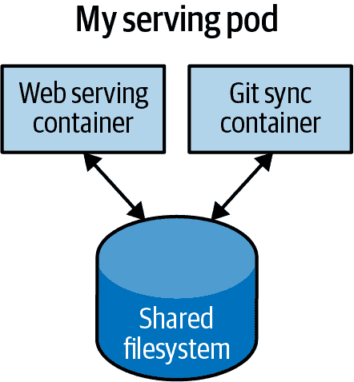

# 第五章：Pods

在早些章节中，我们讨论了如何将应用程序容器化，但在容器化应用程序的实际部署中，通常希望将多个应用程序放置在一个原子单元中，安排到单个机器上。

典型的部署示例如图 Figure 5-1 所示，其中包括一个用于处理 web 请求的容器和一个用于将文件系统与远程 Git 仓库同步的容器。



###### 图 5-1\. 一个包含两个容器和共享文件系统的示例 Pod

起初，将 web 服务器和 Git 同步器包装到单个容器中似乎很诱人。然而，经过更仔细的检查，分离的原因变得很明显。首先，两个容器在资源使用方面有显著不同的要求。例如，内存方面：因为 web 服务器正在为用户请求提供服务，我们希望确保它始终可用和响应迅速。另一方面，Git 同步器并不是面向用户的，其服务质量是“尽力而为”。

假设我们的 Git 同步器存在内存泄漏问题。我们需要确保 Git 同步器不能使用我们想要为 web 服务器使用的内存，因为这可能影响性能甚至导致服务器崩溃。

这种资源隔离正是容器设计要实现的目标。通过将两个应用程序分开到两个独立的容器中，我们可以确保 web 服务器的可靠运行。

当然，这两个容器是相互依存的；在同一台机器上安排 web 服务器和 Git 同步器是没有意义的。因此，Kubernetes 将多个容器组合成一个称为 *Pod* 的原子单元。（这个名字与 Docker 容器的鲸鱼主题一致，因为 Pod 也是鲸鱼的一群。）

###### 注意

尽管最初在 Kubernetes 中将多个容器分组到单个 Pod 中似乎颇具争议或令人困惑，但随后被多种不同的应用程序采纳，以部署其基础设施。例如，几种服务网格实现使用第二个 *sidecar* 容器来将网络管理注入应用程序的 Pod 中。

# Kubernetes 中的 Pods

一个 Pod 是运行在同一执行环境中的应用程序容器和卷的集合。在 Kubernetes 集群中，Pods 而不是容器是最小的可部署构件。这意味着 Pod 中的所有容器总是运行在同一台机器上。

Pod 中的每个容器都在自己的 cgroup 中运行，但它们共享多个 Linux 命名空间。

在同一个 Pod 中运行的应用程序共享相同的 IP 地址和端口空间（网络命名空间），拥有相同的主机名（UTS 命名空间），并可以使用 System V IPC 或 POSIX 消息队列（IPC 命名空间）进行本地进程间通信。然而，不同 Pod 中的应用程序是相互隔离的；它们拥有不同的 IP 地址、主机名等。在同一节点上运行的不同 Pods 中的容器实际上可能位于不同的服务器上。

# 用 Pods 思考

当人们在采用 Kubernetes 时，最常见的问题之一是“我应该在一个 Pod 中放什么？”

有时人们看到 Pods 并认为：“啊哈！一个 WordPress 容器和一个 MySQL 数据库容器结合在一起形成一个 WordPress 实例。它们应该放在同一个 Pod 中。” 然而，这种类型的 Pod 实际上是 Pod 构建的反模式示例。这有两个原因。首先，WordPress 和它的数据库并不是真正共生的。如果 WordPress 容器和数据库容器落在不同的机器上，它们仍然可以通过网络连接有效地进行通信。其次，你并不一定希望将 WordPress 和数据库作为一个单元进行扩展。WordPress 本身大部分是无状态的，因此你可能希望根据前端负载来扩展 WordPress 前端，创建更多的 WordPress Pods。扩展 MySQL 数据库要复杂得多，你更有可能增加单个 MySQL Pod 的资源。如果你将 WordPress 和 MySQL 容器放在同一个 Pod 中，你将被迫使用相同的扩展策略，这并不合适。

一般来说，在设计 Pods 时要问自己的正确问题是：“如果这些容器落在不同的机器上，它们是否能正常工作？” 如果答案是否定的，将容器放在同一个 Pod 中是正确的选择。如果答案是肯定的，使用多个 Pods 可能是正确的解决方案。在本章开头的示例中，这两个容器通过本地文件系统进行交互。如果这些容器被调度到不同的机器上，它们将无法正确运行。

在本章的剩余部分中，我们将描述如何在 Kubernetes 中创建、审视、管理和删除 Pods。

# Pod 清单

Pods 在一个 Pod *清单* 中描述，这只是 Kubernetes API 对象的文本文件表示。Kubernetes 强烈信奉 *声明式配置*，这意味着你在配置文件中写下世界的期望状态，然后将该配置提交给一个服务，该服务会采取行动确保期望状态成为实际状态。

###### 注意

声明性配置不同于*命令式配置*，在后者中，您只需执行一系列操作（例如`apt-get install foo`）来修改系统状态。多年的生产经验告诉我们，保持系统期望状态的书面记录可以使系统更易管理、更可靠。声明性配置有诸多优势，如使配置能够进行代码审查，并为分布式团队记录系统的当前状态。此外，它是 Kubernetes 中所有自我修复行为的基础，这些行为能够使应用程序在无用户干预的情况下保持运行。

Kubernetes API 服务器在将 Pod 清单存储到持久存储（`etcd`）之前接受并处理它们。调度器还使用 Kubernetes API 查找尚未调度到节点的 Pod。然后，根据 Pod 清单中表达的资源和其他约束条件，将 Pod 放置在节点上。调度器可以将多个 Pod 放置在同一台机器上，只要资源充足。然而，将同一应用程序的多个副本调度到同一台机器上对可靠性不利，因为机器是单一故障域。因此，Kubernetes 调度器尝试确保同一应用程序的 Pod 被分布到不同的机器上，以增强在这种故障情况下的可靠性。一旦调度到节点上，Pod 就不会移动，必须显式销毁和重新调度。

可以通过重复此处描述的工作流部署 Pod 的多个实例。但是，复制集（第九章）更适合运行 Pod 的多个实例。（事实证明它们在运行单个 Pod 时也更好，但我们稍后再详细介绍。）

## 创建 Pod

创建 Pod 的最简单方式是通过命令式的`kubectl run`命令。例如，要运行我们的同一个`kuard`服务器，请使用：

```
$ kubectl run kuard --generator=run-pod/v1 \
  --image=gcr.io/kuar-demo/kuard-amd64:blue
```

您可以通过运行以下命令查看此 Pod 的状态：

```
$ kubectl get pods
```

最初，您可能会看到容器状态为`Pending`，但最终您将看到它转换为`Running`，这意味着 Pod 及其容器已成功创建。

目前，您可以通过运行以下命令删除此 Pod：

```
$ kubectl delete pods/kuard
```

现在我们将继续手动编写完整的 Pod 清单。

## 创建 Pod 清单

您可以使用 YAML 或 JSON 编写 Pod 清单，但通常更喜欢使用 YAML，因为它稍微更容易人工编辑并支持注释。 Pod 清单（以及其他 Kubernetes API 对象）应该像对待源代码一样，而注释之类的内容有助于向新团队成员解释 Pod。

Pod 清单包括几个关键字段和属性：即描述 Pod 及其标签的`metadata`部分，描述卷的`spec`部分以及将在 Pod 中运行的容器列表。

在第二章中，我们使用以下 Docker 命令部署了`kuard`：

```
$ docker run -d --name kuard \
  --publish 8080:8080 \
  gcr.io/kuar-demo/kuard-amd64:blue
```

您也可以通过将 示例 5-1 写入名为 *kuard-pod.yaml* 的文件中，然后使用 `kubectl` 命令将该清单加载到 Kubernetes 中，从而实现类似的结果。

##### 示例 5-1\. kuard-pod.yaml

```
apiVersion: v1
kind: Pod
metadata:
  name: kuard
spec:
  containers:
    - image: gcr.io/kuar-demo/kuard-amd64:blue
      name: kuard
      ports:
        - containerPort: 8080
          name: http
          protocol: TCP
```

虽然最初以这种方式管理应用可能会显得更加繁琐，但是这种期望状态的书面记录在长期来看是最佳实践，特别是对于具有多个应用程序的大型团队。

# 正在运行的 Pods

在前一节中，我们创建了一个 Pod 清单，可用于启动运行 `kuard` 的 Pod。使用 `kubectl apply` 命令启动 `kuard` 的单个实例：

```
$ kubectl apply -f kuard-pod.yaml
```

Pod 清单将被提交到 Kubernetes API 服务器。然后，Kubernetes 系统将安排该 Pod 在集群中的健康节点上运行，其中 `kubelet` 守护进程将对其进行监控。如果您现在不理解 Kubernetes 的所有组成部分，不要担心；我们将在本书中更详细地讨论这些内容。

## 列出 Pods

现在我们有一个正在运行的 Pod，让我们去了解更多信息。使用 `kubectl` 命令行工具，我们可以列出在集群中运行的所有 Pods。目前，这应该只是我们在上一步创建的单个 Pod：

```
$ kubectl get pods
NAME       READY     STATUS    RESTARTS   AGE
kuard      1/1       Running   0          44s
```

您可以看到 Pod 的名称 (`kuard`)，这是我们在前面的 YAML 文件中指定的。除了准备就绪的容器数量 (`1/1`) 外，输出还显示了状态、Pod 重新启动次数以及 Pod 的年龄。

如果在 Pod 创建后立即运行此命令，您可能会看到：

```
NAME       READY     STATUS    RESTARTS   AGE
kuard      0/1       Pending   0          1s
```

`Pending` 状态表示 Pod 已被提交但尚未安排。如果发生更大的错误，例如尝试创建一个不存在容器镜像的 Pod，它也将在状态字段中列出。

###### 注意

默认情况下，`kubectl` 命令行工具在报告信息时是简洁的，但您可以通过命令行标志获取更多信息。在任何 `kubectl` 命令中添加 `-o wide` 将会打印出略多一些的信息（同时保持信息在单行）。添加 `-o json` 或 `-o yaml` 将分别以 JSON 或 YAML 格式打印完整的对象。如果您想看到 `kubectl` 正在执行的详尽详细日志记录，可以添加 `--v=10` 标志进行全面的日志记录，尽管这会牺牲可读性。

## Pod 详细信息

有时，单行视图不足以说明问题，因为它过于简洁。此外，Kubernetes 在事件流中维护了许多关于 Pods 的事件，这些事件并未附加到 Pod 对象上。

要了解有关 Pod（或任何 Kubernetes 对象）的更多信息，您可以使用 `kubectl describe` 命令。例如，要描述我们之前创建的 Pod，您可以运行：

```
$ kubectl describe pods kuard
```

这将在不同的部分输出有关 Pod 的大量信息。顶部是关于 Pod 的基本信息：

```
Name:           kuard
Namespace:      default
Node:           node1/10.0.15.185
Start Time:     Sun, 02 Jul 2017 15:00:38 -0700
Labels:         <none>
Annotations:    <none>
Status:         Running
IP:             192.168.199.238
Controllers:    <none>
```

然后是关于在 Pod 中运行的容器的信息：

```
Containers:
  kuard:
    Container ID:  docker://055095...
    Image:         gcr.io/kuar-demo/kuard-amd64:blue
    Image ID:      docker-pullable://gcr.io/kuar-demo/kuard-amd64@sha256:a580...
    Port:          8080/TCP
    State:         Running
      Started:     Sun, 02 Jul 2017 15:00:41 -0700
    Ready:         True
    Restart Count: 0
    Environment:   <none>
    Mounts:
      /var/run/secrets/kubernetes.io/serviceaccount from default-token-cg5f5 (ro)
```

最后，与 Pod 相关的事件，例如其被调度的时间，其镜像被拉取的时间，以及如果/当由于健康检查失败而必须重新启动的时间：

```
Events:
  Seen From              SubObjectPath           Type      Reason    Message
  ---- ----              -------------           --------  ------    -------
  50s  default-scheduler                         Normal    Scheduled Success...
  49s  kubelet, node1    spec.containers{kuard}  Normal    Pulling   pulling...
  47s  kubelet, node1    spec.containers{kuard}  Normal    Pulled    Success...
  47s  kubelet, node1    spec.containers{kuard}  Normal    Created   Created...
  47s  kubelet, node1    spec.containers{kuard}  Normal    Started   Started...
```

## 删除 Pod

当需要删除一个 Pod 时，可以通过名称删除它：

```
$ kubectl delete pods/kuard
```

或者您可以使用创建它时使用的同一文件：

```
$ kubectl delete -f kuard-pod.yaml
```

当删除一个 Pod 时，它*不*会立即被终止。相反，如果运行 `kubectl get pods`，您会看到 Pod 处于`Terminating`状态。所有 Pod 都有一个终止*宽限期*。默认情况下，这是 30 秒。当 Pod 转换为`Terminating`状态时，它不再接收新请求。在服务场景中，宽限期对可靠性很重要，因为它允许 Pod 在终止之前完成正在处理的任何活动请求。

###### 警告

删除一个 Pod 时，与该 Pod 相关的容器中存储的任何数据也将被删除。如果要在多个 Pod 实例之间持久保存数据，需要使用本章末尾描述的持久卷。

# 访问您的 Pod

现在您的 Pod 正在运行，出于各种原因您可能想要访问它。您可能想要加载运行在 Pod 中的 web 服务。您可能希望查看其日志以调试您正在看到的问题，甚至在 Pod 内执行其他命令以帮助调试。以下各节详细介绍了您可以与运行在 Pod 中的代码和数据进行交互的各种方式。

## 使用日志获取更多信息

当您的应用程序需要调试时，能够比`describe`更深入地了解应用程序正在执行的操作是很有帮助的。Kubernetes 提供了两个命令用于调试正在运行的容器。`kubectl logs` 命令会从运行实例下载当前的日志：

```
$ kubectl logs kuard
```

添加 `-f` 标志将导致日志连续流式传输。

`kubectl logs` 命令始终尝试获取当前正在运行的容器的日志。添加 `--previous` 标志将获取先前容器实例的日志。例如，在容器启动时由于问题而持续重启时，这是有用的。

###### 注意

虽然在生产环境中偶尔使用`kubectl logs`进行容器调试很有用，但通常最好使用日志聚合服务。有几种开源的日志聚合工具，如 Fluentd 和 Elasticsearch，以及众多的云日志提供商。这些日志聚合服务提供更大的日志存储容量和更长的日志持续时间，以及丰富的日志搜索和过滤功能。许多还提供从多个 Pod 聚合日志到单个视图的能力。

## 使用 exec 在您的容器中运行命令

有时日志不足以提供足够的信息，要真正确定发生了什么，您需要在容器本身的上下文中执行命令。为此，您可以使用：

```
$ kubectl exec kuard -- date
```

您还可以通过添加 `-it` 标志获得交互式会话：

```
$ kubectl exec -it kuard -- ash
```

## 复制文件到容器和从容器复制文件

在上一章中，我们展示了如何使用`kubectl cp`命令访问 Pod 中的文件。一般来说，将文件复制到容器是一种反模式。你真的应该将容器的内容视为不可变的。但偶尔这是停止出血并恢复服务健康的最直接方法，因为比构建、推送和部署新镜像更快。然而，一旦停止出血，立即进行镜像构建和部署非常重要，否则你可能会忘记你对容器做出的本地更改，并在后续的定期部署中覆盖它。

# 健康检查

当你将应用程序作为一个容器在 Kubernetes 中运行时，它会自动通过*进程健康检查*保持活动状态。这种健康检查简单地确保你的应用程序的主进程一直在运行。如果不是，Kubernetes 将重新启动它。

然而，在大多数情况下，简单的进程检查是不够的。例如，如果你的进程陷入了死锁并且无法响应请求，进程健康检查仍会认为你的应用程序是健康的，因为它的进程仍在运行。

为了解决这个问题，Kubernetes 引入了应用程序**存活性**健康检查。存活性健康检查运行应用程序特定的逻辑，比如加载一个网页，来验证应用程序不仅仅是在运行，而且是正常运行的。由于这些存活性健康检查是应用程序特定的，你必须在你的 Pod 清单中定义它们。

## 存活探针

一旦`kuard`进程启动并运行，我们需要一种方法来确认它实际上是健康的，不应该重新启动。存活性探针是针对每个容器定义的，这意味着 Pod 中的每个容器都单独进行健康检查。在示例 5-2 中，我们为`kuard`容器添加了一个存活性探针，它对我们容器中的`/healthy`路径运行了一个 HTTP 请求。

##### 示例 5-2\. kuard-pod-health.yaml

```
apiVersion: v1
kind: Pod
metadata:
  name: kuard
spec:
  containers:
    - image: gcr.io/kuar-demo/kuard-amd64:blue
      name: kuard
      livenessProbe:
        httpGet:
          path: /healthy
          port: 8080
        initialDelaySeconds: 5
        timeoutSeconds: 1
        periodSeconds: 10
        failureThreshold: 3
      ports:
        - containerPort: 8080
          name: http
          protocol: TCP
```

前面的 Pod 清单使用`httpGet`探针对`kuard`容器的 8080 端口上的`/healthy`端点执行 HTTP `GET`请求。该探针设置了`initialDelaySeconds`为`5`，因此在 Pod 中的所有容器创建后将在 5 秒后调用。探针必须在 1 秒的超时时间内响应，并且 HTTP 状态码必须大于或等于 200 且小于 400 才算是成功。Kubernetes 将每 10 秒调用一次该探针。如果连续失败的探针超过三次，容器将失败并重新启动。

你可以通过查看`kuard`状态页面来看到这个过程。使用这个清单创建一个 Pod，然后进行端口转发到该 Pod：

```
$ kubectl apply -f kuard-pod-health.yaml
$ kubectl port-forward kuard 8080:8080
```

将浏览器指向*http://localhost:8080*。点击“活跃性探测”选项卡。您应该看到一个列出此`kuard`实例接收到的所有探测器的表格。如果在该页面上点击“失败”链接，`kuard`将开始失败的健康检查。等待足够长的时间，Kubernetes 将重新启动容器。此时，显示将重置并重新开始。可以通过运行命令`kubectl describe pods kuard`找到重新启动的详细信息。 "事件"部分将包含类似以下文本：

```
Killing container with id docker://2ac946...:pod "kuard_default(9ee84...)"
container "kuard" is unhealthy, it will be killed and re-created.
```

###### 注意

尽管对于失败的活跃性检查的默认响应是重新启动 Pod，但实际行为受 Pod 的`restartPolicy`管理。重启策略有三个选项：`Always`（默认），`OnFailure`（仅在活跃性失败或非零进程退出代码时重新启动），或`Never`。

## 就绪性探测

当然，活跃性不是我们想执行的唯一一种健康检查。Kubernetes 区分*liveness*和*readiness*。活跃性确定应用程序是否正常运行。未通过活跃性检查的容器将被重新启动。就绪性描述容器何时准备好为用户请求提供服务。未通过就绪性检查的容器将从服务负载均衡器中移除。就绪性探测与活跃性探测配置类似。我们在第七章详细探讨 Kubernetes 服务。

结合就绪性和活跃性探测有助于确保集群中只运行健康的容器。

## 启动探测

Startup probes 作为管理启动缓慢容器的替代方式，最近被引入到 Kubernetes 中。当一个 Pod 启动时，启动探测器在任何其他探测之前运行。启动探测器持续进行，直到超时（此时 Pod 将被重启）或成功为止，此时活跃性探测接管。启动探测器使您能够在缓慢启动容器时慢慢轮询，同时在缓慢启动容器初始化后进行响应灵活的活跃性检查。

## 高级探测器配置

Kubernetes 中的探测器有许多高级选项，包括在 Pod 启动后等待多长时间开始探测，认定多少次失败为真正失败，以及多少次成功必须重置失败计数。所有这些配置在未指定时接收默认值，但对于诸如固有不稳定或启动时间较长的应用程序等更高级用例可能是必要的。

## 其他类型的健康检查

除了 HTTP 检查之外，Kubernetes 还支持`tcpSocket`健康检查，打开 TCP 套接字；如果连接成功，则探测器成功。这种探测器样式适用于非 HTTP 应用程序，例如数据库或其他非基于 HTTP 的 API。

最后，Kubernetes 允许 `exec` 探针。这些在容器的上下文中执行脚本或程序。按照典型约定，如果此脚本返回零退出代码，则探针成功；否则，它失败。`exec` 脚本通常用于不适合简单 HTTP 调用的自定义应用程序验证逻辑。

# 资源管理

大多数人转向像 Kubernetes 这样的容器和编排器，因为它们在图像打包和可靠部署方面显著提升。除了简化分布式系统开发的面向应用程序的原语外，同样重要的是它们允许你增加构成集群的计算节点的总体利用率。无论是虚拟还是物理机器，操作的基本成本基本上是恒定的，无论它是空闲还是完全负载。因此，确保这些机器尽可能活跃，可以增加在基础设施上花费的每一美元的效率。

通常，我们用利用率指标来衡量这种效率。*利用率*定义为正在使用的资源量除以已购买的资源量。例如，如果你购买了一个单核机器，你的应用程序使用了十分之一的核心，那么你的利用率为 10%。通过像 Kubernetes 这样的调度系统管理资源打包，你可以将利用率提高到超过 50%。为了实现这一点，你必须告诉 Kubernetes 应用程序需要的资源，以便 Kubernetes 可以找到将容器最优地打包到机器上的方法。

Kubernetes 允许用户指定两种不同的资源指标。资源*请求*指定运行应用程序所需的最小资源量。资源*限制*指定应用程序可以消耗的最大资源量。让我们在接下来的章节中更详细地看看这些内容。

Kubernetes 识别许多不同的资源指定符号，从字面值（“12345”）到毫核（“100m”）。重要的是注意 MB/GB/PB 和 MiB/GiB/PiB 之间的区别。前者是熟悉的二次幂单位（例如，1 MB == 1,024 KB），而后者是十次幂单位（1 MiB == 1000 KiB）。

###### 注意

错误的常见来源是通过小写的*m*指定毫单位，与通过大写的*M*指定兆单位相比。具体来说，“400m”是 0.4 MB，而不是 400Mb，这是一个显著的区别！

## 资源请求：最小要求资源

当一个 Pod 请求其容器运行所需的资源时，Kubernetes 保证这些资源对该 Pod 可用。最常请求的资源是 CPU 和内存，但 Kubernetes 也支持其他类型的资源，比如 GPU。例如，如果要求 `kuard` 容器在一个拥有半个 CPU 空闲和分配了 128 MB 内存的机器上运行，我们可以按照 示例 5-3 中定义的 Pod 进行设置。

##### 示例 5-3\. kuard-pod-resreq.yaml

```
apiVersion: v1
kind: Pod
metadata:
  name: kuard
spec:
  containers:
    - image: gcr.io/kuar-demo/kuard-amd64:blue
      name: kuard
      resources:
        requests:
          cpu: "500m"
          memory: "128Mi"
      ports:
        - containerPort: 8080
          name: http
          protocol: TCP
```

###### 注意

资源请求是针对每个容器而不是每个 Pod 进行的。Pod 请求的总资源是所有容器中所有请求的资源的总和，因为不同的容器通常具有非常不同的 CPU 需求。例如，如果一个 Pod 包含一个 Web 服务器和数据同步器，Web 服务器面向用户，可能需要大量 CPU，而数据同步器可以使用很少的 CPU。

在将 Pod 调度到节点时使用请求。Kubernetes 调度器将确保节点上所有 Pod 的所有请求的总和不超过节点的容量。因此，当在节点上运行时，Pod 至少保证具有请求的资源。重要的是，“请求”指定了一个最小值。它并不指定 Pod 可能使用的资源的最大限制。为了探索其含义，让我们看一个例子。

假设一个容器的代码尝试使用所有可用的 CPU 核心。假设我们创建了一个此容器的 Pod，请求了 0.5 CPU。Kubernetes 将此 Pod 调度到一个总共有 2 CPU 核心的机器上。只要它是机器上唯一的 Pod，它将消耗所有 2.0 个可用的核心，尽管只请求了 0.5 CPU。

如果第二个具有相同容器和相同请求的 0.5 CPU 的 Pod 着陆在机器上，那么每个 Pod 将会收到 1.0 个核心。如果调度了第三个相同的 Pod，每个 Pod 将收到 0.66 个核心。最后，如果调度了第四个相同的 Pod，每个 Pod 将收到其请求的 0.5 个核心，并且节点将达到容量上限。

CPU 请求使用 Linux 内核中的 `cpu-shares` 功能实现。

###### 注意

内存请求类似于 CPU，但有一个重要的区别。如果容器超过其内存请求，操作系统不能简单地从进程中移除内存，因为它已经被分配了。因此，当系统内存耗尽时，`kubelet` 将终止那些内存使用超过其请求内存的容器。这些容器会自动重启，但在机器上可用的内存少了，容器可以消耗的内存也减少了。

由于资源请求保证了 Pod 的资源可用性，因此在高负载情况下，它们对确保容器具有足够的资源至关重要。

## 通过限制资源使用

除了设置 Pod 所需的资源（以确保其最少可用资源），还可以通过资源*限制*设置其资源使用的最大值。

在我们之前的例子中，我们创建了一个 `kuard` Pod，它请求了最少 0.5 个核心和 128 MB 的内存。在 示例 5-4 中的 Pod 配置中，我们扩展了这个配置，添加了 1.0 个 CPU 和 256 MB 的内存的限制。

##### 示例 5-4\. kuard-pod-reslim.yaml

```
apiVersion: v1
kind: Pod
metadata:
  name: kuard
spec:
  containers:
    - image: gcr.io/kuar-demo/kuard-amd64:blue
      name: kuard
      resources:
        requests:
          cpu: "500m"
          memory: "128Mi"
        limits:
          cpu: "1000m"
          memory: "256Mi"
      ports:
        - containerPort: 8080
          name: http
          protocol: TCP
```

当您在容器上设定限制时，内核会配置以确保消耗不会超过这些限制。例如，具有 0.5 核心 CPU 限制的容器将始终只能获得 0.5 核心，即使 CPU 处于空闲状态。具有 256 MB 内存限制的容器将不允许额外的内存使用；例如，如果其内存使用超过 256 MB，`malloc` 将会失败。

# 使用卷持久化数据

当 Pod 被删除或容器重新启动时，容器文件系统中的任何和所有数据也将被删除。这通常是一件好事，因为您不希望保留由无状态 Web 应用程序写入的杂物。在其他情况下，访问持久磁盘存储是健康应用程序的重要组成部分。Kubernetes 模型支持持久存储。

## 使用卷与 Pod

要向 Pod 清单添加卷，需要在我们的配置中添加两个新的部分。第一个是新的 `spec.volumes` 部分。此数组定义了 Pod 清单中容器可以访问的所有卷。需要注意的是，并非所有容器都需要挂载 Pod 中定义的所有卷。第二个增加的是容器定义中的 `volumeMounts` 数组。此数组定义了挂载到特定容器中的卷及每个卷应挂载到的路径。请注意，Pod 中的两个不同容器可以将同一卷挂载到不同的挂载路径上。

示例 5-5 中的清单定义了一个名为 `kuard-data` 的新卷，`kuard` 容器将其挂载到 `/data` 路径。

##### 示例 5-5\. kuard-pod-vol.yaml

```
apiVersion: v1
kind: Pod
metadata:
  name: kuard
spec:
  volumes:
    - name: "kuard-data"
      hostPath:
        path: "/var/lib/kuard"
  containers:
    - image: gcr.io/kuar-demo/kuard-amd64:blue
      name: kuard
      volumeMounts:
        - mountPath: "/data"
          name: "kuard-data"
      ports:
        - containerPort: 8080
          name: http
          protocol: TCP
```

## 使用卷与 Pod 的不同方式

您可以在应用程序中使用数据的各种方式。以下是一些这些方式及 Kubernetes 推荐的模式：

通信/同步

在 Pod 的第一个示例中，我们看到两个容器使用共享卷来提供站点，并将其同步到远程 Git 位置（图 5-1）。为了实现这一点，Pod 使用了一个 `emptyDir` 卷。这样的卷仅限于 Pod 的生命周期，但可以在两个容器之间共享，为我们的 Git 同步和 Web 服务容器之间的通信奠定了基础。

缓存

应用程序可能会使用性能优越但不是应用程序正确运行所必需的卷。例如，应用程序可能会保留大图像的预渲染缩略图。当然，可以从原始图像重新构建这些缩略图，但这样做会增加提供缩略图的成本。您希望这样的缓存在由于健康检查失败导致容器重新启动时仍然存在，因此 `emptyDir` 也非常适合缓存使用场景。

持久化数据

有时您将使用卷来存储真正持久的数据，即与特定 Pod 寿命无关的数据，并且如果节点失败或 Pod 移动到不同的机器，则应在集群中移动。为了实现这一点，Kubernetes 支持各种远程网络存储卷，包括广泛支持的协议如 NFS 和 iSCSI，以及云提供商的网络存储如 Amazon Elastic Block Store、Azure File 和 Azure Disk，以及 Google 的持久磁盘。

挂载主机文件系统

其他应用程序实际上不需要持久卷，但它们确实需要访问底层主机文件系统的某些内容。例如，它们可能需要访问*/dev*文件系统，以便对系统上的设备进行原始块级访问。对于这些情况，Kubernetes 支持`hostPath`卷类型，该卷可以将工作节点上的任意位置挂载到容器中。示例 5-5 使用了`hostPath`卷类型。所创建的卷是主机上的*/var/lib/kuard*。

这里是使用 NFS 服务器的示例：

```
...
# Rest of pod definition above here
volumes:
    - name: "kuard-data"
      nfs:
        server: my.nfs.server.local
        path: "/exports"
```

持久卷是一个深入的主题。第十六章对该主题进行了更深入的探讨。

# 将所有内容整合在一起

许多应用程序是有状态的，因此我们必须保留任何数据并确保能够访问底层存储卷，无论应用程序在哪台机器上运行。正如我们之前所见，可以通过使用由网络附加存储支持的持久卷来实现这一点。我们还希望确保应用程序的健康实例始终运行，这意味着我们希望在将运行`kuard`的容器暴露给客户端之前，确保该容器准备就绪。

通过持久卷、就绪和存活探针以及资源限制的组合，Kubernetes 提供了运行有状态应用程序所需的一切。示例 5-6 将所有内容整合到一个清单中。

##### 示例 5-6\. kuard-pod-full.yaml

```
apiVersion: v1
kind: Pod
metadata:
  name: kuard
spec:
  volumes:
    - name: "kuard-data"
      nfs:
        server: my.nfs.server.local
        path: "/exports"
  containers:
    - image: gcr.io/kuar-demo/kuard-amd64:blue
      name: kuard
      ports:
        - containerPort: 8080
          name: http
          protocol: TCP
      resources:
        requests:
          cpu: "500m"
          memory: "128Mi"
        limits:
          cpu: "1000m"
          memory: "256Mi"
      volumeMounts:
        - mountPath: "/data"
          name: "kuard-data"
      livenessProbe:
        httpGet:
          path: /healthy
          port: 8080
        initialDelaySeconds: 5
        timeoutSeconds: 1
        periodSeconds: 10
        failureThreshold: 3
      readinessProbe:
        httpGet:
          path: /ready
          port: 8080
        initialDelaySeconds: 30
        timeoutSeconds: 1
        periodSeconds: 10
        failureThreshold: 3
```

本章的过程中，Pod 的定义已经增加。为您的应用程序添加的每个新功能也将为其定义添加一个新的部分。

# 总结

Pod 在 Kubernetes 集群中代表工作的原子单位。它们由一个或多个容器共同协作而组成。要创建一个 Pod，您需要编写一个 Pod 清单，并通过命令行工具将其提交给 Kubernetes API 服务器，或者（较少情况下）通过直接向服务器进行 HTTP 和 JSON 调用来提交。

当您向 API 服务器提交清单后，Kubernetes 调度程序会找到一个可以容纳 Pod 的机器，并将 Pod 调度到该机器上。在调度完成后，该机器上的`kubelet`守护程序负责创建与 Pod 对应的容器，并执行在 Pod 清单中定义的任何健康检查。

一旦将 Pod 调度到节点上，如果该节点失败，则不会重新调度。此外，要创建多个相同 Pod 的副本，您必须手动创建并命名它们。在第九章，我们介绍了 ReplicaSet 对象，并展示了如何自动创建多个相同的 Pod，并确保在节点机器故障时重新创建它们。
