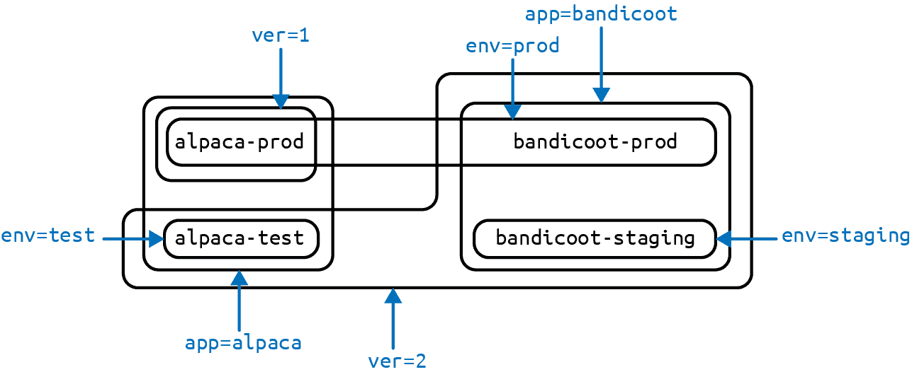

# 第六章：标签和注释

Kubernetes 旨在随着应用程序在规模和复杂性上的扩展而成长。标签和注释是 Kubernetes 中的基本概念，让您可以按照您对应用程序的思考方式来处理一组事物。您可以组织、标记和交叉索引所有资源，以表示对应用程序最有意义的组。

*标签*是可以附加到 Kubernetes 对象（如 Pods 和 ReplicaSets）的键/值对。它们可以是任意的，并且对于向 Kubernetes 对象附加标识信息非常有用。标签为对象分组提供了基础。

*Annotations*，另一方面，提供了一种类似标签的存储机制：键/值对设计，用于保存工具和库可以利用的非标识信息。与标签不同，注释并不用于查询、过滤或以其他方式区分 Pod 之间的不同。

# 标签

标签为对象提供标识元数据。这些是对象的基本特性，将用于分组、查看和操作。标签的动机源于谷歌在运行大型复杂应用程序方面的经验。从这些经验中得出了几个教训：

+   生产环境不容忍单例。在部署软件时，用户通常从单个实例开始。然而，随着应用程序的成熟，这些单例经常会增加并成为一组对象。考虑到这一点，Kubernetes 使用标签来处理对象集合，而不是单个实例。

+   系统强加的任何层次结构对许多用户来说都不够用。此外，用户的分组和层次结构随时间而变化。例如，用户可能最初认为所有应用程序都由许多服务组成。然而，随着时间的推移，一个服务可能会跨多个应用程序共享。Kubernetes 标签具有足够的灵活性来适应这些情况及更多。

深入了解谷歌如何处理生产系统的背景，请参阅 [*Site Reliability Engineering*](http://shop.oreilly.com/product/0636920041528.do) 一书，作者是 Betsy Beyer 等人（O’Reilly）。

标签具有简单的语法。它们是键/值对，其中键和值都由字符串表示。标签键可以分为两部分：可选的前缀和一个名称，用斜杠分隔。如果指定了前缀，则必须是一个 DNS 子域，长度不超过 253 个字符。键名是必需的，最大长度为 63 个字符。名称还必须以字母数字字符开头和结尾，并允许在字符之间使用破折号（`-`）、下划线（`_`）和点号（`.`）。

标签值是最多为 63 个字符的字符串。标签值的内容遵循与标签键相同的规则。表格 6-1 显示了一些有效的标签键和值。

表格 6-1 标签示例

| 键 | 值 |
| --- | --- |
| `acme.com/app-version` | `1.0.0` |
| `appVersion` | `1.0.0` |
| `app.version` | `1.0.0` |
| `kubernetes.io/cluster-service` | `true` |

当标签和注释中使用域名时，它们预期与某个特定实体对齐。例如，一个项目可能会定义一组规范的标签，用于标识应用程序部署的各个阶段，如 staging、canary 和 production。或者云提供商可能会定义提供商特定的注释，扩展 Kubernetes 对象以激活其服务特定的功能。

## 应用标签

这里我们创建了几个部署（创建一组 Pods 的一种方式），并添加了一些有趣的标签。我们将两个应用（称为 `alpaca` 和 `bandicoot`），每个应用有两个环境和两个版本。

首先，创建 `alpaca-prod` 部署，并设置 `ver`、`app` 和 `env` 标签：

```
$ kubectl run alpaca-prod \
  --image=gcr.io/kuar-demo/kuard-amd64:blue \
  --replicas=2 \
  --labels="ver=1,app=alpaca,env=prod"
```

接下来，创建 `alpaca-test` 部署，并设置 `ver`、`app` 和 `env` 标签为适当的值：

```
$ kubectl run alpaca-test \
  --image=gcr.io/kuar-demo/kuard-amd64:green \
  --replicas=1 \
  --labels="ver=2,app=alpaca,env=test"
```

最后，创建两个 `bandicoot` 的部署。这里我们将环境命名为 `prod` 和 `staging`：

```
$ kubectl run bandicoot-prod \
  --image=gcr.io/kuar-demo/kuard-amd64:green \
  --replicas=2 \
  --labels="ver=2,app=bandicoot,env=prod"
$ kubectl run bandicoot-staging \
  --image=gcr.io/kuar-demo/kuard-amd64:green \
  --replicas=1 \
  --labels="ver=2,app=bandicoot,env=staging"
```

此时，你应该有四个部署——`alpaca-prod`、`alpaca-test`、`bandicoot-prod` 和 `bandicoot-staging`：

```
$ kubectl get deployments --show-labels

NAME                ... LABELS
alpaca-prod         ... app=alpaca,env=prod,ver=1
alpaca-test         ... app=alpaca,env=test,ver=2
bandicoot-prod      ... app=bandicoot,env=prod,ver=2
bandicoot-staging   ... app=bandicoot,env=staging,ver=2
```

我们可以根据标签绘制一个基于 Venn 图的示意图（见 图 6-1）。



###### 图 6-1\. 我们部署的标签可视化

## 修改标签

在创建对象后，你也可以应用或更新标签：

```
$ kubectl label deployments alpaca-test "canary=true"
```

###### 警告

这里有一个注意事项。在本例中，`kubectl label` 命令只会更改部署本身的标签；它不会影响部署创建的任何对象，比如 ReplicaSets 和 Pods。要更改这些对象，你需要修改部署中嵌入的模板（参见 第十章）。

你也可以使用 `-L` 选项来将 `kubectl get` 结果中的标签值显示为一列：

```
$ kubectl get deployments -L canary

NAME                DESIRED   CURRENT   ... CANARY
alpaca-prod         2         2         ... <none>
alpaca-test         1         1         ... true
bandicoot-prod      2         2         ... <none>
bandicoot-staging   1         1         ... <none>
```

你可以通过应用一个带破折号后缀的标签来移除一个标签：

```
$ kubectl label deployments alpaca-test "canary-"
```

## 标签选择器

标签选择器用于根据一组标签过滤 Kubernetes 对象。选择器使用布尔表达式的简单语法。它们被最终用户（通过诸如 `kubectl` 的工具）和不同类型的对象（例如 ReplicaSet 如何与其 Pods 相关联）使用。

每个部署（通过 ReplicaSet）使用部署中嵌入的模板指定的标签创建一组 Pods。这由 `kubectl run` 命令配置。

运行 `kubectl get pods` 命令应该返回当前在集群中运行的所有 Pods。我们应该在我们的三个环境中总共有六个 `kuard` Pods：

```
$ kubectl get pods --show-labels

NAME                              ... LABELS
alpaca-prod-3408831585-4nzfb      ... app=alpaca,env=prod,ver=1,...
alpaca-prod-3408831585-kga0a      ... app=alpaca,env=prod,ver=1,...
alpaca-test-1004512375-3r1m5      ... app=alpaca,env=test,ver=2,...
bandicoot-prod-373860099-0t1gp    ... app=bandicoot,env=prod,ver=2,...
bandicoot-prod-373860099-k2wcf    ... app=bandicoot,env=prod,ver=2,...
bandicoot-staging-1839769971-3ndv ... app=bandicoot,env=staging,ver=2,...
```

###### 注意

你可能会看到一个之前没见过的新标签：`pod-template-hash`。这个标签是由部署应用的，用于跟踪由哪些模板版本生成的 Pod。这使得部署可以清晰地管理更新，详细内容将在 第十章 中介绍。

如果我们只想列出具有 `ver` 标签设置为 `2` 的 Pods，我们可以使用 `--selector` 标志：

```
$ kubectl get pods --selector="ver=2"

NAME                                 READY     STATUS    RESTARTS   AGE
alpaca-test-1004512375-3r1m5         1/1       Running   0          3m
bandicoot-prod-373860099-0t1gp       1/1       Running   0          3m
bandicoot-prod-373860099-k2wcf       1/1       Running   0          3m
bandicoot-staging-1839769971-3ndv5   1/1       Running   0          3m
```

如果我们指定两个由逗号分隔的选择器，仅返回满足两个条件的对象。这是一个逻辑 AND 操作：

```
$ kubectl get pods --selector="app=bandicoot,ver=2"

NAME                                 READY     STATUS    RESTARTS   AGE
bandicoot-prod-373860099-0t1gp       1/1       Running   0          4m
bandicoot-prod-373860099-k2wcf       1/1       Running   0          4m
bandicoot-staging-1839769971-3ndv5   1/1       Running   0          4m
```

我们还可以询问一个标签是否属于一组值。在这里，我们要求所有具有 `app` 标签设置为 `alpaca` 或 `bandicoot` 的 Pod（这将是所有六个 Pod）：

```
$ kubectl get pods --selector="app in (alpaca,bandicoot)"

NAME                                 READY     STATUS    RESTARTS   AGE
alpaca-prod-3408831585-4nzfb         1/1       Running   0          6m
alpaca-prod-3408831585-kga0a         1/1       Running   0          6m
alpaca-test-1004512375-3r1m5         1/1       Running   0          6m
bandicoot-prod-373860099-0t1gp       1/1       Running   0          6m
bandicoot-prod-373860099-k2wcf       1/1       Running   0          6m
bandicoot-staging-1839769971-3ndv5   1/1       Running   0          6m
```

最后，我们可以询问一个标签是否设置为任何内容。在这里，我们要求所有具有 `canary` 标签设置为任何内容的部署：

```
$ kubectl get deployments --selector="canary"

NAME          DESIRED   CURRENT   UP-TO-DATE   AVAILABLE   AGE
alpaca-test   1         1         1            1           7m
```

还有这些的“负”版本，如表格 6-2 所示。

表 6-2\. 选择器运算符

| 运算符 | 描述 |
| --- | --- |
| `key=value` | `key` 被设置为 `value` |
| `key!=value` | `key` is not set to `value` |
| `key in (value1, value2)` | `key` 是 `value1` 或 `value2` 的之一 |
| `key notin (value1, value2)` | `key` 不是 `value1` 或 `value2` 的之一 |
| `key` | `key` 被设置 |
| `!key` | `key` 没有设置 |

例如，如果问一个键在本例中是 `canary` 是否没有设置，可以看作：

```
$ kubectl get deployments --selector='!canary'
```

你可以组合正面和负面选择器：

```
$ kubectl get pods -l 'ver=2,!canary'
```

## 标签选择器在 API 对象中

一个 Kubernetes 对象使用标签选择器来引用一组其他 Kubernetes 对象。与上一部分中描述的简单字符串不同，我们使用解析的结构。

出于历史原因（Kubernetes 不破坏 API 兼容性！），有两种形式。大多数对象支持一个更新、更强大的选择器运算符集。一个 `app=alpaca,ver in (1, 2)` 的选择器会被转换为：

```
selector:
  matchLabels:
    app: alpaca
  matchExpressions:
    - {key: ver, operator: In, values: [1, 2]}
```

这个示例使用紧凑的 YAML 语法。这是一个列表中的一个条目（`matchExpressions`），它是一个包含三个条目的映射。最后一个条目（`values`）具有一个值，这是一组包含两个项目的列表。所有的术语都被评估为逻辑 AND。表示 `!=` 运算符的唯一方法是将其转换为单值的 `NotIn` 表达式。

旧的选择器指定形式（用于 `ReplicationController` 和服务）仅支持 `=` 运算符。`=` 运算符选择其键/值对集合都与对象匹配的目标对象。选择器 `app=alpaca,ver=1` 将被表示为：

```
selector:
  app: alpaca
  ver: 1
```

## Kubernetes 架构中的标签

除了使用户能够组织其基础设施外，标签在连接各种相关的 Kubernetes 对象方面发挥了关键作用。Kubernetes 是一个有目的地解耦系统。没有层次结构，所有组件都独立操作。然而，在许多情况下，对象需要相互关联，这些关联由标签和标签选择器定义。

例如，ReplicaSets 通过选择器创建和维护多个 Pod 的副本，找到它们管理的 Pod。同样，服务负载均衡器通过选择器查询找到应将流量引导到哪些 Pod。当创建 Pod 时，它可以使用节点选择器标识可以调度到的特定节点集。当人们想要在其集群中限制网络流量时，他们使用网络策略与特定标签配合使用，以识别应允许或不允许彼此通信的 Pod。

标签是将 Kubernetes 应用程序紧密连接在一起的强大而普遍的粘合剂。尽管您的应用程序可能从简单的标签和查询开始，但您应该预期随着时间的推移，其规模和复杂性会不断增长。

# 注解

注解提供了一个存储 Kubernetes 对象的附加元数据的位置，其中元数据的唯一目的是辅助工具和库。它们是通过 API 驱动 Kubernetes 的其他程序存储对象的一些不透明数据的一种方式。注解可以用于工具本身或在外部系统之间传递配置信息。

虽然标签用于标识和分组对象，但注解用于提供关于对象来源、如何使用对象或关于对象策略的额外信息。存在重叠，何时使用注解或标签是一种品味问题。当存在疑问时，将信息作为注解添加到对象中，并在发现希望在选择器中使用它时将其提升为标签。

注解用于：

+   记录对象最新更新的“原因”。

+   向专门的调度器传达专门的调度策略。

+   扩展关于最后更新资源的工具及其更新方式的数据（用于检测其他工具的更改并进行智能合并）。

+   附加不适合标签的构建、发布或图像信息（可能包括 Git 哈希、时间戳、拉取请求编号等）。

+   启用 Deployment 对象（参见 第十章）来跟踪其管理的 ReplicaSets 以进行部署。

+   提供额外的数据以增强 UI 的视觉质量或可用性。例如，对象可以包含一个指向图标的链接（或图标的 base64 编码版本）。

+   在 Kubernetes 中原型化 alpha 功能（而不是创建一个一流的 API 字段，该功能的参数被编码在一个注解中）。

Kubernetes 中的各个地方都使用注解，主要用例是滚动部署。在滚动部署期间，注解用于跟踪部署状态并提供回滚到先前状态所需的必要信息。

避免将 Kubernetes API 服务器用作通用数据库。注解适用于与特定资源高度关联的小数据块。如果想要在 Kubernetes 中存储数据，但没有明显的对象可关联，考虑将该数据存储在其他更合适的数据库中。

注解键使用与标签键相同的格式。然而，由于它们经常用于在工具之间传递信息，键的“命名空间”部分更为重要。示例键包括`deployment.kubernetes.io/revision`或`kubernetes.io/change-cause`。

注解的值组件是一个自由格式的字符串字段。尽管这允许用户存储任意数据，因为这是任意文本，所以没有任何格式的验证。例如，将 JSON 文档编码为字符串并存储在注解中并不罕见。重要的是要注意，Kubernetes 服务器不了解注解值的所需格式。如果注解用于传递或存储数据，则无法保证数据有效性。这可能会使错误追踪变得更加困难。

注解在每个 Kubernetes 对象的公共`metadata`部分中定义：

```
...
metadata:
  annotations:
    example.com/icon-url: "https://example.com/icon.png"
...
```

###### 警告

注解非常方便，提供了强大的松耦合，但需要谨慎使用，以避免数据混乱。

# 清理

清理本章中启动的所有部署非常容易：

```
$ kubectl delete deployments --all
```

如果您想更加选择性地删除部署，可以使用`--selector`标志来选择要删除的部署。

# 摘要

标签用于在 Kubernetes 集群中标识并可选地分组对象。它们还用于选择器查询中，以提供对象的灵活运行时分组，如 Pods。

注解提供了由自动化工具和客户端库使用的对象范围的键/值元数据存储。它们还可用于保存外部工具（如第三方调度器和监控工具）的配置数据。

标签和注解对于理解 Kubernetes 集群中关键组件如何协作以确保所需的集群状态至关重要。正确使用它们可以释放 Kubernetes 灵活性的真正威力，并为构建自动化工具和部署工作流提供起点。
