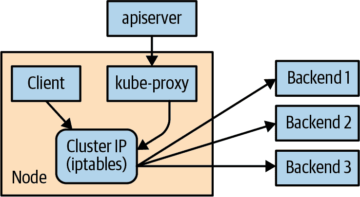

# 第七章：服务发现

Kubernetes 是一个非常动态的系统。该系统参与将 Pod 放置在节点上，确保它们正常运行，并根据需要重新调度它们。有助于根据负载自动更改 Pod 数量的方法（例如水平 Pod 自动缩放参见[“ReplicaSet 的自动缩放”]）。系统的 API 驱动特性鼓励其他人创建越来越高级别的自动化。

Kubernetes 的动态特性使得同时运行许多事物变得容易，但在*寻找*这些事物时却产生了问题。大多数传统的网络基础设施并不适用于 Kubernetes 所呈现的这种动态级别。

# 什么是服务发现？

这类问题和解决方案的通用名称是*服务发现*。服务发现工具有助于解决查找哪些进程在哪些地址上监听哪些服务的问题。一个好的服务发现系统将使用户能够快速可靠地解析此信息。一个好的系统还应该是低延迟的；客户端在与服务关联信息更改后很快就会更新。最后，一个好的服务发现系统可以存储关于该服务的更丰富的定义。例如，也许与服务相关联的有多个端口。

域名系统（DNS）是互联网上服务发现的传统系统。DNS 设计用于相对稳定的名称解析，具有广泛且高效的缓存。它是互联网的一个很好的系统，但在 Kubernetes 动态世界中存在不足。

不幸的是，许多系统（例如默认情况下的 Java）直接在 DNS 中查找名称并且不会重新解析它。这可能导致客户端缓存陈旧的映射并与错误的 IP 进行通信。即使有短暂的 TTL（生存时间）和良好行为的客户端，名称解析更改时客户端注意到之间存在自然延迟。在典型 DNS 查询中，能够返回的信息量和类型也有自然限制。超过 20 到 30 个地址（A 记录）对于单个名称会导致问题。服务（SRV）记录解决了一些问题，但通常很难使用。最后，客户端处理 DNS 记录中多个 IP 的方式通常是取第一个 IP 地址并依赖 DNS 服务器随机化或循环轮询记录的顺序。这不能替代更专门的负载平衡。

# Service 对象

Kubernetes 中的真实服务发现始于一个 Service 对象。Service 对象是创建命名标签选择器的一种方式。正如我们将看到的，Service 对象还为我们提供了一些其他好处。

就像`kubectl run`命令是创建 Kubernetes 部署的简单方法一样，我们可以使用`kubectl expose`来创建一个服务。我们将在第十章详细讨论部署，但现在您可以将部署视为微服务的一个实例。让我们创建一些部署和服务，以便看看它们是如何工作的：

```
$ kubectl create deployment alpaca-prod \
  --image=gcr.io/kuar-demo/kuard-amd64:blue \
  --port=8080
$ kubectl scale deployment alpaca-prod --replicas 3
$ kubectl expose deployment alpaca-prod
$ kubectl create deployment bandicoot-prod \
  --image=gcr.io/kuar-demo/kuard-amd64:green \
  --port=8080
$ kubectl scale deployment bandicoot-prod --replicas 2
  kubectl expose deployment bandicoot-prod
$ kubectl get services -o wide

NAME             CLUSTER-IP    ... PORT(S)  ... SELECTOR
alpaca-prod      10.115.245.13 ... 8080/TCP ... app=alpaca
bandicoot-prod   10.115.242.3  ... 8080/TCP ... app=bandicoot
kubernetes       10.115.240.1  ... 443/TCP  ... <none>
```

运行这些命令后，我们有了三个服务。我们刚刚创建的服务是`alpaca-prod`和`bandicoot-prod`。`kubernetes`服务会自动为您创建，以便您可以从应用程序内部找到并与 Kubernetes API 交互。

如果我们查看`SELECTOR`列，我们会发现`alpaca-prod`服务只是为选择器指定一个名称，并指定了与该服务通信的端口（在本例中为 8080）。`kubectl expose`命令将方便地从部署定义中提取标签选择器和相关端口。

此外，该服务被分配了一种新型虚拟 IP，称为*集群 IP*。这是系统将在所有由选择器标识的 Pod 之间进行负载均衡的特殊 IP 地址。

要与服务交互，我们将进行端口转发到一个`alpaca` Pod。执行此命令并在终端窗口中保持运行。您可以通过访问*http://localhost:48858*来查看端口转发的工作情况：

```
$ ALPACA_POD=$(kubectl get pods -l app=alpaca \
    -o jsonpath='{.items[0].metadata.name}')
$ kubectl port-forward $ALPACA_POD 48858:8080
```

## 服务 DNS

因为集群 IP 是虚拟的，所以它是稳定的，并且适合分配 DNS 地址。客户端缓存 DNS 结果的所有问题都不再适用。在命名空间内，只需使用服务名称即可连接到由服务标识的 Pod 之一。

Kubernetes 为运行在集群中的 Pod 提供了一个 DNS 服务。该 Kubernetes DNS 服务在集群创建时作为系统组件安装。DNS 服务本身由 Kubernetes 管理，并且是 Kubernetes 构建在 Kubernetes 上的一个很好的例子。Kubernetes DNS 服务为集群 IP 提供 DNS 名称。

在`kuard`服务器状态页面上展开“DNS 查询”部分，您可以尝试这样做。查询`alpaca-prod`的 A 记录。输出应该类似于以下内容：

```
;; opcode: QUERY, status: NOERROR, id: 12071
;; flags: qr aa rd ra; QUERY: 1, ANSWER: 1, AUTHORITY: 0, ADDITIONAL: 0

;; QUESTION SECTION:
;alpaca-prod.default.svc.cluster.local.	IN	 A

;; ANSWER SECTION:
alpaca-prod.default.svc.cluster.local.	30	IN	A	10.115.245.13
```

这里的完整 DNS 名称是`alpaca-prod.default.svc.cluster.local.`。让我们来详细了解一下：

`alpaca-prod`

此服务的名称。

`default`

此服务所在的命名空间。

`svc`

确认这是一个服务。这使得 Kubernetes 可以在未来将其他类型的东西暴露为 DNS。

`cluster.local.`

集群的基本域名。这是大多数集群中的默认设置。管理员可以更改此设置，以允许跨多个集群使用唯一的 DNS 名称。

当引用自己命名空间中的服务时，您可以直接使用服务名称（`alpaca-prod`）。您还可以引用另一个命名空间中的服务，如`alpaca-prod.default`。当然，您也可以使用完全限定的服务名称（`alpaca-prod.default.svc.cluster.local.`）。请在 `kuard` 的“DNS 查询”部分尝试每一种情况。

## 就绪检查

通常，当应用程序首次启动时，它无法处理请求。通常需要一些初始化工作，可能需要不到一秒或几分钟。服务对象的一个好处是通过就绪检查跟踪哪些 Pod 是准备就绪的。让我们修改我们的部署，添加一个与 Pod 相关联的就绪检查，如我们在 第五章 中讨论的那样：

```
$ kubectl edit deployment/alpaca-prod
```

此命令将获取当前版本的 `alpaca-prod` 部署，并在编辑器中启动它。保存并退出编辑器后，它将将对象写回 Kubernetes。这是一种在不将对象保存到 YAML 文件中的情况下编辑对象的快速方法。

添加以下部分：

```
spec:
  ...
  template:
    ...
    spec:
      containers:
        ...
        name: alpaca-prod
        readinessProbe:
          httpGet:
            path: /ready
            port: 8080
          periodSeconds: 2
          initialDelaySeconds: 0
          failureThreshold: 3
          successThreshold: 1
```

这将设置此部署将创建的 Pod，以便通过在端口 8080 上的 HTTP `GET`到`/ready`进行就绪检查。此检查在 Pod 启动后立即开始，每两秒钟进行一次。如果连续三次检查失败，则认为该 Pod 不可用。但是，如果只有一次检查成功，则再次认为该 Pod 是就绪的。

只有准备就绪的 Pod 才会收到流量。

更新部署定义将删除并重新创建 `alpaca` Pods。因此，我们需要重新启动先前的 `port-forward` 命令：

```
$ ALPACA_POD=$(kubectl get pods -l app=alpaca-prod \
    -o jsonpath='{.items[0].metadata.name}')
$ kubectl port-forward $ALPACA_POD 48858:8080
```

将您的浏览器指向 *http://localhost:48858*，您应该可以看到 `kuard` 实例的调试页面。展开“就绪探针”部分。每次系统进行新的就绪检查时，您应该看到此页面更新，这通常每两秒钟发生一次。

在另一个终端窗口上，对 `alpaca-prod` 服务的端点启动 `watch` 命令。端点是查找服务发送流量的更低级别方法，并将在本章后面进行介绍。这里的 `--watch` 选项导致 `kubectl` 命令挂起并输出任何更新。这是一种轻松查看 Kubernetes 对象随时间变化的方法：

```
$ kubectl get endpoints alpaca-prod --watch
```

现在返回到浏览器，点击就绪检查的“失败”链接。您应该看到服务器现在返回 500 的错误代码。这三次失败后，此服务器将从服务的端点列表中删除。点击“成功”链接并注意，在单个就绪检查后，端点将被重新添加。

这个就绪检查是过载或出现问题的服务器向系统发出信号，表明它不希望再接收流量。这是实现优雅关闭的一种好方法。服务器可以发出不再希望流量的信号，等待现有连接关闭，然后干净地退出。

按下 Ctrl-C 退出终端中的`port-forward`和`watch`命令。

# 超越集群范围

到目前为止，本章涵盖的内容都是关于在集群内部暴露服务。通常情况下，Pod 的 IP 只能在集群内部访问。但在某些时候，我们需要允许新的流量进入！

最便携的方法是使用称为 NodePorts 的功能，进一步增强了服务。除了一个集群 IP 外，系统还选择一个端口（或用户可以指定一个端口），然后集群中的每个节点都将流量转发到该端口的服务上。

有了这个功能，如果你能够访问集群中的任何节点，就可以联系到一个服务。即使不知道运行该服务的任何 Pod 所在的位置，也可以使用 NodePort。这可以与硬件或软件负载均衡器集成，以进一步暴露服务。

尝试修改`alpaca-prod`服务来测试一下：

```
$ kubectl edit service alpaca-prod
```

将`spec.type`字段改为`NodePort`。在使用`kubectl expose`创建服务时，也可以通过指定`--type=NodePort`来执行此操作。系统将分配一个新的 NodePort：

```
$ kubectl describe service alpaca-prod

Name:                   alpaca-prod
Namespace:              default
Labels:                 app=alpaca
Annotations:            <none>
Selector:               app=alpaca
Type:                   NodePort
IP:                     10.115.245.13
Port:                   <unset> 8080/TCP
NodePort:               <unset> 32711/TCP
Endpoints:              10.112.1.66:8080,10.112.2.104:8080,10.112.2.105:8080
Session Affinity:       None
No events.
```

在这里，我们看到系统分配端口 32711 给这个服务。现在我们可以访问集群中任何节点上的该端口来访问服务。如果你在同一网络上，可以直接访问。如果你的集群在云端某处，可以使用类似以下的 SSH 隧道：

```
$ ssh <*node*> -L 8080:localhost:32711
```

现在，如果你将浏览器指向 *http://localhost:8080*，你将连接到该服务。每个发送到服务的请求将随机分配给实现该服务的不同 Pod。重新加载页面几次，你会发现请求随机分配到不同的 Pod 上。

当完成后，退出 SSH 会话。

# 负载均衡器集成

如果你的集群配置了与外部负载均衡器集成，可以使用`LoadBalancer`类型。它在`NodePort`类型的基础上，进一步配置云端创建一个新的负载均衡器，并将其指向集群中的节点。大多数基于云的 Kubernetes 集群都支持负载均衡器集成，也有一些项目专门为常见的物理负载均衡器实现负载均衡器集成，尽管这些可能需要更多与集群的手动集成。

再次编辑`alpaca-prod`服务（`kubectl edit service alpaca-prod`），并将`spec.type`改为`LoadBalancer`。

###### 注意

创建一个`LoadBalancer`类型的服务将该服务暴露给公共互联网。在执行此操作之前，请确保这是安全的，可以向全世界公开。我们将在本节进一步讨论安全风险。此外，第九章和第二十章提供了如何保护应用程序的指导。

如果立即运行 `kubectl get services`，您会看到 `alpaca-prod` 的 `EXTERNAL-IP` 列现在显示 `<pending>`。稍等片刻，您应该会看到云端为您分配的公共地址。您可以查看云账户的控制台，了解 Kubernetes 为您完成的配置工作：

```
$ kubectl describe service alpaca-prod

Name:                   alpaca-prod
Namespace:              default
Labels:                 app=alpaca
Selector:               app=alpaca
Type:                   LoadBalancer
IP:                     10.115.245.13
LoadBalancer Ingress:   104.196.248.204
Port:                   <unset>	8080/TCP
NodePort:               <unset>	32711/TCP
Endpoints:              10.112.1.66:8080,10.112.2.104:8080,10.112.2.105:8080
Session Affinity:       None
Events:
  FirstSeen ... Reason                Message
  --------- ... ------                -------
  3m        ... Type                  NodePort -> LoadBalancer
  3m        ... CreatingLoadBalancer  Creating load balancer
  2m        ... CreatedLoadBalancer   Created load balancer
```

现在我们看到 `alpaca-prod` 服务分配了 104.196.248.204 的地址。打开浏览器试试吧！

###### 注意

此示例来自通过 GKE 在谷歌云平台上启动和管理的集群。负载均衡器的配置方式特定于云。一些云有基于 DNS 的负载均衡器（例如 AWS 弹性负载均衡 [ELB]）。在这种情况下，您会看到一个主机名而不是 IP。根据云服务提供商的不同，负载均衡器可能需要一段时间才能完全运行。

创建一个基于云的负载均衡器可能需要一些时间。大多数云服务提供商可能需要几分钟，这一点不要感到惊讶。

到目前为止，我们看到的示例都使用了 *外部* 负载均衡器；也就是说，连接到公共互联网的负载均衡器。虽然这对于向世界公开服务很好，但通常您只想在内部网络中公开应用程序。为了实现这一点，请使用 *内部* 负载均衡器。不幸的是，由于对内部负载均衡器的支持是较近期添加到 Kubernetes 的，因此通过对象注解以某种临时方式实现。例如，在 Azure Kubernetes 服务集群中创建内部负载均衡器，您需要向您的 `Service` 资源添加注解 `service.beta.kubernetes.io/azure-load-balancer-internal: "true"`。以下是一些流行云服务的设置：

微软 Azure

`service.beta.kubernetes.io/azure-load-balancer-internal: "true"`

亚马逊 Web 服务

`service.beta.kubernetes.io/aws-load-balancer-internal: "true"`

阿里云

`service.beta.kubernetes.io/alibaba-cloud-loadbalancer-address-type: "intranet"`

谷歌云平台

`cloud.google.com/load-balancer-type: "Internal"`

当您向您的服务添加此注解时，它应该是这样的：

```
...
metadata:
    ...
    name: some-service
    annotations:
        service.beta.kubernetes.io/azure-load-balancer-internal: "true"
...
```

当您使用这些注解之一创建服务时，将创建一个内部暴露的服务，而不是在公共互联网上的服务。

###### 提示

还有几个注解可以扩展负载均衡器的行为，包括用于使用预先存在的 IP 地址的注解。您的提供商的具体扩展应该在其网站上有文档记录。

# 高级细节

Kubernetes 是一个可扩展的系统。因此，有一些层次可以支持更高级的集成。理解像服务这样复杂的概念的具体实现细节可能有助于您进行故障排除或创建更高级的集成。本节稍微深入了解这些。

## 终端点

一些应用程序（以及系统本身）希望能够使用服务而不使用集群 IP。这可以通过另一种类型的对象——Endpoints 对象来实现。对于每个 Service 对象，Kubernetes 创建一个对应的 Endpoints 对象，其中包含该服务的 IP 地址：

```
$ kubectl describe endpoints alpaca-prod

Name:           alpaca-prod
Namespace:      default
Labels:         app=alpaca
Subsets:
  Addresses:            10.112.1.54,10.112.2.84,10.112.2.85
  NotReadyAddresses:    <none>
  Ports:
    Name        Port    Protocol
    ----        ----    --------
    <unset>     8080    TCP

No events.
```

要使用服务，高级应用程序可以直接与 Kubernetes API 通信以查找端点并调用它们。Kubernetes API 甚至具有“观察”对象并在它们发生变化时立即得到通知的能力。通过这种方式，客户端可以在服务关联的 IP 地址发生变化时立即做出反应。

让我们演示一下这一点。在终端窗口中启动以下命令并让其保持运行：

```
$ kubectl get endpoints alpaca-prod --watch
```

它将输出当前端点的当前状态，然后“挂起”：

```
NAME          ENDPOINTS                                            AGE
alpaca-prod   10.112.1.54:8080,10.112.2.84:8080,10.112.2.85:8080   1m
```

现在打开*另一个*终端窗口，并删除并重新创建支持 `alpaca-prod` 的部署：

```
$ kubectl delete deployment alpaca-prod
$ kubectl create deployment alpaca-prod \
  --image=gcr.io/kuar-demo/kuard-amd64:blue \
  --port=8080
$ kubectl scale deployment alpaca-prod --replicas=3
```

如果您回顾观察到的端点输出，您会发现随着删除和重新创建这些 Pods，命令的输出反映了与服务关联的最新一组 IP 地址集。您的输出将类似于以下内容：

```
NAME          ENDPOINTS                                            AGE
alpaca-prod   10.112.1.54:8080,10.112.2.84:8080,10.112.2.85:8080   1m
alpaca-prod   10.112.1.54:8080,10.112.2.84:8080                    1m
alpaca-prod   <none>                                               1m
alpaca-prod   10.112.2.90:8080                                     1m
alpaca-prod   10.112.1.57:8080,10.112.2.90:8080                    1m
alpaca-prod   10.112.0.28:8080,10.112.1.57:8080,10.112.2.90:8080   1m
```

如果您正在编写从头开始在 Kubernetes 上运行的新代码，那么 Endpoints 对象非常适合您。但是大多数项目并不处于这种位置！大多数现有系统都建立在不经常更改的常规 IP 地址上，这些系统可以使用 Endpoints 对象。

## 手动服务发现

Kubernetes 服务是建立在对 Pods 的标签选择器之上的。这意味着即使完全不使用 Service 对象，您也可以使用 Kubernetes API 进行基本的服务发现！让我们演示一下。

使用 `kubectl`（通过 API）我们可以轻松地查看分配给我们示例部署中每个 Pod 的 IP 地址：

```
$ kubectl get pods -o wide --show-labels

NAME                            ... IP          ... LABELS
alpaca-prod-12334-87f8h    ... 10.112.1.54 ... app=alpaca
alpaca-prod-12334-jssmh    ... 10.112.2.84 ... app=alpaca
alpaca-prod-12334-tjp56    ... 10.112.2.85 ... app=alpaca
bandicoot-prod-5678-sbxzl  ... 10.112.1.55 ... app=bandicoot
bandicoot-prod-5678-x0dh8  ... 10.112.2.86 ... app=bandicoot
```

这很棒，但是如果您有大量的 Pods 怎么办？您可能希望基于部署中应用的标签进行过滤。让我们仅对 `alpaca` 应用程序这样做：

```
$ kubectl get pods -o wide --selector=app=alpaca

NAME                         ... IP          ...
alpaca-prod-3408831585-bpzdz ... 10.112.1.54 ...
alpaca-prod-3408831585-kncwt ... 10.112.2.84 ...
alpaca-prod-3408831585-l9fsq ... 10.112.2.85 ...
```

现在，您已经掌握了服务发现的基础知识！您始终可以使用标签来识别您感兴趣的一组 Pods，获取所有这些标签的 Pods，并获取其 IP 地址。但是保持正确的标签集以同步使用可能会有些棘手。这就是为什么创建 Service 对象的原因。

## kube-proxy 和集群 IP

集群 IP 是稳定的虚拟 IP，它负载平衡服务中所有端点的流量。这项魔术由集群中每个节点上运行的组件 `kube-proxy` 完成（见 图 7-1）。



###### 图 7-1\. 配置和使用集群 IP

在 图 7-1 中，`kube-proxy` 通过 API 服务器监视集群中的新服务。然后，它在主机内核中编程一组 `iptables` 规则，以重写数据包的目的地，使其指向该服务的一个端点。如果服务的端点集合发生更改（由于 Pods 的出现和消失或由于失败的就绪检查），则重写 `iptables` 规则集。

API 服务器在创建服务时通常会分配集群 IP 地址。但是，在创建服务时，用户可以指定特定的集群 IP。一旦设置，集群 IP 就不能在不删除和重新创建服务对象的情况下进行修改。

###### 注意

使用 `kube-apiserver` 二进制文件上的 `--service-cluster-ip-range` 标志配置 Kubernetes 服务地址范围。服务地址范围不应与分配给每个 Docker 桥接或 Kubernetes 节点的 IP 子网和范围重叠。此外，任何显式请求的集群 IP 必须来自该范围，而不是已经在使用中。

## 集群 IP 环境变量

尽管大多数用户应该使用 DNS 服务来查找集群 IP，但仍然可能在使用一些旧的机制。其中之一是在 Pod 启动时将一组环境变量注入其中。

要看到这个过程，请查看 `kuard` 实例的 `bandicoot` 控制台。在终端中输入以下命令：

```
$ BANDICOOT_POD=$(kubectl get pods -l app=bandicoot \
    -o jsonpath='{.items[0].metadata.name}')
$ kubectl port-forward $BANDICOOT_POD 48858:8080
```

现在，请将浏览器指向 *http://localhost:48858* ，查看此服务器的状态页面。展开“服务器环境”部分，并注意 `alpaca` 服务的环境变量集。状态页面应显示类似于 Table 7-1 的表格。

表 7-1\. 服务环境变量

| Key | Value |
| --- | --- |
| `ALPACA_PROD_PORT` | `tcp://10.115.245.13:8080` |
| `ALPACA_PROD_PORT_8080_TCP` | `tcp://10.115.245.13:8080` |
| `ALPACA_PROD_PORT_8080_TCP_ADDR` | `10.115.245.13` |
| `ALPACA_PROD_PORT_8080_TCP_PORT` | `8080` |
| `ALPACA_PROD_PORT_8080_TCP_PROTO` | `tcp` |
| `ALPACA_PROD_SERVICE_HOST` | `10.115.245.13` |
| `ALPACA_PROD_SERVICE_PORT` | `8080` |

使用的两个主要环境变量是 `ALPACA_PROD_SERVICE_HOST` 和 `ALPACA_PROD_SERVICE_PORT`。其他环境变量是为了与（现在已弃用的）Docker 链接变量兼容而创建的。

环境变量方法的一个问题是它要求资源按特定顺序创建。服务必须在引用它们的 Pod 之前创建。这在部署构成较大应用程序的一组服务时可能会引入相当多的复杂性。此外，对许多用户来说，仅仅使用环境变量似乎有些奇怪。因此，DNS 可能是一个更好的选择。

# 与其他环境连接

尽管在自己的集群中进行服务发现非常好，但实际上，许多真实世界的应用程序实际上需要您集成更多在 Kubernetes 中部署的云原生应用程序与部署在更传统环境中的应用程序。此外，您可能需要将在云中部署的 Kubernetes 集群与部署在本地的基础设施集成。这是 Kubernetes 的一个仍在进行大量探索和解决方案开发的领域。

## 连接到集群外的资源

当你连接 Kubernetes 到集群外的传统资源时，你可以使用无选择器服务来声明一个 Kubernetes 服务，其手动分配的 IP 地址位于集群外部。这样，通过 DNS 的 Kubernetes 服务发现就能如预期地工作，但网络流量本身会流向外部资源。要创建无选择器服务，你需要从你的资源中移除 `spec.selector` 字段，同时保留 `metadata` 和 `ports` 部分不变。因为你的服务没有选择器，所以不会自动添加端点到服务中。这意味着你必须手动添加它们。通常你将添加的端点是一个固定的 IP 地址（例如，你的数据库服务器的 IP 地址），因此你只需添加一次。但如果支持服务的 IP 地址发生更改，你需要更新相应的端点资源。要创建或更新端点资源，你可以使用类似以下的端点：

```
apiVersion: v1
kind: Endpoints
metadata:
  # This name must match the name of your service
  name: my-database-server
subsets:
  - addresses:
      # Replace this IP with the real IP of your server
      - ip: 1.2.3.4
    ports:
      # Replace this port with the port(s) you want to expose
      - port: 1433
```

## 将外部资源连接到集群内部的服务

将外部资源连接到 Kubernetes 服务内部有一些技巧。如果你的云服务提供商支持，最简单的方法是创建一个“内部”负载均衡器，就像上面描述的那样，它位于你的虚拟私有网络中，并且可以将流量从一个固定的 IP 地址传递到集群中。然后，你可以使用传统的 DNS 来使这个 IP 地址对外部资源可用。如果没有可用的内部负载均衡器，你可以使用 `NodePort` 服务在集群节点的 IP 地址上公开服务。然后，你可以编程一个物理负载均衡器来为这些节点提供服务，或者使用基于 DNS 的负载均衡来在节点之间分发流量。

如果以上两种解决方案对你的用例都不适用，更复杂的选项包括在外部资源上运行完整的 `kube-proxy` 并编程该机器使用 Kubernetes 集群中的 DNS 服务器。这样的设置要更难正确配置，实际上应该只在本地环境中使用。还有许多开源项目（例如 HashiCorp 的 Consul）可以用来管理集群内部和集群外部资源之间的连接。这些选项需要对网络和 Kubernetes 的知识有深入了解，真的应该作为最后的选择考虑。

# 清理工作

运行以下命令来清理本章创建的所有对象：

```
$ kubectl delete services,deployments -l app
```

# 概要

Kubernetes 是一个动态系统，挑战传统的命名和通过网络连接服务的方法。Service 对象提供了一种灵活而强大的方式来同时在集群内部和集群外部公开服务。通过本章介绍的技术，你可以将服务互相连接并将它们暴露到集群外部。

虽然在 Kubernetes 中使用动态服务发现机制会引入一些新概念，可能一开始看起来比较复杂，但理解和适应这些技术是解锁 Kubernetes 强大功能的关键。一旦你的应用程序能够动态地找到服务并响应这些应用程序的动态部署，你就可以不再担心事物的运行位置和移动时间。以逻辑方式思考服务，并让 Kubernetes 处理容器放置的细节是解决问题关键的一部分。

当然，服务发现只是应用程序与 Kubernetes 配合工作的开始。第八章 讨论了 Ingress 网络，专注于第 7 层（HTTP）负载均衡和路由，而 第十五章 是关于服务网格，这是最近在云原生网络中开发的一种方法，除了服务发现和负载均衡之外，还提供许多额外的功能。
