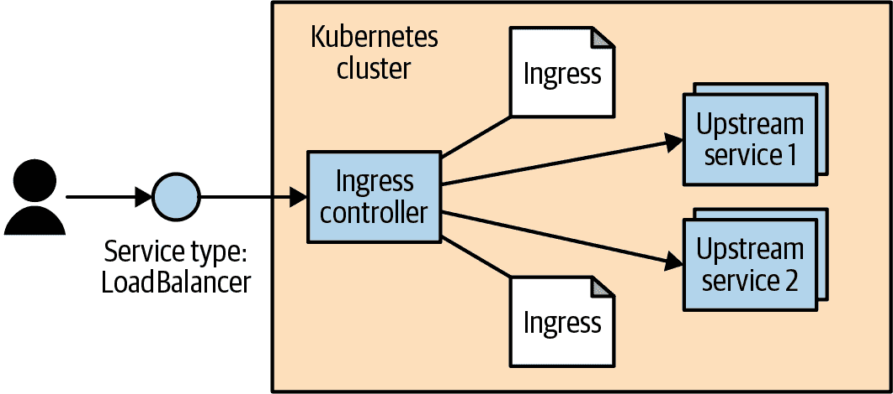

# 第八章：使用 Ingress 进行 HTTP 负载均衡

任何应用程序的关键部分是将网络流量发送和接收到该应用程序。正如在第七章中描述的那样，Kubernetes 具有一套能力，使得服务能够在集群外部暴露。对于许多用户和简单的用例，这些能力是足够的。

但是 Service 对象在 OSI 模型中操作于第 4 层。^(1) 这意味着它仅转发 TCP 和 UDP 连接，并且不检查这些连接的内部内容。因此，在集群上托管多个应用程序时，会使用许多不同的暴露服务。对于那些`type: NodePort`的服务，您将不得不为每个服务连接到唯一端口。而对于那些`type: LoadBalancer`的服务，您将为每个服务分配（通常昂贵或稀缺的）云资源。但是对于基于 HTTP（第 7 层）的服务，我们可以做得更好。

当在非 Kubernetes 环境中解决类似问题时，用户通常会转向“虚拟主机”这一概念。这是一种在单个 IP 地址上托管多个 HTTP 站点的机制。通常，用户使用负载均衡器或反向代理接受 HTTP（80）和 HTTPS（443）端口的传入连接。该程序然后解析 HTTP 连接，并基于`Host`头和请求的 URL 路径，将 HTTP 调用代理到其他程序。通过这种方式，负载均衡器或反向代理将流量引导到正确的“上游”服务器进行解码和连接引导。

Kubernetes 将其基于 HTTP 的负载均衡系统称为*Ingress*。Ingress 是 Kubernetes 本地的一种实现“虚拟主机”模式的方式，正如我们刚刚讨论的那样。该模式的更复杂部分之一是用户必须管理负载均衡器配置文件。在动态环境中，并且随着虚拟主机集合的扩展，这可能会非常复杂。Kubernetes Ingress 系统通过（a）标准化该配置，（b）将其移到标准 Kubernetes 对象，并且（c）将多个 Ingress 对象合并为负载均衡器的单一配置，来简化这一过程。

典型的软件基础实现看起来像 图 8-1 所示。Ingress 控制器是由两部分组成的软件系统。第一部分是 Ingress 代理，使用 `type: LoadBalancer` 的服务在集群外部暴露此代理，将请求发送给“上游”服务器。另一部分是 Ingress 和解器或操作员。Ingress 操作员负责读取和监视 Kubernetes API 中的 Ingress 对象，并重新配置 Ingress 代理以按照 Ingress 资源中指定的方式路由流量。有许多不同的 Ingress 实现。在某些实现中，这两个组件合并到一个容器中；在其他情况下，它们是分开部署在 Kubernetes 集群中的不同组件。在 图 8-1 中，我们介绍了一个 Ingress 控制器的示例。



###### 图 8-1\. 典型的软件 Ingress 控制器配置

# Ingress 规范与 Ingress 控制器

虽然在概念上简单，但在实现级别上，Ingress 与 Kubernetes 中几乎所有其他常规资源对象都非常不同。具体来说，它分为一个常见的资源规范和一个控制器实现。没有一个内置到 Kubernetes 中的“标准”Ingress 控制器，因此用户必须安装众多可选的实现之一。

用户可以像创建和修改其他对象一样创建和修改 Ingress 对象。但默认情况下，并没有运行实际操作这些对象的代码。用户（或者他们正在使用的发行版）需要安装和管理一个外部控制器。这种方式下，控制器是可插拔的。

Ingress 最终形成这样的原因有几点。首先，没有一个单一的 HTTP 负载均衡器可以普遍使用。除了许多软件负载均衡器（包括开源和专有的）外，云提供商（例如 AWS 上的 ELB）和基于硬件的负载均衡器也提供了负载均衡能力。其次，Ingress 对象是在任何常见的可扩展能力被添加之前就被添加到 Kubernetes 中的（参见 第十七章）。随着 Ingress 的发展，它可能会演变以使用这些机制。

# 安装 Contour

虽然有许多可用的入口控制器，但在这里的示例中，我们使用一个称为 Contour 的入口控制器。这是一个专为配置开源（以及 CNCF 项目）负载均衡器 Envoy 而构建的控制器。Envoy 是通过 API 动态配置的。Contour 入口控制器负责将 Ingress 对象转换为 Envoy 可以理解的内容。

###### 注意

[Contour 项目](https://oreil.ly/5IHmq)由 Heptio 与实际客户合作创建，并用于生产环境，但现在是一个独立的开源项目。

您可以通过简单的一行命令安装 Contour：

```
$ kubectl apply -f https://projectcontour.io/quickstart/contour.yaml
```

注意，这需要由具有`cluster-admin`权限的用户执行。

大多数情况下，这一行代码是有效的。它创建了一个名为`projectcontour`的命名空间。在该命名空间内，它创建了一个包含两个副本的部署，并创建了一个外部可访问的`type: LoadBalancer`服务。此外，它通过一个服务账户设置了正确的权限，并安装了一个自定义资源定义（参见第十七章）以支持一些在“Ingress 的未来”中讨论的扩展功能。

因为它是全局安装，所以您需要确保您在安装的集群上具有广泛的管理员权限。安装完成后，您可以通过以下方式获取 Contour 的外部地址：

```
$  kubectl get -n projectcontour service envoy -o wide
NAME      CLUSTER-IP     EXTERNAL-IP          PORT(S)      ...
contour   10.106.53.14   a477...amazonaws.com 80:30274/TCP ...
```

查看`EXTERNAL-IP`列。这可以是 IP 地址（适用于 GCP 和 Azure）或主机名（适用于 AWS）。其他云和环境可能会有所不同。如果您的 Kubernetes 集群不支持`type: LoadBalancer`的服务，则必须更改用于安装 Contour 的 YAML，以使用`type: NodePort`并通过适合您配置的机制将流量路由到集群中的机器。

如果您使用`minikube`，可能不会列出任何`EXTERNAL-IP`。要解决此问题，您需要打开一个单独的终端窗口并运行`minikube tunnel`命令。这将配置网络路由，使每个`type: LoadBalancer`服务分配到唯一的 IP 地址。

## 配置 DNS

要使 Ingress 正常工作，您需要为负载均衡器的外部地址配置 DNS 条目。您可以将多个主机名映射到单个外部端点，并且 Ingress 控制器将根据主机名将传入的请求定向到适当的上游服务。

对于本章，我们假设您拥有一个名为`example.com`的域名。您需要配置两个 DNS 条目：`alpaca.example.com`和`bandicoot.example.com`。如果您有外部负载均衡器的 IP 地址，您将需要创建 A 记录。如果您有主机名，则需要配置 CNAME 记录。

[ExternalDNS 项目](https://oreil.ly/ILdEj)是一个集群附加组件，您可以使用它来管理 DNS 记录。ExternalDNS 监视您的 Kubernetes 集群，并将 Kubernetes 服务资源的 IP 地址与外部 DNS 提供程序同步。ExternalDNS 支持各种 DNS 提供商，包括传统的域名注册商和公共云提供商。

## 配置本地 hosts 文件

如果您没有域名，或者正在使用诸如`minikube`之类的本地解决方案，可以通过编辑您的*/etc/hosts*文件添加 IP 地址来设置本地配置。您需要在工作站上拥有管理员/根权限。文件的位置可能因您的平台而异，并且使其生效可能需要额外的步骤。例如，在 Windows 上，文件通常位于*C:\Windows\System32\drivers\etc\hosts*，对于较新版本的 macOS，您需要在更改文件后运行`sudo killall -HUP mDNSResponder`。

编辑文件，添加以下类似的行：

```
<*ip-address*> alpaca.example.com bandicoot.example.com
```

对于`<*ip-address*>`，请填写 Contour 的外部 IP 地址。如果您只有主机名（例如来自 AWS），可以通过执行`host -t a *<address>*`获取一个 IP 地址（这可能会在将来更改）。

在完成后不要忘记撤消这些更改！

# 使用 Ingress

现在我们已经配置了 Ingress 控制器，让我们来测试它。首先，我们将通过执行以下命令创建一些上游（有时也称为“后端”）服务进行测试：

```
$ kubectl create deployment be-default \
  --image=gcr.io/kuar-demo/kuard-amd64:blue \
  --replicas=3 \
  --port=8080
$ kubectl expose deployment be-default
$ kubectl create deployment alpaca \
  --image=gcr.io/kuar-demo/kuard-amd64:green \
  --replicas=3 \
  --port=8080
$ kubectl expose deployment alpaca
$ kubectl create deployment bandicoot \
  --image=gcr.io/kuar-demo/kuard-amd64:purple \
  --replicas=3 \
  --port=8080
$ kubectl expose deployment bandicoot
$ kubectl get services -o wide

NAME             CLUSTER-IP    ... PORT(S)  ... SELECTOR
alpaca           10.115.245.13 ... 8080/TCP ... run=alpaca
bandicoot        10.115.242.3  ... 8080/TCP ... run=bandicoot
be-default       10.115.246.6  ... 8080/TCP ... run=be-default
kubernetes       10.115.240.1  ... 443/TCP  ... <none>
```

## 最简单的用法

使用 Ingress 的最简单方式是让它盲目地将它看到的一切都传递给一个上游服务。在`kubectl`中，对于与 Ingress 一起工作的命令的支持有限，因此我们将从一个 YAML 文件开始（参见示例 8-1）。

##### 示例 8-1\. simple-ingress.yaml

```
apiVersion: networking.k8s.io/v1
kind: Ingress
metadata:
  name: simple-ingress
spec:
  defaultBackend:
    service:
      name: alpaca
      port:
        number: 8080
```

使用`kubectl apply`创建此 Ingress：

```
$ kubectl apply -f simple-ingress.yaml
ingress.extensions/simple-ingress created
```

您可以使用`kubectl get`和`kubectl describe`验证它是否设置正确：

```
$ kubectl get ingress
NAME             HOSTS   ADDRESS   PORTS   AGE
simple-ingress   *                 80      13m

$ kubectl describe ingress simple-ingress
Name:             simple-ingress
Namespace:        default
Address:
Default backend:  alpaca:8080
(172.17.0.6:8080,172.17.0.7:8080,172.17.0.8:8080)
Rules:
  Host  Path  Backends
  ----  ----  --------
  *     *     alpaca:8080 (172.17.0.6:8080,172.17.0.7:8080,172.17.0.8:8080)
Annotations:
  ...

Events:  <none>
```

这样设置后，命中 Ingress 控制器的*任何*HTTP 请求都将转发到`alpaca`服务。您现在可以通过服务的任何原始 IP 地址/CNAME 访问`kuard`的`alpaca`实例；在这种情况下，要么是`alpaca.example.com`，要么是`bandicoot.example.com`。此时，与`type: LoadBalancer`的简单服务相比，没有太多附加价值。接下来的部分将尝试更复杂的配置。

## 使用主机名

当我们根据请求的属性引导流量时，事情开始变得有趣。最常见的示例是让 Ingress 系统查看 HTTP 主机头（设置为原始 URL 中的 DNS 域），并根据该头部引导流量。让我们为将流量引导到任何流向`alpaca.example.com`的流量添加*另一个* Ingress 对象（请参见示例 8-2）。

##### 示例 8-2\. host-ingress.yaml

```
apiVersion: networking.k8s.io/v1
kind: Ingress
metadata:
  name: host-ingress
spec:
  defaultBackend:
    service:
      name: be-default
      port:
        number: 8080
  rules:
  - host: alpaca.example.com
    http:
      paths:
      - pathType: Prefix
        path: /
        backend:
          service:
            name: alpaca
            port:
              number: 8080
```

使用`kubectl apply`创建此 Ingress：

```
$ kubectl apply -f host-ingress.yaml
ingress.extensions/host-ingress created
```

我们可以通过以下方式验证设置是否正确：

```
$ kubectl get ingress
NAME             HOSTS               ADDRESS   PORTS   AGE
host-ingress     alpaca.example.com            80      54s
simple-ingress   *                             80      13m

$ kubectl describe ingress host-ingress
Name:             host-ingress
Namespace:        default
Address:
Default backend:  be-default:8080 (<none>)
Rules:
  Host                Path  Backends
  ----                ----  --------
  alpaca.example.com
                      /   alpaca:8080 (<none>)
Annotations:
  ...

Events:  <none>
```

这里有几件令人困惑的事情。首先，有一个对 `default-http-backend` 的引用。这是一种约定，只有一些 Ingress 控制器使用它来处理没有以其他方式处理的请求。这些控制器将这些请求发送到 `kube-system` 命名空间中名为 `default-http-backend` 的服务。这种约定在客户端中通过 `kubectl` 显示。接下来，`alpaca` 后端服务没有列出端点。这是 `kubectl` 中的一个错误，在 Kubernetes v1.14 中已修复。

无论如何，现在你应该能够通过 *http://alpaca.example.com* 访问 `alpaca` 服务。如果你通过其他方法到达服务端点，你应该会得到默认服务。

## 使用路径

下一个有趣的场景是根据 HTTP 请求中的主机名和路径来定向流量。我们可以通过在 `paths` 条目中指定路径来轻松实现这一点（参见 示例 8-3）。在这个例子中，我们将所有进入 *http://bandicoot.example.com* 的流量定向到 `bandicoot` 服务，但我们也将 *http://bandicoot.example.com/a* 发送到 `alpaca` 服务。这种情况可以用来在单个域的不同路径上托管多个服务。

##### 示例 8-3\. path-ingress.yaml

```
apiVersion: networking.k8s.io/v1
kind: Ingress
metadata:
  name: path-ingress
spec:
  rules:
  - host: bandicoot.example.com
    http:
      paths:
      - pathType: Prefix
        path: "/"
        backend:
          service:
            name: bandicoot
            port:
              number: 8080
      - pathType: Prefix
        path: "/a/"
        backend:
          service:
            name: alpaca
            port:
              number: 8080
```

当在 Ingress 系统中列出同一主机上的多个路径时，最长前缀匹配。因此，在这个例子中，以 `/a/` 开头的流量被转发到 `alpaca` 服务，而所有其他流量（以 `/` 开头）被定向到 `bandicoot` 服务。

当请求被代理到上游服务时，路径保持不变。这意味着对 `bandicoot.example.com/a/` 的请求显示为配置为该请求主机名和路径的上游服务器。上游服务需要准备好在该子路径上提供流量服务。在这种情况下，`kuard` 具有用于测试的特殊代码，它在根路径 (`/`) 以及一组预定义的子路径 (`/a/`, `/b/`, 和 `/c/`) 上响应。

## 清理

清理工作，执行以下操作：

```
$ kubectl delete ingress host-ingress path-ingress simple-ingress
$ kubectl delete service alpaca bandicoot be-default
$ kubectl delete deployment alpaca bandicoot be-default
```

# 高级 Ingress 主题和常见问题

Ingress 支持一些其他花哨的功能。这些功能的支持程度取决于 Ingress 控制器的实现，两个控制器可能以稍微不同的方式实现某个功能。

许多扩展功能通过 Ingress 对象上的注释公开。要小心；这些注释很难验证，容易出错。许多这些注释适用于整个 Ingress 对象，因此可能比你想要的更一般。为了将注释范围缩小，你可以将单个 Ingress 对象拆分为多个 Ingress 对象。Ingress 控制器应该读取它们并将它们合并在一起。

## 运行多个 Ingress 控制器

存在多个 Ingress 控制器实现，您可能希望在单个集群上运行多个 Ingress 控制器。为了解决这种情况，存在 IngressClass 资源，以便 Ingress 资源可以请求特定的实现。创建 Ingress 资源时，使用`spec.ingressClassName`字段来指定特定的 Ingress 资源。

###### 注意

在 Kubernetes 1.18 版本之前，不存在`IngressClassName`字段，而是使用`kubernetes.io/ingress.class`注释。尽管许多控制器仍然支持此注释，但建议用户不再使用此注释，因为它可能会被控制器弃用。

如果缺少`spec.ingressClassName`注释，则会使用默认的 Ingress 控制器。可以通过在正确的 IngressClass 资源上添加`ingressclass.kubernetes.io/is-default-class`注释来指定它。

## 多个 Ingress 对象

如果指定多个 Ingress 对象，则 Ingress 控制器应该读取它们所有并尝试将它们合并为一个连贯的配置。然而，如果指定重复和冲突的配置，则行为是未定义的。不同的 Ingress 控制器可能会有不同的行为。即使是单一实现也可能根据不明显的因素采取不同的行动。

## Ingress 与命名空间

Ingress 与命名空间有一些不明显的交互方式。首先，由于安全方面的过多警告，Ingress 对象只能引用同一命名空间中的上游服务。这意味着您不能使用 Ingress 对象将子路径指向另一个命名空间中的服务。

然而，不同命名空间中的多个 Ingress 对象可以为相同的主机指定子路径。然后，这些 Ingress 对象被合并以生成 Ingress 控制器的最终配置。

这种跨命名空间的行为意味着在整个集群中协调 Ingress 是必要的。如果不仔细协调，一个命名空间中的 Ingress 对象可能会在其他命名空间中引起问题（和未定义的行为）。

通常，在 Ingress 控制器中没有限制哪些命名空间可以指定哪些主机名和路径。高级用户可以尝试使用自定义准入控制器来强制执行此策略。在“Ingress 的未来”中描述了 Ingress 的演进来解决这个问题。

## 路径重写

一些 Ingress 控制器实现支持可选的路径重写。这可以用来修改作为代理的 HTTP 请求中的路径。这通常通过 Ingress 对象上的注释指定，并适用于该对象指定的所有请求。例如，如果我们使用 NGINX Ingress 控制器，我们可以指定一个注释`nginx.ingress​.kuber⁠netes.io/rewrite-target: /`。这有时可以使上游服务在没有专门设计的情况下在子路径上工作。

有多个实现不仅实现了路径重写，还在指定路径时支持正则表达式。例如，NGINX 控制器允许使用正则表达式捕获路径的部分，然后在重写时使用捕获的内容。如何实现这一点（以及使用的正则表达式变体）取决于具体的实现。

路径重写并非万能解决方案，通常会导致错误。许多 Web 应用程序假定它们可以使用绝对路径在自身内部链接。在这种情况下，所讨论的应用程序可能托管在 `/subpath` 上，但请求却显示在 `/` 上。然后它可能将用户发送到 `/app-path`。然后就有了一个问题，即这是否是应用程序的“内部”链接（在这种情况下，它应该是 `/subpath/app-path`）还是指向其他应用程序的链接。因此，如果可能的话，最好避免对任何复杂应用程序使用子路径。

## 提供 TLS

在提供网站时，使用 TLS 和 HTTPS 进行安全提供变得越来越必要。Ingress 支持这一点（大多数 Ingress 控制器也支持）。

首先，用户需要使用他们的 TLS 证书和密钥指定一个 Secret，类似于 示例 8-4 中概述的内容。您还可以使用 `kubectl create secret tls <*secret-name*> --cert <*certificate-pem-file*> --key <*private-key-pem-file*>` 命令创建一个 Secret。

##### 示例 8-4\. tls-secret.yaml

```
apiVersion: v1
kind: Secret
metadata:
  creationTimestamp: null
  name: tls-secret-name
type: kubernetes.io/tls
data:
  tls.crt: <base64 encoded certificate>
  tls.key: <base64 encoded private key>
```

一旦上传了证书，就可以在 Ingress 对象中引用它。这指定了一组证书以及应该为这些证书使用的主机名（参见 示例 8-5）。同样，如果多个 Ingress 对象为相同的主机名指定了证书，则行为是未定义的。

##### 示例 8-5\. tls-ingress.yaml

```
apiVersion: networking.k8s.io/v1
kind: Ingress
metadata:
  name: tls-ingress
spec:
  tls:
  - hosts:
    - alpaca.example.com
    secretName: tls-secret-name
  rules:
  - host: alpaca.example.com
    http:
      paths:
      - backend:
          serviceName: alpaca
          servicePort: 8080
```

上传和管理 TLS 证书可能会很困难。此外，证书通常会带来相当大的成本。为了帮助解决这个问题，有一个名为 [“Let’s Encrypt”](https://letsencrypt.org) 的非营利组织运行一个免费的基于 API 的证书颁发机构。由于它是基于 API 的，因此可以设置一个 Kubernetes 集群，自动获取并安装 TLS 证书。设置可能有些棘手，但一旦运行，使用起来非常简单。缺失的部分是一个名为 [cert-manager](https://cert-manager.io) 的开源项目，由英国初创公司 Jetstack 创建，并加入了 CNCF。*cert-manager.io* 网站或 [GitHub 仓库](https://oreil.ly/S0PU4) 上有关于如何安装 cert-manager 并入门的详细信息。

# 备用入口实现

有许多不同的 Ingress 控制器实现，每个都在基本的 Ingress 对象上构建具有独特功能。这是一个充满活力的生态系统。

首先，每个云提供商都有一个 Ingress 实现，用于暴露特定的基于云的 L7 负载均衡器。与配置在 Pod 中运行的软件负载均衡器不同，这些控制器接收 Ingress 对象，并通过 API 配置基于云的负载均衡器。这减少了集群的负载和操作员的管理负担，但通常会带来一定的成本。

最流行的通用 Ingress 控制器可能是开源的 [NGINX Ingress 控制器](https://oreil.ly/EstHX)。请注意，还有一个基于专有 NGINX Plus 的商业控制器。开源控制器基本上会读取 Ingress 对象，并将它们合并到一个 NGINX 配置文件中。然后，它向 NGINX 进程发出信号，以使用新配置重新启动（同时负责处理正在进行中的连接）。开源 NGINX 控制器具有大量通过 [annotations](https://oreil.ly/V8nM7) 公开的功能和选项。

[Emissary](https://oreil.ly/5HDun) 和 [Gloo](https://oreil.ly/rZDlX) 是另外两个基于 Envoy 的 Ingress 控制器，专注于成为 API 网关。

[Traefik](https://traefik.io) 是一个用 Go 实现的反向代理，也可以作为 Ingress 控制器运行。它具有一系列非常适合开发者的功能和仪表板。

这只是冰山一角。Ingress 生态系统非常活跃，有许多新项目和商业产品以独特的方式构建在谦逊的 Ingress 对象之上。

# Ingress 的未来

正如你所看到的，Ingress 对象提供了一个非常有用的抽象来配置 L7 负载均衡器，但它还没有扩展到用户需要的所有功能，并且各种实现正在寻求提供。许多 Ingress 中的功能定义不清晰。实现可以以不同的方式展示这些功能，从而降低配置在不同实现之间的可移植性。

另一个问题是，容易配置错误的 Ingress。多个对象的组合方式为不同实现提供了解决冲突的机会。此外，这些对象在命名空间之间的合并方式破坏了命名空间隔离的理念。

Ingress 的创建是在服务网格的概念（例如 Istio 和 Linkerd 这样的项目）被广泛认知之前。Ingress 和服务网格的交集仍在定义中。服务网格在第十五章中有更详细的介绍。

Kubernetes 的 HTTP 负载均衡未来看起来将是 *Gateway* API，这是由专注于网络的 Kubernetes 特别兴趣小组（SIG）正在开发中。Gateway API 项目旨在为 Kubernetes 中的路由开发一个更现代化的 API。虽然它更专注于 HTTP 负载均衡，Gateway 也包括用于控制第四层（TCP）负载均衡的资源。Gateway API 目前仍在积极开发中，因此强烈建议大家继续使用目前在 Kubernetes 中存在的 Ingress 和 Service 资源。关于 [Gateway API 的当前状态可以在网上找到](https://oreil.ly/zhlil)。

# 摘要

Ingress 是 Kubernetes 中独特的系统。它只是一个模式，该模式的控制器实现必须单独安装和管理。但它也是一种将服务以实用和经济高效的方式暴露给用户的关键系统。随着 Kubernetes 的不断成熟，预计 Ingress 将变得越来越重要。

^(1) [开放系统互联模型（OSI 模型）](https://oreil.ly/czfCd) 是描述不同网络层如何构建在一起的标准方式。TCP 和 UDP 被认为是第四层，而 HTTP 是第七层。
