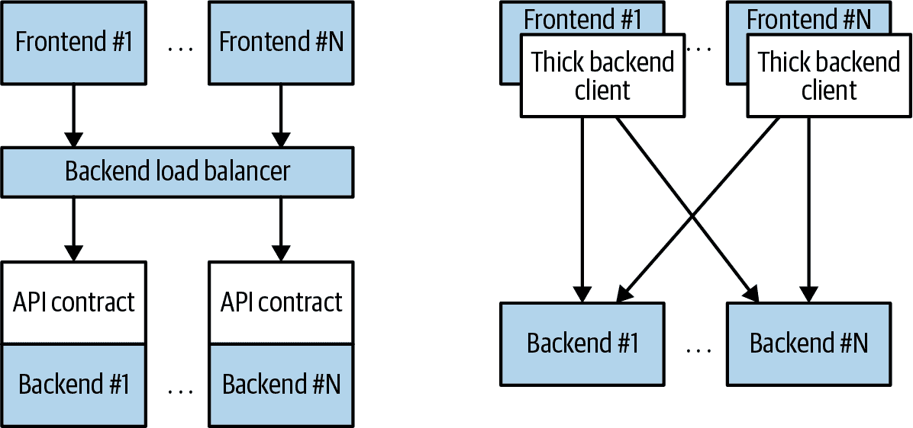
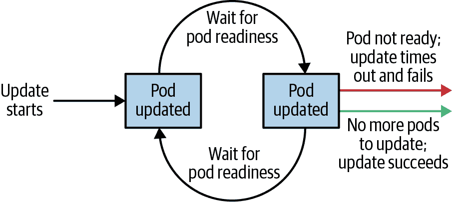

# 第十章：部署（Deployments）

到目前为止，您已经了解了如何将应用程序打包为容器、创建容器的复制集，并使用 Ingress 控制器来负载均衡流量到您的服务。您可以使用所有这些对象（Pods、ReplicaSets 和 Services）来构建应用程序的单个实例。但是，它们对于帮助您管理每日或每周发布新版本的节奏几乎没有帮助。实际上，Pods 和 ReplicaSets 都预期与不会更改的特定容器映像绑定。

Deployment 对象的存在是为了管理新版本的发布。Deployments 以超越任何特定版本的方式表示部署的应用程序。此外，Deployments 使您能够轻松地从代码的一个版本迁移到下一个版本。这个“滚动更新”过程是可指定的和谨慎的。它在升级单个 Pods 之间等待用户可配置的时间量。它还使用健康检查确保新版本的应用程序正在正确运行，并在发生太多故障时停止部署。

使用 Deployments，您可以简单而可靠地推出新的软件版本，无需停机或错误。由 Deployment 控制器在 Kubernetes 集群中运行来控制软件推出的实际机制。这意味着您可以让 Deployment 无人值守地进行，它仍然会正确和安全地操作。这使得将 Deployments 与许多持续交付工具和服务轻松集成成为可能。此外，从服务器端运行可以安全地执行来自网络连接质量较差或间歇性的地方的推出。想象一下，从手机上的地铁上推出软件的新版本。Deployments 使这成为可能且安全！

###### 注意

当 Kubernetes 首次发布时，其功能的最受欢迎的演示之一是“滚动更新”，展示了如何使用单个命令无缝更新运行中的应用程序，而无需任何停机并且不会丢失请求。这个最初的演示基于 `kubectl rolling-update` 命令，尽管其功能大部分已被 Deployment 对象所吸收，但该命令仍然可在命令行工具中使用。

# 您的第一个部署（Your First Deployment）

与 Kubernetes 中的所有对象一样，Deployment 可以表示为声明性 YAML 对象，提供有关您要运行的内容的详细信息。在以下情况下，Deployment 正在请求一个 `kuard` 应用程序的单个实例：

```
apiVersion: apps/v1
kind: Deployment
metadata:
  name: kuard
  labels:
    run: kuard
spec:
  selector:
    matchLabels:
      run: kuard
  replicas: 1
  template:
    metadata:
      labels:
        run: kuard
    spec:
      containers:
      - name: kuard
        image: gcr.io/kuar-demo/kuard-amd64:blue
```

将此 YAML 文件保存为 *kuard-deployment.yaml*，然后可以使用以下命令创建它：

```
$ kubectl create -f kuard-deployment.yaml
```

让我们探讨部署（Deployments）的实际工作原理。就像我们学到的 ReplicaSets 管理 Pods 一样，Deployments 管理 ReplicaSets。与 Kubernetes 中的所有关系一样，这种关系是由标签和标签选择器定义的。您可以通过查看 Deployment 对象来查看标签选择器：

```
$ kubectl get deployments kuard \
  -o jsonpath --template {.spec.selector.matchLabels}

{"run":"kuard"}
```

从中可以看出，部署正在管理一个带有标签`run=kuard`的副本集。您可以在副本集之间使用此标签选择器查询，以找到特定的副本集：

```
$ kubectl get replicasets --selector=run=kuard

NAME              DESIRED   CURRENT   READY     AGE
kuard-1128242161  1         1         1         13m
```

现在让我们看看部署和副本集之间的关系如何运作。我们可以使用命令式`scale`命令调整部署大小：

```
$ kubectl scale deployments kuard --replicas=2

deployment.apps/kuard scaled
```

现在如果我们再次列出该副本集，我们应该会看到：

```
$ kubectl get replicasets --selector=run=kuard

NAME              DESIRED   CURRENT   READY     AGE
kuard-1128242161  2         2         2         13m
```

扩展部署也已扩展了它控制的副本集。

现在让我们尝试相反的操作，扩展副本集：

```
$ kubectl scale replicasets kuard-1128242161 --replicas=1

replicaset.apps/kuard-1128242161 scaled
```

现在再次`get`该副本集：

```
$ kubectl get replicasets --selector=run=kuard

NAME              DESIRED   CURRENT   READY     AGE
kuard-1128242161  2         2         2         13m
```

这很奇怪。尽管将副本集扩展到一个副本，但其期望状态仍然是两个副本。出了什么问题？

请记住，Kubernetes 是一个在线的、自愈的系统。顶级部署对象正在管理此副本集。当您将副本数调整为一个时，它不再匹配部署的期望状态，部署的`replicas`设置为`2`。部署控制器注意到这一点，并采取行动确保观察到的状态与期望状态匹配，本例中重新调整副本数为两个。

如果您想直接管理该副本集，您需要删除部署。（记得设置`--cascade`为`false`，否则它将删除副本集和 Pod！）

# 创建部署

当然，正如在介绍中所述，您应该优先考虑在磁盘上使用 YAML 或 JSON 文件进行声明式管理您的 Kubernetes 配置状态。

作为起点，将此部署下载到一个 YAML 文件中：

```
$ kubectl get deployments kuard -o yaml > kuard-deployment.yaml
$ kubectl replace -f kuard-deployment.yaml --save-config
```

如果您查看文件，您会看到类似于以下内容（请注意，为了可读性，我们已删除了许多只读和默认字段）。注意注释、选择器和策略字段，因为它们提供了部署特定功能的见解：

```
apiVersion: apps/v1
kind: Deployment
metadata:
  annotations:
    deployment.kubernetes.io/revision: "1"
  creationTimestamp: null
  generation: 1
  labels:
    run: kuard
  name: kuard
spec:
  progressDeadlineSeconds: 600
  replicas: 1
  revisionHistoryLimit: 10
  selector:
    matchLabels:
      run: kuard
  strategy:
    rollingUpdate:
      maxSurge: 25%
      maxUnavailable: 25%
    type: RollingUpdate
  template:
    metadata:
      creationTimestamp: null
      labels:
        run: kuard
    spec:
      containers:
      - image: gcr.io/kuar-demo/kuard-amd64:blue
        imagePullPolicy: IfNotPresent
        name: kuard
        resources: {}
        terminationMessagePath: /dev/termination-log
        terminationMessagePolicy: File
      dnsPolicy: ClusterFirst
      restartPolicy: Always
      schedulerName: default-scheduler
      securityContext: {}
      terminationGracePeriodSeconds: 30
status: {}
```

###### 注意

您还需要运行`kubectl replace --save-config`。这会添加一个注释，以便在未来应用更改时，`kubectl`将知道上次应用的配置，从而实现更智能的配置合并。如果您始终使用`kubectl apply`，则仅在使用`kubectl create -f`创建部署后首次需要执行此步骤。

部署规范与副本集规范具有非常相似的结构。有一个 Pod 模板，其中包含由部署管理的每个副本创建的多个容器。除了 Pod 规范之外，还有一个`strategy`对象：

```
...
  strategy:
    rollingUpdate:
      maxSurge: 25%
      maxUnavailable: 25%
    type: RollingUpdate
...
```

`strategy`对象规定了新软件发布可以进行的不同方式。部署支持两种策略：`Recreate`和`RollingUpdate`。这些在本章后面详细讨论。

# 管理部署

与所有 Kubernetes 对象一样，您可以通过`kubectl describe`命令获取关于您的部署的详细信息。此命令提供了部署配置的概述，其中包括像选择器、副本和事件等有趣的字段：

```
$ kubectl describe deployments kuard

Name:                   kuard
Namespace:              default
CreationTimestamp:      Tue, 01 Jun 2021 21:19:46 -0700
Labels:                 run=kuard
Annotations:            deployment.kubernetes.io/revision: 1
Selector:               run=kuard
Replicas:               1 desired | 1 updated | 1 total | 1 available | 0 ...
StrategyType:           RollingUpdate
MinReadySeconds:        0
RollingUpdateStrategy:  25% max unavailable, 25% max surge
Pod Template:
  Labels:  run=kuard
  Containers:
   kuard:
    Image:        gcr.io/kuar-demo/kuard-amd64:blue
    Port:         <none>
    Host Port:    <none>
    Environment:  <none>
    Mounts:       <none>
  Volumes:        <none>
Conditions:
  Type           Status  Reason
  ----           ------  ------
  Available      True    MinimumReplicasAvailable
OldReplicaSets:  <none>
NewReplicaSet:   kuard-6d69d9fc5c (2/2 replicas created)
Events:
  Type    Reason             Age                   From                 Message
  ----    ------             ----                  ----                 -------
  Normal  ScalingReplicaSet  4m6s                  deployment-con...    ...
  Normal  ScalingReplicaSet  113s (x2 over 3m20s)  deployment-con...    ...

```

在 `describe` 的输出中，有大量重要的信息。输出中最重要的两个信息是 `OldReplicaSets` 和 `NewReplicaSet`。这些字段指向此 Deployment 当前管理的 ReplicaSet 对象。如果 Deployment 正在进行中的部署，这两个字段都会设置为一个值。如果部署完成，`OldReplicaSets` 将设置为 `<none>`。

除了 `describe` 命令外，还有 `kubectl rollout` 命令用于处理 Deployments。稍后我们将详细介绍此命令，但现在知道你可以使用 `kubectl rollout history` 获取与特定 Deployment 关联的部署历史。如果当前有进行中的 Deployment，可以使用 `kubectl rollout status` 获取该部署的当前状态。

# 更新 Deployments

Deployments 是描述已部署应用程序的声明性对象。对 Deployment 的两种最常见操作是扩展和应用程序更新。

## 扩展 Deployment

尽管我们之前展示了如何使用 `kubectl scale` 命令命令式地扩展 Deployment，但最佳实践是通过 YAML 文件声明性地管理您的 Deployments，然后使用这些文件来更新您的 Deployment。要扩展 Deployment，您应该编辑您的 YAML 文件以增加副本数：

```
...
spec:
  replicas: 3
...
```

保存并提交此更改后，您可以使用 `kubectl apply` 命令更新 Deployment：

```
$ kubectl apply -f kuard-deployment.yaml
```

这将更新 Deployment 的期望状态，导致 ReplicaSet 的大小增加，并最终创建由 Deployment 管理的新 Pod：

```
$ kubectl get deployments kuard

NAME    READY   UP-TO-DATE   AVAILABLE   AGE
kuard   3/3     3            3           10m
```

## 更新容器镜像

更新 Deployment 的另一个常见用例是在一个或多个容器中部署新软件版本。为此，您应该同样编辑 Deployment 的 YAML 文件，但这种情况下您更新的是容器镜像，而不是副本数量：

```
...
      containers:
      - image: gcr.io/kuar-demo/kuard-amd64:green
        imagePullPolicy: Always
...
```

对 Deployment 的模板进行注释，记录有关更新的一些信息：

```
...
spec:
  ...
  template:
    metadata:
      annotations:
        kubernetes.io/change-cause: "Update to green kuard"
...
```

###### 注意

确保将此注释添加到模板而不是 Deployment 本身，因为 `kubectl apply` 命令使用此字段在 Deployment 对象中。在进行简单扩展操作时，请不要更新 `change-cause` 注释。修改 `change-cause` 是模板的重大更改，并将触发新的部署。

同样，您可以使用 `kubectl apply` 更新 Deployment：

```
$ kubectl apply -f kuard-deployment.yaml
```

更新 Deployment 后，它将触发一个部署，您可以通过 `kubectl rollout` 命令监视该过程：

```
$ kubectl rollout status deployments kuard
deployment "kuard" successfully rolled out
```

您可以看到由 Deployment 管理的旧 ReplicaSet 和新 ReplicaSet，以及正在使用的镜像。旧 ReplicaSet 和新 ReplicaSet 都会保留下来，以便您可以进行回滚操作：

```
$ kubectl get replicasets -o wide

NAME               DESIRED   CURRENT   READY   ...   IMAGE(S)            ...
kuard-1128242161   0         0         0       ...   gcr.io/kuar-demo/   ...
kuard-1128635377   3         3         3       ...   gcr.io/kuar-demo/   ...
```

如果您正在进行部署并希望暂时暂停它（例如，如果您开始看到系统中的奇怪行为并希望进行调查），您可以使用 `pause` 命令：

```
$ kubectl rollout pause deployments kuard
deployment.apps/kuard paused
```

如果调查后认为发布可以安全进行，您可以使用`resume`命令从中断的地方重新开始：

```
$ kubectl rollout resume deployments kuard
deployment.apps/kuard resumed
```

## 发布历史记录

Kubernetes 部署维护发布历史记录，这对于了解部署的先前状态以及回滚到特定版本都很有用。

您可以通过运行以下命令查看部署历史记录：

```
$ kubectl rollout history deployment kuard

deployment.apps/kuard
REVISION  CHANGE-CAUSE
1         <none>
2         Update to green kuard

```

修订历史记录按从旧到新的顺序给出。每次新发布时都会递增唯一的修订号。到目前为止，我们有两个：初始部署和将图像更新为`kuard:green`。

如果您对特定修订版本的详细信息感兴趣，可以添加`--revision`标志以查看该特定修订版本的详细信息：

```
$ kubectl rollout history deployment kuard --revision=2

deployment.apps/kuard with revision #2
Pod Template:
  Labels:       pod-template-hash=54b74ddcd4
        run=kuard
  Annotations:  kubernetes.io/change-cause: Update to green kuard
  Containers:
   kuard:
    Image:      gcr.io/kuar-demo/kuard-amd64:green
    Port:       <none>
    Host Port:  <none>
    Environment:        <none>
    Mounts:     <none>
  Volumes:      <none>

```

让我们为此示例再做一个更新。通过修改容器版本号并更新`change-cause`注释，将`kuard`版本回退为`blue`。使用`kubectl apply`应用它。现在历史记录应该有三个条目：

```
$ kubectl rollout history deployment kuard

deployment.apps/kuard
REVISION  CHANGE-CAUSE
1         <none>
2         Update to green kuard
3         Update to blue kuard

```

假设最新版本存在问题，并且您希望在调查时回滚。您可以简单地撤消上次发布：

```
$ kubectl rollout undo deployments kuard
deployment.apps/kuard rolled back
```

`undo`命令在发布的任何阶段都有效。您可以撤消部分完成和完全完成的发布。撤消发布实际上只是逆向执行的发布（例如从 v2 到 v1，而不是从 v1 到 v2），同样控制发布策略的所有相同策略也适用于撤消策略。您可以看到部署对象简单地调整了受管 ReplicaSet 中的期望副本计数：

```
$ kubectl get replicasets -o wide

NAME               DESIRED   CURRENT   READY   ...   IMAGE(S)            ...
kuard-1128242161   0         0         0       ...   gcr.io/kuar-demo/   ...
kuard-1570155864   0         0         0       ...   gcr.io/kuar-demo/   ...
kuard-2738859366   3         3         3       ...   gcr.io/kuar-demo/   ...
```

###### 注意

当使用声明文件控制生产系统时，尽可能确保签入的清单与实际在集群中运行的内容匹配。当您执行`kubectl rollout undo`时，您正在以未反映在源代码控制中的方式更新生产状态。

撤销发布的另一种（也许更可取的）方法是还原您的 YAML 文件并`kubectl apply`以前的版本。通过这种方式，您的“变更跟踪配置”更接近实际运行在集群中的情况。

让我们再次查看部署历史记录：

```
$ kubectl rollout history deployment kuard

deployment.apps/kuard
REVISION  CHANGE-CAUSE
1         <none>
3         Update to blue kuard
4         Update to green kuard

```

缺失修订版本 2！事实证明，当您回滚到先前的修订版本时，部署简单地重用模板并重新编号，使其成为最新修订版本。之前的修订版本 2 现在成为修订版本 4。

我们之前看到您可以使用`kubectl rollout undo`命令回滚到部署的先前版本。此外，您还可以使用`--to-revision`标志回滚到历史记录中的特定修订版本：

```
$ kubectl rollout undo deployments kuard --to-revision=3
deployment.apps/kuard rolled back
$ kubectl rollout history deployment kuard
deployment.apps/kuard
REVISION  CHANGE-CAUSE
1         <none>
4         Update to green kuard
5         Update to blue kuard

```

再次执行`undo`命令采用修订版本 3，将其应用并重新编号为修订版本 5。

指定修订版本`0`是指定上一个修订版本的简写方式。这样，`kubectl rollout undo`相当于`kubectl rollout undo --to-revision=0`。

默认情况下，一个部署的最后 10 个修订版本会附加到部署对象本身。建议如果您有长期保留的部署，您可以设置部署修订历史的最大历史大小。例如，如果您每天更新一次，可以将修订历史限制为 14，以保留两周的修订（如果您不希望在两周之外回滚）。

要实现这一点，请在部署规范中使用 `revisionHistoryLimit` 属性：

```
...
spec:
  # We do daily rollouts, limit the revision history to two weeks of
  # releases as we don't expect to roll back beyond that.
  revisionHistoryLimit: 14
...
```

# 部署策略

当需要更改实施服务的软件版本时，Kubernetes 部署支持两种不同的滚动策略，`Recreate` 和 `RollingUpdate`。让我们依次查看每一种。

## 重建策略

`Recreate` 策略是这两种策略中更简单的一种。它只是更新其管理的 ReplicaSet 来使用新镜像，并终止与部署相关联的所有 Pod。ReplicaSet 注意到它不再有任何副本，并重新创建所有使用新镜像的 Pod。一旦 Pod 重新创建，它们就会运行新版本。

虽然这种策略快速而简单，但会导致工作负载停机。因此，`Recreate` 策略应仅用于可接受服务停机时间的测试部署。

## 滚动更新策略

`RollingUpdate` 策略通常是任何面向用户服务的首选策略。虽然比 `Recreate` 策略更慢，但也显著更复杂和更健壮。使用 `RollingUpdate`，您可以在服务仍在接收用户流量的情况下推出新版本，而无需任何停机时间。

如其名称所示，`RollingUpdate` 策略通过逐步更新一部分 Pod 来工作，直到所有 Pod 都运行新版本的软件。

### 管理多个版本的服务

重要的是，这意味着一段时间内，您的服务的新旧版本都将接收请求并提供流量服务。这对您如何构建软件具有重要的影响。特别是，非常重要的是，您的每个软件版本及其客户端都能够与稍旧和稍新的软件版本互换通信。

考虑以下情景：您正在部署前端软件的过程中；一半服务器运行版本 1，另一半运行版本 2。用户向您的服务发出初始请求并下载实现您 UI 的客户端 JavaScript 库。此请求由版本 1 服务器处理，因此用户收到版本 1 客户端库。此客户端库在用户浏览器中运行，并向您的服务发出后续 API 请求。这些 API 请求被路由到版本 2 服务器；因此，您的 JavaScript 客户端库的版本 1 正在与您的 API 服务器的版本 2 进行通信。如果您没有确保这些版本之间的兼容性，您的应用程序将无法正确运行。

起初，这可能看起来像是一个额外的负担。但事实上，您始终面临这个问题；只是您可能没有注意到。具体而言，用户可以在时间`t`之前发出请求，就在您启动更新之前。此请求由版本 1 服务器处理。在`t_1`时，您将服务更新到版本 2。在`t_2`时，运行在用户浏览器上的版本 1 客户端代码运行，并且请求了由版本 2 服务器操作的 API 端点。无论您如何更新软件，您都必须保持向后和向前兼容，以确保可靠的更新。`RollingUpdate`策略的本质只是使这一点更加清晰和明确。

这不仅适用于 JavaScript 客户端，它也适用于编译到其他服务并调用您服务的客户端库。仅仅因为您更新了，并不意味着它们已经更新了它们的客户端库。这种向后兼容性对于解耦您的服务与依赖于您服务的系统至关重要。如果您不规范化您的 API 并解耦自己，那么您将被迫仔细管理与调用您服务的所有其他系统的发布。这种紧密耦合使得非常难以产生必要的灵活性，以便每周甚至每小时、每天都能推出新软件。在图 10-1 中显示的解耦架构中，通过 API 合同和负载均衡器将前端与后端隔离开来，而在耦合架构中，则是通过编译到前端的厚客户端直接连接到后端。



###### 图 10-1。解耦（左）和耦合（右）应用架构的图示

### 配置滚动更新

`RollingUpdate`是一种非常通用的策略；它可以用来更新各种设置中的各种应用程序。因此，滚动更新本身是可以配置的；您可以调整其行为以适应您的特定需求。有两个参数可以用来调整滚动更新的行为：`maxUnavailable`和`maxSurge`。

`maxUnavailable`参数设置在滚动更新期间可以不可用的最大 Pod 数量。它可以设置为绝对数（例如`3`，表示最多可以不可用三个 Pod），也可以设置为百分比（例如`20%`，表示最多可以不可用期望副本数的 20%）。一般来说，对大多数服务来说，使用百分比是一个好方法，因为该值是正确应用的，无论在部署中期望的副本数是多少。但是，在某些情况下，您可能希望使用绝对数（例如将最大不可用 Pod 限制为一个）。

在其核心，`maxUnavailable`参数帮助调整滚动更新的速度。例如，如果将`maxUnavailable`设置为`50%`，则滚动更新将立即将旧的 ReplicaSet 缩减到其原始大小的 50%。如果有四个副本，则将其缩减为两个副本。然后，滚动更新将通过将新的 ReplicaSet 扩展到两个副本来替换已删除的 Pod，总共四个副本（两个旧的，两个新的）。然后，它将旧的 ReplicaSet 缩减为零个副本，总大小为两个新副本。最后，它将新的 ReplicaSet 扩展到四个副本，完成升级。因此，将`maxUnavailable`设置为`50%`，升级在四个步骤中完成，但在某些时候服务容量只有 50%。

如果我们将`maxUnavailable`设置为`25%`会发生什么？在这种情况下，每个步骤仅执行一个副本，因此完成升级需要两倍的步骤，但在升级期间可用性只降到最低的 75%。这说明了`maxUnavailable`允许我们在速度和可用性之间进行权衡。

###### 注意

细心的人会注意到，`Recreate`策略与将`maxUnavailable`设置为`100%`的`RollingUpdate`策略是相同的。

使用降低的容量来实现成功的升级在以下情况下非常有用：当您的服务具有周期性流量模式时（例如，在夜间流量较少）或者当您的资源有限，因此无法扩展到比当前最大副本数更大。

但是，有些情况下，您不希望低于 100%的容量，但愿意临时使用额外的资源来执行滚动升级。在这些情况下，您可以将`maxUnavailable`参数设置为`0`，而是使用`maxSurge`参数来控制升级。与`maxUnavailable`类似，`maxSurge`可以指定为具体的数值或百分比。

`maxSurge` 参数控制可以创建多少额外资源来实现部署。为了说明其工作原理，想象一个具有 10 个副本的服务。我们将 `maxUnavailable` 设置为 `0`，将 `maxSurge` 设置为 `20%`。部署首先会将新的 ReplicaSet 扩展 2 个副本，总共达到 12 个副本（120%）在服务中。然后，它会将旧的 ReplicaSet 缩减到 8 个副本，服务总数为 10 个（8 个旧的，2 个新的）。这个过程一直持续，直到部署完成。在任何时候，服务的容量保证至少为 100%，并且用于部署的最大额外资源限制为所有资源的额外 20%。

###### 注意

将 `maxSurge` 设置为 `100%` 等同于蓝/绿部署。部署控制器首先将新版本扩展到旧版本的 100%。一旦新版本健康，它立即将旧版本缩减到 0%。

## 减缓部署以确保服务健康

阶段性部署的目的是确保部署结果是一个健康、稳定的服务运行新软件版本。为了做到这一点，部署控制器始终等待一个 Pod 报告其准备就绪，然后再继续更新下一个 Pod。

###### 警告

部署控制器检查 Pod 的状态，这由其准备就绪检查确定。准备就绪检查是 Pod 的健康检查的一部分，在第五章 中详细描述。如果你希望使用部署来可靠地部署你的软件，*必须* 为 Pod 中的容器指定准备就绪健康检查。如果缺少这些检查，部署控制器在不知道 Pod 状态的情况下运行。

然而，仅仅注意到一个 Pod 已经准备就绪并不足以让你对 Pod 是否实际上表现正确有足够的信心。有些错误条件不会立即发生。例如，你可能有一个严重的内存泄漏需要几分钟才能显示出来，或者你可能有一个只有 1% 请求触发的 bug。在大多数真实场景中，你希望等待一段时间，以高度确信新版本在正确运行后再继续更新下一个 Pod。

对于部署，这个等待时间由 `minReadySeconds` 参数定义：

```
...
spec:
  minReadySeconds: 60
...
```

将 `minReadySeconds` 设置为 `60` 表示部署必须在看到一个 Pod 变为健康后等待 60 秒，*然后* 再继续更新下一个 Pod。

除了等待 Pod 变为健康状态外，你还需要设置一个超时时间限制系统等待的时间。例如，假设你的服务的新版本有一个 bug 并立即陷入死锁。它将永远无法准备就绪，在没有超时的情况下，部署控制器将永远停滞你的部署。

在这种情况下的正确行为是超时滚动发布。这反过来将发布标记为失败。此失败状态可用于触发警报，指示操作员发布存在问题。

###### 注意

乍一看，超时滚动发布似乎是一个不必要的复杂过程。然而，越来越多的事物，如发布，正被完全自动化的系统触发，几乎没有人类参与。在这种情况下，超时变得至关重要，它可以触发发布的自动回滚，或者创建一个触发人工干预的工单/事件。

为了设置超时期限，您将使用部署参数`progressDeadlineSeconds`：

```
...
spec:
  progressDeadlineSeconds: 600
...
```

本示例将进度截止期限设置为 10 分钟。如果在滚动发布的任何特定阶段未能在 10 分钟内取得进展，则该部署将标记为失败，并且所有推进部署的尝试都将停止。

需要注意的是，此超时是以部署的*进度*而不是部署的整体长度来计算的。在此上下文中，进度被定义为部署创建或删除 Pod 的任何时间。发生这种情况时，超时时钟将重置为零。图 10-2 显示了部署的生命周期。



###### 图 10-2\. Kubernetes 部署生命周期

# 删除一个部署

如果您希望删除部署，可以使用以下命令：

```
$ kubectl delete deployments kuard
```

您还可以使用您之前创建的声明性 YAML 文件来执行此操作：

```
$ kubectl delete -f kuard-deployment.yaml
```

无论哪种情况，默认情况下删除部署将删除整个服务。这意味着不仅会删除部署，还会删除它管理的任何 ReplicaSets，以及 ReplicaSets 管理的任何 Pods。与 ReplicaSets 一样，如果这不是期望的行为，则可以使用`--cascade=false`标志仅删除部署对象。

# 监控部署

如果部署在指定时间内未能取得进展，则会超时。发生这种情况时，部署的状态将转换为失败状态。此状态可以从`status.conditions`数组中获取，其中将存在一个`Type`为`Progressing`且`Status`为`False`的`Condition`。处于这种状态的部署已失败，并且将不会进一步推进。要设置部署控制器在转换到此状态之前应等待多长时间，请使用`spec.progressDeadlineSeconds`字段。

# 总结

Kubernetes 的主要目标是使您能够轻松构建和部署可靠的分布式系统。这意味着不仅仅是一次性实例化应用程序，而是管理定期安排的新软件服务版本的滚动发布。部署是可靠发布和发布管理的关键组成部分。在下一章中，我们将介绍 DaemonSets，它们确保在 Kubernetes 集群中的一组节点上只运行一个 Pod 的副本。
