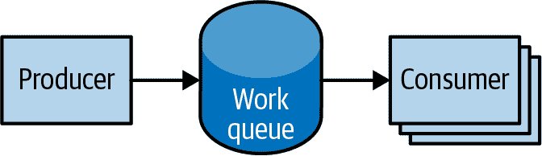

# 第十二章：作业

到目前为止，我们专注于长时间运行的进程，例如数据库和 Web 应用程序。这些类型的工作负载运行直到升级或服务不再需要为止。虽然长时间运行的进程占 Kubernetes 集群中运行工作负载的绝大多数，但通常需要运行短暂的一次性任务。作业对象专门用于处理这些类型的任务。

作业创建直到成功终止（例如，退出代码为 0）的 Pod。相比之下，常规 Pod 将会无论其退出代码如何都会持续重新启动。作业适用于仅需执行一次的任务，如数据库迁移或批处理作业。如果作为常规 Pod 运行，您的数据库迁移任务将会在循环中运行，每次退出后都会重新填充数据库。

在本章中，我们将探讨 Kubernetes 提供的最常见的作业模式。我们还将向您展示如何在实际场景中利用这些模式。

# 作业对象

作业对象负责根据作业规范中的模板创建和管理 Pod。这些 Pod 通常运行直到成功完成。作业对象协调并行运行多个 Pod 的数量。

如果 Pod 在成功终止之前失败，作业控制器将基于作业规范中的 Pod 模板创建一个新的 Pod。由于 Pod 必须被调度，如果调度程序找不到所需资源，可能会导致作业无法执行。此外，由于分布式系统的特性，在某些故障场景下，可能会为特定任务创建重复的 Pod 的小概率存在。

# 作业模式

作业旨在管理类似批处理的工作负载，其中工作项由一个或多个 Pod 处理。默认情况下，每个作业运行一个 Pod，直到成功终止为止。作业模式由作业的两个主要属性定义：作业完成数和并行运行的 Pod 数。在“运行一次直到完成”的模式下，`completions`和`parallelism`参数被设置为`1`。表 12-1 根据作业配置中`completions`和`parallelism`的组合突出显示了作业模式。

表 12-1\. 作业模式

| 类型 | 用例 | 行为 | `completions` | `parallelism` |
| --- | --- | --- | --- | --- |
| 一次性任务 | 数据库迁移 | 一个 Pod 运行一次直到成功终止 | 1 | 1 |
| 并行固定完成 | 多个 Pod 并行处理一组工作 | 一个或多个 Pod 运行一次或多次直到达到固定完成数 | 1+ | 1+ |
| 工作队列：并行作业 | 多个 Pod 从集中工作队列处理 | 一个或多个 Pod 运行一次直到成功终止 | 1 | 2+ |

## 一次性任务

一次性作业提供了一种方法来运行一个单独的 Pod，直到成功终止。虽然这听起来像是一个简单的任务，但在执行时确实需要一些工作。首先，必须创建一个 Pod，并将其提交到 Kubernetes API。这是使用作业配置中定义的 Pod 模板完成的。一旦作业运行起来，必须监视支持作业的 Pod 是否成功终止。作业可能由于多种原因失败，包括应用程序错误，在运行时未捕获的异常或在作业有机会完成之前节点故障。在所有情况下，作业控制器负责重新创建 Pod，直到成功终止为止。

在 Kubernetes 中创建一次性作业的多种方法。最简单的方法是使用 `kubectl` 命令行工具：

```
$ kubectl run -i oneshot \
  --image=gcr.io/kuar-demo/kuard-amd64:blue \
  --restart=OnFailure \
  --command /kuard \
  -- --keygen-enable \
     --keygen-exit-on-complete \
     --keygen-num-to-gen 10

...
(ID 0) Workload starting
(ID 0 1/10) Item done: SHA256:nAsUsG54XoKRkJwyN+OShkUPKew3mwq7OCc
(ID 0 2/10) Item done: SHA256:HVKX1ANns6SgF/er1lyo+ZCdnB8geFGt0/8
(ID 0 3/10) Item done: SHA256:irjCLRov3mTT0P0JfsvUyhKRQ1TdGR8H1jg
(ID 0 4/10) Item done: SHA256:nbQAIVY/yrhmEGk3Ui2sAHuxb/o6mYO0qRk
(ID 0 5/10) Item done: SHA256:CCpBoXNlXOMQvR2v38yqimXGAa/w2Tym+aI
(ID 0 6/10) Item done: SHA256:wEY2TTIDz4ATjcr1iimxavCzZzNjRmbOQp8
(ID 0 7/10) Item done: SHA256:t3JSrCt7sQweBgqG5CrbMoBulwk4lfDWiTI
(ID 0 8/10) Item done: SHA256:E84/Vze7KKyjCh9OZh02MkXJGoty9PhaCec
(ID 0 9/10) Item done: SHA256:UOmYex79qqbI1MhcIfG4hDnGKonlsij2k3s
(ID 0 10/10) Item done: SHA256:WCR8wIGOFag84Bsa8f/9QHuKqF+0mEnCADY
(ID 0) Workload exiting
```

这里有一些需要注意的事项：

+   `kubectl` 的 `-i` 选项表示这是一个交互式命令。`kubectl` 将等待作业运行，并显示作业中的第一个（在本例中是唯一的）Pod 的日志输出。

+   `--restart=OnFailure` 是告诉 `kubectl` 创建 Job 对象的选项。

+   `--` 后面的所有选项都是容器映像的命令行参数。这些指令我们的测试服务器 (`kuard`) 生成十个 4,096 位的 SSH 密钥，然后退出。

+   您的输出可能与此不完全匹配。`kubectl` 使用 `-i` 选项经常会错过输出的前几行。

作业完成后，Job 对象和相关的 Pod 被保留，以便您可以检查日志输出。请注意，如果没有传递 `-a` 标志，此作业不会显示在 `kubectl get jobs` 中。没有此标志，`kubectl` 会隐藏已完成的作业。在继续之前删除作业：

```
$ kubectl delete pods oneshot
```

创建一次性作业的另一种选项是使用配置文件，如 示例 12-1 中所示。

##### 示例 12-1\. job-oneshot.yaml

```
apiVersion: batch/v1
kind: Job
metadata:
  name: oneshot
spec:
  template:
    spec:
      containers:
      - name: kuard
        image: gcr.io/kuar-demo/kuard-amd64:blue
        imagePullPolicy: Always
        command:
        - "/kuard"
        args:
        - "--keygen-enable"
        - "--keygen-exit-on-complete"
        - "--keygen-num-to-gen=10"
      restartPolicy: OnFailure
```

使用 `kubectl apply` 命令提交作业：

```
$ kubectl apply -f job-oneshot.yaml
job.batch/oneshot created
```

然后描述 `oneshot` 作业：

```
$ kubectl describe jobs oneshot

Name:           oneshot
Namespace:      default
Selector:       controller-uid=a2ed65c4-cfda-43c8-bb4a-707c4ed29143
Labels:         controller-uid=a2ed65c4-cfda-43c8-bb4a-707c4ed29143
                job-name=oneshot
Annotations:    <none>
Parallelism:    1
Completions:    1
Start Time:     Wed, 02 Jun 2021 21:23:23 -0700
Completed At:   Wed, 02 Jun 2021 21:23:51 -0700
Duration:       28s
Pods Statuses:  0 Running / 1 Succeeded / 0 Failed
Pod Template:
  Labels:  controller-uid=a2ed65c4-cfda-43c8-bb4a-707c4ed29143
           job-name=oneshot
Events:
  ... Reason             Message
  ... ------             -------
  ... SuccessfulCreate   Created pod: oneshot-4kfdt
```

您可以通过查看所创建的 Pod 的日志来查看作业的结果：

```
$ kubectl logs oneshot-4kfdt

...
Serving on :8080
(ID 0) Workload starting
(ID 0 1/10) Item done: SHA256:+r6b4W81DbEjxMcD3LHjU+EIGnLEzbpxITKn8IqhkPI
(ID 0 2/10) Item done: SHA256:mzHewajaY1KA8VluSLOnNMk9fDE5zdn7vvBS5Ne8AxM
(ID 0 3/10) Item done: SHA256:TRtEQHfflJmwkqnNyGgQm/IvXNykSBIg8c03h0g3onE
(ID 0 4/10) Item done: SHA256:tSwPYH/J347il/mgqTxRRdeZcOazEtgZlA8A3/HWbro
(ID 0 5/10) Item done: SHA256:IP8XtguJ6GbWwLHqjKecVfdS96B17nnO21I/TNc1j9k
(ID 0 6/10) Item done: SHA256:ZfNxdQvuST/6ZzEVkyxdRG98p73c/5TM99SEbPeRWfc
(ID 0 7/10) Item done: SHA256:tH+CNl/IUl/HUuKdMsq2XEmDQ8oAvmhMO6Iwj8ZEOj0
(ID 0 8/10) Item done: SHA256:3GfsUaALVEHQcGNLBOu4Qd1zqqqJ8j738i5r+I5XwVI
(ID 0 9/10) Item done: SHA256:5wV4L/xEiHSJXwLUT2fHf0SCKM2g3XH3sVtNbgskCXw
(ID 0 10/10) Item done: SHA256:bPqqOonwSbjzLqe9ZuVRmZkz+DBjaNTZ9HwmQhbdWLI
(ID 0) Workload exiting
```

恭喜，您的作业已成功运行！

###### 注意

注意，当创建 Job 对象时我们没有指定任何标签。与其他使用标签来识别一组 Pod 的控制器（例如 DaemonSet、ReplicaSet 和 Deployment）类似，如果一个 Pod 被多个对象重用，可能会导致意外行为。

因为作业有一个有限的开始和结束，用户通常会创建许多这样的作业。这使得选择唯一标签更加困难和更为关键。因此，Job 对象将自动选择一个唯一标签，并用它来标识它所创建的 Pod。在高级场景中（例如在不杀死它管理的 Pod 的情况下替换运行中的作业），用户可以选择关闭此自动行为，并手动指定标签和选择器。

我们刚才看到一个作业可以成功完成。但如果出现故障会发生什么呢？让我们试试看。修改我们的配置文件中 `kuard` 的参数，使其在生成三个密钥后以非零的退出码失败，如 示例 12-2 所示。

##### 示例 12-2\. job-oneshot-failure1.yaml

```
...
spec:
  template:
    spec:
      containers:
        ...
        args:
        - "--keygen-enable"
        - "--keygen-exit-on-complete"
        - "--keygen-exit-code=1"
        - "--keygen-num-to-gen=3"
...
```

现在使用 `kubectl apply -f job-oneshot-failure1.yaml` 启动这个。让它运行一段时间，然后查看 Pod 的状态：

```
$ kubectl get pod -l job-name=oneshot

NAME            READY     STATUS             RESTARTS   AGE
oneshot-3ddk0   0/1       CrashLoopBackOff   4          3m
```

这里我们看到同一个 Pod 已经重新启动了四次。Kubernetes 的这个 Pod 处于 `CrashLoopBackOff` 状态。在某些情况下，可能会有某个地方的 bug 导致程序在启动后立即崩溃。在这种情况下，Kubernetes 会等待一段时间再重新启动 Pod，以避免出现崩溃循环，这会消耗节点上的资源。所有这些都由 `kubelet` 在节点本地处理，而不涉及作业本身。

终止该作业（`kubectl delete jobs oneshot`），让我们尝试其他方法。再次修改配置文件，并将 `restartPolicy` 从 `OnFailure` 改为 `Never`。使用 `kubectl apply -f jobs-oneshot-failure2.yaml` 启动它。

如果我们让这个运行一段时间，然后查看相关的 Pods，我们会发现一些有趣的事情：

```
$ kubectl get pod -l job-name=oneshot -a

NAME            READY     STATUS    RESTARTS   AGE
oneshot-0wm49   0/1       Error     0          1m
oneshot-6h9s2   0/1       Error     0          39s
oneshot-hkzw0   1/1       Running   0          6s
oneshot-k5swz   0/1       Error     0          28s
oneshot-m1rdw   0/1       Error     0          19s
oneshot-x157b   0/1       Error     0          57s
```

我们可以看到这里有多个 Pods 出现错误。通过设置 `restartPolicy: Never`，我们告诉 `kubelet` 在失败时不重新启动 Pod，而只是声明 Pod 已失败。然后 Job 对象会察觉到并创建一个新的 Pod 替代它。如果不小心的话，这可能会在集群中产生大量的“垃圾”。因此，我们建议您使用 `restartPolicy: OnFailure`，这样失败的 Pods 将在原地重新运行。您可以使用 `kubectl delete jobs oneshot` 清理这些。

到目前为止，我们已经看到程序因为退出并返回非零的退出码而失败。但工作器可能以其他方式失败。具体来说，它们可能会卡住并且无法继续向前进展。为了帮助处理这种情况，您可以在作业中使用活跃性探针。如果活跃性探针策略确定一个 Pod 已经死亡，它会为您重新启动或替换它。

## 并行性

生成密钥可能会很慢。让我们一起启动一堆工作器，以加快密钥生成速度。我们将使用 `completions` 和 `parallelism` 参数的组合。我们的目标是通过运行 10 次 `kuard`，每次运行生成 10 个密钥，共生成 100 个密钥。但我们不想淹没我们的集群，所以我们将一次限制在五个 Pods。

这意味着将 `completions` 设置为 `10`，`parallelism` 设置为 `5`。配置如 示例 12-3 所示。

##### 示例 12-3\. job-parallel.yaml

```
apiVersion: batch/v1
kind: Job
metadata:
  name: parallel
  labels:
    chapter: jobs
spec:
  parallelism: 5
  completions: 10
  template:
    metadata:
      labels:
        chapter: jobs
    spec:
      containers:
      - name: kuard
        image: gcr.io/kuar-demo/kuard-amd64:blue
        imagePullPolicy: Always
        command:
        - "/kuard"
        args:
        - "--keygen-enable"
        - "--keygen-exit-on-complete"
        - "--keygen-num-to-gen=10"
      restartPolicy: OnFailure
```

启动它：

```
$ kubectl apply -f job-parallel.yaml
job.batch/parallel created
```

现在观察 Pods 的启动、执行和退出情况。直到总共有 10 个 Pods 完成为止。在这里，我们使用 `--watch` 标志让 `kubectl` 保持运行，并实时列出变化：

```
$ kubectl get pods -w
NAME             READY     STATUS              RESTARTS  AGE
parallel-55tlv   1/1       Running             0         5s
parallel-5s7s9   1/1       Running             0         5s
parallel-jp7bj   1/1       Running             0         5s
parallel-lssmn   1/1       Running             0         5s
parallel-qxcxp   1/1       Running             0         5s
NAME             READY     STATUS              RESTARTS  AGE
parallel-jp7bj   0/1       Completed           0         26s
parallel-tzp9n   0/1       Pending             0         0s
parallel-tzp9n   0/1       Pending             0         0s
parallel-tzp9n   0/1       ContainerCreating   0         1s
parallel-tzp9n   1/1       Running             0         1s
parallel-tzp9n   0/1       Completed           0         48s
parallel-x1kmr   0/1       Pending             0         0s
...
```

随意学习已完成的作业，并检查它们的日志，查看它们生成的密钥指纹。通过使用 `kubectl delete job parallel` 删除已完成的作业对象来清理。

## 工作队列

作业的一个常见用例是从工作队列处理工作。在这种情况下，某些任务创建多个工作项并将它们发布到工作队列。可以运行工作者作业来处理每个工作项，直到工作队列为空（参见 图 12-1）。



###### 图 12-1\. 并行作业

### 启动工作队列

我们首先启动一个集中式工作队列服务。`kuard` 内置了一个简单的基于内存的工作队列系统。我们将启动一个 `kuard` 实例来充当所有工作的协调者。

接下来，我们创建一个简单的 ReplicaSet 来管理一个单例工作队列守护程序。我们使用 ReplicaSet 来确保在机器故障时会创建一个新的 Pod，如 示例 12-4 所示。

##### 示例 12-4\. rs-queue.yaml

```
apiVersion: apps/v1
kind: ReplicaSet
metadata:
  labels:
    app: work-queue
    component: queue
    chapter: jobs
  name: queue
spec:
  replicas: 1
  selector:
    matchLabels:
      app: work-queue
      component: queue
      chapter: jobs
  template:
    metadata:
      labels:
        app: work-queue
        component: queue
        chapter: jobs
    spec:
      containers:
      - name: queue
        image: "gcr.io/kuar-demo/kuard-amd64:blue"
        imagePullPolicy: Always
```

使用以下命令运行工作队列：

```
$ kubectl apply -f rs-queue.yaml
replicaset.apps/queue created
```

此时，工作队列守护程序应该已经启动和运行。让我们使用端口转发连接到它。在终端窗口中保持此命令运行：

```
$ kubectl port-forward rs/queue 8080:8080
Forwarding from 127.0.0.1:8080 -> 8080
Forwarding from [::1]:8080 -> 8080
```

你可以打开浏览器访问 *http://localhost:8080* 并查看 `kuard` 接口。切换到“MemQ Server”选项卡以监视当前情况。

将工作队列服务器放置好后，下一步是使用服务来暴露它。这将使生产者和消费者可以通过 DNS 找到工作队列，如 示例 12-5 所示。

##### 示例 12-5\. service-queue.yaml

```
apiVersion: v1
kind: Service
metadata:
  labels:
    app: work-queue
    component: queue
    chapter: jobs
  name: queue
spec:
  ports:
  - port: 8080
    protocol: TCP
    targetPort: 8080
  selector:
    app: work-queue
    component: queue
```

使用 `kubectl` 创建队列服务：

```
$ kubectl apply -f service-queue.yaml
service/queue created
```

### 加载队列

现在我们已经准备好将一堆工作项放入队列中了。为了简单起见，我们将使用 `curl` 驱动工作队列服务器的 API 并插入一堆工作项。`curl` 将通过我们之前设置的 `kubectl port-forward` 与工作队列通信，如 示例 12-6 所示。

##### 示例 12-6\. load-queue.sh

```
# Create a work queue called 'keygen'
curl -X PUT localhost:8080/memq/server/queues/keygen

# Create 100 work items and load up the queue.
for i in work-item-{0..99}; do
  curl -X POST localhost:8080/memq/server/queues/keygen/enqueue \
    -d "$i"
done
```

运行这些命令，你应该会在终端看到输出了 100 个 JSON 对象，并为每个工作项生成一个唯一的消息标识符。你可以通过 UI 中的“MemQ Server”选项卡确认队列的状态，或者直接通过工作队列 API 查询：

```
$ curl 127.0.0.1:8080/memq/server/stats
{
    "kind": "stats",
    "queues": [
        {
            "depth": 100,
            "dequeued": 0,
            "drained": 0,
            "enqueued": 100,
            "name": "keygen"
        }
    ]
}
```

现在我们已经准备好启动一个任务来消耗工作队列直到为空。

### 创建消费者任务

这就是事情变得有趣的地方！`kuard` 也可以作为消费者模式运行。我们可以设置它从工作队列中获取工作项，创建一个密钥，然后在队列为空时退出，如 示例 12-7 所示。

##### 示例 12-7\. job-consumers.yaml

```
apiVersion: batch/v1
kind: Job
metadata:
  labels:
    app: message-queue
    component: consumer
    chapter: jobs
  name: consumers
spec:
  parallelism: 5
  template:
    metadata:
      labels:
        app: message-queue
        component: consumer
        chapter: jobs
    spec:
      containers:
      - name: worker
        image: "gcr.io/kuar-demo/kuard-amd64:blue"
        imagePullPolicy: Always
        command:
        - "/kuard"
        args:
        - "--keygen-enable"
        - "--keygen-exit-on-complete"
        - "--keygen-memq-server=http://queue:8080/memq/server"
        - "--keygen-memq-queue=keygen"
      restartPolicy: OnFailure
```

在这里，我们告诉作业并行启动五个 Pod。由于 `completions` 参数未设置，我们将作业放入工作池模式。一旦第一个 Pod 以零退出代码退出，作业将开始收尾，并且不会启动任何新的 Pod。这意味着在工作完成之前，没有任何工作者应该退出，他们都在结束工作的过程中。

现在，创建 `consumers` 作业：

```
$ kubectl apply -f job-consumers.yaml
job.batch/consumers created
```

然后，您可以查看支持作业的 Pod：

```
$ kubectl get pods
NAME              READY     STATUS    RESTARTS   AGE
queue-43s87       1/1       Running   0          5m
consumers-6wjxc   1/1       Running   0          2m
consumers-7l5mh   1/1       Running   0          2m
consumers-hvz42   1/1       Running   0          2m
consumers-pc8hr   1/1       Running   0          2m
consumers-w20cc   1/1       Running   0          2m
```

请注意，有五个 Pod 并行运行。这些 Pod 将继续运行，直到工作队列为空。您可以在工作队列服务器的 UI 上观察到这一过程。随着队列变空，消费者 Pod 将干净退出，`consumers` 作业将被视为完成。

### 清理

使用标签，我们可以清理本节中创建的所有内容：

```
$ kubectl delete rs,svc,job -l chapter=jobs
```

# CronJobs

有时，您希望安排作业在特定间隔运行。为实现此目的，您可以在 Kubernetes 中声明一个 CronJob，负责在特定间隔创建一个新的 Job 对象。示例 12-8 是一个 CronJob 声明的示例：

##### 示例 12-8\. job-cronjob.yaml

```
apiVersion: batch/v1
kind: CronJob
metadata:
  name: example-cron
spec:
  # Run every fifth hour
  schedule: "0 */5 * * *"
  jobTemplate:
    spec:
      template:
        spec:
          containers:
          - name: batch-job
            image: my-batch-image
          restartPolicy: OnFailure
```

请注意 `spec.schedule` 字段，其中包含 CronJob 的间隔，采用标准的 `cron` 格式。

您可以将此文件保存为 *job-cronjob.yaml*，并使用 `kubectl create -f cron-job.yaml` 创建 CronJob。如果您对 CronJob 的当前状态感兴趣，可以使用 `kubectl describe *<cron-job>*` 获取详细信息。

# 摘要

在单个集群上，Kubernetes 可以处理长时间运行的工作负载，如 Web 应用程序和短暂的工作负载，如批处理作业。作业抽象允许您对批处理作业模式进行建模，从简单的一次性任务到处理许多项目直到工作耗尽的并行作业。

作业是一种低级原语，可直接用于简单的工作负载。但是，Kubernetes 是从头开始构建的，可以通过更高级别的对象进行扩展。作业也不例外；更高级别的编排系统可以轻松使用它们来承担更复杂的任务。
