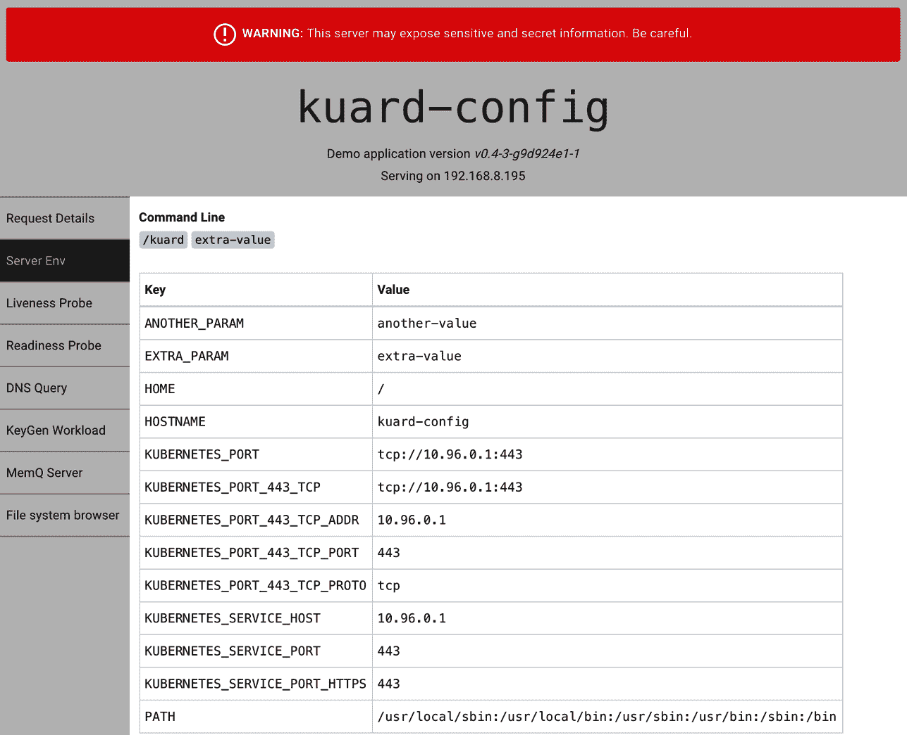
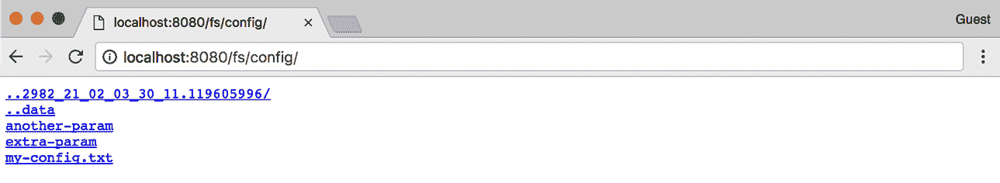

# 第十三章：ConfigMaps 和 Secrets

尽可能使容器镜像可重复使用是一个好的实践。同一个镜像应该能够用于开发、暂存和生产环境。如果同一个镜像足够通用，能够跨应用和服务使用，那就更好了。如果每个新环境都需要重新创建镜像，测试和版本控制就会变得更加风险和复杂。那么在运行时如何专门化使用该镜像呢？

这就是 ConfigMaps 和 Secrets 发挥作用的地方。ConfigMaps 用于为工作负载提供配置信息。这既可以是像字符串一样的细粒度信息，也可以是文件形式的复合值。Secrets 类似于 ConfigMaps，但专注于使敏感信息对工作负载可用。它们可以用于诸如凭据或 TLS 证书之类的内容。

# ConfigMaps

将 ConfigMap 视为 Kubernetes 对象之一，用于定义一个小型文件系统。另一种方式是作为在定义容器环境或命令行时可使用的变量集合。需要注意的关键点是，ConfigMap 与 Pod 在运行前被合并。这意味着容器镜像和 Pod 定义可以通过更改使用的 ConfigMap 被许多工作负载重复使用。

## 创建 ConfigMaps

让我们马上创建一个 ConfigMap。像 Kubernetes 中的许多对象一样，您可以通过即时和命令式的方式创建它们，或者可以从磁盘上的清单创建它们。我们将从即时方法开始。

首先，假设我们在磁盘上有一个文件（称为 *my-config.txt*），我们希望将其提供给相关的 Pod 使用，如 示例 13-1 中所示。

##### 示例 13-1\. my-config.txt

```
# This is a sample config file that I might use to configure an application
parameter1 = value1
parameter2 = value2
```

接下来，让我们用这个文件创建一个 ConfigMap。我们还会在这里添加几个简单的键值对。这些在命令行上被称为字面值：

```
$ kubectl create configmap my-config \
  --from-file=my-config.txt \
  --from-literal=extra-param=extra-value \
  --from-literal=another-param=another-value
```

刚刚创建的 ConfigMap 对象的等效 YAML 如下所示：

```
$ kubectl get configmaps my-config -o yaml

apiVersion: v1
data:
  another-param: another-value
  extra-param: extra-value
  my-config.txt: |
    # This is a sample config file that I might use to configure an application
    parameter1 = value1
    parameter2 = value2
kind: ConfigMap
metadata:
  creationTimestamp: ...
  name: my-config
  namespace: default
  resourceVersion: "13556"
  selfLink: /api/v1/namespaces/default/configmaps/my-config
  uid: 3641c553-f7de-11e6-98c9-06135271a273
```

如您所见，ConfigMap 只是一个存储在对象中的键值对。有趣的部分是当您尝试*使用* ConfigMap 时。

## 使用 ConfigMap

使用 ConfigMap 的三种主要方式：

文件系统

您可以将 ConfigMap 挂载到 Pod 中。根据键名，为每个条目创建一个文件。该文件的内容设置为该值。

环境变量

ConfigMap 可以用于动态设置环境变量的值。

命令行参数

Kubernetes 支持基于 ConfigMap 值动态创建容器的命令行。

让我们为 `kuard` 创建一个清单，将所有这些内容汇总到一起，如 示例 13-2 中所示。

##### 示例 13-2\. kuard-config.yaml

```
apiVersion: v1
kind: Pod
metadata:
  name: kuard-config
spec:
  containers:
    - name: test-container
      image: gcr.io/kuar-demo/kuard-amd64:blue
      imagePullPolicy: Always
      command:
        - "/kuard"
        - "$(EXTRA_PARAM)"
      env:
        # An example of an environment variable used inside the container
        - name: ANOTHER_PARAM
          valueFrom:
            configMapKeyRef:
              name: my-config
              key: another-param
        # An example of an environment variable passed to the command to start
        # the container (above).
        - name: EXTRA_PARAM
          valueFrom:
            configMapKeyRef:
              name: my-config
              key: extra-param
      volumeMounts:
        # Mounting the ConfigMap as a set of files
        - name: config-volume
          mountPath: /config
  volumes:
    - name: config-volume
      configMap:
        name: my-config
  restartPolicy: Never
```

对于文件系统方法，我们在 Pod 内部创建一个新的卷，并给它命名为 `config-volume`。然后我们将此卷定义为 ConfigMap 卷，并指向要挂载的 ConfigMap。我们必须指定将其挂载到 `kuard` 容器中的位置，使用 `volumeMount`。在这种情况下，我们将其挂载在 `/config`。

环境变量使用特殊的 `valueFrom` 成员进行指定。这引用了 ConfigMap 及其内部的数据键。命令行参数基于环境变量构建。Kubernetes 将使用特殊的 `$(*<env-var-name>*)` 语法执行正确的替换。

运行此 Pod，并让我们进行端口转发，以查看应用程序如何看待这个世界：

```
$ kubectl apply -f kuard-config.yaml
$ kubectl port-forward kuard-config 8080
```

现在将浏览器指向 *http://localhost:8080*。我们可以看看如何以三种方式将配置值注入到程序中。点击左侧的“Server Env”选项卡。这将显示应用程序启动时使用的命令行及其环境，如 图 13-1 所示。



###### 图 13-1\. 显示 `kuard` 的环境

在这里，我们可以看到我们添加了两个环境变量（`ANOTHER_PARAM` 和 `EXTRA_PARAM`），它们的值通过 ConfigMap 设置。我们还在 `kuard` 的命令行中添加了一个基于 `EXTRA_PARAM` 值的参数。

接下来，点击“文件系统浏览器”选项卡（图 13-2）。这允许您探索应用程序所见的文件系统。您应该看到一个名为 `/config` 的条目。这是基于我们的 ConfigMap 创建的卷。如果您进入其中，您将看到每个 ConfigMap 条目都创建了一个文件。您还将看到一些隐藏文件（以 *..* 开头），这些文件用于在更新 ConfigMap 时进行新值的干净交换。



###### 图 13-2\. 通过 `kuard` 查看的 /config 目录

# 机密

虽然 ConfigMaps 对于大多数配置数据非常适用，但某些数据非常敏感。这包括密码、安全令牌或其他类型的私钥。总称为这类数据“Secrets”。Kubernetes 具有本地支持，用于安全地存储和处理此类数据。

Secrets 允许创建不捆绑敏感数据的容器映像。这使得容器可以在不同环境中保持可移植性。Secrets 通过在 Pod 清单和 Kubernetes API 中显式声明向 Pod 暴露。通过这种方式，Kubernetes Secrets API 提供了一种面向应用程序的机制，用于以易于审计的方式向应用程序公开敏感的配置信息，并利用本地操作系统隔离原语。

本节的其余部分将探讨如何创建和管理 Kubernetes Secrets，并提出将 Secrets 暴露给需要它们的 Pod 的最佳实践。

###### 警告

默认情况下，Kubernetes Secrets 以明文形式存储在集群的 `etcd` 存储中。根据您的需求，这可能不足以提供足够的安全性。特别是，在您的集群中具有集群管理权限的任何人都可以读取集群中的所有 Secrets。

在最近的 Kubernetes 版本中，已添加了使用用户提供的密钥对 Secrets 进行加密的支持，通常集成到云密钥存储中。此外，大多数云密钥存储与 [Kubernetes Secrets Store CSI Driver](https://oreil.ly/DRHt6) volumes 集成，使您可以完全跳过 Kubernetes Secrets，完全依赖于云提供商的密钥存储。所有这些选项都应为您提供足够的工具来创建符合您需求的安全配置文件。

## 创建 Secrets

使用 Kubernetes API 或 `kubectl` 命令行工具创建 Secrets。Secrets 作为一组键/值对持有一个或多个数据元素。

在本节中，我们将创建一个 Secret 来存储 `kuard` 应用程序的 TLS 密钥和证书，以满足前面列出的存储要求。

###### 注意

`kuard` 容器镜像不捆绑 TLS 证书或密钥。这使得 `kuard` 容器可以跨环境移植，并通过公共 Docker 仓库分发。

创建 Secret 的第一步是获取要存储的原始数据。可以通过运行以下命令下载 `kuard` 应用程序的 TLS 密钥和证书：

```
$ curl -o kuard.crt  https://storage.googleapis.com/kuar-demo/kuard.crt
$ curl -o kuard.key https://storage.googleapis.com/kuar-demo/kuard.key
```

###### 警告

这些证书与世界共享，并没有提供实际的安全性。除了在这些示例中作为学习工具外，请不要使用它们。

使用本地存储的 *kuard.crt* 和 *kuard.key* 文件，我们已准备好创建 Secret。使用 `create secret` 命令创建名为 `kuard-tls` 的 Secret：

```
$ kubectl create secret generic kuard-tls \
  --from-file=kuard.crt \
  --from-file=kuard.key
```

`kuard-tls` Secret 已创建并包含两个数据元素。运行以下命令以获取详细信息：

```
$ kubectl describe secrets kuard-tls

Name:         kuard-tls
Namespace:    default
Labels:       <none>
Annotations:  <none>

Type:         Opaque

Data
====
kuard.crt:    1050 bytes
kuard.key:    1679 bytes
```

有了 `kuard-tls` Secret，我们可以通过使用 Secrets volume 从 Pod 中消费它。

## 消费 Secrets

应用程序可以使用 Kubernetes REST API 消费 Secrets，前提是它们知道如何直接调用该 API。然而，我们的目标是保持应用程序的可移植性。它们不仅应该在 Kubernetes 中运行良好，而且应该在其他平台上不经修改地运行。

不再通过 API 服务器访问 Secrets，我们可以使用*Secrets volume*。使用 Secrets volume 类型，可以向 Pods 公开 Secret 数据。Secrets volumes 由 `kubelet` 管理，并在 Pod 创建时创建。Secrets 存储在 `tmpfs` volume（也称为 RAM 磁盘）上，因此不会写入节点的磁盘。

Secret 的每个数据元素存储在卷挂载中指定的目标挂载点下的单独文件中。`kuard-tls` Secret 包含两个数据元素：*kuard.crt* 和 *kuard.key*。将 `kuard-tls` Secrets volume 挂载到 `/tls` 将生成以下文件：

```
/tls/kuard.crt
/tls/kuard.key
```

在 Example 13-3 中的 Pod 配置文件中演示了如何声明一个 Secrets 卷，这会在`/tls`下向`kuard`容器公开`kuard-tls` Secret。

##### Example 13-3\. kuard-secret.yaml

```
apiVersion: v1
kind: Pod
metadata:
  name: kuard-tls
spec:
  containers:
    - name: kuard-tls
      image: gcr.io/kuar-demo/kuard-amd64:blue
      imagePullPolicy: Always
      volumeMounts:
      - name: tls-certs
        mountPath: "/tls"
        readOnly: true
  volumes:
    - name: tls-certs
      secret:
        secretName: kuard-tls
```

使用 `kubectl` 创建 `kuard-tls` Pod 并观察正在运行的 Pod 的日志输出：

```
$ kubectl apply -f kuard-secret.yaml
```

运行以下命令连接到 Pod：

```
$ kubectl port-forward kuard-tls 8443:8443
```

现在在浏览器中输入 *https://localhost:8443*。你会看到一些无效证书警告，因为这是为 *kuard.example.com* 自签名的证书。如果你忽略此警告，你会看到通过 HTTPS 托管的`kuard`服务器。使用“文件系统浏览器”选项卡在`/tls`目录中找到磁盘上的证书。

## 私有容器注册表

Secrets 的一个特殊用例是存储私有容器注册表的访问凭据。Kubernetes 支持使用存储在私有注册表上的镜像，但访问这些镜像需要凭据。私有镜像可以存储在一个或多个私有注册表中。这对于在集群的每个可能的节点上管理每个私有注册表的凭据是一个挑战。

*Image pull Secrets* 利用 Secrets API 自动分发私有注册表凭据。Image pull Secrets 存储方式与常规 Secrets 相同，但通过`spec.imagePullSecrets` Pod 规范字段消费。

使用`kubectl create secret docker-registry`来创建这种特殊类型的 Secret：

```
$ kubectl create secret docker-registry my-image-pull-secret \
  --docker-username=*<username>* \
  --docker-password=*<password>* \
  --docker-email=*<email-address>*
```

通过在 Pod 配置文件中引用镜像 `pull secret` 来启用对私有仓库的访问，如 Example 13-4 中所示。

##### Example 13-4\. kuard-secret-ips.yaml

```
apiVersion: v1
kind: Pod
metadata:
  name: kuard-tls
spec:
  containers:
    - name: kuard-tls
      image: gcr.io/kuar-demo/kuard-amd64:blue
      imagePullPolicy: Always
      volumeMounts:
      - name: tls-certs
        mountPath: "/tls"
        readOnly: true
  imagePullSecrets:
  - name:  my-image-pull-secret
  volumes:
    - name: tls-certs
      secret:
        secretName: kuard-tls
```

如果你反复从同一注册表中拉取，可以将 Secrets 添加到与每个 Pod 关联的默认服务账户中，以避免在创建每个 Pod 时都需要指定 Secrets。

# 命名约束

Secret 或 ConfigMap 中数据项的键名称定义为映射到有效环境变量名称。它们可以以点开头，然后是一个字母或数字，后跟包括点、破折号和下划线的字符。点不能重复，且点与下划线或破折号不能相邻。更正式地说，它们必须符合正则表达式 `^[.]?a-zAZ0-9*$`。 Table 13-1 中提供了 ConfigMaps 和 Secrets 的一些有效和无效名称示例。

Table 13-1\. ConfigMap 和 Secret 键示例

| 有效键名称 | 无效键名称 |
| --- | --- |
| `.auth_token` | `Token..properties` |
| `Key.pem` | `auth file.json` |
| `config_file` | `_password.txt` |

###### 注意

当选择关键名称时，请记住这些键可能会通过卷挂载暴露给 Pod。选择一个在命令行或配置文件中指定时能够有意义的名称。将 TLS 密钥命名为`key.pem`比在配置应用程序以访问 Secrets 时使用`tls-key`更清晰。

ConfigMap 数据值是在清单中直接指定的简单 UTF-8 文本。Secret 数据值使用 base64 编码的任意数据。使用 base64 编码使得可以存储二进制数据。然而，这也使得在 YAML 文件中管理作为 base64 编码值存储的 Secrets 更加困难。请注意，ConfigMap 或 Secret 的最大大小为 1 MB。

# 管理 ConfigMaps 和 Secrets

ConfigMaps 和 Secrets 通过 Kubernetes API 进行管理。通常的 `create`、`delete`、`get` 和 `describe` 命令适用于操作这些对象。

## 列表

您可以使用 `kubectl get secrets` 命令列出当前命名空间中的所有 Secrets：

```
$ kubectl get secrets

NAME                  TYPE                                  DATA      AGE
default-token-f5jq2   kubernetes.io/service-account-token   3         1h
kuard-tls             Opaque                                2         20m
```

同样地，您可以列出命名空间中的所有 ConfigMaps：

```
$ kubectl get configmaps

NAME        DATA      AGE
my-config   3         1m
```

可以使用 `kubectl describe` 获取单个对象的更多详细信息：

```
$ kubectl describe configmap my-config

Name:           my-config
Namespace:      default
Labels:         <none>
Annotations:    <none>

Data
====
another-param:  13 bytes
extra-param:    11 bytes
my-config.txt:  116 bytes
```

最后，您可以使用类似以下命令查看原始数据（包括 Secrets 中的值）：`kubectl get configmap my-config -o yaml` 或 `kubectl get secret kuard-tls -o yaml`。

## 创建

创建 Secret 或 ConfigMap 的最简单方法是通过 `kubectl create secret generic` 或 `kubectl create configmap`。有多种方法可以指定放入 Secret 或 ConfigMap 中的数据项。这些可以结合在一个命令中：

`--from-file=*<filename>*`

使用文件加载具有与文件名相同的 Secret 数据键。

`--from-file=*<key>*=*<filename>*`

从明确指定了 Secret 数据键的文件加载。

`--from-file=*<directory>*`

加载指定目录中的所有文件，其中文件名是可接受的键名。

`--from-literal=*<key>*=*<value>*`

直接使用指定的键/值对。

## 更新

您可以更新 ConfigMap 或 Secret，并在运行的应用程序中反映出来。如果应用程序配置为重新读取配置值，则无需重新启动。接下来，我们将描述更新 ConfigMaps 或 Secrets 的三种方式。

### 从文件更新

如果您有 ConfigMap 或 Secret 的清单，可以直接编辑它，并使用 `kubectl replace -f <*filename*>` 替换为新版本。如果之前使用 `kubectl apply` 创建了资源，还可以使用 `kubectl apply -f *<filename>*`。

由于数据文件编码到这些对象的方式，更新配置可能有些繁琐；没有支持从外部文件加载数据的 `kubectl` 命令。数据必须直接存储在 YAML 文件中。

最常见的用例是当 ConfigMap 定义为目录或资源列表的一部分，并且所有内容都一起创建和更新。通常这些清单将被提交到源代码控制中。

###### 警告

将 Secret YAML 文件提交到源代码控制通常是一个不好的主意，因为很容易无意中将这些文件推送到公共位置并泄露您的 Secrets。

### 重新创建和更新

如果你将输入存储到 ConfigMaps 或 Secrets 中作为独立的文件（而不是直接嵌入到 YAML 中），你可以使用 `kubectl` 重新创建清单，然后使用它来更新对象，看起来像这样：

```
$ kubectl create secret generic kuard-tls \
  --from-file=kuard.crt --from-file=kuard.key \
  --dry-run -o yaml | kubectl replace -f -
```

此命令行首先使用与现有 Secret 同名的新 Secret。如果我们仅止步于此，Kubernetes API 服务器将返回错误， complaining that we are trying to create a Secret that already exists. Instead, we tell `kubectl` not to actually send the data to the server but instead to dump the YAML that it *would have* sent to the API server to `stdout`. We then pipe that to `kubectl replace` and use `-f -` to tell it to read from `stdin`. In this way, we can update a Secret from files on disk without having to manually base64-encode data.

### 编辑当前版本

更新 ConfigMap 的最终方法是使用 `kubectl edit` 在编辑器中提供 ConfigMap 的一个版本，以便你可以进行微调（你也可以用 Secret 做同样的事情，但你将被困在自己管理值的 base64 编码中）：

```
$ kubectl edit configmap my-config
```

你应该在编辑器中看到 ConfigMap 的定义。进行所需的更改，然后保存并关闭编辑器。对象的新版本将被推送到 Kubernetes API 服务器。

### 实时更新

使用 API 更新 ConfigMap 或 Secret 后，它将自动推送到使用该 ConfigMap 或 Secret 的所有卷。可能需要几秒钟，但文件列表和文件内容（由 `kuard` 看到）将使用这些新值进行更新。使用此实时更新功能，你可以更新应用程序的配置而无需重启它们。

目前没有内置的方法来在部署 ConfigMap 的新版本时向应用程序发出信号。这取决于应用程序（或某些辅助脚本）来查找要更改和重新加载的配置文件。

使用 `kuard` 中的文件浏览器（通过 `kubectl port-forward` 访问）是与动态更新 Secrets 和 ConfigMaps 互动的好方法。

# 摘要

ConfigMaps 和 Secrets 是提供应用程序动态配置的好方法。它们允许你只需创建一个容器镜像（和 Pod 定义），然后在不同的上下文中重复使用它。这可以包括从开发到分级再到生产时使用完全相同的镜像。它还可以包括在多个团队和服务之间使用单个镜像。将配置与应用程序代码分离将使你的应用程序更可靠和可重用。
