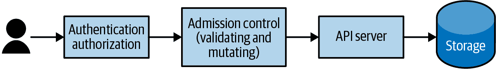
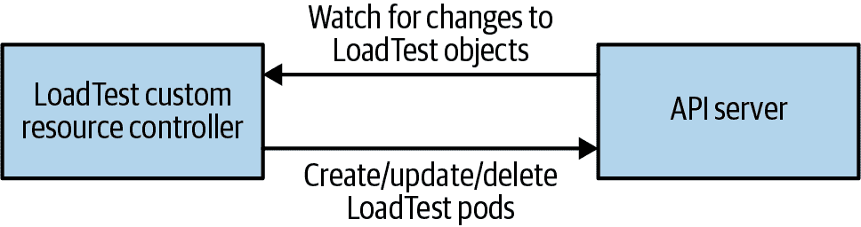

# 第十七章：扩展 Kubernetes

从一开始就清楚，Kubernetes 将不仅仅是其核心 API 集合；一旦应用程序在集群中进行编排，就会有无数其他有用的工具和实用程序可以作为 API 对象在 Kubernetes 集群中表示和部署。挑战在于如何在没有无限制扩展 API 的情况下，接纳这些对象和用例的爆炸式增长。

为了解决扩展用例和 API 扩展之间的张力，我们付出了大量努力，使 Kubernetes API 可扩展。这种可扩展性意味着集群运营者可以根据自己的需求定制他们的集群，添加适合的附加组件。这种可扩展性使人们能够自行增强其集群，使用社区开发的集群附加组件，甚至开发捆绑在集群插件生态系统中出售的扩展。可扩展性也催生了管理系统的全新模式，如运算符模式。

不论是构建自己的扩展还是从生态系统中消费运算符，理解如何扩展 Kubernetes API 服务器以及如何构建和交付扩展是解锁 Kubernetes 及其生态系统全部潜力的关键组成部分。随着越来越多的高级工具和平台使用这些可扩展机制构建在 Kubernetes 之上，了解它们的操作方式对于在现代 Kubernetes 集群中构建应用程序至关重要。

# 扩展 Kubernetes 的含义

总体而言，扩展 Kubernetes API 服务器通常是为集群添加新功能或限制和调整用户与其集群交互的方式。有一个丰富的插件生态系统，集群管理员可以使用这些插件为其集群添加服务和功能。值得注意的是，扩展集群是一项非常高权限的操作。这不应该授予任意用户或任意代码的能力，因为扩展集群需要集群管理员权限。即使是集群管理员在安装第三方工具时也应该小心谨慎。一些扩展，如准入控制器，可以用于查看集群中创建的所有对象，并且可以轻易地被用作窃取密钥或运行恶意代码的手段。此外，扩展集群会使其与原始的 Kubernetes 有所不同。在多个集群上运行时，构建工具以保持跨集群一致性体验非常重要，这包括安装的扩展。

# 可扩展点

Kubernetes 可以通过多种方式进行扩展，从自定义资源定义到容器网络接口插件。本章将重点介绍通过向 API 请求添加新资源类型或接入控制器来扩展 API 服务器。我们不会涵盖 CNI/CSI/CRI（容器网络接口/容器存储接口/容器运行时接口）扩展，因为它们更常用于 Kubernetes 集群提供者而非本书的目标读者——Kubernetes 终端用户。

除了接入控制器和 API 扩展之外，实际上还有许多方法可以在完全不修改 API 服务器的情况下“扩展”您的集群。这些包括安装自动日志记录和监控的 DaemonSet、扫描服务以查找跨站点脚本（XSS）漏洞的工具等。然而，在开始自行扩展集群之前，值得考虑的是在现有 Kubernetes API 的限制内可能实现的各种可能性。

要理解接入控制器和 CustomResourceDefinition 的作用，有助于回顾请求通过 Kubernetes API 服务器的流程，如 图 17-1 所示。



###### 图 17-1\. API 服务器请求流程

*接入控制器*是在 API 对象写入后端存储之前调用的。接入控制器可以拒绝或修改 API 请求。几个接入控制器内置于 Kubernetes API 服务器中；例如，限制范围接入控制器为没有设置默认限制的 Pod 设置默认限制。许多其他系统使用自定义接入控制器自动将 sidecar 容器注入到系统上创建的所有 Pod 中，以实现“自动化体验”。

另一种扩展形式，也可以与接入控制器结合使用，是*自定义资源*。使用自定义资源，可以向 Kubernetes API 添加全新的 API 对象。这些新的 API 对象可以添加到命名空间中，受到 RBAC 的限制，并且可以通过现有工具如 `kubectl` 和 Kubernetes API 访问。

后续章节将更详细地描述这些 Kubernetes 扩展点，并提供如何扩展集群的使用案例和实际示例。

创建自定义资源的第一步是创建 CustomResourceDefinition。该对象实际上是一个元资源，即定义另一个资源的资源。

作为一个具体的例子，考虑定义一个新资源来表示集群中的负载测试。当创建新的 LoadTest 资源时，将在 Kubernetes 集群中启动一个负载测试，并向服务驱动流量。

创建新资源的第一步是通过 CustomResourceDefinition 进行定义。一个示例定义如下：

```
apiVersion: apiextensions.k8s.io/v1beta1
kind: CustomResourceDefinition
metadata:
  name: loadtests.beta.kuar.com
spec:
  group: beta.kuar.com
  versions:
    - name: v1
      served: true
      storage: true
  scope: Namespaced
  names:
    plural: loadtests
    singular: loadtest
    kind: LoadTest
    shortNames:
    - lt
```

您可以看到这是像任何其他对象一样的 Kubernetes 对象。它有一个`metadata`子对象，在该子对象中，资源被命名。然而，在自定义资源的情况下，名称是特殊的。它必须是格式`*<resource-plural>*.*<api-group>*`，以确保集群中每个资源定义都是唯一的，因为每个 CustomResourceDefinition 的名称必须匹配此模式，并且集群中没有两个对象可以具有相同的名称。因此，我们确保没有两个 CustomResourceDefinitions 定义相同的资源。

除了元数据外，CustomResourceDefinition 还有一个`spec`子对象。这是资源本身的定义位置。在该`spec`对象中，有一个`apigroup`字段，用于为资源提供 API 组。如前所述，它必须与 CustomResourceDefinition 名称的后缀匹配。此外，还有一个版本列表，包括版本名称（例如，`v1`，`v2`等），以及指示该版本是否由 API 服务器提供以及用于在 API 服务器的后端存储中存储数据的版本的字段。`storage`字段必须对于资源的单个版本为 true。还有一个`scope`字段，用于指示资源是否是有命名空间的（默认为有命名空间），以及一个`names`字段，允许为资源的单数、复数和`kind`值定义。它还允许定义方便的“短名称”，以供在`kubectl`和其他地方使用。

根据这个定义，您可以在 Kubernetes API 服务器中创建资源。但是首先，为了展示动态资源类型的真实本质，请尝试使用`kubectl`列出我们的`loadtests`资源：

```
$ kubectl get loadtests
```

您将看到当前没有定义这样的资源。现在使用*loadtest-resource.yaml*创建此资源：

```
$ kubectl create -f loadtest-resource.yaml
```

然后再次获取`loadtests`资源：

```
$ kubectl get loadtests
```

这次您会看到已定义了 LoadTest 资源类型，尽管尚未存在此资源类型的实例。让我们通过创建一个新的 LoadTest 资源来改变这种情况。

就像所有内置的 Kubernetes API 对象一样，您可以使用 YAML 或 JSON 来定义自定义资源（在本例中是我们的 LoadTest）。请参阅以下定义：

```
apiVersion: beta.kuar.com/v1
kind: LoadTest
metadata:
  name: my-loadtest
spec:
  service: my-service
  scheme: https
  requestsPerSecond: 1000
  paths:
  - /index.xhtml
  - /login.xhtml
  - /shares/my-shares/
```

有一件事情您会注意到，那就是我们从未在 CustomResourceDefinition 中定义自定义资源的模式。实际上，为自定义资源提供 OpenAPI 规范（以前称为 Swagger）是可能的，但对于简单的资源类型来说，这种复杂性通常不值得。如果您确实希望执行验证，可以注册一个验证入场控制器，如下节所述。

您现在可以使用*loadtest.yaml*文件创建资源，就像使用任何内置类型一样：

```
$ kubectl create -f loadtest.yaml
```

当您列出`loadtests`资源时，您将看到您新创建的资源：

```
$ kubectl get loadtests
```

这可能令人兴奋，但实际上它还没有做任何事情。当然，你可以使用这个简单的 CRUD（创建/读取/更新/删除）API 来操作 LoadTest 对象的数据，但是在我们定义的新 API 中，没有控制器存在于集群中以在定义 LoadTest 对象时做出反应并采取行动，因此没有实际的负载测试被创建。LoadTest 自定义资源仅仅是添加 LoadTests 到我们集群所需基础设施的一半。另一半是一段代码，将持续监视自定义资源，并根据需要创建、修改或删除 LoadTests 来实现 API。

就像 API 的用户一样，控制器与 API 服务器交互以列出 LoadTests 并监视可能发生的任何更改。控制器与 API 服务器之间的这种交互在图 17-2 中展示。



###### 图 17-2\. CustomResourceDefinition 交互

这样的控制器代码可能从简单到复杂不等。最简单的控制器运行一个 `for` 循环，重复轮询新的自定义对象，然后执行创建或删除实现这些自定义对象的资源（例如 LoadTest 工作 Pod）的操作。

然而，这种基于轮询的方法效率低下：轮询循环的周期增加了不必要的延迟，并且轮询的开销可能会给 API 服务器增加不必要的负载。更高效的方法是使用 API 服务器上的 watch API，它在更新发生时提供更新流，消除了轮询的延迟和开销。然而，在一个没有 bug 的方式中正确地使用这个 API 是复杂的。因此，如果您想使用 watch，强烈建议使用像 [*client-go* library](https://oreil.ly/L0QK2) 中提供的 *Informer* 模式这样的受到良好支持的机制。

现在我们已经创建了一个自定义资源，并通过控制器实现了它，我们在集群中具备了一个新资源的基本功能。然而，作为一个良好运行的资源所需的许多部分还缺失。其中最重要的两个部分是验证和默认设置。*验证*是确保发送到 API 服务器的 LoadTest 对象格式正确，并能用于创建负载测试的过程，而*默认设置*则通过默认提供自动化、常用的数值，使我们的资源更易于使用。接下来我们将介绍如何为我们的自定义资源添加这些功能。

正如前面提到的，通过 OpenAPI 规范来添加验证的一个选项是为我们的对象定义一个 OpenAPI 规范。这对于基本验证（例如检查必填字段的存在或未知字段的缺失）是有用的。完整的 OpenAPI 教程超出了本书的范围，但是在线上有很多资源，包括 [完整的 Kubernetes API 规范](https://oreil.ly/u3rRl)。

一般来说，API 架构实际上不足以验证 API 对象。例如，在我们的 `loadtests` 示例中，我们可能希望验证 LoadTest 对象具有有效的方案（例如 *http* 或 *https*）或者 `requestsPerSecond` 是一个非零正数。

为了完成这个任务，我们将使用一个验证型 admission 控制器。正如前面讨论的那样，admission 控制器在请求被处理之前拦截这些请求，并且可以在处理过程中拒绝或修改这些请求。admission 控制器可以通过动态 admission 控制系统添加到集群中。动态 admission 控制器是一个简单的 HTTP 应用程序。API 服务器可以通过 Kubernetes Service 对象或任意 URL 连接到 admission 控制器。这意味着 admission 控制器可以选择在集群外部运行，例如在云提供商的函数即服务（如 Azure Functions 或 AWS Lambda）中。

要安装我们的验证型 admission 控制器，我们需要将其指定为 Kubernetes ValidatingWebhookConfiguration。该对象指定了 admission 控制器运行的端点，以及应该在哪个资源（在本例中为 LoadTest）和操作（在本例中为 `CREATE`）上运行 admission 控制器。您可以在以下代码中查看验证型 admission 控制器的完整定义：

```
apiVersion: admissionregistration.k8s.io/v1beta1
kind: ValidatingWebhookConfiguration
metadata:
  name: kuar-validator
webhooks:
- name: validator.kuar.com
  rules:
  - apiGroups:
    - "beta.kuar.com"
    apiVersions:
    - v1
    operations:
    - CREATE
    resources:
    - loadtests
  clientConfig:
    # Substitute the appropriate IP address for your webhook
    url: https://192.168.1.233:8080
    # This should be the base64-encoded CA certificate for your cluster,
    # you can find it in your ${KUBECONFIG} file
    caBundle: REPLACEME
```

对于安全性来说是件好事，但对于复杂性来说是件不好的事，被 Kubernetes API 服务器访问的 Webhook 只能通过 HTTPS 访问。因此，我们需要生成一个用于提供 Webhook 的证书。做到这一点的最简单方法是使用集群自身的证书颁发机构（CA）生成新证书。

首先，我们需要一个私钥和一个证书签名请求（CSR）。以下是一个生成这些内容的简单 Go 程序：

```
package main

import (
	"crypto/rand"
	"crypto/rsa"
	"crypto/x509"
	"crypto/x509/pkix"
	"encoding/asn1"
	"encoding/pem"
	"net/url"
	"os"
)

func main() {
	host := os.Args[1]
	name := "server"

	key, err := rsa.GenerateKey(rand.Reader, 1024)
	if err != nil {
		panic(err)
	}
	keyDer := x509.MarshalPKCS1PrivateKey(key)
	keyBlock := pem.Block{
		Type:  "RSA PRIVATE KEY",
		Bytes: keyDer,
	}
	keyFile, err := os.Create(name + ".key")
	if err != nil {
		panic(err)
	}
	pem.Encode(keyFile, &keyBlock)
	keyFile.Close()

	commonName := "myuser"
	emailAddress := "someone@myco.com"

	org := "My Co, Inc."
	orgUnit := "Widget Farmers"
	city := "Seattle"
	state := "WA"
	country := "US"

	subject := pkix.Name{
		CommonName:         commonName,
		Country:            []string{country},
		Locality:           []string{city},
		Organization:       []string{org},
		OrganizationalUnit: []string{orgUnit},
		Province:           []string{state},
	}

	uri, err := url.ParseRequestURI(host)
	if err != nil {
		panic(err)
	}

	asn1, err := asn1.Marshal(subject.ToRDNSequence())
	if err != nil {
		panic(err)
	}
	csr := x509.CertificateRequest{
		RawSubject:         asn1,
		EmailAddresses:     []string{emailAddress},
		SignatureAlgorithm: x509.SHA256WithRSA,
		URIs:               []*url.URL{uri},
	}

	bytes, err := x509.CreateCertificateRequest(rand.Reader, &csr, key)
	if err != nil {
		panic(err)
	}
	csrFile, err := os.Create(name + ".csr")
	if err != nil {
		panic(err)
	}

	pem.Encode(csrFile, &pem.Block{Type: "CERTIFICATE REQUEST", Bytes: bytes})
	csrFile.Close()
}
```

您可以使用以下命令运行此程序：

```
$ go run csr-gen.go *<URL-for-webhook>*
```

并且它会生成两个文件，*server.csr* 和 *server-key.pem*。

然后，您可以使用以下 YAML 为 Kubernetes API 服务器创建证书签名请求：

```
apiVersion: certificates.k8s.io/v1beta1
kind: CertificateSigningRequest
metadata:
  name: validating-controller.default
spec:
  groups:
  - system:authenticated
  request: REPLACEME
  usages:
  usages:
  - digital signature
  - key encipherment
  - key agreement
  - server auth
```

您会注意到 `request` 字段的值是 `REPLACEME`；这需要用我们在前述代码中生成的 base64 编码的证书签名请求来替换：

```
$ perl -pi -e s/REPLACEME/$(base64 server.csr | tr -d '\n')/ \
admission-controller-csr.yaml
```

现在您的证书签名请求已经准备好，您可以将其发送到 API 服务器以获取证书：

```
$ kubectl create -f admission-controller-csr.yaml
```

接下来，您需要批准该请求：

```
$ kubectl certificate approve validating-controller.default
```

一旦批准，您可以下载新证书：

```
$ kubectl get csr validating-controller.default -o json | \
  jq -r .status.certificate | base64 -d > server.crt
```

有了证书，您最终可以创建基于 SSL 的准入控制器（哦！）。当准入控制器代码收到请求时，它包含一个类型为 `AdmissionReview` 的对象，其中包含有关请求的元数据以及请求本身的主体。在我们的验证准入控制器中，我们仅注册了单个资源类型和单个操作（`CREATE`），因此我们不需要检查请求的元数据。相反，我们直接进入资源本身，并验证 `requestsPerSecond` 是否为正数以及 URL 方案是否有效。如果它们不是，则返回一个 JSON 主体，禁止请求。

实现准入控制器以提供默认值与刚才描述的步骤类似，但不使用 `ValidatingWebhookConfiguration`，而是使用 `MutatingWebhookConfiguration`，并需要提供一个 JSON Patch 对象来修改请求对象在存储之前。

下面是一个 TypeScript 片段，您可以将其添加到验证准入控制器中以添加默认值。如果 `loadtest` 中的 `paths` 字段长度为零，则为 `/index.xhtml` 添加一个路径：

```
        if (needsPatch(loadtest)) {
            const patch = [
                { 'op': 'add', 'path': '/spec/paths', 'value': ['/index.xhtml'] },
            ]
            response['patch'] = Buffer.from(JSON.stringify(patch))
                .toString('base64');
            response['patchType'] = 'JSONPatch';
        }
```

您可以通过简单地更改 YAML 对象中的 `kind` 字段并将文件保存为 *mutating-controller.yaml*，然后通过运行以下命令创建控制器：

```
$ kubectl create -f mutating-controller.yaml
```

到此为止，您已经看到了如何使用自定义资源和准入控制器扩展 Kubernetes API 服务器的完整示例。以下部分描述了一些各种扩展的常见模式。

# 自定义资源的模式

并非所有的自定义资源都相同。有许多原因可以扩展 Kubernetes API 的表面，接下来的部分将讨论一些您可能想考虑的一般模式。

## 仅数据

API 扩展的最简单模式是“仅数据”的概念。在这种模式下，您只是使用 API 服务器来存储和检索应用程序的信息。重要的是要注意，您不应该将 Kubernetes API 服务器用作应用程序数据存储的关键/值存储。 Kubernetes API 服务器并非设计用于您的应用程序的关键/值存储；相反，API 扩展应该是帮助您管理应用程序部署或运行时的控制或配置对象。例如，“仅数据”模式的一个用例可能是配置您的应用程序的金丝雀部署，例如，将所有流量的 10% 导向实验后端。尽管从理论上讲，这种配置信息也可以存储在 ConfigMap 中，但 ConfigMap 本质上是无类型的，有时使用更强类型的 API 扩展对象提供了更清晰和易用的操作。

只是数据的扩展不需要相应的控制器来激活它们，但它们可能有验证或变更控制器来确保它们的格式良好。例如，在金丝雀使用案例中，验证控制器可以确保金丝雀对象中的所有百分比总和为 100%。

## 编译器

稍微复杂一些的模式是“编译器”或“抽象”模式。在这种模式中，API 扩展对象代表一个更高级别的抽象，被“编译”成一组低级别的 Kubernetes 对象的组合。前面例子中的 LoadTest 扩展就是这种编译器抽象模式的一个示例。用户以高级概念（例如`loadtest`）使用该扩展，但它以 Kubernetes Pods 和服务的集合形式部署。为了实现这一点，编译后的抽象需要一个 API 控制器在集群中某处运行，以监视当前的 LoadTests 并创建“编译”的表示形式（以及删除不再存在的表示形式）。然而，与下文描述的运算符模式相比，编译的抽象没有在线健康维护；健康维护被委托给更低级别的对象（例如 Pods）。

## 运算符

虽然编译器扩展提供了易于使用的抽象，但使用“运算符”模式的扩展提供了对扩展创建的资源的在线、主动管理。这些扩展可能提供更高级别的抽象（例如数据库），被编译为较低级别的表示，但它们还提供在线功能，例如数据库的快照备份或在软件新版本可用时的升级通知。为实现这一点，控制器不仅监视扩展 API 以根据需要添加或删除内容，还监视扩展提供的应用程序（例如数据库）的运行状态，并采取行动来修复不健康的数据库，拍摄快照，或在发生故障时从快照中恢复。

运算符是 Kubernetes API 扩展中最复杂的模式之一，但也是最强大的，使用户能够轻松访问“自动驾驶”抽象，不仅负责部署，还包括健康检查和修复。

## 入门指南

开始扩展 Kubernetes API 可能是一个令人畏惧和耗费精力的经验。幸运的是，有大量的代码可以帮助您。[Kubebuilder 项目](https://kubebuilder.io) 包含了一个代码库，旨在帮助您轻松构建可靠的 Kubernetes API 扩展。这是一个极好的资源，可以帮助您启动扩展。

# 概要

Kubernetes 的一个伟大的“超能力”之一是其生态系统，推动这一生态系统的其中一个最重要的因素是 Kubernetes API 的可扩展性。无论您是设计自己的扩展来定制您的集群，还是使用现成的扩展作为实用工具、集群服务或运营商，API 扩展都是使您的集群独一无二并为可靠应用程序的快速开发构建正确环境的关键。
