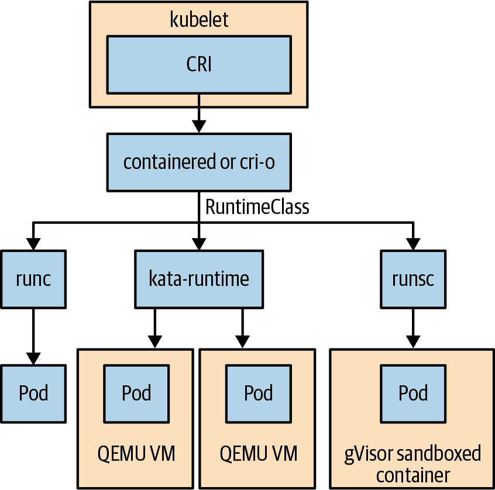

# 第十九章：安全保护 Kubernetes 应用程序

为你的工作负载提供一个安全平台对 Kubernetes 能够在生产环境中得到广泛应用至关重要。幸运的是，Kubernetes 集成了许多不同的安全焦点 API，可以帮助你构建一个安全的操作环境。挑战在于有许多不同的安全 API，并且你必须声明性地选择使用它们。使用这些安全焦点 API 可能会很麻烦和复杂，这使得难以达到你期望的安全目标。

在保护 Kubernetes 中的 Pod 时，理解以下两个概念非常重要：深度防御和最小权限原则。*深度防御* 是一个概念，它在包括 Kubernetes 在内的计算系统上使用多层安全控制。*最小权限原则* 意味着只允许你的工作负载访问操作所需的资源。这两个概念不是终点，而是不断应用于不断变化的计算系统环境中。

在本章中，我们将探讨能够逐步应用于帮助在 Pod 级别保护你的工作负载的安全焦点 Kubernetes API。

# 理解 SecurityContext

在保护 Pod 的核心是 SecurityContext，它是可能应用在 Pod 和容器规范级别的所有安全焦点字段的汇总。以下是由 SecurityContext 包含的一些示例安全控制：

+   用户权限和访问控制（例如，设置用户 ID 和组 ID）

+   只读根文件系统

+   允许特权升级

+   Seccomp、AppArmor 和 SELinux 的配置文件和标签分配

+   以特权或非特权方式运行

让我们看一个在 示例 19-1 中定义了 SecurityContext 的 Pod 示例。

##### 示例 19-1\. kuard-pod-securitycontext.yaml

```
apiVersion: v1
kind: Pod
metadata:
  name: kuard
spec:
  securityContext:
    runAsNonRoot: true
    runAsUser: 1000
    runAsGroup: 3000
    fsGroup: 2000
  containers:
    - image: gcr.io/kuar-demo/kuard-amd64:blue
      name: kuard
      securityContext:
          allowPrivilegeEscalation: false
          readOnlyRootFilesystem: true
          privileged: false
      ports:
        - containerPort: 8080
          name: http
          protocol: TCP
```

你可以在这个示例中看到，Pod 和容器级别都有一个 SecurityContext。许多安全控制可以同时应用在这两个级别。如果同时在这两个级别应用，容器级别的配置会优先生效。让我们看看在这个示例中我们在 Pod 规范中定义的字段以及它们对保护你的工作负载的影响：

`runAsNonRoot`

Pod 或容器必须作为非根用户运行。如果以根用户身份运行，容器将无法启动。作为非根用户运行被认为是最佳实践，因为许多错误配置和漏洞都是由于容器运行时将容器进程误认为与主机根用户相同而发生的。这可以在 PodSecurityContext 和 SecurityContext 中设置。kuard 容器镜像被配置为以 [Dockerfile](https://oreil.ly/4IZI7) 中定义的用户 "nobody" 运行。以非根用户身份运行您的容器始终是最佳实践；然而，如果您正在运行从其他来源下载的容器，而该容器未明确设置容器用户，则可能需要扩展原始 Dockerfile 来进行设置。这种方法并不总是有效，因为应用程序可能有其他需要考虑的要求。

`runAsUser/runAsGroup`

此设置将覆盖容器进程的用户和组。容器镜像可能已经在 Dockerfile 中配置了这一点。

`fsgroup`

配置 Kubernetes 在将卷挂载到 Pod 时更改所有文件的组。可以使用额外字段 `fsGroupChangePolicy` 来配置确切的行为。

`allowPrivilegeEscalation`

配置容器中的进程是否可以获得比其父进程更多的特权。这是一种常见的攻击向量，重要的是要显式地将其设置为 false。如果设置了 `privileged: true`，它将设置为 true 也很重要。

`privileged`

以特权方式运行容器，这将提升容器到与主机相同的权限。

`readOnlyRootFilesystem`

将容器根文件系统挂载为只读。这是一个常见的攻击向量，并且是一种最佳实践。工作负载需要写访问权限的任何数据或日志可以通过卷进行挂载。

这个示例中的字段并不是所有可用安全控制的完整列表；然而，在使用 SecurityContext 时，它们代表了一个很好的起点。我们将在本章后面的上下文中进一步介绍一些内容。

现在我们将通过将此示例保存到名为 *kuard-pod-securitycontext.yaml* 的文件中来创建 Pod。我们将演示如何将 SecurityContext 配置应用于正在运行的 Pod。使用以下命令创建 Pod：

```
$ kubectl create -f kuard-pod-securitycontext.yaml
pod/kuard created
```

现在我们将在 kuard 容器内启动一个 shell 并检查进程正在以哪个用户 ID 和组 ID 运行：

```
$ kubectl exec -it kuard -- ash
/ $ id
uid=1000 gid=3000 groups=2000
/ $ ps
PID   USER     TIME  COMMAND
    1 1000      0:00 /kuard
   30 1000      0:00 ash
   37 1000      0:00 ps
/ $ touch file
touch: file: Read-only file system
```

我们可以看到我们启动的 shell `ash` 正在以用户 ID（uid）1000、组 ID（gid）3000 运行，并且在组 2000 中。我们还可以看到 `kuard` 进程正如 Pod 规范中 SecurityContext 定义的那样以用户 1000 运行。我们还确认无法创建任何新文件，因为容器是只读的。如果您的工作负载仅应用以下更改，您已经迈出了良好的开端。

我们现在将介绍由 SecurityContext 覆盖的其他几个安全控件，这些控件可以更精细地控制您的工作负载的访问和特权。首先，我们将介绍操作系统级别的安全控制，然后介绍如何通过 SecurityContext 进行配置。需要注意的是，许多这些控件依赖于主机操作系统。这意味着它们可能仅适用于在 Linux 操作系统上运行的容器，而不适用于其他支持的 Kubernetes 操作系统，如 Windows。以下是由 SecurityContext 覆盖的核心操作系统控件列表：

Capabilities

允许添加或删除可能需要的特权组。例如，您的工作负载可能配置主机的网络配置。与其配置 Pod 以获取特权访问，即实际上是主机根访问权限，您可以添加特定的能力来配置主机的网络配置（NET_ADMIN 是特定的能力名称）。这遵循最小权限原则。

AppArmor

控制进程可以访问哪些文件。通过将`container.apparmor.security.beta.kubernetes.io/<container_name>: <profile_ref>`的注释添加到 Pod 规范中，可以将 AppArmor 配置文件应用于容器。`<profile_ref>`的可接受值包括`runtime/default`、`localhost/<path to profile>`和`unconfined`。默认值为`unconfined`，这明确设置了不应用任何配置文件。

Seccomp

Seccomp（安全计算）配置文件允许创建系统调用过滤器。这些过滤器允许允许或阻止特定的系统调用，从而限制在 Pod 中的进程向 Linux 内核暴露的表面积。

SELinux

定义文件和进程的访问控制。SELinux 运算符使用标签将其组合，以创建一个安全上下文（不要与 Kubernetes SecurityContext 混淆），用于限制对进程的访问。默认情况下，Kubernetes 为每个容器分配一个随机的 SELinux 上下文；但是，您可以选择通过 SecurityContext 设置一个上下文。

###### 注意

AppArmor 和 Seccomp 都可以设置用于运行时默认配置文件。每个容器运行时都附带了经过精心策划的默认 AppArmor 和 Seccomp 配置文件，以减少攻击面积，通过删除已知的系统调用和文件访问攻击向量或不常用于应用程序的方式。

要演示这些安全控制是如何应用于 Pod 的，我们将使用一个名为 [amicontained](https://oreil.ly/6ubkU)（“Am I contained”）的工具，由 Jess Frazelle 编写。将 Pod 的规范保存在 Example 19-2 中，保存为 *amicontained-pod.yaml* 文件。第一个 Pod 没有应用安全上下文，并将用于显示默认情况下对 Pod 应用的安全控制。请注意，由于不同的 Kubernetes 发行版和托管服务提供了不同的默认值，您的输出可能会有所不同。

##### Example 19-2\. amicontained-pod.yaml

```
apiVersion: v1
kind: Pod
metadata:
  name: amicontained
spec:
  containers:
    - image: r.j3ss.co/amicontained:v0.4.9
      name: amicontained
      command: [ "/bin/sh", "-c", "--" ]
      args: [ "amicontained" ]
```

创建 `amicontainer` Pod：

```
$ kubectl apply -f amicontained-pod.yaml
pod/amicontained created
```

让我们查看 Pod 日志，以检查 `amicontained` 工具的输出：

```
$ kubectl logs amicontained
Container Runtime: kube
Has Namespaces:
	pid: true
	user: false
AppArmor Profile: docker-default (enforce)
Capabilities:
	BOUNDING -> chown dac_override fowner fsetid kill setgid setuid
	setpcap net_bind_service net_raw sys_chroot mknod audit_write
	setfcap
Seccomp: disabled
Blocked Syscalls (21):
	SYSLOG SETPGID SETSID VHANGUP PIVOT_ROOT ACCT SETTIMEOFDAY UMOUNT2
	SWAPON SWAPOFF REBOOT SETHOSTNAME SETDOMAINNAME INIT_MODULE
	DELETE_MODULE LOOKUP_DCOOKIE KEXEC_LOAD FANOTIFY_INIT
	OPEN_BY_HANDLE_AT FINIT_MODULE KEXEC_FILE_LOAD
Looking for Docker.sock
```

从上面的输出中，我们看到正在应用 AppArmor 运行时默认配置。我们还可以看到默认情况下允许的功能以及禁用的 seccomp。最后，我们看到默认情况下阻止了 21 个系统调用。现在我们有了一个基准，让我们将 seccomp、AppArmor 和功能安全控制应用于 Pod 规范。创建一个名为 *amicontained-pod-securitycontext.yaml* 的文件，内容来自 Example 19-3。

##### Example 19-3\. amicontained-pod-securitycontext.yaml

```
apiVersion: v1
kind: Pod
metadata:
  name: amicontained
  annotations:
    container.apparmor.security.beta.kubernetes.io/amicontained: "runtime/default"
spec:
  securityContext:
    runAsNonRoot: true
    runAsUser: 1000
    runAsGroup: 3000
    fsGroup: 2000
    seccompProfile:
      type: RuntimeDefault
  containers:
    - image: r.j3ss.co/amicontained:v0.4.9
      name: amicontained
      command: [ "/bin/sh", "-c", "--" ]
      args: [ "amicontained" ]
      securityContext:
        capabilities:
            add: ["SYS_TIME"]
            drop: ["NET_BIND_SERVICE"]
        allowPrivilegeEscalation: false
        readOnlyRootFilesystem: true
        privileged: false
```

首先，我们需要删除现有的 `amicontained` Pod：

```
$ kubectl delete pod amicontained
pod "amicontained" deleted
```

现在我们可以创建一个新的 Pod，并应用安全上下文。我们明确声明要应用运行时默认的 AppArmor 和 seccomp 配置文件。此外，我们还添加和删除了一个功能：

```
$ kubectl apply -f amicontained-pod-securitycontext.yaml
pod/amicontained created
```

让我们再次查看 Pod 日志，以检查 `amicontained` 工具的输出：

```
$ kubectl logs amicontained
Container Runtime: kube
Has Namespaces:
	pid: true
	user: false
AppArmor Profile: docker-default (enforce)
Capabilities:
	BOUNDING -> chown dac_override fowner fsetid kill setgid setuid setpcap
	net_raw sys_chroot sys_time mknod audit_write setfcap
Seccomp: filtering
Blocked Syscalls (67):
	SYSLOG SETUID SETGID SETPGID SETSID SETREUID SETREGID SETGROUPS
	SETRESUID SETRESGID USELIB USTAT SYSFS VHANGUP PIVOT_ROOT_SYSCTL ACCT
	SETTIMEOFDAY MOUNT UMOUNT2 SWAPON SWAPOFF REBOOT SETHOSTNAME
	SETDOMAINNAME IOPL IOPERM CREATE_MODULE INIT_MODULE DELETE_MODULE
	GET_KERNEL_SYMS QUERY_MODULE QUOTACTL NFSSERVCTL GETPMSG PUTPMSG
	AFS_SYSCALL TUXCALL SECURITY LOOKUP_DCOOKIE VSERVER MBIND SET_MEMPOLICY
	GET_MEMPOLICY KEXEC_LOAD ADD_KEY REQUEST_KEY KEYCTL MIGRATE_PAGES
	FUTIMESAT UNSHARE MOVE_PAGES PERF_EVENT_OPEN FANOTIFY_INIT
	NAME_TO_HANDLE_AT OPEN_BY_HANDLE_AT SETNS PROCESS_VM_READV
	PROCESS_VM_WRITEV KCMP FINIT_MODULE KEXEC_FILE_LOAD BPF USERFAULTFD
	PKEY_MPROTECT PKEY_ALLOC PKEY_FREE
Looking for Docker.sock
```

## 安全上下文挑战

如您所见，要使用 SecurityContext，需要理解很多内容，并且直接配置每个 Pod 的所有字段来应用基线安全控制并不容易。创建和管理 AppArmor、seccomp 和 SELinux 配置和上下文并非易事，且容易出错。出错的代价是破坏应用程序执行功能的能力。有几种工具可以生成运行中 Pod 的 seccomp 配置文件，并使用 SecurityContext 应用。其中一个项目是 [Security Profiles Operator](https://oreil.ly/grPCN)，它可以轻松生成和管理 Seccomp 配置文件。现在让我们看看其他安全 API，这些 API 可以确保在整个集群中一致地应用 SecurityContext。

# Pod 安全

现在我们已经查看了 SecurityContext 作为管理应用于 Pod 和容器的安全控制的方法，接下来我们将介绍如何确保一组 SecurityContext 值在规模应用。Kubernetes 有一个现已弃用的 PodSecurityPolicy（PSP）API，它可以进行验证和变异。*验证*将不允许创建 Kubernetes 资源，除非它们具有特定的 SecurityContext。另一方面，*变异*将改变 Kubernetes 资源，并根据通过 PSP 应用的标准应用特定的 SecurityContext。鉴于 PSP 已弃用，并将在 Kubernetes v1.25 中删除，我们不会深入讨论它，而是会介绍其继任者 Pod Security。Pod Security 与其前身的主要区别之一是，Pod Security 仅执行验证而不执行变异。如果您想了解更多关于变异的信息，我们鼓励您查看第二十章。

## 什么是 Pod 安全？

Pod Security 允许您为 Pod 声明不同的安全配置文件。这些安全配置文件称为 Pod 安全标准，并应用于命名空间级别。Pod 安全标准是 Pod 规范中一组安全敏感字段（包括但不限于 SecurityContext）及其关联值的集合。有三种不同的标准，从受限到宽松不等。其理念是您可以将一般的安全姿态应用于给定命名空间中的所有 Pod。三种 Pod 安全标准如下：

基线

最常见的权限升级，同时支持更简易的入门。

受限

高度限制，涵盖安全最佳实践。可能导致工作负载中断。

特权

开放和无限制。

###### 警告

截至 Kubernetes v1.23，Pod Security 目前是一个测试功能，可能会有所更改。

每个 Pod 安全标准定义了 Pod 规范中一组字段及其允许的值。以下是这些标准涵盖的一些字段：

+   `spec.securityContext`

+   `spec.containers[*].securityContext`

+   `spec.containers[*].ports`

+   `spec.volumes[*].hostPath`

您可以在[官方文档](https://oreil.ly/xPK2p)中查看每个 Pod 安全标准涵盖的完整字段列表。

每个标准都适用于命名空间，采用给定的模式。策略可以适用于三种模式。它们如下所示：

执行

任何违反策略的 Pod 将被拒绝。

警告

任何违反策略的 Pod 将被允许，并向用户显示警告消息。

审核

任何违反策略的 Pod 将在审计日志中生成审计消息。

## 应用 Pod 安全标准

通过标签将 Pod 安全标准应用于命名空间：

+   必需：`pod-security.kubernetes.io/<MODE>: <LEVEL>`

+   可选：`pod-security.kubernetes.io/<MODE>-version: <VERSION>`（默认为最新）

在 示例 19-4 中的命名空间说明了如何同时使用多种模式来强制执行一个标准（例如本示例中的基线）并在另一个标准（受限）上进行审计和警告。使用多种模式可以让您以较低的安全姿态部署策略，并审计哪些工作负载违反了更严格的策略。然后，您可以在强制执行更严格的标准之前纠正策略违规。您还可以将模式固定到特定版本，例如 v1.22\. 这允许策略标准随每个 Kubernetes 版本的发布而变化，并允许您固定到特定版本。在 示例 19-4 中，我们正在强制执行基线标准，并同时警告和审计受限标准。所有模式都固定到标准的 v1.22 版本。

##### 示例 19-4\. baseline-ns.yaml

```
apiVersion: v1
kind: Namespace
metadata:
  name: baseline-ns
  labels:
    pod-security.kubernetes.io/enforce: baseline
    pod-security.kubernetes.io/enforce-version: v1.22
    pod-security.kubernetes.io/audit: restricted
    pod-security.kubernetes.io/audit-version: v1.22
    pod-security.kubernetes.io/warn: restricted
    pod-security.kubernetes.io/warn-version: v1.22
```

首次部署策略可能是一项令人生畏的任务。幸运的是，Pod 安全性通过单个 dry-run 命令使得查看现有工作负载是否违反 Pod 安全标准变得简单：

```
$ kubectl label --dry-run=server --overwrite ns \
  --all pod-security.kubernetes.io/enforce=baseline
Warning: kuard: privileged
namespace/default labeled
namespace/kube-node-lease labeled
namespace/kube-public labeled
Warning: kube-proxy-vxjwb: host namespaces, hostPath volumes, privileged
Warning: kube-proxy-zxqzz: host namespaces, hostPath volumes, privileged
Warning: kube-apiserver-kind-control-plane: host namespaces, hostPath volumes
Warning: etcd-kind-control-plane: host namespaces, hostPath volumes
Warning: kube-controller-manager-kind-control-plane: host namespaces, ...
Warning: kube-scheduler-kind-control-plane: host namespaces, hostPath volumes
namespace/kube-system labeled
namespace/local-path-storage labeled
```

此命令评估 Kubernetes 集群中所有 Pod 是否符合基线 Pod 安全标准，并将违规项作为警告消息输出。

让我们看看 Pod 安全性的实际操作。创建一个名为 *baseline-ns.yaml* 的文件，并使用 示例 19-5 中的内容。

##### 示例 19-5\. baseline-ns.yaml

```
apiVersion: v1
kind: Namespace
metadata:
  name: baseline-ns
  labels:
    pod-security.kubernetes.io/enforce: baseline
    pod-security.kubernetes.io/enforce-version: v1.22
    pod-security.kubernetes.io/audit: restricted
    pod-security.kubernetes.io/audit-version: v1.22
    pod-security.kubernetes.io/warn: restricted
    pod-security.kubernetes.io/warn-version: v1.22
```

```
$ kubectl apply -f baseline-ns.yaml
namespace/baseline-ns created
```

创建一个名为 *kuard-pod.yaml* 的文件，并使用 示例 19-6 中的内容。

##### 示例 19-6\. kuard-pod.yaml

```
apiVersion: v1
kind: Pod
metadata:
  name: kuard
  labels:
    app: kuard
spec:
  containers:
    - image: gcr.io/kuar-demo/kuard-amd64:blue
      name: kuard
      ports:
        - containerPort: 8080
          name: http
          protocol: TCP
```

使用以下命令创建 Pod 并查看输出：

```
$ kubectl apply -f kuard-pod.yaml --namespace baseline-ns
Warning: would violate "v1.22" version of "restricted" PodSecurity profile:
allowPrivilegeEscalation != false (container "kuard" must set
securityContext.allowPrivilegeEscalation=false), unrestricted capabilities
(container "kuard" must set securityContext.capabilities.drop=["ALL"]),
runAsNonRoot != true (pod or container "kuard" must set securityContext.
runAsNonRoot=true), seccompProfile (pod or container "kuard" must set
securityContext.seccompProfile.type to "RuntimeDefault" or "Localhost")
pod/kuard created
```

在此输出中，您可以看到 Pod 已成功创建；然而，它违反了受限的 Pod 安全标准，并且输出中提供了违规的详细信息，以便您进行纠正。我们还可以看到 API 服务器审计日志中的消息，因为我们配置了审计模式：

```
{"kind":"Event","apiVersion":"audit.k8s.io/v1","level":"Metadata","auditID":"...
```

Pod 安全性是通过在命名空间级别应用策略来管理工作负载的安全姿态的一种绝佳方式，并且只有在不违反策略的情况下才允许创建 Pod。它灵活且提供不同的预构建策略，从宽松到受限，以及工具支持，可以轻松地推出策略更改，而无需担心破坏工作负载的风险。

# 服务账户管理

Service accounts 是 Kubernetes 资源，为运行在 Pod 内部的工作负载提供身份。RBAC 可以应用于 service accounts，以控制通过 Kubernetes API 身份可以访问的资源。请参阅 第十四章 了解更多信息。如果您的应用程序不需要访问 Kubernetes API，则应按最小权限原则禁用访问。默认情况下，Kubernetes 在每个命名空间中创建一个默认的 service account，并自动将其设置为所有 Pods 的 service account。该 service account 包含一个在每个 Pod 中自动挂载的令牌，用于访问 Kubernetes API。要禁用此行为，必须将 `automountServiceAccountToken: false` 添加到 service account 配置中。示例 19-7 演示了如何为默认 service account 进行此操作。这必须在每个命名空间中完成。

##### 示例 19-7\. service-account.yaml

```
apiVersion: v1
kind: ServiceAccount
metadata:
  name: default
automountServiceAccountToken: false
```

在考虑 Pod 安全性时，人们经常忽略 service accounts；然而，它们允许直接访问 Kubernetes API，并且在没有足够的 RBAC 的情况下，可能允许攻击者访问 Kubernetes。重要的是要了解如何通过简单地更改 service account 令牌处理方式来限制访问。

# 基于角色的访问控制

在讨论保护 Pods 的章节中，我们不得不提到 Kubernetes 基于角色的访问控制（RBAC）。您可以在 第十四章 找到有关 RBAC 的所有信息，并可以应用于补充工作负载的安全策略。

# RuntimeClass

Kubernetes 通过容器运行时接口（CRI）与节点操作系统上的容器运行时进行交互。该接口的创建和标准化使得容器运行时生态系统得以存在。这些容器运行时可能提供不同级别的隔离，包括基于实现方式的更强安全性保证。像 Kata Containers、Firecracker 和 gVisor 这样的项目基于不同的隔离机制，从嵌套虚拟化到更复杂的系统调用过滤。这些安全和隔离保证为 Kubernetes 管理员提供了灵活性，使用户可以根据其工作负载类型选择容器运行时。例如，如果您的工作负载需要更强的安全保证，则可以选择在使用不同容器运行时的 Pod 中运行。

RuntimeClass API 被引入以允许选择容器运行时。它允许用户从集群中支持的容器运行时列表中选择一个。图 19-1 展示了 RuntimeClass 的功能。

###### 注意

不同的 RuntimeClasses 必须由集群管理员配置，并且可能需要在您的工作负载上配置特定的 `nodeSelectors` 或 `tolerations` 才能被调度到正确的节点。



###### 图 19-1\. `RuntimeClass` 流程图

您可以通过在 Pod 规范中指定`runtimeClassName`来使用 RuntimeClass。示例 19-8 是一个指定 RuntimeClass 的示例 Pod。

##### Example 19-8\. kuard-pod-runtimeclass.yaml

```
apiVersion: v1
kind: Pod
metadata:
  name: kuard
  labels:
    app: kuard
spec:
  runtimeClassName: firecracker
  containers:
    - image: gcr.io/kuar-demo/kuard-amd64:blue
      name: kuard
      ports:
        - containerPort: 8080
          name: http
          protocol: TCP
```

RuntimeClass 允许用户选择不同的容器运行时，这些运行时可能具有不同的安全隔离。使用 RuntimeClass 可以帮助补充工作负载的整体安全性，特别是当工作负载处理敏感信息或运行不受信任的代码时。

# Network Policy

Kubernetes 也有一个 Network Policy API，允许您为工作负载创建入口和出口网络策略。网络策略使用标签进行配置，这些标签允许您选择特定的 Pod，并定义它们如何与其他 Pod 和端点通信。例如，Ingress 这样的 Network Policy 实际上没有与之关联的 Kubernetes 控制器。这意味着您可以创建 Network Policy 资源，但如果您没有安装一个响应 Network Policy 资源创建的控制器，那么它们将不会被执行。Network Policy 资源由网络插件（如 Calico、Cilium 和 Weave Net）实现。

Network Policy 资源是有命名空间的，并且由`podSelector`、`policyTypes`、`ingress`和`egress`部分组成，其中唯一需要的字段是`podSelector`。如果`podSelector`字段为空，则该策略匹配命名空间中的所有 Pod。此字段还可以包含一个`matchLabels`部分，其功能与 Service 资源相同，允许您添加一组标签以匹配特定的一组 Pod。

使用 Network Policy 时有几个需要注意的特殊情况。如果一个 Pod 匹配任何 Network Policy 资源，则必须显式定义任何入口或出口通信，否则将被阻止。如果一个 Pod 匹配多个 Network Policy 资源，则策略是叠加的。如果一个 Pod 没有匹配任何 Network Policy，则允许流量。这个决定是有意为之，以便简化新工作负载的接入。然而，如果您确实希望默认情况下阻止所有流量，您可以为每个命名空间创建一个默认拒绝规则。示例 19-9 展示了一个可以应用于每个命名空间的默认拒绝规则。

##### Example 19-9\. networkpolicy-default-deny.yaml

```
apiVersion: networking.k8s.io/v1
kind: NetworkPolicy
metadata:
  name: default-deny-ingress
spec:
  podSelector: {}
  policyTypes:
  - Ingress
```

让我们通过一组网络策略示例来演示如何使用它们来保护您的工作负载。首先，使用以下命令创建一个测试命名空间：

```
$ kubectl create ns kuard-networkpolicy
namespace/kuard-networkpolicy created
```

创建名为*kuard-pod.yaml*的文件，其中包含示例 19-10 的内容。

##### Example 19-10\. kuard-pod.yaml

```
apiVersion: v1
kind: Pod
metadata:
  name: kuard
  labels:
    app: kuard
spec:
  containers:
    - image: gcr.io/kuar-demo/kuard-amd64:blue
      name: kuard
      ports:
        - containerPort: 8080
          name: http
          protocol: TCP
```

在`kuard-networkpolicy`命名空间中创建`kuard` Pod：

```
$ kubectl apply -f kuard-pod.yaml \
  --namespace kuard-networkpolicy
pod/kuard created
```

将`kuard` Pod 公开为服务：

```
$ kubectl expose pod kuard --port=80 --target-port=8080 \
  --namespace kuard-networkpolicy
pod/kuard created
```

现在我们可以使用`kubectl run`来启动一个 Pod 作为我们的源，并测试访问`kuard` Pod，而不应用任何 Network Policy：

```
$ kubectl run test-source --rm -ti --image busybox /bin/sh \
  --namespace kuard-networkpolicy
If you don't see a command prompt, try pressing enter.
/ # wget -q kuard -O -
<!doctype html>

<html lang="en">
<head>
  <meta charset="utf-8">

  <title><KUAR Demo></title>
...

```

我们可以成功从我们的测试源 Pod 连接到 `kuard` Pod。现在让我们应用默认拒绝策略并再次测试。创建一个名为 *networkpolicy-default-deny.yaml* 的文件，并包含 示例 19-11 的内容。

##### 示例 19-11\. networkpolicy-default-deny.yaml

```
apiVersion: networking.k8s.io/v1
kind: NetworkPolicy
metadata:
  name: default-deny-ingress
spec:
  podSelector: {}
  policyTypes:
  - Ingress
```

现在应用默认拒绝网络策略：

```
$ kubectl apply -f networkpolicy-default-deny.yaml \
  --namespace kuard-networkpolicy
networkpolicy.networking.k8s.io/default-deny-ingress created
```

现在让我们测试从测试源 Pod 访问 `kuard` Pod：

```
$ kubectl run test-source --rm -ti --image busybox /bin/sh \
  --namespace kuard-networkpolicy
If you don't see a command prompt, try pressing enter.
/ # wget -q --timeout=5 kuard -O -
wget: download timed out

```

由于默认拒绝的网络策略，我们无法再从测试源 Pod 访问 `kuard` Pod。创建一个允许测试源访问 `kuard` Pod 的网络策略。创建一个名为 *networkpolicy-kuard-allow-test-source.yaml* 的文件，并包含 示例 19-12 的内容。

##### 示例 19-12\. networkpolicy-kuard-allow-test-source.yaml

```
kind: NetworkPolicy
apiVersion: networking.k8s.io/v1
metadata:
  name: access-kuard
spec:
  podSelector:
    matchLabels:
      app: kuard
  ingress:
    - from:
      - podSelector:
          matchLabels:
            run: test-source
```

应用网络策略：

```
$ kubectl apply \
  -f code/chapter-security/networkpolicy-kuard-allow-test-source.yaml \
  --namespace kuard-networkpolicy
networkpolicy.networking.k8s.io/access-kuard created
```

再次验证测试源 Pod 确实可以访问 `kuard` Pod：

```
$ kubectl run test-source --rm -ti --image busybox /bin/sh \
  --namespace kuard-networkpolicy
If you don't see a command prompt, try pressing enter.
/ # wget -q kuard -O -
<!doctype html>

<html lang="en">
<head>
  <meta charset="utf-8">

  <title><KUAR Demo></title>
...

```

通过运行以下命令清理命名空间：

```
$ kubectl delete namespace kuard-networkpolicy
namespace "kuard-networkpolicy" deleted
```

应用网络策略为您的工作负载提供额外的安全层，并继续构建深度防御和最小特权原则的概念。

# 服务网格

服务网格还可以用于增强工作负载的安全性姿态。服务网格提供访问策略，允许基于服务配置协议感知策略。例如，您的访问策略可能声明 ServiceA 通过 HTTPS 在 443 端口连接到 ServiceB。此外，服务网格通常在所有服务间通信上实施双向 TLS，这意味着通信不仅加密，而且还验证了服务身份。如果您想了解更多关于服务网格如何用于保护工作负载的信息，请查看 第十五章。

# 安全基准工具

有几个开源工具允许您针对 Kubernetes 集群运行一系列安全基准测试，以确定您的配置是否符合预定义的安全基线。其中一种工具称为 [`kube-bench`](https://oreil.ly/TnUlm)。`kube-bench` 可用于运行 [CIS 基准](https://oreil.ly/VvUe5)。像 `kube-bench` 运行 CIS 基准并不专门关注 Pod 安全性；然而，它确实可以暴露任何集群配置错误并帮助确定修复措施。您可以使用以下命令运行 `kube-bench`：

```
$ kubectl apply -f https://raw.githubusercontent.com/aquasecurity/kube-bench...
job.batch/kube-bench created
```

然后，您可以通过 Pod 日志查看基准输出和修复措施：

```
$ kubectl logs job/kube-bench
[INFO] 4 Worker Node Security Configuration
[INFO] 4.1 Worker Node Configuration Files
[PASS] 4.1.1 Ensure that the kubelet service file permissions are set to 644...
[PASS] 4.1.2 Ensure that the kubelet service file ownership is set to root  ...
[PASS] 4.1.3 If proxy kubeconfig file exists ensure permissions are set to  ...
[PASS] 4.1.4 Ensure that the proxy kubeconfig file ownership is set to root ...
[PASS] 4.1.5 Ensure that the --kubeconfig kubelet.conf file permissions are ...
[PASS] 4.1.6 Ensure that the --kubeconfig kubelet.conf file ownership is set...
[PASS] 4.1.7 Ensure that the certificate authorities file permissions are   ...
[PASS] 4.1.8 Ensure that the client certificate authorities file ownership  ...
[PASS] 4.1.9 Ensure that the kubelet --config configuration file has permiss...
[PASS] 4.1.10 Ensure that the kubelet --config configuration file ownership ...
[INFO] 4.2 Kubelet
[PASS] 4.2.1 Ensure that the anonymous-auth argument is set to false (Automated)
[PASS] 4.2.2 Ensure that the --authorization-mode argument is not set to    ...
[PASS] 4.2.3 Ensure that the --client-ca-file argument is set as appropriate...
[PASS] 4.2.4 Ensure that the --read-only-port argument is set to 0 (Manual)
[PASS] 4.2.5 Ensure that the --streaming-connection-idle-timeout argument is...
[FAIL] 4.2.6 Ensure that the --protect-kernel-defaults argument is set to   ...
[PASS] 4.2.7 Ensure that the --make-iptables-util-chains argument is set to ...
[PASS] 4.2.8 Ensure that the --hostname-override argument is not set (Manual)
[WARN] 4.2.9 Ensure that the --event-qps argument is set to 0 or a level    ...
[WARN] 4.2.10 Ensure that the --tls-cert-file and --tls-private-key-file arg...
[PASS] 4.2.11 Ensure that the --rotate-certificates argument is not set to  ...
[PASS] 4.2.12 Verify that the RotateKubeletServerCertificate argument is set...
[WARN] 4.2.13 Ensure that the Kubelet only makes use of Strong Cryptographic...

== Remediations node ==
4.2.6 If using a Kubelet config file, edit the file to set protectKernel...
If using command line arguments, edit the kubelet service file
/etc/systemd/system/kubelet.service.d/10-kubeadm.conf on each worker node and
set the below parameter in KUBELET_SYSTEM_PODS_ARGS variable.
--protect-kernel-defaults=true
Based on your system, restart the kubelet service. For example:
systemctl daemon-reload
systemctl restart kubelet.service

4.2.9 If using a Kubelet config file, edit the file to set eventRecordQPS...
If using command line arguments, edit the kubelet service file
/etc/systemd/system/kubelet.service.d/10-kubeadm.conf on each worker node and
set the below parameter in KUBELET_SYSTEM_PODS_ARGS variable.
Based on your system, restart the kubelet service. For example:
systemctl daemon-reload
systemctl restart kubelet.service
...

```

使用像 `kube-bench` 这样的工具与 CIS 基准可以帮助确定您的 Kubernetes 集群是否符合安全基线，并在需要时提供修复措施。

# 镜像安全性

另一个 Pod 安全的重要部分是保证 Pod 中的代码和应用程序安全。确保应用程序代码的安全是一个复杂的主题，超出了本章的范围；然而，容器镜像安全的基础包括确保你的容器镜像仓库对已知的代码漏洞进行*静态扫描*。此外，你应该有一个工具进行*运行时扫描*，以识别镜像启动后发现的漏洞，并查找潜在的恶意活动，如入侵。开源和专有公司提供了许多扫描工具。除了安全扫描外，专注于最小化容器镜像的内容，以删除不必要的依赖，可以减少扫描时的干扰。最后，镜像安全是投资于持续交付的另一个重要理由，这样当发现漏洞时，可以快速打补丁并重新部署镜像。

# 总结

在本章中，我们涵盖了许多不同的面向安全的 API 和资源，可以用来提高你的工作负载的安全性姿态。通过实践深度防御和最小权限原则，你可以逐步提高 Kubernetes 集群的基线安全性。开始实践更好的安全措施永远不会太晚，本章提供了你需要的一切，以确保你对 Kubernetes 提供的安全控制有所了解。
