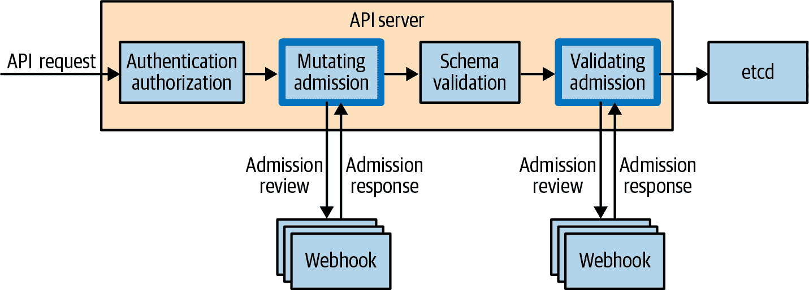

# 第二十章：Kubernetes 集群的政策和治理

本书中，我们介绍了许多不同的 Kubernetes 资源类型，每种都有特定的用途。在 Kubernetes 集群中的资源数量从单一微服务应用的几个，迅速增加到完整分布式应用的几百甚至几千个，所需管理的资源数目也随之增加。在生产集群的上下文中，管理成千上万的资源所面临的挑战是显而易见的。

在本章中，我们介绍了政策和治理的概念。*政策* 是一组约束和条件，规定 Kubernetes 资源的配置方式。*治理* 提供了验证和执行所有部署到 Kubernetes 集群的资源的组织政策的能力，例如确保所有资源使用当前最佳实践，符合安全政策，或遵守公司惯例。无论你的情况如何，你的工具都需要灵活和可扩展，以便集群上定义的所有资源都符合你组织定义的政策。

# 为什么政策和治理很重要

Kubernetes 中有许多不同类型的政策。例如，NetworkPolicy 允许你指定一个 Pod 可以连接到的网络服务和端点。PodSecurityPolicy 使你能够对 Pod 的安全元素进行细粒度控制。两者都可以用于配置网络或容器运行时。

然而，你可能希望在 Kubernetes 资源甚至被创建之前就强制执行一个政策。这就是政策和治理解决的问题。此时，你可能会想到，“这不是基于角色的访问控制（RBAC）所做的事情吗？”然而，正如你将在本章中看到的，RBAC 的粒度不足以限制资源中特定字段的设置。

这里是一些集群管理员常常配置的政策的常见例子：

+   所有容器 *必须* 只来自特定的容器注册表。

+   所有 Pod *必须* 带有部门名称和联系信息的标签。

+   所有 Pod *必须* 设置 CPU 和内存资源限制。

+   所有 Ingress 主机名 *必须* 在集群中唯一。

+   某个服务 *不得* 对外开放。

+   容器 *不得* 监听特权端口。

群集   集群管理员也可能想要审计集群上的现有资源，进行干运行政策评估，或基于一组条件修改资源——例如，如果不存在的话，对一个 Pod 应用标签。

集群管理员能够定义政策并进行合规性审计，而不干扰开发人员将应用部署到 Kubernetes 的能力，这一点非常重要。如果开发人员创建了不合规的资源，你需要一个系统，确保他们得到反馈和修正，以使他们的工作符合规定。

让我们看看如何利用 Kubernetes 核心的扩展组件实现政策和治理。

# 入驻流程

要理解策略和治理如何确保资源在创建前符合规范，必须首先了解请求通过 Kubernetes API 服务器的流程。图 20-1 描绘了 API 请求通过 API 服务器的流程。在这里，我们将重点介绍变异准入、验证准入和 Webhook。



###### 图 20-1\. API 请求通过 Kubernetes API 服务器的流程

准入控制器在 API 请求通过 Kubernetes API 服务器时内联操作，并用于在资源保存到存储之前对 API 请求资源进行修改或验证。变异准入控制器允许修改资源；验证准入控制器则不允许。有许多不同类型的准入控制器；本章重点介绍准入 Webhook，这些 Webhook 是动态配置的。它们允许集群管理员配置一个端点，API 服务器可以向其发送请求进行评估，通过创建 MutatingWebhookConfiguration 或 ValidatingWebhookConfiguration 资源。准入 Webhook 将以“admit”或“deny”的指令响应，告知 API 服务器是否将资源保存到存储。

# 策略与治理使用 Gatekeeper

让我们深入了解如何配置策略并确保 Kubernetes 资源符合规范。Kubernetes 项目未提供任何启用策略和治理的控制器，但有开源解决方案。在这里，我们将关注一个名为[Gatekeeper](https://oreil.ly/u0deR)的开源生态系统项目。

Gatekeeper 是一个 Kubernetes 本地策略控制器，根据定义的策略评估资源，并决定是否允许创建或修改 Kubernetes 资源。这些评估在 API 请求通过 Kubernetes API 服务器时在服务器端进行，这意味着每个集群具有单一的处理点。在服务器端处理策略评估意味着您可以在现有的 Kubernetes 集群上安装 Gatekeeper，而无需更改开发人员的工具、工作流程或持续交付流水线。

Gatekeeper 使用*自定义资源定义*（CRDs）定义了一组新的专门用于配置它的 Kubernetes 资源，这使得集群管理员可以使用熟悉的工具如`kubectl`来操作 Gatekeeper。此外，它为用户提供实时、有意义的反馈，说明为何资源被拒绝以及如何修复问题。这些 Gatekeeper 特定的自定义资源可以存储在源控制中，并使用 GitOps 工作流进行管理。

Gatekeeper 还执行*资源变异*（根据定义的条件修改资源）和审计。它高度可配置，并提供对要评估的资源及其命名空间的精细控制。

## 什么是开放策略代理（Open Policy Agent）？

Gatekeeper 的核心是 [Open Policy Agent](https://oreil.ly/nbR5d)，一个可扩展的云原生开源策略引擎，允许策略在不同应用程序之间可移植。Open Policy Agent (OPA) 负责执行所有策略评估并返回允许或拒绝结果。这使得 Gatekeeper 能够访问一系列策略工具，例如 [Conftest](https://oreil.ly/ElWYE)，它允许您编写策略测试并在部署之前在持续集成流水线中实施它们。

Open Policy Agent 专门使用名为 [Rego](https://oreil.ly/Ar55f) 的本机查询语言来管理所有策略。Gatekeeper 的核心原则之一是将 Rego 的内部工作与集群管理员抽象化，并通过 Kubernetes CRD 提供结构化 API，以创建和应用策略。这使您能够在组织和社区之间共享参数化的策略。Gatekeeper 项目专门为此目的维护一个策略库（本章后续讨论）。

## 安装 Gatekeeper

在开始配置策略之前，您需要安装 Gatekeeper。Gatekeeper 组件作为 Pod 运行在 `gatekeeper-system` 命名空间中，并配置 webhook 入场控制器。

###### 警告

在不理解如何安全创建和禁用策略之前，请不要在 Kubernetes 集群上安装 Gatekeeper。在安装 Gatekeeper 之前，请查看安装 YAML 文件，以确保您对其创建的资源感到满意。

您可以使用 Helm 软件包管理器安装 Gatekeeper：

```
$ helm repo add gatekeeper https://open-policy-agent.github.io/gatekeeper/charts
$ helm install gatekeeper/gatekeeper --name-template=gatekeeper \
  --namespace gatekeeper-system --create-

```

###### 注意

Gatekeeper 的安装需要 cluster-admin 权限，并且具体版本。请参阅 [Gatekeeper](https://oreil.ly/GvLHc) 的官方文档获取最新发布信息。

安装完成后，请确认 Gatekeeper 是否已启动：

```
$ kubectl get pods -n gatekeeper-system
NAME                                             READY   STATUS    RESTARTS  AGE
gatekeeper-audit-54c9759898-ljwp8                1/1     Running   0         1m
gatekeeper-controller-manager-6bcc7f8fb5-4nbkt   1/1     Running   0         1m
gatekeeper-controller-manager-6bcc7f8fb5-d85rn   1/1     Running   0         1m
gatekeeper-controller-manager-6bcc7f8fb5-f8m8j   1/1     Running   0         1m

```

您还可以使用此命令查看 webhook 的配置方式：

```
$ kubectl get validatingwebhookconfiguration -o yaml
apiVersion: admissionregistration.k8s.io/v1
kind: ValidatingWebhookConfiguration
metadata:
  labels:
    gatekeeper.sh/system: "yes"
  name: gatekeeper-validating-webhook-configuration
webhooks:
- admissionReviewVersions:
  - v1
  - v1beta1
  clientConfig:
    service:
      name: gatekeeper-webhook-service
      namespace: gatekeeper-system
      path: /v1/admit
  failurePolicy: Ignore
  matchPolicy: Exact
  name: validation.gatekeeper.sh
  namespaceSelector:
    matchExpressions:
    - key: admission.gatekeeper.sh/ignore
      operator: DoesNotExist
  rules:
  - apiGroups:
    - '*'
    apiVersions:
    - '*'
    operations:
    - CREATE
    - UPDATE
    resources:
    - '*'
  sideEffects: None
  timeoutSeconds: 3
	...
```

在上述输出的 `rules` 部分下，我们看到所有资源都将发送到名为 `gatekeeper-webhook-service` 的服务，该服务作为 `gatekeeper-system` 命名空间中的服务运行。仅有标签不是 `admission.gatekeeper.sh/ignore` 的命名空间中的资源将被用于策略评估。最后，`failurePolicy` 设置为 `Ignore`，这意味着这是一个 *失败开放配置*：如果 Gatekeeper 服务在配置的三秒超时内未响应，则请求将被允许通过。

## 配置策略

现在 Gatekeeper 已安装，您可以开始配置策略。我们将首先介绍一个典型的示例，并演示集群管理员创建策略的过程。然后我们将查看开发人员在创建符合和不符合规范的资源时的体验。然后我们将进一步扩展每个步骤以获得更深入的理解，并指导您完成创建样例策略的过程，声明容器镜像只能来自一个特定的注册表。此示例基于[Gatekeeper 策略库](https://oreil.ly/ikfZk)。

首先，您需要配置我们需要创建自定义资源的策略，称为*约束模板*。这通常由集群管理员完成。在示例 20-1 中的约束模板需要您提供容器库列表作为参数，允许 Kubernetes 资源使用。

##### 示例 20-1\. allowedrepos-constraint-template.yaml

```
apiVersion: templates.gatekeeper.sh/v1beta1
kind: ConstraintTemplate
metadata:
  name: k8sallowedrepos
  annotations:
    description: Requires container images to begin with a repo string from a
      specified list.
spec:
  crd:
    spec:
      names:
        kind: K8sAllowedRepos
      validation:
        # Schema for the `parameters` field
        openAPIV3Schema:
          properties:
            repos:
              type: array
              items:
                type: string
  targets:
    - target: admission.k8s.gatekeeper.sh
      rego: |
        package k8sallowedrepos

        violation[{"msg": msg}] {
          container := input.review.object.spec.containers[_]
          satisfied := [good | repo = input.parameters.repos[_] ; good = starts...
          not any(satisfied)
          msg := sprintf("container <%v> has an invalid image repo <%v>, allowed...
        }

        violation[{"msg": msg}] {
          container := input.review.object.spec.initContainers[_]
          satisfied := [good | repo = input.parameters.repos[_] ; good = starts...
          not any(satisfied)
          msg := sprintf("container <%v> has an invalid image repo <%v>, allowed...)
        }
```

使用以下命令创建约束模板：

```
$ kubectl apply -f allowedrepos-constraint-template.yaml
constrainttemplate.templates.gatekeeper.sh/k8sallowedrepos created
```

现在，您可以创建一个约束资源来实施策略（再次扮演集群管理员的角色）。示例 20-2 中的约束允许在`default`命名空间中具有`gcr.io/kuar-demo/`前缀的所有容器。`enforcementAction`设置为“deny”：任何不符合规范的资源都将被拒绝。

##### 示例 20-2\. allowedrepos-constraint.yaml

```
apiVersion: constraints.gatekeeper.sh/v1beta1
kind: K8sAllowedRepos
metadata:
  name: repo-is-kuar-demo
spec:
  enforcementAction: deny
  match:
    kinds:
      - apiGroups: [""]
        kinds: ["Pod"]
    namespaces:
      - "default"
  parameters:
    repos:
      - "gcr.io/kuar-demo/"
```

```
$ kubectl create -f allowedrepos-constraint.yaml
k8sallowedrepos.constraints.gatekeeper.sh/repo-is-kuar-demo created
```

下一步是创建一些 Pod 来测试策略是否有效。示例 20-3 创建一个 Pod，使用一个符合我们在上一步定义的约束的容器镜像，`gcr.io/kuar-demo/kuard-amd64:blue`。工作负载资源的创建通常由负责操作服务的开发人员或持续交付流水线执行。

##### 示例 20-3\. compliant-pod.yaml

```
apiVersion: v1
kind: Pod
metadata:
  name: kuard
spec:
  containers:
    - image: gcr.io/kuar-demo/kuard-amd64:blue
      name: kuard
      ports:
        - containerPort: 8080
          name: http
          protocol: TCP
```

```
$ kubectl apply -f compliant-pod.yaml
pod/kuard created
```

如果我们创建一个不符合规范的 Pod 会发生什么？示例 20-4 创建一个 Pod，使用一个不符合我们在上一步定义的约束的容器镜像，`nginx`。工作负载资源的创建通常由开发人员或负责操作服务的持续交付流水线执行。请注意示例 20-4 中的输出。

##### 示例 20-4\. noncompliant-pod.yaml

```
apiVersion: v1
kind: Pod
metadata:
  name: nginx-noncompliant
spec:
  containers:
    - name: nginx
      image: nginx
```

```
$ kubectl apply -f noncompliant-pod.yaml
Error from server ([repo-is-kuar-demo] container <nginx> has an invalid image
repo <nginx>, allowed repos are ["gcr.io/kuar-demo/"]): error when creating
"noncompliant-pod.yaml": admission webhook "validation.gatekeeper.sh" denied
the request: [repo-is-kuar-demo] container <nginx> has an invalid image
repo <nginx>, allowed repos are ["gcr.io/kuar-demo/"]
```

示例 20-4 显示向用户返回错误，并详细说明为什么未创建资源以及如何解决问题。集群管理员可以在约束模板中配置错误消息。

###### 注意

如果您的约束范围是 Pod，并且您创建生成 Pod 的资源（例如 ReplicaSets），Gatekeeper 将返回一个错误。然而，它不会返回给您，而是返回给尝试创建 Pod 的控制器。要查看这些错误消息，请查看相关资源的事件日志。

## 理解约束模板

现在我们已经演示了一个经典示例，请仔细查看示例 20-1 中的约束模板，该模板列出了允许在 Kubernetes 资源中使用的容器存储库列表。

此约束模板具有作为 Gatekeeper 专用自定义资源一部分的`apiVersion`和`kind`。在`spec`部分下，您将看到名称`K8sAllowedRepos`：请记住此名称，因为在创建约束时，您将使用它作为约束类型。您还将看到一个模式，该模式定义了供集群管理员配置的字符串数组。这通过提供允许的容器注册表列表来完成。它还包含原始的 Rego 策略定义（在`target`部分下）。此策略评估容器和 initContainers，以确保容器存储库名称以约束提供的值开头。如果违反策略，则在`msg`部分定义的消息将发送回用户。

## 创建约束

要实例化策略，您必须创建一个约束，提供模板所需的参数。可能会有许多与特定约束模板种类匹配的约束。让我们仔细查看我们在示例 20-2 中使用的约束，该约束仅允许来源于*gcr.io/kuar-demo/*的容器镜像。

注意，这些限制是基于“K8sAllowedRepos”类型的约束，这是作为约束模板的一部分定义的。它还定义了一个`enforcementAction`为“deny”，意味着不符合规范的资源将被拒绝。 `enforcementAction`还接受“dryrun”和“warn”： “dryrun”使用审计功能来测试策略并验证其影响； “warn”将警告发送回用户并附带消息，但允许他们创建或更新。 `match`部分定义了此约束的范围，即默认命名空间中的所有 Pod。最后，`parameters`部分是必需的，以满足约束模板（字符串数组）。以下演示了当`enforcementAction`设置为“warn”时用户体验：

```
$ kubectl apply -f noncompliant-pod.yaml
Warning: [repo-is-kuar-demo] container <nginx> has an invalid image repo...
pod/nginx-noncompliant created
```

###### 警告

约束仅在资源创建和更新事件上执行。如果您已经在集群上运行工作负载，则 Gatekeeper 不会重新评估它们，直到发生创建或更新事件。

这里有一个现实世界的例子来演示：假设您创建了一个策略，仅允许来自特定仓库的容器。所有在集群上已运行的工作负载将继续运行。如果您将工作负载 Deployment 从 1 扩展到 2，ReplicaSet 将尝试创建另一个 Pod。如果该 Pod 没有来自允许的存储库的容器，则将被拒绝。在将`enforcementAction`设置为“deny”之前，将其设置为“dryrun”并进行审计以确认任何策略违规都是已知的，这一点非常重要。

## 审计

能够对新资源实施策略只是策略和治理故事的一部分。策略经常会随时间变化，您还可以使用 Gatekeeper 确认当前部署的一切是否仍然符合规定。此外，您可能已经拥有一个充满服务的集群，并希望安装 Gatekeeper 以使这些资源符合规定。Gatekeeper 的审计功能允许集群管理员获取集群中当前非符合规定的资源列表。

要演示审计的工作原理，让我们看一个例子。我们将更新`repo-is-kuar-demo`的约束，使`enforcementAction`动作为“dryrun”（如示例 20-5 所示）。这将允许用户创建不符合规定的资源。然后，我们将使用审计确定哪些资源不符合规定。

##### 示例 20-5\. allowedrepos-constraint-dryrun.yaml

```
apiVersion: constraints.gatekeeper.sh/v1beta1
kind: K8sAllowedRepos
metadata:
  name: repo-is-kuar-demo
spec:
  enforcementAction: dryrun
  match:
    kinds:
      - apiGroups: [""]
        kinds: ["Pod"]
    namespaces:
      - "default"
  parameters:
    repos:
      - "gcr.io/kuar-demo/"
```

通过运行以下命令更新约束：

```
$ kubectl apply -f allowedrepos-constraint-dryrun.yaml
k8sallowedrepos.constraints.gatekeeper.sh/repo-is-kuar-demo configured
```

使用以下命令创建不符合规定的 Pod：

```
$ kubectl apply -f noncompliant-pod.yaml
pod/nginx-noncompliant created
```

要对给定约束的非符合资源列表进行审计，请运行`kubectl get constraint`命令，并指定要将输出格式设置为 YAML，如下所示：

```
$ kubectl get constraint repo-is-kuar-demo -o yaml
apiVersion: constraints.gatekeeper.sh/v1beta1
kind: K8sAllowedRepos
...
spec:
  enforcementAction: dryrun
  match:
    kinds:
    - apiGroups:
      - ""
      kinds:
      - Pod
    namespaces:
    - default
  parameters:
    repos:
    - gcr.io/kuar-demo/
status:
  auditTimestamp: "2021-07-14T20:05:38Z"
	...
  totalViolations: 1
  violations:
  - enforcementAction: dryrun
    kind: Pod
    message: container <nginx> has an invalid image repo <nginx>, allowed repos
      are ["gcr.io/kuar-demo/"]
    name: nginx-noncompliant
    namespace: default
```

在`status`部分下，您可以看到`auditTimestamp`，这是上次运行审计的时间。`totalViolations`列出了违反此约束的资源数量。`violations`部分列出了违规情况。我们可以看到 nginx-noncompliant Pod 存在违规，并显示了详细的消息。

###### 注意

使用`enforcementAction`约束为“dryrun”与审计是确认您的策略产生预期影响的强大方式。它还创建了一个将资源带入符合规定的工作流程。

## Mutation

到目前为止，我们已经讨论了如何使用约束来验证资源是否符合规定。那么如何修改资源使其符合规定呢？这通过 Gatekeeper 中的 Mutation 功能来处理。在本章的前面部分，我们讨论了两种不同类型的入场网钩，即 Mutation 和 Validation。默认情况下，Gatekeeper 仅部署为验证入场网钩，但可以配置为操作为 Mutation 入场网钩。

###### 注意

Gatekeeper 中的 Mutation 功能处于 beta 状态，可能会发生变化。我们分享它们以展示 Gatekeeper 即将推出的功能。本章中的安装步骤不涵盖启用 Mutation。请参考 Gatekeeper 项目以获取有关[启用 Mutation](https://oreil.ly/DQKhl)的更多信息。

让我们通过一个示例来展示 Mutation 的威力。在本示例中，我们将在所有 Pod 上将`imagePullPolicy`设置为“Always”。我们将假设 Gatekeeper 已正确配置以支持 Mutation。示例 20-6 定义了一个 Mutation 分配，该分配匹配除“system”命名空间之外的所有 Pod，并将`imagePullPolicy`的值设置为“Always”。

##### 示例 20-6\. imagepullpolicyalways-mutation.yaml

```
apiVersion: mutations.gatekeeper.sh/v1alpha1
kind: Assign
metadata:
  name: demo-image-pull-policy
spec:
  applyTo:
  - groups: [""]
    kinds: ["Pod"]
    versions: ["v1"]
  match:
    scope: Namespaced
    kinds:
    - apiGroups: ["*"]
      kinds: ["Pod"]
    excludedNamespaces: ["system"]
  location: "spec.containers[name:*].imagePullPolicy"
  parameters:
    assign:
      value: Always
```

创建 Mutation 分配：

```
$ kubectl apply -f imagepullpolicyalways-mutation.yaml
assign.mutations.gatekeeper.sh/demo-image-pull-policy created
```

现在创建一个 Pod。此 Pod 未显式设置 `imagePullPolicy`，因此默认情况下此字段设置为“IfNotPresent”。但是，我们期望 Gatekeeper 将此字段变更为“Always”：

```
$ kubectl apply -f compliant-pod.yaml
pod/kuard created
```

通过运行以下内容验证 `imagePullPolicy` 是否已成功变更为“Always”：

```
$ kubectl get pods kuard -o=jsonpath="{.spec.containers[0].imagePullPolicy}" 
Always
```

###### 注

变更准入发生在验证准入之前，因此创建验证所期望的变更的约束，应用于特定资源。

使用以下命令删除 Pod：

```
$ kubectl delete -f compliant-pod.yaml
pod/kuard deleted
```

使用以下命令删除变更分配：

```
$ kubectl delete -f imagepullpolicyalways-mutation.yaml
assign.mutations.gatekeeper.sh/demo-image-pull-policy deleted
```

与验证不同，变更提供了一种自动修复非符合资源的方式，代表群集管理员操作。

## 数据复制

在编写约束时，您可能希望比较一个字段的值与另一个资源中字段的值。可能需要执行此操作的具体示例是确保整个群集中入口主机名唯一。默认情况下，Gatekeeper 只能评估当前资源内的字段：如果需要跨资源比较来满足策略，则必须进行配置。Gatekeeper 可配置为将特定资源缓存到 Open Policy Agent 中，以允许跨资源比较。示例 20-7 中的资源配置 Gatekeeper 以缓存 Namespace 和 Pod 资源。

##### 示例 20-7\. config-sync.yaml

```
apiVersion: config.gatekeeper.sh/v1alpha1
kind: Config
metadata:
  name: config
  namespace: "gatekeeper-system"
spec:
  sync:
    syncOnly:
      - group: ""
        version: "v1"
        kind: "Namespace"
      - group: ""
        version: "v1"
        kind: "Pod"
```

###### 注

您应仅缓存执行策略评估所需的特定资源。在 OPA 中缓存数百或数千个资源将需要更多内存，并可能具有安全性影响。

示例 20-8 中的约束模板演示了如何在 Rego 部分中比较某些内容（在本例中为唯一的入口主机名）。具体而言，“data.inventory” 指的是缓存资源，而不是从 Kubernetes API 服务器发送到评估的“input”资源，作为准入流程的一部分。此示例基于[Gatekeeper 策略库](https://oreil.ly/gGrts)。

##### 示例 20-8\. uniqueingresshost-constraint-template.yaml

```
apiVersion: templates.gatekeeper.sh/v1beta1
kind: ConstraintTemplate
metadata:
  name: k8suniqueingresshost
  annotations:
    description: Requires all Ingress hosts to be unique.
spec:
  crd:
    spec:
      names:
        kind: K8sUniqueIngressHost
  targets:
    - target: admission.k8s.gatekeeper.sh
      rego: |
        package k8suniqueingresshost

        identical(obj, review) {
          obj.metadata.namespace == review.object.metadata.namespace
          obj.metadata.name == review.object.metadata.name
        }

        violation[{"msg": msg}] {
          input.review.kind.kind == "Ingress"
          re_match("^(extensions|networking.k8s.io)$", input.review.kind.group)
          host := input.review.object.spec.rules[_].host
          other := data.inventory.namespace[ns][otherapiversion]["Ingress"][name]
          re_match("^(extensions|networking.k8s.io)/.+$", otherapiversion)
          other.spec.rules[_].host == host
          not identical(other, input.review)
          msg := sprintf("ingress host conflicts with an existing ingress <%v>"...
        }
```

数据复制是一个强大的工具，允许您跨 Kubernetes 资源进行比较。我们建议仅在需要此功能的策略下配置它。如果使用它，请仅将其限定于相关资源。

## 指标

Gatekeeper 以 Prometheus 格式发出指标，以实现持续资源符合性监控。您可以查看有关 Gatekeeper 总体健康状况的简单指标，例如约束数、约束模板数以及发送给 Gatekeeper 的请求数。

此外，还提供有关策略符合性和治理的详细信息：

+   审计违规总数

+   按 `enforcementAction` 分类的约束数

+   审计持续时间

###### 注

完全自动化策略和治理过程是理想目标，因此强烈建议您从外部监控系统监视 Gatekeeper，并根据资源符合性设置警报。

## 策略库

Gatekeeper 项目的核心理念之一是创建可在组织之间共享的可重用策略库。能够共享策略可以减少模板化的策略工作，使集群管理员能够专注于应用策略而不是编写它们。Gatekeeper 项目拥有一个很棒的 [策略库](https://oreil.ly/uBY2h)。它包含一个通用库，其中包含最常见的策略，以及一个 *pod-security-policy* 库，该库模拟了 PodSecurityPolicy API 作为 Gatekeeper 策略的能力。这个库的好处在于它持续扩展并且是开源的，因此请随意贡献您编写的任何策略。

# 摘要

在本章中，您了解了策略和治理的重要性，特别是在越来越多的资源部署到 Kubernetes 上时。我们介绍了 Gatekeeper 项目，这是一个基于 Open Policy Agent 构建的 Kubernetes 本地策略控制器，并向您展示了如何使用它来满足您的策略和治理需求。从编写策略到审核，您现在具备了满足合规需求的技能。
